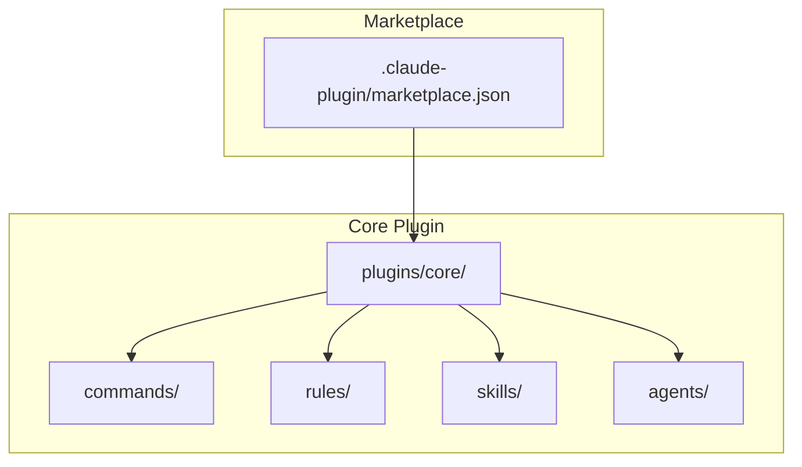
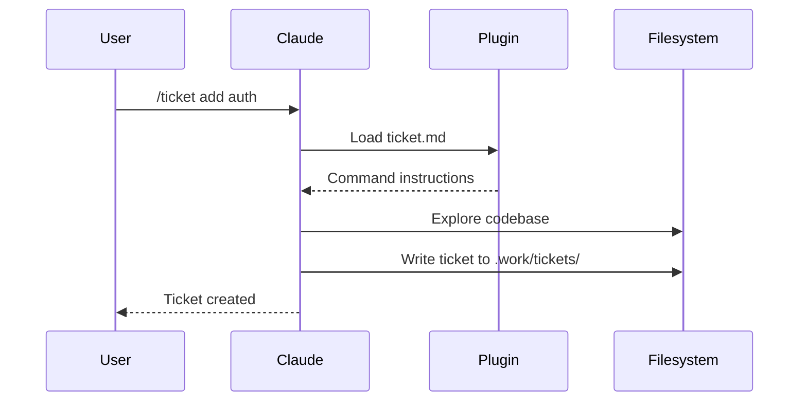

[English](architecture.md) | [日本語](architecture_ja.md)

# Architecture

Workaholic is a Claude Code plugin marketplace. It contains no runtime code; plugins are markdown files with JSON metadata that Claude Code interprets as commands, rules, skills, and agents.

## Marketplace Structure



## Directory Layout

```
.claude-plugin/
  marketplace.json       # Marketplace metadata and plugin list

plugins/
  core/
    .claude-plugin/
      plugin.json        # Plugin metadata
    agents/
      performance-analyst.md  # Decision review subagent
    commands/
      branch.md          # /branch command
      commit.md          # /commit command
      drive.md           # /drive command
      pull-request.md    # /pull-request command
      sync-src-doc.md    # /sync-src-doc command
      ticket.md          # /ticket command
    rules/
      diagrams.md      # Mermaid diagram requirements
      general.md       # Git workflow rules
      i18n.md          # Multi-language documentation rules
      typescript.md    # TypeScript coding standards
    skills/
      archive-ticket/
        SKILL.md
        scripts/
          archive.sh   # Shell script for commit workflow
      translate/
        SKILL.md       # Translation policies for i18n
```

## Plugin Types

### Commands

Commands are user-invocable via slash syntax (`/commit`, `/ticket`). Each command is a markdown file with YAML frontmatter defining the name and description, followed by instructions that Claude follows when the command is invoked.

### Rules

Rules are always-on guidelines that Claude follows throughout the conversation. They define coding standards, documentation requirements, and best practices.

### Skills

Skills are complex capabilities that may include scripts or multiple files. They are invoked via the Skill tool and provide inline instructions. The core plugin includes:

- **archive-ticket**: Shell script that handles the complete commit workflow (archive ticket, update CHANGELOG, commit)
- **translate**: Translation policies for converting English markdown files to other languages (primarily Japanese)

### Agents

Agents are specialized subagents that can be spawned to handle complex analysis tasks. They run in a subprocess with specific prompts and tools. The core plugin includes:

- **performance-analyst**: Evaluates decision-making quality across five viewpoints (Consistency, Intuitivity, Describability, Agility, Density) for PR descriptions

## How Claude Code Loads Plugins

When a user installs the marketplace with `/plugin marketplace add qmu/workaholic`, Claude Code:

1. Reads `.claude-plugin/marketplace.json` to find available plugins
2. For each plugin, reads `plugins/<name>/.claude-plugin/plugin.json`
3. Loads commands, rules, and skills from the plugin directories
4. Makes commands available as slash commands in the conversation

## Data Flow



## Documentation Enforcement

Workaholic enforces comprehensive documentation through the `/sync-doc-specs` command, which provides explicit control over documentation synchronization with code changes.

### How It Works

```mermaid
flowchart TD
    A[/pull-request command] --> B[Consolidate CHANGELOG]
    B --> C[/sync-doc-specs]
    C --> D[Read archived tickets]
    D --> E[Audit .work/specs/]
    E --> F[Update documentation]
    F --> G[Commit docs]
    G --> H[Create/update PR]
```

Documentation is updated automatically during the `/pull-request` workflow, which internally runs `/sync-doc-specs`. You can also run `/sync-doc-specs` directly at any time to update documentation. The command:

1. **Gathers context** - Reads archived tickets from `.work/tickets/archive/<branch-name>/` to understand what changed
2. **Audits current docs** - Surveys existing documentation in `.work/specs/`
3. **Updates documentation** - Creates, updates, or removes docs as needed, following documentation standards

### Critical Requirements

The `/sync-doc-specs` command enforces strict requirements:

- **Document every change** - No exceptions, no judgment calls about what's "worth" documenting
- **Never skip documentation** - "Internal implementation detail" is never a valid reason
- **Always report updates** - Must specify which files were created or modified
- **"No updates needed" is unacceptable** - Every change affects documentation somehow

### Design Policy

Documentation is mandatory, not optional. This reflects Workaholic's core principle of **cognitive investment**: developer cognitive load is the primary bottleneck in software productivity, so we invest heavily in generating structured knowledge artifacts to reduce this load.

The four primary artifact types are:

- **Tickets** - Change requests describing future and past work
- **Specs** - Current state snapshots serving as reference documentation
- **Stories** - Narrative accounts of the developer journey per branch
- **Changelogs** - Historical records of what changed and why

## Version Management

Versions are tracked in two places:

- **Marketplace version**: `.claude-plugin/marketplace.json` - bumped with `/release`
- **Plugin versions**: `plugins/<name>/.claude-plugin/plugin.json` - updated when plugin changes

Keep these in sync when releasing.
