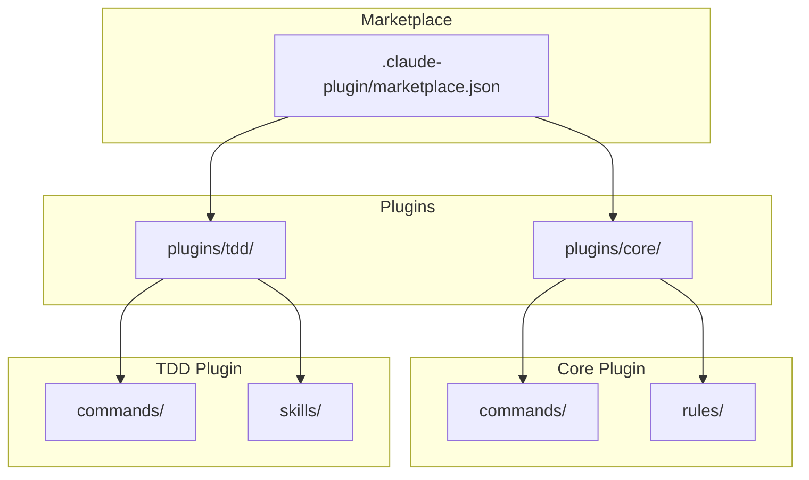

[English](architecture.md) | [日本語](architecture_ja.md)

# アーキテクチャ

WorkaholicはClaude Codeプラグインマーケットプレイスです。ランタイムコードを含まず、プラグインはClaude Codeがコマンド、ルール、スキルとして解釈するJSONメタデータを持つマークダウンファイルです。

## マーケットプレイス構造



## ディレクトリレイアウト

```
.claude-plugin/
  marketplace.json       # マーケットプレイスのメタデータとプラグインリスト

plugins/
  core/
    .claude-plugin/
      plugin.json        # プラグインメタデータ
    commands/
      branch.md          # /branch コマンド
      commit.md          # /commit コマンド
      pull-request.md    # /pull-request コマンド
    rules/
      general.md
      typescript.md

  tdd/
    .claude-plugin/
      plugin.json        # プラグインメタデータ
    commands/
      ticket.md          # /ticket コマンド
      drive.md           # /drive コマンド
      sync-doc-specs.md  # /sync-doc-specs コマンド
    skills/
      archive-ticket/
        SKILL.md
        scripts/
          archive.sh     # コミットワークフロー用シェルスクリプト
```

## プラグインタイプ

### コマンド

コマンドはスラッシュ構文（`/commit`、`/ticket`）でユーザーが呼び出せます。各コマンドは名前と説明を定義するYAMLフロントマター付きのマークダウンファイルで、その後にコマンドが呼び出されたときにClaudeが従う指示が続きます。

### ルール

ルールは会話中ずっとClaudeが従う常時オンのガイドラインです。コーディング規約、ドキュメント要件、ベストプラクティスを定義します。

### スキル

スキルはスクリプトや複数のファイルを含む可能性のある複雑な機能です。Skillツールで呼び出され、インライン指示を提供します。TDDプラグインには以下のスキルが含まれます：

- **archive-ticket**: 完全なコミットワークフロー（チケットのアーカイブ、CHANGELOG更新、コミット）を処理するシェルスクリプト

## Claude Codeがプラグインをロードする方法

ユーザーが`/plugin marketplace add qmu/workaholic`でマーケットプレイスをインストールすると、Claude Codeは：

1. `.claude-plugin/marketplace.json`を読んで利用可能なプラグインを見つける
2. 各プラグインについて`plugins/<name>/.claude-plugin/plugin.json`を読む
3. プラグインディレクトリからコマンド、ルール、スキルをロードする
4. コマンドを会話内のスラッシュコマンドとして利用可能にする

## データフロー


## ドキュメント強制

Workaholicは`/sync-doc-specs`コマンドを通じて包括的なドキュメントを強制し、コード変更とのドキュメント同期を明示的に制御します。

### 仕組み

```mermaid
flowchart TD
    A[/pull-request コマンド] --> B[CHANGELOG統合]
    B --> C[/sync-doc-specs]
    C --> D[アーカイブされたチケットを読む]
    D --> E[.work/specs/を監査]
    E --> F[ドキュメントを更新]
    F --> G[docsをコミット]
    G --> H[PRを作成/更新]
```

ドキュメントは`/pull-request`ワークフロー中に自動的に更新され、内部的に`/sync-doc-specs`を実行します。いつでも直接`/sync-doc-specs`を実行してドキュメントを更新することもできます。コマンドは：

1. **コンテキストを収集** - `.work/tickets/archive/<branch-name>/`からアーカイブされたチケットを読んで何が変更されたかを理解
2. **現在のドキュメントを監査** - `.work/specs/`内の既存ドキュメントを調査
3. **ドキュメントを更新** - ドキュメント基準に従って必要に応じてドキュメントを作成、更新、削除

### 重要な要件

`/sync-doc-specs`コマンドは厳格な要件を強制します：

- **すべての変更をドキュメント化** - 例外なし、何が「ドキュメント化する価値がある」かの判断なし
- **ドキュメントをスキップしない** - 「内部実装の詳細」は決して有効な理由にならない
- **常に更新を報告** - どのファイルが作成または変更されたかを指定する必要がある
- **「更新不要」は受け入れられない** - すべての変更は何らかの形でドキュメントに影響する

### 設計ポリシー

ドキュメントは任意ではなく必須です。これはWorkaholicのコア原則である**認知投資**を反映しています：開発者の認知負荷はソフトウェア生産性の主要なボトルネックであり、この負荷を軽減するために構造化された知識成果物の生成に積極的に投資します。

4つの主要な成果物タイプは：

- **Tickets** - 将来と過去の作業を記述する変更リクエスト
- **Specs** - リファレンスドキュメントとして機能する現状のスナップショット
- **Stories** - ブランチごとの開発者の旅のナラティブ
- **Changelogs** - 何が変更され、なぜ変更されたかの履歴記録

## バージョン管理

バージョンは2箇所で追跡されます：

- **マーケットプレイスバージョン**: `.claude-plugin/marketplace.json` - `/release`でバンプ
- **プラグインバージョン**: `plugins/<name>/.claude-plugin/plugin.json` - プラグイン変更時に更新

リリース時にこれらを同期させてください。
