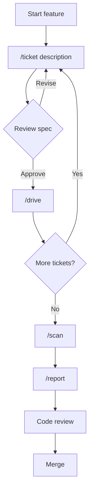

[English](workflow.md) | [日本語](workflow_ja.md)

# Workflow Guide

Workaholic uses a ticket-driven development approach where implementation planning happens locally in your repository rather than in GitHub issues.

## The Local-First Approach

Traditional development creates GitHub issues, discusses requirements in comments, waits for assignment, and only then begins implementation. Workaholic inverts this: you write specs locally, implement immediately after approval, and only touch GitHub when opening a pull request.

This works well for solo developers and small teams who want to move quickly without coordination overhead. Planning artifacts remain as markdown files in your repository, providing the same documentation benefits without the context switching.

## Workflow Diagram



## Step-by-Step

### 1. Write a Ticket

Describe what you want to implement:

```bash
/ticket add dark mode toggle to settings
```

Claude explores your codebase, understands the architecture, and generates a detailed implementation spec. Review the spec in `.workaholic/tickets/todo/` and revise if needed. When invoked on `main` or `master`, the command automatically creates a timestamped topic branch first.

### 2. Implement the Ticket

Run drive to implement:

```bash
/drive
```

Claude follows the spec, makes changes, and runs any type checks. After implementation, Claude asks for your approval. You have four options: approve to continue, approve and stop to finish, request changes for adjustments, or abandon if the approach isn't working. Approvals trigger a Final Report documenting deviations and discoveries. Abandoned attempts get a Failure Analysis documenting what was tried and insights for future attempts.

### 3. Repeat as Needed

For multi-ticket features, write additional tickets and run `/drive` again. Each ticket becomes one commit with a clear purpose.

### 4. Update Documentation

Run a full documentation scan to update all specs, policies, terms, and changelog:

```bash
/scan
```

The scan command invokes 15 documentation agents in two phases: three managers establish strategic context, then twelve leaders and writers produce domain-specific documentation.

### 5. Generate Report and Create Pull Request

When ready for review:

```bash
/report
```

The command runs documentation generation in two phases. In Phase 1, four subagents run in parallel: changelog-writer updates `CHANGELOG.md`, spec-writer updates `.workaholic/specs/`, terms-writer updates `.workaholic/terms/`, and release-readiness analyzes changes. In Phase 2, story-writer generates the PR narrative using the release-readiness output. After documentation is committed, the pr-creator subagent creates or updates the GitHub PR. The PR summary is generated from the story file, which synthesizes all archived tickets into a coherent narrative with eleven sections: Overview, Motivation, Journey (with embedded Topic Tree flowchart), Changes, Outcome, Historical Analysis, Concerns, Ideas, Performance, Release Preparation, and Notes.

## Directory Structure

Tickets follow this structure:

```
.workaholic/tickets/
├── todo/                           # Queued tickets
│   ├── 20260123-add-dark-mode.md
│   └── 20260123-fix-login-bug.md
├── icebox/                         # Deferred tickets
│   └── 20260120-refactor-db.md
├── fail/                           # Failed attempts with analysis
│   └── 20260123-abandoned-attempt.md
└── archive/
    └── feat-20260123-143022/       # Branch-specific archive
        └── 20260122-add-auth.md    # Completed ticket with Final Report
```

Each ticket includes YAML frontmatter with metadata: `date`, `author`, `type`, `layer`, `effort`, plus `commit_hash` and `category` added when archived.

Completed tickets include a "Final Report" section that documents whether implementation went as planned, any deviations that occurred, and discovered insights about the codebase. Abandoned attempts include a "Failure Analysis" section documenting what was tried, why it failed, and learnings for future attempts. This creates a historical record of decisions and discoveries made during implementation.

## Benefits

The ticket-driven approach provides several advantages. Specs are reviewed before implementation, catching issues early. Each commit maps to one ticket, creating clean history. Tickets serve as the single source of truth for change metadata, and the root CHANGELOG is auto-generated from them during PR creation. All planning artifacts stay in the repository for future reference. Final Reports in archived tickets document what actually happened during implementation and insights discovered, preserving institutional knowledge. Failure Analysis in abandoned tickets preserves learning from unsuccessful attempts. Branch stories synthesize the entire development journey into a narrative with embedded commit links, giving reviewers quick context before diving into individual changes. Performance metrics in stories use hours for single-session work and business days for multi-day work, providing meaningful velocity measurements rather than misleading raw elapsed time.

## When to Use Icebox

Use icebox for tickets you want to defer:

```bash
/ticket icebox optimize image loading
```

Later, retrieve from icebox:

```bash
/drive icebox
```

This lets you capture ideas without committing to immediate implementation.

## Exploration Workflow (Trippin Plugin)

For exploratory or creative development, use the `/trip` command:

```bash
/trip design a notification system for real-time updates
```

This launches a three-agent collaborative session (Planner, Architect, Constructor) in an isolated git worktree. The agents work through a two-phase Implosive Structure protocol: first agreeing on specification artifacts (Direction, Model, Design), then implementing and testing. Every step produces a git commit for full traceability. After completion, the trip branch can be merged or inspected independently.
