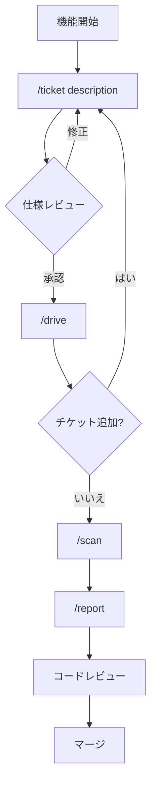

[English](workflow.md) | [日本語](workflow_ja.md)

# ワークフローガイド

Workaholicはチケット駆動開発アプローチを使用します。実装計画はGitHub issuesではなく、リポジトリ内でローカルに行われます。

## ローカルファーストアプローチ

従来の開発ではGitHub issuesを作成し、コメントで要件を議論し、アサインを待ち、それから実装を開始します。Workaholicはこれを逆転させます：仕様をローカルで記述し、承認後すぐに実装し、プルリクエストを開くときだけGitHubに触れます。

これはコーディネーションのオーバーヘッドなしに素早く動きたいソロ開発者や小規模チームに適しています。計画成果物はリポジトリ内のマークダウンファイルとして残り、コンテキストスイッチングなしで同じドキュメントの利点を提供します。

## ワークフロー図



## ステップバイステップ

### 1. チケットを記述

実装したい内容を説明します：

```bash
/ticket add dark mode toggle to settings
```

Claudeはコードベースを調査し、アーキテクチャを理解し、詳細な実装仕様を生成します。`.workaholic/tickets/todo/`の仕様を確認し、必要に応じて修正します。`main`または`master`ブランチで実行すると、自動的にタイムスタンプ付きトピックブランチが作成されます。

### 2. チケットを実装

driveを実行して実装します：

```bash
/drive
```

Claudeは仕様に従い、変更を行い、型チェックを実行します。実装後、承認を求めます。4つのオプションがあります：承認して続行、承認して停止、変更を要求する、または方法が機能していない場合は放棄します。承認すると、計画からの逸脱と発見を文書化するFinal Reportをチケットに書き込みます。放棄すると、試みたこと、失敗した理由、および将来の試みのための洞察を文書化する失敗分析が書き込まれます。

### 3. 必要に応じて繰り返し

複数チケットの機能の場合、追加のチケットを記述し、再度`/drive`を実行します。各チケットは明確な目的を持つ1つのコミットになります。

### 4. ドキュメントを更新

フルドキュメントスキャンを実行して、すべてのspec、policy、term、changelogを更新します：

```bash
/scan
```

scan commandは15のドキュメントagentを2つのフェーズで実行します：3つのmanagerが戦略的コンテキストを確立し、12のleaderとwriterがドメイン固有のドキュメントを生成します。

### 5. レポートを生成してプルリクエストを作成

レビューの準備ができたら：

```bash
/report
```

コマンドは2つのフェーズでドキュメント生成を実行します。フェーズ1では4つのサブエージェントが並列実行されます：changelog-writerが`CHANGELOG.md`を更新し、spec-writerが`.workaholic/specs/`を更新し、terms-writerが`.workaholic/terms/`を更新し、release-readinessが変更を分析します。フェーズ2では、story-writerがrelease-readiness出力を使用してPRナラティブを生成します。ドキュメントがコミットされた後、pr-creatorサブエージェントがGitHub PRを作成または更新します。PRサマリーはストーリーファイルから生成され、すべてのアーカイブされたチケットを11のセクション（Overview、Motivation、Journey（Topic Treeフローチャートを含む）、Changes、Outcome、Historical Analysis、Concerns、Ideas、Performance、Release Preparation、Notes）を持つ一貫したナラティブに統合します。

## ディレクトリ構造

チケットは以下の構造に従います：

```
.workaholic/tickets/
├── todo/                           # キューに入ったチケット
│   ├── 20260123-add-dark-mode.md
│   └── 20260123-fix-login-bug.md
├── icebox/                         # 延期されたチケット
│   └── 20260120-refactor-db.md
├── fail/                           # 分析を含む失敗した試み
│   └── 20260123-abandoned-attempt.md
└── archive/
    └── feat-20260123-143022/       # ブランチ固有のアーカイブ
        └── 20260122-add-auth.md    # Final Report付きの完了したチケット
```

各チケットにはメタデータを持つYAMLフロントマターが含まれます：`date`、`author`、`type`、`layer`、`effort`、およびアーカイブ時に追加される`commit_hash`と`category`。

完了したチケットには、実装が計画通りに進んだか、開発中に発生した逸脱、およびコードベースについて発見された洞察を文書化する「Final Report」セクションが含まれます。放棄した試みには、試みたこと、失敗した理由、および将来の試みのための学習を文書化する「失敗分析」セクションが含まれます。これにより、実装中に行われた決定と発見の履歴記録が作成されます。

## メリット

チケット駆動アプローチにはいくつかの利点があります。仕様は実装前にレビューされ、問題を早期に発見できます。各コミットは1つのチケットにマップされ、クリーンな履歴を作成します。チケットは変更メタデータの単一の真実の情報源として機能し、ルートCHANGELOGはPR作成時にそれらから自動生成されます。すべての計画成果物は将来の参照のためにリポジトリに残ります。アーカイブされたチケットのFinal Reportsは実装中に実際に起こったことおよび発見された洞察を文書化し、組織の知識を保存します。放棄されたチケットの失敗分析は失敗した試みから学習を保存します。ブランチストーリーは開発の全体的な旅をナラティブに合成し、埋め込まれたコミットリンク付きで、レビュアーに個々の変更に入る前の素早いコンテキストを提供します。ストーリー内のパフォーマンスメトリクスは単一セッションの作業には時間を、複数日にわたる作業にはbusiness dayを使用し、誤解を招く生の経過時間ではなく意味のある速度測定を提供します。

## iceboxの使用タイミング

延期したいチケットにはiceboxを使用します：

```bash
/ticket icebox optimize image loading
```

後でiceboxから取り出します：

```bash
/drive icebox
```

これにより、即座の実装にコミットせずにアイデアを記録できます。

## 探索 workflow（Trippin Plugin）

探索的または創造的な開発には、`/trip` commandを使用します：

```bash
/trip design a notification system for real-time updates
```

3つの協調agent（Planner、Architect、Constructor）によるセッションを隔離されたgit worktreeで起動します。agentは2フェーズのImplosive Structure protocolに従って作業します：まずspecification artifact（Direction、Model、Design）について合意し、次に実装とテストを行います。すべてのステップがgit commitを生成し、完全な追跡可能性を提供します。完了後、tripブランチは独立してマージまたは検査できます。
