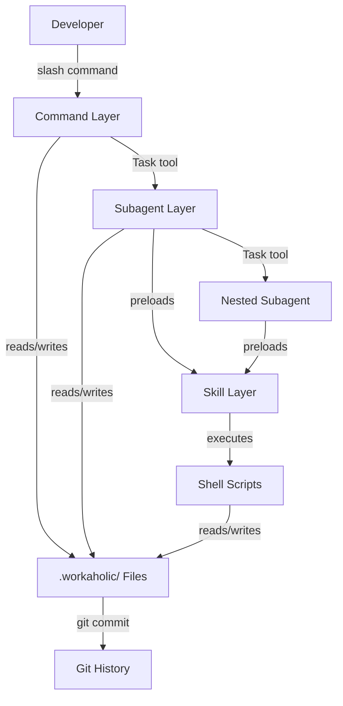

[English](application.md) | [Japanese](application_ja.md)

# 1. Application Viewpoint

The Application Viewpoint describes how Workaholic behaves at runtime, focusing on agent orchestration patterns, data flow between components, and the execution model that governs how commands produce artifacts. The system operates as a directed acyclic graph of agent invocations, where each slash command triggers a cascade of subagent and skill executions within Claude Code's runtime.

## 2. Execution Model

Workaholic commands execute within Claude Code's conversation context. When a user invokes a slash command, Claude Code loads the corresponding command markdown file, which contains orchestration instructions. The command then uses the Task tool to spawn subagents, each running in their own context with preloaded skills. Subagents can spawn further subagents, creating a tree of concurrent or sequential invocations. Skills provide the domain knowledge and shell script execution that subagents need to perform their work.

All file operations (reading, writing, editing) and shell command execution happen through Claude Code's tool infrastructure. Agents communicate results back to their callers through their output, which typically follows a structured JSON format defined in the agent's markdown file.

## 3. Agent Orchestration

### 3-1. Ticket Command Flow

```
/ticket --> ticket-organizer (opus)
              |-- ticket-discoverer (parallel)
              |-- source-discoverer (parallel)
              |-- history-discoverer (parallel)
              --> Creates ticket file
```

The `/ticket` command delegates entirely to the `ticket-organizer` subagent, which runs three discovery agents in parallel to gather context, then writes the ticket.

### 3-2. Drive Command Flow

```
/drive --> drive-navigator (opus)
             --> Returns prioritized ticket list
           For each ticket:
             Main context: implement (drive-workflow skill)
             Main context: approval dialog (drive-approval skill)
             Main context: final report (write-final-report skill)
             Main context: archive (archive-ticket skill)
```

The `/drive` command invokes the navigator once, then processes tickets in the main conversation context using preloaded skills. This keeps implementation context visible and preserves state across the approval loop.

### 3-3. Scan Command Flow

```
/scan --> scanner (opus)
            |-- 8 viewpoint analysts (sonnet, parallel)
            |-- 7 policy analysts (sonnet, parallel)
            |-- changelog-writer (sonnet, parallel)
            |-- terms-writer (sonnet, parallel)
            --> Validate output
            --> Update index files
```

The `/scan` command invokes the scanner, which spawns all 17 agents in a single parallel batch. After all agents complete, the scanner validates output files exist and are non-empty before updating README index files.

### 3-4. Report Command Flow

```
/report --> story-writer (opus)
              |-- overview-writer (parallel)
              |-- performance-analyst (parallel)
              |-- section-reviewer (parallel)
              |-- changelog-writer (parallel)
              |-- terms-writer (parallel)
              |-- pr-creator (parallel)
              --> Generates story and PR
```

The `/report` command delegates to the story-writer, which orchestrates multiple parallel agents to prepare content, then creates the pull request.

## 4. Data Flow

Data flows through the system as markdown files and git operations. The primary flow is:

1. **Input**: Developer provides a natural language description
2. **Discovery**: Agents read the codebase, tickets, and git history
3. **Generation**: Agents produce markdown artifacts in `.workaholic/`
4. **Versioning**: Git commits capture each atomic change
5. **Delivery**: Stories and changelogs populate pull request descriptions

All intermediate state is persisted as files in `.workaholic/`, making the entire workflow inspectable and reproducible. There is no in-memory state that survives between command invocations beyond what Claude Code maintains in its conversation context.

## 5. Concurrency Patterns

The system uses two concurrency patterns. The first is parallel agent invocation, where multiple subagents are spawned simultaneously using multiple Task tool calls in a single message. This is used extensively in `/scan` (17 parallel analysts) and `/report` (6 parallel agents). The second pattern is sequential processing with interactive approval, used in `/drive` where tickets are processed one at a time with human confirmation between each.

## 6. Model Selection

Commands specify which Claude model each subagent should use:

| Agent Type | Model | Rationale |
| --- | --- | --- |
| Top-level orchestrators | opus | Complex decision-making, multi-step workflows |
| Viewpoint/policy analysts | sonnet | Focused analysis tasks, cost efficiency |
| Documentation writers | sonnet | Structured output generation |

## 7. Diagram



## 8. Assumptions

- [Explicit] The nesting hierarchy and model selection are documented in command files and `CLAUDE.md`.
- [Explicit] The scanner invokes 17 agents in parallel, as defined in `scanner.md`.
- [Explicit] Drive processes tickets sequentially with approval, as defined in `drive.md`.
- [Inferred] Conversation context is the primary mechanism for maintaining state during multi-step operations like `/drive`, as no external state management system exists.
- [Inferred] The choice of opus for orchestrators and sonnet for analysts reflects a cost-performance optimization, trading model capability for throughput in focused analysis tasks.
