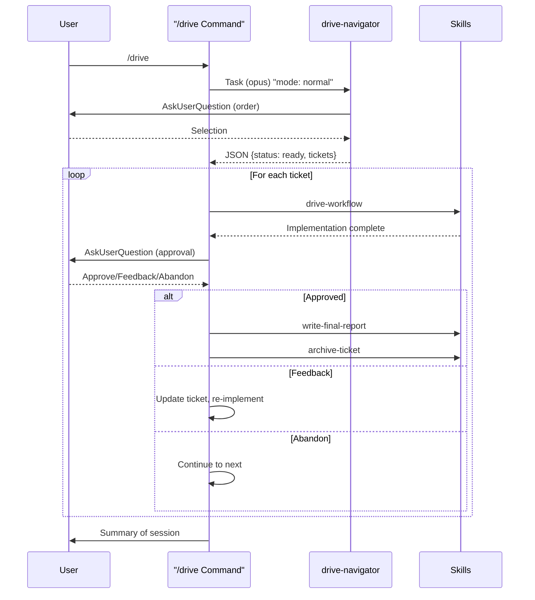
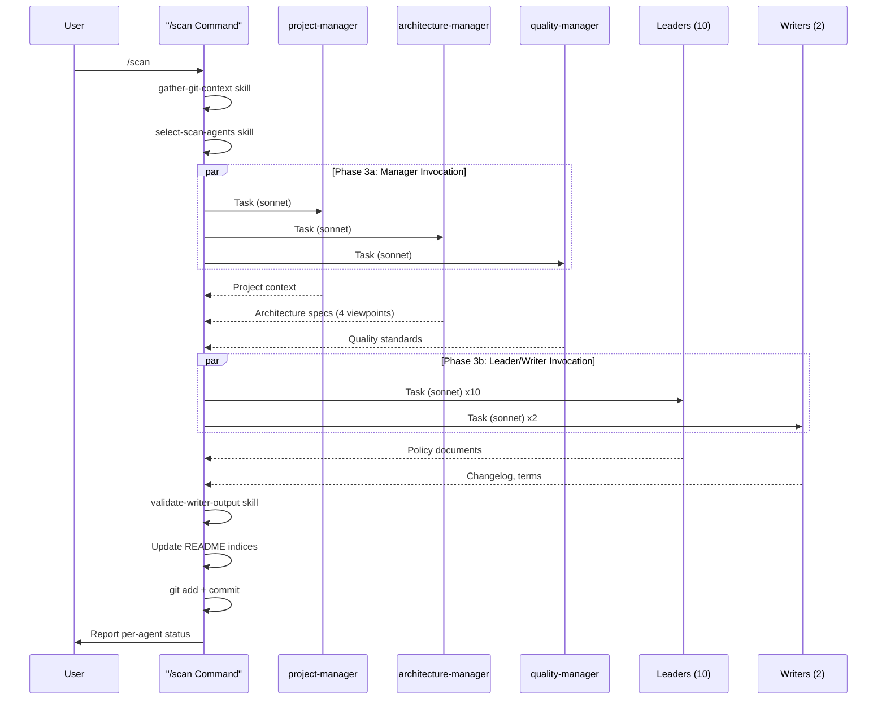
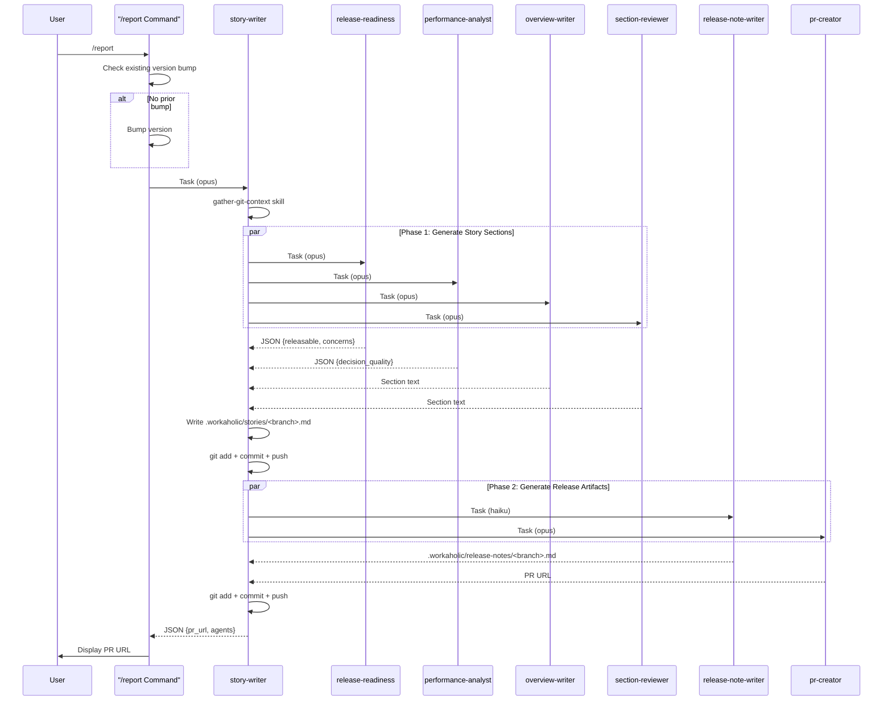
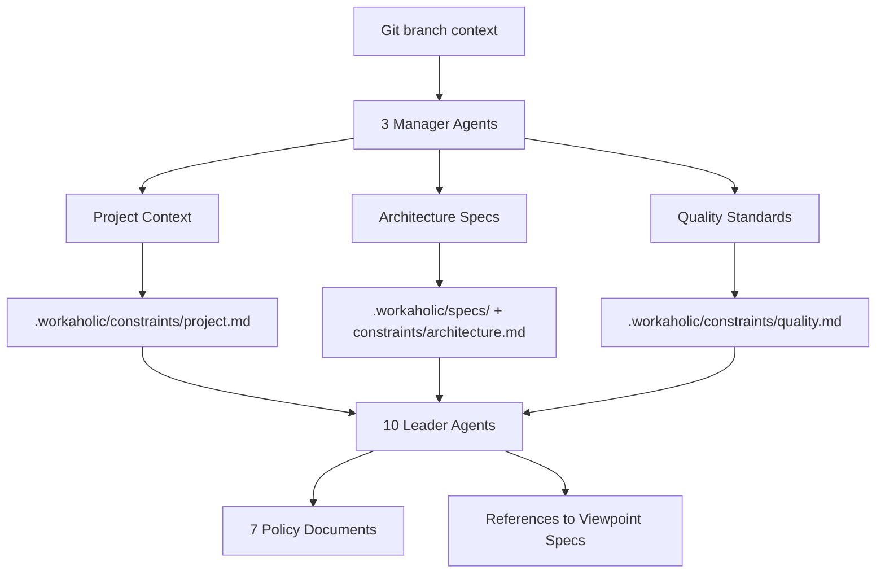
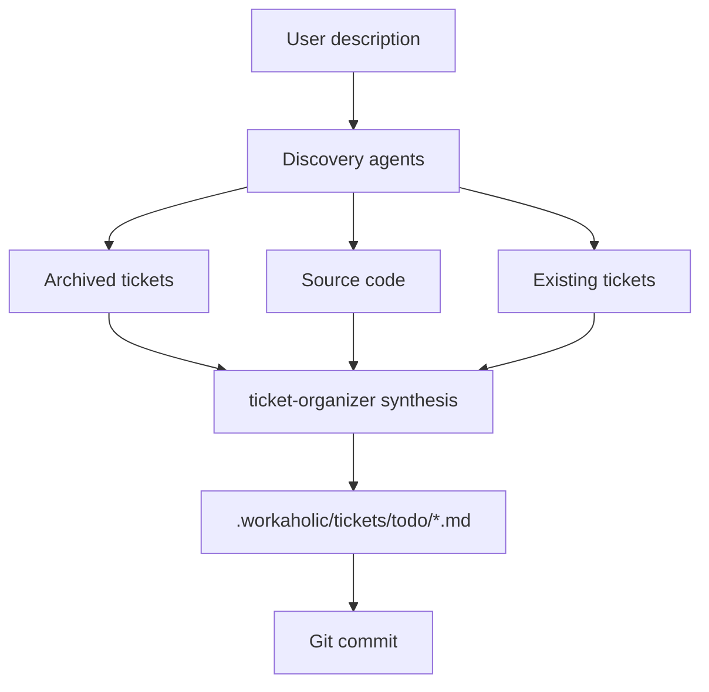
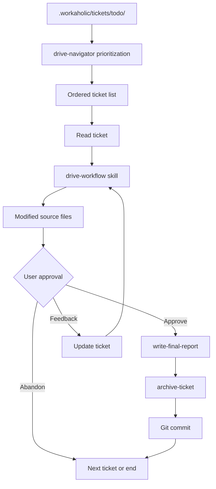
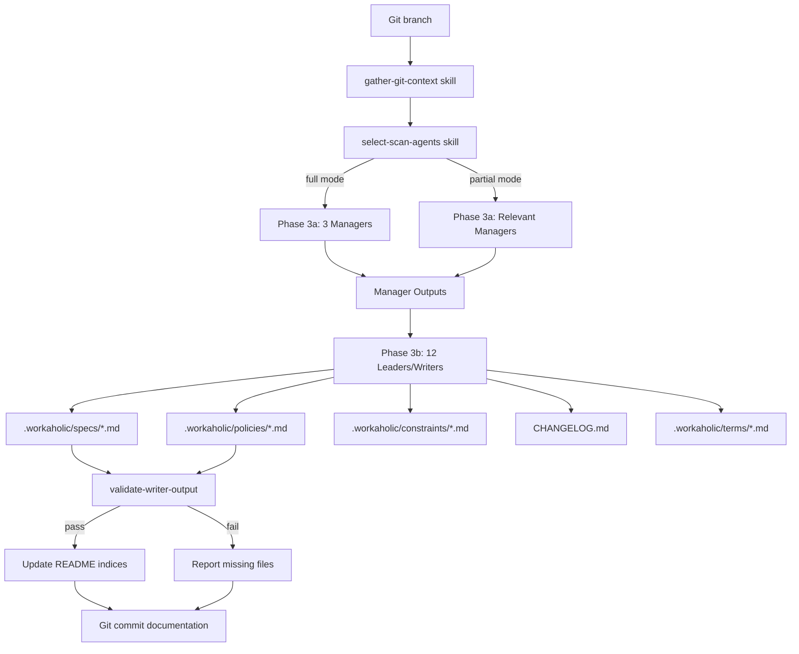
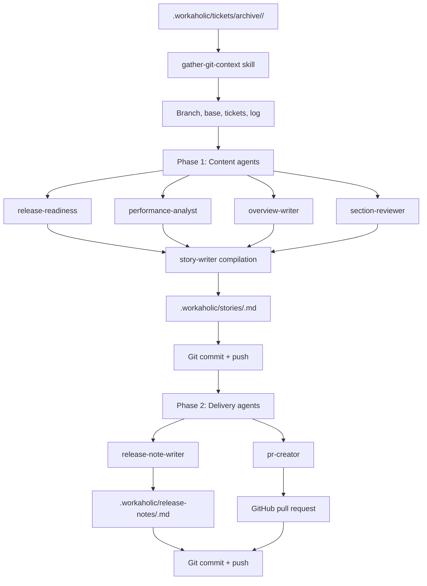

[English](application.md) | [Japanese](application_ja.md)

# Application Viewpoint

The Application Viewpoint describes how Workaholic behaves at runtime, focusing on agent orchestration patterns, data flow between components, and the execution model that governs how commands produce artifacts. The system operates as a directed acyclic graph of agent invocations, where each slash command triggers a cascade of manager, leader, and writer agent executions within Claude Code's runtime. The recent introduction of a manager tier establishes a two-phase execution model where strategic context is produced before domain-specific analysis begins.

## Orchestration Model

Workaholic follows a four-layer orchestration architecture: commands at the top, manager agents in the second layer, leader/writer agents in the third layer, and skills at the bottom. Commands orchestrate workflows by invoking agents through Claude Code's Task tool. Manager agents produce strategic outputs (project context, architectural structure, quality standards) that leader agents consume. Leader agents perform domain-specific analysis using manager outputs as context. Skills contain domain knowledge, templates, and shell scripts that implement the actual operations.

The orchestration model enforces strict nesting rules. Commands can invoke skills and agents. Agents can invoke skills and other agents. Skills can invoke other skills but never agents or commands. This hierarchy prevents circular dependencies and maintains clear separation of concerns between workflow orchestration (commands and agents) and operational knowledge (skills).

### Two-Phase Execution Model

The scan command implements a two-phase agent orchestration model introduced to support the manager tier. Phase 3a invokes three manager agents in parallel: project-manager, architecture-manager, and quality-manager. These managers gather context, analyze the codebase, and produce strategic outputs under `.workaholic/specs/`, `.workaholic/policies/`, and `.workaholic/constraints/`. Phase 3b waits for all managers to complete, then invokes twelve leader and writer agents in parallel. Leaders read manager outputs as strategic input before performing their domain-specific analysis.

This two-phase pattern ensures leaders have consistent strategic context without duplicating business, architectural, or quality analysis. The manager tier establishes project constraints, structural boundaries, and quality standards that leaders reference in their domain-specific documentation.

### Command-Level Orchestration Patterns

#### Ticket Command Orchestration

```mermaid
sequenceDiagram
    participant User
    participant ticket as "/ticket Command"
    participant to as ticket-organizer
    participant hd as history-discoverer
    participant sd as source-discoverer
    participant td as ticket-discoverer

    User->>ticket: /ticket "Add feature X"
    ticket->>to: Task (opus)

    par Parallel Discovery
        to->>hd: Task (opus)
        hd-->>to: JSON {summary, tickets}
        to->>sd: Task (opus)
        sd-->>to: JSON {files, code_flow}
        to->>td: Task (opus)
        td-->>to: JSON {status, recommendation}
    end

    to->>to: Write ticket(s)
    to-->>ticket: JSON {status, tickets}
    ticket->>User: Present ticket location
```

The `/ticket` command delegates entirely to the ticket-organizer subagent, which orchestrates three parallel discovery agents to gather historical context, source code locations, and duplicate detection. After all discovery agents complete, the organizer synthesizes results into one or more ticket files. The ticket command handles git commit operations and user presentation.

#### Drive Command Orchestration

```mermaid
sequenceDiagram
    participant User
    participant drive as "/drive Command"
    participant nav as drive-navigator
    participant skill as Skills

    User->>drive: /drive
    drive->>nav: Task (opus) "mode: normal"
    nav->>User: AskUserQuestion (order)
    User-->>nav: Selection
    nav-->>drive: JSON {status: ready, tickets}

    loop For each ticket
        drive->>skill: drive-workflow
        skill-->>drive: Implementation complete
        drive->>User: AskUserQuestion (approval)
        User-->>drive: Approve/Feedback/Abandon

        alt Approved
            drive->>skill: write-final-report
            drive->>skill: archive-ticket
        else Feedback
            drive->>drive: Update ticket, re-implement
        else Abandon
            drive->>drive: Continue to next
        end
    end

    drive->>User: Summary of session
```

The `/drive` command uses the drive-navigator subagent once to prioritize tickets, then processes each ticket sequentially in the main command context. This keeps implementation context visible to the user and preserves state across the approval loop. The command uses preloaded skills (drive-workflow, write-final-report, archive-ticket) rather than delegating to subagents, maintaining full control over the interactive approval flow.

#### Scan Command Two-Phase Orchestration

```mermaid
sequenceDiagram
    participant User
    participant scan as "/scan Command"
    participant PM as project-manager
    participant AM as architecture-manager
    participant QM as quality-manager
    participant Leaders as Leaders (10)
    participant Writers as Writers (2)

    User->>scan: /scan
    scan->>scan: gather-git-context skill
    scan->>scan: select-scan-agents skill

    par Phase 3a: Manager Invocation
        scan->>PM: Task (sonnet)
        scan->>AM: Task (sonnet)
        scan->>QM: Task (sonnet)
    end

    PM-->>scan: Project context
    AM-->>scan: Architecture specs (4 viewpoints)
    QM-->>scan: Quality standards

    par Phase 3b: Leader/Writer Invocation
        scan->>Leaders: Task (sonnet) x10
        scan->>Writers: Task (sonnet) x2
    end

    Leaders-->>scan: Policy documents
    Writers-->>scan: Changelog, terms

    scan->>scan: validate-writer-output skill
    scan->>scan: Update README indices
    scan->>scan: git add + commit
    scan->>User: Report per-agent status
```

The `/scan` command implements direct two-phase parallel orchestration. Phase 3a invokes three managers to establish strategic context. Phase 3b invokes all leaders and writers, which read manager outputs before producing their domain-specific documentation. This pattern replaced the previous flat 17-agent parallel execution with a hierarchical model that enforces dependency between strategic and tactical analysis.

#### Report Command Orchestration

```mermaid
sequenceDiagram
    participant User
    participant report as "/report Command"
    participant sw as story-writer
    participant rr as release-readiness
    participant pa as performance-analyst
    participant ow as overview-writer
    participant sr as section-reviewer
    participant rnw as release-note-writer
    participant pc as pr-creator

    User->>report: /report
    report->>report: Check existing version bump
    alt No prior bump
        report->>report: Bump version
    end
    report->>sw: Task (opus)
    sw->>sw: gather-git-context skill

    par Phase 1: Generate Story Sections
        sw->>rr: Task (opus)
        sw->>pa: Task (opus)
        sw->>ow: Task (opus)
        sw->>sr: Task (opus)
    end

    rr-->>sw: JSON {releasable, concerns}
    pa-->>sw: JSON {decision_quality}
    ow-->>sw: Section text
    sr-->>sw: Section text

    sw->>sw: Write .workaholic/stories/<branch>.md
    sw->>sw: git add + commit + push

    par Phase 2: Generate Release Artifacts
        sw->>rnw: Task (haiku)
        sw->>pc: Task (opus)
    end

    rnw-->>sw: .workaholic/release-notes/<branch>.md
    pc-->>sw: PR URL

    sw->>sw: git add + commit + push
    sw-->>report: JSON {pr_url, agents}
    report->>User: Display PR URL
```

The `/report` command implements idempotent version bumping by checking for existing "Bump version" commits in the current branch before incrementing the version. This prevents double version increments when `/report` is called multiple times on the same branch (e.g., to update the PR after additional commits). The check uses the branching skill's `check-version-bump.sh` script, which runs `git log main..HEAD --oneline --grep="Bump version"` and returns JSON with `already_bumped` status. If a bump commit exists, the version bump step is skipped entirely. If no bump commit exists, the report command proceeds with the standard version increment logic.

After version bumping (or skipping if already bumped), the command delegates to the story-writer subagent, which orchestrates two phases of parallel agent invocation. Phase 1 generates story content sections using four parallel agents. Phase 2 generates release notes and creates the pull request using two more parallel agents. The story-writer handles all git operations and returns the PR URL to the report command for display.

### Manager Tier Responsibilities

The three manager agents establish the strategic backbone of the project through constraint-setting and context production:

**project-manager**: Produces project context covering business domain, stakeholder map, timeline status, active issues, and proposed solutions. Consumed primarily by delivery-lead and ux-lead, though all leaders benefit from project context. Produces constraints to `.workaholic/constraints/project.md` following the constraint file template.

**architecture-manager**: Produces architectural context including system boundaries, layer taxonomy, component inventory, cross-cutting concerns, and structural patterns. Also produces four viewpoint specs (application.md, component.md, feature.md, usecase.md) that were formerly produced by the removed architecture-lead. Consumed by infra-lead, db-lead, security-lead, observability-lead, and recovery-lead. Produces constraints to `.workaholic/constraints/architecture.md`.

**quality-manager**: Produces quality context covering quality dimensions and standards, assurance process definitions, improvement metrics, and feedback loop specifications. Consumed by quality-lead, test-lead, and a11y-lead. Produces constraints to `.workaholic/constraints/quality.md`.

Managers follow a constraint-setting workflow defined in managers-principle: analyze the current state to identify unbounded or implicit constraints, ask targeted questions to understand user intent, propose falsifiable constraints grounded in evidence, and produce structured constraint files to `.workaholic/constraints/` plus additional directional materials (guidelines, roadmaps, decision records) to `.workaholic/` as appropriate.

### Leader Tier Responsibilities

The ten leader agents produce domain-specific policy documents by consuming manager outputs as strategic context and analyzing the codebase through their specialized lenses:

**ux-lead**: Produces ux.md documenting user experience, interaction patterns, user journeys, and onboarding paths. Renamed from communication-lead to align with UX-focused scope. Reads manage-project output for stakeholder context before analysis.

**infra-lead**: Produces infrastructure.md documenting external dependencies, deployment configuration, and runtime environment. Reads manage-architecture output for system boundaries before analysis.

**db-lead**: Produces data.md documenting data formats, storage mechanisms, and persistence patterns. Reads manage-architecture output for component inventory before analysis.

**security-lead**: Produces security.md documenting security requirements, threat model, and mitigation strategies. Reads manage-architecture output for system boundaries and cross-cutting concerns before analysis.

**test-lead**: Produces test.md documenting testing strategy, test types, and coverage requirements. Reads manage-quality output for quality standards before analysis.

**quality-lead**: Produces quality.md documenting code quality standards, review processes, and quality gates. Reads manage-quality output for assurance processes before analysis.

**a11y-lead**: Produces accessibility.md documenting accessibility standards, WCAG conformance, and inclusive design practices. Reads manage-quality output for quality standards before analysis.

**observability-lead**: Produces observability.md documenting logging, monitoring, and tracing practices. Reads manage-architecture output for cross-cutting concerns before analysis.

**delivery-lead**: Produces delivery.md documenting release processes, deployment strategies, and rollback procedures. Reads manage-project output for timeline and stakeholder context before analysis.

**recovery-lead**: Produces recovery.md documenting backup strategies, disaster recovery procedures, and business continuity plans. Reads manage-architecture output for system boundaries and manage-project output for active issues before analysis.

### Parallel vs Sequential Execution

The system uses two distinct concurrency patterns based on the nature of the work. Parallel execution is used when multiple independent tasks can proceed simultaneously without interdependencies. Sequential execution is used when tasks depend on previous results or require human interaction between steps.

Commands that invoke multiple agents for data gathering or analysis use parallel Task tool calls in a single message. The `/scan` command invokes 3 managers in phase 3a and 12 agents in phase 3b. The story-writer invokes 4 agents in phase 1 and 2 agents in phase 2. The ticket-organizer invokes 3 discovery agents concurrently. This parallel pattern maximizes throughput for independent analysis tasks.

However, phase 3a must complete before phase 3b begins because leaders depend on manager outputs. This inter-phase dependency prevents fully parallel execution across all 15 agents, but intra-phase parallelism (3 managers in parallel, 12 agents in parallel) still provides significant performance benefits.

Commands that implement user workflows use sequential execution with approval gates. The `/drive` command processes tickets one at a time, waiting for user approval after each implementation. This sequential pattern ensures human oversight and maintains clear audit trails of what was approved versus what was rejected or modified.

### Agent Depth and Nesting

The system enforces a maximum depth of two agent layers. Commands invoke subagents (depth 1), and subagents can invoke other subagents (depth 2), but third-level nesting is not used. This constraint maintains cognitive manageability and prevents deeply nested contexts that become difficult to debug.

The recent migration from the scanner subagent to direct scan command orchestration eliminated one nesting level. Previously, the scan command invoked scanner, which invoked 17 analysts (2 levels). Now the scan command invokes managers and leaders directly (1 level). This flattening improves progress visibility at the cost of command complexity.

### Background Execution Constraint

All scan agents must execute with `run_in_background: false` (the default) because background agents automatically have Write and Edit tool permissions denied. Since all scan agents need to write their output files, background execution causes silent failures. The scan command explicitly documents this constraint to prevent Claude Code from interpreting parallel Task calls as background operations.

## Data Flow

Data flows through the system as markdown files, git operations, and JSON-structured messages between agents. The primary flow follows a pipeline from user input to git history, with manager outputs serving as intermediate strategic context.

### Manager Output Flow

```mermaid
flowchart TD
    Context[Git branch context] --> Managers[3 Manager Agents]
    Managers --> PM[Project Context]
    Managers --> AM[Architecture Specs]
    Managers --> QM[Quality Standards]

    PM --> Specs1[.workaholic/constraints/project.md]
    AM --> Specs2[.workaholic/specs/ + constraints/architecture.md]
    QM --> Specs3[.workaholic/constraints/quality.md]

    Specs1 --> Leaders[10 Leader Agents]
    Specs2 --> Leaders
    Specs3 --> Leaders

    Leaders --> Policies[7 Policy Documents]
    Leaders --> ViewpointRef[References to Viewpoint Specs]
```

Manager outputs are persisted as markdown documents under `.workaholic/specs/`, `.workaholic/policies/`, and `.workaholic/constraints/`. Leaders read these documents as input before performing their domain-specific analysis. This file-based communication pattern ensures all intermediate context is inspectable and version-controlled.

### Ticket Creation Flow

```mermaid
flowchart TD
    Input[User description] --> Discover[Discovery agents]
    Discover --> History[Archived tickets]
    Discover --> Source[Source code]
    Discover --> Duplicates[Existing tickets]

    History --> Synthesis[ticket-organizer synthesis]
    Source --> Synthesis
    Duplicates --> Synthesis

    Synthesis --> Ticket[.workaholic/tickets/todo/*.md]
    Ticket --> Commit[Git commit]
```

The ticket creation flow begins with a natural language description from the user. Three discovery agents read different parts of the codebase in parallel: history-discoverer searches archived tickets, source-discoverer explores source code, and ticket-discoverer checks for duplicates. All three return JSON-structured results to the ticket-organizer, which synthesizes them into one or more ticket markdown files. The ticket command commits these files to git.

### Implementation Flow

```mermaid
flowchart TD
    Queue[.workaholic/tickets/todo/] --> Navigate[drive-navigator prioritization]
    Navigate --> Order[Ordered ticket list]
    Order --> Read[Read ticket]
    Read --> Implement[drive-workflow skill]
    Implement --> Changes[Modified source files]
    Changes --> Approval{User approval}

    Approval -->|Approve| Report[write-final-report]
    Approval -->|Feedback| Update[Update ticket]
    Approval -->|Abandon| Next

    Report --> Archive[archive-ticket]
    Archive --> Commit[Git commit]
    Commit --> Next[Next ticket or end]
    Update --> Implement
```

The implementation flow starts with tickets in the todo queue. The drive-navigator reads and prioritizes them based on type and layer. For each ticket, the drive-workflow skill implements the changes in source files. The user approves, provides feedback, or abandons. On approval, the write-final-report skill updates the ticket with effort and summary, then archive-ticket moves the ticket to the archive directory and commits both the ticket and source changes in a structured commit message.

### Documentation Scan Flow

```mermaid
flowchart TD
    Branch[Git branch] --> Context[gather-git-context skill]
    Context --> Select[select-scan-agents skill]

    Select -->|full mode| Phase3a[Phase 3a: 3 Managers]
    Select -->|partial mode| Phase3aPartial[Phase 3a: Relevant Managers]

    Phase3a --> ManagerOutputs[Manager Outputs]
    Phase3aPartial --> ManagerOutputs

    ManagerOutputs --> Phase3b[Phase 3b: 12 Leaders/Writers]

    Phase3b --> Specs[.workaholic/specs/*.md]
    Phase3b --> Policies[.workaholic/policies/*.md]
    Phase3b --> Constraints[.workaholic/constraints/*.md]
    Phase3b --> Changelog[CHANGELOG.md]
    Phase3b --> Terms[.workaholic/terms/*.md]

    Specs --> Validate[validate-writer-output]
    Policies --> Validate

    Validate -->|pass| Index[Update README indices]
    Validate -->|fail| Report[Report missing files]

    Index --> DocCommit[Git commit documentation]
    Report --> DocCommit
```

The documentation scan flow uses git branch context to determine which agents to invoke. In full mode, all 3 managers and all 12 agents run. In partial mode, only agents relevant to changed files run. Managers run first in phase 3a, producing strategic outputs to specs, policies, and constraints directories. Leaders and writers run second in phase 3b, consuming manager outputs. Agents write their outputs to respective directories. The validate-writer-output skill checks that expected files exist and are non-empty. If validation passes, README index files are updated. Finally, all documentation changes are committed together.

### Story Generation Flow

```mermaid
flowchart TD
    Archive[.workaholic/tickets/archive/<branch>/] --> Gather[gather-git-context skill]
    Gather --> Context[Branch, base, tickets, log]

    Context --> Phase1[Phase 1: Content agents]
    Phase1 --> RR[release-readiness]
    Phase1 --> PA[performance-analyst]
    Phase1 --> OW[overview-writer]
    Phase1 --> SR[section-reviewer]

    RR --> Compile[story-writer compilation]
    PA --> Compile
    OW --> Compile
    SR --> Compile

    Compile --> Story[.workaholic/stories/<branch>.md]
    Story --> StoryCommit[Git commit + push]

    StoryCommit --> Phase2[Phase 2: Delivery agents]
    Phase2 --> RN[release-note-writer]
    Phase2 --> PC[pr-creator]

    RN --> ReleaseNote[.workaholic/release-notes/<branch>.md]
    PC --> PR[GitHub pull request]

    ReleaseNote --> ReleaseCommit[Git commit + push]
    PR --> ReleaseCommit
```

The story generation flow reads archived tickets for the current branch and invokes four parallel agents to generate story sections. The story-writer compiles their outputs into a story file, commits and pushes it, then invokes two more agents in parallel: one to generate release notes and one to create the pull request using the GitHub CLI. Release notes are committed and pushed. The PR URL is returned to the user.

### Data Format Transitions

Data transforms between formats as it flows through the system. User input begins as natural language text. Discovery agents convert this into JSON objects with structured fields (summary, tickets array, files array). The ticket-organizer converts JSON into ticket markdown files with YAML frontmatter. Implementation modifies source code files. Manager agents read source code and produce structured markdown context files. Leader agents read manager outputs and source code to produce markdown policy files. Documentation agents read source code and produce markdown specification files. Story agents read ticket markdown and produce story markdown. The pr-creator reads story markdown and generates GitHub pull request descriptions.

All intermediate results are persisted as files in `.workaholic/`, making the entire workflow inspectable. There is no in-memory state that survives between command invocations beyond what Claude Code maintains in its conversation context.

## Execution Lifecycle

### Command Invocation

When a user types a slash command in Claude Code, the system looks up the command name in the plugin's command registry. Claude Code reads the command markdown file, which contains a YAML frontmatter block with metadata (name, description, preloaded skills) and a markdown body with instructions. The command's instructions are injected into Claude's prompt context, and Claude Code begins executing the orchestration logic defined in the instructions.

### Skill Preloading

Before the command executes, Claude Code preloads any skills listed in the frontmatter. Skill preloading means reading the skill's SKILL.md file and injecting its content into the prompt context. This makes the skill's knowledge and script paths available to the command without requiring explicit references in the instruction text. Commands reference skills by relative path when invoking bundled shell scripts.

### Manager Tier Execution

Manager agents follow the three-tier define-manager schema: Role, Responsibility, Goal, Outputs, and Default Policies. Each manager preloads the managers-principle skill, which defines cross-cutting principles including Prior Term Consistency, Strategic Focus, and Constraint Setting. Manager execution produces structured artifacts that leaders consume, creating an information hierarchy where strategic context is established before tactical analysis begins.

### Subagent Spawning

Commands spawn subagents using the Task tool with parameters: `subagent_type` (plugin:agent format), `model` (opus/sonnet/haiku), and `prompt` (text passed to the subagent). Claude Code creates a new isolated conversation context for the subagent, loads the subagent's markdown file and preloaded skills, then executes the subagent's instructions with the provided prompt. The subagent's output is returned to the caller when complete.

Subagents can spawn other subagents using the same Task tool mechanism, creating nested contexts. Each context is independent, with its own skill preloads and prompt state. However, subagents cannot see or modify their parent's context, and parents cannot access intermediate state inside child contexts beyond the final output.

### Parallel Task Execution

When multiple Task tool calls appear in a single message, Claude Code executes them concurrently. This is used extensively for parallel agent invocation patterns like scan phase 3a (3 managers), scan phase 3b (12 agents), story-writer phase 1 (4 agents), and ticket-organizer discovery (3 agents). Parallel execution reduces total wall-clock time but does not guarantee completion order. Commands must wait for all parallel tasks to complete before proceeding to the next phase.

### Sequential Task Execution

When a command needs to process results from one task before starting another, tasks execute sequentially. The drive command's approval loop is sequential: implement, wait for approval, update ticket, archive, then proceed to next ticket. Each step depends on the previous step's output or user response. The scan command's two-phase model is sequential at the phase boundary: phase 3a must complete before phase 3b begins because leaders depend on manager outputs.

### User Interaction Gates

Commands use the AskUserQuestion tool to pause execution and wait for user input. The tool accepts a question string and an optional `options` parameter for selectable choices. When options are provided, the user sees a list of buttons rather than a text input field. This prevents ambiguous free-form responses and ensures commands receive structured selections they can handle programmatically.

Drive's approval dialog uses selectable options: "Approve", "Approve and stop", "Abandon", "Other". The drive-navigator uses selectable options for ticket selection and order confirmation. These gates prevent commands from making autonomous decisions about workflow direction, ensuring human oversight at critical decision points.

### Git Operations

Commands and skills perform git operations through the Bash tool. Common patterns include: `git add <paths>` to stage changes, `git commit -m "message"` to create commits, `git push` to sync with remote, and `git diff` to analyze changes. The gather-git-context skill uses git commands to extract branch name, base branch, remote URL, and commit history. The archive-ticket skill moves files and creates structured commits in a single shell script invocation.

All git operations happen after artifacts are written. Commands follow a consistent pattern: gather context, invoke agents or skills, write output files, validate results, then stage and commit. This ensures commits only capture complete, validated work.

### Error Handling

When a subagent fails or returns an error status, the caller receives the error message in the subagent's output. Commands handle failures by reporting them to the user and deciding whether to continue or abort. The story-writer tracks which agents succeeded or failed and reports per-agent status in its final output. The drive command aborts if ticket frontmatter updates fail, preventing archival of incomplete tickets.

Validation failures are treated as soft errors. If validate-writer-output reports missing files, the scan command reports the failure but still commits whatever output was successfully generated. This ensures partial progress is not lost due to a single agent failure.

## Concurrency Patterns

### Pattern 1: Two-Phase Parallel Execution

When tasks have a hierarchical dependency (strategic before tactical), commands use two-phase parallel execution. Phase 1 invokes managers in parallel to establish strategic context. Phase 2 waits for phase 1 completion, then invokes leaders and writers in parallel with manager outputs available.

The scan command's two-phase pattern ensures leaders receive consistent strategic context without duplicating analysis. Managers produce project context, architectural structure, and quality standards. Leaders consume these as read-only input while performing domain-specific analysis. This pattern replaced the previous flat 17-agent parallel execution, trading some concurrency for stronger architectural coherence.

### Pattern 2: Parallel Independent Tasks

When multiple tasks have no dependencies and can run simultaneously, commands invoke them in a single message with multiple Task tool calls. This pattern maximizes throughput for independent analysis tasks.

Within phase 3a, the three manager agents run in parallel: project-manager, architecture-manager, and quality-manager analyze independent domains (business, structure, quality) with no cross-dependencies. Within phase 3b, leaders run in parallel because each produces a distinct policy document without requiring other leaders' outputs.

The ticket-organizer invokes 3 discovery agents in parallel: history-discoverer, source-discoverer, and ticket-discoverer. Each agent searches different parts of the system and returns JSON. The organizer waits for all three before synthesizing results.

The story-writer uses two phases of parallel invocation. Phase 1 invokes 4 content generation agents concurrently, waits for all to complete, then compiles their outputs into the story file. Phase 2 invokes 2 delivery agents concurrently to generate release notes and create the PR.

### Pattern 3: Sequential User Interaction

When tasks require human approval or feedback between steps, commands execute sequentially with interaction gates. This pattern ensures oversight and maintains clear audit trails.

The drive command processes tickets one at a time. For each ticket: read, implement, present approval dialog, handle user response. If approved, update ticket and archive. If feedback provided, update ticket and re-implement. If abandoned, skip to next ticket. This loop cannot parallelize because each ticket's approval depends on user reviewing the implementation results.

The drive-navigator presents a prioritized ticket list and waits for user confirmation of the execution order. Users can override the proposed order by selecting "Pick one" or "Original order". The navigator returns control only after receiving user selection.

### Pattern 4: Sequential Dependent Tasks

When one task's output is required as input to the next task, execution proceeds sequentially. This pattern maintains data dependencies.

The report command follows a strict sequence: check for existing version bump, bump version if needed, invoke story-writer, display PR URL. Version bump must complete before story-writer reads the updated version files. Story-writer must complete and return the PR URL before the command can display it to the user. The version bump idempotency check prevents duplicate version increments when `/report` is called multiple times on the same branch.

The archive-ticket skill follows a sequence: verify frontmatter update succeeded, move ticket file to archive directory, create structured commit message, execute git add and commit. Each step depends on the previous step's success. If frontmatter verification fails, the entire archival is aborted.

### Pattern 5: Batch Commit

When multiple independent operations produce artifacts, the system batches their git commits into a single commit. This pattern reduces commit noise and groups related changes.

The scan command runs 3 managers and 12 agents, validates their outputs, updates README indices, then stages and commits everything in one commit: `git add CHANGELOG.md .workaholic/specs/ .workaholic/terms/ .workaholic/policies/ .workaholic/constraints/ && git commit -m "Update documentation"`. This single commit captures the entire documentation update, even though 15 agents contributed to it.

The archive-ticket skill commits both the archived ticket and the source code changes together with a structured commit message that includes motivation, UX changes, and architecture changes. This links the ticket's documentation to the code it produced in git history.

## Model Selection Strategy

Commands specify which Claude model each subagent should use based on the complexity and scope of the task. Model selection optimizes for accuracy on complex tasks versus throughput on focused tasks.

Top-level orchestrators use opus because they make complex decisions, coordinate multiple agents, and handle multi-step workflows. The ticket-organizer (opus) evaluates whether to split or merge tickets, synthesizes results from three discovery agents, and determines ticket structure. The drive-navigator (opus) prioritizes tickets based on type, layer, and dependencies. The story-writer (opus) coordinates two phases of agent invocation and compiles diverse outputs into a coherent story.

Manager and leader agents use sonnet because they perform focused analysis on a single domain with well-defined inputs and outputs. All 3 managers and 12 leaders/writers use sonnet. They read source code and documentation, apply their specialized lens, and produce structured markdown outputs. The analysis is deep but bounded to a single concern.

Release note generation uses haiku because it performs a simple transformation task: read the story file and extract key points into a concise format. This task requires no complex reasoning or multi-step analysis.

The discovery agents (history, source, ticket) use opus because they must search large codebases, evaluate relevance heuristics, and make judgment calls about what context is meaningful. These are open-ended exploration tasks that benefit from stronger reasoning capabilities.

## Architectural Evolution

### Addition of Manager Tier

The recent introduction of the manager tier fundamentally changed the scan command's execution model from flat parallel invocation to hierarchical two-phase execution. This change addresses strategic context duplication: previously, each of 17 analysts independently inferred project priorities, architectural structure, and quality expectations. Now, three managers establish authoritative strategic context that leaders consume.

The manager tier follows the define-manager schema, which differs from define-lead in two ways: managers produce structured Outputs consumed by leaders, and managers follow a constraint-setting workflow that produces directional materials (policies, guidelines, roadmaps, decision records) alongside documentation. Managers write constraints to `.workaholic/constraints/<scope>.md` following the constraint file template defined in managers-principle.

The architecture-manager absorbed the responsibilities of the removed architecture-lead, inheriting production of four viewpoint specs (application.md, component.md, feature.md, usecase.md). This consolidation reflects the insight that system structure is a managerial concern (what is the architecture?) rather than a leadership concern (how should we implement within this architecture?).

### Rename of Communication Lead to UX Lead

The communication-lead agent and lead-communication skill were renamed to ux-lead and lead-ux to better reflect their actual responsibility: user experience analysis including interaction patterns, user journeys, and onboarding paths. The viewpoint slug changed from "stakeholder" to "ux", aligning the filename (ux.md) with the agent's focus.

This rename eliminates terminological confusion where "stakeholder" suggested business analysis (now handled by project-manager) but actually covered UX concerns. The ux-lead now explicitly consumes project-manager outputs for stakeholder context before performing UX-specific analysis.

### Scanner Subagent Removal

The scanner subagent was removed in an earlier migration, with its orchestration logic moved directly into the scan command. This change improved transparency by making all agent invocations visible to the user in the main session rather than hidden inside a nested subagent context. The cost was increased command complexity (scan command grew from ~17 lines to ~90 lines), but the transparency benefit justified the exception to the "thin commands" principle.

The two-phase manager/leader model builds on this direct orchestration pattern, adding hierarchical phasing to what was previously a single flat parallel invocation.

### Skill Renames for Semantic Clarity

Recent tickets renamed several skills to resolve naming collisions and improve semantic clarity:

**branching (formerly manage-branch)**: Renamed to avoid collision with the manager tier's `manage-` prefix convention. The `manage-` prefix is now reserved for manager-tier skills (manage-project, manage-architecture, manage-quality), while `branching` clearly describes the skill's branch creation and validation behavior.

**managers-principle (formerly managers-policy)**: Renamed to eliminate semantic collision with `.workaholic/policies/` output directory. "Principle" accurately describes the cross-cutting behavioral principles (Prior Term Consistency, Strategic Focus, Constraint Setting) rather than generated policy documents.

**leaders-principle (formerly leaders-policy)**: Renamed for consistency with managers-principle. Describes cross-cutting behavioral principles (Prior Term Consistency, Vendor Neutrality) that apply to all leader agents.

### Version Bump Idempotency

The report command was enhanced to check for existing version bump commits before incrementing the version. This makes the `/report` command idempotent: calling it multiple times on the same branch no longer produces multiple version increments. The `branching` skill includes a `check-version-bump.sh` script that detects "Bump version" commits in the current branch since diverging from main.

### Translation Logic Enhancement

The translate skill was updated to support Japanese-primary projects. Previously, the skill unconditionally generated `_ja.md` translations for all `.workaholic/` documents. Now it checks the consumer project's root CLAUDE.md to determine the primary written language and produces translations only when the primary language differs from the translation target. This eliminates duplicate Japanese specs when the primary language is Japanese.

## Assumptions

- [Explicit] The two-phase execution model (managers then leaders) is documented in scan.md Phase 3a and 3b, with explicit wait between phases.
- [Explicit] The three manager agents (project-manager, architecture-manager, quality-manager) are listed in scan.md Phase 3a table.
- [Explicit] The twelve leader and writer agents are listed in scan.md Phase 3b table: ux-lead, model-analyst, infra-lead, db-lead, test-lead, security-lead, quality-lead, a11y-lead, observability-lead, delivery-lead, recovery-lead, changelog-writer, terms-writer.
- [Explicit] Manager agents follow the define-manager schema with Role, Responsibility, Goal, Outputs, and Default Policies sections.
- [Explicit] Leader agents follow the define-lead schema and consume manager outputs via their Execution policies.
- [Explicit] The architecture-manager produces four viewpoint specs (application, component, feature, usecase) as documented in manage-architecture skill Outputs section.
- [Explicit] Commands invoke subagents through the Task tool with `subagent_type`, `model`, and `prompt` parameters.
- [Explicit] All scan agents must use `run_in_background: false` to retain Write/Edit permissions, as documented in scan command Phase 3.
- [Explicit] Drive processes tickets sequentially with user approval between each, as defined in drive command instructions.
- [Explicit] Skills are preloaded before command execution by listing them in command frontmatter.
- [Explicit] The managers-principle skill defines constraint-setting workflow and constraint file template with frontmatter and structured sections.
- [Explicit] Managers write constraints to `.workaholic/constraints/<scope>.md` (project.md, architecture.md, quality.md) following the template.
- [Explicit] The branching skill (formerly manage-branch) provides `check-version-bump.sh` script to detect existing version bump commits.
- [Explicit] The report command uses the version bump check to skip bumping if "Bump version" commit already exists in the current branch.
- [Explicit] The translate skill checks the consumer project's CLAUDE.md primary language before producing translations, preventing duplicates when primary language matches translation target.
- [Inferred] The manager tier was introduced to eliminate strategic context duplication across the 17 independent analysts in the previous flat execution model.
- [Inferred] The constraint-setting workflow in managers-principle (Analyze, Ask, Propose, Produce) is designed to produce actionable constraints rather than aspirational recommendations.
- [Inferred] The choice of sonnet for managers and leaders reflects a cost-performance optimization, as their analysis is deep but bounded to a single domain.
- [Inferred] The two-phase pattern trades some concurrency (cannot run all 15 agents fully parallel) for architectural coherence (leaders have consistent strategic context).
- [Inferred] The architecture-manager's absorption of viewpoint spec production consolidates "what is the system structure?" at the managerial level, leaving leaders to address "how should we work within this structure?"
- [Inferred] The skill renames (manage-branch → branching, managers-policy → managers-principle, leaders-policy → leaders-principle) reflect iterative refinement of naming conventions as the architecture evolved.
