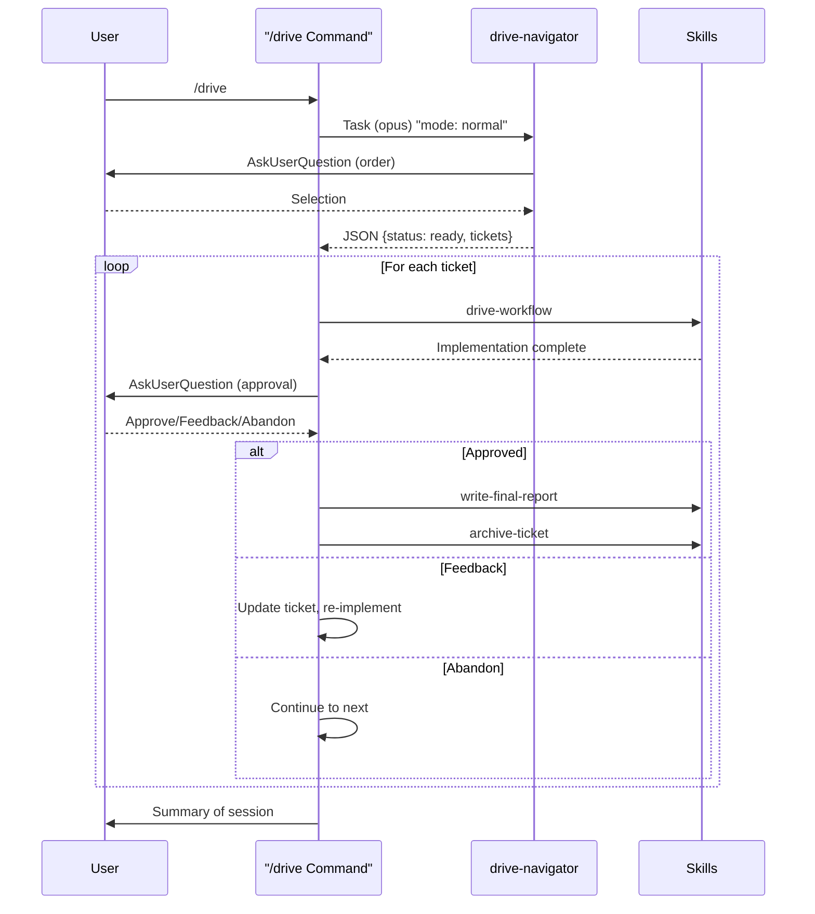
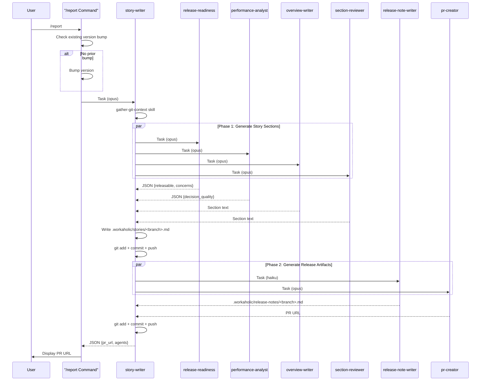
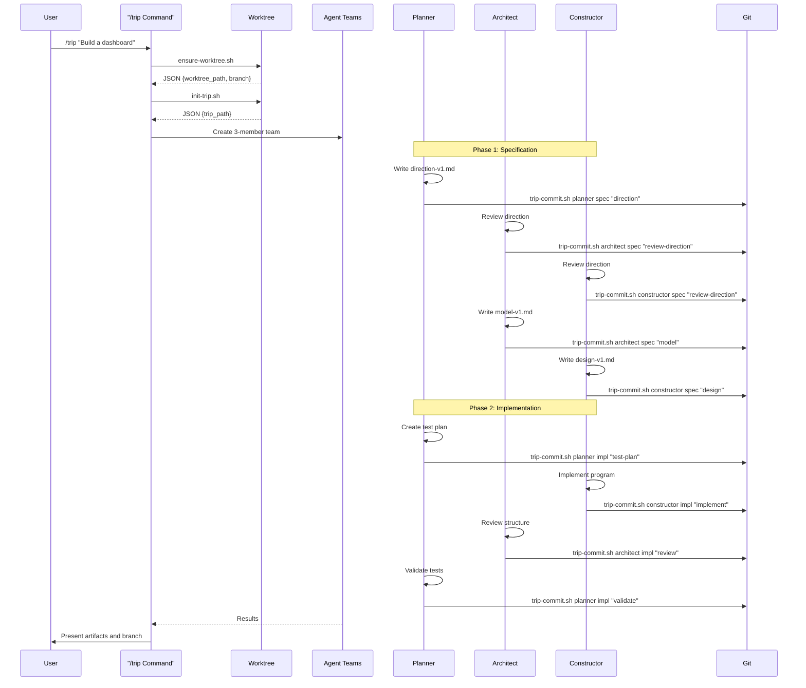
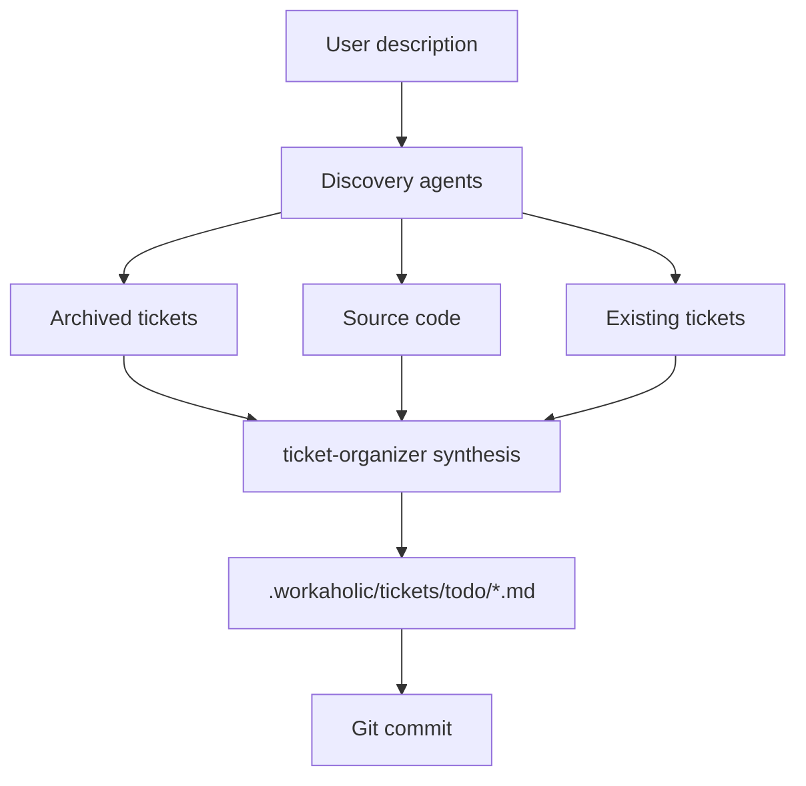
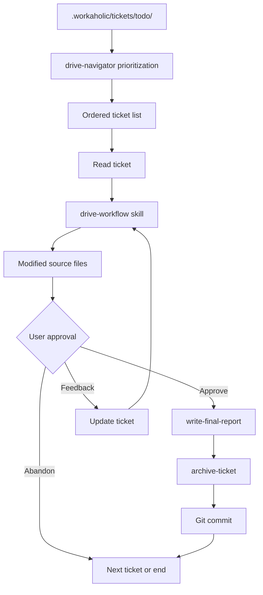
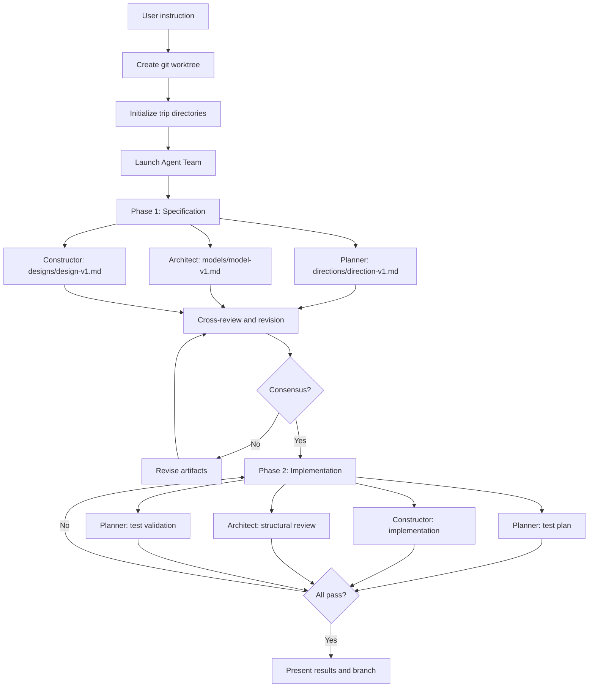
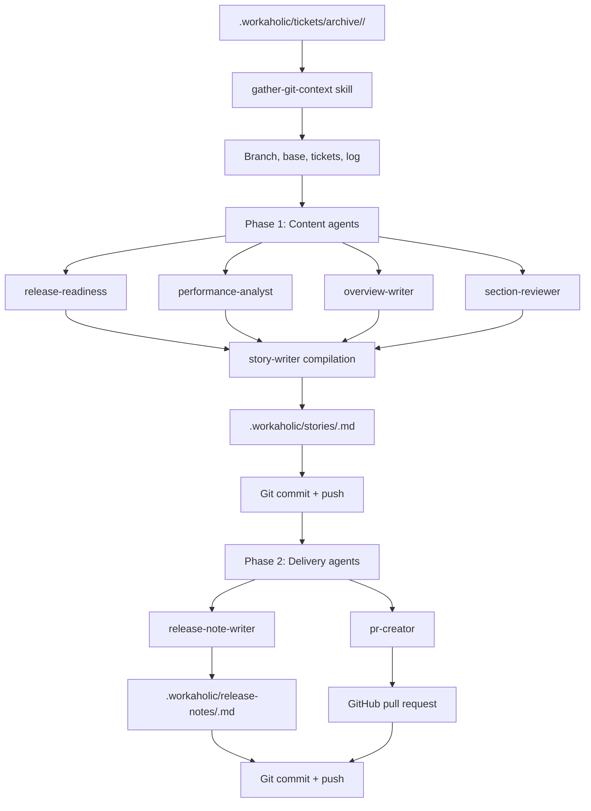

[English](application.md) | [Japanese](application_ja.md)

# Application Viewpoint

The Application Viewpoint describes how Workaholic behaves at runtime, focusing on agent orchestration patterns, data flow between components, and the execution model that governs how commands produce artifacts. The system comprises three plugins -- core (shared utilities and context-aware commands), standards (policy lenses and documentation writers), and work (development and exploration workflows) -- each with distinct orchestration models. Drive-style work operates as a directed acyclic graph of agent invocations where slash commands trigger cascades of orchestrator and writer agent executions, with the four leading skills preloaded directly as the project's policy lens. Trip-style work operates as an Agent Teams session where three philosophical agents collaborate through filesystem-based artifact exchange in an isolated git worktree.

## Orchestration Model

### Work Plugin Orchestration

The work plugin follows a three-layer orchestration architecture: commands at the top, orchestrator agents in the middle, and skills at the bottom. Commands orchestrate workflows by invoking agents through Claude Code's Task tool. The four leading skills (`standards:leading-validity`, `leading-availability`, `leading-security`, `leading-accessibility`) are preloaded directly into the orchestration surfaces — `/drive`, `/ticket`, `/trip`, and the agents they invoke — so policy lenses are available wherever scoping or implementation happens. Skills contain domain knowledge, templates, and shell scripts that implement the actual operations.

The orchestration model enforces strict nesting rules. Commands can invoke skills and agents. Agents can invoke skills and other agents. Skills can invoke other skills but never agents or commands. This hierarchy prevents circular dependencies and maintains clear separation of concerns between workflow orchestration (commands and agents) and operational knowledge (skills).

### Trippin Plugin Orchestration

Trippin follows a fundamentally different orchestration model based on Claude Code's experimental Agent Teams feature. The `/trip` command creates an isolated git worktree, initializes artifact directories, and launches a three-member Agent Team. The team members (Planner, Architect, Constructor) collaborate through a filesystem-based protocol where agents read and write versioned markdown artifacts in `.workaholic/.trips/<trip-name>/`.

The trippin orchestration model uses a two-stage workflow called the Implosive Structure:

**Phase 1 (Specification -- Inner Loop)**: Agents produce and mutually review specification artifacts until achieving full consensus. The Planner writes Direction artifacts, the Architect writes Model artifacts, and the Constructor writes Design artifacts. Each artifact undergoes cross-review by the other two agents. Disagreements are resolved through a moderation protocol where the uninvolved third agent arbitrates.

**Phase 2 (Implementation -- Outer Loop)**: With approved specification artifacts, the team transitions to building. The Planner creates a test plan, the Constructor implements the program, the Architect reviews structural integrity, and the Planner validates through testing. The team iterates until all agents approve.

Every discrete workflow step in both phases produces a git commit in the worktree branch, creating a complete trace of the collaborative process.

### Command-Level Orchestration Patterns

#### Ticket Command Orchestration

```mermaid
sequenceDiagram
    participant User
    participant ticket as "/ticket Command"
    participant to as ticket-organizer
    participant hd as history-discoverer
    participant sd as source-discoverer
    participant td as ticket-discoverer

    User->>ticket: /ticket "Add feature X"
    ticket->>to: Task (opus)

    par Parallel Discovery
        to->>hd: Task (opus)
        hd-->>to: JSON {summary, tickets}
        to->>sd: Task (opus)
        sd-->>to: JSON {files, code_flow}
        to->>td: Task (opus)
        td-->>to: JSON {status, recommendation}
    end

    to->>to: Write ticket(s)
    to-->>ticket: JSON {status, tickets}
    ticket->>User: Present ticket location
```

The `/ticket` command delegates entirely to the ticket-organizer subagent, which orchestrates three parallel discovery agents to gather historical context, source code locations, and duplicate detection. After all discovery agents complete, the organizer synthesizes results into one or more ticket files. The ticket command handles git commit operations and user presentation.

#### Drive Command Orchestration

```mermaid
sequenceDiagram
    participant User
    participant drive as "/drive Command"
    participant nav as drive-navigator
    participant skill as Skills

    User->>drive: /drive
    drive->>nav: Task (opus) "mode: normal"
    nav->>User: AskUserQuestion (order)
    User-->>nav: Selection
    nav-->>drive: JSON {status: ready, tickets}

    loop For each ticket
        drive->>skill: drive-workflow
        skill-->>drive: Implementation complete
        drive->>User: AskUserQuestion (approval)
        User-->>drive: Approve/Feedback/Abandon

        alt Approved
            drive->>skill: write-final-report
            drive->>skill: archive-ticket
        else Feedback
            drive->>drive: Update ticket, re-implement
        else Abandon
            drive->>drive: Continue to next
        end
    end

    drive->>User: Summary of session
```

The `/drive` command uses the drive-navigator subagent once to prioritize tickets, then processes each ticket sequentially in the main command context. This keeps implementation context visible to the user and preserves state across the approval loop. The command uses preloaded skills (drive-workflow, write-final-report, archive-ticket) rather than delegating to subagents, maintaining full control over the interactive approval flow.

The drive command enforces that every approval prompt must include the ticket title and overview from the drive-workflow result. If these values are unavailable in the agent's context (particularly after feedback re-implementation loops), the command requires re-reading the ticket file before presenting the approval dialog. This enforcement addresses a recurring UX issue where approval prompts lacked context for informed decision-making.

#### Report Command Orchestration

```mermaid
sequenceDiagram
    participant User
    participant report as "/report Command"
    participant sw as story-writer
    participant rr as release-readiness
    participant pa as performance-analyst
    participant ow as overview-writer
    participant sr as section-reviewer
    participant rnw as release-note-writer
    participant pc as pr-creator

    User->>report: /report
    report->>report: Check existing version bump
    alt No prior bump
        report->>report: Bump version
    end
    report->>sw: Task (opus)
    sw->>sw: gather-git-context skill

    par Phase 1: Generate Story Sections
        sw->>rr: Task (opus)
        sw->>pa: Task (opus)
        sw->>ow: Task (opus)
        sw->>sr: Task (opus)
    end

    rr-->>sw: JSON {releasable, concerns}
    pa-->>sw: JSON {decision_quality}
    ow-->>sw: Section text
    sr-->>sw: Section text

    sw->>sw: Write .workaholic/stories/<branch>.md
    sw->>sw: git add + commit + push

    par Phase 2: Generate Release Artifacts
        sw->>rnw: Task (haiku)
        sw->>pc: Task (opus)
    end

    rnw-->>sw: .workaholic/release-notes/<branch>.md
    pc-->>sw: PR URL

    sw->>sw: git add + commit + push
    sw-->>report: JSON {pr_url, agents}
    report->>User: Display PR URL
```

The `/report` command implements idempotent version bumping by checking for existing "Bump version" commits in the current branch before incrementing the version. This prevents double version increments when `/report` is called multiple times on the same branch. After version bumping (or skipping if already bumped), the command delegates to the story-writer subagent, which orchestrates two phases of parallel agent invocation.

#### Trip Command Orchestration

```mermaid
sequenceDiagram
    participant User
    participant trip as "/trip Command"
    participant WT as Worktree
    participant Team as Agent Teams
    participant P as Planner
    participant A as Architect
    participant C as Constructor
    participant Git as Git

    User->>trip: /trip "Build a dashboard"
    trip->>WT: ensure-worktree.sh
    WT-->>trip: JSON {worktree_path, branch}
    trip->>WT: init-trip.sh
    WT-->>trip: JSON {trip_path}

    trip->>Team: Create 3-member team

    Note over P,C: Phase 1: Specification

    P->>P: Write direction-v1.md
    P->>Git: trip-commit.sh planner spec "direction"
    A->>A: Review direction
    A->>Git: trip-commit.sh architect spec "review-direction"
    C->>C: Review direction
    C->>Git: trip-commit.sh constructor spec "review-direction"
    A->>A: Write model-v1.md
    A->>Git: trip-commit.sh architect spec "model"
    C->>C: Write design-v1.md
    C->>Git: trip-commit.sh constructor spec "design"

    Note over P,C: Phase 2: Implementation

    P->>P: Create test plan
    P->>Git: trip-commit.sh planner impl "test-plan"
    C->>C: Implement program
    C->>Git: trip-commit.sh constructor impl "implement"
    A->>A: Review structure
    A->>Git: trip-commit.sh architect impl "review"
    P->>P: Validate tests
    P->>Git: trip-commit.sh planner impl "validate"

    Team-->>trip: Results
    trip->>User: Present artifacts and branch
```

The `/trip` command follows a different orchestration model from drivin commands. Instead of the Task tool pattern, it uses Claude Code's experimental Agent Teams feature to create a three-member team that collaborates through filesystem artifacts. The command orchestrates worktree creation and initialization, then delegates the entire specification and implementation workflow to the Agent Team. Each step produces a git commit through the `trip-commit.sh` script, creating a traceable history on the worktree branch.

### Leading Skill Application

The standards plugin exposes four leading skills that act as the project's policy lenses. Each skill owns one viewpoint and provides Role, Policies, Practices, and Standards content that any consumer can preload:

**leading-validity**: Logical comprehensiveness — type-driven design, layer segregation, functional style, relational-first persistence, domain–persistence separation.

**leading-availability**: Operational continuity — CI/CD automation, vendor neutrality, infrastructure as code, observable-by-design, scenario-based recovery.

**leading-security**: Preservation of trust — secure-by-design defaults, ISMS-style risk management, defense in depth.

**leading-accessibility**: Universal reach — accessibility-first structure, modeless interaction, tool-first design that works for human UI and AI agents alike.

These skills are preloaded directly into the work plugin's orchestration surfaces — `/drive` and `/ticket` commands, plus the `ticket-organizer`, `planner`, `architect`, and `constructor` agents. The leads no longer have a producing or consuming relationship with anything else in the system; they are read whenever an agent needs to scope or implement work, and they apply to whichever layers the ticket touches (UX → leading-accessibility, Domain/DB → leading-validity, Infrastructure → leading-availability, anything touching authentication/secrets → leading-security).

### Parallel vs Sequential Execution

The system uses two distinct concurrency patterns based on the nature of the work. Parallel execution is used when multiple independent tasks can proceed simultaneously without interdependencies. Sequential execution is used when tasks depend on previous results or require human interaction between steps.

Commands that invoke multiple agents for data gathering or analysis use parallel Task tool calls in a single message. The story-writer invokes 4 agents in phase 1 and 2 agents in phase 2. The ticket-organizer invokes 3 discovery agents concurrently. This parallel pattern maximizes throughput for independent analysis tasks.

Commands that implement user workflows use sequential execution with approval gates. The `/drive` command processes tickets one at a time, waiting for user approval after each implementation. This sequential pattern ensures human oversight and maintains clear audit trails of what was approved versus what was rejected or modified.

The `/trip` command introduces a third concurrency model: Agent Teams. The three agents in a trip session operate as independent team members with their own context windows, communicating through filesystem artifacts rather than Task tool invocations. The Agent Teams runtime manages scheduling and context distribution, while the agents themselves coordinate through the shared trip artifact directory.

### Agent Depth and Nesting

The drivin plugin enforces a maximum depth of two agent layers. Commands invoke subagents (depth 1), and subagents can invoke other subagents (depth 2), but third-level nesting is not used. This constraint maintains cognitive manageability and prevents deeply nested contexts that become difficult to debug.

The trippin plugin uses a flat model: the trip command creates a team, and team members do not invoke further subagents. Communication happens through artifact files rather than nested agent invocations.

## Data Flow

Data flows through the system as markdown files, git operations, and JSON-structured messages between agents. The primary flow follows a pipeline from user input to git history.

### Ticket Creation Flow

```mermaid
flowchart TD
    Input[User description] --> Discover[Discovery agents]
    Discover --> History[Archived tickets]
    Discover --> Source[Source code]
    Discover --> Duplicates[Existing tickets]

    History --> Synthesis[ticket-organizer synthesis]
    Source --> Synthesis
    Duplicates --> Synthesis

    Synthesis --> Ticket[.workaholic/tickets/todo/*.md]
    Ticket --> Commit[Git commit]
```

The ticket creation flow begins with a natural language description from the user. Three discovery agents read different parts of the codebase in parallel: history-discoverer searches archived tickets, source-discoverer explores source code, and ticket-discoverer checks for duplicates. All three return JSON-structured results to the ticket-organizer, which synthesizes them into one or more ticket markdown files. The ticket command commits these files to git.

### Implementation Flow

```mermaid
flowchart TD
    Queue[.workaholic/tickets/todo/] --> Navigate[drive-navigator prioritization]
    Navigate --> Order[Ordered ticket list]
    Order --> Read[Read ticket]
    Read --> Implement[drive-workflow skill]
    Implement --> Changes[Modified source files]
    Changes --> Approval{User approval}

    Approval -->|Approve| Report[write-final-report]
    Approval -->|Feedback| Update[Update ticket]
    Approval -->|Abandon| Next

    Report --> Archive[archive-ticket]
    Archive --> Commit[Git commit]
    Commit --> Next[Next ticket or end]
    Update --> Implement
```

The implementation flow starts with tickets in the todo queue. The drive-navigator reads and prioritizes them based on type and layer. For each ticket, the drive-workflow skill implements the changes in source files. The user approves, provides feedback, or abandons. On approval, the write-final-report skill updates the ticket with effort and summary, then archive-ticket moves the ticket to the archive directory and commits both the ticket and source changes in a structured commit message.

### Trip Artifact Flow

```mermaid
flowchart TD
    Input[User instruction] --> Worktree[Create git worktree]
    Worktree --> Init[Initialize trip directories]
    Init --> Team[Launch Agent Team]

    Team --> P1[Phase 1: Specification]
    P1 --> Dir[Planner: directions/direction-v1.md]
    P1 --> Model[Architect: models/model-v1.md]
    P1 --> Design[Constructor: designs/design-v1.md]

    Dir --> Review1[Cross-review and revision]
    Model --> Review1
    Design --> Review1

    Review1 --> Consensus{Consensus?}
    Consensus -->|No| Revise[Revise artifacts]
    Revise --> Review1
    Consensus -->|Yes| P2[Phase 2: Implementation]

    P2 --> TestPlan[Planner: test plan]
    P2 --> Impl[Constructor: implementation]
    P2 --> SReview[Architect: structural review]
    P2 --> Validate[Planner: test validation]

    TestPlan --> Iterate{All pass?}
    Impl --> Iterate
    SReview --> Iterate
    Validate --> Iterate
    Iterate -->|No| P2
    Iterate -->|Yes| Results[Present results and branch]
```

The trip artifact flow operates entirely within a git worktree. Agents communicate by reading and writing versioned markdown files in the trip path. Each artifact follows a structured format with title, author, status, reviewed-by fields, content, and review notes. Versioning uses numeric suffixes (direction-v1.md, direction-v2.md) with each revision preserved as a new file. Every write operation produces a git commit via `trip-commit.sh`, creating a complete audit trail on the trip branch.

### Story Generation Flow

```mermaid
flowchart TD
    Archive[.workaholic/tickets/archive/<branch>/] --> Gather[gather-git-context skill]
    Gather --> Context[Branch, base, tickets, log]

    Context --> Phase1[Phase 1: Content agents]
    Phase1 --> RR[release-readiness]
    Phase1 --> PA[performance-analyst]
    Phase1 --> OW[overview-writer]
    Phase1 --> SR[section-reviewer]

    RR --> Compile[story-writer compilation]
    PA --> Compile
    OW --> Compile
    SR --> Compile

    Compile --> Story[.workaholic/stories/<branch>.md]
    Story --> StoryCommit[Git commit + push]

    StoryCommit --> Phase2[Phase 2: Delivery agents]
    Phase2 --> RN[release-note-writer]
    Phase2 --> PC[pr-creator]

    RN --> ReleaseNote[.workaholic/release-notes/<branch>.md]
    PC --> PR[GitHub pull request]

    ReleaseNote --> ReleaseCommit[Git commit + push]
    PR --> ReleaseCommit
```

### Data Format Transitions

Data transforms between formats as it flows through the system. User input begins as natural language text. Discovery agents convert this into JSON objects with structured fields (summary, tickets array, files array). The ticket-organizer converts JSON into ticket markdown files with YAML frontmatter. Implementation modifies source code files. Story agents read ticket markdown and produce story markdown. The pr-creator reads story markdown and generates GitHub pull request descriptions.

In the trippin plugin, the data format is consistently versioned markdown artifacts with structured frontmatter (author, status, reviewed-by). Agents communicate exclusively through these files, with git commits serving as the coordination mechanism.

All intermediate results are persisted as files in `.workaholic/`, making the entire workflow inspectable. There is no in-memory state that survives between command invocations beyond what Claude Code maintains in its conversation context.

## Execution Lifecycle

### Command Invocation

When a user types a slash command in Claude Code, the system looks up the command name in the plugin's command registry. Claude Code reads the command markdown file, which contains a YAML frontmatter block with metadata (name, description, preloaded skills) and a markdown body with instructions. The command's instructions are injected into Claude's prompt context, and Claude Code begins executing the orchestration logic defined in the instructions.

Commands are namespaced by plugin. The `/ticket`, `/drive`, and `/trip` commands belong to the work plugin; `/report` and `/ship` belong to the core plugin (context-aware routing handles drive vs trip variants).

### Skill Preloading

Before the command executes, Claude Code preloads any skills listed in the frontmatter. Skill preloading means reading the skill's SKILL.md file and injecting its content into the prompt context. This makes the skill's knowledge and script paths available to the command without requiring explicit references in the instruction text. Commands reference skills by relative path when invoking bundled shell scripts.

Skill paths are plugin-specific. Each plugin's skills resolve to `~/.claude/plugins/marketplaces/workaholic/plugins/<plugin>/skills/`. Cross-plugin references use the `<plugin>:<skill>` slug for soft references (e.g., the work plugin preloads `standards:leading-validity`) or the `${CLAUDE_PLUGIN_ROOT}/../<plugin>/` path for declared dependencies (e.g., the work plugin's `${CLAUDE_PLUGIN_ROOT}/../core/skills/branching/...`).

### Subagent Spawning

Commands spawn subagents using the Task tool with parameters: `subagent_type` (plugin:agent format, e.g., `drivin:drive-navigator`), `model` (opus/sonnet/haiku), and `prompt` (text passed to the subagent). Claude Code creates a new isolated conversation context for the subagent, loads the subagent's markdown file and preloaded skills, then executes the subagent's instructions with the provided prompt. The subagent's output is returned to the caller when complete.

Subagents can spawn other subagents using the same Task tool mechanism, creating nested contexts. Each context is independent, with its own skill preloads and prompt state. However, subagents cannot see or modify their parent's context, and parents cannot access intermediate state inside child contexts beyond the final output.

### Agent Teams Execution

The trippin plugin introduces a second agent spawning mechanism: Agent Teams. The `/trip` command creates a three-member team through Claude Code's experimental Agent Teams feature (requiring `CLAUDE_CODE_EXPERIMENTAL_AGENT_TEAMS=1`). Unlike Task tool invocations, Agent Teams members operate as independent peers with their own context windows. They coordinate through filesystem artifacts rather than parent-child message passing.

Each team member is defined by an agent markdown file with frontmatter specifying model, tools, color, and preloaded skills. The team lead (the trip command context) creates teammates and provides the workflow instructions. Team members read each other's artifacts from the shared trip path, write new artifacts or reviews, and commit each step using the trip-commit.sh script.

### Parallel Task Execution

When multiple Task tool calls appear in a single message, Claude Code executes them concurrently. This is used extensively for parallel agent invocation patterns like story-writer phase 1 (4 agents), story-writer phase 2 (2 agents), and ticket-organizer discovery (3 agents). Parallel execution reduces total wall-clock time but does not guarantee completion order. Commands must wait for all parallel tasks to complete before proceeding to the next phase.

### Sequential Task Execution

When a command needs to process results from one task before starting another, tasks execute sequentially. The drive command's approval loop is sequential: implement, wait for approval, update ticket, archive, then proceed to next ticket. Each step depends on the previous step's output or user response. The story-writer's two-stage model is sequential at the stage boundary: stage 1 (content generation) must complete before stage 2 (delivery artifacts) begins because the release-note-writer and pr-creator both consume the story file.

### User Interaction Gates

Commands use the AskUserQuestion tool to pause execution and wait for user input. The tool accepts a question string and an optional `options` parameter for selectable choices. When options are provided, the user sees a list of buttons rather than a text input field. This prevents ambiguous free-form responses and ensures commands receive structured selections they can handle programmatically.

Drive's approval dialog uses selectable options: "Approve", "Approve and stop", "Abandon". The drive-navigator uses selectable options for ticket selection and order confirmation. Users can also select "Other" to provide free-form feedback. The drive command requires that every approval prompt include the ticket title and overview, treating missing context as a failure condition.

### Git Operations

Commands and skills perform git operations through the Bash tool. Common patterns include: `git add <paths>` to stage changes, `git commit -m "message"` to create commits, `git push` to sync with remote, and `git diff` to analyze changes. The gather-git-context skill uses git commands to extract branch name, base branch, remote URL, and commit history. The archive-ticket skill moves files and creates structured commits in a single shell script invocation.

The trippin plugin introduces worktree-based git operations. The ensure-worktree.sh script creates a git worktree at `.worktrees/<trip-name>/` with a `trip/<trip-name>` branch. All subsequent operations in the trip session happen inside this worktree, providing complete isolation from the main working tree. The trip-commit.sh script creates commits with a standardized message format: `trip(<agent>): <step>` with phase information in the body.

All git operations happen after artifacts are written. Commands follow a consistent pattern: gather context, invoke agents or skills, write output files, validate results, then stage and commit. This ensures commits only capture complete, validated work.

### Error Handling

When a subagent fails or returns an error status, the caller receives the error message in the subagent's output. Commands handle failures by reporting them to the user and deciding whether to continue or abort. The story-writer tracks which agents succeeded or failed and reports per-agent status in its final output. The drive command aborts if ticket frontmatter updates fail, preventing archival of incomplete tickets.

Validation failures are treated as soft errors. If validate-writer-output reports missing files, the scan command reports the failure but still commits whatever output was successfully generated. This ensures partial progress is not lost due to a single agent failure.

The trip command handles worktree creation errors (unclean git state, existing worktree, existing branch) by informing the user and stopping before launching the Agent Team.

## Concurrency Patterns

### Pattern 1: Two-Stage Parallel Execution

When tasks have a sequential dependency between stages (intermediate artifact required), commands use two-stage parallel execution. Stage 1 invokes a set of agents in parallel to produce the intermediate artifact. Stage 2 waits for stage 1 completion, then invokes the next set in parallel with the artifact available.

The story-writer uses this pattern: Phase 1 produces the story markdown by combining outputs from release-readiness, performance-analyst, overview-writer, and section-reviewer; Phase 2 then produces the release note and the GitHub PR, both of which consume the committed story file.

### Pattern 2: Parallel Independent Tasks

When multiple tasks have no dependencies and can run simultaneously, commands invoke them in a single message with multiple Task tool calls. This pattern maximizes throughput for independent analysis tasks.

The ticket-organizer invokes 3 discovery agents in parallel. The story-writer uses two phases of parallel invocation: Phase 1 invokes 4 content generation agents concurrently, Phase 2 invokes 2 delivery agents concurrently.

### Pattern 3: Sequential User Interaction

When tasks require human approval or feedback between steps, commands execute sequentially with interaction gates. This pattern ensures oversight and maintains clear audit trails.

The drive command processes tickets one at a time. For each ticket: read, implement, present approval dialog, handle user response. If approved, update ticket and archive. If feedback provided, update ticket and re-implement. If abandoned, skip to next ticket. This loop cannot parallelize because each ticket's approval depends on user reviewing the implementation results.

### Pattern 4: Sequential Dependent Tasks

When one task's output is required as input to the next task, execution proceeds sequentially. This pattern maintains data dependencies.

The report command follows a strict sequence: check for existing version bump, bump version if needed, invoke story-writer, display PR URL. The archive-ticket skill follows a sequence: verify frontmatter update succeeded, move ticket file to archive directory, create structured commit message, execute git add and commit.

### Pattern 5: Batch Commit

When multiple independent operations produce artifacts, the system batches their git commits into a single commit. This pattern reduces commit noise and groups related changes.

The story-writer follows this pattern at each phase boundary: Phase 1 outputs (the story file) are committed and pushed once all four content agents return; Phase 2 outputs (the release note) and the PR creation result are committed together when both return.

### Pattern 6: Agent Teams Collaboration

The trippin plugin introduces a collaboration pattern where agents operate as peers rather than in a caller-callee hierarchy. Three agents share a workspace (git worktree), communicate through versioned artifacts, and coordinate through a structured protocol. Each agent independently reads, writes, reviews, and commits. The Agent Teams runtime manages scheduling; the agents themselves manage workflow progression through consensus gates.

This pattern differs from all drivin patterns in that there is no central orchestrator managing each step. The team lead provides initial instructions, and the team self-coordinates through the protocol defined in the trip-protocol skill.

## Model Selection Strategy

Commands specify which Claude model each subagent should use based on the complexity and scope of the task. Model selection optimizes for accuracy on complex tasks versus throughput on focused tasks.

Top-level orchestrators use opus because they make complex decisions, coordinate multiple agents, and handle multi-step workflows. The ticket-organizer (opus) evaluates whether to split or merge tickets, synthesizes results from three discovery agents, and determines ticket structure. The drive-navigator (opus) prioritizes tickets based on type, layer, and dependencies. The story-writer (opus) coordinates two phases of agent invocation and compiles diverse outputs into a coherent story.

Writer and analyst agents use sonnet because they perform focused analysis on a single domain with well-defined inputs and outputs. The changelog-writer, release-note-writer, terms-writer, overview-writer, model-analyst, performance-analyst, section-reviewer, and the parameterized lead agent all use sonnet. They read source code and documentation, apply their specialized lens, and produce structured markdown outputs.

Release note generation uses haiku because it performs a simple transformation task: read the story file and extract key points into a concise format.

The discovery agents (history, source, ticket) use opus because they must search large codebases, evaluate relevance heuristics, and make judgment calls about what context is meaningful.

The trippin plugin's three agents (planner, architect, constructor) all use opus because they engage in creative, evaluative, and structural reasoning that requires strong judgment capabilities. The Agent Teams context also benefits from opus-level reasoning for cross-artifact review and consensus building.

## Architectural Evolution

### Core Plugin Renamed to Drivin

The core plugin directory was renamed from `plugins/core` to `plugins/drivin`, and all references throughout the codebase were updated. This affected the plugin name in marketplace and plugin JSON, all `subagent_type: "core:*"` references (changed to `drivin:*`), all installed plugin path references, and the CLAUDE.md documentation. The rename establishes a naming convention where each plugin has a distinctive name rather than a generic "core" label.

### Trippin Plugin Created

A second plugin, trippin, was added to the marketplace alongside drivin. Trippin provides an AI-oriented exploration and creative development workflow based on the Implosive Structure methodology. It introduces the `/trip` command, three Agent Teams agents (planner, architect, constructor), the trip-protocol skill, and three bundled shell scripts (ensure-worktree.sh, init-trip.sh, trip-commit.sh). The marketplace now registers two plugins with synchronized versions.

### Drive Approval Context Enforcement

The drive approval flow was strengthened to enforce that every approval prompt includes the ticket title and overview. The drive command Step 2.2 now has a CRITICAL rule requiring title/overview handoff from the drive-workflow result. The drive-approval skill upgraded its guidance from IMPORTANT to CRITICAL with failure condition language and added a fallback re-read instruction for the feedback loop. This addresses a recurring UX issue where approval prompts lacked context.

### Removal of the Strategic-Context Tier

A three-agent strategic-context tier was introduced in February 2026 to provide leads with separate project, architectural, and quality context, consumed through a full-codebase documentation command that ran the upstream agents first and the leads second. In practice, the intermediate context artifacts were not consulted by the active ticket, drive, or trip flows, which derived context directly from the codebase. The tier — comprising the three upstream agents and their paired domain skills, a cross-cutting principles skill, a schema enforcement rule, the documentation command, an agent-selection helper skill, and a directory of explicit constraint files — was removed in May 2026 in favor of preloading the four leading skills directly into the work plugin's commands and agents. The four viewpoint specs (application.md, component.md, feature.md, usecase.md) that the upstream architecture agent produced are now hand-maintained reference documents without an automated owner.

### Version Bump Idempotency

The report command was enhanced to check for existing version bump commits before incrementing the version. This makes the `/report` command idempotent: calling it multiple times on the same branch no longer produces multiple version increments.

## Assumptions

- [Explicit] The four leading skills (`standards:leading-validity`, `leading-availability`, `leading-security`, `leading-accessibility`) are preloaded into `plugins/work/commands/drive.md`, `plugins/work/agents/ticket-organizer.md`, `plugins/work/agents/planner.md`, `plugins/work/agents/architect.md`, and `plugins/work/agents/constructor.md`.
- [Explicit] The work plugin's `dependencies` field declares only `["core"]`; references to standards use the soft cross-plugin slug pattern (`standards:leading-*`) so the work plugin tolerates the standards plugin being absent.
- [Explicit] The marketplace registers three plugins (core, standards, work) as shown in `.claude-plugin/marketplace.json`.
- [Explicit] The trip command requires the Agent Teams experimental feature flag (`CLAUDE_CODE_EXPERIMENTAL_AGENT_TEAMS=1`) as stated in trip.md.
- [Explicit] Trip sessions run in isolated git worktrees created by ensure-worktree.sh, as documented in trip-protocol SKILL.md.
- [Explicit] Every trip workflow step produces a git commit via trip-commit.sh with format `trip(<agent>): <step>`, as documented in trip-protocol SKILL.md.
- [Explicit] The drive approval flow requires ticket title and overview in the approval prompt with CRITICAL enforcement and failure condition language, as documented in `plugins/core/skills/drive/SKILL.md` Approval section and `plugins/work/commands/drive.md` Step 2.2.
- [Explicit] Commands invoke subagents through the Task tool with `subagent_type`, `model`, and `prompt` parameters, using `work:` prefix for work agents and `standards:` prefix for standards agents.
- [Inferred] The trip plugin's Agent Teams model represents a deliberate architectural choice to explore peer-based collaboration versus the hierarchical Task tool pattern used by drive.
- [Inferred] The worktree isolation in trip ensures trip sessions do not interfere with the main working tree or ongoing drive workflows.
- [Inferred] The three philosophical stances (Progressive, Neutral, Conservative) in the trip agents are designed to create productive tension that drives thorough specification through dialectical review.
- [Inferred] The choice of opus for all three trip agents reflects the creative and evaluative nature of the work, unlike the writer/analyst agents which perform bounded analysis suitable for sonnet.
