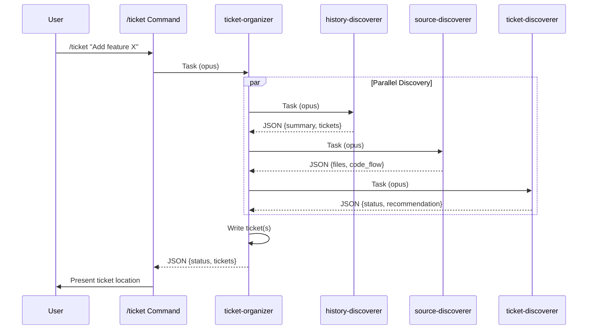
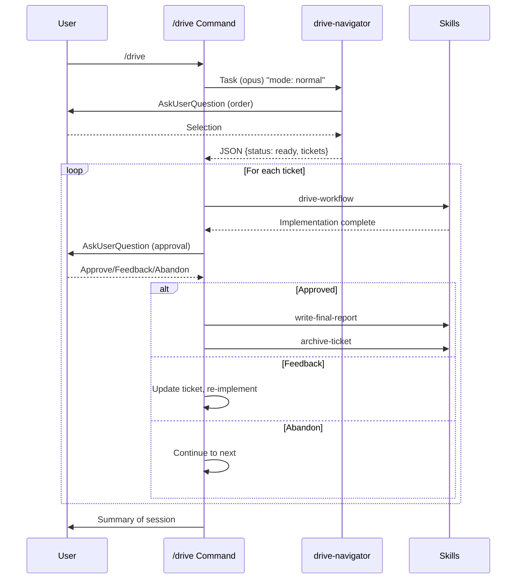
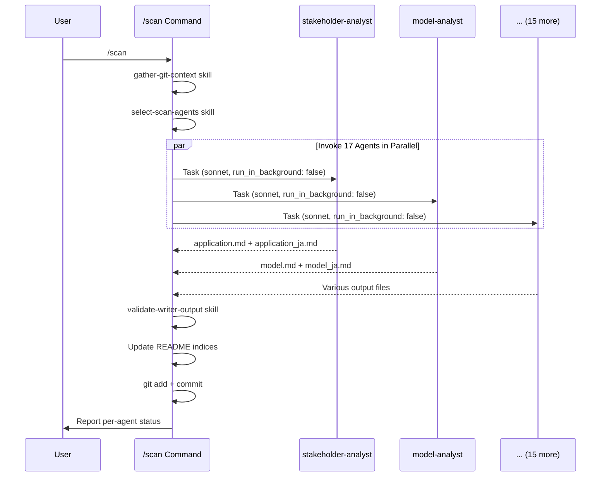
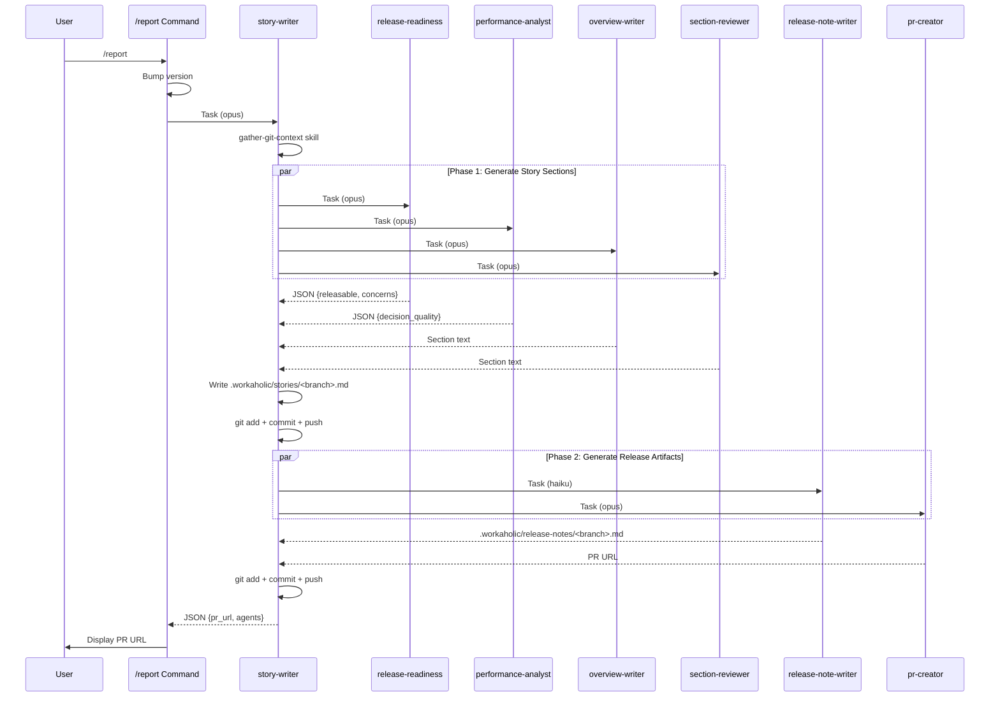
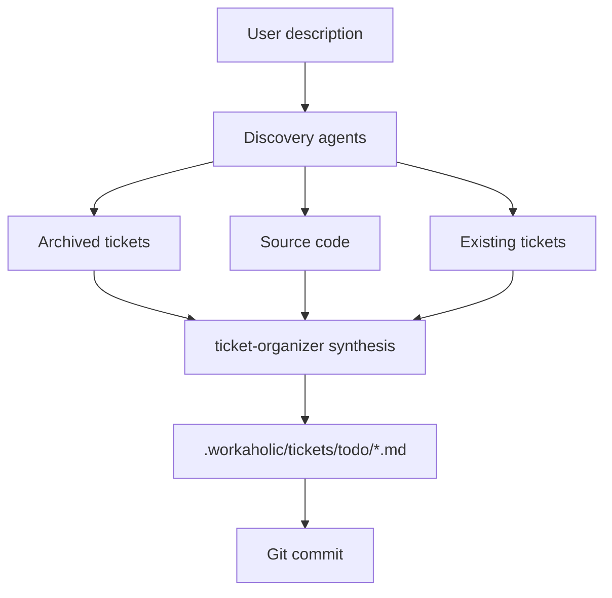
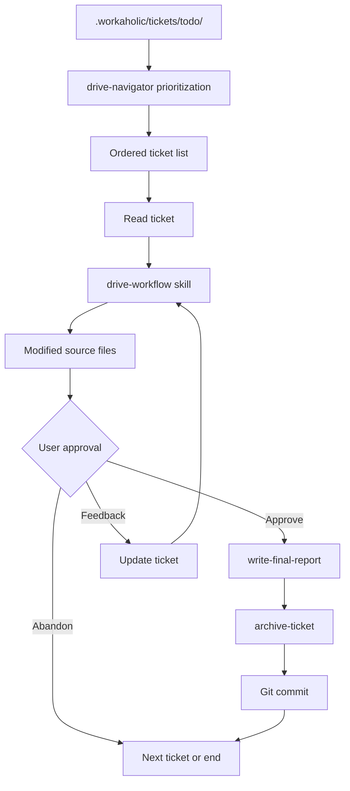
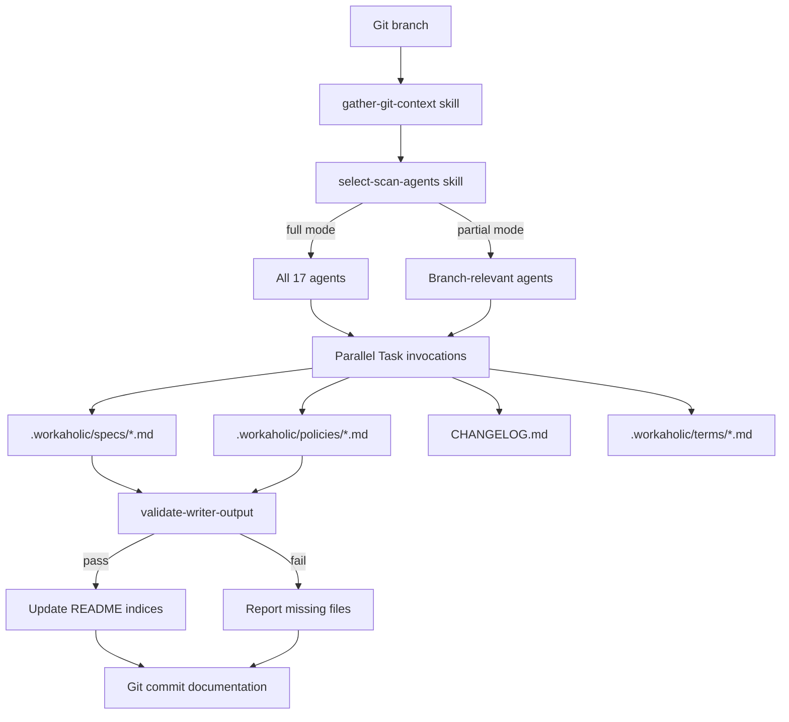
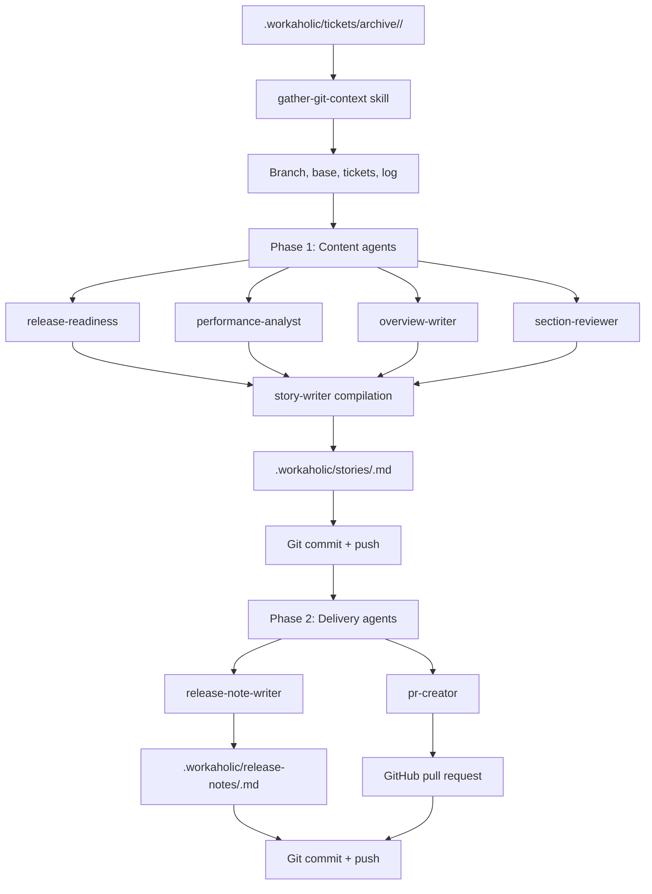

[English](application.md) | [Japanese](application_ja.md)

# Application Viewpoint

The Application Viewpoint describes how Workaholic behaves at runtime, focusing on agent orchestration patterns, data flow between components, and the execution model that governs how commands produce artifacts. The system operates as a directed acyclic graph of agent invocations, where each slash command triggers a cascade of subagent and skill executions within Claude Code's runtime.

## Orchestration Model

Workaholic follows a three-layer orchestration architecture: commands at the top, subagents in the middle, and skills at the bottom. Commands orchestrate workflows by invoking subagents through Claude Code's Task tool. Subagents perform focused tasks by executing preloaded skills. Skills contain domain knowledge, templates, and shell scripts that implement the actual operations.

The orchestration model enforces strict nesting rules. Commands can invoke skills and subagents. Subagents can invoke skills and other subagents. Skills can invoke other skills but never subagents or commands. This hierarchy prevents circular dependencies and maintains clear separation of concerns between workflow orchestration (commands and subagents) and operational knowledge (skills).

### Command-Level Orchestration Patterns

#### Ticket Command Orchestration

```mermaid
sequenceDiagram
    participant User
    participant ticket as /ticket Command
    participant to as ticket-organizer
    participant hd as history-discoverer
    participant sd as source-discoverer
    participant td as ticket-discoverer

    User->>ticket: /ticket "Add feature X"
    ticket->>to: Task (opus)

    par Parallel Discovery
        to->>hd: Task (opus)
        hd-->>to: JSON {summary, tickets}
        to->>sd: Task (opus)
        sd-->>to: JSON {files, code_flow}
        to->>td: Task (opus)
        td-->>to: JSON {status, recommendation}
    end

    to->>to: Write ticket(s)
    to-->>ticket: JSON {status, tickets}
    ticket->>User: Present ticket location
```

The `/ticket` command delegates entirely to the ticket-organizer subagent, which orchestrates three parallel discovery agents to gather historical context, source code locations, and duplicate detection. After all discovery agents complete, the organizer synthesizes results into one or more ticket files. The ticket command handles git commit operations and user presentation.

#### Drive Command Orchestration

```mermaid
sequenceDiagram
    participant User
    participant drive as /drive Command
    participant nav as drive-navigator
    participant skill as Skills

    User->>drive: /drive
    drive->>nav: Task (opus) "mode: normal"
    nav->>User: AskUserQuestion (order)
    User-->>nav: Selection
    nav-->>drive: JSON {status: ready, tickets}

    loop For each ticket
        drive->>skill: drive-workflow
        skill-->>drive: Implementation complete
        drive->>User: AskUserQuestion (approval)
        User-->>drive: Approve/Feedback/Abandon

        alt Approved
            drive->>skill: write-final-report
            drive->>skill: archive-ticket
        else Feedback
            drive->>drive: Update ticket, re-implement
        else Abandon
            drive->>drive: Continue to next
        end
    end

    drive->>User: Summary of session
```

The `/drive` command uses the drive-navigator subagent once to prioritize tickets, then processes each ticket sequentially in the main command context. This keeps implementation context visible to the user and preserves state across the approval loop. The command uses preloaded skills (drive-workflow, write-final-report, archive-ticket) rather than delegating to subagents, maintaining full control over the interactive approval flow.

#### Scan Command Orchestration

```mermaid
sequenceDiagram
    participant User
    participant scan as /scan Command
    participant Agent1 as stakeholder-analyst
    participant Agent2 as model-analyst
    participant AgentN as ... (15 more)

    User->>scan: /scan
    scan->>scan: gather-git-context skill
    scan->>scan: select-scan-agents skill

    par Invoke 17 Agents in Parallel
        scan->>Agent1: Task (sonnet, run_in_background: false)
        scan->>Agent2: Task (sonnet, run_in_background: false)
        scan->>AgentN: Task (sonnet, run_in_background: false)
    end

    Agent1-->>scan: application.md + application_ja.md
    Agent2-->>scan: model.md + model_ja.md
    AgentN-->>scan: Various output files

    scan->>scan: validate-writer-output skill
    scan->>scan: Update README indices
    scan->>scan: git add + commit
    scan->>User: Report per-agent status
```

The `/scan` command implements direct parallel orchestration of all 17 documentation agents. Previously delegated to a scanner subagent, this was flattened to provide real-time progress visibility. The command invokes all agents in a single message with explicit `run_in_background: false` to ensure agents retain Write/Edit permissions. After all agents complete, the command validates output files exist before updating README indices.

#### Report Command Orchestration

```mermaid
sequenceDiagram
    participant User
    participant report as /report Command
    participant sw as story-writer
    participant rr as release-readiness
    participant pa as performance-analyst
    participant ow as overview-writer
    participant sr as section-reviewer
    participant rnw as release-note-writer
    participant pc as pr-creator

    User->>report: /report
    report->>report: Bump version
    report->>sw: Task (opus)
    sw->>sw: gather-git-context skill

    par Phase 1: Generate Story Sections
        sw->>rr: Task (opus)
        sw->>pa: Task (opus)
        sw->>ow: Task (opus)
        sw->>sr: Task (opus)
    end

    rr-->>sw: JSON {releasable, concerns}
    pa-->>sw: JSON {decision_quality}
    ow-->>sw: Section text
    sr-->>sw: Section text

    sw->>sw: Write .workaholic/stories/<branch>.md
    sw->>sw: git add + commit + push

    par Phase 2: Generate Release Artifacts
        sw->>rnw: Task (haiku)
        sw->>pc: Task (opus)
    end

    rnw-->>sw: .workaholic/release-notes/<branch>.md
    pc-->>sw: PR URL

    sw->>sw: git add + commit + push
    sw-->>report: JSON {pr_url, agents}
    report->>User: Display PR URL
```

The `/report` command delegates to the story-writer subagent, which orchestrates two phases of parallel agent invocation. Phase 1 generates story content sections using four parallel agents. Phase 2 generates release notes and creates the pull request using two more parallel agents. The story-writer handles all git operations and returns the PR URL to the report command for display.

### Parallel vs Sequential Execution

The system uses two distinct concurrency patterns based on the nature of the work. Parallel execution is used when multiple independent tasks can proceed simultaneously without interdependencies. Sequential execution is used when tasks depend on previous results or require human interaction between steps.

Commands that invoke multiple agents for data gathering or analysis use parallel Task tool calls in a single message. The `/scan` command invokes 17 agents concurrently. The story-writer invokes 4 agents in phase 1 and 2 agents in phase 2. The ticket-organizer invokes 3 discovery agents concurrently. This parallel pattern maximizes throughput for independent analysis tasks.

Commands that implement user workflows use sequential execution with approval gates. The `/drive` command processes tickets one at a time, waiting for user approval after each implementation. This sequential pattern ensures human oversight and maintains clear audit trails of what was approved versus what was rejected or modified.

### Agent Depth and Nesting

The system enforces a maximum depth of two agent layers. Commands invoke subagents (depth 1), and subagents can invoke other subagents (depth 2), but third-level nesting is not used. This constraint maintains cognitive manageability and prevents deeply nested contexts that become difficult to debug.

The recent migration from the scanner subagent to direct scan command orchestration eliminated one nesting level. Previously, the scan command invoked scanner, which invoked 17 analysts (2 levels). Now the scan command invokes 17 analysts directly (1 level). This flattening improves progress visibility at the cost of command complexity.

### Background Execution Constraint

All scan agents must execute with `run_in_background: false` (the default) because background agents automatically have Write and Edit tool permissions denied. Since all 17 scan agents need to write their output files, background execution causes silent failures. The scan command explicitly documents this constraint to prevent Claude Code from interpreting parallel Task calls as background operations.

## Data Flow

Data flows through the system as markdown files, git operations, and JSON-structured messages between agents. The primary flow follows a pipeline from user input to git history.

### Ticket Creation Flow

```mermaid
flowchart TD
    Input[User description] --> Discover[Discovery agents]
    Discover --> History[Archived tickets]
    Discover --> Source[Source code]
    Discover --> Duplicates[Existing tickets]

    History --> Synthesis[ticket-organizer synthesis]
    Source --> Synthesis
    Duplicates --> Synthesis

    Synthesis --> Ticket[.workaholic/tickets/todo/*.md]
    Ticket --> Commit[Git commit]
```

The ticket creation flow begins with a natural language description from the user. Three discovery agents read different parts of the codebase in parallel: history-discoverer searches archived tickets, source-discoverer explores source code, and ticket-discoverer checks for duplicates. All three return JSON-structured results to the ticket-organizer, which synthesizes them into one or more ticket markdown files. The ticket command commits these files to git.

### Implementation Flow

```mermaid
flowchart TD
    Queue[.workaholic/tickets/todo/] --> Navigate[drive-navigator prioritization]
    Navigate --> Order[Ordered ticket list]
    Order --> Read[Read ticket]
    Read --> Implement[drive-workflow skill]
    Implement --> Changes[Modified source files]
    Changes --> Approval{User approval}

    Approval -->|Approve| Report[write-final-report]
    Approval -->|Feedback| Update[Update ticket]
    Approval -->|Abandon| Next

    Report --> Archive[archive-ticket]
    Archive --> Commit[Git commit]
    Commit --> Next[Next ticket or end]
    Update --> Implement
```

The implementation flow starts with tickets in the todo queue. The drive-navigator reads and prioritizes them based on type and layer. For each ticket, the drive-workflow skill implements the changes in source files. The user approves, provides feedback, or abandons. On approval, the write-final-report skill updates the ticket with effort and summary, then archive-ticket moves the ticket to the archive directory and commits both the ticket and source changes in a structured commit message.

### Documentation Scan Flow

```mermaid
flowchart TD
    Branch[Git branch] --> Context[gather-git-context skill]
    Context --> Select[select-scan-agents skill]

    Select -->|full mode| All[All 17 agents]
    Select -->|partial mode| Relevant[Branch-relevant agents]

    All --> Invoke[Parallel Task invocations]
    Relevant --> Invoke

    Invoke --> Specs[.workaholic/specs/*.md]
    Invoke --> Policies[.workaholic/policies/*.md]
    Invoke --> Changelog[CHANGELOG.md]
    Invoke --> Terms[.workaholic/terms/*.md]

    Specs --> Validate[validate-writer-output]
    Policies --> Validate

    Validate -->|pass| Index[Update README indices]
    Validate -->|fail| Report[Report missing files]

    Index --> DocCommit[Git commit documentation]
    Report --> DocCommit
```

The documentation scan flow uses git branch context to determine which agents to invoke. In full mode, all 17 agents run. In partial mode, only agents relevant to changed files run. Agents write their outputs to respective directories. The validate-writer-output skill checks that expected files exist and are non-empty. If validation passes, README index files are updated. Finally, all documentation changes are committed together.

### Story Generation Flow

```mermaid
flowchart TD
    Archive[.workaholic/tickets/archive/<branch>/] --> Gather[gather-git-context skill]
    Gather --> Context[Branch, base, tickets, log]

    Context --> Phase1[Phase 1: Content agents]
    Phase1 --> RR[release-readiness]
    Phase1 --> PA[performance-analyst]
    Phase1 --> OW[overview-writer]
    Phase1 --> SR[section-reviewer]

    RR --> Compile[story-writer compilation]
    PA --> Compile
    OW --> Compile
    SR --> Compile

    Compile --> Story[.workaholic/stories/<branch>.md]
    Story --> StoryCommit[Git commit + push]

    StoryCommit --> Phase2[Phase 2: Delivery agents]
    Phase2 --> RN[release-note-writer]
    Phase2 --> PC[pr-creator]

    RN --> ReleaseNote[.workaholic/release-notes/<branch>.md]
    PC --> PR[GitHub pull request]

    ReleaseNote --> ReleaseCommit[Git commit + push]
    PR --> ReleaseCommit
```

The story generation flow reads archived tickets for the current branch and invokes four parallel agents to generate story sections. The story-writer compiles their outputs into a story file, commits and pushes it, then invokes two more agents in parallel: one to generate release notes and one to create the pull request using the GitHub CLI. Release notes are committed and pushed. The PR URL is returned to the user.

### Data Format Transitions

Data transforms between formats as it flows through the system. User input begins as natural language text. Discovery agents convert this into JSON objects with structured fields (summary, tickets array, files array). The ticket-organizer converts JSON into ticket markdown files with YAML frontmatter. Implementation modifies source code files. Documentation agents read source code and produce markdown specification files. Story agents read ticket markdown and produce story markdown. The pr-creator reads story markdown and generates GitHub pull request descriptions.

All intermediate results are persisted as files in `.workaholic/`, making the entire workflow inspectable. There is no in-memory state that survives between command invocations beyond what Claude Code maintains in its conversation context.

## Execution Lifecycle

### Command Invocation

When a user types a slash command in Claude Code, the system looks up the command name in the plugin's command registry. Claude Code reads the command markdown file, which contains a YAML frontmatter block with metadata (name, description, preloaded skills) and a markdown body with instructions. The command's instructions are injected into Claude's prompt context, and Claude Code begins executing the orchestration logic defined in the instructions.

### Skill Preloading

Before the command executes, Claude Code preloads any skills listed in the frontmatter. Skill preloading means reading the skill's SKILL.md file and injecting its content into the prompt context. This makes the skill's knowledge and script paths available to the command without requiring explicit references in the instruction text. Commands reference skills by relative path when invoking bundled shell scripts.

### Subagent Spawning

Commands spawn subagents using the Task tool with parameters: `subagent_type` (plugin:agent format), `model` (opus/sonnet/haiku), and `prompt` (text passed to the subagent). Claude Code creates a new isolated conversation context for the subagent, loads the subagent's markdown file and preloaded skills, then executes the subagent's instructions with the provided prompt. The subagent's output is returned to the caller when complete.

Subagents can spawn other subagents using the same Task tool mechanism, creating nested contexts. Each context is independent, with its own skill preloads and prompt state. However, subagents cannot see or modify their parent's context, and parents cannot access intermediate state inside child contexts beyond the final output.

### Parallel Task Execution

When multiple Task tool calls appear in a single message, Claude Code executes them concurrently. This is used extensively for parallel agent invocation patterns like scan (17 agents), story-writer phase 1 (4 agents), and ticket-organizer discovery (3 agents). Parallel execution reduces total wall-clock time but does not guarantee completion order. Commands must wait for all parallel tasks to complete before proceeding to the next phase.

### Sequential Task Execution

When a command needs to process results from one task before starting another, tasks execute sequentially. The drive command's approval loop is sequential: implement, wait for approval, update ticket, archive, then proceed to next ticket. Each step depends on the previous step's output or user response.

### User Interaction Gates

Commands use the AskUserQuestion tool to pause execution and wait for user input. The tool accepts a question string and an optional `options` parameter for selectable choices. When options are provided, the user sees a list of buttons rather than a text input field. This prevents ambiguous free-form responses and ensures commands receive structured selections they can handle programmatically.

Drive's approval dialog uses selectable options: "Approve", "Approve and stop", "Abandon", "Other". The drive-navigator uses selectable options for ticket selection and order confirmation. These gates prevent commands from making autonomous decisions about workflow direction, ensuring human oversight at critical decision points.

### Git Operations

Commands and skills perform git operations through the Bash tool. Common patterns include: `git add <paths>` to stage changes, `git commit -m "message"` to create commits, `git push` to sync with remote, and `git diff` to analyze changes. The gather-git-context skill uses git commands to extract branch name, base branch, remote URL, and commit history. The archive-ticket skill moves files and creates structured commits in a single shell script invocation.

All git operations happen after artifacts are written. Commands follow a consistent pattern: gather context, invoke agents or skills, write output files, validate results, then stage and commit. This ensures commits only capture complete, validated work.

### Error Handling

When a subagent fails or returns an error status, the caller receives the error message in the subagent's output. Commands handle failures by reporting them to the user and deciding whether to continue or abort. The story-writer tracks which agents succeeded or failed and reports per-agent status in its final output. The drive command aborts if ticket frontmatter updates fail, preventing archival of incomplete tickets.

Validation failures are treated as soft errors. If validate-writer-output reports missing files, the scan command reports the failure but still commits whatever output was successfully generated. This ensures partial progress is not lost due to a single agent failure.

## Concurrency Patterns

### Pattern 1: Parallel Independent Tasks

When multiple tasks have no dependencies and can run simultaneously, commands invoke them in a single message with multiple Task tool calls. This pattern maximizes throughput for independent analysis tasks.

The scan command invokes 17 agents in parallel: 8 viewpoint analysts, 7 policy analysts, changelog-writer, and terms-writer. All 17 agents read the codebase independently and write to non-overlapping output files. No synchronization is needed because each agent owns its output file exclusively.

The ticket-organizer invokes 3 discovery agents in parallel: history-discoverer, source-discoverer, and ticket-discoverer. Each agent searches different parts of the system and returns JSON. The organizer waits for all three before synthesizing results.

The story-writer uses two phases of parallel invocation. Phase 1 invokes 4 content generation agents concurrently, waits for all to complete, then compiles their outputs into the story file. Phase 2 invokes 2 delivery agents concurrently to generate release notes and create the PR.

### Pattern 2: Sequential User Interaction

When tasks require human approval or feedback between steps, commands execute sequentially with interaction gates. This pattern ensures oversight and maintains clear audit trails.

The drive command processes tickets one at a time. For each ticket: read, implement, present approval dialog, handle user response. If approved, update ticket and archive. If feedback provided, update ticket and re-implement. If abandoned, skip to next ticket. This loop cannot parallelize because each ticket's approval depends on user reviewing the implementation results.

The drive-navigator presents a prioritized ticket list and waits for user confirmation of the execution order. Users can override the proposed order by selecting "Pick one" or "Original order". The navigator returns control only after receiving user selection.

### Pattern 3: Sequential Dependent Tasks

When one task's output is required as input to the next task, execution proceeds sequentially. This pattern maintains data dependencies.

The report command follows a strict sequence: bump version, invoke story-writer, display PR URL. Version bump must complete before story-writer reads the updated version files. Story-writer must complete and return the PR URL before the command can display it to the user.

The archive-ticket skill follows a sequence: verify frontmatter update succeeded, move ticket file to archive directory, create structured commit message, execute git add and commit. Each step depends on the previous step's success. If frontmatter verification fails, the entire archival is aborted.

### Pattern 4: Batch Commit

When multiple independent operations produce artifacts, the system batches their git commits into a single commit. This pattern reduces commit noise and groups related changes.

The scan command runs 17 agents, validates their outputs, updates README indices, then stages and commits everything in one commit: `git add CHANGELOG.md .workaholic/specs/ .workaholic/terms/ .workaholic/policies/ && git commit -m "Update documentation"`. This single commit captures the entire documentation update, even though 17 agents contributed to it.

The archive-ticket skill commits both the archived ticket and the source code changes together with a structured commit message that includes motivation, UX changes, and architecture changes. This links the ticket's documentation to the code it produced in git history.

## Model Selection Strategy

Commands specify which Claude model each subagent should use based on the complexity and scope of the task. Model selection optimizes for accuracy on complex tasks versus throughput on focused tasks.

Top-level orchestrators use opus because they make complex decisions, coordinate multiple agents, and handle multi-step workflows. The ticket-organizer (opus) evaluates whether to split or merge tickets, synthesizes results from three discovery agents, and determines ticket structure. The drive-navigator (opus) prioritizes tickets based on type, layer, and dependencies. The story-writer (opus) coordinates two phases of agent invocation and compiles diverse outputs into a coherent story.

Viewpoint and policy analysts use sonnet because they perform focused analysis on a single domain with well-defined inputs and outputs. All 17 scan agents (8 viewpoint + 7 policy + 2 writers) use sonnet. They read source code and documentation, apply a viewpoint lens, and produce structured markdown outputs. The analysis is deep but bounded to a single concern.

Release note generation uses haiku because it performs a simple transformation task: read the story file and extract key points into a concise format. This task requires no complex reasoning or multi-step analysis.

The discovery agents (history, source, ticket) use opus because they must search large codebases, evaluate relevance heuristics, and make judgment calls about what context is meaningful. These are open-ended exploration tasks that benefit from stronger reasoning capabilities.

## Assumptions

- [Explicit] Commands invoke subagents through the Task tool with `subagent_type`, `model`, and `prompt` parameters, as documented in command markdown files.
- [Explicit] The scan command directly invokes 17 agents in parallel rather than delegating to a scanner subagent, as of the 20260208131751 ticket migration.
- [Explicit] All scan agents must use `run_in_background: false` to retain Write/Edit permissions, as documented in scan command Phase 3.
- [Explicit] Drive processes tickets sequentially with user approval between each, as defined in the drive command instructions.
- [Explicit] Skills are preloaded before command execution by listing them in command frontmatter, as specified in CLAUDE.md architecture policy.
- [Explicit] Parallel Task tool calls in a single message execute concurrently, as used in scan (17 agents), story-writer (4+2 agents), and ticket-organizer (3 agents).
- [Explicit] The ticket-organizer invokes three discovery agents in parallel: history-discoverer, source-discoverer, and ticket-discoverer.
- [Inferred] Conversation context is the primary mechanism for maintaining state during multi-step operations like drive, as no external state management system exists in the codebase.
- [Inferred] The choice of opus for orchestrators and sonnet for analysts reflects a cost-performance optimization, trading model capability for throughput in focused analysis tasks.
- [Inferred] The scan command's direct orchestration (versus subagent delegation) was motivated by user visibility concerns, as indicated by the ticket's goal to provide "real-time progress visibility for each agent".
- [Inferred] The maximum depth of two agent layers is an architectural constraint to maintain cognitive manageability, as no code paths show three-level nesting.
- [Inferred] Batch commits for multi-agent outputs (like scan's single commit for 17 agents) reduce git history noise and group conceptually related changes together.
