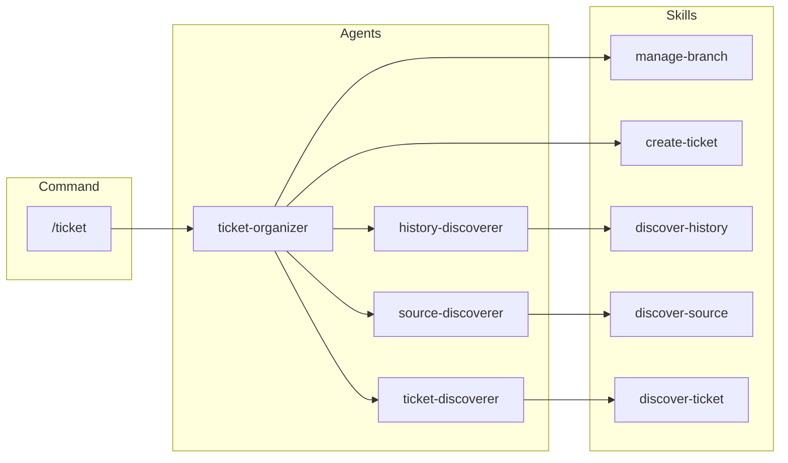
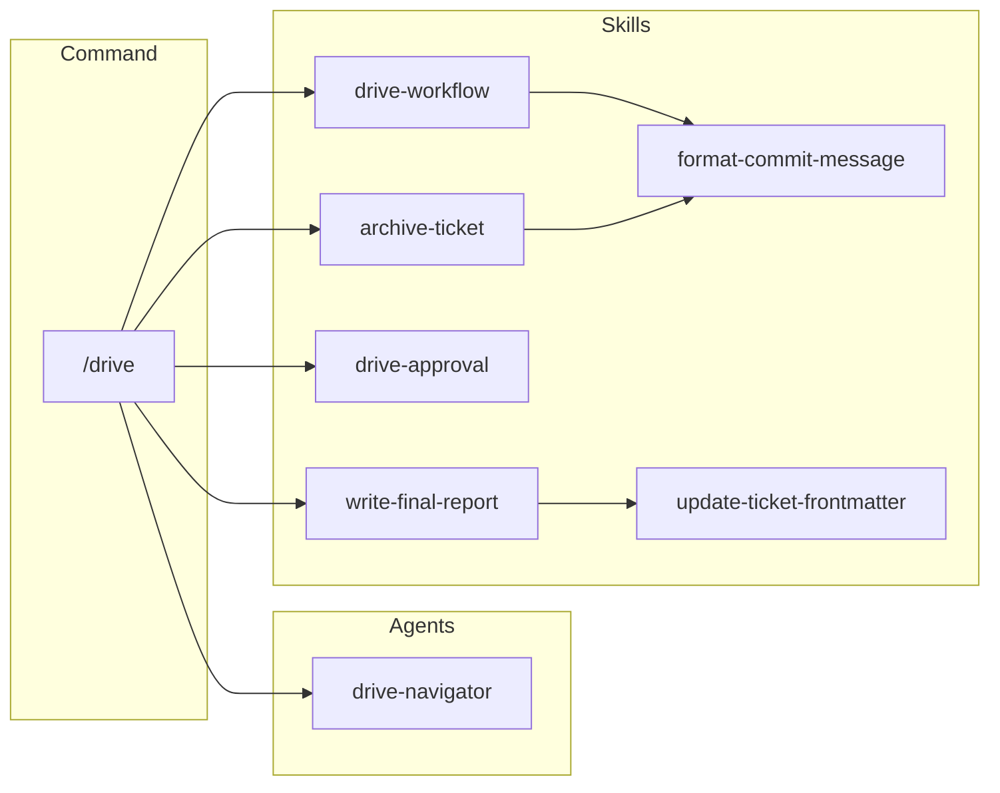
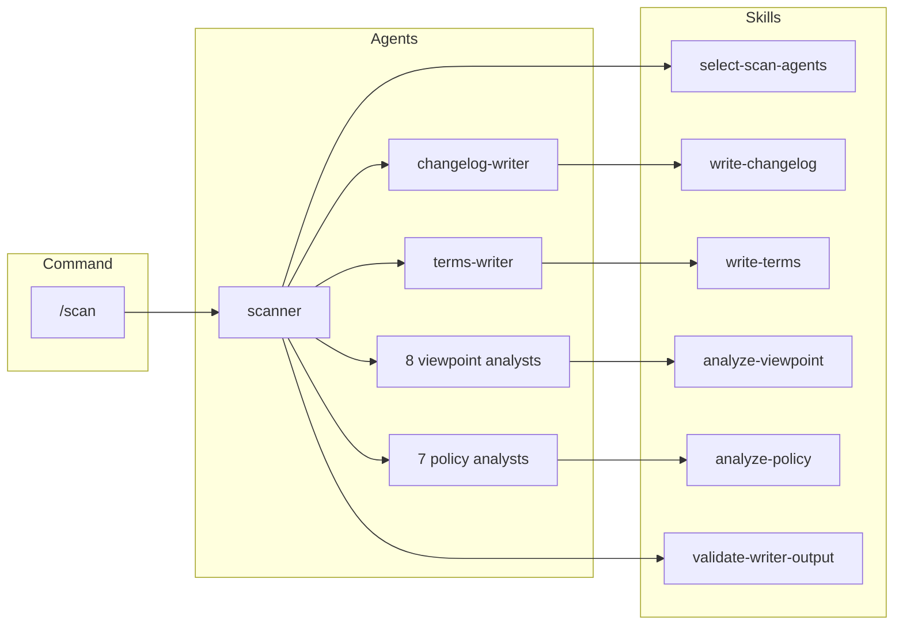
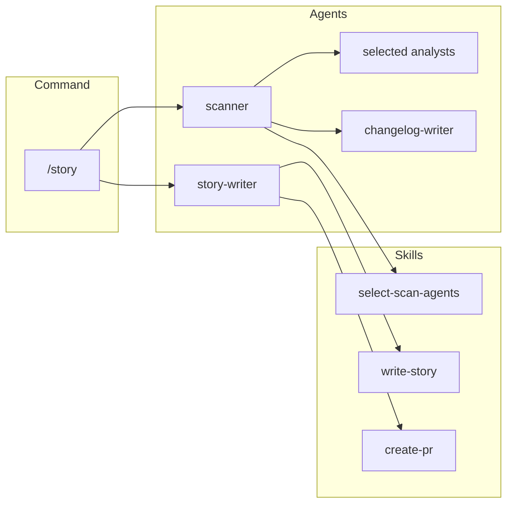
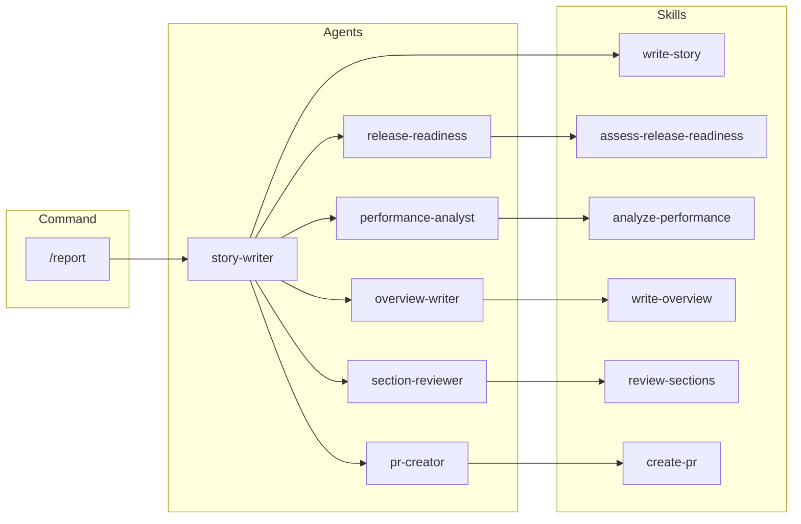
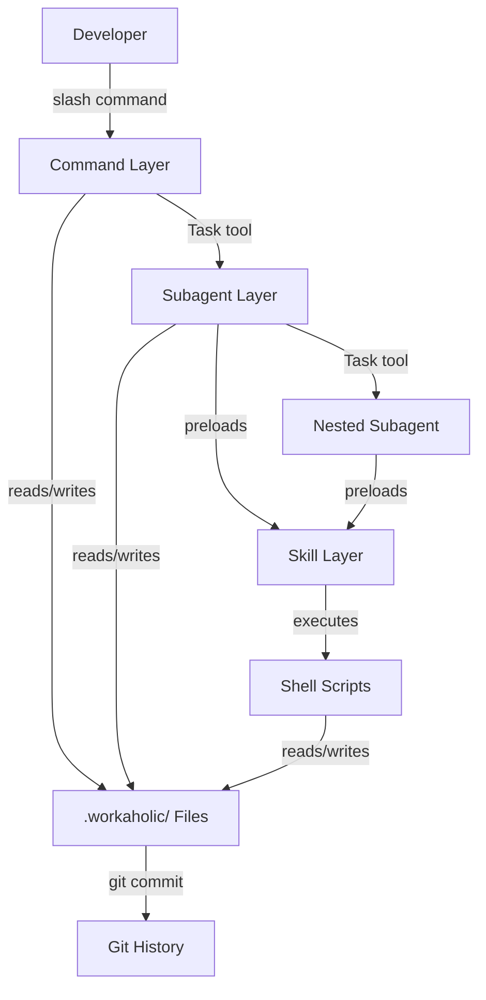

[English](application.md) | [Japanese](application_ja.md)

# 1. Application Viewpoint

Application Viewpoint は、Workaholic がランタイム時にどのように動作するかを記述し、エージェントオーケストレーションパターン、コンポーネント間のデータフロー、および command が成果物を生成する方法を支配する実行モデルに焦点を当てます。

## 2. Execution Model

Workaholic command は Claude Code の会話コンテキスト内で実行されます。ユーザーが slash command を呼び出すと、Claude Code は対応する command markdown ファイルを読み込み、オーケストレーション指示を実行します。Command は Task tool を使用して subagent を生成し、各 subagent はプリロードされた skill を持つ独自のコンテキストで実行されます。

## 3. Agent Orchestration

### 3-1. Ticket Command Flow

`/ticket` command は `ticket-organizer` subagent に完全に委任し、3つのディスカバリーエージェントを並列実行してコンテキストを収集し、ticket を作成します。

### 3-2. Drive Command Flow

`/drive` command はナビゲーターを一度呼び出し、メインの会話コンテキストでプリロードされた skill を使用して ticket を処理します。実装コンテキストが可視化され、承認ループ全体で状態が保持されます。

### 3-3. Scan Command Flow

`/scan` command は scanner を full mode で呼び出し、`select-scan-agents` skill でエージェントを決定後、17のエージェントすべてを単一の並列バッチで生成します。すべてのエージェント完了後、scanner は README インデックスファイルを更新する前に出力ファイルの存在と非空を検証します。

### 3-4. Story Command Flow

`/story` command は scanner を partial mode で呼び出し（ブランチに関連するエージェントのみ）、ドキュメント変更をステージングした後、story-writer を呼び出して story を生成し pull request を作成します。

### 3-5. Report Command Flow

`/report` command はスキャンなしで story-writer に委任し、複数の並列エージェントをオーケストレーションしてコンテンツを準備し、pull request を作成します。

## 4. Data Flow

データは markdown ファイルと git 操作としてシステムを流れます：

1. **入力**: developer が自然言語の説明を提供
2. **ディスカバリー**: エージェントがコードベース、ticket、git 履歴を読み取り
3. **生成**: エージェントが `.workaholic/` に markdown 成果物を生成
4. **バージョニング**: Git commit が各原子的変更を記録
5. **デリバリー**: Story と changelog が pull request の説明を構成

## 5. Concurrency Patterns

システムは2つの並行性パターンを使用します。1つ目は並列エージェント呼び出しで、単一メッセージ内の複数の Task tool 呼び出しを使用して複数の subagent を同時に生成します。2つ目はインタラクティブ承認付きの順次処理で、`/drive` で使用されます。

## 6. Model Selection

| エージェントタイプ | Model | 根拠 |
| --- | --- | --- |
| トップレベルオーケストレーター | opus | 複雑な意思決定、マルチステップワークフロー |
| Viewpoint/policy analyst | sonnet | 集中的な分析タスク、コスト効率 |
| ドキュメントライター | sonnet | 構造化された出力生成 |

## 7. Diagram

## 8. Assumptions

- [Explicit] nesting 階層と model 選択は command ファイルと `CLAUDE.md` に文書化されています。
- [Explicit] scanner は `scanner.md` で定義されているように17のエージェントを並列呼び出しします。
- [Explicit] drive は `drive.md` で定義されているように承認付きで ticket を順次処理します。
- [Inferred] 会話コンテキストは `/drive` のようなマルチステップ操作中の状態維持の主要メカニズムです。外部状態管理システムが存在しないためです。
- [Inferred] オーケストレーターに opus、analyst に sonnet を選択することは、集中的な分析タスクでモデル能力をスループットと交換するコスト・パフォーマンス最適化を反映しています。
