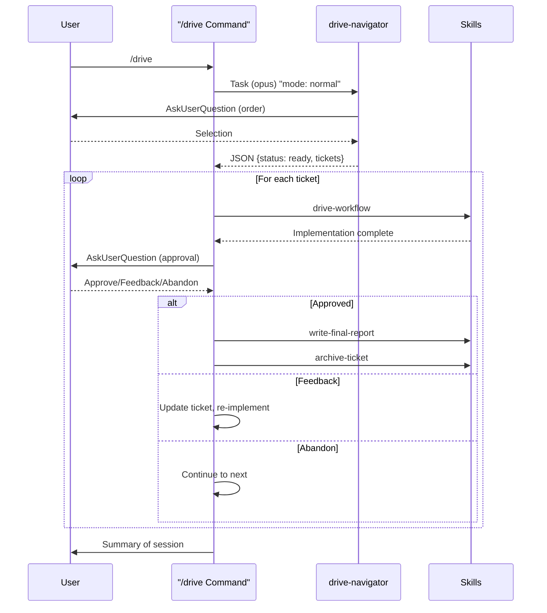
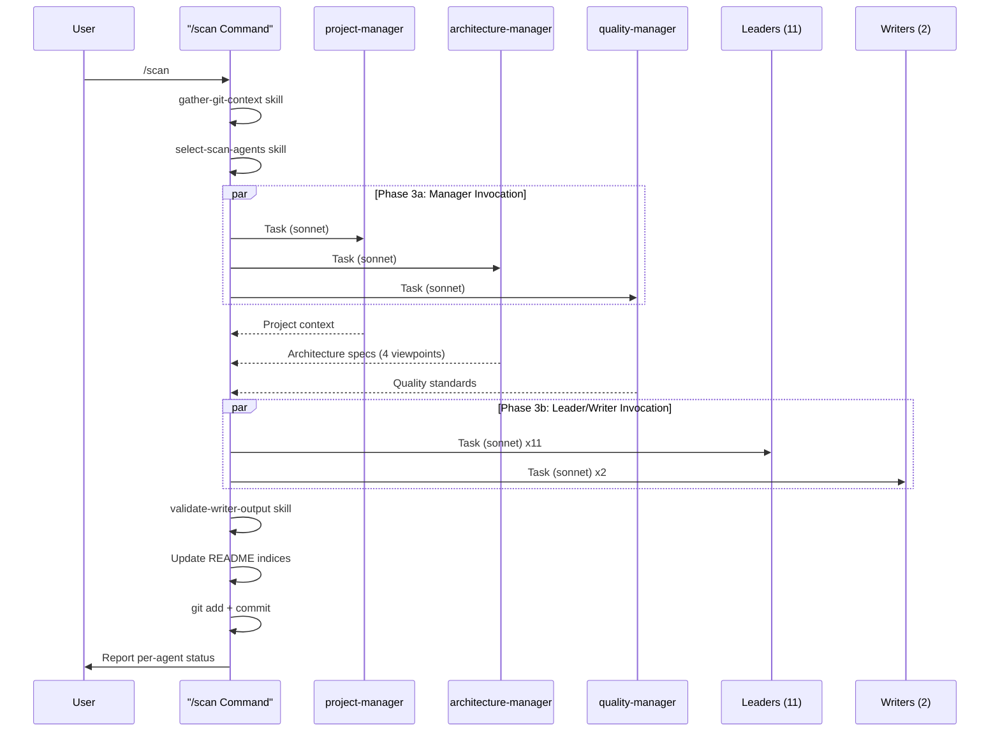
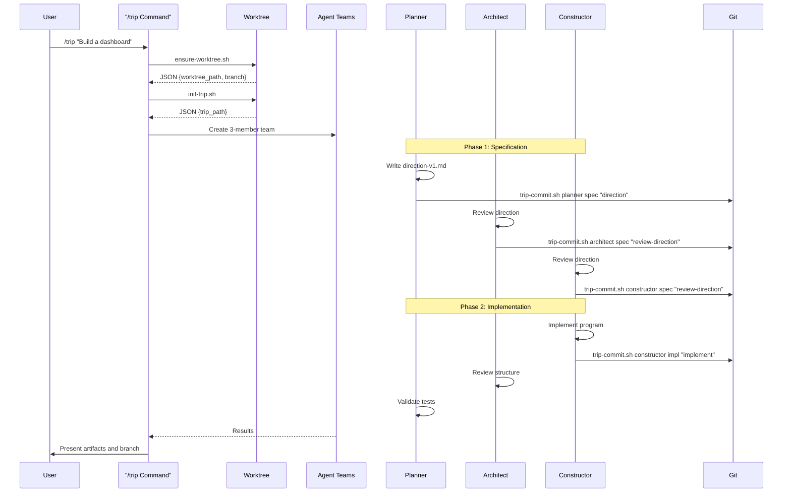
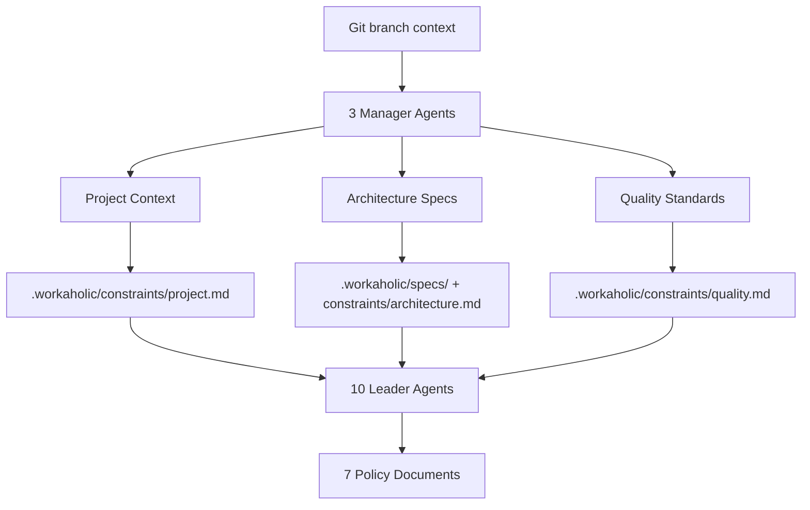
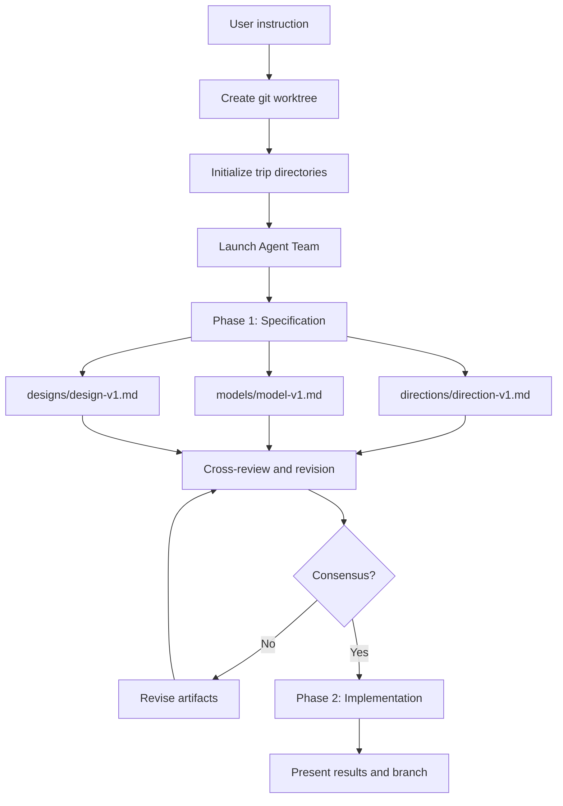

[English](application.md) | [Japanese](application_ja.md)

# Application Viewpoint

Application Viewpoint は、Workaholic の実行時の動作を説明し、agent のオーケストレーションパターン、component 間のデータフロー、command が artifact を生成する実行モデルに焦点を当てています。システムは現在 2 つの plugin で構成されています。drivin（開発 workflow）は agent 呼び出しの有向非巡回グラフとして動作し、各 slash command が manager、leader、writer agent 実行のカスケードをトリガーします。trippin（探索 workflow）は Agent Teams セッションとして動作し、3 つの哲学的 agent がファイルシステムベースの artifact 交換を通じて隔離された git worktree 内で協働します。

## Orchestration Model

### Drivin Plugin のオーケストレーション

Drivin は 4 層のオーケストレーションアーキテクチャに従います。最上層に command、第 2 層に manager agent、第 3 層に leader/writer agent、最下層に skill があります。Command は Claude Code の Task tool を通じて agent を呼び出すことでワークフローをオーケストレーションします。Manager agent は leader agent が消費する戦略的出力（project context、architectural structure、quality standards）を生成します。Leader agent は manager の出力をコンテキストとして使用し、ドメイン固有の分析を実行します。Skill は実際の操作を実装するドメイン知識、template、shell script を含んでいます。

オーケストレーションモデルは厳格なネスティングルールを強制します。Command は skill と agent を呼び出せます。Agent は skill と他の agent を呼び出せます。Skill は他の skill のみ呼び出せます。この階層は循環依存を防ぎ、ワークフローのオーケストレーション（command と agent）と操作知識（skill）の間で明確な関心の分離を維持します。

#### Two-Phase 実行モデル

Scan command は manager tier をサポートするため、2 フェーズの agent オーケストレーションモデルを実装しています。Phase 3a は 3 つの manager agent を並列に呼び出します：project-manager、architecture-manager、quality-manager。Phase 3b はすべての manager の完了を待ち、13 の leader/writer agent を並列に呼び出します。Leader は分析を実行する前に、戦略的入力として manager の出力を読み取ります。

### Trippin Plugin のオーケストレーション

Trippin は Claude Code の実験的な Agent Teams 機能に基づく根本的に異なるオーケストレーションモデルに従います。`/trip` command は隔離された git worktree を作成し、artifact ディレクトリを初期化し、3 メンバーの Agent Team を起動します。チームメンバー（Planner、Architect、Constructor）は `.workaholic/.trips/<trip-name>/` のバージョン管理された markdown artifact を通じて協働します。

Trippin のオーケストレーションモデルは Implosive Structure と呼ばれる 2 フェーズの workflow を使用します：

**Phase 1（Specification -- Inner Loop）**: Agent は完全なコンセンサスに達するまで仕様 artifact を作成し相互レビューします。Planner が Direction artifact を、Architect が Model artifact を、Constructor が Design artifact を作成します。各 artifact は他の 2 つの agent によるクロスレビューを受けます。

**Phase 2（Implementation -- Outer Loop）**: 承認された仕様 artifact に基づき、チームは構築に移行します。Planner がテスト計画を作成し、Constructor がプログラムを実装し、Architect が構造的整合性をレビューし、Planner がテストで検証します。

両フェーズのすべての離散的ワークフローステップが worktree branch に git commit を生成し、協働プロセスの完全なトレースを作成します。

### Command レベルのオーケストレーションパターン

#### Ticket Command のオーケストレーション

```mermaid
sequenceDiagram
    participant User
    participant ticket as "/ticket Command"
    participant to as ticket-organizer
    participant hd as history-discoverer
    participant sd as source-discoverer
    participant td as ticket-discoverer

    User->>ticket: /ticket "Add feature X"
    ticket->>to: Task (opus)

    par Parallel Discovery
        to->>hd: Task (opus)
        hd-->>to: JSON {summary, tickets}
        to->>sd: Task (opus)
        sd-->>to: JSON {files, code_flow}
        to->>td: Task (opus)
        td-->>to: JSON {status, recommendation}
    end

    to->>to: Write ticket(s)
    to-->>ticket: JSON {status, tickets}
    ticket->>User: Present ticket location
```

`/ticket` command は ticket-organizer subagent に完全に委譲し、3 つの並列 discovery agent を使って履歴コンテキスト、ソースコードの場所、重複検出を収集します。

#### Drive Command のオーケストレーション

```mermaid
sequenceDiagram
    participant User
    participant drive as "/drive Command"
    participant nav as drive-navigator
    participant skill as Skills

    User->>drive: /drive
    drive->>nav: Task (opus) "mode: normal"
    nav->>User: AskUserQuestion (order)
    User-->>nav: Selection
    nav-->>drive: JSON {status: ready, tickets}

    loop For each ticket
        drive->>skill: drive-workflow
        skill-->>drive: Implementation complete
        drive->>User: AskUserQuestion (approval)
        User-->>drive: Approve/Feedback/Abandon

        alt Approved
            drive->>skill: write-final-report
            drive->>skill: archive-ticket
        else Feedback
            drive->>drive: Update ticket, re-implement
        else Abandon
            drive->>drive: Continue to next
        end
    end

    drive->>User: Summary of session
```

Drive command はすべての承認プロンプトに ticket のタイトルと概要を含めることを強制します。これらの値が agent のコンテキストで利用できない場合（特にフィードバック再実装ループ後）、承認ダイアログを提示する前に ticket ファイルを再読み取りする必要があります。

#### Scan Command の Two-Phase オーケストレーション

```mermaid
sequenceDiagram
    participant User
    participant scan as "/scan Command"
    participant PM as project-manager
    participant AM as architecture-manager
    participant QM as quality-manager
    participant Leaders as Leaders (11)
    participant Writers as Writers (2)

    User->>scan: /scan
    scan->>scan: gather-git-context skill
    scan->>scan: select-scan-agents skill

    par Phase 3a: Manager Invocation
        scan->>PM: Task (sonnet)
        scan->>AM: Task (sonnet)
        scan->>QM: Task (sonnet)
    end

    PM-->>scan: Project context
    AM-->>scan: Architecture specs (4 viewpoints)
    QM-->>scan: Quality standards

    par Phase 3b: Leader/Writer Invocation
        scan->>Leaders: Task (sonnet) x11
        scan->>Writers: Task (sonnet) x2
    end

    scan->>scan: validate-writer-output skill
    scan->>scan: Update README indices
    scan->>scan: git add + commit
    scan->>User: Report per-agent status
```

#### Trip Command のオーケストレーション

```mermaid
sequenceDiagram
    participant User
    participant trip as "/trip Command"
    participant WT as Worktree
    participant Team as Agent Teams
    participant P as Planner
    participant A as Architect
    participant C as Constructor
    participant Git as Git

    User->>trip: /trip "Build a dashboard"
    trip->>WT: ensure-worktree.sh
    WT-->>trip: JSON {worktree_path, branch}
    trip->>WT: init-trip.sh
    WT-->>trip: JSON {trip_path}

    trip->>Team: Create 3-member team

    Note over P,C: Phase 1: Specification

    P->>P: Write direction-v1.md
    P->>Git: trip-commit.sh planner spec "direction"
    A->>A: Review direction
    A->>Git: trip-commit.sh architect spec "review-direction"
    C->>C: Review direction
    C->>Git: trip-commit.sh constructor spec "review-direction"

    Note over P,C: Phase 2: Implementation

    C->>C: Implement program
    C->>Git: trip-commit.sh constructor impl "implement"
    A->>A: Review structure
    P->>P: Validate tests

    Team-->>trip: Results
    trip->>User: Present artifacts and branch
```

`/trip` command は drivin command とは異なるオーケストレーションモデルに従います。Task tool パターンの代わりに、Claude Code の実験的な Agent Teams 機能を使用して、ファイルシステム artifact を通じて協働する 3 メンバーチームを作成します。

### Manager Tier の責任

3 つの manager agent が制約設定とコンテキスト生成を通じてプロジェクトの戦略的バックボーンを確立します：

**project-manager**: ビジネスドメイン、ステークホルダーマップ、タイムラインステータス、アクティブな課題、提案されたソリューションをカバーするプロジェクトコンテキストを生成します。

**architecture-manager**: システム境界、layer taxonomy、component inventory、横断的関心事、構造パターンを含むアーキテクチャコンテキストを生成します。4 つの viewpoint spec（application.md、component.md、feature.md、usecase.md）も生成します。

**quality-manager**: 品質の次元と基準、保証プロセス定義、改善指標、フィードバックループ仕様をカバーする品質コンテキストを生成します。

### Leader Tier の責任

10 の leader agent が manager の出力を戦略的コンテキストとして消費し、専門的なレンズを通じてコードベースを分析してドメイン固有のポリシードキュメントを生成します：

**ux-lead**: ux.md を生成。**infra-lead**: infrastructure.md を生成。**db-lead**: data.md を生成。**security-lead**: security.md を生成。**test-lead**: test.md を生成。**quality-lead**: quality.md を生成。**a11y-lead**: accessibility.md を生成。**observability-lead**: observability.md を生成。**delivery-lead**: delivery.md を生成。**recovery-lead**: recovery.md を生成。

### 並列 vs 逐次実行

システムは作業の性質に基づいて 2 つの異なる並行性パターンを使用します。並列実行は相互依存のない複数の独立タスクが同時に進行できる場合に使用します。逐次実行はタスクが前の結果に依存する場合やステップ間で人間のインタラクションが必要な場合に使用します。

`/trip` command は第 3 の並行性モデル（Agent Teams）を導入します。Trip セッションの 3 つの agent は、Task tool 呼び出しではなくファイルシステム artifact を通じて通信する独立したチームメンバーとして動作します。

## Data Flow

データは markdown ファイル、git 操作、agent 間の JSON 構造化メッセージとしてシステムを流れます。

### Manager Output Flow

```mermaid
flowchart TD
    Context[Git branch context] --> Managers[3 Manager Agents]
    Managers --> PM[Project Context]
    Managers --> AM[Architecture Specs]
    Managers --> QM[Quality Standards]

    PM --> Specs1[.workaholic/constraints/project.md]
    AM --> Specs2[.workaholic/specs/ + constraints/architecture.md]
    QM --> Specs3[.workaholic/constraints/quality.md]

    Specs1 --> Leaders[10 Leader Agents]
    Specs2 --> Leaders
    Specs3 --> Leaders

    Leaders --> Policies[7 Policy Documents]
```

### Trip Artifact Flow

```mermaid
flowchart TD
    Input[User instruction] --> Worktree[Create git worktree]
    Worktree --> Init[Initialize trip directories]
    Init --> Team[Launch Agent Team]

    Team --> P1[Phase 1: Specification]
    P1 --> Dir[directions/direction-v1.md]
    P1 --> Model[models/model-v1.md]
    P1 --> Design[designs/design-v1.md]

    Dir --> Review[Cross-review and revision]
    Model --> Review
    Design --> Review

    Review --> Consensus{Consensus?}
    Consensus -->|No| Revise[Revise artifacts]
    Revise --> Review
    Consensus -->|Yes| P2[Phase 2: Implementation]

    P2 --> Results[Present results and branch]
```

Trip artifact フローは git worktree 内で完全に動作します。Agent はバージョン管理された markdown ファイルを読み書きすることで通信します。すべての書き込み操作が `trip-commit.sh` を通じて git commit を生成し、trip branch に完全な監査証跡を作成します。

### データフォーマットの変遷

データはシステムを流れる中でフォーマット間を変換します。ユーザー入力は自然言語テキストとして始まります。Discovery agent はこれを構造化フィールドを持つ JSON オブジェクトに変換します。ticket-organizer は JSON を YAML frontmatter 付きの ticket markdown ファイルに変換します。

Trippin plugin では、データフォーマットは一貫して構造化 frontmatter（author、status、reviewed-by）を持つバージョン管理された markdown artifact です。Agent はこれらのファイルを通じてのみ通信し、git commit が調整メカニズムとして機能します。

## 実行ライフサイクル

### Command の呼び出し

2 つの plugin が marketplace に登録されているため（drivin と trippin）、command は plugin ごとに名前空間が分かれています。`/ticket`、`/drive`、`/scan`、`/report` command は drivin に属し、`/trip` は trippin に属します。

### Skill のプリロード

Skill パスは plugin 固有です。Drivin の skill は `~/.claude/plugins/marketplaces/workaholic/plugins/drivin/skills/` に解決され、trippin の skill は `~/.claude/plugins/marketplaces/workaholic/plugins/trippin/skills/` に解決されます。

### Agent Teams の実行

Trippin plugin は 2 番目の agent スポーンメカニズムを導入します：Agent Teams。`/trip` command は Claude Code の実験的な Agent Teams 機能（`CLAUDE_CODE_EXPERIMENTAL_AGENT_TEAMS=1` が必要）を通じて 3 メンバーチームを作成します。Task tool 呼び出しとは異なり、Agent Teams メンバーは独自のコンテキストウィンドウを持つ独立したピアとして動作します。

### Git 操作

Trippin plugin は worktree ベースの git 操作を導入します。`ensure-worktree.sh` script は `.worktrees/<trip-name>/` に `trip/<trip-name>` branch で git worktree を作成します。Trip セッションでの以降のすべての操作はこの worktree 内で行われ、メインの作業ツリーからの完全な隔離を提供します。

### エラーハンドリング

Trip command は worktree 作成エラー（不潔な git 状態、既存の worktree、既存の branch）をユーザーに通知し、Agent Team を起動する前に停止することでハンドリングします。

## Model 選択戦略

トップレベルのオーケストレーターは opus を使用します。Manager と leader agent は sonnet を使用します。Release note 生成は haiku を使用します。Discovery agent は opus を使用します。

Trippin plugin の 3 つの agent（planner、architect、constructor）はすべて opus を使用します。Agent Teams のコンテキストでは、cross-artifact レビューとコンセンサス構築に opus レベルの推論能力が有益です。

## アーキテクチャの進化

### Core Plugin から Drivin への名称変更

Core plugin ディレクトリは `plugins/core` から `plugins/drivin` に名称変更され、すべての参照が更新されました。Plugin.json、marketplace.json、すべての `subagent_type: "core:*"` 参照（`drivin:*` に変更）、すべてのインストール済み plugin パス参照、CLAUDE.md に影響しました。

### Trippin Plugin の作成

2 番目の plugin、trippin が marketplace に追加されました。Implosive Structure 方法論に基づく AI 指向の探索と創造的開発 workflow を提供します。`/trip` command、3 つの Agent Teams agent（planner、architect、constructor）、trip-protocol skill、3 つのバンドルされた shell script を導入します。

### Drive 承認コンテキストの強制

Drive 承認フローが強化され、すべての承認プロンプトに ticket のタイトルと概要を含めることが強制されるようになりました。Drive command の Step 2.2 には、drive-workflow の結果からのタイトル/概要のハンドオフを要求する CRITICAL ルールが追加されました。

## Assumptions

- [Explicit] 2 フェーズ実行モデル（manager の後に leader）は scan.md の Phase 3a と 3b に文書化されています。
- [Explicit] Core plugin は drivin に名称変更され、すべての subagent_type prefix が "core:" から "drivin:" に変更されました。
- [Explicit] Trippin plugin は 1 command（trip）、3 agent（planner、architect、constructor）、1 skill（trip-protocol）、3 shell script で存在します。
- [Explicit] Trip command は Agent Teams の実験的機能フラグ（`CLAUDE_CODE_EXPERIMENTAL_AGENT_TEAMS=1`）を必要とします。
- [Explicit] Trip セッションは ensure-worktree.sh で作成された隔離された git worktree で実行されます。
- [Explicit] すべての trip workflow ステップが trip-commit.sh を通じて `trip(<agent>): <step>` フォーマットで git commit を生成します。
- [Explicit] Drive-approval skill は CRITICAL 強制と失敗条件言語で承認プロンプトに ticket のタイトルと概要を要求します。
- [Explicit] Marketplace は同期されたバージョンで 2 つの plugin（drivin と trippin）を登録しています。
- [Inferred] Trippin plugin の Agent Teams モデルは、drivin で使用される階層的 Task tool パターンに対する、ピアベースの協働を探索する意図的なアーキテクチャ選択を表しています。
- [Inferred] Trippin の worktree 隔離により、trip セッションがメインの作業ツリーや進行中の drivin workflow に干渉しないことが保証されます。
- [Inferred] Trippin agent の 3 つの哲学的スタンス（Progressive、Neutral、Conservative）は、弁証法的レビューを通じて徹底的な仕様策定を促進する生産的な緊張を生み出すように設計されています。
