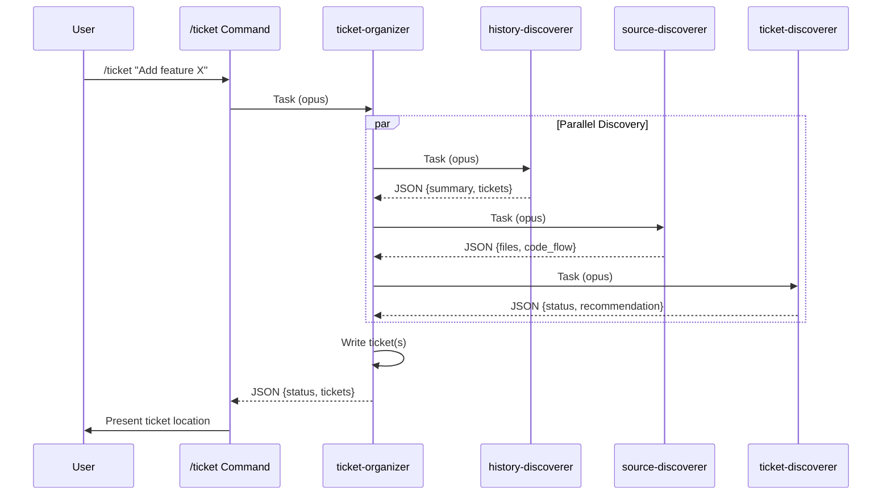
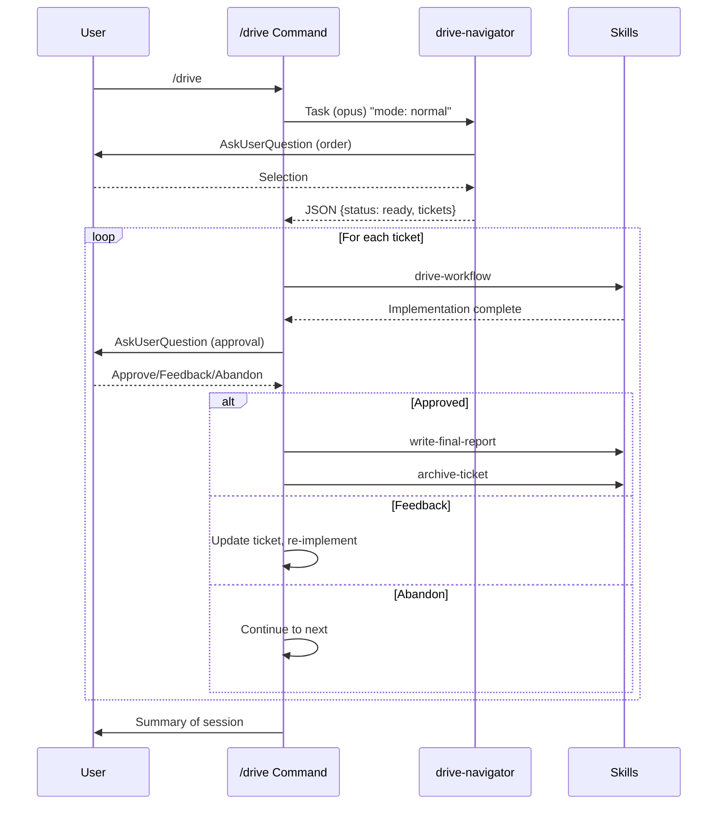
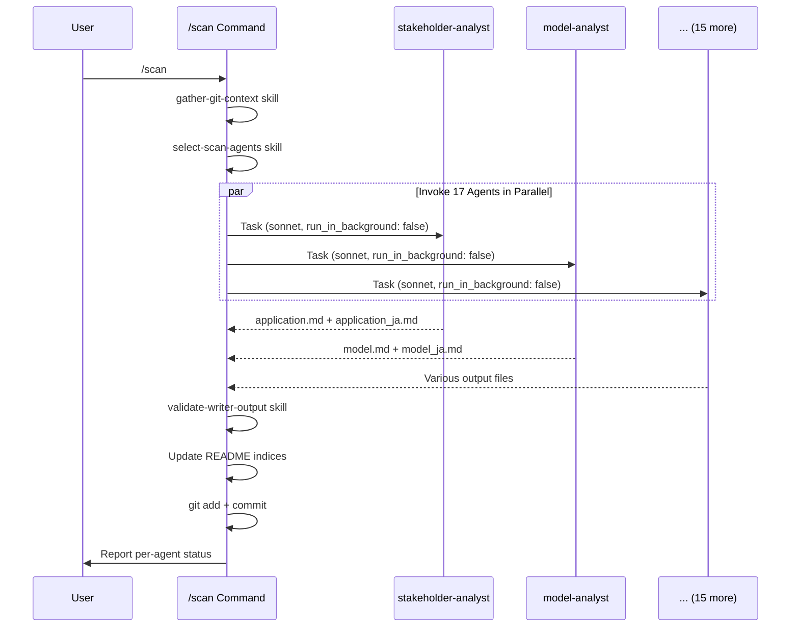
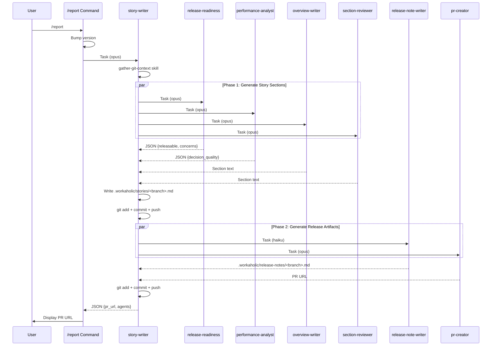
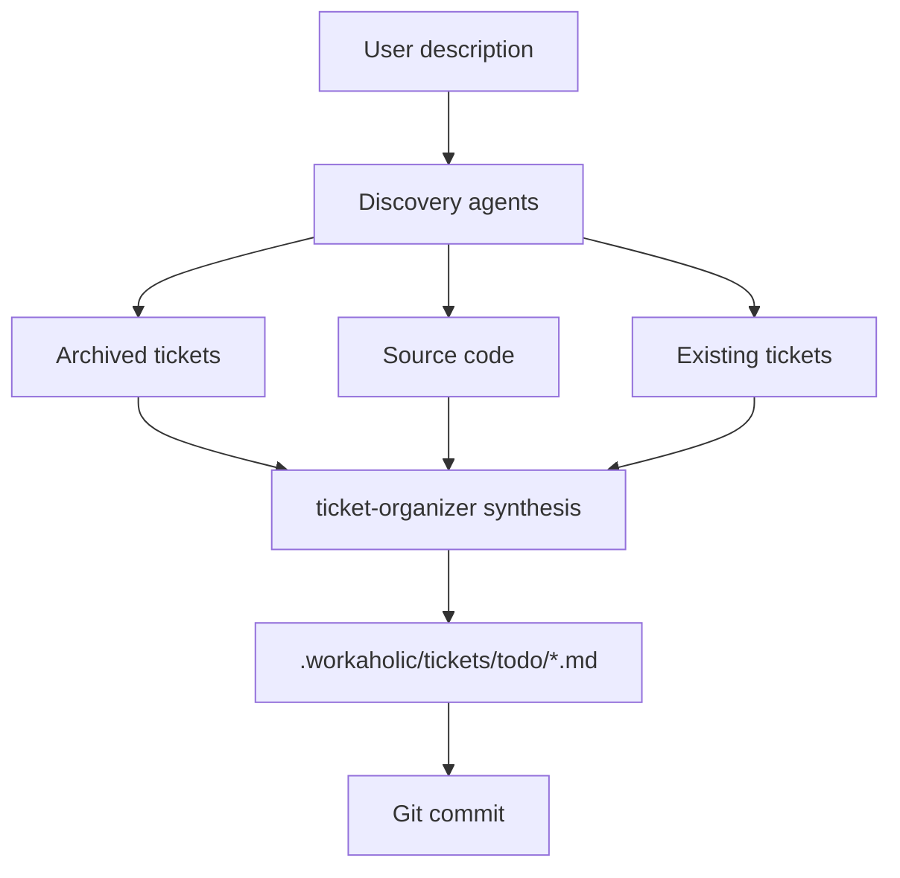
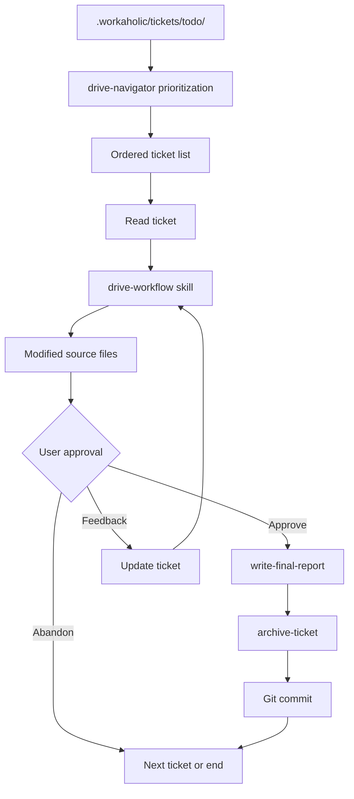
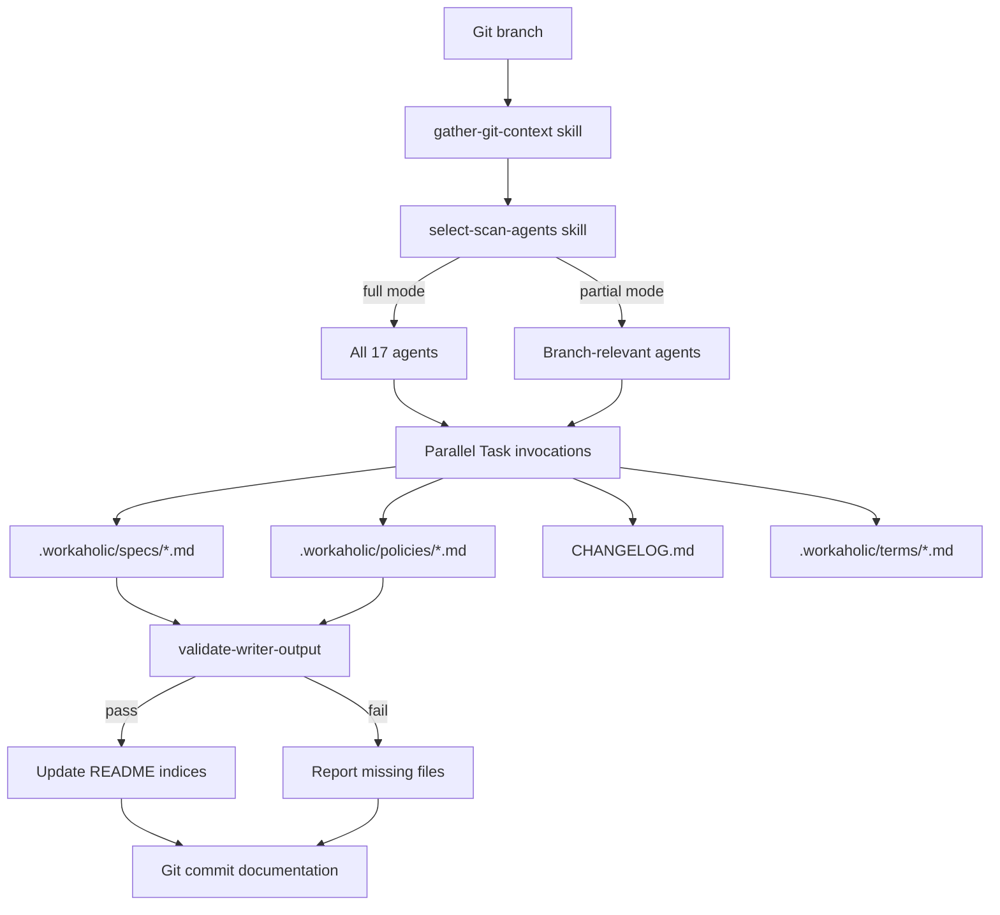
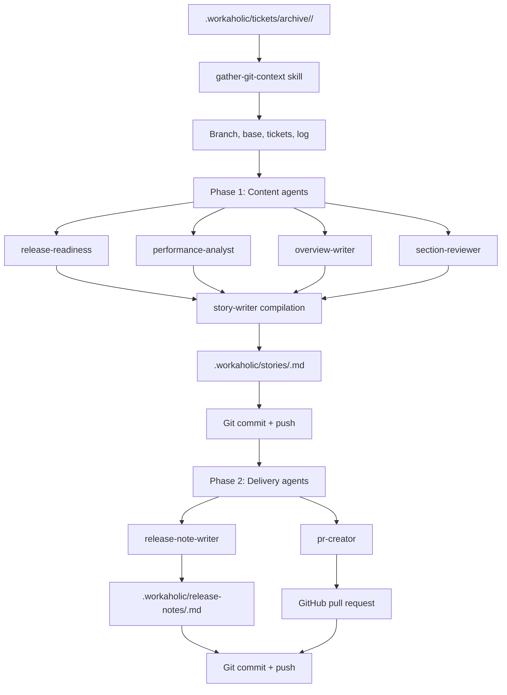

[English](application.md) | [Japanese](application_ja.md)

# Application Viewpoint

Application Viewpoint は、Workaholic の実行時の動作を説明し、agent のオーケストレーションパターン、component 間のデータフロー、command が artifact を生成する実行モデルに焦点を当てています。このシステムは agent 呼び出しの有向非巡回グラフとして動作し、各 slash command が Claude Code の runtime 内で subagent と skill の実行のカスケードをトリガーします。

## Orchestration Model

Workaholic は 3 層のオーケストレーションアーキテクチャに従っています。上層に command、中層に subagent、下層に skill があります。Command は Claude Code の Task tool を通じて subagent を呼び出すことでワークフローをオーケストレーションします。Subagent はプリロードされた skill を実行することで焦点を絞ったタスクを実行します。Skill は実際の操作を実装するドメイン知識、template、shell script を含んでいます。

Orchestration model は厳格なネスティングルールを強制します。Command は skill と subagent を呼び出せます。Subagent は skill と他の subagent を呼び出せます。Skill は他の skill を呼び出せますが、subagent や command は呼び出せません。この階層は循環依存を防ぎ、ワークフローのオーケストレーション(command と subagent)と操作知識(skill)の間で明確な関心の分離を維持します。

### Command-Level Orchestration Patterns

#### Ticket Command Orchestration

```mermaid
sequenceDiagram
    participant User
    participant ticket as /ticket Command
    participant to as ticket-organizer
    participant hd as history-discoverer
    participant sd as source-discoverer
    participant td as ticket-discoverer

    User->>ticket: /ticket "Add feature X"
    ticket->>to: Task (opus)

    par Parallel Discovery
        to->>hd: Task (opus)
        hd-->>to: JSON {summary, tickets}
        to->>sd: Task (opus)
        sd-->>to: JSON {files, code_flow}
        to->>td: Task (opus)
        td-->>to: JSON {status, recommendation}
    end

    to->>to: Write ticket(s)
    to-->>ticket: JSON {status, tickets}
    ticket->>User: Present ticket location
```

`/ticket` command は ticket-organizer subagent に完全に委譲します。ticket-organizer は 3 つの並列 discovery agent をオーケストレーションして、履歴コンテキスト、ソースコードの場所、重複検出を収集します。すべての discovery agent が完了した後、organizer は結果を 1 つ以上の ticket ファイルに統合します。ticket command は git commit 操作とユーザーへの提示を処理します。

#### Drive Command Orchestration

```mermaid
sequenceDiagram
    participant User
    participant drive as /drive Command
    participant nav as drive-navigator
    participant skill as Skills

    User->>drive: /drive
    drive->>nav: Task (opus) "mode: normal"
    nav->>User: AskUserQuestion (order)
    User-->>nav: Selection
    nav-->>drive: JSON {status: ready, tickets}

    loop For each ticket
        drive->>skill: drive-workflow
        skill-->>drive: Implementation complete
        drive->>User: AskUserQuestion (approval)
        User-->>drive: Approve/Feedback/Abandon

        alt Approved
            drive->>skill: write-final-report
            drive->>skill: archive-ticket
        else Feedback
            drive->>drive: Update ticket, re-implement
        else Abandon
            drive->>drive: Continue to next
        end
    end

    drive->>User: Summary of session
```

`/drive` command は drive-navigator subagent を 1 回使用して ticket を優先順位付けし、その後各 ticket をメイン command コンテキストで順次処理します。これにより実装コンテキストがユーザーに可視化され、承認ループ全体で状態が保持されます。command は subagent に委譲するのではなく、プリロードされた skill(drive-workflow、write-final-report、archive-ticket)を使用し、インタラクティブな承認フローを完全に制御します。

#### Scan Command Orchestration

```mermaid
sequenceDiagram
    participant User
    participant scan as /scan Command
    participant Agent1 as stakeholder-analyst
    participant Agent2 as model-analyst
    participant AgentN as ... (15 more)

    User->>scan: /scan
    scan->>scan: gather-git-context skill
    scan->>scan: select-scan-agents skill

    par Invoke 17 Agents in Parallel
        scan->>Agent1: Task (sonnet, run_in_background: false)
        scan->>Agent2: Task (sonnet, run_in_background: false)
        scan->>AgentN: Task (sonnet, run_in_background: false)
    end

    Agent1-->>scan: application.md + application_ja.md
    Agent2-->>scan: model.md + model_ja.md
    AgentN-->>scan: Various output files

    scan->>scan: validate-writer-output skill
    scan->>scan: Update README indices
    scan->>scan: git add + commit
    scan->>User: Report per-agent status
```

`/scan` command は 17 個すべての documentation agent の直接並列オーケストレーションを実装します。以前は scanner subagent に委譲されていましたが、リアルタイムの進行状況の可視性を提供するためにフラット化されました。command はすべての agent を 1 つのメッセージで明示的な `run_in_background: false` を付けて呼び出し、agent が Write/Edit 権限を保持することを保証します。すべての agent が完了した後、command は README インデックスを更新する前に出力ファイルが存在することを検証します。

#### Report Command Orchestration

```mermaid
sequenceDiagram
    participant User
    participant report as /report Command
    participant sw as story-writer
    participant rr as release-readiness
    participant pa as performance-analyst
    participant ow as overview-writer
    participant sr as section-reviewer
    participant rnw as release-note-writer
    participant pc as pr-creator

    User->>report: /report
    report->>report: Bump version
    report->>sw: Task (opus)
    sw->>sw: gather-git-context skill

    par Phase 1: Generate Story Sections
        sw->>rr: Task (opus)
        sw->>pa: Task (opus)
        sw->>ow: Task (opus)
        sw->>sr: Task (opus)
    end

    rr-->>sw: JSON {releasable, concerns}
    pa-->>sw: JSON {decision_quality}
    ow-->>sw: Section text
    sr-->>sw: Section text

    sw->>sw: Write .workaholic/stories/<branch>.md
    sw->>sw: git add + commit + push

    par Phase 2: Generate Release Artifacts
        sw->>rnw: Task (haiku)
        sw->>pc: Task (opus)
    end

    rnw-->>sw: .workaholic/release-notes/<branch>.md
    pc-->>sw: PR URL

    sw->>sw: git add + commit + push
    sw-->>report: JSON {pr_url, agents}
    report->>User: Display PR URL
```

`/report` command は story-writer subagent に委譲します。story-writer は 2 つのフェーズの並列 agent 呼び出しをオーケストレーションします。Phase 1 は 4 つの並列 agent を使用して story のコンテンツセクションを生成します。Phase 2 はさらに 2 つの並列 agent を使用してリリースノートを生成し、pull request を作成します。story-writer はすべての git 操作を処理し、PR URL を report command に返して表示させます。

### Parallel vs Sequential Execution

システムは作業の性質に基づいて 2 つの異なる並行性パターンを使用します。並列実行は、相互依存関係なしに複数の独立したタスクを同時に進めることができる場合に使用されます。順次実行は、タスクが以前の結果に依存するか、ステップ間で人間の介入を必要とする場合に使用されます。

データ収集や分析のために複数の agent を呼び出す command は、1 つのメッセージで並列 Task tool 呼び出しを使用します。`/scan` command は 17 個の agent を同時に呼び出します。story-writer は phase 1 で 4 個の agent、phase 2 で 2 個の agent を呼び出します。ticket-organizer は 3 個の discovery agent を同時に呼び出します。この並列パターンは独立した分析タスクのスループットを最大化します。

ユーザーワークフローを実装する command は承認ゲートを伴う順次実行を使用します。`/drive` command は ticket を 1 つずつ処理し、各実装の後にユーザーの承認を待ちます。この順次パターンは人間の監視を保証し、承認されたものと拒否または修正されたものの明確な監査証跡を維持します。

### Agent Depth and Nesting

システムは最大 2 層の agent レイヤーを強制します。Command は subagent を呼び出し(深さ 1)、subagent は他の subagent を呼び出せます(深さ 2)が、3 層目のネスティングは使用されません。この制約は認知的な管理可能性を維持し、デバッグが困難になる深くネストされたコンテキストを防ぎます。

scanner subagent から直接 scan command オーケストレーションへの最近の移行により、1 つのネスティングレベルが削除されました。以前は scan command が scanner を呼び出し、scanner が 17 個の analyst を呼び出していました(2 層)。現在は scan command が 17 個の analyst を直接呼び出します(1 層)。このフラット化は command の複雑さを犠牲にして進行状況の可視性を向上させます。

### Background Execution Constraint

すべての scan agent は `run_in_background: false`(デフォルト)で実行する必要があります。なぜなら background agent は Write および Edit tool の権限が自動的に拒否されるためです。17 個すべての scan agent が出力ファイルを書き込む必要があるため、background 実行はサイレント失敗を引き起こします。scan command はこの制約を明示的に文書化し、Claude Code が並列 Task 呼び出しを background 操作として解釈するのを防ぎます。

## Data Flow

データは markdown ファイル、git 操作、agent 間の JSON 構造化メッセージとしてシステムを流れます。主要なフローはユーザー入力から git 履歴へのパイプラインに従います。

### Ticket Creation Flow

```mermaid
flowchart TD
    Input[User description] --> Discover[Discovery agents]
    Discover --> History[Archived tickets]
    Discover --> Source[Source code]
    Discover --> Duplicates[Existing tickets]

    History --> Synthesis[ticket-organizer synthesis]
    Source --> Synthesis
    Duplicates --> Synthesis

    Synthesis --> Ticket[.workaholic/tickets/todo/*.md]
    Ticket --> Commit[Git commit]
```

Ticket 作成フローはユーザーからの自然言語記述から始まります。3 つの discovery agent がコードベースの異なる部分を並列に読み取ります。history-discoverer はアーカイブされた ticket を検索し、source-discoverer はソースコードを探索し、ticket-discoverer は重複をチェックします。3 つすべてが JSON 構造化結果を ticket-organizer に返し、organizer がそれらを 1 つ以上の ticket markdown ファイルに統合します。ticket command はこれらのファイルを git にコミットします。

### Implementation Flow

```mermaid
flowchart TD
    Queue[.workaholic/tickets/todo/] --> Navigate[drive-navigator prioritization]
    Navigate --> Order[Ordered ticket list]
    Order --> Read[Read ticket]
    Read --> Implement[drive-workflow skill]
    Implement --> Changes[Modified source files]
    Changes --> Approval{User approval}

    Approval -->|Approve| Report[write-final-report]
    Approval -->|Feedback| Update[Update ticket]
    Approval -->|Abandon| Next

    Report --> Archive[archive-ticket]
    Archive --> Commit[Git commit]
    Commit --> Next[Next ticket or end]
    Update --> Implement
```

実装フローは todo キュー内の ticket から始まります。drive-navigator は type と layer に基づいてそれらを読み取り優先順位を付けます。各 ticket について、drive-workflow skill がソースファイルの変更を実装します。ユーザーは承認、フィードバック提供、または放棄を行います。承認時には write-final-report skill が ticket を effort と要約で更新し、その後 archive-ticket が ticket をアーカイブディレクトリに移動し、ticket とソース変更の両方を構造化されたコミットメッセージでコミットします。

### Documentation Scan Flow

```mermaid
flowchart TD
    Branch[Git branch] --> Context[gather-git-context skill]
    Context --> Select[select-scan-agents skill]

    Select -->|full mode| All[All 17 agents]
    Select -->|partial mode| Relevant[Branch-relevant agents]

    All --> Invoke[Parallel Task invocations]
    Relevant --> Invoke

    Invoke --> Specs[.workaholic/specs/*.md]
    Invoke --> Policies[.workaholic/policies/*.md]
    Invoke --> Changelog[CHANGELOG.md]
    Invoke --> Terms[.workaholic/terms/*.md]

    Specs --> Validate[validate-writer-output]
    Policies --> Validate

    Validate -->|pass| Index[Update README indices]
    Validate -->|fail| Report[Report missing files]

    Index --> DocCommit[Git commit documentation]
    Report --> DocCommit
```

Documentation scan フローは git branch コンテキストを使用してどの agent を呼び出すかを決定します。full mode では 17 個すべての agent が実行されます。partial mode では変更されたファイルに関連する agent のみが実行されます。Agent はそれぞれのディレクトリに出力を書き込みます。validate-writer-output skill は期待されるファイルが存在し空でないことをチェックします。検証が通過すると README インデックスファイルが更新されます。最後にすべてのドキュメント変更が一緒にコミットされます。

### Story Generation Flow

```mermaid
flowchart TD
    Archive[.workaholic/tickets/archive/<branch>/] --> Gather[gather-git-context skill]
    Gather --> Context[Branch, base, tickets, log]

    Context --> Phase1[Phase 1: Content agents]
    Phase1 --> RR[release-readiness]
    Phase1 --> PA[performance-analyst]
    Phase1 --> OW[overview-writer]
    Phase1 --> SR[section-reviewer]

    RR --> Compile[story-writer compilation]
    PA --> Compile
    OW --> Compile
    SR --> Compile

    Compile --> Story[.workaholic/stories/<branch>.md]
    Story --> StoryCommit[Git commit + push]

    StoryCommit --> Phase2[Phase 2: Delivery agents]
    Phase2 --> RN[release-note-writer]
    Phase2 --> PC[pr-creator]

    RN --> ReleaseNote[.workaholic/release-notes/<branch>.md]
    PC --> PR[GitHub pull request]

    ReleaseNote --> ReleaseCommit[Git commit + push]
    PR --> ReleaseCommit
```

Story 生成フローは現在の branch のアーカイブされた ticket を読み取り、story セクションを生成するために 4 つの並列 agent を呼び出します。story-writer はそれらの出力を story ファイルにコンパイルし、コミットしてプッシュし、その後さらに 2 つの agent を並列に呼び出します。1 つはリリースノートを生成し、もう 1 つは GitHub CLI を使用して pull request を作成します。リリースノートはコミットされプッシュされます。PR URL がユーザーに返されます。

### Data Format Transitions

データはシステムを流れるにつれてフォーマット間で変換されます。ユーザー入力は自然言語テキストとして始まります。Discovery agent はこれを構造化フィールド(summary、tickets 配列、files 配列)を持つ JSON オブジェクトに変換します。ticket-organizer は JSON を YAML frontmatter を持つ ticket markdown ファイルに変換します。実装はソースコードファイルを変更します。Documentation agent はソースコードを読み取り markdown 仕様ファイルを生成します。Story agent は ticket markdown を読み取り story markdown を生成します。pr-creator は story markdown を読み取り GitHub pull request 記述を生成します。

すべての中間結果は `.workaholic/` 内のファイルとして永続化され、ワークフロー全体が検査可能になります。Claude Code が会話コンテキストで維持するものを除いて、command 呼び出し間で存続するメモリ内状態はありません。

## Execution Lifecycle

### Command Invocation

ユーザーが Claude Code で slash command を入力すると、システムは plugin の command レジストリで command 名を検索します。Claude Code は command markdown ファイルを読み取ります。このファイルには metadata(名前、説明、プリロードされた skill)を含む YAML frontmatter ブロックと命令を含む markdown 本文が含まれています。command の命令は Claude のプロンプトコンテキストに注入され、Claude Code は命令で定義されたオーケストレーションロジックの実行を開始します。

### Skill Preloading

Command が実行される前に、Claude Code は frontmatter にリストされているすべての skill をプリロードします。Skill プリロードとは、skill の SKILL.md ファイルを読み取り、その内容をプロンプトコンテキストに注入することを意味します。これにより命令テキストでの明示的な参照を必要とせずに、skill の知識とスクリプトパスが command で利用可能になります。Command はバンドルされた shell script を呼び出す際に相対パスで skill を参照します。

### Subagent Spawning

Command は Task tool を使用してパラメータ付きで subagent を生成します。`subagent_type`(plugin:agent 形式)、`model`(opus/sonnet/haiku)、`prompt`(subagent に渡されるテキスト)です。Claude Code は subagent 用の新しい分離された会話コンテキストを作成し、subagent の markdown ファイルとプリロードされた skill をロードし、提供されたプロンプトで subagent の命令を実行します。subagent の出力は完了時に呼び出し元に返されます。

Subagent は同じ Task tool メカニズムを使用して他の subagent を生成でき、ネストされたコンテキストを作成します。各コンテキストは独立しており、独自の skill プリロードとプロンプト状態を持ちます。ただし subagent は親のコンテキストを見たり変更したりできず、親は最終出力を超えて子コンテキスト内の中間状態にアクセスできません。

### Parallel Task Execution

1 つのメッセージに複数の Task tool 呼び出しが表示されると、Claude Code はそれらを同時に実行します。これは scan(17 agent)、story-writer phase 1(4 agent)、ticket-organizer discovery(3 agent)などの並列 agent 呼び出しパターンで広く使用されています。並列実行は合計ウォールクロック時間を削減しますが、完了順序は保証されません。Command は次のフェーズに進む前にすべての並列タスクが完了するのを待つ必要があります。

### Sequential Task Execution

Command が次のタスクを開始する前に 1 つのタスクからの結果を処理する必要がある場合、タスクは順次実行されます。drive command の承認ループは順次です。実装、承認待ち、ticket 更新、アーカイブ、次の ticket に進む。各ステップは前のステップの出力またはユーザー応答に依存します。

### User Interaction Gates

Command は AskUserQuestion tool を使用して実行を一時停止し、ユーザー入力を待ちます。tool は質問文字列とオプションの `options` パラメータを受け入れます。options が提供されると、ユーザーはテキスト入力フィールドではなくボタンのリストを見ます。これにより曖昧な自由形式の応答が防止され、command がプログラム的に処理できる構造化された選択を受け取ることが保証されます。

Drive の承認ダイアログは選択可能なオプションを使用します。「Approve」、「Approve and stop」、「Abandon」、「Other」です。drive-navigator は ticket 選択と順序確認に選択可能なオプションを使用します。これらのゲートは command がワークフローの方向について自律的な決定を行うのを防ぎ、重要な決定ポイントで人間の監視を保証します。

### Git Operations

Command と skill は Bash tool を通じて git 操作を実行します。一般的なパターンには、変更をステージングする `git add <paths>`、commit を作成する `git commit -m "message"`、リモートと同期する `git push`、変更を分析する `git diff` が含まれます。gather-git-context skill は git コマンドを使用してブランチ名、ベースブランチ、リモート URL、コミット履歴を抽出します。archive-ticket skill はファイルを移動し、1 つの shell script 呼び出しで構造化された commit を作成します。

すべての git 操作は artifact が書き込まれた後に発生します。Command は一貫したパターンに従います。コンテキストを収集、agent または skill を呼び出し、出力ファイルを書き込み、結果を検証、その後ステージングしてコミット。これにより commit が完全で検証された作業のみをキャプチャすることが保証されます。

### Error Handling

Subagent が失敗またはエラーステータスを返すと、呼び出し元は subagent の出力でエラーメッセージを受け取ります。Command は失敗をユーザーに報告し、続行するか中止するかを決定することで処理します。story-writer はどの agent が成功または失敗したかを追跡し、最終出力で agent ごとのステータスを報告します。drive command は ticket frontmatter 更新が失敗すると中止し、不完全な ticket のアーカイブを防ぎます。

検証失敗はソフトエラーとして扱われます。validate-writer-output がファイルの欠落を報告した場合、scan command は失敗を報告しますが、正常に生成された出力はコミットします。これにより、単一の agent 失敗により部分的な進行状況が失われないことが保証されます。

## Concurrency Patterns

### Pattern 1: Parallel Independent Tasks

複数のタスクに依存関係がなく同時に実行できる場合、command は複数の Task tool 呼び出しを含む 1 つのメッセージでそれらを呼び出します。このパターンは独立した分析タスクのスループットを最大化します。

scan command は 17 個の agent を並列に呼び出します。8 個の viewpoint analyst、7 個の policy analyst、changelog-writer、terms-writer です。17 個すべての agent はコードベースを独立して読み取り、重複しない出力ファイルに書き込みます。各 agent が排他的に出力ファイルを所有しているため、同期は必要ありません。

ticket-organizer は 3 個の discovery agent を並列に呼び出します。history-discoverer、source-discoverer、ticket-discoverer です。各 agent はシステムの異なる部分を検索し JSON を返します。organizer は結果を統合する前にすべての 3 つを待ちます。

story-writer は 2 つのフェーズの並列呼び出しを使用します。Phase 1 は 4 個のコンテンツ生成 agent を同時に呼び出し、すべてが完了するのを待ってから、それらの出力を story ファイルにコンパイルします。Phase 2 は 2 個の配信 agent を同時に呼び出して、リリースノートを生成し PR を作成します。

### Pattern 2: Sequential User Interaction

タスクがステップ間で人間の承認またはフィードバックを必要とする場合、command はインタラクションゲートを伴って順次実行されます。このパターンは監視を保証し、明確な監査証跡を維持します。

drive command は ticket を 1 つずつ処理します。各 ticket について、読み取り、実装、承認ダイアログ提示、ユーザー応答処理を行います。承認されると ticket を更新しアーカイブします。フィードバックが提供されると ticket を更新し再実装します。放棄されると次の ticket にスキップします。このループは並列化できません。なぜなら各 ticket の承認はユーザーが実装結果をレビューすることに依存するためです。

drive-navigator は優先順位付けされた ticket リストを提示し、実行順序のユーザー確認を待ちます。ユーザーは「Pick one」または「Original order」を選択して提案された順序をオーバーライドできます。navigator はユーザー選択を受け取った後にのみ制御を返します。

### Pattern 3: Sequential Dependent Tasks

1 つのタスクの出力が次のタスクの入力として必要な場合、実行は順次進行します。このパターンはデータ依存関係を維持します。

report command は厳密なシーケンスに従います。version をバンプ、story-writer を呼び出し、PR URL を表示します。version バンプは story-writer が更新された version ファイルを読み取る前に完了する必要があります。story-writer は command がユーザーに表示する前に完了して PR URL を返す必要があります。

archive-ticket skill はシーケンスに従います。frontmatter 更新が成功したことを確認、ticket ファイルをアーカイブディレクトリに移動、構造化された commit メッセージを作成、git add と commit を実行します。各ステップは前のステップの成功に依存します。frontmatter 検証が失敗すると、アーカイブ全体が中止されます。

### Pattern 4: Batch Commit

複数の独立した操作が artifact を生成する場合、システムはそれらの git commit を 1 つの commit にバッチ処理します。このパターンは commit ノイズを削減し、関連する変更をグループ化します。

scan command は 17 個の agent を実行し、それらの出力を検証し、README インデックスを更新し、その後すべてを 1 つの commit でステージングしてコミットします。`git add CHANGELOG.md .workaholic/specs/ .workaholic/terms/ .workaholic/policies/ && git commit -m "Update documentation"`。この単一の commit は 17 個の agent が貢献したにもかかわらず、ドキュメント更新全体をキャプチャします。

archive-ticket skill はアーカイブされた ticket とソースコード変更の両方を、motivation、UX 変更、architecture 変更を含む構造化された commit メッセージと共にコミットします。これにより ticket のドキュメントが git 履歴で生成したコードにリンクされます。

## Model Selection Strategy

Command は各 subagent が使用すべき Claude model をタスクの複雑さと範囲に基づいて指定します。Model 選択は複雑なタスクでの精度と焦点を絞ったタスクでのスループットを最適化します。

トップレベルのオーケストレーターは opus を使用します。なぜなら複雑な決定を行い、複数の agent を調整し、マルチステップワークフローを処理するためです。ticket-organizer(opus)は ticket を分割またはマージするかどうかを評価し、3 つの discovery agent からの結果を統合し、ticket 構造を決定します。drive-navigator(opus)は type、layer、依存関係に基づいて ticket を優先順位付けします。story-writer(opus)は 2 つのフェーズの agent 呼び出しを調整し、多様な出力を一貫性のある story にコンパイルします。

Viewpoint および policy analyst は sonnet を使用します。なぜなら明確に定義された入力と出力を持つ単一のドメインに焦点を絞った分析を実行するためです。17 個すべての scan agent(8 viewpoint + 7 policy + 2 writer)は sonnet を使用します。それらはソースコードとドキュメントを読み取り、viewpoint レンズを適用し、構造化された markdown 出力を生成します。分析は深いですが、単一の関心事に制限されています。

Release note 生成は haiku を使用します。なぜなら単純な変換タスクを実行するためです。story ファイルを読み取り、キーポイントを簡潔な形式に抽出します。このタスクは複雑な推論やマルチステップ分析を必要としません。

Discovery agent(history、source、ticket)は opus を使用します。なぜなら大規模なコードベースを検索し、関連性のヒューリスティックを評価し、どのコンテキストが意味があるかについて判断する必要があるためです。これらはより強力な推論能力から利益を得るオープンエンドの探索タスクです。

## Assumptions

- [Explicit] Command は `subagent_type`、`model`、`prompt` パラメータを持つ Task tool を通じて subagent を呼び出します。command markdown ファイルで文書化されています。
- [Explicit] scan command は scanner subagent に委譲するのではなく、17 個の agent を並列に直接呼び出します。20260208131751 ticket 移行の時点です。
- [Explicit] すべての scan agent は Write/Edit 権限を保持するために `run_in_background: false` を使用する必要があります。scan command Phase 3 で文書化されています。
- [Explicit] Drive は各 ticket の間でユーザー承認を伴って順次 ticket を処理します。drive command 命令で定義されています。
- [Explicit] Skill は command frontmatter にリストすることで command 実行前にプリロードされます。CLAUDE.md architecture policy で指定されています。
- [Explicit] 1 つのメッセージ内の並列 Task tool 呼び出しは同時に実行されます。scan(17 agent)、story-writer(4+2 agent)、ticket-organizer(3 agent)で使用されています。
- [Explicit] ticket-organizer は 3 つの discovery agent を並列に呼び出します。history-discoverer、source-discoverer、ticket-discoverer です。
- [Inferred] 会話コンテキストは drive などのマルチステップ操作中に状態を維持する主要なメカニズムです。コードベースに外部状態管理システムが存在しないためです。
- [Inferred] オーケストレーターに opus、analyst に sonnet を選択することは、コスト対パフォーマンスの最適化を反映しています。焦点を絞った分析タスクでスループットのために model 能力をトレードオフしています。
- [Inferred] scan command の直接オーケストレーション(subagent 委譲対比)は、ユーザー可視性の懸念によって動機付けられました。ticket の目標が「各 agent のリアルタイムの進行状況可視性を提供する」ことを示しているためです。
- [Inferred] 最大 2 層の agent レイヤーは認知的管理可能性を維持するための建築的制約です。3 層のネスティングを示すコードパスがないためです。
- [Inferred] マルチ agent 出力のバッチ commit(scan の 17 agent に対する単一 commit など)は git 履歴ノイズを削減し、概念的に関連する変更をグループ化します。
