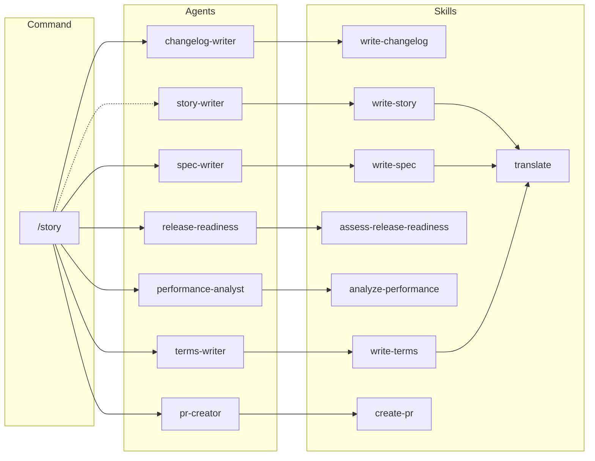
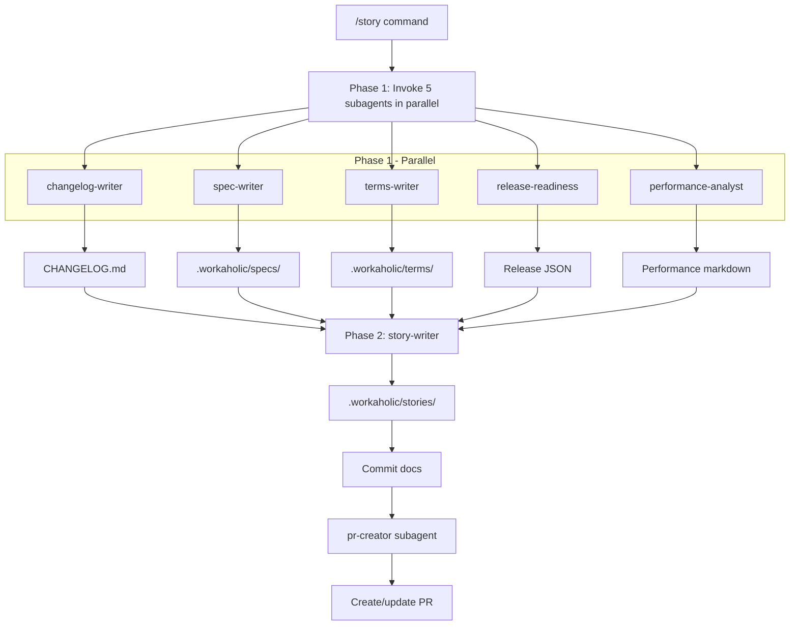

[English](architecture.md) | [日本語](architecture_ja.md)

# Architecture

Workaholic is a Claude Code plugin marketplace. It contains no runtime code; plugins are markdown files with JSON metadata that Claude Code interprets as commands, rules, skills, and agents.

## Marketplace Structure


## Directory Layout

```
.claude-plugin/
  marketplace.json       # Marketplace metadata and plugin list

plugins/
  core/
    .claude-plugin/
      plugin.json        # Plugin metadata
    agents/
      changelog-writer.md     # Updates CHANGELOG.md from tickets
      history-discoverer.md   # Searches archived tickets for related context
      performance-analyst.md  # Decision review for PR stories
      pr-creator.md           # Creates/updates GitHub PRs
      release-readiness.md    # Analyzes changes for release readiness
      source-discoverer.md    # Finds related source files and analyzes code flow
      spec-writer.md          # Updates .workaholic/specs/
      story-writer.md         # Generates branch stories for PRs
      terms-writer.md         # Updates .workaholic/terms/
      ticket-moderator.md     # Analyzes tickets for duplicates, merges, and splits
      ticket-organizer.md     # Complete ticket workflow: discover, check duplicates, write
    commands/
      drive.md           # /drive command
      story.md           # /story command
      ticket.md          # /ticket command
    rules/
      diagrams.md      # Mermaid diagram requirements
      general.md       # Git workflow rules, markdown linking
      i18n.md          # Multi-language documentation rules
      shell.md         # POSIX shell script conventions
      typescript.md    # TypeScript coding standards
    skills/
      analyze-performance/
        SKILL.md           # Performance analysis framework
      archive-ticket/
        SKILL.md
        sh/
          archive.sh       # Shell script for commit workflow
      assess-release-readiness/
        SKILL.md           # Release readiness analysis guidelines
      create-branch/
        SKILL.md           # Creates timestamped topic branches
      create-pr/
        SKILL.md
        sh/
          create-or-update.sh  # Creates or updates GitHub PRs
      create-ticket/
        SKILL.md           # Ticket creation with format and guidelines
      discover-source/
        SKILL.md           # Guidelines for exploring source code
      discover-history/
        SKILL.md           # Guidelines for searching archived tickets
      drive-approval/
        SKILL.md           # Complete approval flow: request, revision, abandonment
      drive-workflow/
        SKILL.md           # Implementation workflow for tickets
      format-commit-message/
        SKILL.md           # Structured commit message format
      translate/
        SKILL.md           # Translation policies and .workaholic/ i18n enforcement
      update-ticket-frontmatter/
        SKILL.md           # Updates ticket YAML frontmatter fields
      write-changelog/
        SKILL.md           # Changelog generation and writing guidelines
        sh/
          generate.sh      # Generates changelog entries from tickets
      write-final-report/
        SKILL.md           # Final report section for tickets
      write-spec/
        SKILL.md
        sh/
          gather.sh        # Gathers context and writes specs
      write-story/
        SKILL.md
        sh/
          calculate.sh     # Calculates metrics and writes stories
      write-terms/
        SKILL.md
        sh/
          gather.sh        # Gathers context and writes terms
```

## Plugin Types

### Commands

Commands are user-invocable via slash syntax (`/ticket`, `/drive`, `/story`). Each command is a markdown file with YAML frontmatter defining the name and description, followed by instructions that Claude follows when the command is invoked.

### Rules

Rules are always-on guidelines that Claude follows throughout the conversation. They define coding standards, documentation requirements, and best practices.

### Skills

Skills are complex capabilities that may include scripts or multiple files. They are invoked via the Skill tool and provide inline instructions. Many skills include bash scripts that handle mechanical operations, while agents handle decision-making. The core plugin includes:

- **analyze-performance**: Evaluation framework for decision-making quality across five dimensions
- **archive-ticket**: Handles the complete commit workflow (archive ticket, update frontmatter with commit hash/category, commit)
- **assess-release-readiness**: Guidelines for analyzing changes and determining release readiness
- **create-branch**: Creates timestamped topic branches with configurable prefix
- **create-pr**: Creates or updates GitHub PRs using the gh CLI with proper formatting
- **create-ticket**: Complete ticket creation workflow including format, exploration, and related history
- **discover-history**: Guidelines for searching archived tickets to find related context
- **discover-source**: Guidelines for exploring source code to understand codebase context and find related files
- **drive-approval**: Complete approval flow for implementations including request, revision handling, and abandonment
- **drive-workflow**: Implementation workflow steps for processing tickets
- **format-commit-message**: Structured commit message format with title, motivation, UX, and architecture sections
- **translate**: Translation policies and `.workaholic/` i18n enforcement (spec-writer, terms-writer, story-writer preload this)
- **update-ticket-frontmatter**: Updates ticket YAML frontmatter fields (effort, commit_hash, category)
- **write-changelog**: Generates changelog entries from archived tickets (grouping by category) and provides guidelines for updating CHANGELOG.md
- **write-final-report**: Writes final report section for tickets with optional discovered insights
- **write-spec**: Context gathering and guidelines for writing specification documents
- **write-story**: Metrics calculation, templates, and guidelines for branch stories
- **write-terms**: Context gathering and guidelines for terminology documents

### Agents

Agents are specialized subagents that can be spawned to handle complex tasks. They run in a subprocess with specific prompts and tools, preserving the main conversation's context window for interactive work. The core plugin includes:

- **changelog-writer**: Updates root `CHANGELOG.md` with entries from archived tickets, grouped by category (Added, Changed, Removed)
- **history-discoverer**: Searches archived tickets to find related context and prior decisions
- **performance-analyst**: Evaluates decision-making quality across five viewpoints (Consistency, Intuitivity, Describability, Agility, Density) for PR stories
- **pr-creator**: Creates or updates GitHub pull requests using the story file as PR body, handling title derivation and `gh` CLI operations
- **release-readiness**: Analyzes changes for release readiness, providing verdict, concerns, and pre/post-release instructions
- **source-discoverer**: Explores codebase to find related source files and analyzes code flow context
- **spec-writer**: Updates `.workaholic/specs/` documentation to reflect current codebase state
- **story-writer**: Generates branch stories in `.workaholic/stories/` that serve as the single source of truth for PR content, with eleven sections: Overview, Motivation, Journey (containing Topic Tree flowchart), Changes, Outcome, Historical Analysis, Concerns, Ideas, Performance, Release Preparation, and Notes
- **terms-writer**: Updates `.workaholic/terms/` to maintain consistent term definitions
- **ticket-moderator**: Analyzes existing tickets for duplicates, merge candidates, and split opportunities before creating new tickets
- **ticket-organizer**: Complete ticket creation workflow: discovers history and source context, checks for duplicates/overlaps, and writes implementation tickets

## Command Dependencies

These diagrams show how each command invokes agents and skills at runtime. Commands are thin orchestrators that delegate work to specialized components.

### /ticket Dependencies


### /drive Dependencies


### /story Dependencies



## How Claude Code Loads Plugins

When a user installs the marketplace with `/plugin marketplace add qmu/workaholic`, Claude Code:

1. Reads `.claude-plugin/marketplace.json` to find available plugins
2. For each plugin, reads `plugins/<name>/.claude-plugin/plugin.json`
3. Loads commands, rules, and skills from the plugin directories
4. Auto-loads `hooks/hooks.json` from the plugin directory if it exists (standard location)
5. Makes commands available as slash commands in the conversation

### Plugin Manifest Fields

The `plugin.json` file contains metadata about the plugin:

```json
{
  "name": "core",
  "description": "Plugin description",
  "version": "1.0.0",
  "author": {
    "name": "author name",
    "email": "author@example.com"
  }
}
```

**Important**: The `hooks` field should NOT be declared in `plugin.json` when hooks are in the standard location (`hooks/hooks.json`). Claude Code automatically detects and loads hooks from this location. Declaring the hooks field in the manifest when they're also at the standard location causes a "Duplicate hooks file detected" error.

## Data Flow


## Documentation Enforcement

Workaholic enforces comprehensive documentation through a parallel subagent architecture. The `/story` command orchestrates documentation agents in two phases: five agents run in parallel first, then story-writer runs with the release-readiness and performance-analyst outputs.

### How It Works



Documentation is updated automatically during the `/story` workflow.

The subagent architecture provides several benefits:

1. **Parallel execution** - Five agents run simultaneously in Phase 1, reducing wait time
2. **Context isolation** - Each agent works in its own context window, preserving the main conversation
3. **Single responsibility** - Each agent handles one documentation domain
4. **Data dependency handling** - Story-writer receives release-readiness and performance-analyst outputs in Phase 2

### Critical Requirements

All documentation agents enforce strict requirements:

- **Document every change** - No exceptions, no judgment calls about what's "worth" documenting
- **Never skip documentation** - "Internal implementation detail" is never a valid reason
- **Always report updates** - Must specify which files were created or modified
- **"No updates needed" is unacceptable** - Every change affects documentation somehow

### Design Policy

Documentation is mandatory, not optional. This reflects Workaholic's core principle of **cognitive investment**: developer cognitive load is the primary bottleneck in software productivity, so we invest heavily in generating structured knowledge artifacts to reduce this load.

The three primary artifact types are:

- **Tickets** - Change requests with structured metadata (date, author, type, layer, effort, commit_hash, category)
- **Specs** - Current state snapshots serving as reference documentation
- **Stories** - Narrative accounts of the developer journey per branch

Tickets serve as the single source of truth for change metadata. The root `CHANGELOG.md` is generated from archived tickets during PR creation.

## Architecture Policy

Workaholic follows strict nesting rules for component invocations to maintain a clean separation between orchestration and knowledge.

| Caller   | Can invoke         | Cannot invoke       |
| -------- | ------------------ | ------------------- |
| Command  | Skill, Subagent    | -                   |
| Subagent | Skill, Subagent    | Command             |
| Skill    | Skill              | Subagent, Command   |

Subagent → Subagent is allowed only in parallel with max depth 1 (no nested chains). Commands and subagents are the orchestration layer, defining workflow steps and invoking other components. Skills are the knowledge layer, containing templates, guidelines, rules, and bash scripts. Skills can preload other skills for composable knowledge (e.g., write-spec preloads translate for i18n enforcement). This separation prevents deep nesting and context explosion while keeping comprehensive knowledge centralized in skills.

## Version Management

Versions are tracked in two places:

- **Marketplace version**: `.claude-plugin/marketplace.json` - bumped with `/release`
- **Plugin versions**: `plugins/<name>/.claude-plugin/plugin.json` - updated when plugin changes

Keep these in sync when releasing.
