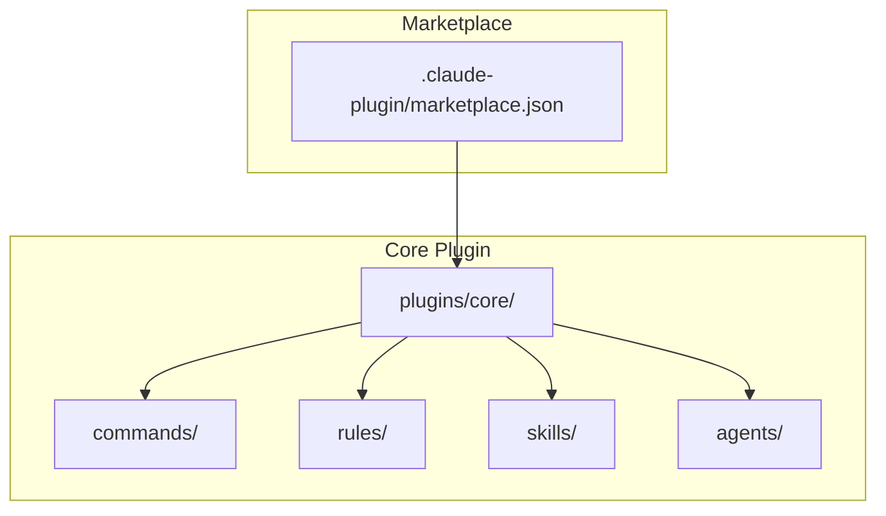
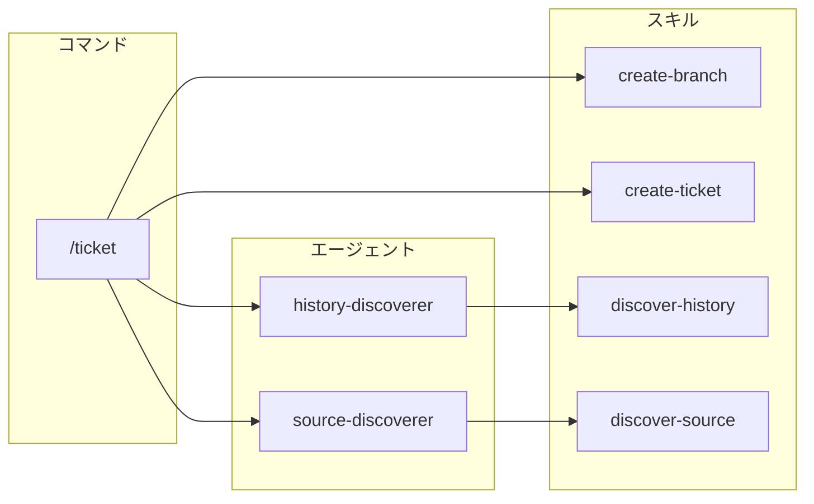
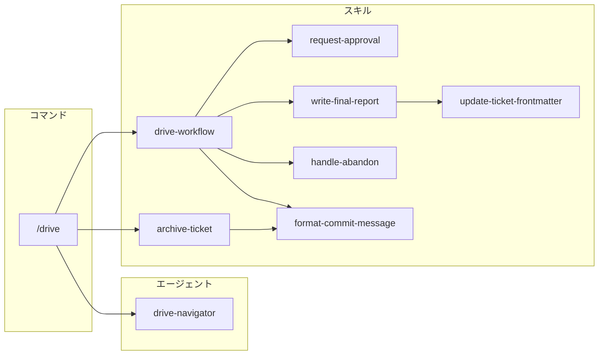
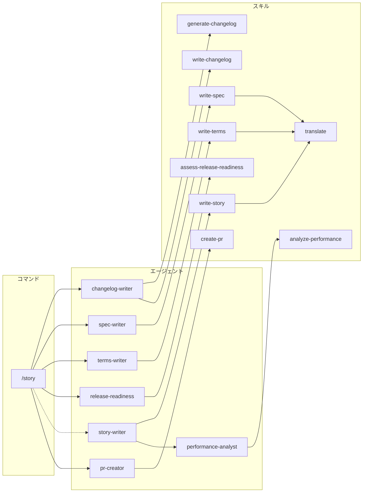
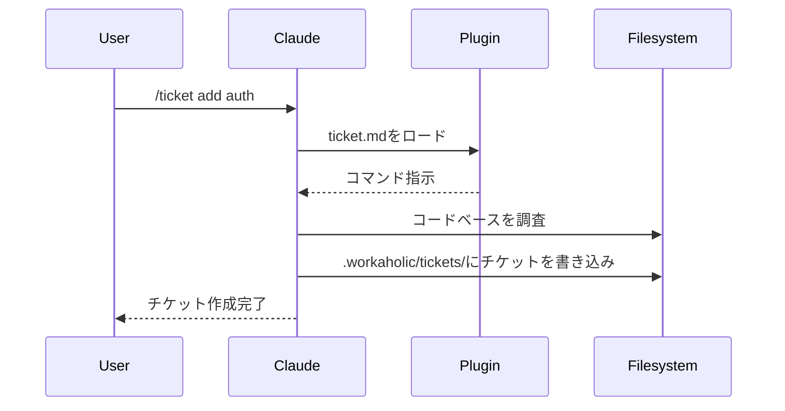

[English](architecture.md) | [日本語](architecture_ja.md)

# アーキテクチャ

WorkaholicはClaude Codeプラグインマーケットプレイスです。ランタイムコードを含まず、プラグインはClaude Codeがコマンド、ルール、スキル、エージェントとして解釈するJSONメタデータを持つマークダウンファイルです。

## マーケットプレイス構造



## ディレクトリレイアウト

```
.claude-plugin/
  marketplace.json       # マーケットプレイスのメタデータとプラグインリスト

plugins/
  core/
    .claude-plugin/
      plugin.json        # プラグインメタデータ
    agents/
      changelog-writer.md     # チケットからCHANGELOG.mdを更新
      history-discoverer.md   # 関連チケットを検索してコンテキストを取得
      performance-analyst.md  # PRストーリーの意思決定レビュー
      pr-creator.md           # GitHub PRの作成/更新
      release-readiness.md    # リリース準備状況の分析
      source-discoverer.md    # 関連ソースファイルを検索してコード流れを分析
      spec-writer.md          # .workaholic/specs/を更新
      story-writer.md         # PR用のブランチストーリーを生成
      terms-writer.md         # .workaholic/terms/を更新
    commands/
      drive.md           # /drive コマンド
      story.md           # /story コマンド
      ticket.md          # /ticket コマンド
    rules/
      diagrams.md      # Mermaid図表要件
      general.md       # Gitワークフロールール、マークダウンリンク
      i18n.md          # 多言語ドキュメントルール
      shell.md         # POSIX シェルスクリプト規約
      typescript.md    # TypeScriptコーディング規約
    skills/
      analyze-performance/
        SKILL.md           # パフォーマンス分析フレームワーク
      archive-ticket/
        SKILL.md
        sh/
          archive.sh       # コミットワークフロー用シェルスクリプト
      assess-release-readiness/
        SKILL.md           # リリース準備分析ガイドライン
      create-branch/
        SKILL.md           # タイムスタンプ付きトピックブランチを作成
      create-pr/
        SKILL.md
        sh/
          create-or-update.sh  # GitHub PRの作成/更新
      create-ticket/
        SKILL.md           # フォーマットとガイドラインを含むチケット作成
      discover-source/
        SKILL.md           # ソースコード探索ガイドライン
      drive-workflow/
        SKILL.md           # チケット実装ワークフロー
      generate-changelog/
        SKILL.md
        sh/
          generate.sh      # チケットからchangelogエントリを生成
      translate/
        SKILL.md           # 翻訳ポリシーと.workaholic/ i18n強制
      write-changelog/
        SKILL.md           # changelogライティングガイドライン
      write-spec/
        SKILL.md
        sh/
          gather.sh        # コンテキスト収集とスペック作成
      write-story/
        SKILL.md
        sh/
          calculate.sh     # メトリクス計算とストーリー作成
      write-terms/
        SKILL.md
        sh/
          gather.sh        # コンテキスト収集と用語作成
```

## プラグインタイプ

### コマンド

コマンドはスラッシュ構文（`/ticket`、`/drive`、`/story`）でユーザーが呼び出せます。各コマンドは名前と説明を定義するYAMLフロントマター付きのマークダウンファイルで、その後にコマンドが呼び出されたときにClaudeが従う指示が続きます。

### ルール

ルールは会話中ずっとClaudeが従う常時オンのガイドラインです。コーディング規約、ドキュメント要件、ベストプラクティスを定義します。

### スキル

スキルはスクリプトや複数のファイルを含む可能性のある複雑な機能です。Skillツールで呼び出され、インライン指示を提供します。多くのスキルには機械的な操作を処理するbashスクリプトが含まれ、エージェントは意思決定を担当します。coreプラグインには以下が含まれます：

- **analyze-performance**: 5つの次元にわたる意思決定品質の評価フレームワーク
- **archive-ticket**: 完全なコミットワークフロー（チケットのアーカイブ、フロントマターにコミットハッシュ/カテゴリを更新、コミット）を処理
- **assess-release-readiness**: 変更を分析しリリース準備状況を判定するガイドライン
- **create-branch**: 設定可能なプレフィックス付きでタイムスタンプ付きトピックブランチを作成
- **create-pr**: gh CLIを使用して適切なフォーマットでGitHub PRを作成/更新
- **create-ticket**: フォーマット、調査、関連履歴を含む完全なチケット作成ワークフロー
- **discover-source**: コードベースコンテキストを理解するためのソースコード探索ガイドライン
- **drive-workflow**: チケット処理の実装ワークフローステップ
- **generate-changelog**: アーカイブされたチケットからchangelogエントリを生成、カテゴリ別にグループ化
- **translate**: 翻訳ポリシーと`.workaholic/` i18n強制（spec-writer、terms-writer、story-writerがプリロード）
- **write-changelog**: changelogエントリのライティングガイドライン
- **write-spec**: コンテキスト収集とspecドキュメントのライティングガイドライン
- **write-story**: メトリクス計算、テンプレート、ブランチストーリーのガイドライン
- **write-terms**: コンテキスト収集と用語ドキュメントのガイドライン

### エージェント

エージェントは複雑なタスクを処理するために生成できる特殊なサブエージェントです。特定のプロンプトとツールを持つサブプロセスで実行され、メイン会話のコンテキストウィンドウをインタラクティブな作業用に保持します。coreプラグインには以下が含まれます：

- **changelog-writer**: アーカイブされたチケットからルート`CHANGELOG.md`をカテゴリ別（Added、Changed、Removed）に更新
- **history-discoverer**: アーカイブされたチケットを検索して関連コンテキストと過去の決定を見つける
- **performance-analyst**: PRストーリーのために5つの観点（Consistency、Intuitivity、Describability、Agility、Density）で意思決定の質を評価
- **pr-creator**: ストーリーファイルをPRボディとして使用してGitHub PRを作成または更新、タイトル導出と`gh` CLI操作を処理
- **release-readiness**: 変更をリリース準備状況について分析、判定・懸念事項・リリース前後の手順を提供
- **source-discoverer**: コードベースを探索して関連ソースファイルを見つけ、コード流れコンテキストを分析する
- **spec-writer**: 現在のコードベースの状態を反映するように`.workaholic/specs/`ドキュメントを更新
- **story-writer**: PR内容の単一の真実の情報源として機能する`.workaholic/stories/`にブランチストーリーを生成、11のセクション（Overview、Motivation、Journey（Topic Treeフローチャートを含む）、Changes、Outcome、Historical Analysis、Concerns、Ideas、Performance、Release Preparation、Notes）で構成
- **terms-writer**: 一貫した用語定義を維持するために`.workaholic/terms/`を更新

## コマンド依存関係

これらの図は、各コマンドが実行時にエージェントとスキルをどのように呼び出すかを示しています。コマンドは薄いオーケストレーターであり、作業を専門化されたコンポーネントに委譲します。

### /ticket 依存関係



### /drive 依存関係



### /story 依存関係



## Claude Codeがプラグインをロードする方法

ユーザーが`/plugin marketplace add qmu/workaholic`でマーケットプレイスをインストールすると、Claude Codeは：

1. `.claude-plugin/marketplace.json`を読んで利用可能なプラグインを見つける
2. 各プラグインについて`plugins/<name>/.claude-plugin/plugin.json`を読む
3. プラグインディレクトリからコマンド、ルール、スキルをロードする
4. プラグインディレクトリに存在する場合、標準的な場所（`hooks/hooks.json`）から`hooks/hooks.json`を自動的にロードする
5. コマンドを会話内のスラッシュコマンドとして利用可能にする

### プラグインマニフェストフィールド

`plugin.json`ファイルにはプラグインに関するメタデータが含まれます：

```json
{
  "name": "core",
  "description": "プラグインの説明",
  "version": "1.0.0",
  "author": {
    "name": "作成者名",
    "email": "author@example.com"
  }
}
```

**重要**: hooksが標準的な場所（`hooks/hooks.json`）に存在する場合、`hooks`フィールドを`plugin.json`で宣言してはいけません。Claude Codeはこの場所からhooksを自動的に検出してロードします。manifestでhooksフィールドを宣言しており、それが標準的な場所にもある場合、「Duplicate hooks file detected」エラーが発生します。

## データフロー



## ドキュメント強制

Workaholicは並列サブエージェントアーキテクチャを通じて包括的なドキュメントを強制します。`/story`コマンドはドキュメントエージェントを2つのフェーズで調整します：最初に4つのエージェントが並列実行され、その後story-writerがrelease-readiness出力と共に実行されます。

### 仕組み

```mermaid
flowchart TD
    A[/story コマンド] --> B[残りのチケットをiceboxに移動]
    B --> C[フェーズ1: 4つのサブエージェントを並列で呼び出し]

    subgraph フェーズ1 - 並列
        D[changelog-writer]
        F[spec-writer]
        G[terms-writer]
        RR[release-readiness]
    end

    C --> D
    C --> F
    C --> G
    C --> RR

    D --> H[CHANGELOG.md]
    F --> J[.workaholic/specs/]
    G --> K[.workaholic/terms/]
    RR --> RL[リリースJSON]

    H --> P2[フェーズ2: story-writer]
    J --> P2
    K --> P2
    RL --> P2

    P2 --> I[.workaholic/stories/]
    I --> L[docsをコミット]

    L --> M[pr-creator サブエージェント]
    M --> N[PRを作成/更新]
```

ドキュメントは`/story`ワークフロー中に自動的に更新されます。

サブエージェントアーキテクチャにはいくつかの利点があります：

1. **並列実行** - フェーズ1で4つのエージェントが同時に実行され、待ち時間を短縮
2. **コンテキスト分離** - 各エージェントが独自のコンテキストウィンドウで動作し、メイン会話を保持
3. **単一責任** - 各エージェントが1つのドキュメントドメインを担当
4. **データ依存関係の処理** - story-writerはフェーズ2でrelease-readiness出力を受け取る

### 重要な要件

すべてのドキュメントエージェントは厳格な要件を強制します：

- **すべての変更をドキュメント化** - 例外なし、何が「ドキュメント化する価値がある」かの判断なし
- **ドキュメントをスキップしない** - 「内部実装の詳細」は決して有効な理由にならない
- **常に更新を報告** - どのファイルが作成または変更されたかを指定する必要がある
- **「更新不要」は受け入れられない** - すべての変更は何らかの形でドキュメントに影響する

### 設計ポリシー

ドキュメントは任意ではなく必須です。これはWorkaholicのコア原則である**認知投資**を反映しています：開発者の認知負荷はソフトウェア生産性の主要なボトルネックであり、この負荷を軽減するために構造化された知識成果物の生成に積極的に投資します。

3つの主要な成果物タイプは：

- **Tickets** - 構造化メタデータ（date、author、type、layer、effort、commit_hash、category）を持つ変更リクエスト
- **Specs** - リファレンスドキュメントとして機能する現状のスナップショット
- **Stories** - ブランチごとの開発者の旅のナラティブ

チケットは変更メタデータの単一の真実の情報源として機能します。ルート`CHANGELOG.md`はPR作成時にアーカイブされたチケットから生成されます。

## アーキテクチャポリシー

Workaholicはオーケストレーションと知識の明確な分離を維持するため、コンポーネント呼び出しに厳格なネストルールを設けています。

| 呼び出し元 | 呼び出し可能     | 呼び出し不可        |
| ---------- | ---------------- | ------------------- |
| コマンド   | スキル、サブエージェント | -            |
| サブエージェント | スキル      | サブエージェント、コマンド |
| スキル     | スキル           | サブエージェント、コマンド |

コマンドとサブエージェントはオーケストレーション層であり、ワークフローステップを定義し他のコンポーネントを呼び出します。スキルは知識層であり、テンプレート、ガイドライン、ルール、bashスクリプトを含みます。スキルは合成可能な知識のために他のスキルをプリロードできます（例：write-specはi18n強制のためにtranslateをプリロード）。この分離により、深いネストとコンテキスト爆発を防ぎながら、包括的な知識をスキルに集約します。

## バージョン管理

バージョンは2箇所で追跡されます：

- **マーケットプレイスバージョン**: `.claude-plugin/marketplace.json` - `/release`でバンプ
- **プラグインバージョン**: `plugins/<name>/.claude-plugin/plugin.json` - プラグイン変更時に更新

リリース時にこれらを同期させてください。
