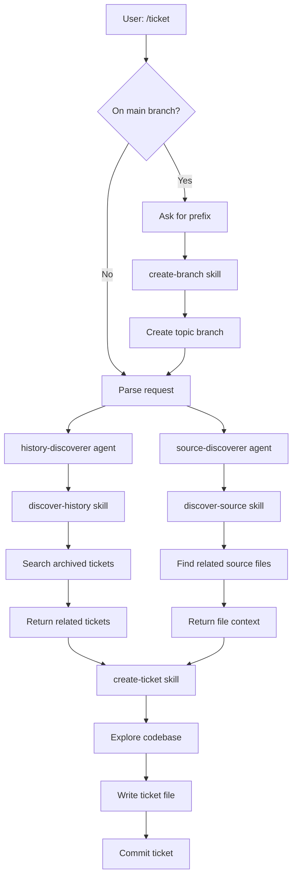
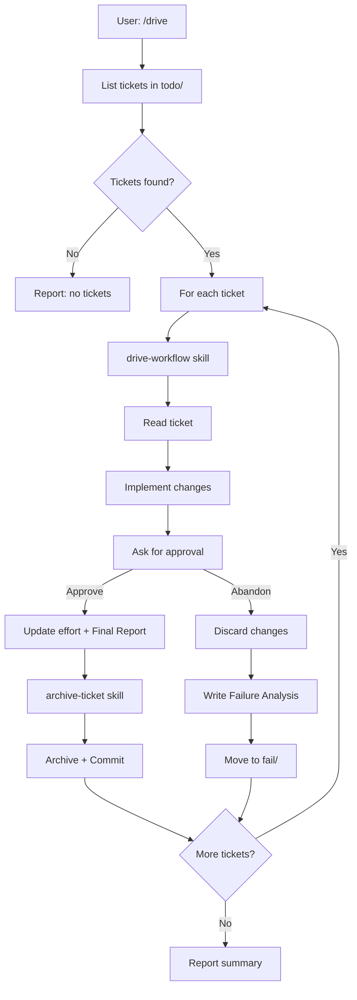
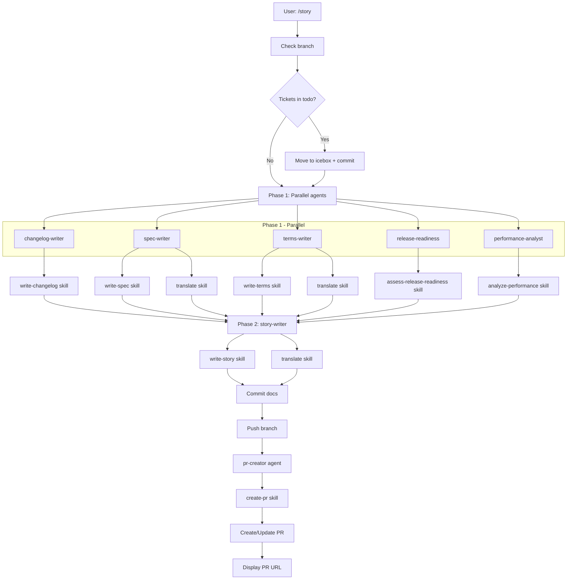

[English](command-flows.md) | [日本語](command-flows_ja.md)

# Command Execution Flows

This document describes how each command orchestrates agents and skills during execution. Commands are thin orchestration layers that delegate work to specialized components.

## Architecture Overview

```
Command → Skills (preloaded)
        → Subagents (via Task tool) → Skills (preloaded)
```

- **Commands**: User-facing entry points that orchestrate workflows
- **Subagents**: Specialized workers invoked via Task tool (often using haiku model)
- **Skills**: Passive knowledge and scripts preloaded by commands/agents

## /ticket

Creates an implementation ticket with codebase exploration and historical context.



### Components

| Component | Type | Purpose |
|-----------|------|---------|
| create-branch | Skill | Creates timestamped branch from main |
| history-discoverer | Agent (haiku) | Searches archived tickets for related context |
| source-discoverer | Agent (haiku) | Finds related source files and analyzes code flow |
| discover-history | Skill | Multi-keyword grep search script |
| discover-source | Skill | Source code exploration guidelines |
| create-ticket | Skill | Ticket format, frontmatter, and writing guidelines |

### Notes

- Branch creation happens automatically when on `main` or `master`
- History and source discovery run in parallel using haiku model for fast, cheap search
- Both discoveries complete before ticket creation
- Ticket is committed immediately unless invoked during `/drive`

## /drive

Implements queued tickets one by one with user approval at each step.



### Components

| Component | Type | Purpose |
|-----------|------|---------|
| drive-workflow | Skill | Step-by-step implementation workflow |
| archive-ticket | Skill | Moves ticket to archive, updates changelog, commits |

### Notes

- Each ticket gets its own commit
- User must approve each implementation before commit
- "Abandon" preserves failure analysis for future reference
- Icebox mode retrieves deferred tickets on demand

## /story

Generates comprehensive documentation and creates/updates a pull request.



### Components

| Component | Type | Purpose |
|-----------|------|---------|
| changelog-writer | Agent (haiku) | Updates CHANGELOG.md from archived tickets |
| spec-writer | Agent (haiku) | Updates .workaholic/specs/ documentation |
| terms-writer | Agent (haiku) | Updates .workaholic/terms/ definitions |
| release-readiness | Agent (haiku) | Analyzes changes for release concerns |
| story-writer | Agent (haiku) | Generates PR narrative in 11 sections |
| performance-analyst | Agent | Evaluates decision-making quality |
| pr-creator | Agent (haiku) | Creates/updates GitHub PR |
| write-changelog | Skill | Changelog entry generation, categorization, and CHANGELOG.md updates |
| write-spec | Skill | Spec document format and guidelines |
| write-terms | Skill | Term document format and guidelines |
| write-story | Skill | Story document structure and templates |
| assess-release-readiness | Skill | Release readiness criteria |
| analyze-performance | Skill | Performance evaluation framework |
| create-pr | Skill | PR creation via gh CLI |
| translate | Skill | English to Japanese translation |

### Notes

- Phase 1 runs 5 agents in parallel for efficiency
- Phase 2 depends on release-readiness and performance-analyst outputs (sequential)
- Story file becomes the PR description body
- PR URL display is mandatory at completion
