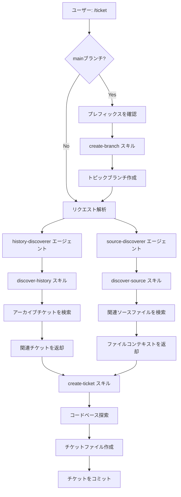
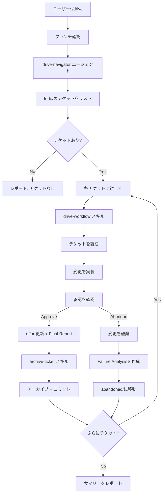
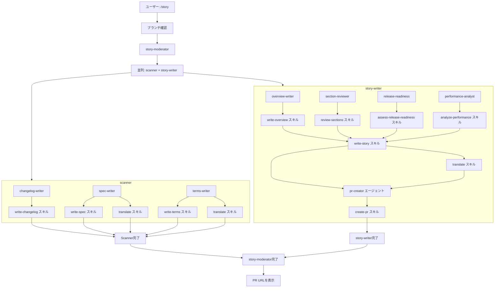

[English](command-flows.md) | [日本語](command-flows_ja.md)

# コマンド実行フロー

このドキュメントは、各コマンドが実行時にエージェントとスキルをどのように調整するかを説明します。コマンドは、専門化されたコンポーネントに作業を委譲する薄いオーケストレーション層です。

## アーキテクチャ概要

```
コマンド → スキル（プリロード）
         → サブエージェント（Taskツール経由） → スキル（プリロード）
```

- **コマンド**: ワークフローを調整するユーザー向けエントリーポイント
- **サブエージェント**: Taskツール経由で呼び出される専門ワーカー（多くの場合haikuモデルを使用）
- **スキル**: コマンド/エージェントによってプリロードされる受動的な知識とスクリプト

## /ticket

コードベースの探索と履歴コンテキストを含む実装チケットを作成します。



### コンポーネント

| コンポーネント | タイプ | 目的 |
|---------------|--------|------|
| create-branch | スキル | mainからタイムスタンプ付きブランチを作成 |
| history-discoverer | エージェント (haiku) | アーカイブチケットから関連コンテキストを検索 |
| source-discoverer | エージェント (haiku) | 関連ソースファイルを見つけてコード流れを分析 |
| discover-history | スキル | マルチキーワードgrep検索スクリプト |
| discover-source | スキル | ソースコード探索ガイドライン |
| create-ticket | スキル | チケットフォーマット、フロントマター、作成ガイドライン |

### 備考

- `main`または`master`ブランチにいる場合、ブランチ作成は自動的に行われます
- 履歴とソース検索はhaikuモデルを使用した並列実行で高速かつ低コストで実行
- 両方の検索はチケット作成前に完了
- `/drive`中に呼び出された場合を除き、チケットは即座にコミットされます

## /drive

キューに入っているチケットを一つずつ実装し、各ステップでユーザー承認を得ます。コマンドはdrive-workflowスキルを直接実行し、実装コンテキストをメイン会話に保存します。



### コンポーネント

| コンポーネント | タイプ | 目的 |
|---------------|--------|------|
| drive-navigator | エージェント (haiku) | todo/ディレクトリのチケットをリスト |
| drive-workflow | スキル | ステップバイステップの実装ワークフロー |
| archive-ticket | スキル | チケットをアーカイブに移動、changelog更新、コミット |

### 備考

- driveコマンドはdrive-workflowスキルを直接使用して実装（driverサブエージェントなし）
- 実装コンテキストはメイン会話に保存されるため、可視性とデバッグ性が向上
- 各チケットは独自のコミットを取得
- ユーザーはコミット前に各実装を承認する必要があります
- 「Abandon」は将来の参照のために失敗分析を保存します
- Iceboxモードはオンデマンドで延期されたチケットを取得します

## /story

二層並列アーキテクチャを使用して包括的なドキュメントを生成し、プルリクエストを作成/更新します。



### コンポーネント

| コンポーネント | タイプ | 目的 |
|---------------|--------|------|
| story-moderator | エージェント | scannerとstory-writerを並列で調整 |
| scanner | エージェント | changelog-writer、spec-writer、terms-writerを並列で呼び出し |
| story-writer | エージェント | ストーリーファイルを生成し、pr-creatorを呼び出し |
| changelog-writer | エージェント (haiku) | アーカイブチケットからCHANGELOG.mdを更新 |
| spec-writer | エージェント (haiku) | .workaholic/specs/ドキュメントを更新 |
| terms-writer | エージェント (haiku) | .workaholic/terms/定義を更新 |
| overview-writer | エージェント | overview、highlights、motivation、journeyを生成 |
| section-reviewer | エージェント | セクション5-8（Outcome、Historical Analysis、Concerns、Ideas）を生成 |
| release-readiness | エージェント (haiku) | リリースに関する懸念事項を分析 |
| performance-analyst | エージェント | 意思決定の品質を評価 |
| pr-creator | エージェント (haiku) | GitHub PRを作成/更新 |
| write-changelog | スキル | changelogエントリの生成、分類、およびCHANGELOG.mdの更新 |
| write-spec | スキル | specドキュメントのフォーマットとガイドライン |
| write-terms | スキル | termドキュメントのフォーマットとガイドライン |
| write-story | スキル | storyドキュメントの構造とテンプレート（story-writerによりプリロード） |
| assess-release-readiness | スキル | リリース準備の基準 |
| analyze-performance | スキル | パフォーマンス評価フレームワーク |
| create-pr | スキル | gh CLI経由でPR作成 |
| translate | スキル | 英語から日本語への翻訳 |

### 備考

- 二層並列アーキテクチャ：story-moderatorがscannerとstory-writerを並列で呼び出し
- Scannerグループ：changelog-writer、spec-writer、terms-writer（3エージェント）
- Storyグループ：overview-writer、section-reviewer、release-readiness、performance-analyst（4エージェント）
- story-writerがwrite-storyスキルを所有し、ストーリー生成後にpr-creatorを呼び出す
- ストーリーファイルがPR説明文の本文になります
- 完了時のPR URL表示は必須です
