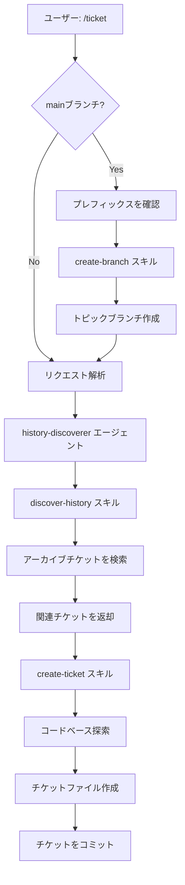
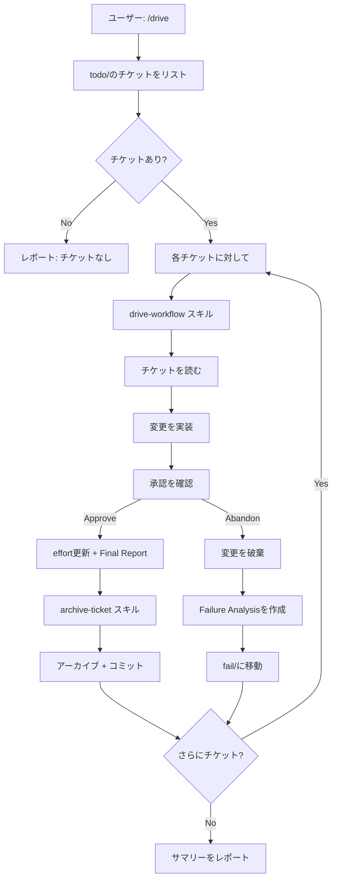
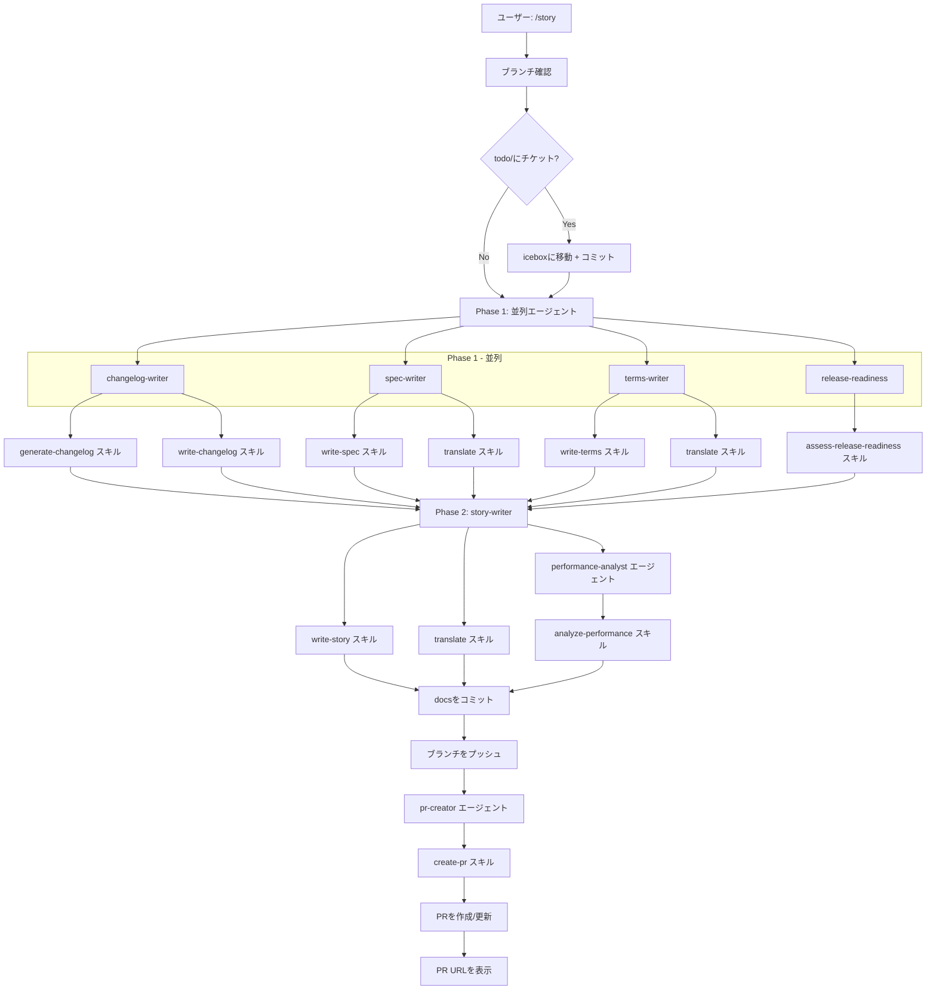

[English](command-flows.md) | [日本語](command-flows_ja.md)

# コマンド実行フロー

このドキュメントは、各コマンドが実行時にエージェントとスキルをどのように調整するかを説明します。コマンドは、専門化されたコンポーネントに作業を委譲する薄いオーケストレーション層です。

## アーキテクチャ概要

```
コマンド → スキル（プリロード）
         → サブエージェント（Taskツール経由） → スキル（プリロード）
```

- **コマンド**: ワークフローを調整するユーザー向けエントリーポイント
- **サブエージェント**: Taskツール経由で呼び出される専門ワーカー（多くの場合haikuモデルを使用）
- **スキル**: コマンド/エージェントによってプリロードされる受動的な知識とスクリプト

## /ticket

コードベースの探索と履歴コンテキストを含む実装チケットを作成します。



### コンポーネント

| コンポーネント | タイプ | 目的 |
|---------------|--------|------|
| create-branch | スキル | mainからタイムスタンプ付きブランチを作成 |
| history-discoverer | エージェント (haiku) | アーカイブチケットから関連コンテキストを検索 |
| discover-history | スキル | マルチキーワードgrep検索スクリプト |
| create-ticket | スキル | チケットフォーマット、フロントマター、作成ガイドライン |

### 備考

- `main`または`master`ブランチにいる場合、ブランチ作成は自動的に行われます
- 履歴検索はhaikuモデルを使用して高速かつ低コストで実行
- `/drive`中に呼び出された場合を除き、チケットは即座にコミットされます

## /drive

キューに入っているチケットを一つずつ実装し、各ステップでユーザー承認を得ます。



### コンポーネント

| コンポーネント | タイプ | 目的 |
|---------------|--------|------|
| drive-workflow | スキル | ステップバイステップの実装ワークフロー |
| archive-ticket | スキル | チケットをアーカイブに移動、changelog更新、コミット |

### 備考

- 各チケットは独自のコミットを取得
- ユーザーはコミット前に各実装を承認する必要があります
- 「Abandon」は将来の参照のために失敗分析を保存します
- Iceboxモードはオンデマンドで延期されたチケットを取得します

## /story

包括的なドキュメントを生成し、プルリクエストを作成/更新します。



### コンポーネント

| コンポーネント | タイプ | 目的 |
|---------------|--------|------|
| changelog-writer | エージェント (haiku) | アーカイブチケットからCHANGELOG.mdを更新 |
| spec-writer | エージェント (haiku) | .workaholic/specs/ドキュメントを更新 |
| terms-writer | エージェント (haiku) | .workaholic/terms/定義を更新 |
| release-readiness | エージェント (haiku) | リリースに関する懸念事項を分析 |
| story-writer | エージェント (haiku) | 11セクションでPRナラティブを生成 |
| performance-analyst | エージェント | 意思決定の品質を評価 |
| pr-creator | エージェント (haiku) | GitHub PRを作成/更新 |
| generate-changelog | スキル | changelogエントリのフォーマットと分類 |
| write-changelog | スキル | CHANGELOG.mdの構造と更新 |
| write-spec | スキル | specドキュメントのフォーマットとガイドライン |
| write-terms | スキル | termドキュメントのフォーマットとガイドライン |
| write-story | スキル | storyドキュメントの構造とテンプレート |
| assess-release-readiness | スキル | リリース準備の基準 |
| analyze-performance | スキル | パフォーマンス評価フレームワーク |
| create-pr | スキル | gh CLI経由でPR作成 |
| translate | スキル | 英語から日本語への翻訳 |

### 備考

- Phase 1は効率のために4つのエージェントを並列実行
- Phase 2はrelease-readiness出力に依存（順次実行）
- ストーリーファイルがPR説明文の本文になります
- 完了時のPR URL表示は必須です
