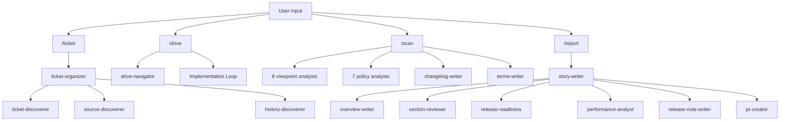
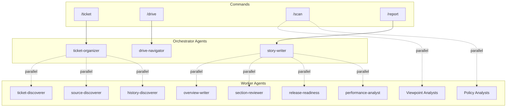
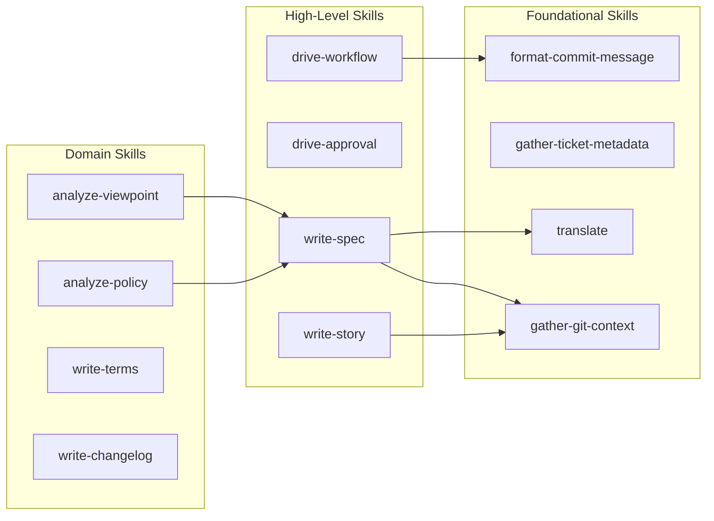

[English](component.md) | [Japanese](component_ja.md)

# 1. Component Viewpoint

The Component Viewpoint describes the internal structure of the Workaholic plugin, its module boundaries, and how the system decomposes into commands, agents, skills, and rules. The core plugin contains 4 commands, 29 agents, 28 skills, and 6 rules, organized in a strict hierarchical architecture that enforces separation of concerns through a nesting policy.

## 2. Module Boundaries

The architecture enforces strict boundaries through the component nesting policy defined in CLAUDE.md:

| Caller | Can invoke | Cannot invoke |
| --- | --- | --- |
| Command | Skill, Subagent | -- |
| Subagent | Skill, Subagent | Command |
| Skill | Skill | Subagent, Command |

This creates a layered dependency graph where knowledge flows upward (skills are loaded by agents and commands) while control flows downward (commands invoke agents which invoke skills). The policy prevents circular dependencies and ensures that the knowledge layer (skills) remains independent of the orchestration layer (commands and agents).

### 2-1. Shell Script Boundary

Shell scripts are always bundled within skills and never written inline in agent or command markdown files. The Shell Script Principle in CLAUDE.md prohibits complex inline shell commands including:

- Conditionals (`if`, `case`, `test`, `[ ]`, `[[ ]]`)
- Pipes and chains (`|`, `&&`, `||`)
- Text processing (`sed`, `awk`, `grep`, `cut`)
- Loops (`for`, `while`)
- Variable expansion with logic (`${var:-default}`, `${var:+alt}`)

All such operations must be extracted to bundled scripts in `skills/<name>/sh/<script>.sh`. This ensures consistency, testability, and permission-free execution.

### 2-2. Design Principle: Thin Orchestration, Comprehensive Knowledge

The architecture follows a strict size and responsibility guideline:

- **Commands**: Orchestration only (~50-100 lines). Define workflow steps, invoke subagents, handle user interaction.
- **Subagents**: Orchestration only (~20-40 lines). Define input/output, preload skills, minimal procedural logic.
- **Skills**: Comprehensive knowledge (~50-150 lines). Contain templates, guidelines, rules, and bash scripts.

The `/scan` command is an exception at ~90 lines, justified because moving its orchestration logic to a subagent would hide the 17 parallel agent invocations from the user, defeating the transparency benefit.

## 3. Component Hierarchy

### 3-1. Commands Layer (4)

Commands are the user-facing entry points. Each command is a thin orchestration layer that delegates to agents and skills.

| Command | File | Description | Primary Agents |
| --- | --- | --- | --- |
| `/ticket` | `ticket.md` | Explore codebase and write implementation ticket | ticket-organizer |
| `/drive` | `drive.md` | Implement tickets from todo queue one by one | drive-navigator |
| `/scan` | `scan.md` | Full documentation scan (all 17 agents) | 8 viewpoint analysts, 7 policy analysts, changelog-writer, terms-writer |
| `/report` | `report.md` | Generate story and create/update PR | story-writer |

### 3-2. Command Orchestration Flow



### 3-3. Agents Layer (29)

Agents are grouped by their primary purpose. Each agent is responsible for a focused, single-purpose task.

#### Ticket Management (3)

- `ticket-organizer` -- Orchestrates ticket creation with parallel discovery
- `ticket-discoverer` -- Finds existing tickets to detect duplicates
- `drive-navigator` -- Prioritizes and orders tickets for implementation

#### Documentation Generation: Viewpoint Analysts (8)

- `stakeholder-analyst` -- Analyzes stakeholder viewpoint (who uses the system)
- `model-analyst` -- Analyzes model viewpoint (domain concepts)
- `usecase-analyst` -- Analyzes use case viewpoint (workflows)
- `infrastructure-analyst` -- Analyzes infrastructure viewpoint (dependencies)
- `application-analyst` -- Analyzes application viewpoint (runtime behavior)
- `component-analyst` -- Analyzes component viewpoint (module boundaries)
- `data-analyst` -- Analyzes data viewpoint (data formats)
- `feature-analyst` -- Analyzes feature viewpoint (capability matrix)

#### Documentation Generation: Policy Analysts (7)

- `test-policy-analyst` -- Analyzes test policy
- `security-policy-analyst` -- Analyzes security policy
- `quality-policy-analyst` -- Analyzes quality policy
- `accessibility-policy-analyst` -- Analyzes accessibility policy
- `observability-policy-analyst` -- Analyzes observability policy
- `delivery-policy-analyst` -- Analyzes delivery policy
- `recovery-policy-analyst` -- Analyzes recovery policy

#### Documentation Generation: Other Writers (2)

- `changelog-writer` -- Updates CHANGELOG.md from archived tickets
- `terms-writer` -- Updates term definitions

#### Report Generation (6)

- `story-writer` -- Orchestrates story generation and PR creation
- `overview-writer` -- Prepares story overview, highlights, motivation, and journey sections
- `performance-analyst` -- Evaluates decision-making quality (tickets vs actual implementation)
- `section-reviewer` -- Reviews and generates story sections 5-8 (Outcome, Historical Analysis, Concerns, Ideas)
- `pr-creator` -- Creates or updates GitHub pull request using `gh` CLI
- `release-note-writer` -- Generates concise release notes from story file
- `release-readiness` -- Assesses release preparedness

#### Discovery (3)

- `source-discoverer` -- Explores codebase structure to find relevant files for tickets
- `history-discoverer` -- Finds related historical tickets for context
- `ticket-discoverer` -- Analyzes for duplicate/merge/split decisions

### 3-4. Agent Nesting Pattern



### 3-5. Skills Layer (28)

Skills are the knowledge layer, organized by domain. Each skill directory contains a `SKILL.md` file and optionally an `sh/` directory with bundled shell scripts.

#### Analysis Skills (3)

- `analyze-performance` -- Evaluates decision quality by comparing tickets against actual changes
- `analyze-policy` -- Framework for analyzing repository from policy viewpoint
- `analyze-viewpoint` -- Generic framework for analyzing repository from specific viewpoints

#### Ticket Operations (6)

- `archive-ticket` -- Moves ticket from todo to archive and commits
- `create-ticket` -- Guidelines and templates for writing implementation tickets
- `discover-ticket` -- Searches existing tickets to detect duplicates
- `discover-history` -- Finds related historical tickets for context
- `discover-source` -- Explores codebase structure to find relevant files
- `update-ticket-frontmatter` -- Updates ticket frontmatter fields (commit_hash, effort)

#### Git Operations (4)

- `commit` -- Guidelines for git commit operations
- `create-pr` -- Creates or updates GitHub pull requests using `gh` CLI
- `gather-git-context` -- Gathers branch, base_branch, repo_url, archived_tickets, git_log in one call
- `manage-branch` -- Checks current branch and creates topic branches when needed

#### Documentation Writing (7)

- `write-changelog` -- Generates CHANGELOG.md from archived tickets
- `write-final-report` -- Appends Final Report section to tickets after implementation
- `write-overview` -- Generates story overview, highlights, motivation, and journey sections
- `write-release-note` -- Generates concise release notes from story files
- `write-spec` -- Guidelines for writing and updating specification documents
- `write-story` -- Guidelines for writing branch story documents
- `write-terms` -- Generates term definitions from codebase

#### Workflow Skills (4)

- `drive-approval` -- Handles user approval dialog for ticket implementation
- `drive-workflow` -- Step-by-step workflow for implementing a single ticket
- `format-commit-message` -- Formats git commit messages with Co-Authored-By
- `gather-ticket-metadata` -- Extracts date and author from ticket filenames

#### Quality Skills (2)

- `review-sections` -- Reviews story sections 5-8 for quality
- `validate-writer-output` -- Validates that documentation agents produced expected files

#### Other Skills (2)

- `translate` -- Guidelines for translating markdown files to other languages
- `select-scan-agents` -- Selects which documentation agents to invoke (full vs partial mode)

### 3-6. Skill Dependency Graph



### 3-7. Rules Layer (6)

Rules are global constraints that apply to specific file patterns.

| Rule | Path Pattern | Purpose |
| --- | --- | --- |
| `general.md` | `**/*` | Commit policy, git rules, heading numbering |
| `diagrams.md` | Path-specific | Mermaid diagram requirements |
| `i18n.md` | Path-specific | Internationalization policy |
| `shell.md` | `**/*.sh` | Shell scripting standards (POSIX sh, strict mode) |
| `typescript.md` | Path-specific | TypeScript conventions |
| `workaholic.md` | Path-specific | `.workaholic/` directory conventions |

### 3-8. Hooks Layer (1)

A single PostToolUse hook validates ticket frontmatter on every Write or Edit operation, running `validate-ticket.sh` with a 10-second timeout.

## 4. Responsibility Distribution

### 4-1. Command Responsibilities

Commands are responsible for:

- Parsing user input and routing to appropriate agents
- Handling user interaction via `AskUserQuestion`
- Orchestrating multi-agent workflows
- Staging and committing changes
- Presenting final results to the user

Commands delegate all knowledge operations to skills and all focused work to agents.

### 4-2. Agent Responsibilities

Agents are responsible for:

- Executing a single focused task (e.g., "write stakeholder spec")
- Invoking other agents in parallel when needed
- Preloading skills that contain domain knowledge
- Returning structured JSON output to parent commands/agents
- Avoiding user interaction (with exceptions for navigators and organizers)

Agents delegate all shell script operations to skills and all knowledge templates to skills.

### 4-3. Skill Responsibilities

Skills are responsible for:

- Providing templates, guidelines, and rules
- Bundling shell scripts for common operations
- Defining data formats and frontmatter schemas
- Establishing conventions and patterns
- Being self-contained and reusable

Skills never invoke agents or commands. They may reference other skills for composition.

### 4-4. Rule Responsibilities

Rules are responsible for:

- Enforcing global constraints across the codebase
- Defining coding standards and conventions
- Establishing architectural policies
- Applying automatically based on file path patterns

## 5. Dependency Directions

### 5-1. Layered Architecture

The system follows a strict layered architecture:

```
┌─────────────────────────────────────┐
│          Commands Layer             │  User-facing entry points
├─────────────────────────────────────┤
│           Agents Layer              │  Task execution
├─────────────────────────────────────┤
│           Skills Layer              │  Knowledge and operations
├─────────────────────────────────────┤
│           Rules Layer               │  Global constraints
└─────────────────────────────────────┘
```

Dependencies flow downward only:
- Commands depend on Agents and Skills
- Agents depend on other Agents and Skills
- Skills depend on other Skills only
- Rules have no dependencies (applied by platform)

### 5-2. Parallel Invocation Pattern

The architecture uses parallel agent invocation extensively to improve performance:

**ticket-organizer pattern (3 parallel agents):**
```
ticket-organizer
├─ (parallel) → ticket-discoverer
├─ (parallel) → source-discoverer
└─ (parallel) → history-discoverer
```

**scan command pattern (17 parallel agents):**
```
/scan
├─ (parallel) → 8 viewpoint analysts
├─ (parallel) → 7 policy analysts
├─ (parallel) → changelog-writer
└─ (parallel) → terms-writer
```

**story-writer pattern (4 + 2 parallel agents):**
```
story-writer
├─ Phase 1 (4 parallel) → overview-writer, section-reviewer, release-readiness, performance-analyst
└─ Phase 4 (2 parallel) → release-note-writer, pr-creator
```

This pattern minimizes latency by executing independent tasks concurrently. All parallel invocations use the Task tool with `run_in_background: false` (the default) to ensure agents have Write/Edit permissions.

### 5-3. Skill Preloading Pattern

Agents and commands declare skill dependencies in their frontmatter:

```yaml
skills:
  - gather-git-context
  - write-spec
  - translate
```

The platform preloads these skills, making their content available to the agent without explicit reads. Bundled shell scripts within skills are always invoked via absolute paths:

```bash
bash .claude/skills/gather-git-context/sh/gather.sh
```

This pattern ensures skills remain self-contained and portable.

## 6. Design Patterns

### 6-1. Command-Agent-Skill Delegation

Every command follows the delegation pattern:

1. **Command** parses user input and determines workflow
2. **Command** invokes primary agent(s) via Task tool
3. **Agent** preloads relevant skills for domain knowledge
4. **Agent** executes focused task using skill guidelines
5. **Agent** returns structured JSON to command
6. **Command** handles commit, user interaction, and final presentation

**Example: `/ticket` command flow**

```
/ticket <description>
  ↓
ticket.md (command)
  ├─ Parse input
  ├─ Invoke ticket-organizer agent
  └─ Handle response (commit, present to user)
      ↓
ticket-organizer.md (agent)
  ├─ Preload skills: manage-branch, create-ticket, gather-ticket-metadata
  ├─ Check branch (manage-branch skill)
  ├─ Parallel discovery (3 agents: ticket-discoverer, source-discoverer, history-discoverer)
  ├─ Write ticket (create-ticket skill)
  └─ Return JSON (status, branch_created, tickets)
```

### 6-2. Parallel Discovery Pattern

The ticket-organizer agent uses parallel discovery to minimize latency:

```
ticket-organizer
  ↓
Single Task invocation with 3 parallel calls
  ├─ ticket-discoverer (find duplicates)
  ├─ source-discoverer (find relevant files)
  └─ history-discoverer (find related tickets)
  ↓
Wait for all 3 to complete
  ↓
Use all 3 JSON results to write ticket
```

This pattern reduces discovery time from 3 sequential calls to 1 parallel batch.

### 6-3. Viewpoint Analysis Pattern

All 8 viewpoint analysts follow the same pattern:

```
<viewpoint>-analyst.md
  ↓
1. Preload skills: analyze-viewpoint, write-spec, translate
2. Gather context: bash .claude/skills/analyze-viewpoint/sh/gather.sh <viewpoint> main
3. Check overrides: bash .claude/skills/analyze-viewpoint/sh/read-overrides.sh
4. Analyze codebase (read source files, apply analysis prompts)
5. Write English spec: .workaholic/specs/<viewpoint>.md
6. Write Japanese translation: .workaholic/specs/<viewpoint>_ja.md
7. Return JSON: {"viewpoint": "<slug>", "status": "success", "files": ["<viewpoint>.md", "<viewpoint>_ja.md"]}
```

This pattern ensures consistency across all viewpoint documentation.

### 6-4. Approval Loop Pattern

The drive command uses an approval loop with skill-defined guidelines:

```
For each ticket:
  1. Implement (drive-workflow skill)
  2. Request approval (drive-approval skill)
  3. Handle response:
     - Approve → Update ticket (write-final-report skill) → Archive (archive-ticket skill) → Next ticket
     - Feedback → Update ticket → Re-implement → Back to step 2
     - Abandon → Move to icebox → Next ticket
```

The `drive-approval` skill defines the approval dialog structure, while the command handles the actual `AskUserQuestion` invocation.

### 6-5. Bundled Script Pattern

All shell scripts are bundled within skills, never inline in commands or agents:

**Skill structure:**
```
skills/gather-git-context/
  ├─ SKILL.md              # Documentation and usage
  └─ sh/
      └─ gather.sh         # Bundled script
```

**Invocation from agent:**
```bash
bash .claude/skills/gather-git-context/sh/gather.sh
```

This pattern ensures:
- Scripts are testable in isolation
- Scripts run without permission prompts
- Scripts are reusable across agents
- Complex logic stays out of markdown files

### 6-6. JSON Communication Pattern

Agents return structured JSON to their callers:

**ticket-organizer output:**
```json
{
  "status": "success",
  "branch_created": "drive-20260202-181910",
  "tickets": [
    {
      "path": ".workaholic/tickets/todo/20260131-feature.md",
      "title": "Ticket Title",
      "summary": "Brief one-line summary"
    }
  ]
}
```

**story-writer output:**
```json
{
  "story_file": ".workaholic/stories/<branch-name>.md",
  "release_note_file": ".workaholic/release-notes/<branch-name>.md",
  "pr_url": "<PR-URL>",
  "agents": {
    "overview_writer": { "status": "success" | "failed", "error": "..." },
    "section_reviewer": { "status": "success" | "failed", "error": "..." }
  }
}
```

This pattern enables:
- Structured error handling
- Partial success reporting
- Programmatic response parsing
- Clear agent contracts

## 7. Recent Architectural Changes

### 7-1. Scanner Agent Removal

The scanner subagent was removed in commit `30c1ef8` and its orchestration logic was migrated directly into the `/scan` command. This change improves transparency by making all 17 parallel agent invocations visible to the user in the main session.

**Before:**
```
/scan → scanner agent (hides 17 parallel agents) → 17 agents
```

**After:**
```
/scan → 17 agents (all visible in main session)
```

The `/scan` command now contains ~90 lines of orchestration logic (exceeding the typical 50-100 line guideline), but this is justified because delegating to a subagent would hide the progress visibility benefit.

### 7-2. Story Command Removal

The `/story` command was removed as part of the scanner migration. Its functionality (partial documentation scan + story generation) was split:

- Partial documentation scans are now handled by selective re-runs of `/scan`
- Story generation remains in `/report` command

This simplifies the command surface and aligns with the workflow: `/drive` → `/scan` → `/report`.

### 7-3. run_in_background Constraint

The `/scan` command explicitly documents that all Task calls must use `run_in_background: false` (the default). Background agents cannot receive permission prompts, causing all file writes to be auto-denied. The architecture relies on normal parallel Task calls (multiple calls in a single message) which already run concurrently without the background flag.

## 8. Assumptions

- [Explicit] The component counts (4 commands, 29 agents, 28 skills, 6 rules) are derived from the filesystem listing in the context output.
- [Explicit] The nesting policy table is defined in `CLAUDE.md` under "Architecture Policy > Component Nesting Rules".
- [Explicit] Shell scripts must be bundled in skills, never inline, as stated in `CLAUDE.md`'s "Shell Script Principle".
- [Explicit] The scanner agent was removed in recent commits as documented in archived ticket `20260208131751-migrate-scanner-into-scan-command.md`.
- [Explicit] The `/story` command was removed as documented in the Final Report of the same archived ticket.
- [Explicit] The design principle ("Thin commands and subagents, comprehensive skills") is defined in `CLAUDE.md` under "Architecture Policy > Design Principle".
- [Explicit] The `/scan` command's ~90 line size is justified in the command file itself: "This is justified because the orchestration logic cannot be delegated to a subagent without losing the user-visible progress benefit."
- [Explicit] The parallel invocation patterns are documented in agent files: ticket-organizer preloads are defined in its frontmatter, scan command lists all 17 agents in a table, story-writer documents two phases of parallel invocation.
- [Inferred] The large number of specialized agents (29) compared to commands (4) reflects a design philosophy prioritizing separation of concerns and focused single-purpose components over minimizing agent count.
- [Inferred] The single-plugin architecture (only `core`) suggests the marketplace infrastructure is designed for future multi-plugin expansion that has not yet occurred.
- [Inferred] The heavy use of parallel invocation (3 agents in ticket-organizer, 17 in scan, 4+2 in story-writer) indicates performance optimization is a key architectural concern, particularly for operations that would otherwise be sequential and slow.
- [Inferred] The strict prohibition on inline shell commands (documented in CLAUDE.md and shell.md rule) suggests past problems with inconsistent behavior, permission issues, or testing difficulties that led to this architectural constraint.
