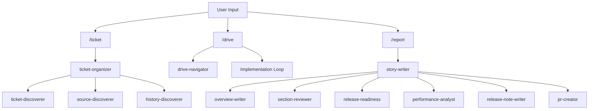
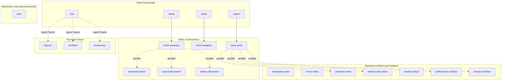
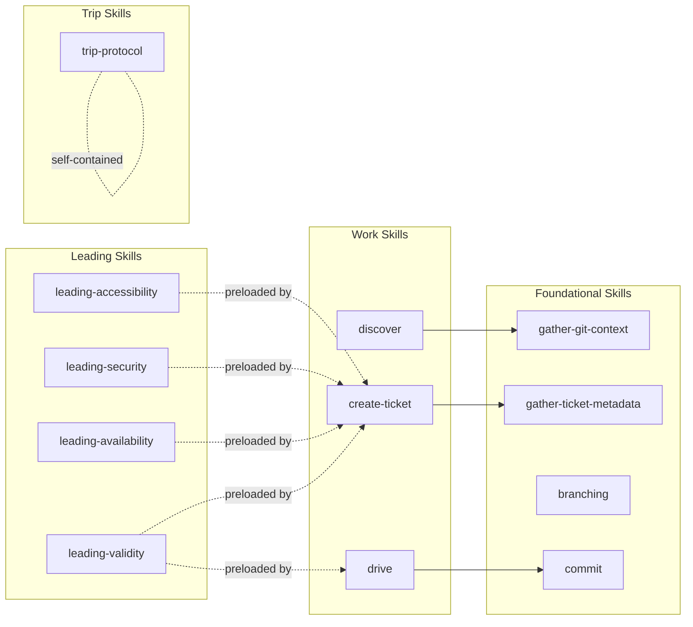

[English](component.md) | [Japanese](component_ja.md)

# Component Viewpoint

The Component Viewpoint describes the internal structure of the Workaholic marketplace, its module boundaries, and how the system decomposes into plugins, commands, agents, skills, and rules. The marketplace contains three plugins: core (shared utilities and context-aware commands), standards (the four leading skills, analyze-* skills, write-* skills, and the writer/analyst agents that produce documentation), and work (the `/ticket`, `/drive`, and `/trip` commands plus their orchestrators). All three plugins are organized in strict hierarchical architectures that enforce separation of concerns through nesting policies.

## Module Boundaries

The architecture enforces strict boundaries through the component nesting policy defined in CLAUDE.md:

| Caller | Can invoke | Cannot invoke |
| --- | --- | --- |
| Command | Skill, Subagent | -- |
| Subagent | Skill, Subagent | Command |
| Skill | Skill | Subagent, Command |

This creates a layered dependency graph where knowledge flows upward (skills are loaded by agents and commands) while control flows downward (commands invoke agents which invoke skills). The policy prevents circular dependencies and ensures that the knowledge layer (skills) remains independent of the orchestration layer (commands and agents).

### Shell Script Boundary

Shell scripts are always bundled within skills and never written inline in agent or command markdown files. The Shell Script Principle in CLAUDE.md prohibits complex inline shell commands including:

- Conditionals (`if`, `case`, `test`, `[ ]`, `[[ ]]`)
- Pipes and chains (`|`, `&&`, `||`)
- Text processing (`sed`, `awk`, `grep`, `cut`)
- Loops (`for`, `while`)
- Variable expansion with logic (`${var:-default}`, `${var:+alt}`)

All such operations must be extracted to bundled scripts in `skills/<name>/sh/<script>.sh`. This ensures consistency, testability, and permission-free execution.

### Design Principle: Thin Orchestration, Comprehensive Knowledge

The architecture follows a strict size and responsibility guideline:

- **Commands**: Orchestration only (~50-100 lines). Define workflow steps, invoke subagents, handle user interaction.
- **Subagents**: Orchestration only (~20-40 lines). Define input/output, preload skills, minimal procedural logic.
- **Skills**: Comprehensive knowledge (~50-150 lines). Contain templates, guidelines, rules, and bash scripts.

### Plugin Isolation

The two plugins (drivin and trippin) maintain strict isolation:

- Each plugin has its own `.claude-plugin/plugin.json`, commands, agents, skills, and rules directories
- Skill paths are plugin-specific (`~/.claude/plugins/marketplaces/workaholic/plugins/drivin/skills/` vs `~/.claude/plugins/marketplaces/workaholic/plugins/trippin/skills/`)
- Trippin's trip-protocol skill is self-contained and does not reference any drivin-specific skills
- Subagent types use plugin-scoped prefixes (`drivin:agent-name` vs `trippin:agent-name`)
- Versions are synchronized across both plugins and the marketplace

## Component Hierarchy

### Marketplace Layer

The marketplace (`/.claude-plugin/marketplace.json`) registers all plugins and maintains synchronized versioning:

| Plugin | Description | Source | Version |
| --- | --- | --- | --- |
| `drivin` | Core development workflow | `./plugins/drivin` | 1.0.38 |
| `trippin` | AI-oriented exploration and creative development | `./plugins/trippin` | 1.0.38 |

### Drivin Plugin Components

#### Commands Layer (4)

Commands are the user-facing entry points. Each command is a thin orchestration layer that delegates to agents and skills.

| Command | File | Description | Primary Agents |
| --- | --- | --- | --- |
| `/ticket` | `commands/ticket.md` | Explore codebase and write implementation ticket | ticket-organizer |
| `/drive` | `commands/drive.md` | Implement tickets from todo queue one by one | drive-navigator |
| `/report` | `commands/report.md` | Generate story and create/update PR | story-writer |

#### Command Orchestration Flow



#### Agents Layer

Agents are grouped by primary purpose. The standards plugin provides one parameterized lead agent and a small set of writer/analyst agents; the work plugin provides orchestrators for ticket creation, drive, trip, and reporting.

##### Lead (1, parameterized)

- `lead` -- Single agent in the standards plugin that takes a domain prompt parameter (`accessibility`, `availability`, `security`, `validity`) and applies the matching `leading-<domain>` skill. Replaced the per-domain lead agents that existed during the manager era.

##### Worker Tier: Ticket Management (3)

- `ticket-organizer` -- Orchestrates ticket creation with parallel discovery
- `ticket-discoverer` -- Finds existing tickets to detect duplicates
- `drive-navigator` -- Prioritizes and orders tickets for implementation

##### Worker Tier: Report Generation (7)

- `story-writer` -- Orchestrates story generation and PR creation
- `overview-writer` -- Prepares story overview, highlights, motivation, journey
- `performance-analyst` -- Evaluates decision-making quality (tickets vs implementation)
- `section-reviewer` -- Reviews and generates story sections 5-8
- `pr-creator` -- Creates or updates GitHub pull request using `gh` CLI
- `release-note-writer` -- Generates concise release notes from story file
- `release-readiness` -- Assesses release preparedness

##### Worker Tier: Discovery (3)

- `source-discoverer` -- Explores codebase structure to find relevant files for tickets
- `history-discoverer` -- Finds related historical tickets for context
- `ticket-discoverer` -- Analyzes for duplicate/merge/split decisions

##### Worker Tier: Documentation Writers and Analysts

- `changelog-writer` -- Updates CHANGELOG.md from archived tickets
- `terms-writer` -- Updates term definitions
- `overview-writer` -- Generates story overview, highlights, motivation, journey
- `release-note-writer` -- Generates concise release notes from story files
- `model-analyst` -- Standalone analysis agent producing `.workaholic/specs/model.md`
- `performance-analyst` -- Evaluates decision-making quality across viewpoints
- `section-reviewer` -- Reviews and generates story sections 5-8

#### Skills Layer

Skills are the knowledge layer, organized by domain. Each skill directory contains a `SKILL.md` file and optionally a `scripts/` directory with bundled shell scripts.

##### Leading Skills (4)

- `leading-validity` -- Logical comprehensiveness, type-driven design, layer segregation
- `leading-availability` -- CI/CD, vendor neutrality, IaC, observability, recovery
- `leading-security` -- Secure-by-design defaults, ISMS-style risk management, defense in depth
- `leading-accessibility` -- Universal reach, modeless design, tool-first interaction

##### Analysis Skills (3)

- `analyze-performance` -- Evaluates decision quality by comparing tickets against actual changes
- `analyze-policy` -- Framework for analyzing repository from policy viewpoint
- `analyze-viewpoint` -- Generic framework for analyzing repository from specific viewpoints

##### Ticket Operations (6)

- `archive-ticket` -- Moves ticket from todo to archive and commits
- `create-ticket` -- Guidelines and templates for writing implementation tickets
- `discover-ticket` -- Searches existing tickets to detect duplicates
- `discover-history` -- Finds related historical tickets for context
- `discover-source` -- Explores codebase structure to find relevant files
- `update-ticket-frontmatter` -- Updates ticket frontmatter fields (commit_hash, effort)

##### Git Operations (4)

- `branching` -- Checks current branch and creates topic branches when needed
- `commit` -- Guidelines for git commit operations with expanded sections
- `create-pr` -- Creates or updates GitHub pull requests using `gh` CLI
- `gather-git-context` -- Gathers branch, base_branch, repo_url, archived_tickets, git_log

##### Documentation Writing (8)

- `write-changelog` -- Generates CHANGELOG.md from archived tickets
- `write-final-report` -- Appends Final Report section to tickets after implementation
- `write-overview` -- Generates story overview, highlights, motivation, journey
- `write-release-note` -- Generates concise release notes from story files
- `write-spec` -- Guidelines for writing and updating specification documents
- `write-story` -- Guidelines for writing branch story documents with summarization workflow
- `write-terms` -- Generates term definitions from codebase
- `translate` -- Guidelines for translating markdown files to other languages

##### Workflow Skills (3)

- `drive-approval` -- Handles user approval dialog for ticket implementation
- `drive-workflow` -- Step-by-step workflow for implementing a single ticket
- `gather-ticket-metadata` -- Extracts date and author from ticket filenames

##### Quality Skills (3)

- `assess-release-readiness` -- Evaluates branch readiness for release
- `review-sections` -- Reviews story sections 5-8 for quality
- `validate-writer-output` -- Validates that documentation agents produced expected files

#### Rules Layer (6)

Rules are global constraints that apply to specific file patterns.

| Rule | Path Pattern | Purpose |
| --- | --- | --- |
| `general.md` | `**/*` | Commit policy, git rules, heading numbering |
| `diagrams.md` | Path-specific | Mermaid diagram requirements |
| `i18n.md` | Path-specific | Internationalization policy |
| `shell.md` | `**/*.sh` | Shell scripting standards (POSIX sh, strict mode) |
| `typescript.md` | Path-specific | TypeScript conventions |
| `workaholic.md` | Path-specific | Workaholic-specific rules |

Note: `define-lead.md` resides in `.claude/rules/` (repository-scoped rule), not within any plugin's rules directory.

#### Hooks Layer (1)

A single PostToolUse hook validates ticket frontmatter on every Write or Edit operation, running `validate-ticket.sh` with a 10-second timeout.

### Trippin Plugin Components

#### Commands Layer (1)

| Command | File | Description | Primary Mechanism |
| --- | --- | --- | --- |
| `/trip` | `commands/trip.md` | Launch Agent Teams session with collaborative exploration | Agent Teams (3 members) |

#### Agents Layer (3)

Trippin agents are not organized into tiers. They operate as peers in an Agent Teams session, each with a distinct philosophical stance and responsibility domain.

| Agent | Stance | Philosophy | Responsibilities |
| --- | --- | --- | --- |
| `planner` | Progressive | Extrinsic Idealism | Creative Direction, Stakeholder Profiling, Explanatory Accountability |
| `architect` | Neutral | Structural Idealism | Semantical Consistency, Static Verification, Accessibility |
| `constructor` | Conservative | Intrinsic Idealism | Sustainable Implementation, Infrastructure Reliability, Delivery Coordination |

All three agents preload the trip-protocol skill and use the opus model. Each agent has frontmatter specifying tools (Read, Write, Edit, Glob, Grep, Bash) and a color identifier for the Agent Teams UI.

#### Skills Layer (1)

- `trip-protocol` -- Comprehensive protocol defining the Implosive Structure workflow, worktree isolation, commit-per-step rule, artifact format, moderation protocol, and consensus gates. Contains three bundled shell scripts:
  - `sh/ensure-worktree.sh` -- Validates git state and creates isolated worktree with `trip/<trip-name>` branch
  - `sh/init-trip.sh` -- Initializes `.workaholic/.trips/<trip-name>/` with `directions/`, `models/`, `designs/` subdirectories
  - `sh/trip-commit.sh` -- Standardized commit script with `trip(<agent>): <step>` message format

#### Rules Layer (0)

No rules defined yet for the trippin plugin. The `rules/` directory contains only a `.gitkeep` file.

### Agent Nesting Pattern



### Skill Dependency Graph



## Responsibility Distribution

### Command Responsibilities

Commands are responsible for:

- Parsing user input and routing to appropriate agents
- Handling user interaction via `AskUserQuestion`
- Orchestrating multi-agent workflows with phase sequencing
- Staging and committing changes
- Presenting final results to the user

Commands delegate all knowledge operations to skills and all focused work to agents.

### Lead Responsibilities

The parameterized `lead` agent is responsible for:

- Loading the matching `leading-<domain>` skill based on its prompt parameter
- Deriving its viewpoint directly from the codebase (no upstream context source)
- Producing domain-specific policy documents when invoked for documentation generation
- Documenting observable practices rather than aspirational recommendations

The four leading skills (`leading-validity`, `leading-availability`, `leading-security`, `leading-accessibility`) are also preloaded directly into work-plugin commands and agents (`/drive`, `ticket-organizer`, `planner`, `architect`, `constructor`) where they act as policy lenses rather than producers.

### Work Worker Agent Responsibilities

Worker agents are responsible for:

- Executing single focused tasks (e.g., "discover relevant source files")
- Invoking other agents in parallel when needed
- Preloading skills that contain domain knowledge
- Returning structured JSON output to parent commands/agents
- Avoiding user interaction (with exceptions for navigators and organizers)

### Trippin Agent Responsibilities

Trippin agents (planner, architect, constructor) operate as Agent Teams peers:

- Each owns a specific artifact type (direction, model, design)
- Each reviews artifacts produced by the other two agents
- Each commits every step using trip-commit.sh
- Each follows the trip-protocol skill for format, versioning, and consensus gates
- The third agent moderates when two agents disagree

### Skill Responsibilities

Skills are responsible for:

- Providing templates, guidelines, and rules
- Bundling shell scripts for common operations
- Defining data formats and frontmatter schemas
- Establishing conventions and patterns
- Being self-contained and reusable

Skills never invoke agents or commands. They may reference other skills for composition.

### Rule Responsibilities

Rules are responsible for:

- Enforcing global constraints across the codebase
- Defining coding standards and conventions
- Establishing architectural policies
- Applying automatically based on file path patterns

## Dependency Directions

### Layered Architecture

The work plugin follows a strict layered architecture:

```
+-----------------------------------------+
|          Commands Layer                  |  User-facing entry points
+-----------------------------------------+
|         Agents Layer                     |  Orchestration and discovery
+-----------------------------------------+
|           Skills Layer                   |  Knowledge and operations
+-----------------------------------------+
|           Rules Layer                    |  Global constraints
+-----------------------------------------+
```

Dependencies flow downward only:
- Commands depend on Agents and Skills (including preloaded `standards:leading-*` skills via soft cross-plugin references)
- Agents depend on Skills only (and may invoke other agents)
- Skills depend on other Skills only
- Rules have no dependencies (applied by platform)

The trippin plugin follows a flatter architecture:

```
+-----------------------------------------+
|         Trip Command                     |  Worktree setup + Team launch
+-----------------------------------------+
|      Agent Team (3 peers)                |  Planner, Architect, Constructor
+-----------------------------------------+
|       trip-protocol Skill                |  Protocol, scripts, artifact format
+-----------------------------------------+
```

### Information Flow: Leading Skills as Policy Lenses

Leading skills do not produce intermediate artifacts that other agents consume. Instead, they are preloaded into the work plugin's commands and orchestrators:

```
standards:leading-validity      -.preloaded by.-> /drive, ticket-organizer, planner, architect, constructor
standards:leading-availability  -.preloaded by.-> /drive, ticket-organizer, planner, architect, constructor
standards:leading-security      -.preloaded by.-> /drive, ticket-organizer, planner, architect, constructor
standards:leading-accessibility -.preloaded by.-> /drive, ticket-organizer, planner, architect, constructor
```

The work plugin's `dependencies` field declares only `["core"]`; the leading-skill references are soft (the work plugin tolerates the standards plugin being absent).

### Parallel Invocation Pattern

The architecture uses parallel agent invocation extensively to improve performance:

**ticket-organizer pattern (3 parallel workers):**
```
ticket-organizer
+-- (parallel) -> ticket-discoverer
+-- (parallel) -> source-discoverer
+-- (parallel) -> history-discoverer
```

**story-writer pattern (4 + 2 parallel workers):**
```
story-writer
+-- Phase 1 (4 parallel) -> overview-writer, section-reviewer, release-readiness, performance-analyst
+-- Phase 2 (2 parallel) -> release-note-writer, pr-creator
```

### Skill Preloading Pattern

Agents and commands declare skill dependencies in their frontmatter:

```yaml
skills:
  - drive
  - core:system-safety
  - standards:leading-validity
  - standards:leading-accessibility
  - standards:leading-security
  - standards:leading-availability
```

The platform preloads these skills, making their content available to the agent without explicit reads. Cross-plugin references use either the `<plugin>:<skill>` slug for soft references or `${CLAUDE_PLUGIN_ROOT}/../<plugin>/` paths for declared dependencies. Bundled shell scripts within skills are always invoked via `${CLAUDE_PLUGIN_ROOT}` paths:

```bash
bash ${CLAUDE_PLUGIN_ROOT}/skills/gather-git-context/scripts/gather.sh
bash ${CLAUDE_PLUGIN_ROOT}/../core/skills/branching/scripts/check-worktrees.sh
```

## Design Patterns

### Pattern 1: Lead-as-Lens Preloading

The four leading skills are preloaded directly into work-plugin commands and orchestrators via the soft cross-plugin reference pattern (`standards:leading-*`). Each preload site treats the leads as policy lenses applied to whichever layers the ticket touches, rather than as upstream producers of intermediate context.

### Pattern 2: Command-Agent-Skill Delegation

Every work-plugin command follows the delegation pattern: command parses user input, invokes primary agents via Task tool, agents preload relevant skills, execute focused tasks, and return structured JSON. The command handles commit, user interaction, and final presentation.

### Pattern 3: Parallel Discovery

The ticket-organizer agent uses parallel discovery to minimize latency by invoking 3 discovery agents concurrently.

### Pattern 5: Approval Loop

The drive command uses an approval loop with skill-defined guidelines. The approval dialog requires ticket title and overview, treating missing context as a failure condition.

### Pattern 6: Bundled Script

All shell scripts are bundled within skills, never inline in commands or agents. Both plugins follow this pattern: drivin has scripts in multiple skills, trippin bundles three scripts in trip-protocol.

### Pattern 7: JSON Communication

Drivin agents return structured JSON to their callers, enabling structured error handling, partial success reporting, and clear agent contracts.

### Pattern 8: Agent Teams Collaboration

The trippin plugin introduces a peer collaboration pattern where three agents share a workspace, communicate through versioned artifacts, and coordinate through a structured protocol. Unlike drivin's hierarchical Task tool pattern, Agent Teams members operate independently with their own context windows.

### Pattern 9: Worktree Isolation

The trippin plugin isolates each trip session in a dedicated git worktree, preventing interference with the main working tree and enabling parallel trip sessions on separate branches.

## Component Count Summary

| Category | Drivin | Trippin | Total |
| --- | --- | --- | --- |
| Commands | 4 | 1 | 5 |
| Agents | 28 | 3 | 31 |
| Skills | 45 | 1 | 46 |
| Rules | 6 | 0 | 6 |
| Shell Scripts | 21 | 3 | 24 |

## Architectural Evolution

### Core Plugin Renamed to Drivin

The `plugins/core` directory was renamed to `plugins/drivin` with all references updated. This affected plugin.json, marketplace.json, all `subagent_type: "core:*"` references (changed to `drivin:*`), all installed plugin path references, and CLAUDE.md. The rename establishes a naming convention where each plugin has a distinctive name.

### Trippin Plugin Created

A second plugin was added with the `/trip` command and three Agent Teams agents, introducing a fundamentally different orchestration model based on peer collaboration and worktree isolation. This represents the first expansion of the marketplace from a single-plugin to a multi-plugin system.

### Drive Approval Context Enforcement

The drive approval flow was strengthened with CRITICAL enforcement requiring ticket title and overview in every approval prompt, addressing a recurring UX issue through three iterations of improvements.

### Removal of the Strategic-Context Tier

A three-agent strategic-context tier was introduced in February 2026 to provide leads with a separate upstream layer of project, architectural, and quality context. It comprised three agents and their paired domain skills, a cross-cutting principles skill, a schema enforcement rule, a full-codebase documentation command, an agent-selection helper skill, and a directory of explicit constraint files. None of those artifacts were consulted by the active ticket, drive, or trip flows, which derived context directly from the codebase. The tier was removed in May 2026 in favor of preloading the four leading skills directly into work-plugin commands and orchestrators. The viewpoint specs that the architecture-side agent had produced (application.md, component.md, feature.md, usecase.md) are now hand-maintained reference documents without an automated owner.

## Assumptions

- [Explicit] The drivin plugin component counts (4 commands, 28 agents, 45 skills, 6 rules) are derived from the filesystem listing and verified against scan.md agent tables.
- [Explicit] The trippin plugin component counts (1 command, 3 agents, 1 skill, 0 rules) are derived from the filesystem listing.
- [Explicit] The nesting policy table is defined in `CLAUDE.md` under "Architecture Policy > Component Nesting Rules".
- [Explicit] Shell scripts must be bundled in skills, never inline, as stated in CLAUDE.md's Shell Script Principle.
- [Explicit] The core plugin was renamed to drivin as documented in ticket 20260302215035.
- [Explicit] The trippin plugin was created as documented in tickets 20260302215036 and 20260309214650.
- [Explicit] The marketplace registers two plugins with synchronized versions (1.0.38) as shown in marketplace.json.
- [Explicit] Trippin agents use Agent Teams with the experimental feature flag, as documented in trip.md.
- [Explicit] The trip-protocol skill contains 3 shell scripts (ensure-worktree.sh, init-trip.sh, trip-commit.sh) as observed in the plugins/trippin/skills/trip-protocol/sh/ directory.
- [Explicit] The drive-approval skill enforces ticket title and overview in approval prompts with CRITICAL language, as documented in drive-approval SKILL.md.
- [Inferred] The trippin plugin's flat architecture (command -> team -> skill) reflects the Agent Teams model where peer collaboration replaces hierarchical delegation.
- [Inferred] The marketplace expansion from one plugin to two signals a design philosophy of modular, independently-evolving workflow plugins.
- [Inferred] The zero rules in trippin suggests the plugin is in early development; rules may be added as patterns solidify.
