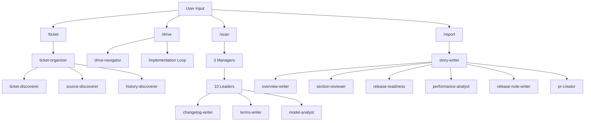
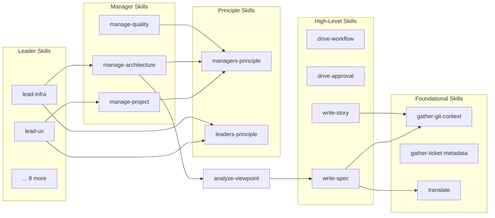

[English](component.md) | [Japanese](component_ja.md)

# Component Viewpoint

The Component Viewpoint describes the internal structure of the Workaholic plugin, its module boundaries, and how the system decomposes into commands, agents, skills, and rules. The core plugin contains 4 commands, 28 agents (3 managers, 25 specialized agents), 45 skills, and 6 rules, organized in a strict hierarchical architecture that enforces separation of concerns through a nesting policy. The recent addition of a manager tier introduces a strategic layer above the existing leader and worker agents, fundamentally changing the component responsibilities and information flow.

## Module Boundaries

The architecture enforces strict boundaries through the component nesting policy defined in CLAUDE.md:

| Caller | Can invoke | Cannot invoke |
| --- | --- | --- |
| Command | Skill, Subagent | -- |
| Subagent | Skill, Subagent | Command |
| Skill | Skill | Subagent, Command |

This creates a layered dependency graph where knowledge flows upward (skills are loaded by agents and commands) while control flows downward (commands invoke agents which invoke skills). The policy prevents circular dependencies and ensures that the knowledge layer (skills) remains independent of the orchestration layer (commands and agents).

### Shell Script Boundary

Shell scripts are always bundled within skills and never written inline in agent or command markdown files. The Shell Script Principle in CLAUDE.md prohibits complex inline shell commands including:

- Conditionals (`if`, `case`, `test`, `[ ]`, `[[ ]]`)
- Pipes and chains (`|`, `&&`, `||`)
- Text processing (`sed`, `awk`, `grep`, `cut`)
- Loops (`for`, `while`)
- Variable expansion with logic (`${var:-default}`, `${var:+alt}`)

All such operations must be extracted to bundled scripts in `skills/<name>/sh/<script>.sh`. This ensures consistency, testability, and permission-free execution.

### Design Principle: Thin Orchestration, Comprehensive Knowledge

The architecture follows a strict size and responsibility guideline:

- **Commands**: Orchestration only (~50-100 lines). Define workflow steps, invoke subagents, handle user interaction.
- **Subagents**: Orchestration only (~20-40 lines). Define input/output, preload skills, minimal procedural logic.
- **Skills**: Comprehensive knowledge (~50-150 lines). Contain templates, guidelines, rules, and bash scripts.

The `/scan` command is an exception at ~90 lines, justified because moving its orchestration logic to a subagent would hide the 15 parallel agent invocations from the user, defeating the transparency benefit.

## Component Hierarchy

### Commands Layer (4)

Commands are the user-facing entry points. Each command is a thin orchestration layer that delegates to agents and skills.

| Command | File | Description | Primary Agents |
| --- | --- | --- | --- |
| `/ticket` | `ticket.md` | Explore codebase and write implementation ticket | ticket-organizer |
| `/drive` | `drive.md` | Implement tickets from todo queue one by one | drive-navigator |
| `/scan` | `scan.md` | Full documentation scan (3 managers + 12 agents) | 3 managers, 10 leaders, 2 writers |
| `/report` | `report.md` | Generate story and create/update PR | story-writer |

### Command Orchestration Flow



### Agents Layer (28)

Agents are grouped by their tier and primary purpose. The architecture now includes three tiers: managers (strategic), leaders (tactical), and workers (specialized tasks).

#### Manager Tier (3)

Managers establish strategic context that leaders consume. Each produces structured outputs covering a domain of project concerns.

- `project-manager` -- Produces project context (business, stakeholders, timeline, issues, solutions)
- `architecture-manager` -- Produces architectural context and four viewpoint specs (application, component, feature, usecase)
- `quality-manager` -- Produces quality context (standards, assurance, metrics, feedback loops)

#### Leader Tier (10)

Leaders produce domain-specific policy documents by consuming manager outputs and analyzing the codebase through their specialized lenses.

- `ux-lead` -- Produces ux.md (user experience, interaction patterns, user journeys)
- `infra-lead` -- Produces infrastructure.md (dependencies, deployment, runtime environment)
- `db-lead` -- Produces data.md (data formats, storage, persistence)
- `security-lead` -- Produces security.md (requirements, threat model, mitigation)
- `test-lead` -- Produces test.md (strategy, test types, coverage)
- `quality-lead` -- Produces quality.md (standards, review processes, gates)
- `a11y-lead` -- Produces accessibility.md (standards, WCAG, inclusive design)
- `observability-lead` -- Produces observability.md (logging, monitoring, tracing)
- `delivery-lead` -- Produces delivery.md (release processes, deployment, rollback)
- `recovery-lead` -- Produces recovery.md (backup, disaster recovery, business continuity)

#### Worker Tier: Ticket Management (3)

- `ticket-organizer` -- Orchestrates ticket creation with parallel discovery
- `ticket-discoverer` -- Finds existing tickets to detect duplicates
- `drive-navigator` -- Prioritizes and orders tickets for implementation

#### Worker Tier: Report Generation (6)

- `story-writer` -- Orchestrates story generation and PR creation
- `overview-writer` -- Prepares story overview, highlights, motivation, journey
- `performance-analyst` -- Evaluates decision-making quality (tickets vs implementation)
- `section-reviewer` -- Reviews and generates story sections 5-8
- `pr-creator` -- Creates or updates GitHub pull request using `gh` CLI
- `release-note-writer` -- Generates concise release notes from story file
- `release-readiness` -- Assesses release preparedness

#### Worker Tier: Discovery (3)

- `source-discoverer` -- Explores codebase structure to find relevant files for tickets
- `history-discoverer` -- Finds related historical tickets for context
- `ticket-discoverer` -- Analyzes for duplicate/merge/split decisions

#### Worker Tier: Documentation Writers (3)

- `changelog-writer` -- Updates CHANGELOG.md from archived tickets
- `terms-writer` -- Updates term definitions
- `model-analyst` -- Analyzes model viewpoint (domain concepts and relationships)

### Agent Nesting Pattern

```mermaid
flowchart TD
    subgraph Commands
        ticket["/ticket"]
        drive["/drive"]
        scan["/scan"]
        report["/report"]
    end

    subgraph "Manager Agents (Strategic)"
        PM[project-manager]
        AM[architecture-manager]
        QM[quality-manager]
    end

    subgraph "Leader Agents (Tactical)"
        UXL[ux-lead]
        IL[infra-lead]
        DL[db-lead]
        SL[security-lead]
        TL[test-lead]
        QL[quality-lead]
        AL[a11y-lead]
        OL[observability-lead]
        DEL[delivery-lead]
        RL[recovery-lead]
    end

    subgraph "Worker Agents"
        TO[ticket-organizer]
        TD[ticket-discoverer]
        SD[source-discoverer]
        HD[history-discoverer]
        SW[story-writer]
        Writers[Other Writers]
    end

    ticket --> TO
    TO -.parallel.-> TD
    TO -.parallel.-> SD
    TO -.parallel.-> HD

    drive --> drive-navigator

    scan -.phase 3a.-> PM
    scan -.phase 3a.-> AM
    scan -.phase 3a.-> QM
    scan -.phase 3b.-> UXL
    scan -.phase 3b.-> IL
    scan -.phase 3b.-> Writers

    report --> SW
    SW -.parallel.-> overview-writer
    SW -.parallel.-> section-reviewer
```



### Skills Layer (45)

Skills are the knowledge layer, organized by domain. Each skill directory contains a `SKILL.md` file and optionally an `sh/` directory with bundled shell scripts.

#### Manager Skills (3)

- `manage-project` -- Project manager knowledge (business, stakeholders, timeline)
- `manage-architecture` -- Architecture manager knowledge (system structure, layers, components)
- `manage-quality` -- Quality manager knowledge (standards, assurance, metrics)

#### Leader Skills (10)

- `lead-ux` -- UX lead knowledge (user experience, interaction patterns)
- `lead-infra` -- Infrastructure lead knowledge (dependencies, deployment)
- `lead-db` -- Database lead knowledge (data formats, storage)
- `lead-security` -- Security lead knowledge (threat model, mitigation)
- `lead-test` -- Test lead knowledge (strategy, test types)
- `lead-quality` -- Quality lead knowledge (standards, review processes)
- `lead-a11y` -- Accessibility lead knowledge (WCAG, inclusive design)
- `lead-observability` -- Observability lead knowledge (logging, monitoring)
- `lead-delivery` -- Delivery lead knowledge (release processes, deployment)
- `lead-recovery` -- Recovery lead knowledge (backup, disaster recovery)

#### Principle Skills (2)

- `managers-principle` -- Cross-cutting principles for all managers (Prior Term Consistency, Strategic Focus, Constraint Setting)
- `leaders-principle` -- Cross-cutting principles for all leaders (Prior Term Consistency, Vendor Neutrality)

#### Analysis Skills (3)

- `analyze-performance` -- Evaluates decision quality by comparing tickets against actual changes
- `analyze-policy` -- Framework for analyzing repository from policy viewpoint
- `analyze-viewpoint` -- Generic framework for analyzing repository from specific viewpoints

#### Ticket Operations (6)

- `archive-ticket` -- Moves ticket from todo to archive and commits
- `create-ticket` -- Guidelines and templates for writing implementation tickets
- `discover-ticket` -- Searches existing tickets to detect duplicates
- `discover-history` -- Finds related historical tickets for context
- `discover-source` -- Explores codebase structure to find relevant files
- `update-ticket-frontmatter` -- Updates ticket frontmatter fields (commit_hash, effort)

#### Git Operations (4)

- `branching` -- Checks current branch and creates topic branches when needed
- `commit` -- Guidelines for git commit operations with expanded sections
- `create-pr` -- Creates or updates GitHub pull requests using `gh` CLI
- `gather-git-context` -- Gathers branch, base_branch, repo_url, archived_tickets, git_log

#### Documentation Writing (8)

- `write-changelog` -- Generates CHANGELOG.md from archived tickets
- `write-final-report` -- Appends Final Report section to tickets after implementation
- `write-overview` -- Generates story overview, highlights, motivation, journey
- `write-release-note` -- Generates concise release notes from story files
- `write-spec` -- Guidelines for writing and updating specification documents
- `write-story` -- Guidelines for writing branch story documents with summarization workflow
- `write-terms` -- Generates term definitions from codebase
- `translate` -- Guidelines for translating markdown files to other languages

#### Workflow Skills (3)

- `drive-approval` -- Handles user approval dialog for ticket implementation
- `drive-workflow` -- Step-by-step workflow for implementing a single ticket
- `gather-ticket-metadata` -- Extracts date and author from ticket filenames

#### Quality Skills (3)

- `assess-release-readiness` -- Evaluates branch readiness for release
- `review-sections` -- Reviews story sections 5-8 for quality
- `validate-writer-output` -- Validates that documentation agents produced expected files

#### Other Skills (3)

- `select-scan-agents` -- Selects which documentation agents to invoke (full vs partial mode)

### Skill Dependency Graph



### Rules Layer (6)

Rules are global constraints that apply to specific file patterns.

| Rule | Path Pattern | Purpose |
| --- | --- | --- |
| `general.md` | `**/*` | Commit policy, git rules, heading numbering |
| `define-lead.md` | `plugins/core/skills/lead-*/SKILL.md`, `plugins/core/agents/*-lead.md` | Lead agent schema enforcement |
| `define-manager.md` | Manager skills and agents | Manager agent schema enforcement |
| `diagrams.md` | Path-specific | Mermaid diagram requirements |
| `i18n.md` | Path-specific | Internationalization policy |
| `shell.md` | `**/*.sh` | Shell scripting standards (POSIX sh, strict mode) |

### Hooks Layer (1)

A single PostToolUse hook validates ticket frontmatter on every Write or Edit operation, running `validate-ticket.sh` with a 10-second timeout.

## Responsibility Distribution

### Command Responsibilities

Commands are responsible for:

- Parsing user input and routing to appropriate agents
- Handling user interaction via `AskUserQuestion`
- Orchestrating multi-agent workflows with phase sequencing
- Staging and committing changes
- Presenting final results to the user

Commands delegate all knowledge operations to skills and all focused work to agents.

### Manager Responsibilities

Managers are responsible for:

- Establishing strategic context that leaders consume
- Producing structured outputs covering project, architecture, or quality domains
- Following constraint-setting workflow (Analyze, Ask, Propose, Produce)
- Writing directional materials (policies, guidelines, roadmaps, decision records)
- Observing managers-principle (Prior Term Consistency, Strategic Focus, Constraint Setting)

Managers delegate all shell script operations to skills and preload managers-principle for cross-cutting behavioral principles.

### Leader Responsibilities

Leaders are responsible for:

- Reading manager outputs as strategic input before analysis
- Producing domain-specific policy documents
- Analyzing codebase through specialized lenses (security, quality, delivery, etc.)
- Observing leaders-principle (Prior Term Consistency, Vendor Neutrality)
- Documenting observable practices rather than aspirational recommendations

Leaders delegate all shell script operations to skills and preload leaders-principle for cross-cutting behavioral principles.

### Worker Agent Responsibilities

Worker agents are responsible for:

- Executing single focused tasks (e.g., "discover relevant source files")
- Invoking other agents in parallel when needed
- Preloading skills that contain domain knowledge
- Returning structured JSON output to parent commands/agents
- Avoiding user interaction (with exceptions for navigators and organizers)

Workers delegate all shell script operations to skills and all knowledge templates to skills.

### Skill Responsibilities

Skills are responsible for:

- Providing templates, guidelines, and rules
- Bundling shell scripts for common operations
- Defining data formats and frontmatter schemas
- Establishing conventions and patterns
- Being self-contained and reusable

Skills never invoke agents or commands. They may reference other skills for composition.

### Rule Responsibilities

Rules are responsible for:

- Enforcing global constraints across the codebase
- Defining coding standards and conventions
- Establishing architectural policies
- Applying automatically based on file path patterns
- Defining schemas for managers and leaders

## Dependency Directions

### Layered Architecture

The system follows a strict layered architecture with four tiers:

```
┌─────────────────────────────────────┐
│          Commands Layer             │  User-facing entry points
├─────────────────────────────────────┤
│        Manager Agents Layer         │  Strategic context
├─────────────────────────────────────┤
│      Leader/Worker Agents Layer     │  Tactical execution
├─────────────────────────────────────┤
│           Skills Layer              │  Knowledge and operations
├─────────────────────────────────────┤
│           Rules Layer               │  Global constraints
└─────────────────────────────────────┘
```

Dependencies flow downward only:
- Commands depend on all Agent tiers and Skills
- Manager Agents depend on Skills and managers-principle
- Leader Agents depend on Manager outputs, Skills, and leaders-principle
- Worker Agents depend on Skills only
- Skills depend on other Skills only
- Rules have no dependencies (applied by platform)

### Information Flow: Managers to Leaders

The manager tier introduces a horizontal information flow where manager outputs serve as input to leaders:

```
project-manager → [specs/policies] → delivery-lead, ux-lead
architecture-manager → [specs] → infra-lead, db-lead, security-lead, observability-lead, recovery-lead
quality-manager → [policies] → quality-lead, test-lead, a11y-lead
```

This flow is file-based: managers write markdown documents to `.workaholic/`, leaders read those documents before performing domain-specific analysis. The file-based pattern ensures all intermediate context is inspectable and version-controlled.

### Parallel Invocation Pattern

The architecture uses parallel agent invocation extensively to improve performance:

**scan command two-phase pattern:**
```
Phase 3a (managers):
  /scan
  ├─ (parallel) → project-manager
  ├─ (parallel) → architecture-manager
  └─ (parallel) → quality-manager

Phase 3b (leaders/writers):
  /scan
  ├─ (parallel) → 10 leader agents
  └─ (parallel) → 2 writer agents
```

**ticket-organizer pattern (3 parallel workers):**
```
ticket-organizer
├─ (parallel) → ticket-discoverer
├─ (parallel) → source-discoverer
└─ (parallel) → history-discoverer
```

**story-writer pattern (4 + 2 parallel workers):**
```
story-writer
├─ Phase 1 (4 parallel) → overview-writer, section-reviewer, release-readiness, performance-analyst
└─ Phase 2 (2 parallel) → release-note-writer, pr-creator
```

This pattern minimizes latency by executing independent tasks concurrently. All parallel invocations use the Task tool with `run_in_background: false` (the default) to ensure agents have Write/Edit permissions.

### Skill Preloading Pattern

Agents and commands declare skill dependencies in their frontmatter:

```yaml
skills:
  - managers-principle
  - manage-project
```

The platform preloads these skills, making their content available to the agent without explicit reads. Bundled shell scripts within skills are always invoked via absolute paths:

```bash
bash ~/.claude/plugins/marketplaces/workaholic/plugins/core/skills/gather-git-context/sh/gather.sh
```

This pattern ensures skills remain self-contained and portable.

## Design Patterns

### Pattern 1: Manager-Leader Delegation

The manager tier establishes a strategic-tactical delegation pattern:

1. **Manager** analyzes codebase to produce strategic context
2. **Manager** writes structured outputs to `.workaholic/`
3. **Leader** reads manager outputs as input
4. **Leader** performs domain-specific analysis using strategic context
5. **Leader** produces policy document

**Example: security-lead depends on architecture-manager**

```
architecture-manager
  ↓
manage-architecture skill
  ↓
Analyze system boundaries, cross-cutting concerns
  ↓
Write architecture specs to .workaholic/specs/
  ↓
security-lead
  ├─ Read .workaholic/specs/ for system boundaries
  ├─ Analyze threat model using architectural context
  └─ Write .workaholic/policies/security.md
```

### Pattern 2: Command-Agent-Skill Delegation

Every command follows the delegation pattern:

1. **Command** parses user input and determines workflow
2. **Command** invokes primary agent(s) via Task tool
3. **Agent** preloads relevant skills for domain knowledge
4. **Agent** executes focused task using skill guidelines
5. **Agent** returns structured JSON to command
6. **Command** handles commit, user interaction, and final presentation

**Example: `/ticket` command flow**

```
/ticket <description>
  ↓
ticket.md (command)
  ├─ Parse input
  ├─ Invoke ticket-organizer agent
  └─ Handle response (commit, present to user)
      ↓
ticket-organizer.md (agent)
  ├─ Preload skills: branching, create-ticket, gather-ticket-metadata
  ├─ Check branch (branching skill)
  ├─ Parallel discovery (3 agents: ticket-discoverer, source-discoverer, history-discoverer)
  ├─ Write ticket (create-ticket skill)
  └─ Return JSON (status, branch_created, tickets)
```

### Pattern 3: Parallel Discovery

The ticket-organizer agent uses parallel discovery to minimize latency:

```
ticket-organizer
  ↓
Single Task invocation with 3 parallel calls
  ├─ ticket-discoverer (find duplicates)
  ├─ source-discoverer (find relevant files)
  └─ history-discoverer (find related tickets)
  ↓
Wait for all 3 to complete
  ↓
Use all 3 JSON results to write ticket
```

This pattern reduces discovery time from 3 sequential calls to 1 parallel batch.

### Pattern 4: Two-Phase Scan Execution

The scan command uses a two-phase execution pattern to support the manager tier:

```
/scan
  ↓
Phase 3a: Invoke managers in parallel
  ├─ project-manager
  ├─ architecture-manager
  └─ quality-manager
  ↓
Wait for all managers to complete
  ↓
Manager outputs written to .workaholic/
  ↓
Phase 3b: Invoke leaders/writers in parallel
  ├─ 10 leader agents (read manager outputs)
  └─ 2 writer agents
  ↓
Wait for all leaders/writers to complete
  ↓
Validate outputs, update indices, commit
```

This pattern ensures leaders have consistent strategic context without duplicating analysis.

### Pattern 5: Approval Loop

The drive command uses an approval loop with skill-defined guidelines:

```
For each ticket:
  1. Implement (drive-workflow skill)
  2. Request approval (drive-approval skill)
  3. Handle response:
     - Approve → Update ticket (write-final-report skill) → Archive (archive-ticket skill) → Next ticket
     - Feedback → Update ticket → Re-implement → Back to step 2
     - Abandon → Move to icebox → Next ticket
```

The `drive-approval` skill defines the approval dialog structure, while the command handles the actual `AskUserQuestion` invocation.

### Pattern 6: Bundled Script

All shell scripts are bundled within skills, never inline in commands or agents:

**Skill structure:**
```
skills/gather-git-context/
  ├─ SKILL.md              # Documentation and usage
  └─ sh/
      └─ gather.sh         # Bundled script
```

**Invocation from agent:**
```bash
bash ~/.claude/plugins/marketplaces/workaholic/plugins/core/skills/gather-git-context/sh/gather.sh
```

This pattern ensures:
- Scripts are testable in isolation
- Scripts run without permission prompts
- Scripts are reusable across agents
- Complex logic stays out of markdown files

### Pattern 7: JSON Communication

Agents return structured JSON to their callers:

**ticket-organizer output:**
```json
{
  "status": "success",
  "branch_created": "drive-20260202-181910",
  "tickets": [
    {
      "path": ".workaholic/tickets/todo/20260131-feature.md",
      "title": "Ticket Title",
      "summary": "Brief one-line summary"
    }
  ]
}
```

**story-writer output:**
```json
{
  "story_file": ".workaholic/stories/<branch-name>.md",
  "release_note_file": ".workaholic/release-notes/<branch-name>.md",
  "pr_url": "<PR-URL>",
  "agents": {
    "overview_writer": { "status": "success" | "failed", "error": "..." },
    "section_reviewer": { "status": "success" | "failed", "error": "..." }
  }
}
```

This pattern enables:
- Structured error handling
- Partial success reporting
- Programmatic response parsing
- Clear agent contracts

## Architectural Evolution

### Addition of Manager Tier

The introduction of the manager tier adds a strategic layer above the existing agent structure. This fundamentally changes responsibility distribution:

**Before:**
- 17 analysts independently analyze the codebase
- Each analyst infers project priorities, architectural structure, and quality expectations independently
- Duplication of strategic analysis across 17 agents

**After:**
- 3 managers establish strategic context (project, architecture, quality)
- 10 leaders consume manager outputs and perform domain-specific analysis
- Elimination of strategic context duplication

The architecture-manager absorbed the responsibilities of the removed architecture-lead agent, consolidating viewpoint spec production at the managerial level. This reflects the insight that "what is the system structure?" is a strategic concern, while "how should we implement within this structure?" is a tactical concern.

### Rename of Communication Lead to UX Lead

The communication-lead agent and lead-communication skill were renamed to ux-lead and lead-ux to better reflect their responsibility: user experience analysis including interaction patterns, user journeys, and onboarding paths. The viewpoint slug changed from "stakeholder" to "ux".

This rename eliminates terminological confusion and aligns naming with actual responsibility. The ux-lead now explicitly consumes project-manager outputs for stakeholder context, separating business analysis (manager concern) from UX analysis (leader concern).

### Skill Consolidation

The format-commit-message skill was merged into the commit skill, eliminating a separate formatting concern and consolidating all commit-related knowledge in one place. The commit skill now includes expanded sections covering motivation, UX changes, and architecture changes following the format-commit-message guidelines.

### Component Count Evolution

The component counts have evolved as follows:

- Commands: 4 (unchanged)
- Agents: 17 → 28 (added 3 managers, added 3 specialized workers, removed 1 architecture-lead, renamed 1 communication-lead)
- Skills: 27 → 45 (added 3 manager skills, added 10 leader skills, added 2 policy skills, merged format-commit-message into commit, added constraint-setting support)
- Rules: 6 → 6 (added define-manager rule)

The agent count increase reflects the shift from flat analysis to hierarchical strategic/tactical organization. The skill count increase reflects the need for domain knowledge at both manager and leader tiers.

## Assumptions

- [Explicit] The component counts (4 commands, 28 agents, 45 skills, 6 rules) are derived from the filesystem listing in the context output and recent ticket changes.
- [Explicit] The nesting policy table is defined in `CLAUDE.md` under "Architecture Policy > Component Nesting Rules".
- [Explicit] Shell scripts must be bundled in skills, never inline, as stated in `CLAUDE.md`'s "Shell Script Principle".
- [Explicit] The architecture-lead agent was removed and its responsibilities absorbed by architecture-manager, as documented in ticket 20260211170402.
- [Explicit] The communication-lead was renamed to ux-lead, as documented in ticket 20260211170402.
- [Explicit] The design principle ("Thin commands and subagents, comprehensive skills") is defined in `CLAUDE.md` under "Architecture Policy > Design Principle".
- [Explicit] The `/scan` command's ~90 line size is justified in the command file itself: "This is justified because the orchestration logic cannot be delegated to a subagent without losing the user-visible progress benefit."
- [Explicit] Manager agents follow the define-manager schema defined in `.claude/rules/define-manager.md`.
- [Explicit] Leader agents follow the define-lead schema defined in `.claude/rules/define-lead.md`.
- [Explicit] The manager tier introduces three agents (project-manager, architecture-manager, quality-manager) and three skills (manage-project, manage-architecture, manage-quality).
- [Explicit] The managers-principle skill defines cross-cutting principles for all managers: Prior Term Consistency, Strategic Focus, and Constraint Setting.
- [Explicit] The leaders-principle skill defines cross-cutting principles for all leaders: Prior Term Consistency and Vendor Neutrality.
- [Inferred] The large number of specialized agents (28) compared to commands (4) reflects a design philosophy prioritizing separation of concerns and focused single-purpose components over minimizing agent count.
- [Inferred] The single-plugin architecture (only `core`) suggests the marketplace infrastructure is designed for future multi-plugin expansion that has not yet occurred.
- [Inferred] The heavy use of parallel invocation (3 agents in ticket-organizer, 3+12 in scan two-phase, 4+2 in story-writer) indicates performance optimization is a key architectural concern, particularly for operations that would otherwise be sequential and slow.
- [Inferred] The strict prohibition on inline shell commands (documented in CLAUDE.md and shell.md rule) suggests past problems with inconsistent behavior, permission issues, or testing difficulties that led to this architectural constraint.
- [Inferred] The manager tier was introduced to eliminate strategic context duplication and establish a single source of truth for project priorities, architectural structure, and quality standards.
- [Inferred] The architecture-manager's absorption of viewpoint spec production consolidates "what is the system structure?" at the managerial level, leaving leaders to address "how should we work within this structure?"
