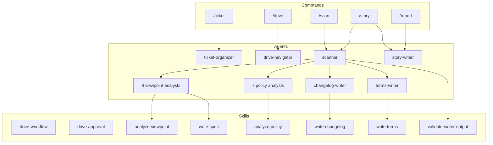

[English](component.md) | [Japanese](component_ja.md)

# 1. Component Viewpoint

Component Viewpoint は、Workaholic plugin の内部構造、モジュール境界、および command、agent、skill、rule へのシステム分解を記述します。Core plugin は4つの command、30の agent、28の skill、6つの rule を含み、厳格な階層アーキテクチャで組織化されています。

## 2. Component Hierarchy

### 2-1. Commands（4）

Command はユーザー向けエントリーポイントです。各々は薄いオーケストレーション層です。

| Command | ファイル | 主要 Subagent |
| --- | --- | --- |
| `/ticket` | `ticket.md` | ticket-organizer |
| `/drive` | `drive.md` | drive-navigator |
| `/scan` | `scan.md` | scanner |
| `/report` | `report.md` | story-writer |

### 2-2. Agents（30）

Agent は主要な目的別にグループ化されています：

**Ticket 管理:** ticket-organizer、ticket-discoverer、drive-navigator
**ドキュメント生成（Scan）:** scanner、8つの viewpoint analyst、7つの policy analyst、changelog-writer、terms-writer
**レポート生成:** story-writer、overview-writer、performance-analyst、section-reviewer、pr-creator、release-note-writer、release-readiness
**ディスカバリー:** source-discoverer、history-discoverer

### 2-3. Skills（28）

Skill は知識層で、ドメイン別に組織化されています。各 skill ディレクトリは `SKILL.md` ファイルを含み、オプションで shell script を含む `sh/` ディレクトリを持ちます。

### 2-4. Rules（6）

| Rule | 目的 |
| --- | --- |
| `general.md` | コミットポリシー、git ルール、見出し番号付け |
| `diagrams.md` | Mermaid ダイアグラム要件 |
| `i18n.md` | 国際化ポリシー |
| `shell.md` | Shell スクリプティング標準 |
| `typescript.md` | TypeScript 規約 |
| `workaholic.md` | .workaholic/ ディレクトリ規約 |

### 2-5. Hooks（1）

単一の PostToolUse hook が Write または Edit 操作ごとに ticket frontmatter を検証し、`validate-ticket.sh` を10秒タイムアウトで実行します。

## 3. Module Boundaries

アーキテクチャは nesting ポリシーを通じて厳格な境界を強制します：

| 呼び出し元 | 呼び出し可能 | 呼び出し不可 |
| --- | --- | --- |
| Command | Skill、Subagent | -- |
| Subagent | Skill、Subagent | Command |
| Skill | Skill | Subagent、Command |

## 4. Diagram

## 5. Assumptions

- [Explicit] コンポーネント数（4 command、30 agent、28 skill、6 rule）はファイルシステムのリストから導出されています。
- [Explicit] nesting ポリシーテーブルは `CLAUDE.md` で定義されています。
- [Explicit] shell script は `CLAUDE.md` の "Shell Script Principle" に記載されている通り、skill にバンドルする必要があり、インラインは禁止です。
- [Inferred] command（4）に対する多数の特殊化された agent（30）は、エージェント数を最小化するよりも関心の分離を優先し、各 command が多くの単一目的エージェントに展開される設計を反映しています。
- [Inferred] シングル plugin アーキテクチャ（`core` のみ）は、まだ実現されていない将来のマルチ plugin 拡張のために marketplace インフラストラクチャが設計されていることを示唆しています。
