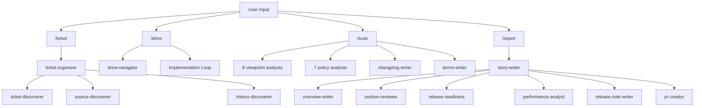
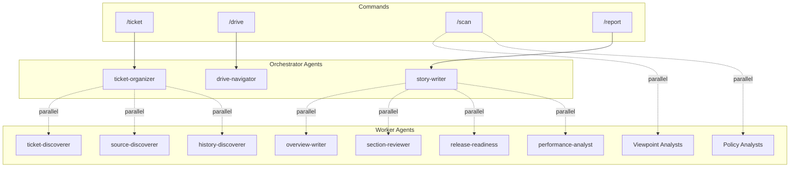
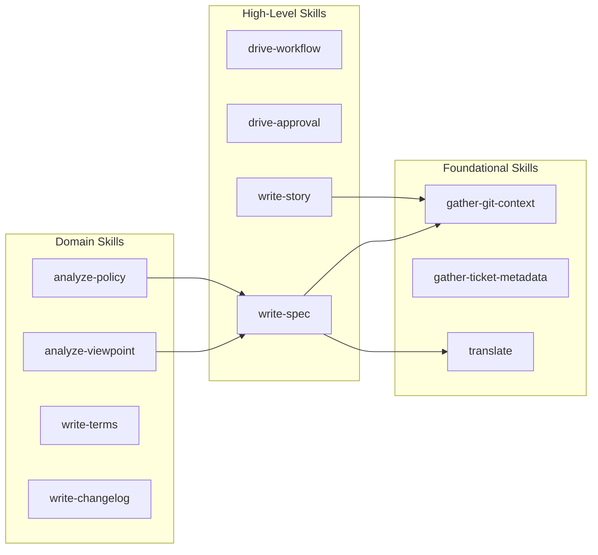

[English](component.md) | [Japanese](component_ja.md)

# 1. Component Viewpoint

Component Viewpoint は、Workaholic plugin の内部構造、module 境界、および command、agent、skill、rule への分解方法を説明します。core plugin は 4 つの command、29 個の agent、27 個の skill、6 つの rule で構成され、nesting policy による厳格な階層アーキテクチャで関心の分離を実現しています。

## 2. Module Boundaries

アーキテクチャは CLAUDE.md で定義された component nesting policy により厳格な境界を強制します：

| Caller | Can invoke | Cannot invoke |
| --- | --- | --- |
| Command | Skill, Subagent | -- |
| Subagent | Skill, Subagent | Command |
| Skill | Skill | Subagent, Command |

これにより、知識が上方向に流れ（skill が agent と command によって読み込まれる）、制御が下方向に流れる（command が agent を呼び出し、agent が skill を呼び出す）階層化された依存関係グラフが作成されます。この policy は循環依存を防ぎ、知識層（skill）がオーケストレーション層（command と agent）から独立していることを保証します。

### 2-1. Shell Script Boundary

Shell script は常に skill 内にバンドルされ、agent や command の markdown ファイルにインラインで記述されることはありません。CLAUDE.md の Shell Script Principle は、以下を含む複雑なインライン shell command を禁止しています：

- 条件分岐（`if`、`case`、`test`、`[ ]`、`[[ ]]`）
- パイプとチェーン（`|`、`&&`、`||`）
- テキスト処理（`sed`、`awk`、`grep`、`cut`）
- ループ（`for`、`while`）
- ロジックを伴う変数展開（`${var:-default}`、`${var:+alt}`）

これらの操作はすべて `skills/<name>/sh/<script>.sh` のバンドルされた script に抽出する必要があります。これにより、一貫性、テスタビリティ、および権限不要の実行が保証されます。

### 2-2. Design Principle: Thin Orchestration, Comprehensive Knowledge

アーキテクチャは厳格なサイズと責任のガイドラインに従います：

- **Command**：オーケストレーションのみ（約 50-100 行）。workflow ステップの定義、subagent の呼び出し、ユーザーインタラクションの処理。
- **Subagent**：オーケストレーションのみ（約 20-40 行）。入出力の定義、skill の preload、最小限の手続き型ロジック。
- **Skill**：包括的な知識（約 50-150 行）。テンプレート、ガイドライン、ルール、bash script を含む。

`/scan` command は約 90 行で例外ですが、これはオーケストレーションロジックを subagent に移すと 17 個の並列 agent 呼び出しがユーザーから隠されてしまい、透明性の利点が失われるため正当化されます。

## 3. Component Hierarchy

### 3-1. Commands Layer（4）

Command はユーザー向けのエントリーポイントです。各 command は agent と skill に委譲する薄いオーケストレーション層です。

| Command | File | Description | Primary Agents |
| --- | --- | --- | --- |
| `/ticket` | `ticket.md` | codebase を探索して実装 ticket を作成 | ticket-organizer |
| `/drive` | `drive.md` | todo queue から ticket を順次実装 | drive-navigator |
| `/scan` | `scan.md` | 全 documentation scan（全 17 agent） | 8 viewpoint analyst、7 policy analyst、changelog-writer、terms-writer |
| `/report` | `report.md` | story を生成して PR を作成/更新 | story-writer |

### 3-2. Command Orchestration Flow


```mermaid
flowchart TD
    User["User Input"] --> ticket["/ticket"]
    User --> drive["/drive"]
    User --> scan["/scan"]
    User --> report["/report"]

    ticket --> TO[ticket-organizer]
    TO --> TD[ticket-discoverer]
    TO --> SD[source-discoverer]
    TO --> HD[history-discoverer]

    drive --> DN[drive-navigator]
    drive --> Impl["Implementation Loop"]

    scan --> VA[8 viewpoint analysts]
    scan --> PA[7 policy analysts]
    scan --> CW[changelog-writer]
    scan --> TW[terms-writer]

    report --> SW[story-writer]
    SW --> OW[overview-writer]
    SW --> SR[section-reviewer]
    SW --> RA[release-readiness]
    SW --> PERF[performance-analyst]
    SW --> RNW[release-note-writer]
    SW --> PC[pr-creator]
```

### 3-3. Agents Layer（29）

Agent は主要な目的ごとにグループ化されています。各 agent は焦点を絞った単一目的のタスクを担当します。

#### Ticket Management（3）

- `ticket-organizer` -- 並列 discovery を伴う ticket 作成のオーケストレーション
- `ticket-discoverer` -- 重複検出のための既存 ticket の検索
- `drive-navigator` -- 実装のための ticket の優先順位付けと順序付け

#### Documentation Generation: Viewpoint Analysts（8）

- `stakeholder-analyst` -- stakeholder viewpoint の分析（システムの利用者）
- `model-analyst` -- model viewpoint の分析（domain 概念）
- `usecase-analyst` -- use case viewpoint の分析（workflow）
- `infrastructure-analyst` -- infrastructure viewpoint の分析（依存関係）
- `application-analyst` -- application viewpoint の分析（実行時の動作）
- `component-analyst` -- component viewpoint の分析（module 境界）
- `data-analyst` -- data viewpoint の分析（データ形式）
- `feature-analyst` -- feature viewpoint の分析（capability matrix）

#### Documentation Generation: Policy Analysts（7）

- `test-policy-analyst` -- test policy の分析
- `security-policy-analyst` -- security policy の分析
- `quality-policy-analyst` -- quality policy の分析
- `accessibility-policy-analyst` -- accessibility policy の分析
- `observability-policy-analyst` -- observability policy の分析
- `delivery-policy-analyst` -- delivery policy の分析
- `recovery-policy-analyst` -- recovery policy の分析

#### Documentation Generation: Other Writers（2）

- `changelog-writer` -- archived ticket から CHANGELOG.md を更新
- `terms-writer` -- 用語定義の更新

#### Report Generation（6）

- `story-writer` -- story 生成と PR 作成のオーケストレーション
- `overview-writer` -- story の overview、highlights、motivation、journey section の準備
- `performance-analyst` -- 意思決定品質の評価（ticket と実際の実装の比較）
- `section-reviewer` -- story section 5-8 のレビューと生成（Outcome、Historical Analysis、Concerns、Ideas）
- `pr-creator` -- `gh` CLI を使用した GitHub pull request の作成または更新
- `release-note-writer` -- story file から簡潔な release note を生成
- `release-readiness` -- release 準備状況の評価

#### Discovery（3）

- `source-discoverer` -- ticket のための関連ファイルを見つけるための codebase 構造の探索
- `history-discoverer` -- context のための関連する過去の ticket の検索
- `ticket-discoverer` -- 重複/統合/分割の決定のための分析

### 3-4. Agent Nesting Pattern


```mermaid
flowchart TD
    subgraph Commands
        ticket["/ticket"]
        drive["/drive"]
        scan["/scan"]
        report["/report"]
    end

    subgraph "Orchestrator Agents"
        TO[ticket-organizer]
        DN[drive-navigator]
        SW[story-writer]
    end

    subgraph "Worker Agents"
        TD[ticket-discoverer]
        SD[source-discoverer]
        HD[history-discoverer]
        VA[Viewpoint Analysts]
        PA[Policy Analysts]
        OW[overview-writer]
        SR[section-reviewer]
        RR[release-readiness]
        PERF[performance-analyst]
    end

    ticket --> TO
    TO -.parallel.-> TD
    TO -.parallel.-> SD
    TO -.parallel.-> HD

    drive --> DN

    scan -.parallel.-> VA
    scan -.parallel.-> PA

    report --> SW
    SW -.parallel.-> OW
    SW -.parallel.-> SR
    SW -.parallel.-> RR
    SW -.parallel.-> PERF
```

### 3-5. Skills Layer（27）

Skill は知識層であり、domain ごとに整理されています。各 skill directory には `SKILL.md` ファイルがあり、オプションで bundled shell script 用の `sh/` directory があります。

#### Analysis Skills（3）

- `analyze-performance` -- ticket と実際の変更を比較して意思決定品質を評価
- `analyze-policy` -- policy viewpoint から repository を分析する framework
- `analyze-viewpoint` -- 特定の viewpoint から repository を分析する汎用 framework

#### Ticket Operations（6）

- `archive-ticket` -- ticket を todo から archive に移動して commit
- `create-ticket` -- 実装 ticket を書くためのガイドラインとテンプレート
- `discover-ticket` -- 重複検出のための既存 ticket の検索
- `discover-history` -- context のための関連する過去の ticket の検索
- `discover-source` -- 関連ファイルを見つけるための codebase 構造の探索
- `update-ticket-frontmatter` -- ticket frontmatter フィールドの更新（commit_hash、effort）

#### Git Operations（4）

- `commit` -- git commit 操作のガイドライン
- `create-pr` -- `gh` CLI を使用した GitHub pull request の作成または更新
- `gather-git-context` -- branch、base_branch、repo_url、archived_tickets、git_log を 1 回の呼び出しで収集
- `manage-branch` -- 現在の branch を確認し、必要に応じて topic branch を作成

#### Documentation Writing（7）

- `write-changelog` -- archived ticket から CHANGELOG.md を生成
- `write-final-report` -- 実装後に ticket に Final Report section を追加
- `write-overview` -- story の overview、highlights、motivation、journey section を生成
- `write-release-note` -- story file から簡潔な release note を生成
- `write-spec` -- 仕様 document を作成および更新するためのガイドライン
- `write-story` -- branch story document を書くためのガイドライン
- `write-terms` -- codebase から用語定義を生成

#### Workflow Skills（3）

- `drive-approval` -- ticket 実装のためのユーザー承認ダイアログの処理
- `drive-workflow` -- 単一 ticket を実装するためのステップバイステップの workflow
- `gather-ticket-metadata` -- ticket ファイル名から日付と作成者を抽出

#### Quality Skills（2）

- `review-sections` -- 品質のための story section 5-8 のレビュー
- `validate-writer-output` -- documentation agent が期待されるファイルを生成したことを検証

#### Other Skills（2）

- `translate` -- markdown ファイルを他の言語に翻訳するためのガイドライン
- `select-scan-agents` -- 呼び出す documentation agent を選択（full vs partial mode）

### 3-6. Skill Dependency Graph


```mermaid
flowchart LR
    subgraph "High-Level Skills"
        DW[drive-workflow]
        DA[drive-approval]
        WS[write-spec]
        WStory[write-story]
    end

    subgraph "Foundational Skills"
        GGC[gather-git-context]
        GTM[gather-ticket-metadata]
        T[translate]
    end

    subgraph "Domain Skills"
        AV[analyze-viewpoint]
        AP[analyze-policy]
        WT[write-terms]
        WC[write-changelog]
    end

    WS --> GGC
    WS --> T
    WStory --> GGC
    AV --> WS
    AP --> WS
```

### 3-7. Rules Layer（6）

Rule は特定のファイルパターンに適用されるグローバル制約です。

| Rule | Path Pattern | Purpose |
| --- | --- | --- |
| `general.md` | `**/*` | Commit policy、git rules、heading 番号付け |
| `diagrams.md` | Path-specific | Mermaid diagram 要件 |
| `i18n.md` | Path-specific | 国際化 policy |
| `shell.md` | `**/*.sh` | Shell scripting 標準（POSIX sh、strict mode） |
| `typescript.md` | Path-specific | TypeScript 規約 |
| `workaholic.md` | Path-specific | `.workaholic/` directory 規約 |

### 3-8. Hooks Layer（1）

単一の PostToolUse hook が、すべての Write または Edit 操作で ticket frontmatter を検証し、10 秒のタイムアウトで `validate-ticket.sh` を実行します。

## 4. Responsibility Distribution

### 4-1. Command Responsibilities

Command の責任：

- ユーザー入力の解析と適切な agent へのルーティング
- `AskUserQuestion` によるユーザーインタラクションの処理
- マルチ agent workflow のオーケストレーション
- 変更の staging と commit
- 最終結果のユーザーへの提示

Command はすべての知識操作を skill に、すべての焦点を絞った作業を agent に委譲します。

### 4-2. Agent Responsibilities

Agent の責任：

- 単一の焦点を絞ったタスクの実行（例：「stakeholder spec を作成」）
- 必要に応じて他の agent を並列で呼び出す
- domain 知識を含む skill の preload
- 親の command/agent への構造化された JSON 出力の返却
- ユーザーインタラクションの回避（navigator と organizer を除く）

Agent はすべての shell script 操作を skill に、すべての知識テンプレートを skill に委譲します。

### 4-3. Skill Responsibilities

Skill の責任：

- テンプレート、ガイドライン、ルールの提供
- 共通操作のための shell script のバンドル
- データ形式と frontmatter schema の定義
- 規約とパターンの確立
- 自己完結性と再利用可能性

Skill は agent や command を呼び出しません。composition のために他の skill を参照することはあります。

### 4-4. Rule Responsibilities

Rule の責任：

- codebase 全体にわたるグローバル制約の強制
- コーディング標準と規約の定義
- アーキテクチャ policy の確立
- ファイルパスパターンに基づく自動適用

## 5. Dependency Directions

### 5-1. Layered Architecture

システムは厳格な階層化アーキテクチャに従います：

```
┌─────────────────────────────────────┐
│          Commands Layer             │  ユーザー向けエントリーポイント
├─────────────────────────────────────┤
│           Agents Layer              │  タスク実行
├─────────────────────────────────────┤
│           Skills Layer              │  知識と操作
├─────────────────────────────────────┤
│           Rules Layer               │  グローバル制約
└─────────────────────────────────────┘
```

依存関係は下方向にのみ流れます：
- Command は Agent と Skill に依存
- Agent は他の Agent と Skill に依存
- Skill は他の Skill にのみ依存
- Rule は依存関係なし（platform によって適用）

### 5-2. Parallel Invocation Pattern

アーキテクチャはパフォーマンス向上のために並列 agent 呼び出しを広範囲に使用します：

**ticket-organizer pattern（3 並列 agent）：**
```
ticket-organizer
├─ (parallel) → ticket-discoverer
├─ (parallel) → source-discoverer
└─ (parallel) → history-discoverer
```

**scan command pattern（17 並列 agent）：**
```
/scan
├─ (parallel) → 8 viewpoint analyst
├─ (parallel) → 7 policy analyst
├─ (parallel) → changelog-writer
└─ (parallel) → terms-writer
```

**story-writer pattern（4 + 2 並列 agent）：**
```
story-writer
├─ Phase 1（4 parallel） → overview-writer、section-reviewer、release-readiness、performance-analyst
└─ Phase 4（2 parallel） → release-note-writer、pr-creator
```

このパターンは、独立したタスクを同時に実行することでレイテンシーを最小化します。すべての並列呼び出しは、agent が Write/Edit 権限を持つことを保証するために `run_in_background: false`（default）で Task tool を使用します。

### 5-3. Skill Preloading Pattern

Agent と command は frontmatter で skill 依存関係を宣言します：

```yaml
skills:
  - gather-git-context
  - write-spec
  - translate
```

Platform はこれらの skill を preload し、明示的な読み取りなしに agent がそのコンテンツを利用できるようにします。skill 内の bundled shell script は常に絶対パスで呼び出されます：

```bash
bash .claude/skills/gather-git-context/sh/gather.sh
```

このパターンにより、skill が自己完結的で移植可能であることが保証されます。

## 6. Design Patterns

### 6-1. Command-Agent-Skill Delegation

すべての command は delegation pattern に従います：

1. **Command** がユーザー入力を解析して workflow を決定
2. **Command** が Task tool を介して主要な agent を呼び出す
3. **Agent** が domain 知識のための関連 skill を preload
4. **Agent** が skill ガイドラインを使用して焦点を絞ったタスクを実行
5. **Agent** が構造化された JSON を command に返す
6. **Command** が commit、ユーザーインタラクション、最終提示を処理

**例：`/ticket` command フロー**

```
/ticket <description>
  ↓
ticket.md（command）
  ├─ 入力の解析
  ├─ ticket-organizer agent の呼び出し
  └─ レスポンスの処理（commit、ユーザーへの提示）
      ↓
ticket-organizer.md（agent）
  ├─ Skill の preload：manage-branch、create-ticket、gather-ticket-metadata
  ├─ Branch の確認（manage-branch skill）
  ├─ 並列 discovery（3 agent：ticket-discoverer、source-discoverer、history-discoverer）
  ├─ Ticket の作成（create-ticket skill）
  └─ JSON の返却（status、branch_created、tickets）
```

### 6-2. Parallel Discovery Pattern

ticket-organizer agent は、レイテンシーを最小化するために並列 discovery を使用します：

```
ticket-organizer
  ↓
3 並列呼び出しを伴う単一 Task 呼び出し
  ├─ ticket-discoverer（重複検索）
  ├─ source-discoverer（関連ファイル検索）
  └─ history-discoverer（関連 ticket 検索）
  ↓
すべて完了するまで待機
  ↓
すべての JSON 結果を使用して ticket を作成
```

このパターンは、discovery 時間を 3 回の順次呼び出しから 1 回の並列バッチに短縮します。

### 6-3. Viewpoint Analysis Pattern

すべての 8 viewpoint analyst は同じパターンに従います：

```
<viewpoint>-analyst.md
  ↓
1. Skill の preload：analyze-viewpoint、write-spec、translate
2. Context の収集：bash .claude/skills/analyze-viewpoint/sh/gather.sh <viewpoint> main
3. Override の確認：bash .claude/skills/analyze-viewpoint/sh/read-overrides.sh
4. Codebase の分析（source file の読み取り、analysis prompt の適用）
5. 英語 spec の作成：.workaholic/specs/<viewpoint>.md
6. 日本語翻訳の作成：.workaholic/specs/<viewpoint>_ja.md
7. JSON の返却：{"viewpoint": "<slug>", "status": "success", "files": ["<viewpoint>.md", "<viewpoint>_ja.md"]}
```

このパターンにより、すべての viewpoint documentation の一貫性が保証されます。

### 6-4. Approval Loop Pattern

drive command は skill 定義のガイドラインを伴う approval loop を使用します：

```
各 ticket について：
  1. 実装（drive-workflow skill）
  2. 承認リクエスト（drive-approval skill）
  3. レスポンスの処理：
     - Approve → Ticket 更新（write-final-report skill） → Archive（archive-ticket skill） → 次の ticket
     - Feedback → Ticket 更新 → 再実装 → ステップ 2 に戻る
     - Abandon → icebox に移動 → 次の ticket
```

`drive-approval` skill が承認ダイアログ構造を定義し、command が実際の `AskUserQuestion` 呼び出しを処理します。

### 6-5. Bundled Script Pattern

すべての shell script は skill 内にバンドルされ、command や agent にインラインで記述されることはありません：

**Skill 構造：**
```
skills/gather-git-context/
  ├─ SKILL.md              # ドキュメントと使用方法
  └─ sh/
      └─ gather.sh         # バンドルされた script
```

**Agent からの呼び出し：**
```bash
bash .claude/skills/gather-git-context/sh/gather.sh
```

このパターンにより以下が保証されます：
- Script が独立してテスト可能
- Script が権限プロンプトなしで実行
- Script が agent 間で再利用可能
- 複雑なロジックが markdown ファイルの外に留まる

### 6-6. JSON Communication Pattern

Agent は呼び出し元に構造化された JSON を返します：

**ticket-organizer 出力：**
```json
{
  "status": "success",
  "branch_created": "drive-20260202-181910",
  "tickets": [
    {
      "path": ".workaholic/tickets/todo/20260131-feature.md",
      "title": "Ticket Title",
      "summary": "Brief one-line summary"
    }
  ]
}
```

**story-writer 出力：**
```json
{
  "story_file": ".workaholic/stories/<branch-name>.md",
  "release_note_file": ".workaholic/release-notes/<branch-name>.md",
  "pr_url": "<PR-URL>",
  "agents": {
    "overview_writer": { "status": "success" | "failed", "error": "..." },
    "section_reviewer": { "status": "success" | "failed", "error": "..." }
  }
}
```

このパターンにより以下が可能になります：
- 構造化されたエラー処理
- 部分的な成功のレポート
- プログラマティックなレスポンス解析
- 明確な agent contract

## 7. Recent Architectural Changes

### 7-1. Scanner Agent Removal

scanner subagent は commit `30c1ef8` で削除され、そのオーケストレーションロジックは `/scan` command に直接移行されました。この変更により、すべての 17 並列 agent 呼び出しがメインセッションでユーザーに見えるようになり、透明性が向上します。

**変更前：**
```
/scan → scanner agent（17 並列 agent を隠す） → 17 agent
```

**変更後：**
```
/scan → 17 agent（すべてメインセッションで可視）
```

`/scan` command は現在約 90 行のオーケストレーションロジックを含んでいます（通常の 50-100 行のガイドラインを超えています）が、subagent に委譲すると進捗可視性の利点が失われるため、これは正当化されます。

### 7-2. Story Command Removal

`/story` command は scanner 移行の一部として削除されました。その機能（partial documentation scan + story 生成）は分割されました：

- Partial documentation scan は `/scan` の選択的な再実行で処理
- Story 生成は `/report` command に残存

これにより command サーフェスが簡素化され、workflow（`/drive` → `/scan` → `/report`）と整合します。

### 7-3. run_in_background Constraint

`/scan` command は、すべての Task 呼び出しが `run_in_background: false`（default）を使用する必要があることを明示的に文書化しています。background agent は権限プロンプトを受信できないため、すべてのファイル書き込みが自動拒否されます。アーキテクチャは、background flag なしで既に同時実行される通常の並列 Task 呼び出し（単一メッセージ内の複数呼び出し）に依存しています。

## 8. Assumptions

- [Explicit] component 数（4 command、29 agent、27 skill、6 rule）は context 出力のファイルシステムリストから導出されました。
- [Explicit] nesting policy テーブルは `CLAUDE.md` の「Architecture Policy > Component Nesting Rules」で定義されています。
- [Explicit] Shell script は skill にバンドルする必要があり、インラインでは記述できないことが `CLAUDE.md` の「Shell Script Principle」で述べられています。
- [Explicit] scanner agent は archived ticket `20260208131751-migrate-scanner-into-scan-command.md` に文書化されているように、最近の commit で削除されました。
- [Explicit] `/story` command は同じ archived ticket の Final Report に文書化されているように削除されました。
- [Explicit] design principle（「Thin commands and subagents, comprehensive skills」）は `CLAUDE.md` の「Architecture Policy > Design Principle」で定義されています。
- [Explicit] `/scan` command の約 90 行のサイズは command file 自体で正当化されています：「This is justified because the orchestration logic cannot be delegated to a subagent without losing the user-visible progress benefit.」
- [Explicit] 並列呼び出しパターンは agent file に文書化されています：ticket-organizer preload は frontmatter で定義され、scan command は全 17 agent をテーブルにリストし、story-writer は 2 つのフェーズの並列呼び出しを文書化しています。
- [Inferred] 特殊化された agent の数（29）が command の数（4）に比べて多いことは、agent 数の最小化よりも関心の分離と焦点を絞った単一目的 component を優先する設計哲学を反映しています。
- [Inferred] 単一 plugin アーキテクチャ（`core` のみ）は、まだ発生していない将来のマルチ plugin 拡張のために marketplace インフラストラクチャが設計されていることを示唆しています。
- [Inferred] 並列呼び出しの頻繁な使用（ticket-organizer で 3 agent、scan で 17、story-writer で 4+2）は、パフォーマンス最適化が重要なアーキテクチャ上の懸念事項であることを示しています。特に、順次実行では遅くなる操作に対して。
- [Inferred] インライン shell command の厳格な禁止（CLAUDE.md と shell.md rule で文書化）は、このアーキテクチャ制約に至った過去の一貫性のない動作、権限の問題、またはテストの困難さを示唆しています。
