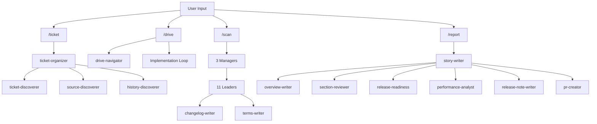
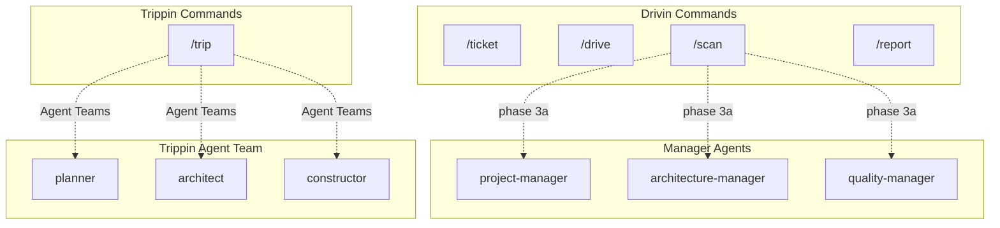

[English](component.md) | [Japanese](component_ja.md)

# Component Viewpoint

Component Viewpoint は、Workaholic marketplace の内部構造、モジュール境界、システムが plugin、command、agent、skill、rule にどのように分解されるかを説明します。Marketplace は現在 2 つの plugin を含んでいます：drivin（開発 workflow）は 4 command、28 agent、45 skill、6 rule で構成され、trippin（探索 workflow）は 1 command、3 agent、1 skill、0 rule で構成されています。

## モジュール境界

アーキテクチャは CLAUDE.md で定義された component ネスティングポリシーを通じて厳格な境界を強制します：

| 呼び出し元 | 呼び出し可能 | 呼び出し不可 |
| --- | --- | --- |
| Command | Skill, Subagent | -- |
| Subagent | Skill, Subagent | Command |
| Skill | Skill | Subagent, Command |

知識が上方に流れ（skill は agent と command によってロードされる）、制御が下方に流れる（command は agent を呼び出し、agent は skill を呼び出す）層状依存グラフを作成します。このポリシーは循環依存を防ぎ、知識層（skill）がオーケストレーション層（command と agent）から独立していることを保証します。

### Shell Script 境界

Shell script は常に skill 内にバンドルされ、agent や command の markdown ファイルにインラインで記述されることはありません。CLAUDE.md の Shell Script Principle は条件文、パイプとチェーン、テキスト処理、ループ、ロジック付き変数展開を含む複雑なインライン shell command を禁止しています。

### 設計原則：薄いオーケストレーション、包括的な知識

- **Command**: オーケストレーションのみ（〜50-100 行）。ワークフローステップの定義、subagent の呼び出し、ユーザーインタラクションのハンドリング。
- **Subagent**: オーケストレーションのみ（〜20-40 行）。入出力の定義、skill のプリロード、最小限の手続きロジック。
- **Skill**: 包括的な知識（〜50-150 行）。Template、ガイドライン、ルール、bash script を含む。

### Plugin の隔離

2 つの plugin（drivin と trippin）は厳格な隔離を維持します：

- 各 plugin は独自の `.claude-plugin/plugin.json`、command、agent、skill、rule ディレクトリを持つ
- Skill パスは plugin 固有（`~/.claude/plugins/marketplaces/workaholic/plugins/drivin/skills/` vs `~/.claude/plugins/marketplaces/workaholic/plugins/trippin/skills/`）
- Subagent type は plugin スコープの prefix を使用（`drivin:agent-name` vs `trippin:agent-name`）
- バージョンは両 plugin と marketplace で同期

## Component 階層

### Marketplace 層

| Plugin | 説明 | ソース | バージョン |
| --- | --- | --- | --- |
| `drivin` | コア開発 workflow | `./plugins/drivin` | 1.0.38 |
| `trippin` | AI 指向の探索と創造的開発 | `./plugins/trippin` | 1.0.38 |

### Drivin Plugin の Component

#### Command 層 (4)

| Command | ファイル | 説明 | 主要 Agent |
| --- | --- | --- | --- |
| `/ticket` | `commands/ticket.md` | コードベースを探索し実装 ticket を作成 | ticket-organizer |
| `/drive` | `commands/drive.md` | todo キューから ticket を一つずつ実装 | drive-navigator |
| `/scan` | `commands/scan.md` | 完全なドキュメントスキャン（3 manager + 13 agent） | 3 manager、11 leader、2 writer |
| `/report` | `commands/report.md` | story を生成し PR を作成/更新 | story-writer |

#### Command オーケストレーションフロー


```mermaid
flowchart TD
    User["User Input"] --> ticket["/ticket"]
    User --> drive["/drive"]
    User --> scan["/scan"]
    User --> report["/report"]

    ticket --> TO[ticket-organizer]
    TO --> TD[ticket-discoverer]
    TO --> SD[source-discoverer]
    TO --> HD[history-discoverer]

    drive --> DN[drive-navigator]
    drive --> Impl["Implementation Loop"]

    scan --> Managers[3 Managers]
    Managers --> Leaders[11 Leaders]
    Leaders --> CW[changelog-writer]
    Leaders --> TW[terms-writer]

    report --> SW[story-writer]
    SW --> OW[overview-writer]
    SW --> SR[section-reviewer]
    SW --> RA[release-readiness]
    SW --> PERF[performance-analyst]
    SW --> RNW[release-note-writer]
    SW --> PC[pr-creator]
```

#### Agent 層 (28)

##### Manager Tier (3)

Manager は leader が消費する戦略的コンテキストを確立します。

- `project-manager` -- プロジェクトコンテキスト（ビジネス、ステークホルダー、タイムライン、課題、ソリューション）を生成
- `architecture-manager` -- アーキテクチャコンテキストと 4 つの viewpoint spec（application、component、feature、usecase）を生成
- `quality-manager` -- 品質コンテキスト（基準、保証、メトリクス、フィードバックループ）を生成

##### Leader Tier (10)

Leader は manager の出力を消費し、専門的レンズを通じてコードベースを分析してドメイン固有のポリシードキュメントを生成します。

- `ux-lead` -- ux.md を生成（ユーザー体験、インタラクションパターン、ユーザージャーニー）
- `infra-lead` -- infrastructure.md を生成（依存関係、デプロイメント、ランタイム環境）
- `db-lead` -- data.md を生成（データフォーマット、ストレージ、永続化）
- `security-lead` -- security.md を生成（要件、脅威モデル、緩和策）
- `test-lead` -- test.md を生成（戦略、テストタイプ、カバレッジ）
- `quality-lead` -- quality.md を生成（基準、レビュープロセス、ゲート）
- `a11y-lead` -- accessibility.md を生成（基準、WCAG、インクルーシブデザイン）
- `observability-lead` -- observability.md を生成（ロギング、モニタリング、トレーシング）
- `delivery-lead` -- delivery.md を生成（リリースプロセス、デプロイメント、ロールバック）
- `recovery-lead` -- recovery.md を生成（バックアップ、災害復旧、事業継続）

##### Worker Tier: Ticket 管理 (3)

- `ticket-organizer` -- 並列 discovery を使って ticket 作成をオーケストレーション
- `ticket-discoverer` -- 重複検出のために既存 ticket を検索
- `drive-navigator` -- 実装のために ticket を優先順位付けし順序付け

##### Worker Tier: Report 生成 (7)

- `story-writer` -- story 生成と PR 作成をオーケストレーション
- `overview-writer` -- story の概要、ハイライト、動機、ジャーニーを準備
- `performance-analyst` -- 意思決定品質を評価
- `section-reviewer` -- story のセクション 5-8 をレビューし生成
- `pr-creator` -- `gh` CLI を使用して GitHub pull request を作成/更新
- `release-note-writer` -- story ファイルから簡潔なリリースノートを生成
- `release-readiness` -- リリース準備状況を評価

##### Worker Tier: Discovery (3)

- `source-discoverer` -- ticket のための関連ファイルを探索
- `history-discoverer` -- コンテキストのための関連履歴 ticket を検索
- `ticket-discoverer` -- 重複/マージ/分割の分析

##### Worker Tier: Documentation Writer (2)

- `changelog-writer` -- アーカイブされた ticket から CHANGELOG.md を更新
- `terms-writer` -- 用語定義を更新

#### Skill 層 (45)

Manager skill（3）、Leader skill（10）、Principle skill（2）、Analysis skill（3）、Ticket operation（6）、Git operation（4）、Documentation writing（8）、Workflow skill（3）、Quality skill（3）、Other skill（3）を含みます。詳細は [Component Viewpoint](component.md) の英語版を参照してください。

#### Rule 層 (6)

| Rule | パスパターン | 目的 |
| --- | --- | --- |
| `general.md` | `**/*` | Commit ポリシー、git ルール、見出し番号付け |
| `diagrams.md` | パス固有 | Mermaid ダイアグラム要件 |
| `i18n.md` | パス固有 | 国際化ポリシー |
| `shell.md` | `**/*.sh` | Shell スクリプト標準（POSIX sh、strict mode） |
| `typescript.md` | パス固有 | TypeScript 規約 |
| `workaholic.md` | パス固有 | Workaholic 固有のルール |

### Trippin Plugin の Component

#### Command 層 (1)

| Command | ファイル | 説明 | 主要メカニズム |
| --- | --- | --- | --- |
| `/trip` | `commands/trip.md` | 協働探索のための Agent Teams セッションを起動 | Agent Teams（3 メンバー） |

#### Agent 層 (3)

Trippin agent は Agent Teams セッションでピアとして動作します。

| Agent | スタンス | 哲学 | 責任 |
| --- | --- | --- | --- |
| `planner` | Progressive | Extrinsic Idealism | 創造的方向性、ステークホルダープロファイリング、説明責任 |
| `architect` | Neutral | Structural Idealism | 意味的一貫性、静的検証、アクセシビリティ |
| `constructor` | Conservative | Intrinsic Idealism | 持続可能な実装、インフラの信頼性、デリバリー調整 |

すべての agent が trip-protocol skill をプリロードし、opus model を使用します。

#### Skill 層 (1)

- `trip-protocol` -- Implosive Structure workflow を定義する包括的なプロトコル。3 つのバンドル script を含む：
  - `sh/ensure-worktree.sh` -- git 状態を検証し worktree を作成
  - `sh/init-trip.sh` -- trip ディレクトリを初期化
  - `sh/trip-commit.sh` -- `trip(<agent>): <step>` フォーマットの標準化された commit script

### Agent ネスティングパターン


```mermaid
flowchart TD
    subgraph "Drivin Commands"
        ticket["/ticket"]
        drive["/drive"]
        scan["/scan"]
        report["/report"]
    end

    subgraph "Trippin Commands"
        trip["/trip"]
    end

    subgraph "Manager Agents"
        PM[project-manager]
        AM[architecture-manager]
        QM[quality-manager]
    end

    subgraph "Trippin Agent Team"
        PL[planner]
        AR[architect]
        CO[constructor]
    end

    scan -.phase 3a.-> PM
    scan -.phase 3a.-> AM
    scan -.phase 3a.-> QM

    trip -.Agent Teams.-> PL
    trip -.Agent Teams.-> AR
    trip -.Agent Teams.-> CO
```

## 依存方向

### 層状アーキテクチャ

Drivin plugin は厳格な 5 層アーキテクチャに従います：

```
+-----------------------------------------+
|          Command 層                      |  ユーザー向けエントリーポイント
+-----------------------------------------+
|        Manager Agent 層                  |  戦略的コンテキスト
+-----------------------------------------+
|      Leader/Worker Agent 層              |  戦術的実行
+-----------------------------------------+
|           Skill 層                       |  知識と操作
+-----------------------------------------+
|           Rule 層                        |  グローバル制約
+-----------------------------------------+
```

Trippin plugin はよりフラットな構造に従います：

```
+-----------------------------------------+
|         Trip Command                     |  Worktree セットアップ + Team 起動
+-----------------------------------------+
|      Agent Team (3 peers)                |  Planner, Architect, Constructor
+-----------------------------------------+
|       trip-protocol Skill                |  プロトコル、スクリプト、artifact フォーマット
+-----------------------------------------+
```

## Component 数のサマリー

| カテゴリ | Drivin | Trippin | 合計 |
| --- | --- | --- | --- |
| Command | 4 | 1 | 5 |
| Agent | 28 | 3 | 31 |
| Skill | 45 | 1 | 46 |
| Rule | 6 | 0 | 6 |
| Shell Script | 21 | 3 | 24 |

## アーキテクチャの進化

### Core Plugin から Drivin への名称変更

`plugins/core` ディレクトリが `plugins/drivin` に名称変更され、すべての参照が更新されました。Plugin.json、marketplace.json、すべての `subagent_type: "core:*"` 参照（`drivin:*` に変更）、すべてのインストール済み plugin パス参照、CLAUDE.md に影響しました。

### Trippin Plugin の作成

2 番目の plugin が `/trip` command と 3 つの Agent Teams agent で追加されました。ピア協働と worktree 隔離に基づく根本的に異なるオーケストレーションモデルを導入し、marketplace がシングル plugin からマルチ plugin システムへ拡張されました。

### Drive 承認コンテキストの強制

Drive 承認フローが CRITICAL 強制で強化され、すべての承認プロンプトに ticket のタイトルと概要が必要になりました。3 回の改善反復を経て対処された再発する UX 課題です。

## Assumptions

- [Explicit] Drivin plugin の component 数（4 command、28 agent、45 skill、6 rule）はファイルシステムリストから導出されています。
- [Explicit] Trippin plugin の component 数（1 command、3 agent、1 skill、0 rule）はファイルシステムリストから導出されています。
- [Explicit] CLAUDE.md の "Architecture Policy > Component Nesting Rules" でネスティングポリシーテーブルが定義されています。
- [Explicit] Shell script は CLAUDE.md の Shell Script Principle で述べられている通り、常に skill にバンドルされます。
- [Explicit] Core plugin は drivin に名称変更され、ticket 20260302215035 に文書化されています。
- [Explicit] Trippin plugin は ticket 20260302215036 と 20260309214650 に文書化されている通り作成されました。
- [Explicit] Marketplace は同期されたバージョン（1.0.38）で 2 つの plugin を登録しています。
- [Inferred] Trippin plugin のフラットなアーキテクチャは、階層的委譲をピア協働に置き換える Agent Teams モデルを反映しています。
- [Inferred] Marketplace が 1 plugin から 2 plugin への拡張は、モジュラーで独立して進化する workflow plugin の設計哲学を示しています。
