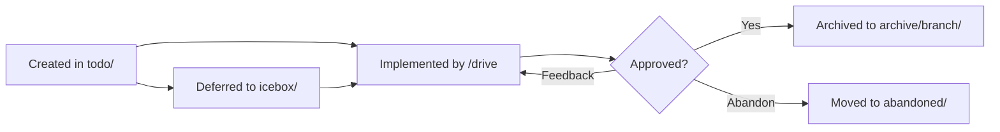

[English](data.md) | [Japanese](data_ja.md)

# 1. Data Viewpoint

The Data Viewpoint documents the data formats, frontmatter schemas, file naming conventions, and structural patterns used throughout the Workaholic system. All persistent data is stored as markdown files with YAML frontmatter or JSON configuration files, versioned in git.

## 2. Frontmatter Schemas

### 2-1. Ticket Frontmatter

```yaml
---
created_at: 2026-02-07T10:56:08+09:00    # ISO 8601 datetime
author: user@example.com                   # Git user email (never Anthropic email)
type: feature | fix | refactor | chore     # Change type
layer: command | agent | skill | rule | config | docs
effort: S | M | L                          # Estimated effort
category: Added | Changed | Removed        # Changelog category
commit_hash: abc1234                        # Short hash after implementation
---
```

Ticket frontmatter is validated by the PostToolUse hook (`validate-ticket.sh`) on every Write and Edit operation. The `author` field uses the git user email and explicitly rejects Anthropic email addresses.

### 2-2. Spec/Policy Frontmatter

```yaml
---
title: Document Title
description: Brief description
category: user | developer               # user = guides/, developer = specs/
modified_at: 2026-02-07T10:56:08+09:00   # ISO 8601 datetime
commit_hash: abc1234                       # Short commit hash
---
```

Specs and policies share the same frontmatter schema. The `category` field determines which directory the document belongs to: `user` maps to `guides/`, `developer` maps to `specs/` or `policies/`.

### 2-3. Terms Frontmatter

```yaml
---
title: Document Title
description: Brief description
category: developer
last_updated: 2026-02-07                  # Date only (not datetime)
commit_hash: abc1234
---
```

Terms files use `last_updated` (date format) rather than `modified_at` (datetime format). This is a known inconsistency documented in `.workaholic/terms/inconsistencies.md`.

### 2-4. Story Frontmatter

Stories include `started_at` and `ended_at` datetime fields to track the branch's development timeline, along with performance metrics.

### 2-5. Agent/Command Frontmatter

```yaml
---
name: agent-name
description: What this agent does
tools: Read, Write, Edit, Bash, Glob, Grep    # Available tools
skills:
  - skill-name-1
  - skill-name-2
---
```

Agent and command frontmatter declares the name, description, available tools, and preloaded skills.

## 3. JSON Configuration Files

### 3-1. Marketplace Manifest

`marketplace.json` at `.claude-plugin/marketplace.json` declares the marketplace name, version, owner, and list of plugins with their source directories.

### 3-2. Plugin Manifest

`plugin.json` at `plugins/core/.claude-plugin/plugin.json` declares the plugin name, version, description, and author.

### 3-3. Hooks Configuration

`hooks.json` at `plugins/core/hooks/hooks.json` defines PostToolUse hooks that run after Write or Edit operations.

### 3-4. Settings

`.claude/settings.json` and `.claude/settings.local.json` configure Claude Code behavior (the local settings file is git-ignored).

## 4. File Naming Conventions

| Context | Convention | Examples |
| --- | --- | --- |
| Tickets | `<timestamp>-<slug>.md` | `20260207035026-flatten-scan-writer-nesting.md` |
| Specs (viewpoints) | `<slug>.md` | `stakeholder.md`, `component.md` |
| Policies | `<slug>.md` | `test.md`, `security.md` |
| Terms | `<kebab-case>.md` | `core-concepts.md`, `workflow-terms.md` |
| Stories | `<branch-name>.md` | `drive-20260205-195920.md` |
| Translations | `<name>_ja.md` | `stakeholder_ja.md`, `README_ja.md` |
| Commands | `<name>.md` | `drive.md`, `ticket.md` |
| Agents | `<kebab-case>.md` | `drive-navigator.md`, `story-writer.md` |
| Skills | `SKILL.md` in `<kebab-case>/` | `write-spec/SKILL.md` |
| Shell scripts | `<name>.sh` in `sh/` | `gather.sh`, `validate.sh` |
| READMEs | `README.md` / `README_ja.md` | Uppercase exception |

## 5. Directory Naming Conventions

Ticket archive directories use the branch name: `.workaholic/tickets/archive/<branch-name>/`. Branch names follow the pattern `drive-<YYYYMMDD>-<HHMMSS>` or `trip-<YYYYMMDD>-<HHMMSS>`.

## 6. Data Lifecycle



## 7. Assumptions

- [Explicit] Ticket frontmatter fields and validation are documented in `create-ticket` skill and enforced by the hook.
- [Explicit] The `_at` suffix convention for datetime fields and `_ja` suffix for translations are documented in `CLAUDE.md` and the `translate` skill.
- [Explicit] Branch naming uses `drive-` or `trip-` prefixes, as documented in the standardize-branch-naming ticket.
- [Inferred] The inconsistency between `modified_at` (datetime) in specs and `last_updated` (date) in terms represents a historical artifact that has been noted but not resolved, based on the `inconsistencies.md` document.
- [Inferred] The timestamp-prefixed ticket naming convention ensures chronological ordering when listed alphabetically, which is important for the drive-navigator's prioritization.
