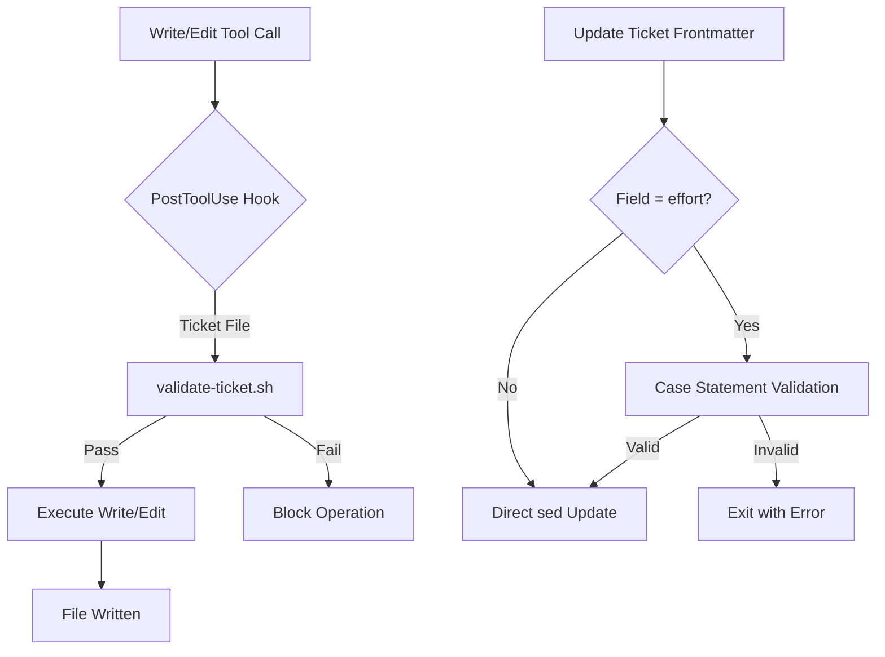
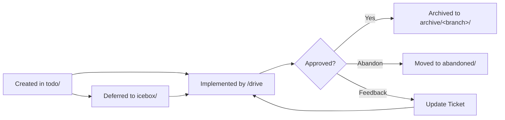
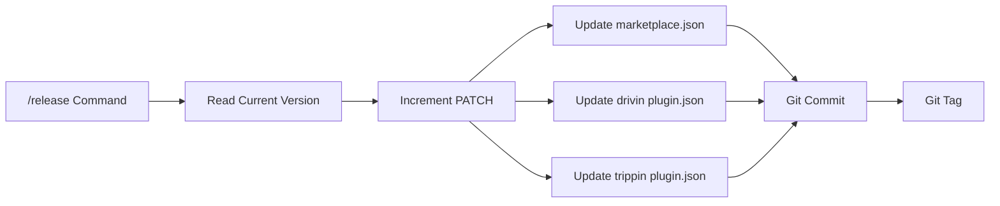
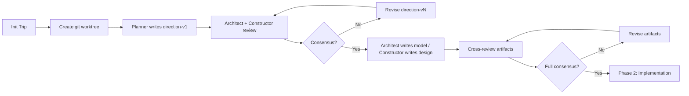

[English](data.md) | [Japanese](data_ja.md)

# Data Viewpoint

The Data Viewpoint documents the data formats, frontmatter schemas, file naming conventions, and validation rules used throughout the Workaholic system. All persistent data is stored as markdown files with YAML frontmatter or JSON configuration files, versioned in git. The system enforces data integrity through three validation mechanisms: PostToolUse hooks for runtime validation, shell script validation gates, and CI structural validation.

## Frontmatter Schemas

Frontmatter schemas define the metadata structure for each document type. All schemas use YAML format delimited by triple dashes (`---`) at the beginning of markdown files. Field validation occurs at both runtime (through hooks) and script execution time (through shell script validation gates).

### Ticket Frontmatter Schema

```yaml
---
created_at: 2026-02-08T13:17:51+09:00    # ISO 8601 datetime with timezone
author: user@example.com                   # Git user email (rejects @anthropic.com)
type: enhancement | bugfix | refactoring | housekeeping
layer: [UX, Domain, Infrastructure, DB, Config]  # YAML array, one or more values
effort: 0.1h | 0.25h | 0.5h | 1h | 2h | 4h       # Empty at creation, filled at archival
commit_hash: abc1234                              # Empty at creation, filled at archival
category: Added | Changed | Removed               # Empty at creation, filled at archival
---
```

Ticket frontmatter is validated by the PostToolUse hook (`validate-ticket.sh`) on every Write and Edit operation. The hook enforces:

- ISO 8601 datetime format with timezone for `created_at`
- Email format for `author` (explicit rejection of `@anthropic.com` addresses)
- Enumerated type values for `type`
- YAML array format for `layer` with enumerated valid values
- Optional fields (`effort`, `commit_hash`, `category`) that may be empty but must be present

The `update-ticket-frontmatter` skill provides a secondary validation gate when updating `effort` values, using a hardcoded allowlist to reject invalid values like t-shirt sizes (S, M, L).

### Frontmatter Schema Evolution


```mermaid
erDiagram
    TICKET {
        datetime created_at "ISO 8601 with timezone"
        string author "Email, not @anthropic.com"
        enum type "enhancement|bugfix|refactoring|housekeeping"
        array layer "UX|Domain|Infrastructure|DB|Config"
        enum effort "0.1h|0.25h|0.5h|1h|2h|4h"
        string commit_hash "7-40 hex chars"
        enum category "Added|Changed|Removed"
    }
    SPEC {
        string title
        string description
        enum category "user|developer"
        datetime modified_at "ISO 8601 with timezone"
        string commit_hash "7-40 hex chars"
    }
    POLICY {
        string title
        string description
        enum category "developer"
        datetime modified_at "ISO 8601 with timezone"
        string commit_hash "7-40 hex chars"
    }
    TERMS {
        string title
        string description
        enum category "developer"
        date last_updated "YYYY-MM-DD (not datetime)"
        string commit_hash "7-40 hex chars"
    }
    STORY {
        string branch
        datetime started_at "ISO 8601 with timezone"
        datetime ended_at "ISO 8601 with timezone"
        int tickets_completed
        int commits
        int duration_hours
        int duration_days
        float velocity
        string velocity_unit "hour|day"
    }
    AGENT {
        string name
        string description
        array tools "Read|Write|Edit|Bash|Glob|Grep"
        array skills "skill-directory-names"
    }
    SKILL {
        string name
        string description
        boolean user-invocable "true|false"
    }
```

### Spec/Policy Frontmatter Schema

```yaml
---
title: Document Title
description: Brief description
category: user | developer               # user = guides/, developer = specs/
modified_at: 2026-02-08T13:17:51+09:00   # ISO 8601 datetime with timezone
commit_hash: abc1234                      # Short commit hash (7 chars)
---
```

Specs and policies share the same frontmatter schema. The `category` field determines directory placement: `user` maps to `guides/`, `developer` maps to `specs/` or `policies/`. Both use `modified_at` with full datetime format (ISO 8601 with timezone).

### Terms Frontmatter Schema

```yaml
---
title: Document Title
description: Brief description
category: developer
last_updated: 2026-02-07                  # Date only (YYYY-MM-DD), not datetime
commit_hash: abc1234
---
```

Terms files use `last_updated` with date-only format (YYYY-MM-DD) rather than `modified_at` with datetime format. This is a known inconsistency documented in `.workaholic/terms/inconsistencies.md`.

### Story Frontmatter Schema

```yaml
---
branch: drive-20260205-195920
started_at: 2026-02-05T19:59:45+09:00
ended_at: 2026-02-07T17:59:34+09:00
tickets_completed: 17
commits: 40
duration_hours: 46
duration_days: 3
velocity: 0.87
velocity_unit: hour
---
```

Story frontmatter includes temporal tracking (`started_at`, `ended_at`) and performance metrics (ticket count, commit count, duration, velocity). The `velocity_unit` field allows for future extension to daily velocity calculation.

### Agent Frontmatter Schema

```yaml
---
name: agent-name
description: What this component does
tools: Read, Write, Edit, Bash, Glob, Grep    # Available tools (agents only)
skills:
  - skill-name-1
  - skill-name-2
---
```

Agent frontmatter declares name, description, available tools, and preloaded skills. The `skills` field uses YAML array format with skill directory names (e.g., `gather-git-context`). All agents include all six standard tools. The `tools` field is present in agent files but absent from command and skill files.

### Skill Frontmatter Schema

```yaml
---
name: skill-name
description: What this skill provides
user-invocable: false                     # true only for user-facing commands
---
```

Skill frontmatter includes a `user-invocable` boolean field that distinguishes between internal skills (false) and user-facing command skills (true). The field marks domain skills and cross-cutting principle skills as non-invocable, ensuring only commands can be invoked directly by users.

The four leading skills (`leading-validity`, `leading-availability`, `leading-security`, `leading-accessibility`) all set `user-invocable: false`. They are preloaded by commands and agents rather than triggered by users.

## JSON Configuration Schemas

JSON configuration files use flat structures without nested objects (except for the owner and author objects). All JSON files are validated for syntactic correctness by the CI pipeline.

### Marketplace Manifest Schema

Located at `.claude-plugin/marketplace.json`:

```json
{
  "name": "workaholic",
  "version": "1.0.38",
  "description": "Standard Claude Code Configuration in qmu",
  "owner": {
    "name": "tamurayoshiya",
    "email": "a@qmu.jp"
  },
  "plugins": [
    {
      "name": "drivin",
      "description": "Core development workflow: branch, commit, pull-request, ticket-driven development",
      "version": "1.0.38",
      "author": {
        "name": "tamurayoshiya",
        "email": "a@qmu.jp"
      },
      "source": "./plugins/drivin",
      "category": "development"
    },
    {
      "name": "trippin",
      "description": "AI-oriented exploration and creative development workflow",
      "version": "1.0.38",
      "author": {
        "name": "tamurayoshiya",
        "email": "a@qmu.jp"
      },
      "source": "./plugins/trippin",
      "category": "development"
    }
  ]
}
```

The marketplace manifest declares metadata, owner information, and the list of plugins. The marketplace currently contains two plugins: drivin (ticket-driven development) and trippin (AI-oriented exploration). The root `version` field must be kept in sync with all plugin manifest versions during releases.

### Plugin Manifest Schema

Each plugin has its own manifest at `plugins/<name>/.claude-plugin/plugin.json`. The version field must match the corresponding entry in `marketplace.json`.

**Drivin plugin** (`plugins/drivin/.claude-plugin/plugin.json`):

```json
{
  "name": "drivin",
  "description": "Core development workflow: branch, commit, pull-request, ticket-driven development",
  "version": "1.0.38",
  "author": {
    "name": "tamurayoshiya",
    "email": "a@qmu.jp"
  }
}
```

**Trippin plugin** (`plugins/trippin/.claude-plugin/plugin.json`):

```json
{
  "name": "trippin",
  "description": "AI-oriented exploration and creative development workflow",
  "version": "1.0.38",
  "author": {
    "name": "tamurayoshiya",
    "email": "a@qmu.jp"
  }
}
```

Version synchronization requires updating three files simultaneously: `marketplace.json` root version, `plugins/drivin/.claude-plugin/plugin.json` version, and `plugins/trippin/.claude-plugin/plugin.json` version.

### Hooks Configuration Schema

Located at `plugins/drivin/hooks/hooks.json`:

```json
{
  "description": "Ticket format and location validation",
  "hooks": {
    "PostToolUse": [
      {
        "matcher": "Write|Edit",
        "hooks": [
          {
            "type": "command",
            "command": "${CLAUDE_PLUGIN_ROOT}/hooks/validate-ticket.sh",
            "timeout": 10
          }
        ]
      }
    ]
  }
}
```

Hooks configuration defines PostToolUse validation that runs after Write or Edit operations. The `matcher` field uses regex syntax to specify which tools trigger the hook. The `timeout` field specifies maximum execution time in seconds.

### Settings Schema

Located at `.claude/settings.json` (versioned) and `.claude/settings.local.json` (git-ignored):

Settings files configure Claude Code behavior but have no explicit schema enforcement in this repository.

### Trip Artifact Schema

Trip artifacts are produced by the trippin plugin's Implosive Structure workflow. Artifacts are stored in `.workaholic/.trips/<trip-name>/` with versioned filenames.

```markdown
# <Artifact Type> v<N>

**Author**: <Agent Name>
**Status**: draft | under-review | approved
**Reviewed-by**: <comma-separated agent names>

## Content

<artifact content here>

## Review Notes

<feedback from reviewing agents, added during review>
```

Artifact types and storage locations:

| Artifact | Directory | Filename Pattern | Author |
| --- | --- | --- | --- |
| Direction | `directions/` | `direction-v1.md`, `direction-v2.md` | Planner |
| Model | `models/` | `model-v1.md`, `model-v2.md` | Architect |
| Design | `designs/` | `design-v1.md`, `design-v2.md` | Constructor |

Each revision creates a new file (e.g., `direction-v1.md`, `direction-v2.md`) rather than overwriting, preserving the full review history. The `Status` field transitions from `draft` to `under-review` to `approved` as the consensus gate progresses.

Trip commit messages follow the format `trip(<agent>): <step>` with the phase number in the commit body.

## File Naming Conventions

File naming follows context-specific conventions designed to enable chronological sorting, semantic clarity, and i18n support.

### Naming Convention Table

| Context | Convention | Pattern | Examples |
| --- | --- | --- | --- |
| Tickets | Timestamp-prefixed slug | `YYYYMMDDHHmmss-<slug>.md` | `20260208131751-migrate-scanner-into-scan-command.md` |
| Specs (viewpoints) | Slug only | `<slug>.md` | `stakeholder.md`, `component.md`, `data.md` |
| Policies | Slug only | `<slug>.md` | `test.md`, `security.md`, `quality.md` |
| Terms | Kebab-case descriptive | `<kebab-case>.md` | `core-concepts.md`, `file-conventions.md` |
| Stories | Branch name | `<branch-name>.md` | `drive-20260205-195920.md` |
| Translations | Base name + `_ja` suffix | `<name>_ja.md` | `stakeholder_ja.md`, `README_ja.md` |
| Trip artifacts | Type + version | `<type>-v<N>.md` | `direction-v1.md`, `model-v2.md`, `design-v1.md` |
| Commands | Name only | `<name>.md` | `drive.md`, `ticket.md`, `trip.md` |
| Agents | Kebab-case descriptive | `<kebab-case>.md` | `stakeholder-analyst.md`, `story-writer.md` |
| Skills | `SKILL.md` in kebab-case directory | `<kebab-case>/SKILL.md` | `write-spec/SKILL.md`, `create-ticket/SKILL.md` |
| Shell scripts | Name + `.sh` in `sh/` subdirectory | `sh/<name>.sh` | `gather.sh`, `validate.sh`, `update.sh` |
| READMEs | Uppercase (exception) | `README.md` / `README_ja.md` | Root and directory indexes |
| Schema rules | `define-<tier>.md` | `define-lead.md` | Schema enforcement rules in `.claude/rules/` |

### Timestamp Format for Tickets

Ticket filenames use a 14-digit timestamp prefix (`YYYYMMDDHHmmss`) that ensures chronological sorting when listed alphabetically. This format is generated by `date +%Y%m%d%H%M%S` and must match the filename component extracted from the ISO 8601 `created_at` field.

### Translation Suffix Convention

Translation files use the `_ja` suffix before the file extension for Japanese translations. This pattern applies consistently across all documentation types: specs, policies, terms, stories, and README files. Other language codes (`_zh`, `_ko`, `_de`, `_fr`, `_es`) are defined in the translate skill but not currently used.

### Directory Naming Conventions

Directory names use kebab-case for skills and hyphenated timestamps for branch-based archives:

- Skill directories: `gather-git-context/`, `write-spec/`, `create-ticket/`, `trip-protocol/`
- Archive directories: `.workaholic/tickets/archive/<branch-name>/`
- Trip artifact directories: `.workaholic/.trips/<trip-name>/directions/`, `models/`, `designs/`
- Worktree directories: `.worktrees/<trip-name>/`
- Branch name patterns: `drive-<YYYYMMDD>-<HHMMSS>` for drivin, `trip/<trip-name>` for trippin

## Data Validation Rules

Data validation occurs at three layers: runtime hooks, shell script gates, and CI structural checks.

### Runtime Hook Validation

The PostToolUse hook (`validate-ticket.sh`) runs on every Write or Edit operation with a 10-second timeout. It validates:

1. **Location**: Tickets must be in `todo/`, `icebox/`, or `archive/<branch>/`
2. **Filename format**: Must match `YYYYMMDDHHmmss-*.md` pattern
3. **Frontmatter presence**: File must start with `---`
4. **Required fields**: All 7 fields must be present (even if empty)
5. **Field formats**: Regex validation for `created_at`, `author`, `type`, `layer`, `effort`, `commit_hash`, `category`
6. **Email rejection**: Explicit rejection of `@anthropic.com` addresses in `author` field

Validation failures exit with code 2, blocking the Write or Edit operation.

### Shell Script Validation Gates

The `update-ticket-frontmatter` skill provides a second validation layer when modifying ticket fields:

```bash
# Validate effort values
if [ "$FIELD" = "effort" ]; then
    case "$VALUE" in
        0.1h|0.25h|0.5h|1h|2h|4h) ;; # valid
        *) echo "Error: effort must be one of: 0.1h, 0.25h, 0.5h, 1h, 2h, 4h"
           echo "Got: $VALUE"
           exit 1 ;;
    esac
fi
```

This gate catches invalid values (like t-shirt sizes S, M, L) that might bypass the hook through direct `sed` operations.

### Validation Execution Flow


```mermaid
flowchart TD
    Write["Write/Edit Tool Call"] --> Hook{PostToolUse Hook}
    Hook -->|Ticket File| ValidateTicket["validate-ticket.sh"]
    ValidateTicket -->|Pass| Execute["Execute Write/Edit"]
    ValidateTicket -->|Fail| Block["Block Operation"]
    Execute --> Success["File Written"]

    Update["Update Ticket Frontmatter"] --> ScriptGate{Field = effort?}
    ScriptGate -->|Yes| ValidateEffort["Case Statement Validation"]
    ScriptGate -->|No| DirectSed["Direct sed Update"]
    ValidateEffort -->|Valid| DirectSed
    ValidateEffort -->|Invalid| Error["Exit with Error"]

```

### CI Structural Validation

The `validate-plugins.yml` GitHub Action runs on every push and pull request to `main`:

1. Validates `marketplace.json` is valid JSON
2. Validates each `plugin.json` contains required fields (`name`, `version`)
3. Validates that skill files referenced by plugins exist
4. Validates that every plugin in `marketplace.json` has a corresponding directory

This provides structural integrity guarantees before code reaches production.

### Output Validation

The `validate-writer-output` skill (`validate.sh`) verifies that analyst subagent output exists and is non-empty before README index updates:

```bash
for file in "$@"; do
  path="$dir/$file"
  if [ ! -f "$path" ]; then
    status="missing"
    pass=false
  elif [ ! -s "$path" ]; then
    status="empty"
    pass=false
  else
    status="ok"
  fi
done
```

Documentation generation flows use this validation gate to prevent broken links in indexes.

## Data Lifecycle

Data artifacts move through defined lifecycle stages based on their type and development workflow state.

### Ticket Lifecycle


```mermaid
flowchart LR
    Create["Created in todo/"] --> Drive["Implemented by /drive"]
    Drive --> Approve{Approved?}
    Approve -->|Yes| Archive["Archived to archive/&lt;branch&gt;/"]
    Approve -->|Abandon| Abandoned["Moved to abandoned/"]
    Approve -->|Feedback| Update["Update Ticket"]
    Update --> Drive
    Create --> Icebox["Deferred to icebox/"]
    Icebox --> Drive
```

Tickets begin in `todo/`, move to `archive/<branch>/` after successful implementation, or move to `icebox/` for deferral. Abandoned tickets move to `abandoned/` with Failure Analysis appended.

### Documentation Lifecycle

The `.workaholic/specs/` directory contains hand-maintained reference documents updated alongside structural changes through the `/ticket` workflow. Earlier in the project, these documents were regenerated by an automated documentation command driven by an upstream context tier; that command and tier have been retired. Other documentation (CHANGELOG, terms, release notes, stories) is still produced by writer agents invoked from `/report` and `/release` workflows.

### Lead Policy Application

The four leading skills (`leading-validity`, `leading-availability`, `leading-security`, `leading-accessibility`) are not data-producing artifacts. They are policy lenses preloaded into work-plugin commands and orchestrators (`/drive`, `/ticket`, `/trip`, `ticket-organizer`, `planner`, `architect`, `constructor`) via the soft cross-plugin reference pattern. Each preload site reads the relevant lead at scoping, implementation, and trip-protocol time, applying the lead's Policies, Practices, and Standards to whatever layers the ticket touches (UX → leading-accessibility, Domain/DB → leading-validity, Infrastructure → leading-availability, anything touching authentication/secrets → leading-security). The leads themselves are flat markdown documents under `plugins/standards/skills/leading-*/SKILL.md` with `user-invocable: false` frontmatter; they have no producer-consumer relationship with other agents.

### Version Lifecycle


```mermaid
flowchart LR
    Release["/release Command"] --> Read["Read Current Version"]
    Read --> Increment["Increment PATCH"]
    Increment --> UpdateMarketplace["Update marketplace.json"]
    Increment --> UpdateDrivin["Update drivin plugin.json"]
    Increment --> UpdateTrippin["Update trippin plugin.json"]
    UpdateMarketplace --> Commit["Git Commit"]
    UpdateDrivin --> Commit
    UpdateTrippin --> Commit
    Commit --> Tag["Git Tag"]
```

Version numbers are synchronized across three files during release: `marketplace.json` (root version), `plugins/drivin/.claude-plugin/plugin.json`, and `plugins/trippin/.claude-plugin/plugin.json`. The `/release` command increments the patch version by default, updates all three files, commits, and creates a git tag.

### Trip Artifact Lifecycle


```mermaid
flowchart LR
    Init["Init Trip"] --> Worktree["Create git worktree"]
    Worktree --> Direction["Planner writes direction-v1"]
    Direction --> ReviewD["Architect + Constructor review"]
    ReviewD --> Revise{Consensus?}
    Revise -->|No| ReviseD["Revise direction-vN"]
    ReviseD --> ReviewD
    Revise -->|Yes| ModelDesign["Architect writes model / Constructor writes design"]
    ModelDesign --> CrossReview["Cross-review artifacts"]
    CrossReview --> Consensus{Full consensus?}
    Consensus -->|No| ReviseArt["Revise artifacts"]
    ReviseArt --> CrossReview
    Consensus -->|Yes| Implement["Phase 2: Implementation"]
```

Trip artifacts follow a versioned append-only pattern within `.workaholic/.trips/<trip-name>/`. Each revision creates a new numbered file rather than overwriting, ensuring the full collaborative review history is preserved as a sequence of committed versions. The git worktree isolates all trip work on a dedicated branch (`trip/<trip-name>`), keeping the main working tree clean.

## Naming Convention Relationships


```mermaid
flowchart TD
    KebabCase["kebab-case"] --> Skills["Skills: create-ticket/"]
    KebabCase --> Agents["Agents: stakeholder-analyst.md"]
    KebabCase --> Terms["Terms: core-concepts.md"]

    Timestamp["YYYYMMDDHHmmss"] --> TicketFilename["Ticket Filename"]
    TicketFilename --> SortOrder["Chronological Sorting"]

    Slug["Slug-only"] --> Specs["Specs: stakeholder.md"]
    Slug --> Policies["Policies: test.md"]

    Branch["Branch Name"] --> Archive["Archive Directory"]
    Archive --> TicketArchive["archive/drive-20260208-131649/"]
    Branch --> Story["Story File"]
    Story --> StoryFile["stories/drive-20260208-131649.md"]

    Versioned["Type + Version"] --> TripArtifacts["Trip Artifacts"]
    TripArtifacts --> DirectionFile["direction-v1.md"]
    TripArtifacts --> ModelFile["model-v1.md"]
    TripArtifacts --> DesignFile["design-v1.md"]

    Translation["_ja Suffix"] --> SpecTranslation["stakeholder_ja.md"]
    Translation --> PolicyTranslation["test_ja.md"]
    Translation --> READMETranslation["README_ja.md"]

    DefinePattern["define-<tier>.md"] --> DefineRules["Schema rules in .claude/rules/"]
    DefinePattern --> DefineLead["define-lead.md"]
```

## Lead Schema

The standards plugin's leading skills follow the schema defined in `.claude/rules/define-lead.md`.

| Field | Lead Skills | Lead Agent |
| --- | --- | --- |
| `name` | `leading-<speciality>` | `lead` (parameterized — domain passed via prompt) |
| `description` | Domain responsibility | Same |
| `user-invocable` | `false` (required) | N/A (agents don't have this) |
| `tools` | N/A (skills don't have this) | All 6 standard tools |
| `skills` | N/A | Preloads all four `leading-*` skills, plus `analyze-viewpoint` and `analyze-policy` |
| Schema file | `.claude/rules/define-lead.md` | Same schema as lead skill |

Lead skills follow a four-tier structure: Role (with Goal and Responsibility), Policies, Practices, and Standards.

## Assumptions

- [Explicit] Ticket frontmatter fields and validation are documented in `create-ticket` skill and enforced by `validate-ticket.sh` hook.
- [Explicit] The `_at` suffix convention for datetime fields (ISO 8601 with timezone) and `_ja` suffix for Japanese translations are documented in `CLAUDE.md` and the `translate` skill.
- [Explicit] Branch naming uses `drive-` or `trip-` prefixes with timestamp suffixes, as observed in archived ticket directories.
- [Explicit] The PostToolUse hook runs with a 10-second timeout on every Write and Edit operation, as configured in `hooks.json`.
- [Explicit] The `update-ticket-frontmatter` skill validates `effort` values using a hardcoded allowlist, as documented in the shell script validation fix (ticket `20260207170806-fix-effort-invalid-value-root-cause.md`).
- [Explicit] Version synchronization across `marketplace.json` and the three plugin `plugin.json` files (core, standards, work) is required during releases, as documented in `CLAUDE.md` version management section.
- [Explicit] The `user-invocable: false` field distinguishes internal skills from user-facing commands. All four leading skills set this field to false.
- [Explicit] The four leading skills (`leading-validity`, `leading-availability`, `leading-security`, `leading-accessibility`) are preloaded by work-plugin commands and orchestrators via the soft cross-plugin reference pattern.
- [Explicit] Schema enforcement for leads is defined in `.claude/rules/define-lead.md`.
- [Inferred] The inconsistency between `modified_at` (datetime) in specs and `last_updated` (date) in terms represents a historical artifact that has been noted but not resolved, based on the `inconsistencies.md` document.
- [Inferred] The timestamp-prefixed ticket naming convention ensures chronological ordering when listed alphabetically, which is important for the drive-navigator's prioritization logic.
- [Inferred] The dual validation approach (runtime hook + shell script gate) for effort values exists to catch invalid input both during interactive editing and during automated script updates.
- [Inferred] The `validate-writer-output` skill was introduced to prevent broken links in README indexes after discovering that analyst subagents could fail silently, based on the pattern observed in the scan architecture tickets.
- [Inferred] The `define-<tier>.md` naming pattern for schema rules in `.claude/rules/` follows the convention that schema enforcement rules are named after the tier they enforce (lead, manager).
- [Inferred] Roadmap and Decision Record artifact types currently have no defined frontmatter schema because the constraint-setting workflow is newly introduced and these artifact types have not yet been produced in practice.
