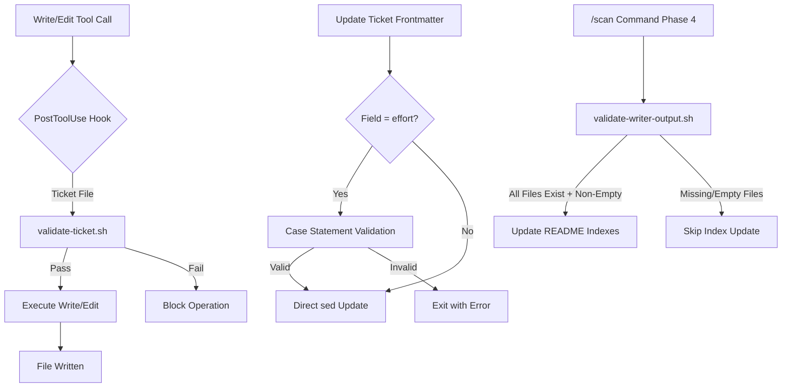
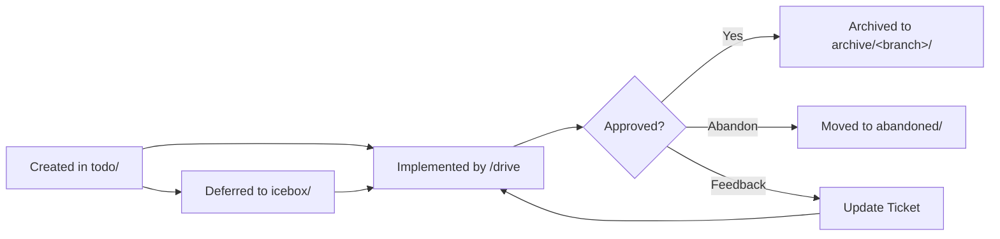
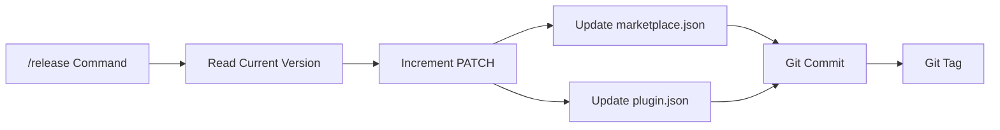

[English](data.md) | [Japanese](data_ja.md)

# Data Viewpoint

Data Viewpoint は、Workaholic system 全体で使用される data formats、frontmatter schemas、file naming conventions、validation rules を文書化します。すべての永続データは YAML frontmatter 付き markdown ファイルまたは JSON 設定ファイルとして保存され、git でバージョン管理されます。system は 3 つの validation 機構を通じて data integrity を強制します：runtime validation のための PostToolUse hooks、shell script validation gates、CI structural validation。

## Frontmatter Schemas

Frontmatter schemas は各 document type のメタデータ構造を定義します。すべての schemas は markdown ファイルの先頭でトリプルダッシュ（`---`）で区切られた YAML 形式を使用します。フィールド validation は runtime（hooks を通じて）と script 実行時（shell script validation gates を通じて）の両方で発生します。

### Ticket Frontmatter Schema

```yaml
---
created_at: 2026-02-08T13:17:51+09:00    # ISO 8601 datetime with timezone
author: user@example.com                   # Git user email（@anthropic.com を拒否）
type: enhancement | bugfix | refactoring | housekeeping
layer: [UX, Domain, Infrastructure, DB, Config]  # YAML array、1つ以上の値
effort: 0.1h | 0.25h | 0.5h | 1h | 2h | 4h       # 作成時は空、archival 時に入力
commit_hash: abc1234                              # 作成時は空、archival 時に入力
category: Added | Changed | Removed               # 作成時は空、archival 時に入力
---
```

Ticket frontmatter は PostToolUse hook（`validate-ticket.sh`）によって Write および Edit 操作のたびに検証されます。hook は以下を強制します：

- `created_at` の ISO 8601 datetime 形式（timezone 付き）
- `author` の email 形式（`@anthropic.com` アドレスの明示的拒否）
- `type` の列挙型値
- `layer` の YAML array 形式と列挙型の有効な値
- 空でもよいが存在しなければならない optional fields（`effort`、`commit_hash`、`category`）

`update-ticket-frontmatter` skill は `effort` 値を更新する際に二次的な validation gate を提供し、hardcoded allowlist を使用して t-shirt sizes（S、M、L）などの無効な値を拒否します。

### Frontmatter Schema Evolution

```mermaid
erDiagram
    TICKET {
        datetime created_at "ISO 8601 with timezone"
        string author "Email, not @anthropic.com"
        enum type "enhancement|bugfix|refactoring|housekeeping"
        array layer "UX|Domain|Infrastructure|DB|Config"
        enum effort "0.1h|0.25h|0.5h|1h|2h|4h"
        string commit_hash "7-40 hex chars"
        enum category "Added|Changed|Removed"
    }
    SPEC {
        string title
        string description
        enum category "user|developer"
        datetime modified_at "ISO 8601 with timezone"
        string commit_hash "7-40 hex chars"
    }
    POLICY {
        string title
        string description
        enum category "developer"
        datetime modified_at "ISO 8601 with timezone"
        string commit_hash "7-40 hex chars"
    }
    TERMS {
        string title
        string description
        enum category "developer"
        date last_updated "YYYY-MM-DD (not datetime)"
        string commit_hash "7-40 hex chars"
    }
    STORY {
        string branch
        datetime started_at "ISO 8601 with timezone"
        datetime ended_at "ISO 8601 with timezone"
        int tickets_completed
        int commits
        int duration_hours
        int duration_days
        float velocity
        string velocity_unit "hour|day"
    }
    AGENT {
        string name
        string description
        array tools "Read|Write|Edit|Bash|Glob|Grep"
        array skills "skill-directory-names"
    }
    SKILL {
        string name
        string description
        boolean user-invocable "true|false"
    }
```



### Spec/Policy Frontmatter Schema

```yaml
---
title: Document Title
description: Brief description
category: user | developer               # user = guides/、developer = specs/
modified_at: 2026-02-08T13:17:51+09:00   # ISO 8601 datetime with timezone
commit_hash: abc1234                      # Short commit hash（7 chars）
---
```

Specs と policies は同じ frontmatter schema を共有します。`category` フィールドは directory の配置を決定します：`user` は `guides/` に、`developer` は `specs/` または `policies/` にマップされます。両方とも full datetime 形式（timezone 付き ISO 8601）の `modified_at` を使用します。

### Terms Frontmatter Schema

```yaml
---
title: Document Title
description: Brief description
category: developer
last_updated: 2026-02-07                  # Date only（YYYY-MM-DD）、datetime ではない
commit_hash: abc1234
---
```

Terms files は datetime 形式の `modified_at` ではなく、date-only 形式（YYYY-MM-DD）の `last_updated` を使用します。これは `.workaholic/terms/inconsistencies.md` に文書化された既知の不整合です。

### Story Frontmatter Schema

```yaml
---
branch: drive-20260205-195920
started_at: 2026-02-05T19:59:45+09:00
ended_at: 2026-02-07T17:59:34+09:00
tickets_completed: 17
commits: 40
duration_hours: 46
duration_days: 3
velocity: 0.87
velocity_unit: hour
---
```

Story frontmatter は temporal tracking（`started_at`、`ended_at`）と performance metrics（ticket count、commit count、duration、velocity）を含みます。`velocity_unit` フィールドは将来的に daily velocity 計算への拡張を可能にします。

### Agent Frontmatter Schema

```yaml
---
name: agent-name
description: What this component does
tools: Read, Write, Edit, Bash, Glob, Grep    # Available tools（agents のみ）
skills:
  - skill-name-1
  - skill-name-2
---
```

Agent frontmatter は name、description、available tools、preloaded skills を宣言します。`skills` フィールドは skill directory 名（例：`gather-git-context`）で YAML array 形式を使用します。すべての agents は 6 つの標準 tools をすべて含みます。`tools` フィールドは agent files に存在しますが、command および skill files には存在しません。

### Skill Frontmatter Schema

```yaml
---
name: skill-name
description: What this skill provides
user-invocable: false                     # user-facing commands のみ true
---
```

Skill frontmatter には `user-invocable` boolean フィールドが含まれ、internal skills（false）と user-facing command skills（true）を区別します。このフィールドは manager tier の導入時に追加され、manager skills と lead skills を non-invocable としてマークし、commands のみがユーザーによって直接呼び出せるようにします。

Manager skills（manage-project、manage-architecture、manage-quality）と lead skills（lead-db、lead-security など）はすべて `user-invocable: false` を設定します。Cross-cutting policy skills（managers-policy、leaders-policy）も `user-invocable: false` を設定します。

## JSON Configuration Schemas

JSON 設定ファイルは owner および author objects を除き、nested objects のない flat structures を使用します。すべての JSON ファイルは CI pipeline によって syntactic correctness が検証されます。

### Marketplace Manifest Schema

`.claude-plugin/marketplace.json` に配置：

```json
{
  "name": "workaholic",
  "version": "1.0.33",
  "description": "Standard Claude Code Configuration in qmu",
  "owner": {
    "name": "tamurayoshiya",
    "email": "a@qmu.jp"
  },
  "plugins": [
    {
      "name": "core",
      "description": "Core development workflow: branch, commit, pull-request, ticket-driven development",
      "version": "1.0.33",
      "author": {
        "name": "tamurayoshiya",
        "email": "a@qmu.jp"
      },
      "source": "./plugins/core",
      "category": "development"
    }
  ]
}
```

Marketplace manifest は metadata、owner 情報、plugins のリストを宣言します。`version` フィールドは releases 中に plugin manifest versions と同期を保つ必要があります。

### Plugin Manifest Schema

`plugins/core/.claude-plugin/plugin.json` に配置：

```json
{
  "name": "core",
  "description": "Core development workflow: branch, commit, pull-request, ticket-driven development",
  "version": "1.0.33",
  "author": {
    "name": "tamurayoshiya",
    "email": "a@qmu.jp"
  }
}
```

各 plugin は name、description、version、author を宣言する独自の manifest を持ちます。この version フィールドは `marketplace.json` 内の対応するエントリと一致する必要があります。

### Hooks Configuration Schema

`plugins/core/hooks/hooks.json` に配置：

```json
{
  "description": "Ticket format and location validation",
  "hooks": {
    "PostToolUse": [
      {
        "matcher": "Write|Edit",
        "hooks": [
          {
            "type": "command",
            "command": "${CLAUDE_PLUGIN_ROOT}/hooks/validate-ticket.sh",
            "timeout": 10
          }
        ]
      }
    ]
  }
}
```

Hooks 設定は Write または Edit 操作後に実行される PostToolUse validation を定義します。`matcher` フィールドは regex syntax を使用して、どの tools が hook をトリガーするかを指定します。`timeout` フィールドは最大実行時間を秒単位で指定します。

### Settings Schema

`.claude/settings.json`（versioned）および `.claude/settings.local.json`（git-ignored）に配置：

Settings ファイルは Claude Code の動作を設定しますが、この repository には明示的な schema enforcement がありません。

## File Naming Conventions

File naming は chronological sorting、semantic clarity、i18n support を可能にするために設計された context-specific conventions に従います。

### Naming Convention Table

| Context | Convention | Pattern | Examples |
| --- | --- | --- | --- |
| Tickets | Timestamp-prefixed slug | `YYYYMMDDHHmmss-<slug>.md` | `20260208131751-migrate-scanner-into-scan-command.md` |
| Specs (viewpoints) | Slug only | `<slug>.md` | `stakeholder.md`, `component.md`, `data.md` |
| Policies | Slug only | `<slug>.md` | `test.md`, `security.md`, `quality.md` |
| Terms | Kebab-case descriptive | `<kebab-case>.md` | `core-concepts.md`, `file-conventions.md` |
| Stories | Branch name | `<branch-name>.md` | `drive-20260205-195920.md` |
| Translations | Base name + `_ja` suffix | `<name>_ja.md` | `stakeholder_ja.md`, `README_ja.md` |
| Commands | Name only | `<name>.md` | `drive.md`, `ticket.md`, `scan.md` |
| Agents | Kebab-case descriptive | `<kebab-case>.md` | `stakeholder-analyst.md`, `story-writer.md` |
| Skills | `SKILL.md` in kebab-case directory | `<kebab-case>/SKILL.md` | `write-spec/SKILL.md`, `create-ticket/SKILL.md` |
| Shell scripts | Name + `.sh` in `sh/` subdirectory | `sh/<name>.sh` | `gather.sh`, `validate.sh`, `update.sh` |
| READMEs | Uppercase (exception) | `README.md` / `README_ja.md` | Root and directory indexes |
| Schema rules | `define-<tier>.md` | `define-lead.md`, `define-manager.md` | `.claude/rules/` の schema enforcement rules |

### Timestamp Format for Tickets

Ticket filenames は alphabetically にリストされたときに chronological sorting を保証する 14 桁の timestamp prefix（`YYYYMMDDHHmmss`）を使用します。この形式は `date +%Y%m%d%H%M%S` によって生成され、ISO 8601 `created_at` フィールドから抽出される filename component と一致する必要があります。

### Translation Suffix Convention

Translation files は Japanese translations のために file extension の前に `_ja` suffix を使用します。この pattern はすべての documentation types（specs、policies、terms、stories、README files）に一貫して適用されます。他の language codes（`_zh`、`_ko`、`_de`、`_fr`、`_es`）は translate skill で定義されていますが、現在は使用されていません。

### Directory Naming Conventions

Directory names は skills に kebab-case を、branch-based archives に hyphenated timestamps を使用します：

- Skill directories: `gather-git-context/`、`write-spec/`、`create-ticket/`
- Archive directories: `.workaholic/tickets/archive/<branch-name>/`
- Branch name pattern: `drive-<YYYYMMDD>-<HHMMSS>` または `trip-<YYYYMMDD>-<HHMMSS>`

## Data Validation Rules

Data validation は 3 つの層で発生します：runtime hooks、shell script gates、CI structural checks。

### Runtime Hook Validation

PostToolUse hook（`validate-ticket.sh`）は Write または Edit 操作のたびに 10 秒の timeout で実行されます。検証内容：

1. **Location**: Tickets は `todo/`、`icebox/`、または `archive/<branch>/` に存在する必要がある
2. **Filename format**: `YYYYMMDDHHmmss-*.md` pattern と一致する必要がある
3. **Frontmatter presence**: File は `---` で始まる必要がある
4. **Required fields**: 7 つのフィールドすべてが存在する必要がある（空でも可）
5. **Field formats**: `created_at`、`author`、`type`、`layer`、`effort`、`commit_hash`、`category` の regex validation
6. **Email rejection**: `author` フィールドの `@anthropic.com` アドレスの明示的拒否

Validation 失敗時は code 2 で終了し、Write または Edit 操作をブロックします。

### Shell Script Validation Gates

`update-ticket-frontmatter` skill は ticket fields 変更時に第二の validation layer を提供します：

```bash
# Validate effort values
if [ "$FIELD" = "effort" ]; then
    case "$VALUE" in
        0.1h|0.25h|0.5h|1h|2h|4h) ;; # valid
        *) echo "Error: effort must be one of: 0.1h, 0.25h, 0.5h, 1h, 2h, 4h"
           echo "Got: $VALUE"
           exit 1 ;;
    esac
fi
```

この gate は直接の `sed` 操作を通じて hook をバイパスする可能性のある無効な値（t-shirt sizes S、M、L など）を捕捉します。

### Validation Execution Flow



### CI Structural Validation

`validate-plugins.yml` GitHub Action は `main` への push および pull request のたびに実行されます：

1. `marketplace.json` が valid JSON であることを検証
2. 各 `plugin.json` が required fields（`name`、`version`）を含むことを検証
3. Plugins によって参照される skill files が存在することを検証
4. `marketplace.json` 内のすべての plugin に対応する directory が存在することを検証

これにより code が production に到達する前に structural integrity が保証されます。

### Output Validation

`validate-writer-output` skill（`validate.sh`）は README index updates の前に analyst subagent output が存在し、空でないことを検証します：

```bash
for file in "$@"; do
  path="$dir/$file"
  if [ ! -f "$path" ]; then
    status="missing"
    pass=false
  elif [ ! -s "$path" ]; then
    status="empty"
    pass=false
  else
    status="ok"
  fi
done
```

Scan command は Phase 4 でこの validation gate を使用して、documentation indexes 内の broken links を防ぎます。

## Data Lifecycle

Data artifacts は type と development workflow state に基づいて定義された lifecycle stages を経ます。

### Ticket Lifecycle



Tickets は `todo/` で始まり、successful implementation 後に `archive/<branch>/` に移動するか、deferral のために `icebox/` に移動します。Abandoned tickets は Failure Analysis が追加されて `abandoned/` に移動します。

### Documentation Lifecycle

```mermaid
flowchart LR
    Scan["/scan Command"] --> Phase1["Phase 1: Manager Outputs"]
    Phase1 --> Managers["3 Manager Subagents"]
    Managers --> ManagerOutputs["Write manager outputs"]
    ManagerOutputs --> Phase2["Phase 2: Leader Outputs"]
    Phase2 --> Leaders["11 Leader Subagents"]
    Leaders --> LeaderOutputs["Write leader outputs"]
    LeaderOutputs --> Phase3["Phase 3: Terms + Changelog"]
    Phase3 --> Writers["terms-writer + changelog-writer"]
    Writers --> WriterOutputs["Write terms + changelog"]
    WriterOutputs --> Phase4["Phase 4: Validation"]
    Phase4 --> Validate["validate-writer-output"]
    Validate -->|Pass| UpdateIndexes["Update README indexes"]
    Validate -->|Fail| SkipIndexes["Skip index update"]
    UpdateIndexes --> Commit["Git Commit"]
    SkipIndexes --> Commit
```



Documentation は two-phase execution model を通じて `/scan` command によって再生成されます。Phase 1 は 3 つの manager subagents（project-manager、architecture-manager、quality-manager）を呼び出して、leaders が使用する strategic context outputs を生成します。Phase 2 は 11 の leader subagents を並列で呼び出し、各 leader は manager outputs を読んでから viewpoint specs と policy documents を生成します。Phase 3 は terms と changelog を生成します。Phase 4 はすべての outputs を検証し、README indexes を更新します。

### Version Lifecycle



Version numbers は release 中に `marketplace.json` と `plugin.json` 間で同期されます。`/release` command はデフォルトで patch version をインクリメントし、両方のファイルを更新し、commit して git tag を作成します。

## Naming Convention Relationships

```mermaid
flowchart TD
    KebabCase["kebab-case"] --> Skills["Skills: create-ticket/"]
    KebabCase --> Agents["Agents: stakeholder-analyst.md"]
    KebabCase --> Terms["Terms: core-concepts.md"]

    Timestamp["YYYYMMDDHHmmss"] --> TicketFilename["Ticket Filename"]
    TicketFilename --> SortOrder["Chronological Sorting"]

    Slug["Slug-only"] --> Specs["Specs: stakeholder.md"]
    Slug --> Policies["Policies: test.md"]

    Branch["Branch Name"] --> Archive["Archive Directory"]
    Archive --> TicketArchive["archive/drive-20260208-131649/"]
    Branch --> Story["Story File"]
    Story --> StoryFile["stories/drive-20260208-131649.md"]

    Translation["_ja Suffix"] --> SpecTranslation["stakeholder_ja.md"]
    Translation --> PolicyTranslation["test_ja.md"]
    Translation --> READMETranslation["README_ja.md"]

    DefinePattern["define-<tier>.md"] --> DefineRules[".claude/rules/ の schema rules"]
    DefinePattern --> DefineLead["define-lead.md"]
    DefinePattern --> DefineManager["define-manager.md"]
```



## Agent Tier Schema Differences

System は 2 つの agent tiers（manager と leader）を定義し、それぞれ異なる frontmatter schemas と directory conventions を持ちます。

### Manager vs Leader Schemas

| Field | Manager Skills | Lead Skills | Manager Agents | Lead Agents |
| --- | --- | --- | --- | --- |
| `name` | `manage-<domain>` | `<speciality>-lead` | `<domain>-manager` | `<speciality>-lead` |
| `description` | Strategic outputs + consuming leaders | Domain responsibility | Skill と同じ | Skill と同じ |
| `user-invocable` | `false`（必須） | `false`（必須） | N/A（agents にはない） | N/A |
| `tools` | N/A（skills にはない） | N/A | 6 つの標準 tools すべて | 6 つの標準 tools すべて |
| `skills` | N/A | N/A | `managers-policy` + domain skill をプリロード | `leaders-policy` + domain skill をプリロード |
| Schema file | `.claude/rules/define-manager.md` | `.claude/rules/define-lead.md` | Manager skill と同じ schema | Lead skill と同じ schema |

Manager skills は leader skills にない `## Outputs` section を必要とします。Outputs section は各 output artifact の consuming leaders を指定し、manager-to-leader の依存関係を確立します。

### Constraint Setting Workflow Data

Managers-policy で導入された constraint-setting workflow は 4 つの artifact types を生成し、それぞれ潜在的な frontmatter 要件を持ちます：

| Artifact Type | Path | Frontmatter Schema | Purpose |
| --- | --- | --- | --- |
| Policy | `.workaholic/policies/<name>.md` | 既存の policy schema と同じ | 従うべき rule |
| Guideline | `.workaholic/policies/<name>.md` または新しい path | Policy schema と同じ | Rationale 付きの推奨プラクティス |
| Roadmap | `.workaholic/<name>.md` または新しい directory | まだ定義されていない | Milestones 付きの sequenced plan |
| Decision Record | `.workaholic/<name>.md` または新しい directory | まだ定義されていない | Context と consequences 付きの captured decision |

Policy と Guideline artifacts は既存の policy frontmatter schema を再利用します。Roadmap と Decision Record artifacts はまだ定義された schema がなく、将来の tickets で新しい frontmatter conventions が必要になる可能性があります。

## Assumptions

- [Explicit] Ticket frontmatter fields と validation は `create-ticket` skill に文書化され、`validate-ticket.sh` hook によって強制されています。
- [Explicit] Datetime fields（timezone 付き ISO 8601）の `_at` suffix convention と Japanese translations の `_ja` suffix は `CLAUDE.md` と `translate` skill に文書化されています。
- [Explicit] Branch naming は archived ticket directories で観察されるように、`drive-` または `trip-` prefix と timestamp suffixes を使用します。
- [Explicit] PostToolUse hook は `hooks.json` で設定されているように、Write および Edit 操作のたびに 10 秒の timeout で実行されます。
- [Explicit] `update-ticket-frontmatter` skill は shell script validation fix（ticket `20260207170806-fix-effort-invalid-value-root-cause.md`）に文書化されているように、hardcoded allowlist を使用して `effort` 値を検証します。
- [Explicit] `marketplace.json` と `plugin.json` 間の version synchronization は `CLAUDE.md` の version management section に文書化されているように、releases 中に必要です。
- [Explicit] `user-invocable: false` field は internal skills と user-facing commands を区別するために導入されました。すべての manager skills と lead skills はこのフィールドを false に設定します。
- [Explicit] Manager tier は ticket `20260211170401-define-manager-tier-and-skills.md` に文書化されているように、3 つの新しい agent types（project-manager、architecture-manager、quality-manager）と対応する skills（manage-project、manage-architecture、manage-quality）を導入しました。
- [Explicit] Managers は leaders が使用する strategic outputs を生成します。Two-phase scan execution（Phase 1: managers、Phase 2: leaders）は ticket `20260211170402-wire-leaders-to-manager-outputs.md` に文書化されているように、この依存関係を強制します。
- [Explicit] Constraint-setting workflow（Analyze、Ask、Propose、Produce）は `managers-policy/SKILL.md` で定義され、すべての 3 つの manager skill の Execution sections で参照されています。
- [Explicit] Managers と leads の schema enforcement rules はそれぞれ `.claude/rules/define-manager.md` と `.claude/rules/define-lead.md` で定義されています。
- [Inferred] Specs の `modified_at`（datetime）と terms の `last_updated`（date）の間の不整合は、`inconsistencies.md` document に基づいて、noted されているが解決されていない historical artifact を表しています。
- [Inferred] Timestamp-prefixed ticket naming convention は alphabetically にリストされたときに chronological ordering を保証し、これは drive-navigator の prioritization logic にとって重要です。
- [Inferred] Effort values の dual validation approach（runtime hook + shell script gate）は、interactive editing と automated script updates の両方で invalid input を捕捉するために存在します。
- [Inferred] `validate-writer-output` skill は scan architecture tickets で観察される pattern に基づいて、analyst subagents が silently fail する可能性があることを発見した後、README indexes の broken links を防ぐために導入されました。
- [Inferred] `.claude/rules/` の schema rules の `define-<tier>.md` naming pattern は、schema enforcement rules が enforce する tier（lead、manager）にちなんで命名される convention に従います。
- [Inferred] Roadmap と Decision Record artifact types は constraint-setting workflow が新しく導入され、これらの artifact types がまだ実際に生成されていないため、現在定義された frontmatter schema がありません。
