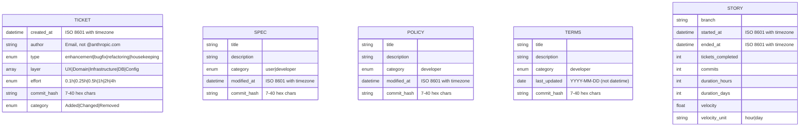
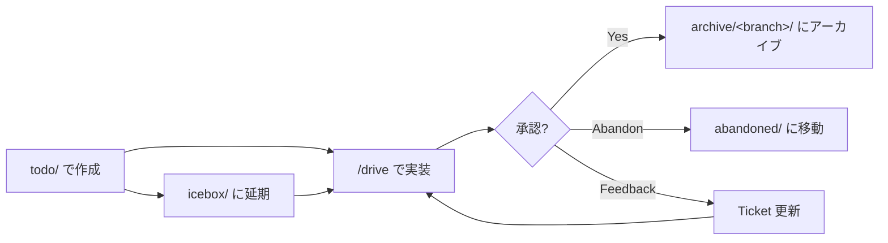
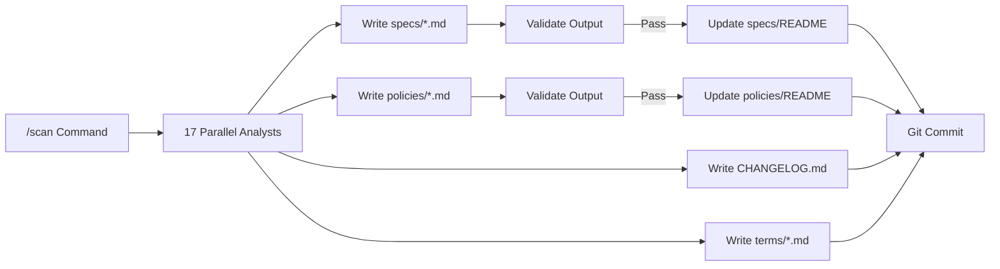
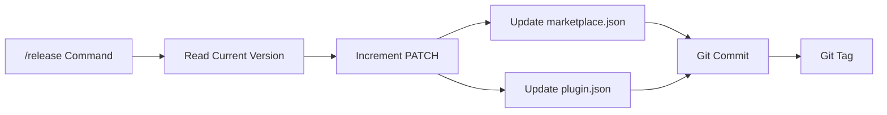
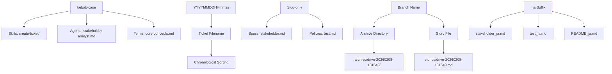

[English](data.md) | [Japanese](data_ja.md)

# Data Viewpoint

Data Viewpoint は、Workaholic system 全体で使用される data formats、frontmatter schemas、file naming conventions、validation rules を文書化します。すべての永続データは YAML frontmatter 付き markdown ファイルまたは JSON 設定ファイルとして保存され、git でバージョン管理されます。system は 3 つの validation 機構を通じて data integrity を強制します：runtime validation のための PostToolUse hooks、shell script validation gates、CI structural validation。

## Frontmatter Schemas

Frontmatter schemas は各 document type のメタデータ構造を定義します。すべての schemas は markdown ファイルの先頭でトリプルダッシュ（`---`）で区切られた YAML 形式を使用します。フィールド validation は runtime（hooks を通じて）と script 実行時（shell script validation gates を通じて）の両方で発生します。

### Ticket Frontmatter Schema

```yaml
---
created_at: 2026-02-08T13:17:51+09:00    # ISO 8601 datetime with timezone
author: user@example.com                   # Git user email（@anthropic.com を拒否）
type: enhancement | bugfix | refactoring | housekeeping
layer: [UX, Domain, Infrastructure, DB, Config]  # YAML array、1つ以上の値
effort: 0.1h | 0.25h | 0.5h | 1h | 2h | 4h       # 作成時は空、archival 時に入力
commit_hash: abc1234                              # 作成時は空、archival 時に入力
category: Added | Changed | Removed               # 作成時は空、archival 時に入力
---
```

Ticket frontmatter は PostToolUse hook（`validate-ticket.sh`）によって Write および Edit 操作のたびに検証されます。hook は以下を強制します：

- `created_at` の ISO 8601 datetime 形式（timezone 付き）
- `author` の email 形式（`@anthropic.com` アドレスの明示的拒否）
- `type` の列挙型値
- `layer` の YAML array 形式と列挙型の有効な値
- 空でもよいが存在しなければならない optional fields（`effort`、`commit_hash`、`category`）

`update-ticket-frontmatter` skill は `effort` 値を更新する際に二次的な validation gate を提供し、hardcoded allowlist を使用して t-shirt sizes（S、M、L）などの無効な値を拒否します。

### Frontmatter Schema Evolution



### Spec/Policy Frontmatter Schema

```yaml
---
title: Document Title
description: Brief description
category: user | developer               # user = guides/、developer = specs/
modified_at: 2026-02-08T13:17:51+09:00   # ISO 8601 datetime with timezone
commit_hash: abc1234                      # Short commit hash（7 chars）
---
```

Specs と policies は同じ frontmatter schema を共有します。`category` フィールドは directory の配置を決定します：`user` は `guides/` に、`developer` は `specs/` または `policies/` にマップされます。両方とも full datetime 形式（timezone 付き ISO 8601）の `modified_at` を使用します。

### Terms Frontmatter Schema

```yaml
---
title: Document Title
description: Brief description
category: developer
last_updated: 2026-02-07                  # Date only（YYYY-MM-DD）、datetime ではない
commit_hash: abc1234
---
```

Terms files は datetime 形式の `modified_at` ではなく、date-only 形式（YYYY-MM-DD）の `last_updated` を使用します。これは `.workaholic/terms/inconsistencies.md` に文書化された既知の不整合です。

### Story Frontmatter Schema

```yaml
---
branch: drive-20260205-195920
started_at: 2026-02-05T19:59:45+09:00
ended_at: 2026-02-07T17:59:34+09:00
tickets_completed: 17
commits: 40
duration_hours: 46
duration_days: 3
velocity: 0.87
velocity_unit: hour
---
```

Story frontmatter は temporal tracking（`started_at`、`ended_at`）と performance metrics（ticket count、commit count、duration、velocity）を含みます。`velocity_unit` フィールドは将来的に daily velocity 計算への拡張を可能にします。

### Command/Agent Frontmatter Schema

```yaml
---
name: agent-name
description: What this component does
tools: Read, Write, Edit, Bash, Glob, Grep    # Available tools（agents のみ）
skills:
  - skill-name-1
  - skill-name-2
---
```

Commands と agents は name、description、available tools（agents のみ）、preloaded skills を宣言します。`skills` フィールドは skill directory 名（例：`gather-git-context`）で YAML array 形式を使用します。

## JSON Configuration Schemas

JSON configuration files は nested objects なしで flat structures を使用します（owner および author objects を除く）。すべての JSON files は CI pipeline によって syntactic correctness が検証されます。

### Marketplace Manifest Schema

`.claude-plugin/marketplace.json` に配置：

```json
{
  "name": "workaholic",
  "version": "1.0.33",
  "description": "Standard Claude Code Configuration in qmu",
  "owner": {
    "name": "tamurayoshiya",
    "email": "a@qmu.jp"
  },
  "plugins": [
    {
      "name": "core",
      "description": "Core development workflow: branch, commit, pull-request, ticket-driven development",
      "version": "1.0.33",
      "author": {
        "name": "tamurayoshiya",
        "email": "a@qmu.jp"
      },
      "source": "./plugins/core",
      "category": "development"
    }
  ]
}
```

Marketplace manifest は metadata、owner 情報、plugins のリストを宣言します。`version` フィールドは releases 時に plugin manifest versions と同期を保つ必要があります。

### Plugin Manifest Schema

`plugins/core/.claude-plugin/plugin.json` に配置：

```json
{
  "name": "core",
  "description": "Core development workflow: branch, commit, pull-request, ticket-driven development",
  "version": "1.0.33",
  "author": {
    "name": "tamurayoshiya",
    "email": "a@qmu.jp"
  }
}
```

各 plugin は name、description、version、author を宣言する独自の manifest を持ちます。ここの version フィールドは `marketplace.json` の対応するエントリと一致する必要があります。

### Hooks Configuration Schema

`plugins/core/hooks/hooks.json` に配置：

```json
{
  "description": "Ticket format and location validation",
  "hooks": {
    "PostToolUse": [
      {
        "matcher": "Write|Edit",
        "hooks": [
          {
            "type": "command",
            "command": "${CLAUDE_PLUGIN_ROOT}/hooks/validate-ticket.sh",
            "timeout": 10
          }
        ]
      }
    ]
  }
}
```

Hooks configuration は Write または Edit 操作後に実行される PostToolUse validation を定義します。`matcher` フィールドは hook をトリガーする tools を指定するために regex syntax を使用します。`timeout` フィールドは最大実行時間を秒単位で指定します。

### Settings Schema

`.claude/settings.json`（バージョン管理）と `.claude/settings.local.json`（git-ignored）に配置：

Settings files は Claude Code の動作を設定しますが、この repository には明示的な schema enforcement がありません。

## File Naming Conventions

File naming は chronological sorting、semantic clarity、i18n support を可能にするように設計された context-specific conventions に従います。

### Naming Convention Table

| Context | Convention | Pattern | Examples |
| --- | --- | --- | --- |
| Tickets | Timestamp-prefixed slug | `YYYYMMDDHHmmss-<slug>.md` | `20260208131751-migrate-scanner-into-scan-command.md` |
| Specs（viewpoints） | Slug only | `<slug>.md` | `stakeholder.md`、`component.md`、`data.md` |
| Policies | Slug only | `<slug>.md` | `test.md`、`security.md`、`quality.md` |
| Terms | Kebab-case descriptive | `<kebab-case>.md` | `core-concepts.md`、`file-conventions.md` |
| Stories | Branch name | `<branch-name>.md` | `drive-20260205-195920.md` |
| 翻訳 | Base name + `_ja` suffix | `<name>_ja.md` | `stakeholder_ja.md`、`README_ja.md` |
| Commands | Name only | `<name>.md` | `drive.md`、`ticket.md`、`scan.md` |
| Agents | Kebab-case descriptive | `<kebab-case>.md` | `stakeholder-analyst.md`、`story-writer.md` |
| Skills | `SKILL.md` in kebab-case directory | `<kebab-case>/SKILL.md` | `write-spec/SKILL.md`、`create-ticket/SKILL.md` |
| Shell scripts | Name + `.sh` in `sh/` subdirectory | `sh/<name>.sh` | `gather.sh`、`validate.sh`、`update.sh` |
| READMEs | Uppercase（例外） | `README.md` / `README_ja.md` | Root および directory indexes |

### Timestamp Format for Tickets

Ticket filenames は 14 桁の timestamp prefix（`YYYYMMDDHHmmss`）を使用し、アルファベット順にリストしたときの chronological sorting を保証します。この形式は `date +%Y%m%d%H%M%S` によって生成され、ISO 8601 `created_at` フィールドから抽出された filename component と一致する必要があります。

### Translation Suffix Convention

Translation files は Japanese translations のために file extension の前に `_ja` suffix を使用します。このパターンはすべての documentation types（specs、policies、terms、stories、README files）に一貫して適用されます。他の language codes（`_zh`、`_ko`、`_de`、`_fr`、`_es`）は translate skill で定義されていますが、現在は使用されていません。

### Directory Naming Conventions

Directory names は skills には kebab-case を、branch-based archives には hyphenated timestamps を使用します：

- Skill directories：`gather-git-context/`、`write-spec/`、`create-ticket/`
- Archive directories：`.workaholic/tickets/archive/<branch-name>/`
- Branch name pattern：`drive-<YYYYMMDD>-<HHMMSS>` または `trip-<YYYYMMDD>-<HHMMSS>`

## Data Validation Rules

Data validation は 3 つの層で発生します：runtime hooks、shell script gates、CI structural checks。

### Runtime Hook Validation

PostToolUse hook（`validate-ticket.sh`）は Write または Edit 操作のたびに 10 秒の timeout で実行されます。以下を検証します：

1. **Location**：Tickets は `todo/`、`icebox/`、または `archive/<branch>/` になければなりません
2. **Filename format**：`YYYYMMDDHHmmss-*.md` pattern に一致する必要があります
3. **Frontmatter presence**：ファイルは `---` で始まる必要があります
4. **Required fields**：すべての 7 フィールドが存在する必要があります（空でも）
5. **Field formats**：`created_at`、`author`、`type`、`layer`、`effort`、`commit_hash`、`category` の regex validation
6. **Email rejection**：`author` フィールドの `@anthropic.com` アドレスの明示的拒否

Validation failures は code 2 で exit し、Write または Edit 操作をブロックします。

### Shell Script Validation Gates

`update-ticket-frontmatter` skill は ticket fields を変更する際に二次的な validation layer を提供します：

```bash
# Validate effort values
if [ "$FIELD" = "effort" ]; then
    case "$VALUE" in
        0.1h|0.25h|0.5h|1h|2h|4h) ;; # valid
        *) echo "Error: effort must be one of: 0.1h, 0.25h, 0.5h, 1h, 2h, 4h"
           echo "Got: $VALUE"
           exit 1 ;;
    esac
fi
```

この gate は直接的な `sed` 操作を通じて hook をバイパスする可能性のある無効な値（t-shirt sizes S、M、L など）をキャッチします。

### Validation Execution Flow


### CI Structural Validation

`validate-plugins.yml` GitHub Action は `main` へのすべての push と pull request で実行されます：

1. `marketplace.json` が有効な JSON であることを検証
2. 各 `plugin.json` が必須フィールド（`name`、`version`）を含むことを検証
3. plugins によって参照される skill files が存在することを検証
4. `marketplace.json` のすべての plugin に対応する directory が存在することを検証

これにより、code が production に到達する前に structural integrity の保証が提供されます。

### Output Validation

`validate-writer-output` skill（`validate.sh`）は README index updates の前に analyst subagent output が存在し、空でないことを確認します：

```bash
for file in "$@"; do
  path="$dir/$file"
  if [ ! -f "$path" ]; then
    status="missing"
    pass=false
  elif [ ! -s "$path" ]; then
    status="empty"
    pass=false
  else
    status="ok"
  fi
done
```

Scan command はこの validation gate を Phase 4 で使用して、documentation indexes の壊れたリンクを防ぎます。

## Data Lifecycle

Data artifacts は type と development workflow state に基づいて定義された lifecycle stages を通じて移動します。

### Ticket Lifecycle



Tickets は `todo/` で開始し、成功した実装後に `archive/<branch>/` に移動するか、延期のために `icebox/` に移動します。Abandoned tickets は Failure Analysis を追加して `abandoned/` に移動します。

### Documentation Lifecycle



Documentation は `/scan` command によって 17 の parallel analyst subagents を通じて再生成され、existence と non-emptiness が検証され、updated index files とともに commit されます。

### Version Lifecycle



Version numbers は release 時に `marketplace.json` と `plugin.json` 間で同期されます。`/release` command は default で patch version を increment し、両方のファイルを更新し、commit して git tag を作成します。

## Naming Convention Relationships



## Assumptions

- [Explicit] Ticket frontmatter fields と validation は `create-ticket` skill に文書化され、`validate-ticket.sh` hook によって強制されます。
- [Explicit] Datetime fields の `_at` suffix 規約と Japanese translations の `_ja` suffix は `CLAUDE.md` と `translate` skill に文書化されています。
- [Explicit] Branch naming は archived ticket directories で観察されるように、`drive-` または `trip-` prefixes を timestamp suffixes と共に使用します。
- [Explicit] PostToolUse hook は `hooks.json` で設定されているように、すべての Write および Edit 操作で 10 秒の timeout で実行されます。
- [Explicit] `update-ticket-frontmatter` skill は shell script validation fix（ticket `20260207170806-fix-effort-invalid-value-root-cause.md`）に文書化されているように、hardcoded allowlist を使用して `effort` 値を検証します。
- [Explicit] Releases 時の `marketplace.json` と `plugin.json` 間の version synchronization は `CLAUDE.md` version management section に文書化されているように必須です。
- [Inferred] Specs の `modified_at`（datetime）と terms の `last_updated`（date）の不整合は、`inconsistencies.md` document に基づいて注目されているが解決されていない歴史的な成果物を表しています。
- [Inferred] Timestamp-prefixed ticket naming convention は、アルファベット順にリストしたときの chronological ordering を保証し、drive-navigator の優先順位付けロジックに重要です。
- [Inferred] Effort values の dual validation approach（runtime hook + shell script gate）は、interactive editing と automated script updates の両方で無効な input をキャッチするために存在します。
- [Inferred] `validate-writer-output` skill は、scan architecture tickets で観察されたパターンに基づいて、analyst subagents が黙って失敗する可能性があることを発見した後、README indexes の壊れたリンクを防ぐために導入されました。
