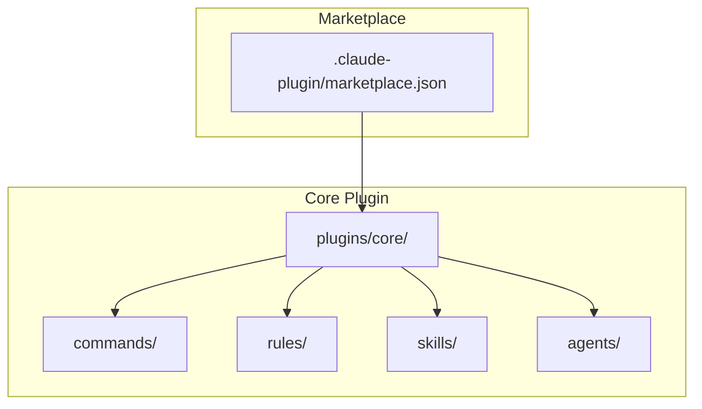
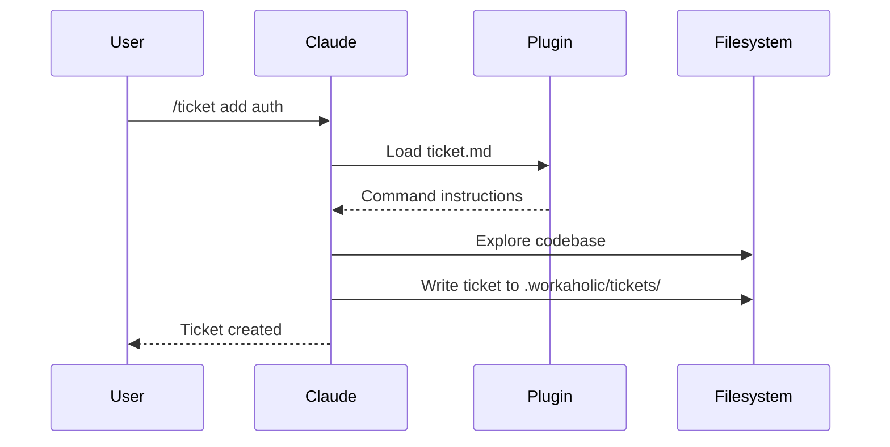

[English](architecture.md) | [日本語](architecture_ja.md)

# Architecture

Workaholic is a Claude Code plugin marketplace. It contains no runtime code; plugins are markdown files with JSON metadata that Claude Code interprets as commands, rules, skills, and agents.

## Marketplace Structure



## Directory Layout

```
.claude-plugin/
  marketplace.json       # Marketplace metadata and plugin list

plugins/
  core/
    .claude-plugin/
      plugin.json        # Plugin metadata
    agents/
      changelog-writer.md     # Updates CHANGELOG.md from tickets
      performance-analyst.md  # Decision review for PR stories
      pr-creator.md           # Creates/updates GitHub PRs
      spec-writer.md          # Updates .workaholic/specs/
      story-writer.md         # Generates branch stories for PRs
      terms-writer.md   # Updates .workaholic/terms/
    commands/
      branch.md          # /branch command
      commit.md          # /commit command
      drive.md           # /drive command
      pull-request.md    # /pull-request command
      ticket.md          # /ticket command
    rules/
      diagrams.md      # Mermaid diagram requirements
      general.md       # Git workflow rules
      i18n.md          # Multi-language documentation rules
      typescript.md    # TypeScript coding standards
    skills/
      archive-ticket/
        SKILL.md
        scripts/
          archive.sh   # Shell script for commit workflow
      translate/
        SKILL.md       # Translation policies for i18n
```

## Plugin Types

### Commands

Commands are user-invocable via slash syntax (`/commit`, `/ticket`). Each command is a markdown file with YAML frontmatter defining the name and description, followed by instructions that Claude follows when the command is invoked.

### Rules

Rules are always-on guidelines that Claude follows throughout the conversation. They define coding standards, documentation requirements, and best practices.

### Skills

Skills are complex capabilities that may include scripts or multiple files. They are invoked via the Skill tool and provide inline instructions. The core plugin includes:

- **archive-ticket**: Shell script that handles the complete commit workflow (archive ticket, update ticket frontmatter with commit hash/category, commit)
- **translate**: Translation policies for converting English markdown files to other languages (primarily Japanese)

### Agents

Agents are specialized subagents that can be spawned to handle complex tasks. They run in a subprocess with specific prompts and tools, preserving the main conversation's context window for interactive work. The core plugin includes:

- **changelog-writer**: Updates root `CHANGELOG.md` with entries from archived tickets, grouped by category (Added, Changed, Removed)
- **performance-analyst**: Evaluates decision-making quality across five viewpoints (Consistency, Intuitivity, Describability, Agility, Density) for PR stories
- **pr-creator**: Creates or updates GitHub pull requests using the story file as PR body, handling title derivation and `gh` CLI operations
- **spec-writer**: Updates `.workaholic/specs/` documentation to reflect current codebase state
- **story-writer**: Generates branch stories in `.workaholic/stories/` that serve as the single source of truth for PR content, including performance metrics and decision review
- **terms-writer**: Updates `.workaholic/terms/` to maintain consistent term definitions

## How Claude Code Loads Plugins

When a user installs the marketplace with `/plugin marketplace add qmu/workaholic`, Claude Code:

1. Reads `.claude-plugin/marketplace.json` to find available plugins
2. For each plugin, reads `plugins/<name>/.claude-plugin/plugin.json`
3. Loads commands, rules, and skills from the plugin directories
4. Makes commands available as slash commands in the conversation

## Data Flow



## Documentation Enforcement

Workaholic enforces comprehensive documentation through a parallel subagent architecture. The `/pull-request` command orchestrates four documentation agents that run concurrently, each handling a specific domain.

### How It Works

```mermaid
flowchart TD
    A[/pull-request command] --> B[Move remaining tickets to icebox]
    B --> C[Invoke 4 subagents in parallel]

    subgraph Parallel Documentation
        D[changelog-writer]
        E[story-writer]
        F[spec-writer]
        G[terms-writer]
    end

    C --> D
    C --> E
    C --> F
    C --> G

    D --> H[CHANGELOG.md]
    E --> I[.workaholic/stories/]
    F --> J[.workaholic/specs/]
    G --> K[.workaholic/terms/]

    H --> L[Commit docs]
    I --> L
    J --> L
    K --> L

    L --> M[pr-creator subagent]
    M --> N[Create/update PR]
```

Documentation is updated automatically during the `/pull-request` workflow.

The subagent architecture provides several benefits:

1. **Parallel execution** - All four agents run simultaneously, reducing wait time
2. **Context isolation** - Each agent works in its own context window, preserving the main conversation
3. **Single responsibility** - Each agent handles one documentation domain
4. **Resilient to failures** - If one agent fails, others can still complete

### Critical Requirements

All documentation agents enforce strict requirements:

- **Document every change** - No exceptions, no judgment calls about what's "worth" documenting
- **Never skip documentation** - "Internal implementation detail" is never a valid reason
- **Always report updates** - Must specify which files were created or modified
- **"No updates needed" is unacceptable** - Every change affects documentation somehow

### Design Policy

Documentation is mandatory, not optional. This reflects Workaholic's core principle of **cognitive investment**: developer cognitive load is the primary bottleneck in software productivity, so we invest heavily in generating structured knowledge artifacts to reduce this load.

The three primary artifact types are:

- **Tickets** - Change requests with structured metadata (date, author, type, layer, effort, commit_hash, category)
- **Specs** - Current state snapshots serving as reference documentation
- **Stories** - Narrative accounts of the developer journey per branch

Tickets serve as the single source of truth for change metadata. The root `CHANGELOG.md` is generated from archived tickets during PR creation.

## Version Management

Versions are tracked in two places:

- **Marketplace version**: `.claude-plugin/marketplace.json` - bumped with `/release`
- **Plugin versions**: `plugins/<name>/.claude-plugin/plugin.json` - updated when plugin changes

Keep these in sync when releasing.
