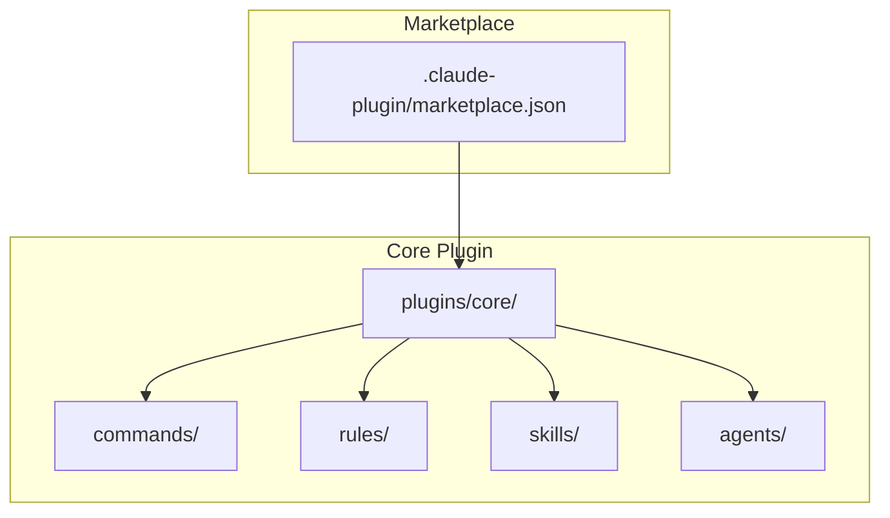
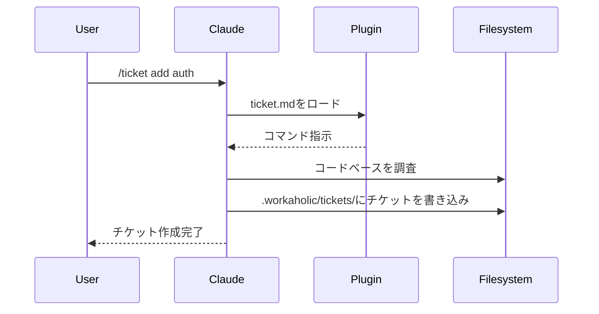

[English](architecture.md) | [日本語](architecture_ja.md)

# アーキテクチャ

WorkaholicはClaude Codeプラグインマーケットプレイスです。ランタイムコードを含まず、プラグインはClaude Codeがコマンド、ルール、スキル、エージェントとして解釈するJSONメタデータを持つマークダウンファイルです。

## マーケットプレイス構造



## ディレクトリレイアウト

```
.claude-plugin/
  marketplace.json       # マーケットプレイスのメタデータとプラグインリスト

plugins/
  core/
    .claude-plugin/
      plugin.json        # プラグインメタデータ
    agents/
      changelog-writer.md     # チケットからCHANGELOG.mdを更新
      performance-analyst.md  # PRストーリーの意思決定レビュー
      pr-creator.md           # GitHub PRの作成/更新
      spec-writer.md          # .workaholic/specs/を更新
      story-writer.md         # PR用のブランチストーリーを生成
      terms-writer.md         # .workaholic/terms/を更新
    commands/
      branch.md          # /branch コマンド
      drive.md           # /drive コマンド
      report.md          # /report コマンド
      ticket.md          # /ticket コマンド
    rules/
      diagrams.md      # Mermaid図表要件
      general.md       # Gitワークフロールール
      i18n.md          # 多言語ドキュメントルール
      typescript.md    # TypeScriptコーディング規約
    skills/
      archive-ticket/
        SKILL.md
        scripts/
          archive.sh       # コミットワークフロー用シェルスクリプト
      changelog/
        SKILL.md
        scripts/
          generate.sh      # チケットからchangelogエントリを生成
      command-prohibition/
        SKILL.md           # settings.json denyルールのドキュメント
      pr-ops/
        SKILL.md
        scripts/
          create-or-update.sh  # GitHub PRの作成/更新
      spec-context/
        SKILL.md
        scripts/
          gather.sh        # スペック更新用のコンテキスト収集
      story-metrics/
        SKILL.md
        scripts/
          calculate.sh     # パフォーマンスメトリクス計算
      translate/
        SKILL.md           # i18n用翻訳ポリシー
```

## プラグインタイプ

### コマンド

コマンドはスラッシュ構文（`/ticket`、`/drive`、`/report`）でユーザーが呼び出せます。各コマンドは名前と説明を定義するYAMLフロントマター付きのマークダウンファイルで、その後にコマンドが呼び出されたときにClaudeが従う指示が続きます。

### ルール

ルールは会話中ずっとClaudeが従う常時オンのガイドラインです。コーディング規約、ドキュメント要件、ベストプラクティスを定義します。

### スキル

スキルはスクリプトや複数のファイルを含む可能性のある複雑な機能です。Skillツールで呼び出され、インライン指示を提供します。多くのスキルには機械的な操作を処理するbashスクリプトが含まれ、エージェントは意思決定を担当します。coreプラグインには以下が含まれます：

- **archive-ticket**: 完全なコミットワークフロー（チケットのアーカイブ、フロントマターにコミットハッシュ/カテゴリを更新、コミット）を処理
- **changelog**: アーカイブされたチケットからchangelogエントリを生成、カテゴリ別にグループ化
- **command-prohibition**: settings.json denyルールを使用して危険なコマンドをブロックする方法をドキュメント化
- **pr-ops**: gh CLIを使用してGitHub PRを作成/更新
- **spec-context**: ドキュメント更新用のコンテキスト（ブランチ、チケット、スペック、差分）を収集
- **story-metrics**: ブランチストーリー用のパフォーマンスメトリクス（コミット数、期間、速度）を計算
- **translate**: 英語のマークダウンファイルを他の言語（主に日本語）に変換するための翻訳ポリシー

### エージェント

エージェントは複雑なタスクを処理するために生成できる特殊なサブエージェントです。特定のプロンプトとツールを持つサブプロセスで実行され、メイン会話のコンテキストウィンドウをインタラクティブな作業用に保持します。coreプラグインには以下が含まれます：

- **changelog-writer**: アーカイブされたチケットからルート`CHANGELOG.md`をカテゴリ別（Added、Changed、Removed）に更新
- **performance-analyst**: PRストーリーのために5つの観点（Consistency、Intuitivity、Describability、Agility、Density）で意思決定の質を評価
- **pr-creator**: ストーリーファイルをPRボディとして使用してGitHub PRを作成または更新、タイトル導出と`gh` CLI操作を処理
- **spec-writer**: 現在のコードベースの状態を反映するように`.workaholic/specs/`ドキュメントを更新
- **story-writer**: PR内容の単一の真実の情報源として機能する`.workaholic/stories/`にブランチストーリーを生成、パフォーマンスメトリクスと意思決定レビューを含む
- **terms-writer**: 一貫した用語定義を維持するために`.workaholic/terms/`を更新

## Claude Codeがプラグインをロードする方法

ユーザーが`/plugin marketplace add qmu/workaholic`でマーケットプレイスをインストールすると、Claude Codeは：

1. `.claude-plugin/marketplace.json`を読んで利用可能なプラグインを見つける
2. 各プラグインについて`plugins/<name>/.claude-plugin/plugin.json`を読む
3. プラグインディレクトリからコマンド、ルール、スキルをロードする
4. コマンドを会話内のスラッシュコマンドとして利用可能にする

## データフロー



## ドキュメント強制

Workaholicは並列サブエージェントアーキテクチャを通じて包括的なドキュメントを強制します。`/report`コマンドは4つのドキュメントエージェントを同時に実行し、それぞれが特定のドメインを担当します。

### 仕組み

```mermaid
flowchart TD
    A[/report コマンド] --> B[残りのチケットをiceboxに移動]
    B --> C[4つのサブエージェントを並列で呼び出し]

    subgraph 並列ドキュメント生成
        D[changelog-writer]
        E[story-writer]
        F[spec-writer]
        G[terms-writer]
    end

    C --> D
    C --> E
    C --> F
    C --> G

    D --> H[CHANGELOG.md]
    E --> I[.workaholic/stories/]
    F --> J[.workaholic/specs/]
    G --> K[.workaholic/terms/]

    H --> L[docsをコミット]
    I --> L
    J --> L
    K --> L

    L --> M[pr-creator サブエージェント]
    M --> N[PRを作成/更新]
```

ドキュメントは`/report`ワークフロー中に自動的に更新されます。

サブエージェントアーキテクチャにはいくつかの利点があります：

1. **並列実行** - 4つのエージェントが同時に実行され、待ち時間を短縮
2. **コンテキスト分離** - 各エージェントが独自のコンテキストウィンドウで動作し、メイン会話を保持
3. **単一責任** - 各エージェントが1つのドキュメントドメインを担当
4. **障害耐性** - 1つのエージェントが失敗しても、他は完了可能

### 重要な要件

すべてのドキュメントエージェントは厳格な要件を強制します：

- **すべての変更をドキュメント化** - 例外なし、何が「ドキュメント化する価値がある」かの判断なし
- **ドキュメントをスキップしない** - 「内部実装の詳細」は決して有効な理由にならない
- **常に更新を報告** - どのファイルが作成または変更されたかを指定する必要がある
- **「更新不要」は受け入れられない** - すべての変更は何らかの形でドキュメントに影響する

### 設計ポリシー

ドキュメントは任意ではなく必須です。これはWorkaholicのコア原則である**認知投資**を反映しています：開発者の認知負荷はソフトウェア生産性の主要なボトルネックであり、この負荷を軽減するために構造化された知識成果物の生成に積極的に投資します。

3つの主要な成果物タイプは：

- **Tickets** - 構造化メタデータ（date、author、type、layer、effort、commit_hash、category）を持つ変更リクエスト
- **Specs** - リファレンスドキュメントとして機能する現状のスナップショット
- **Stories** - ブランチごとの開発者の旅のナラティブ

チケットは変更メタデータの単一の真実の情報源として機能します。ルート`CHANGELOG.md`はPR作成時にアーカイブされたチケットから生成されます。

## コマンド禁止

危険なコマンドは`.claude/settings.json`のdenyルールを使用してプロジェクト全体でブロックできます。これは個々のエージェント指示に禁止事項を埋め込むよりも望ましい方法です。コマンド実行前に適用される集中的な強制を提供するためです。

```json
{
  "permissions": {
    "deny": [
      "Bash(git -C:*)"
    ]
  }
}
```

パターン`Bash(git -C:*)`はプレフィックスマッチング（`:*`サフィックス）を使用して、`git -C`で始まるすべてのbashコマンドをブロックします。これにより、gitが期待される作業ディレクトリの外で操作する際に許可プロンプトを引き起こす`-C`フラグの使用を防止します。

denyルールとエージェント指示のどちらを使用するか決める際は、絶対に許可すべきでないコマンドにはdenyルールを使用してください。警告で十分なコンテキスト固有のガイダンスにはエージェント指示を使用してください。

## バージョン管理

バージョンは2箇所で追跡されます：

- **マーケットプレイスバージョン**: `.claude-plugin/marketplace.json` - `/release`でバンプ
- **プラグインバージョン**: `plugins/<name>/.claude-plugin/plugin.json` - プラグイン変更時に更新

リリース時にこれらを同期させてください。
