[English](feature.md) | [Japanese](feature_ja.md)

# 1. Feature Viewpoint

The Feature Viewpoint provides an inventory of the capabilities offered by the Workaholic plugin, organized by command and cross-cutting concern. It documents what the system can do, how features are configured, and where each capability is implemented.

## 2. Command Features

### 2-1. Ticket Creation (/ticket)

| Feature | Description | Implementation |
| --- | --- | --- |
| Natural language input | Accepts free-form change descriptions | `ticket.md` command |
| Parallel discovery | Explores codebase, tickets, and history concurrently | `ticket-organizer` agent |
| Duplicate detection | Identifies existing tickets for the same change | `ticket-discoverer` agent |
| Related history | Links to historical tickets for context | `history-discoverer` agent |
| Frontmatter validation | Validates ticket structure on every write | `hooks.json` PostToolUse hook |
| Auto-branch creation | Creates branch when running on main | `manage-branch` skill |
| Author verification | Uses git email, rejects Anthropic addresses | `create-ticket` skill |

### 2-2. Ticket Implementation (/drive)

| Feature | Description | Implementation |
| --- | --- | --- |
| Intelligent prioritization | Orders tickets by dependency and impact | `drive-navigator` agent |
| Sequential implementation | Processes tickets one at a time | `drive-workflow` skill |
| Human-in-the-loop approval | Requires explicit approval per ticket | `drive-approval` skill |
| Feedback loop | Accepts free-form feedback for re-implementation | `drive-approval` skill |
| Abandon with analysis | Generates failure analysis on abandon | `drive-approval` skill |
| Final report | Appends implementation summary to ticket | `write-final-report` skill |
| Automatic archival | Archives approved tickets with commit | `archive-ticket` skill |
| Continuous loop | Re-checks for new tickets after each batch | `drive.md` Phase 3 |
| Icebox processing | Optionally processes deferred tickets | `drive-navigator` agent |

### 2-3. Documentation Update (/scan)

| Feature | Description | Implementation |
| --- | --- | --- |
| 8 viewpoint specs | Architecture analysis from 8 perspectives | 8 `*-analyst` agents |
| 7 policy documents | Repository practice analysis across 7 domains | 7 `*-policy-analyst` agents |
| Changelog generation | Entries from archived tickets by category | `changelog-writer` agent |
| Terms update | Consistent terminology maintenance | `terms-writer` agent |
| Parallel execution | All 17 agents run concurrently | `scanner` agent |
| Output validation | Verifies files exist before index update | `validate-writer-output` skill |
| i18n mirroring | Japanese translations for all documents | `translate` skill |

### 2-4. Report Generation (/report)

| Feature | Description | Implementation |
| --- | --- | --- |
| Story generation | Narrative development history | `story-writer` agent |
| Performance analysis | Decision quality evaluation | `performance-analyst` agent |
| PR creation/update | GitHub pull request management | `pr-creator` agent |
| Release readiness | Assesses readiness for release | `release-readiness` agent |

### 2-5. Release (/release)

| Feature | Description | Implementation |
| --- | --- | --- |
| Version bump | Increments patch/minor/major | Version management in `CLAUDE.md` |
| Dual file sync | Updates both manifest files | `marketplace.json` + `plugin.json` |
| Auto-release | GitHub Action creates release on main | `release.yml` workflow |

## 3. Cross-Cutting Features

### 3-1. Internationalization

Every document in `.workaholic/` must have a corresponding `_ja.md` Japanese translation. The `translate` skill provides policies for preserving code blocks, frontmatter keys, file paths, and technical terms while translating prose content. Index READMEs maintain parallel link structures in both languages.

### 3-2. Shell Script Bundling

All multi-step or conditional shell operations are extracted to bundled scripts in `skills/<name>/sh/<script>.sh`. This ensures consistency, testability, and permission-free execution. Complex inline shell commands are prohibited in agent and command markdown files.

### 3-3. Validation

The system includes multiple validation layers: PostToolUse hook for ticket frontmatter, CI workflow for JSON manifests and plugin structure, and output validation before README index updates during scan.

### 3-4. Git Integration

Workaholic manages git operations autonomously during commands: creating branches, committing changes, pushing to remote, and creating pull requests. The root README includes a warning about this behavior.

## 4. Capability Matrix

```mermaid
flowchart LR
    subgraph Planning
        T1[Ticket Creation]
        T2[Duplicate Detection]
        T3[History Discovery]
    end

    subgraph Implementation
        D1[Sequential Drive]
        D2[Approval Loop]
        D3[Auto-Archive]
    end

    subgraph Documentation
        S1[Viewpoint Specs]
        S2[Policy Docs]
        S3[Changelog]
        S4[Terms]
    end

    subgraph Delivery
        R1[Story Generation]
        R2[PR Management]
        R3[Release Automation]
    end

    Planning --> Implementation
    Implementation --> Documentation
    Documentation --> Delivery
```

## 5. Configuration

Workaholic's behavior is configured through several mechanisms:

| Mechanism | Location | Purpose |
| --- | --- | --- |
| `CLAUDE.md` | Repository root | Project-wide instructions and architecture policy |
| `marketplace.json` | `.claude-plugin/` | Marketplace metadata and version |
| `plugin.json` | `plugins/core/.claude-plugin/` | Plugin metadata and version |
| `hooks.json` | `plugins/core/hooks/` | PostToolUse hook configuration |
| `settings.json` | `.claude/` | Claude Code runtime settings |
| Rule files | `plugins/core/rules/` | Path-specific behavioral constraints |

## 6. Assumptions

- [Explicit] The feature set is derived from command files, agent definitions, and skill documentation.
- [Explicit] 17 parallel agents in scan, 4 commands, and the full agent inventory are documented in source files.
- [Explicit] The git warning in README.md explicitly states Workaholic's autonomous git operations.
- [Inferred] The feature set has grown organically through ticket-driven development, evidenced by the extensive CHANGELOG.md showing iterative additions and refinements across multiple branches.
- [Inferred] Some features (like the `/release` command) are mentioned in `CLAUDE.md` but not present as a command file, suggesting they may be handled through conversation-level instructions rather than a dedicated command.
