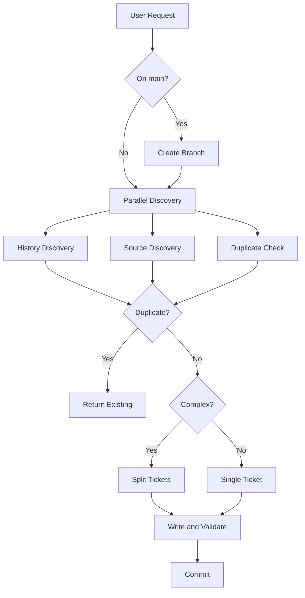
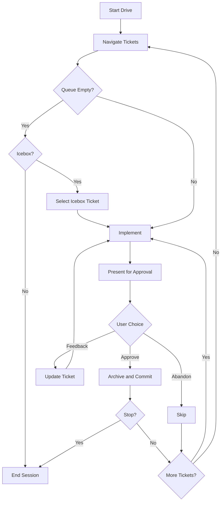
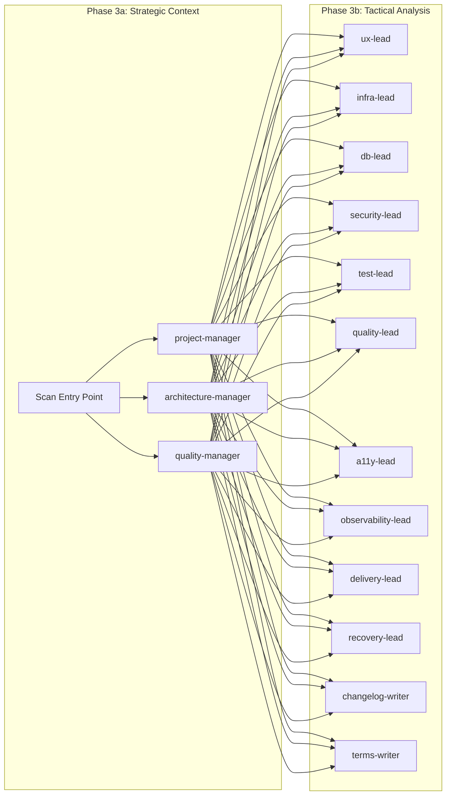
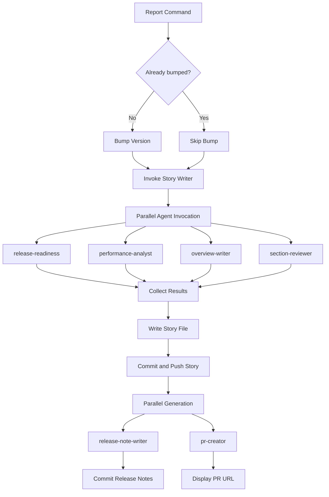
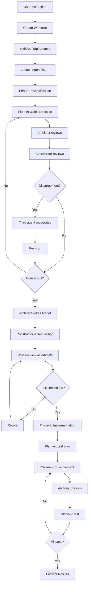
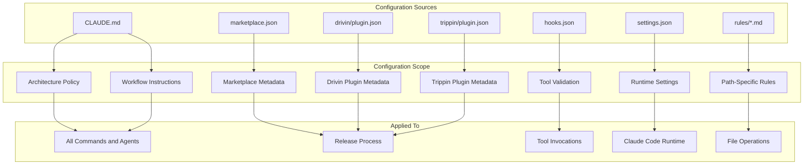
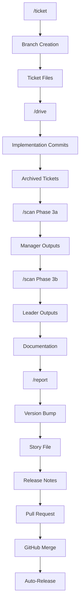
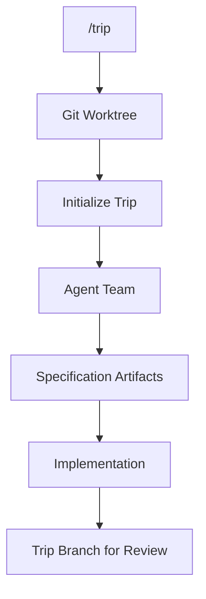

[English](feature.md) | [Japanese](feature_ja.md)

# Feature Viewpoint

The Feature Viewpoint provides a comprehensive inventory of capabilities offered by the Workaholic marketplace, documenting what the system can do, how features are configured, and what options are available to users. The marketplace now contains two plugins: drivin provides a ticket-driven development workflow with strategic documentation scanning, while trippin provides an AI-oriented exploration workflow based on three-agent collaboration. This specification focuses on functional features, their status, and configuration mechanisms rather than implementation details.

## Drivin Plugin Features

### Ticket Creation (`/ticket`)

The ticket command transforms natural language feature requests into structured implementation specifications.

| Feature | Description | Implementation |
| --- | --- | --- |
| Natural language input | Accepts free-form change descriptions | `ticket.md` command |
| Parallel discovery | Explores codebase, tickets, and history concurrently | `ticket-organizer` agent |
| Duplicate detection | Identifies existing tickets for the same change | `ticket-discoverer` agent |
| Related history | Links to historical tickets for context | `history-discoverer` agent |
| Source discovery | Identifies relevant files and code flows | `source-discoverer` agent |
| Automatic ticket splitting | Decomposes complex requests into 2-4 discrete tickets | `ticket-organizer` agent |
| Frontmatter validation | Validates ticket structure on every write | `hooks.json` PostToolUse hook |
| Auto-branch creation | Creates branch when running on main | `branching` skill |
| Author verification | Uses git email, rejects Anthropic addresses | `create-ticket` skill |
| Patch generation | Generates unified diff patches from source snippets | `ticket-organizer` agent |
| Todo/icebox targeting | Routes tickets to todo or icebox directories | `ticket-organizer` agent |

#### Ticket Lifecycle Flow

```mermaid
flowchart TD
    A[User Request] --> B{On main?}
    B -->|Yes| C[Create Branch]
    B -->|No| D[Parallel Discovery]
    C --> D
    D --> E[History Discovery]
    D --> F[Source Discovery]
    D --> G[Duplicate Check]
    E --> H{Duplicate?}
    F --> H
    G --> H
    H -->|Yes| I[Return Existing]
    H -->|No| J{Complex?}
    J -->|Yes| K[Split Tickets]
    J -->|No| L[Single Ticket]
    K --> M[Write and Validate]
    L --> M
    M --> N[Commit]
```

### Ticket Implementation (`/drive`)

The drive command implements queued tickets through an approval-gated loop with intelligent prioritization.

| Feature | Description | Implementation |
| --- | --- | --- |
| Intelligent prioritization | Orders tickets by type, layer, and dependencies | `drive-navigator` agent |
| Sequential implementation | Processes tickets one at a time | `drive-workflow` skill |
| Human-in-the-loop approval | Requires explicit approval per ticket | `drive-approval` skill |
| Context-rich approval prompts | Requires ticket title and overview in every approval dialog | `drive-approval` skill (CRITICAL enforcement) |
| Feedback loop | Accepts free-form feedback for re-implementation | `drive-approval` skill |
| Context preservation in feedback | Re-reads ticket file when context lost during feedback loops | `drive-approval` skill |
| Abandon with analysis | Generates failure analysis on abandon | `drive-approval` skill |
| Final report | Appends implementation summary to ticket | `write-final-report` skill |
| Automatic archival | Archives approved tickets with commit | `archive-ticket` skill |
| Continuous loop | Re-checks for new tickets after each batch | `drive.md` Phase 3 |
| Icebox processing | Optionally processes deferred tickets | `drive-navigator` agent |
| Effort tracking | Records actual implementation time in hours | `update-ticket-frontmatter` skill |
| Session-wide tracking | Maintains counters across multiple batches | `drive.md` Phase 4 |
| Expanded commit messages | Motivation, UX changes, and architecture changes | `commit` skill |

#### Drive Workflow State Machine

```mermaid
flowchart TD
    A[Start Drive] --> B[Navigate Tickets]
    B --> C{Queue Empty?}
    C -->|Yes| D{Icebox?}
    D -->|Yes| E[Select Icebox Ticket]
    D -->|No| F[End Session]
    E --> G[Implement]
    C -->|No| G
    G --> H[Present for Approval]
    H --> I{User Choice}
    I -->|Approve| J[Archive and Commit]
    I -->|Feedback| K[Update Ticket]
    I -->|Abandon| L[Skip]
    K --> G
    J --> M{Stop?}
    M -->|Yes| F
    M -->|No| N{More Tickets?}
    L --> N
    N -->|Yes| G
    N -->|No| B
```

### Documentation Update (`/scan`)

The scan command runs a two-phase agent orchestration to generate comprehensive codebase documentation. Phase 3a invokes 3 manager agents to establish strategic context. Phase 3b invokes 13 leader and writer agents that consume manager outputs.

| Feature | Description | Implementation |
| --- | --- | --- |
| Two-phase execution | Managers first, then leaders/writers | `scan.md` Phases 3a/3b |
| 3 manager agents | Establish project, architecture, quality context | Manager tier agents |
| 11 leader agents | Domain-specific policy analysis | Leader tier agents |
| 2 writer agents | Changelog and terms generation | Writer agents |
| Real-time visibility | All agents visible as Task calls | `scan.md` Phase 3 |
| Output validation | Verifies files exist before index update | `validate-writer-output` skill |
| Index synchronization | Updates README files for specs and policies | `scan.md` Phase 5 |
| i18n mirroring | Japanese translations for all documents | `translate` skill |
| Permission control | Explicit `run_in_background: false` for Write/Edit access | `scan.md` Phase 3 |
| Full/partial modes | Adaptive agent selection based on changes | `select-scan-agents` skill |
| 4 viewpoint specs | Application, component, feature, usecase | `architecture-manager` agent |
| 7 policy docs | Test, security, quality, a11y, observability, delivery, recovery | 7 leader agents |
| Constraint setting | Managers produce directional materials | `managers-principle` skill |

#### Documentation Agent Matrix

The scan command orchestrates agents organized into 3 tiers:

**Manager Tier (3 agents)**: Establish strategic context
- `project-manager` - Business domain, stakeholders, timeline, issues, solutions
- `architecture-manager` - System boundaries, layers, components, cross-cutting concerns, 4 viewpoint specs
- `quality-manager` - Quality dimensions, standards, assurance processes, metrics, feedback loops

**Leader Tier (11 agents)**: Generate documentation
- `ux-lead` - User experience, interaction patterns, user journeys, onboarding
- `model-analyst` - Domain concepts, relationships, core abstractions
- `infra-lead` - External dependencies, deployment, runtime environment
- `db-lead` - Data formats, storage mechanisms, persistence patterns
- `security-lead` - Security requirements, threat model, mitigation strategies
- `test-lead` - Testing strategy, test types, coverage requirements
- `quality-lead` - Code quality standards, review processes, quality gates
- `a11y-lead` - Accessibility standards, WCAG conformance, inclusive design
- `observability-lead` - Logging, monitoring, tracing practices
- `delivery-lead` - Release processes, deployment strategies, rollback procedures
- `recovery-lead` - Backup strategies, disaster recovery, business continuity

**Writer Tier (2 agents)**:
- `changelog-writer` - Generates CHANGELOG.md from archived tickets
- `terms-writer` - Maintains consistent terminology definitions

#### Two-Phase Scan Execution

```mermaid
flowchart LR
    subgraph "Phase 3a: Strategic Context"
        S[Scan Entry Point]
        PM[project-manager]
        AM[architecture-manager]
        QM[quality-manager]
    end

    subgraph "Phase 3b: Tactical Analysis"
        UX[ux-lead]
        IN[infra-lead]
        DB[db-lead]
        SEC[security-lead]
        TST[test-lead]
        QL[quality-lead]
        A11Y[a11y-lead]
        OBS[observability-lead]
        DEL[delivery-lead]
        REC[recovery-lead]
        CL[changelog-writer]
        TR[terms-writer]
    end

    S --> PM & AM & QM
    PM & AM & QM --> UX & IN & DB & SEC & TST & QL & A11Y & OBS & DEL & REC & CL & TR
```

### Report Generation (`/report`)

The report command generates a branch story and creates or updates a pull request.

| Feature | Description | Implementation |
| --- | --- | --- |
| Story generation | Narrative development history | `story-writer` agent |
| Release note generation | Concise user-facing notes | `release-note-writer` agent |
| Performance analysis | Decision quality evaluation | `performance-analyst` agent |
| Release readiness | Assesses readiness for release | `release-readiness` agent |
| PR creation/update | GitHub pull request management | `pr-creator` agent |
| Idempotent version bump | Increments patch version before story, skips if already bumped | `report.md` + `branching/sh/check-version-bump.sh` |
| Overview generation | High-level summary and highlights | `overview-writer` agent |
| Section review | Outcome, concerns, ideas, historical analysis | `section-reviewer` agent |
| Change summarization | Concise summary of implementation changes | `write-story` skill |
| Multi-plugin version sync | Updates all plugin versions together | `report.md` version bump logic |

#### Story Generation Workflow

```mermaid
flowchart TD
    A["Report Command"] --> B{Already bumped?}
    B -->|No| C[Bump Version]
    B -->|Yes| D[Skip Bump]
    C --> E[Invoke Story Writer]
    D --> E
    E --> F[Parallel Agent Invocation]
    F --> G[release-readiness]
    F --> H[performance-analyst]
    F --> I[overview-writer]
    F --> J[section-reviewer]
    G --> K[Collect Results]
    H --> K
    I --> K
    J --> K
    K --> L[Write Story File]
    L --> M[Commit and Push Story]
    M --> N[Parallel Generation]
    N --> O[release-note-writer]
    N --> P[pr-creator]
    O --> Q[Commit Release Notes]
    P --> R[Display PR URL]
```

### Release (`/release`)

The release command manages semantic versioning and triggers GitHub release workflows.

| Feature | Description | Implementation |
| --- | --- | --- |
| Version bump | Increments patch/minor/major | `.claude/commands/release.md` |
| Triple file sync | Updates marketplace.json and both plugin.json files | Version management |
| Auto-release | GitHub Action creates release on main | `release.yml` workflow |
| Documentation sync | Triggers full scan before release | `release.md` step 9 |
| Multi-plugin support | Updates all plugin versions in marketplace | Version management |

## Trippin Plugin Features

### Exploration Session (`/trip`)

The trip command launches a collaborative Agent Teams session for creative exploration and development.

| Feature | Description | Implementation |
| --- | --- | --- |
| Agent Teams integration | Creates 3-member collaborative team | `trip.md` command |
| Worktree isolation | Runs in dedicated git worktree for safety | `ensure-worktree.sh` script |
| Three-agent collaboration | Planner, Architect, Constructor with distinct stances | 3 agent definitions |
| Two-phase workflow | Specification (inner loop) then implementation (outer loop) | `trip-protocol` skill |
| Versioned artifacts | Direction, Model, Design with v1, v2, etc. | `trip-protocol` skill |
| Commit-per-step | Every discrete step produces a git commit | `trip-commit.sh` script |
| Moderation protocol | Third agent arbitrates disagreements | `trip-protocol` skill |
| Consensus gates | All agents must approve before phase transitions | `trip-protocol` skill |
| Artifact format | Structured markdown with author, status, reviewed-by | `trip-protocol` skill |
| Branch isolation | Trip sessions on `trip/<trip-name>` branches | `ensure-worktree.sh` script |

#### Trip Workflow

```mermaid
flowchart TD
    A[User Instruction] --> B[Create Worktree]
    B --> C[Initialize Trip Artifacts]
    C --> D[Launch Agent Team]

    D --> E["Phase 1: Specification"]
    E --> F[Planner writes Direction]
    F --> G[Architect reviews]
    G --> H[Constructor reviews]
    H --> I{Disagreement?}
    I -->|Yes| J[Third agent moderates]
    J --> K[Revision]
    I -->|No| L{Consensus?}
    K --> L
    L -->|No| F
    L -->|Yes| M[Architect writes Model]
    M --> N[Constructor writes Design]
    N --> O[Cross-review all artifacts]
    O --> P{Full consensus?}
    P -->|No| Q[Revise]
    Q --> O
    P -->|Yes| R["Phase 2: Implementation"]

    R --> S[Planner: test plan]
    S --> T[Constructor: implement]
    T --> U[Architect: review]
    U --> V[Planner: test]
    V --> W{All pass?}
    W -->|No| T
    W -->|Yes| X[Present Results]
```

#### Agent Philosophy Matrix

| Agent | Stance | Artifact | Phase 1 Role | Phase 2 Role |
| --- | --- | --- | --- | --- |
| Planner | Progressive | Direction | Lead creative vision | Test planning and validation |
| Architect | Neutral | Model | Structural consistency | Code review |
| Constructor | Conservative | Design | Feasibility review | Implementation |

#### Moderation Protocol

When two agents disagree, the third agent serves as moderator:

| Disagreement | Moderator |
| --- | --- |
| Planner vs Architect | Constructor |
| Architect vs Constructor | Planner |
| Planner vs Constructor | Architect |

## Strategic Features

### Manager Tier Capabilities

The manager tier introduces strategic context establishment and constraint-setting capabilities:

| Feature | Description | Manager Agent |
| --- | --- | --- |
| Project context analysis | Business domain, stakeholders, timeline, issues | `project-manager` |
| Architectural structure | System boundaries, layers, components, patterns | `architecture-manager` |
| Quality standards | Dimensions, assurance processes, metrics, feedback loops | `quality-manager` |
| Constraint setting | Analyze, Ask, Propose, Produce directional materials | All managers via `managers-principle` |
| Viewpoint spec production | 4 architectural viewpoint documents | `architecture-manager` |
| Strategic focus | Observable facts, not aspirational recommendations | `managers-principle` |
| Prior term consistency | Respect existing terminology, cultivate ubiquitous language | `managers-principle` |

### Leader Tier Capabilities

Leaders consume manager outputs and produce domain-specific policy documents:

| Feature | Description | Leader Agent |
| --- | --- | --- |
| Manager context consumption | Read strategic outputs before analysis | All leaders |
| Domain-specific policies | Test, security, quality, a11y, observability, delivery, recovery | 7 policy leaders |
| UX analysis | User experience, interaction patterns, user journeys | `ux-lead` |
| Data analysis | Data formats, storage, persistence | `db-lead` |
| Infrastructure analysis | Dependencies, deployment, runtime environment | `infra-lead` |
| Prior term consistency | Respect existing terminology | `leaders-principle` |
| Vendor neutrality | Minimize dependencies, manage coupling | `leaders-principle` |

## Cross-Cutting Features

### Internationalization (i18n)

Documents in `.workaholic/` must have translations based on the consumer project's primary written language declared in root CLAUDE.md. The system enforces parallel structure across all declared languages.

**Implementation**: The `translate` skill provides dynamic translation logic:
- Checks consumer CLAUDE.md to determine primary language
- For English-primary projects: produces `_ja.md` Japanese translations
- For Japanese-primary projects: skips `_ja.md` (would duplicate primary content)
- Preserves code blocks, frontmatter keys, file paths, and URLs unchanged
- Translates prose content with formal/polite tone
- Maintains consistent technical terminology
- Mirrors index README link structures

### Shell Script Bundling

All multi-step or conditional shell operations are extracted to bundled scripts in `skills/<name>/sh/<script>.sh`. Both plugins follow this pattern:

**Drivin examples**:
- `gather-git-context/sh/gather.sh` - Git repository context collection
- `select-scan-agents/sh/select.sh` - Agent selection based on changes
- `validate-writer-output/sh/validate.sh` - Output file existence validation

**Trippin examples**:
- `trip-protocol/sh/ensure-worktree.sh` - Worktree creation and validation
- `trip-protocol/sh/init-trip.sh` - Trip directory initialization
- `trip-protocol/sh/trip-commit.sh` - Standardized commit with agent context

### Validation

The system includes multiple validation layers to ensure data integrity:

**PostToolUse Hook**: Validates ticket frontmatter structure on every Write/Edit tool invocation. Defined in `plugins/drivin/hooks/hooks.json`.

**CI Workflow**: GitHub Actions validates JSON manifests and plugin structure on push.

**Output Validation**: The `validate-writer-output` skill verifies documentation files exist before updating index READMEs during scan operations.

**Agent Output Validation**: Story-writer tracks which of its parallel agents succeed or fail, including this status in the final JSON output.

**Approval Prompt Validation**: The drive-approval skill treats missing ticket title or overview in the approval prompt as a failure condition, requiring re-read from the ticket file.

### Git Integration

Workaholic manages git operations autonomously during commands:
- Creating topic branches (when running `/ticket` on main)
- Committing changes (after ticket implementation, story generation)
- Pushing to remote (during PR creation)
- Creating pull requests (via `gh` CLI in pr-creator agent)
- Creating git worktrees (during `/trip` sessions)
- Commit-per-step in worktree branches (during trip workflows)

### Multi-Plugin Architecture

The marketplace supports multiple plugins with synchronized versioning:

| Plugin | Commands | Purpose |
| --- | --- | --- |
| drivin | `/ticket`, `/drive`, `/scan`, `/report` | Development workflow |
| trippin | `/trip` | Exploration workflow |

Version files to keep in sync:
- `.claude-plugin/marketplace.json` - root version
- `plugins/drivin/.claude-plugin/plugin.json` - drivin version
- `plugins/trippin/.claude-plugin/plugin.json` - trippin version

### Configuration Mechanisms

```mermaid
flowchart TD
    subgraph "Configuration Sources"
        A[CLAUDE.md]
        B[marketplace.json]
        C1["drivin/plugin.json"]
        C2["trippin/plugin.json"]
        D[hooks.json]
        E[settings.json]
        F["rules/*.md"]
    end

    subgraph "Configuration Scope"
        A --> G[Architecture Policy]
        A --> H[Workflow Instructions]
        B --> I[Marketplace Metadata]
        C1 --> J1[Drivin Plugin Metadata]
        C2 --> J2[Trippin Plugin Metadata]
        D --> K[Tool Validation]
        E --> L[Runtime Settings]
        F --> M[Path-Specific Rules]
    end

    subgraph "Applied To"
        G --> N[All Commands and Agents]
        H --> N
        I --> O[Release Process]
        J1 --> O
        J2 --> O
        K --> P[Tool Invocations]
        L --> Q[Claude Code Runtime]
        M --> R[File Operations]
    end
```

## Capability Matrix

The system provides two complementary workflows:

| Phase | Drivin Capabilities | Status |
| --- | --- | --- |
| **Planning** | Ticket creation, duplicate detection, history discovery, source discovery, automatic splitting | Active |
| **Strategic** | Project context, architectural structure, quality standards, constraint setting | Active |
| **Implementation** | Sequential drive, approval loop, feedback iteration, automatic archival, effort tracking | Active |
| **Documentation** | 2-phase scan (managers then leaders), 4 viewpoint specs, 7 policy docs, changelog, terms, i18n | Active |
| **Delivery** | Story generation, release notes, PR management, version bumping, release automation | Active |

| Phase | Trippin Capabilities | Status |
| --- | --- | --- |
| **Exploration** | Agent Teams session, worktree isolation, three-agent collaboration | Active |
| **Specification** | Direction, Model, Design artifacts with consensus gates, moderation protocol | Active |
| **Implementation** | Test planning, construction, structural review, test validation | Active |
| **Traceability** | Commit-per-step, versioned artifacts, branch isolation | Active |

### Feature Dependencies

```mermaid
flowchart TD
    A["/ticket"] --> B[Branch Creation]
    B --> C[Ticket Files]
    C --> D["/drive"]
    D --> E[Implementation Commits]
    E --> F[Archived Tickets]
    F --> G["/scan Phase 3a"]
    G --> H[Manager Outputs]
    H --> I["/scan Phase 3b"]
    I --> J[Leader Outputs]
    J --> K[Documentation]
    K --> L["/report"]
    L --> M[Version Bump]
    M --> N[Story File]
    N --> O[Release Notes]
    O --> P[Pull Request]
    P --> Q[GitHub Merge]
    Q --> R["Auto-Release"]
```

```mermaid
flowchart TD
    T["/trip"] --> W[Git Worktree]
    W --> I[Initialize Trip]
    I --> AT[Agent Team]
    AT --> S[Specification Artifacts]
    S --> Impl[Implementation]
    Impl --> Branch["Trip Branch for Review"]
```

## Configuration Options

### System Configuration

| Mechanism | Location | Purpose | Scope |
| --- | --- | --- | --- |
| `CLAUDE.md` | Repository root | Project-wide instructions and architecture policy | All commands, agents, skills |
| `marketplace.json` | `.claude-plugin/` | Marketplace metadata and version | Release process |
| `drivin/plugin.json` | `plugins/drivin/.claude-plugin/` | Drivin plugin metadata and version | Release process |
| `trippin/plugin.json` | `plugins/trippin/.claude-plugin/` | Trippin plugin metadata and version | Release process |
| `hooks.json` | `plugins/drivin/hooks/` | PostToolUse hook configuration | Tool validation |
| `settings.json` | `.claude/` | Claude Code runtime settings | IDE integration |
| Rule files | `plugins/drivin/rules/` | Path-specific behavioral constraints | File-scoped operations |
| `define-manager.md` | `.claude/rules/` | Manager schema enforcement | Manager skills and agents |
| `define-lead.md` | `.claude/rules/` | Leader schema enforcement | Leader skills and agents |

### Command Configuration

Commands accept limited runtime arguments:

| Command | Plugin | Arguments | Options | Default |
| --- | --- | --- | --- | --- |
| `/ticket` | drivin | Description | `Target: todo\|icebox` | `todo` |
| `/drive` | drivin | Mode | `normal\|icebox` | `normal` |
| `/scan` | drivin | None | N/A | Full mode |
| `/report` | drivin | None | N/A | N/A |
| `/release` | drivin | Bump type | `major\|minor\|patch` | `patch` |
| `/trip` | trippin | Instruction | N/A | N/A |

### Trip Session Configuration

The trip command uses environment-based configuration:

| Mechanism | Purpose |
| --- | --- |
| `CLAUDE_CODE_EXPERIMENTAL_AGENT_TEAMS=1` | Required to enable Agent Teams feature |
| Trip name (auto-generated) | Timestamp-based unique identifier |
| Worktree path | `.worktrees/<trip-name>/` |
| Trip artifact path | `.workaholic/.trips/<trip-name>/` |
| Branch name | `trip/<trip-name>` |

## Feature Status

All documented features are actively implemented and maintained. The system has no deprecated features as of commit `f76bde2`.

### Recent Feature Changes

Based on archived tickets from branch `drive-20260302-213941`:

**Added**:
- Trippin plugin with `/trip` command, 3 agents, trip-protocol skill, 3 shell scripts
- Agent Teams integration for three-agent collaborative exploration
- Worktree isolation for trip sessions
- Commit-per-step traceability in trip workflows
- Moderation protocol for resolving agent disagreements
- Consensus gates for phase transitions

**Changed**:
- Core plugin renamed to drivin (directory, all references, subagent_type prefixes)
- Marketplace expanded from 1 plugin to 2 plugins
- Drive approval enforcement upgraded from IMPORTANT to CRITICAL with failure condition language
- Version management expanded to track three version files (marketplace + drivin + trippin)
- CLAUDE.md project structure updated to reflect two-plugin architecture

## Assumptions

- [Explicit] The drivin plugin has 4 commands, 28 agents, 45 skills, and 6 rules, counted from filesystem listing.
- [Explicit] The trippin plugin has 1 command, 3 agents, 1 skill, and 0 rules, counted from filesystem listing.
- [Explicit] The marketplace registers both plugins with synchronized version 1.0.38, as shown in marketplace.json.
- [Explicit] The trip command requires Agent Teams experimental feature flag, as documented in trip.md.
- [Explicit] Trip sessions run in isolated git worktrees, as documented in trip-protocol SKILL.md.
- [Explicit] The drive-approval skill enforces ticket context with CRITICAL language, as documented in drive-approval SKILL.md.
- [Explicit] The core plugin was renamed to drivin, as documented in ticket 20260302215035.
- [Explicit] The trippin plugin was created with skeleton then populated with trip command, as documented in tickets 20260302215036 and 20260309214650.
- [Inferred] The trippin plugin represents a new category of workflow (exploration vs development) that complements rather than replaces drivin.
- [Inferred] The worktree isolation in trippin protects the main working tree from experimental changes during trip sessions.
- [Inferred] The Agent Teams model was chosen for trippin because peer collaboration better suits creative exploration than the hierarchical Task tool model used by drivin.
