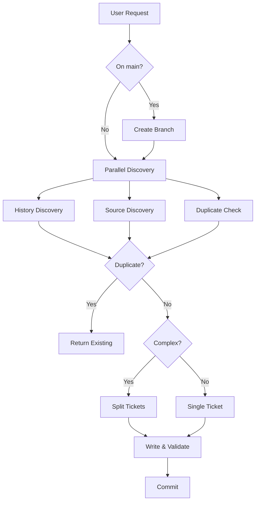
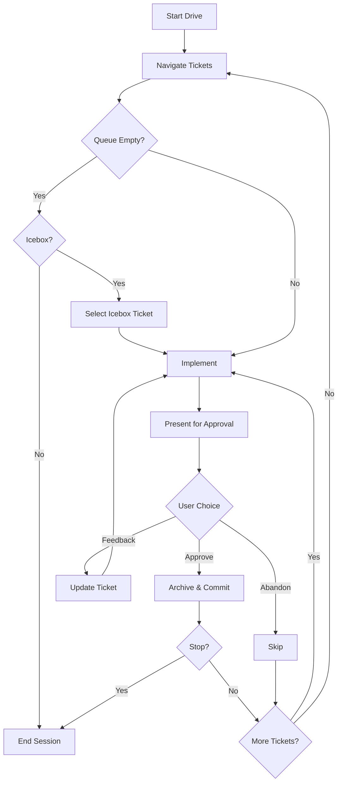
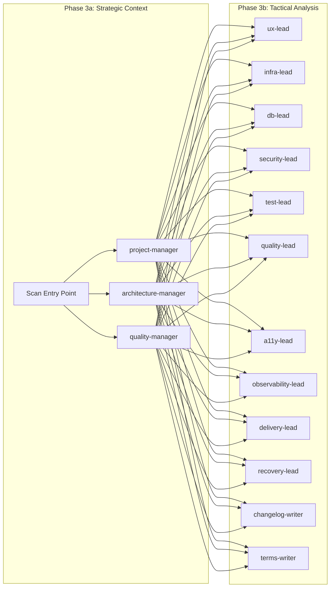
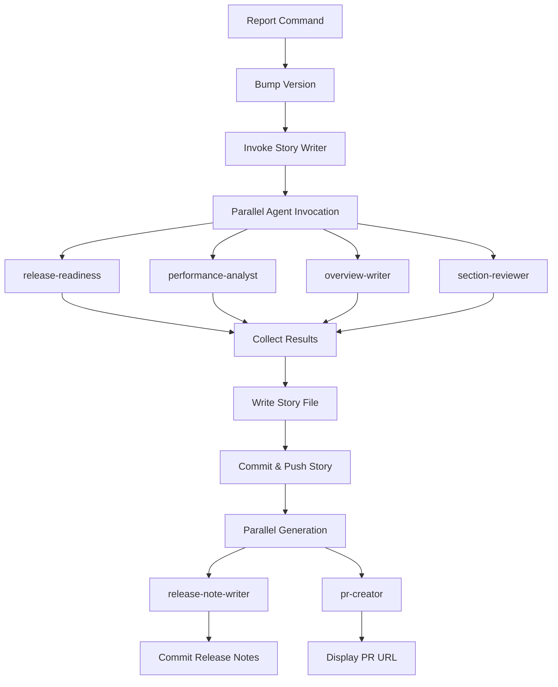
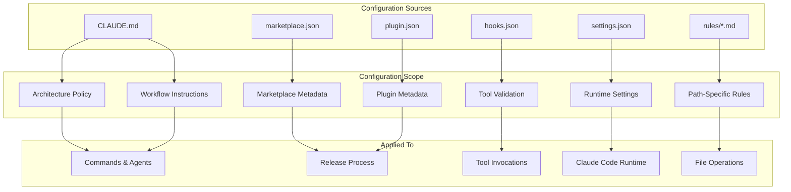
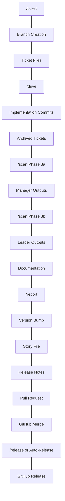

[English](feature.md) | [Japanese](feature_ja.md)

# Feature Viewpoint

The Feature Viewpoint provides a comprehensive inventory of capabilities offered by the Workaholic plugin, documenting what the system can do, how features are configured, and what options are available to users. This specification focuses on functional features, their status, and configuration mechanisms rather than implementation details. The recent addition of a manager tier introduces strategic context establishment and constraint-setting capabilities alongside the existing ticket-driven development workflow.

## Command Features

### Ticket Creation (`/ticket`)

The ticket command transforms natural language feature requests into structured implementation specifications.

| Feature | Description | Implementation |
| --- | --- | --- |
| Natural language input | Accepts free-form change descriptions | `ticket.md` command |
| Parallel discovery | Explores codebase, tickets, and history concurrently | `ticket-organizer` agent |
| Duplicate detection | Identifies existing tickets for the same change | `ticket-discoverer` agent |
| Related history | Links to historical tickets for context | `history-discoverer` agent |
| Source discovery | Identifies relevant files and code flows | `source-discoverer` agent |
| Automatic ticket splitting | Decomposes complex requests into 2-4 discrete tickets | `ticket-organizer` agent |
| Frontmatter validation | Validates ticket structure on every write | `hooks.json` PostToolUse hook |
| Auto-branch creation | Creates branch when running on main | `manage-branch` skill |
| Author verification | Uses git email, rejects Anthropic addresses | `create-ticket` skill |
| Patch generation | Generates unified diff patches from source snippets | `ticket-organizer` agent |
| Todo/icebox targeting | Routes tickets to todo or icebox directories | `ticket-organizer` agent |

#### Ticket Lifecycle Flow


```mermaid
flowchart TD
    A[User Request] --> B{On main?}
    B -->|Yes| C[Create Branch]
    B -->|No| D[Parallel Discovery]
    C --> D
    D --> E[History Discovery]
    D --> F[Source Discovery]
    D --> G[Duplicate Check]
    E --> H{Duplicate?}
    F --> H
    G --> H
    H -->|Yes| I[Return Existing]
    H -->|No| J{Complex?}
    J -->|Yes| K[Split Tickets]
    J -->|No| L[Single Ticket]
    K --> M[Write & Validate]
    L --> M
    M --> N[Commit]
```

### Ticket Implementation (`/drive`)

The drive command implements queued tickets through an approval-gated loop with intelligent prioritization.

| Feature | Description | Implementation |
| --- | --- | --- |
| Intelligent prioritization | Orders tickets by type, layer, and dependencies | `drive-navigator` agent |
| Sequential implementation | Processes tickets one at a time | `drive-workflow` skill |
| Human-in-the-loop approval | Requires explicit approval per ticket | `drive-approval` skill |
| Feedback loop | Accepts free-form feedback for re-implementation | `drive-approval` skill |
| Abandon with analysis | Generates failure analysis on abandon | `drive-approval` skill |
| Final report | Appends implementation summary to ticket | `write-final-report` skill |
| Automatic archival | Archives approved tickets with commit | `archive-ticket` skill |
| Continuous loop | Re-checks for new tickets after each batch | `drive.md` Phase 3 |
| Icebox processing | Optionally processes deferred tickets | `drive-navigator` agent |
| Effort tracking | Records actual implementation time in hours | `update-ticket-frontmatter` skill |
| Session-wide tracking | Maintains counters across multiple batches | `drive.md` Phase 4 |
| Expanded commit messages | Motivation, UX changes, and architecture changes | `commit` skill |

#### Drive Workflow State Machine


```mermaid
flowchart TD
    A[Start Drive] --> B[Navigate Tickets]
    B --> C{Queue Empty?}
    C -->|Yes| D{Icebox?}
    D -->|Yes| E[Select Icebox Ticket]
    D -->|No| F[End Session]
    E --> G[Implement]
    C -->|No| G
    G --> H[Present for Approval]
    H --> I{User Choice}
    I -->|Approve| J[Archive & Commit]
    I -->|Feedback| K[Update Ticket]
    I -->|Abandon| L[Skip]
    K --> G
    J --> M{Stop?}
    M -->|Yes| F
    M -->|No| N{More Tickets?}
    L --> N
    N -->|Yes| G
    N -->|No| B
```

### Documentation Update (`/scan`)

The scan command runs a two-phase agent orchestration to generate comprehensive codebase documentation. Phase 3a invokes 3 manager agents to establish strategic context. Phase 3b invokes 12 leader and writer agents that consume manager outputs.

| Feature | Description | Implementation |
| --- | --- | --- |
| Two-phase execution | Managers first, then leaders/writers | `scan.md` Phases 3a/3b |
| 3 manager agents | Establish project, architecture, quality context | Manager tier agents |
| 10 leader agents | Domain-specific policy analysis | Leader tier agents |
| 2 writer agents | Changelog and terms generation | Writer agents |
| Real-time visibility | All 15 agents visible as Task calls | `scan.md` Phase 3 |
| Output validation | Verifies files exist before index update | `validate-writer-output` skill |
| Index synchronization | Updates README files for specs and policies | `scan.md` Phase 5 |
| i18n mirroring | Japanese translations for all documents | `translate` skill |
| Permission control | Explicit `run_in_background: false` for Write/Edit access | `scan.md` Phase 3 |
| Full/partial modes | Adaptive agent selection based on changes | `select-scan-agents` skill |
| 4 viewpoint specs | Application, component, feature, usecase | `architecture-manager` agent |
| 7 policy docs | Test, security, quality, a11y, observability, delivery, recovery | 7 leader agents |
| Constraint setting | Managers produce directional materials | `managers-policy` skill |

#### Documentation Agent Matrix

The scan command orchestrates 15 agents organized into 3 tiers:

**Manager Tier (3 agents)**: Establish strategic context
- `project-manager` - Business domain, stakeholders, timeline, issues, solutions
- `architecture-manager` - System boundaries, layers, components, cross-cutting concerns, 4 viewpoint specs
- `quality-manager` - Quality dimensions, standards, assurance processes, metrics, feedback loops

**Leader Tier (10 agents)**: Generate policy documentation
- `ux-lead` - User experience, interaction patterns, user journeys, onboarding
- `infra-lead` - External dependencies, deployment, runtime environment
- `db-lead` - Data formats, storage mechanisms, persistence patterns
- `security-lead` - Security requirements, threat model, mitigation strategies
- `test-lead` - Testing strategy, test types, coverage requirements
- `quality-lead` - Code quality standards, review processes, quality gates
- `a11y-lead` - Accessibility standards, WCAG conformance, inclusive design
- `observability-lead` - Logging, monitoring, tracing practices
- `delivery-lead` - Release processes, deployment strategies, rollback procedures
- `recovery-lead` - Backup strategies, disaster recovery, business continuity

**Writer Tier (2 agents)**:
- `changelog-writer` - Generates CHANGELOG.md from archived tickets
- `terms-writer` - Maintains consistent terminology definitions

#### Two-Phase Scan Execution


```mermaid
flowchart LR
    subgraph Phase 3a: Strategic Context
        S[Scan Entry Point]
        PM[project-manager]
        AM[architecture-manager]
        QM[quality-manager]
    end

    subgraph Phase 3b: Tactical Analysis
        UX[ux-lead]
        IN[infra-lead]
        DB[db-lead]
        SEC[security-lead]
        TST[test-lead]
        QL[quality-lead]
        A11Y[a11y-lead]
        OBS[observability-lead]
        DEL[delivery-lead]
        REC[recovery-lead]
        CL[changelog-writer]
        TR[terms-writer]
    end

    S --> PM & AM & QM
    PM & AM & QM --> UX & IN & DB & SEC & TST & QL & A11Y & OBS & DEL & REC & CL & TR
```

### Report Generation (`/report`)

The report command generates a branch story and creates or updates a pull request.

| Feature | Description | Implementation |
| --- | --- | --- |
| Story generation | Narrative development history | `story-writer` agent |
| Release note generation | Concise user-facing notes | `release-note-writer` agent |
| Performance analysis | Decision quality evaluation | `performance-analyst` agent |
| Release readiness | Assesses readiness for release | `release-readiness` agent |
| PR creation/update | GitHub pull request management | `pr-creator` agent |
| Automatic version bump | Increments patch version before story | `report.md` instruction |
| Overview generation | High-level summary and highlights | `overview-writer` agent |
| Section review | Outcome, concerns, ideas, historical analysis | `section-reviewer` agent |
| Change summarization | Concise summary of implementation changes | `write-story` skill |

#### Story Generation Workflow


```mermaid
flowchart TD
    A["Report Command"] --> B[Bump Version]
    B --> C[Invoke Story Writer]
    C --> D[Parallel Agent Invocation]
    D --> E[release-readiness]
    D --> F[performance-analyst]
    D --> G[overview-writer]
    D --> H[section-reviewer]
    E --> I[Collect Results]
    F --> I
    G --> I
    H --> I
    I --> J[Write Story File]
    J --> K[Commit & Push Story]
    K --> L[Parallel Generation]
    L --> M[release-note-writer]
    L --> N[pr-creator]
    M --> O[Commit Release Notes]
    N --> P[Display PR URL]
```

### Release (`/release`)

The release command manages semantic versioning and triggers GitHub release workflows.

| Feature | Description | Implementation |
| --- | --- | --- |
| Version bump | Increments patch/minor/major | `.claude/commands/release.md` |
| Dual file sync | Updates both manifest files | `marketplace.json` + `plugin.json` |
| Auto-release | GitHub Action creates release on main | `release.yml` workflow |
| Documentation sync | Triggers full scan before release | `release.md` step 9 |
| Multi-plugin support | Updates all plugin versions in marketplace | `release.md` steps 5-8 |

## Strategic Features

### Manager Tier Capabilities

The manager tier introduces strategic context establishment and constraint-setting capabilities:

| Feature | Description | Manager Agent |
| --- | --- | --- |
| Project context analysis | Business domain, stakeholders, timeline, issues | `project-manager` |
| Architectural structure | System boundaries, layers, components, patterns | `architecture-manager` |
| Quality standards | Dimensions, assurance processes, metrics, feedback loops | `quality-manager` |
| Constraint setting | Analyze, Ask, Propose, Produce directional materials | All managers via `managers-policy` |
| Viewpoint spec production | 4 architectural viewpoint documents | `architecture-manager` |
| Strategic focus | Observable facts, not aspirational recommendations | `managers-policy` |
| Prior term consistency | Respect existing terminology, cultivate ubiquitous language | `managers-policy` |

#### Constraint Setting Workflow

Managers follow a four-phase constraint-setting workflow:

1. **Analyze** - Identify unbounded areas, implicit constraints, outdated constraints
2. **Ask** - Present targeted questions with concrete options grounded in analysis
3. **Propose** - State constraints with bounds, rationale, affected leaders, falsifiability
4. **Produce** - Write directional materials (policies, guidelines, roadmaps, decision records)

### Leader Tier Capabilities

Leaders consume manager outputs and produce domain-specific policy documents:

| Feature | Description | Leader Agent |
| --- | --- | --- |
| Manager context consumption | Read strategic outputs before analysis | All leaders |
| Domain-specific policies | Test, security, quality, a11y, observability, delivery, recovery | 7 policy leaders |
| UX analysis | User experience, interaction patterns, user journeys | `ux-lead` |
| Data analysis | Data formats, storage, persistence | `db-lead` |
| Infrastructure analysis | Dependencies, deployment, runtime environment | `infra-lead` |
| Prior term consistency | Respect existing terminology | `leaders-policy` |
| Vendor neutrality | Minimize dependencies, manage coupling | `leaders-policy` |

## Cross-Cutting Features

### Internationalization (i18n)

Every document in `.workaholic/` must have a corresponding `_ja.md` Japanese translation. The system enforces parallel structure in both languages.

**Implementation**: The `translate` skill provides policies for:
- Preserving code blocks, frontmatter keys, file paths, and URLs
- Translating prose content with formal/polite tone
- Maintaining consistent technical terminology
- Mirroring index README link structures

**Coverage**: All viewpoint specs, policy documents, stories, release notes, changelog, and terms require translations. READMEs must maintain parallel link structures in both languages.

### Shell Script Bundling

All multi-step or conditional shell operations are extracted to bundled scripts in `skills/<name>/sh/<script>.sh`. This ensures consistency, testability, and permission-free execution.

**Prohibited in commands/agents**:
- Conditionals (`if`, `case`, `test`, `[ ]`, `[[ ]]`)
- Pipes and chains (`|`, `&&`, `||`)
- Text processing (`sed`, `awk`, `grep`, `cut`)
- Loops (`for`, `while`)
- Variable expansion with logic (`${var:-default}`, `${var:+alt}`)

**Examples of bundled scripts**:
- `gather-git-context/sh/gather.sh` - Git repository context collection
- `select-scan-agents/sh/select.sh` - Agent selection based on changes
- `validate-writer-output/sh/validate.sh` - Output file existence validation
- `gather-ticket-metadata/sh/gather.sh` - Ticket frontmatter metadata generation

### Validation

The system includes multiple validation layers to ensure data integrity:

**PostToolUse Hook**: Validates ticket frontmatter structure on every Write/Edit tool invocation. Defined in `plugins/core/hooks/hooks.json`.

**CI Workflow**: GitHub Actions validates JSON manifests and plugin structure on push.

**Output Validation**: The `validate-writer-output` skill verifies documentation files exist before updating index READMEs during scan operations.

**Agent Output Validation**: Story-writer tracks which of its 6 parallel agents succeed or fail, including this status in the final JSON output.

### Git Integration

Workaholic manages git operations autonomously during commands:
- Creating topic branches (when running `/ticket` on main)
- Committing changes (after ticket implementation, story generation)
- Pushing to remote (during PR creation)
- Creating pull requests (via `gh` CLI in pr-creator agent)

The root README includes an explicit warning about this autonomous behavior.

### Configuration Mechanisms


```mermaid
flowchart TD
    subgraph Configuration Sources
        A[CLAUDE.md]
        B[marketplace.json]
        C[plugin.json]
        D[hooks.json]
        E[settings.json]
        F["rules/*.md"]
    end

    subgraph Configuration Scope
        A --> G[Architecture Policy]
        A --> H[Workflow Instructions]
        B --> I[Marketplace Metadata]
        C --> J[Plugin Metadata]
        D --> K[Tool Validation]
        E --> L[Runtime Settings]
        F --> M[Path-Specific Rules]
    end

    subgraph Applied To
        G --> N[Commands & Agents]
        H --> N
        I --> O[Release Process]
        J --> O
        K --> P[Tool Invocations]
        L --> Q[Claude Code Runtime]
        M --> R[File Operations]
    end
```

## Capability Matrix

The system provides a complete ticket-driven development workflow with strategic oversight:

| Phase | Capabilities | Status |
| --- | --- | --- |
| **Planning** | Ticket creation, duplicate detection, history discovery, source discovery, automatic splitting | ✓ Active |
| **Strategic** | Project context, architectural structure, quality standards, constraint setting | ✓ Active |
| **Implementation** | Sequential drive, approval loop, feedback iteration, automatic archival, effort tracking | ✓ Active |
| **Documentation** | 2-phase scan (managers then leaders), 4 viewpoint specs, 7 policy docs, changelog, terms, i18n | ✓ Active |
| **Delivery** | Story generation, release notes, PR management, version bumping, release automation | ✓ Active |

### Feature Dependencies


```mermaid
flowchart TD
    A["/ticket"] --> B[Branch Creation]
    B --> C[Ticket Files]
    C --> D["/drive"]
    D --> E[Implementation Commits]
    E --> F[Archived Tickets]
    F --> G["/scan Phase 3a"]
    G --> H[Manager Outputs]
    H --> I["/scan Phase 3b"]
    I --> J[Leader Outputs]
    J --> K[Documentation]
    K --> L["/report"]
    L --> M[Version Bump]
    M --> N[Story File]
    N --> O[Release Notes]
    O --> P[Pull Request]
    P --> Q[GitHub Merge]
    Q --> R["/release" or Auto-Release]
    R --> S[GitHub Release]
```

## Configuration Options

### System Configuration

| Mechanism | Location | Purpose | Scope |
| --- | --- | --- | --- |
| `CLAUDE.md` | Repository root | Project-wide instructions and architecture policy | All commands, agents, skills |
| `marketplace.json` | `.claude-plugin/` | Marketplace metadata and version | Release process |
| `plugin.json` | `plugins/core/.claude-plugin/` | Plugin metadata and version | Release process |
| `hooks.json` | `plugins/core/hooks/` | PostToolUse hook configuration | Tool validation |
| `settings.json` | `.claude/` | Claude Code runtime settings | IDE integration |
| Rule files | `plugins/core/rules/` | Path-specific behavioral constraints | File-scoped operations |
| `define-manager.md` | `.claude/rules/` | Manager schema enforcement | Manager skills and agents |
| `define-lead.md` | `.claude/rules/` | Leader schema enforcement | Leader skills and agents |

### Command Configuration

Commands accept limited runtime arguments:

| Command | Arguments | Options | Default |
| --- | --- | --- | --- |
| `/ticket` | Description | `Target: todo\|icebox` | `todo` |
| `/drive` | Mode | `normal\|icebox` | `normal` |
| `/scan` | None | N/A | Full mode |
| `/report` | None | N/A | N/A |
| `/release` | Bump type | `major\|minor\|patch` | `patch` |

### Ticket Metadata Configuration

Ticket frontmatter provides rich metadata for prioritization and tracking:

```yaml
created_at: <ISO 8601 timestamp>    # Automatic from date -Iseconds
author: <git user.email>            # Automatic from git config
type: <enhancement|bugfix|refactoring|housekeeping>  # Manual
layer: [<UX|Domain|Infrastructure|DB|Config>]        # Manual (array)
effort: <numeric hours>             # Filled after implementation
commit_hash: <short hash>           # Filled during archival
category: <Added|Changed|Removed>   # Filled during archival
```

**Type priority ranking** (used by drive-navigator):
1. `bugfix` - High priority
2. `enhancement` - Normal priority
3. `refactoring` - Normal priority
4. `housekeeping` - Low priority

**Layer grouping**: Drive-navigator groups tickets by layer to maximize context efficiency.

### Skill Configuration

Skills bundle knowledge and shell scripts. Each skill directory contains:
- `SKILL.md` - Guidelines, templates, and instructions
- `sh/*.sh` - Executable shell scripts for complex operations

Skills are preloaded by commands and agents via frontmatter:

```yaml
skills:
  - managers-policy
  - manage-project
  - leaders-policy
  - lead-ux
```

### Rule Configuration

Rules define behavioral constraints scoped by file path patterns:

| Rule | Path Pattern | Constraints |
| --- | --- | --- |
| `general.md` | `**/*` | Never commit without request, never use `git -C`, link markdown files, number headings |
| `define-manager.md` | Manager paths | Manager schema (Role, Responsibility, Goal, Outputs, Default Policies) |
| `define-lead.md` | Leader paths | Leader schema (Role, Responsibility, Goal, Default Policies) |
| `diagrams.md` | Documentation files | Mermaid node label quoting, diagram placement policy |
| `i18n.md` | `.workaholic/` | Parallel translation requirement, suffix naming |
| `shell.md` | Commands/agents | Shell script bundling requirement |

## Feature Status

All documented features are actively implemented and maintained. The system has no deprecated features as of commit `f7f779f`.

### Recent Feature Changes

Based on archived tickets from branch `drive-20260210-121635`:

**Added**:
- Manager tier with 3 manager agents and 3 manager skills
- Constraint-setting workflow for managers (Analyze, Ask, Propose, Produce)
- Two-phase scan execution (managers in phase 3a, leaders in phase 3b)
- Leaders-policy and managers-policy cross-cutting skills
- Expanded commit message sections (Motivation, UX Change, Arch Change)
- 10 leader skills (lead-ux, lead-infra, lead-db, lead-security, lead-test, lead-quality, lead-a11y, lead-observability, lead-delivery, lead-recovery)

**Removed**:
- `architecture-lead` agent (absorbed by architecture-manager)
- `lead-architecture` skill (absorbed by manage-architecture)
- `communication-lead` agent (renamed to ux-lead)
- `lead-communication` skill (renamed to lead-ux)
- `format-commit-message` skill (merged into commit skill)

**Changed**:
- Scan command agent count: 17 → 15 (3 managers + 10 leaders + 2 writers)
- Viewpoint spec production: moved from architecture-lead to architecture-manager
- UX viewpoint slug: "stakeholder" → "ux"
- Commit skill: merged format-commit-message guidelines, expanded sections
- Archive-ticket skill: enhanced with "update ticket first" enforcement

## Assumptions

- [Explicit] The 4 commands, 28 agents, 45 skills, and 6 rules are counted from the structure output provided by the gather-context script and recent tickets.
- [Explicit] The manager tier introduces 3 managers (project, architecture, quality) and adds strategic context establishment capabilities.
- [Explicit] The two-phase scan execution (managers then leaders) is documented in scan.md Phase 3a and 3b.
- [Explicit] The constraint-setting workflow (Analyze, Ask, Propose, Produce) is defined in managers-policy skill.
- [Explicit] The architecture-manager absorbed viewpoint spec production from the removed architecture-lead, as documented in ticket 20260211170402.
- [Explicit] The communication-lead was renamed to ux-lead with viewpoint slug change from "stakeholder" to "ux", as documented in ticket 20260211170402.
- [Explicit] The format-commit-message skill was merged into commit skill, as documented in ticket 20260210160550.
- [Explicit] The ticket metadata schema (7 frontmatter fields) is defined in `create-ticket` skill and validated by the PostToolUse hook.
- [Explicit] The scan command orchestrates exactly 15 agents (3 managers + 10 leaders + 2 writers) as documented in `scan.md` Phase 3.
- [Inferred] The feature set has evolved through iterative development, with the current architecture favoring hierarchical strategic/tactical separation over flat analysis.
- [Inferred] Configuration options are intentionally minimal at runtime, with most customization happening through markdown skill files and CLAUDE.md project instructions.
- [Inferred] The automatic version bump in `/report` ensures every PR triggers a release via GitHub Actions, reducing manual release command usage.
- [Inferred] The manager tier was introduced to eliminate strategic context duplication and establish authoritative single sources of truth for project, architecture, and quality concerns.
- [Inferred] The constraint-setting workflow is designed to produce actionable constraints (falsifiable boundaries) rather than aspirational recommendations.
