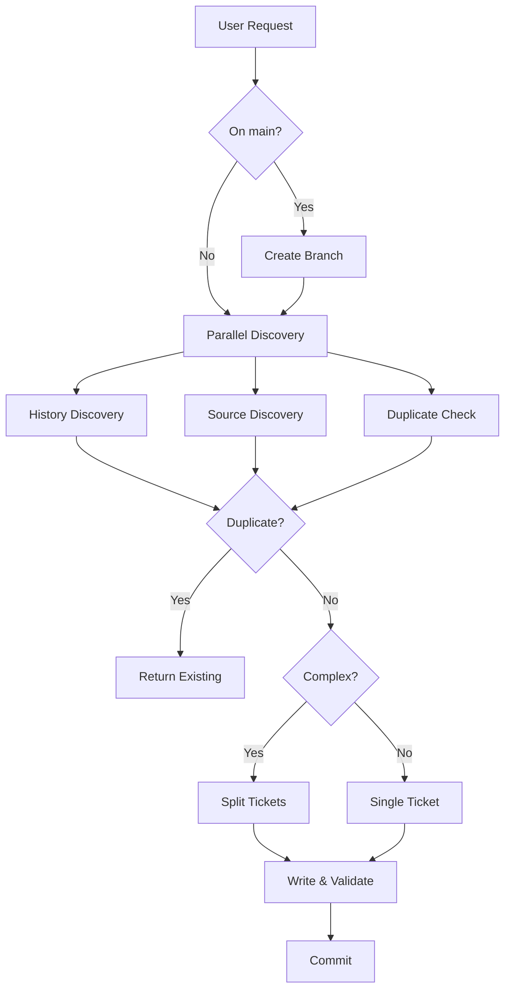
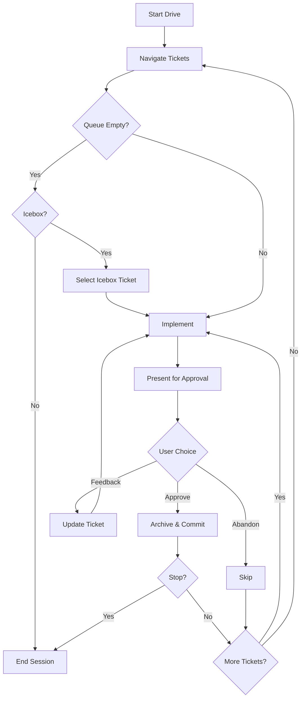
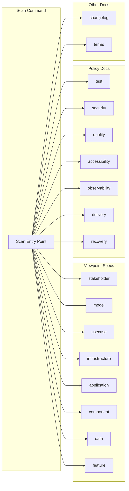
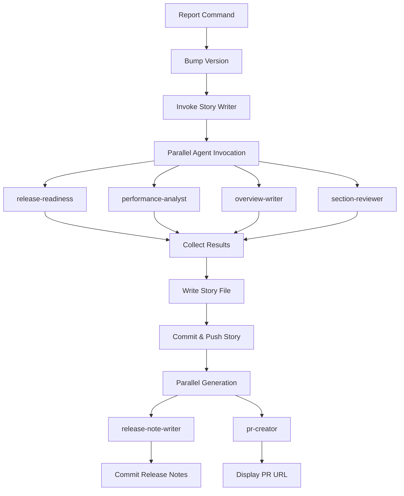
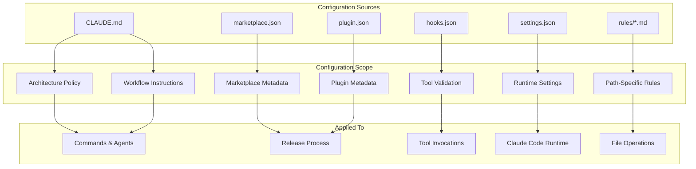
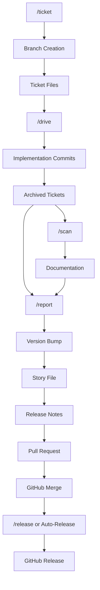

[English](feature.md) | [Japanese](feature_ja.md)

# 1. Feature Viewpoint

The Feature Viewpoint provides a comprehensive inventory of capabilities offered by the Workaholic plugin, documenting what the system can do, how features are configured, and what options are available to users. This specification focuses on functional features, their status, and configuration mechanisms rather than implementation details.

## 2. Command Features

### 2-1. Ticket Creation (`/ticket`)

The ticket command transforms natural language feature requests into structured implementation specifications.

| Feature | Description | Implementation |
| --- | --- | --- |
| Natural language input | Accepts free-form change descriptions | `ticket.md` command |
| Parallel discovery | Explores codebase, tickets, and history concurrently | `ticket-organizer` agent |
| Duplicate detection | Identifies existing tickets for the same change | `ticket-discoverer` agent |
| Related history | Links to historical tickets for context | `history-discoverer` agent |
| Source discovery | Identifies relevant files and code flows | `source-discoverer` agent |
| Automatic ticket splitting | Decomposes complex requests into 2-4 discrete tickets | `ticket-organizer` agent |
| Frontmatter validation | Validates ticket structure on every write | `hooks.json` PostToolUse hook |
| Auto-branch creation | Creates branch when running on main | `manage-branch` skill |
| Author verification | Uses git email, rejects Anthropic addresses | `create-ticket` skill |
| Patch generation | Generates unified diff patches from source snippets | `ticket-organizer` agent |
| Todo/icebox targeting | Routes tickets to todo or icebox directories | `ticket-organizer` agent |

#### Ticket Lifecycle Flow


```mermaid
flowchart TD
    A[User Request] --> B{On main?}
    B -->|Yes| C[Create Branch]
    B -->|No| D[Parallel Discovery]
    C --> D
    D --> E[History Discovery]
    D --> F[Source Discovery]
    D --> G[Duplicate Check]
    E --> H{Duplicate?}
    F --> H
    G --> H
    H -->|Yes| I[Return Existing]
    H -->|No| J{Complex?}
    J -->|Yes| K[Split Tickets]
    J -->|No| L[Single Ticket]
    K --> M[Write & Validate]
    L --> M
    M --> N[Commit]
```

### 2-2. Ticket Implementation (`/drive`)

The drive command implements queued tickets through an approval-gated loop with intelligent prioritization.

| Feature | Description | Implementation |
| --- | --- | --- |
| Intelligent prioritization | Orders tickets by type, layer, and dependencies | `drive-navigator` agent |
| Sequential implementation | Processes tickets one at a time | `drive-workflow` skill |
| Human-in-the-loop approval | Requires explicit approval per ticket | `drive-approval` skill |
| Feedback loop | Accepts free-form feedback for re-implementation | `drive-approval` skill |
| Abandon with analysis | Generates failure analysis on abandon | `drive-approval` skill |
| Final report | Appends implementation summary to ticket | `write-final-report` skill |
| Automatic archival | Archives approved tickets with commit | `archive-ticket` skill |
| Continuous loop | Re-checks for new tickets after each batch | `drive.md` Phase 3 |
| Icebox processing | Optionally processes deferred tickets | `drive-navigator` agent |
| Effort tracking | Records actual implementation time in hours | `update-ticket-frontmatter` skill |
| Session-wide tracking | Maintains counters across multiple batches | `drive.md` Phase 4 |

#### Drive Workflow State Machine


```mermaid
flowchart TD
    A[Start Drive] --> B[Navigate Tickets]
    B --> C{Queue Empty?}
    C -->|Yes| D{Icebox?}
    D -->|Yes| E[Select Icebox Ticket]
    D -->|No| F[End Session]
    E --> G[Implement]
    C -->|No| G
    G --> H[Present for Approval]
    H --> I{User Choice}
    I -->|Approve| J[Archive & Commit]
    I -->|Feedback| K[Update Ticket]
    I -->|Abandon| L[Skip]
    K --> G
    J --> M{Stop?}
    M -->|Yes| F
    M -->|No| N{More Tickets?}
    L --> N
    N -->|Yes| G
    N -->|No| B
```

### 2-3. Documentation Update (`/scan`)

The scan command runs 17 parallel documentation agents to generate comprehensive codebase documentation.

| Feature | Description | Implementation |
| --- | --- | --- |
| 8 viewpoint specs | Architecture analysis from 8 perspectives | 8 `*-analyst` agents |
| 7 policy documents | Repository practice analysis across 7 domains | 7 `*-policy-analyst` agents |
| Changelog generation | Entries from archived tickets by category | `changelog-writer` agent |
| Terms update | Consistent terminology maintenance | `terms-writer` agent |
| Real-time visibility | All 17 agents visible as Task calls | `scan.md` Phase 3 |
| Output validation | Verifies files exist before index update | `validate-writer-output` skill |
| Index synchronization | Updates README files for specs and policies | `scan.md` Phase 5 |
| i18n mirroring | Japanese translations for all documents | `translate` skill |
| Permission control | Explicit `run_in_background: false` for Write/Edit access | `scan.md` Phase 3 |
| Full/partial modes | Adaptive agent selection based on changes | `select-scan-agents` skill |

#### Documentation Agent Matrix

The scan command orchestrates 17 parallel agents organized into 4 categories:

**Viewpoint Analysts (8 agents)**: Generate architectural specifications
- `stakeholder-analyst` - Who uses the system, their goals, interaction patterns
- `model-analyst` - Domain concepts, relationships, core abstractions
- `usecase-analyst` - User workflows, command sequences, input/output contracts
- `infrastructure-analyst` - External dependencies, file system layout, installation
- `application-analyst` - Runtime behavior, agent orchestration, data flow
- `component-analyst` - Internal structure, module boundaries, decomposition
- `data-analyst` - Data formats, frontmatter schemas, naming conventions
- `feature-analyst` - Feature inventory, capability matrix, configuration

**Policy Analysts (7 agents)**: Generate practice documentation
- `test-policy-analyst` - Testing standards and practices
- `security-policy-analyst` - Security requirements and constraints
- `quality-policy-analyst` - Code quality and review processes
- `accessibility-policy-analyst` - Accessibility guidelines
- `observability-policy-analyst` - Monitoring and logging practices
- `delivery-policy-analyst` - Deployment and release processes
- `recovery-policy-analyst` - Backup and disaster recovery

**Documentation Writers (2 agents)**:
- `changelog-writer` - Generates CHANGELOG.md from archived tickets
- `terms-writer` - Maintains consistent terminology definitions


```mermaid
flowchart LR
    subgraph Scan Command
        S[Scan Entry Point]
    end

    subgraph Viewpoint Specs
        V1[stakeholder]
        V2[model]
        V3[usecase]
        V4[infrastructure]
        V5[application]
        V6[component]
        V7[data]
        V8[feature]
    end

    subgraph Policy Docs
        P1[test]
        P2[security]
        P3[quality]
        P4[accessibility]
        P5[observability]
        P6[delivery]
        P7[recovery]
    end

    subgraph Other Docs
        C[changelog]
        T[terms]
    end

    S --> V1 & V2 & V3 & V4 & V5 & V6 & V7 & V8
    S --> P1 & P2 & P3 & P4 & P5 & P6 & P7
    S --> C & T
```

### 2-4. Report Generation (`/report`)

The report command generates a branch story and creates or updates a pull request.

| Feature | Description | Implementation |
| --- | --- | --- |
| Story generation | Narrative development history | `story-writer` agent |
| Release note generation | Concise user-facing notes | `release-note-writer` agent |
| Performance analysis | Decision quality evaluation | `performance-analyst` agent |
| Release readiness | Assesses readiness for release | `release-readiness` agent |
| PR creation/update | GitHub pull request management | `pr-creator` agent |
| Automatic version bump | Increments patch version before story | `report.md` instruction |
| Overview generation | High-level summary and highlights | `overview-writer` agent |
| Section review | Outcome, concerns, ideas, historical analysis | `section-reviewer` agent |

#### Story Generation Workflow


```mermaid
flowchart TD
    A["Report Command"] --> B[Bump Version]
    B --> C[Invoke Story Writer]
    C --> D[Parallel Agent Invocation]
    D --> E[release-readiness]
    D --> F[performance-analyst]
    D --> G[overview-writer]
    D --> H[section-reviewer]
    E --> I[Collect Results]
    F --> I
    G --> I
    H --> I
    I --> J[Write Story File]
    J --> K[Commit & Push Story]
    K --> L[Parallel Generation]
    L --> M[release-note-writer]
    L --> N[pr-creator]
    M --> O[Commit Release Notes]
    N --> P[Display PR URL]
```

### 2-5. Release (`/release`)

The release command manages semantic versioning and triggers GitHub release workflows.

| Feature | Description | Implementation |
| --- | --- | --- |
| Version bump | Increments patch/minor/major | `.claude/commands/release.md` |
| Dual file sync | Updates both manifest files | `marketplace.json` + `plugin.json` |
| Auto-release | GitHub Action creates release on main | `release.yml` workflow |
| Documentation sync | Triggers full scan before release | `release.md` step 9 |
| Multi-plugin support | Updates all plugin versions in marketplace | `release.md` steps 5-8 |

## 3. Cross-Cutting Features

### 3-1. Internationalization (i18n)

Every document in `.workaholic/` must have a corresponding `_ja.md` Japanese translation. The system enforces parallel structure in both languages.

**Implementation**: The `translate` skill provides policies for:
- Preserving code blocks, frontmatter keys, file paths, and URLs
- Translating prose content with formal/polite tone
- Maintaining consistent technical terminology
- Mirroring index README link structures

**Coverage**: All viewpoint specs, policy documents, stories, release notes, changelog, and terms require translations. READMEs must maintain parallel link structures in both languages.

### 3-2. Shell Script Bundling

All multi-step or conditional shell operations are extracted to bundled scripts in `skills/<name>/sh/<script>.sh`. This ensures consistency, testability, and permission-free execution.

**Prohibited in commands/agents**:
- Conditionals (`if`, `case`, `test`, `[ ]`, `[[ ]]`)
- Pipes and chains (`|`, `&&`, `||`)
- Text processing (`sed`, `awk`, `grep`, `cut`)
- Loops (`for`, `while`)
- Variable expansion with logic (`${var:-default}`, `${var:+alt}`)

**Examples of bundled scripts**:
- `gather-git-context/sh/gather.sh` - Git repository context collection
- `select-scan-agents/sh/select.sh` - Agent selection based on changes
- `validate-writer-output/sh/validate.sh` - Output file existence validation
- `gather-ticket-metadata/sh/gather.sh` - Ticket frontmatter metadata generation

### 3-3. Validation

The system includes multiple validation layers to ensure data integrity:

**PostToolUse Hook**: Validates ticket frontmatter structure on every Write/Edit tool invocation. Defined in `plugins/core/hooks/hooks.json`.

**CI Workflow**: GitHub Actions validates JSON manifests and plugin structure on push.

**Output Validation**: The `validate-writer-output` skill verifies documentation files exist before updating index READMEs during scan operations.

**Agent Output Validation**: Story-writer tracks which of its 6 parallel agents succeed or fail, including this status in the final JSON output.

### 3-4. Git Integration

Workaholic manages git operations autonomously during commands:
- Creating topic branches (when running `/ticket` on main)
- Committing changes (after ticket implementation, story generation)
- Pushing to remote (during PR creation)
- Creating pull requests (via `gh` CLI in pr-creator agent)

The root README includes an explicit warning about this autonomous behavior.

### 3-5. Configuration Mechanisms


```mermaid
flowchart TD
    subgraph Configuration Sources
        A[CLAUDE.md]
        B[marketplace.json]
        C[plugin.json]
        D[hooks.json]
        E[settings.json]
        F[rules/*.md]
    end

    subgraph Configuration Scope
        A --> G[Architecture Policy]
        A --> H[Workflow Instructions]
        B --> I[Marketplace Metadata]
        C --> J[Plugin Metadata]
        D --> K[Tool Validation]
        E --> L[Runtime Settings]
        F --> M[Path-Specific Rules]
    end

    subgraph Applied To
        G --> N[Commands & Agents]
        H --> N
        I --> O[Release Process]
        J --> O
        K --> P[Tool Invocations]
        L --> Q[Claude Code Runtime]
        M --> R[File Operations]
    end
```

## 4. Capability Matrix

The system provides a complete ticket-driven development workflow:

| Phase | Capabilities | Status |
| --- | --- | --- |
| **Planning** | Ticket creation, duplicate detection, history discovery, source discovery, automatic splitting | ✓ Active |
| **Implementation** | Sequential drive, approval loop, feedback iteration, automatic archival, effort tracking | ✓ Active |
| **Documentation** | 8 viewpoint specs, 7 policy docs, changelog, terms, i18n mirroring | ✓ Active |
| **Delivery** | Story generation, release notes, PR management, version bumping, release automation | ✓ Active |

### Feature Dependencies


```mermaid
flowchart TD
    A["/ticket"] --> B[Branch Creation]
    B --> C[Ticket Files]
    C --> D["/drive"]
    D --> E[Implementation Commits]
    E --> F[Archived Tickets]
    F --> G["/report"]
    G --> H[Version Bump]
    H --> I[Story File]
    I --> J[Release Notes]
    J --> K[Pull Request]
    K --> L[GitHub Merge]
    L --> M["/release" or Auto-Release]
    M --> N[GitHub Release]

    F --> O["/scan"]
    O --> P[Documentation]
    P --> G
```

## 5. Configuration Options

### 5-1. System Configuration

| Mechanism | Location | Purpose | Scope |
| --- | --- | --- | --- |
| `CLAUDE.md` | Repository root | Project-wide instructions and architecture policy | All commands, agents, skills |
| `marketplace.json` | `.claude-plugin/` | Marketplace metadata and version | Release process |
| `plugin.json` | `plugins/core/.claude-plugin/` | Plugin metadata and version | Release process |
| `hooks.json` | `plugins/core/hooks/` | PostToolUse hook configuration | Tool validation |
| `settings.json` | `.claude/` | Claude Code runtime settings | IDE integration |
| Rule files | `plugins/core/rules/` | Path-specific behavioral constraints | File-scoped operations |

### 5-2. Command Configuration

Commands accept limited runtime arguments:

| Command | Arguments | Options | Default |
| --- | --- | --- | --- |
| `/ticket` | Description | `Target: todo\|icebox` | `todo` |
| `/drive` | Mode | `normal\|icebox` | `normal` |
| `/scan` | None | N/A | Full mode |
| `/report` | None | N/A | N/A |
| `/release` | Bump type | `major\|minor\|patch` | `patch` |

### 5-3. Ticket Metadata Configuration

Ticket frontmatter provides rich metadata for prioritization and tracking:

```yaml
created_at: <ISO 8601 timestamp>    # Automatic from date -Iseconds
author: <git user.email>            # Automatic from git config
type: <enhancement|bugfix|refactoring|housekeeping>  # Manual
layer: [<UX|Domain|Infrastructure|DB|Config>]        # Manual (array)
effort: <numeric hours>             # Filled after implementation
commit_hash: <short hash>           # Filled during archival
category: <Added|Changed|Removed>   # Filled during archival
```

**Type priority ranking** (used by drive-navigator):
1. `bugfix` - High priority
2. `enhancement` - Normal priority
3. `refactoring` - Normal priority
4. `housekeeping` - Low priority

**Layer grouping**: Drive-navigator groups tickets by layer to maximize context efficiency.

### 5-4. Skill Configuration

Skills bundle knowledge and shell scripts. Each skill directory contains:
- `SKILL.md` - Guidelines, templates, and instructions
- `sh/*.sh` - Executable shell scripts for complex operations

Skills are preloaded by commands and agents via frontmatter:

```yaml
skills:
  - gather-git-context
  - select-scan-agents
  - validate-writer-output
```

### 5-5. Rule Configuration

Rules define behavioral constraints scoped by file path patterns:

| Rule | Path Pattern | Constraints |
| --- | --- | --- |
| `general.md` | `**/*` | Never commit without request, never use `git -C`, link markdown files, number headings |
| `diagrams.md` | Documentation files | Mermaid node label quoting, diagram placement policy |
| `i18n.md` | `.workaholic/` | Parallel translation requirement, suffix naming |
| `shell.md` | Commands/agents | Shell script bundling requirement |
| `typescript.md` | `*.ts` files | TypeScript-specific conventions |
| `workaholic.md` | `.workaholic/` | Ticket structure, viewpoint format, story format |

## 6. Feature Status

All documented features are actively implemented and maintained. The system has no deprecated features or planned removals as of commit `d627919`.

### Recent Feature Changes

Based on archived tickets from branch `drive-20260208-131649`:

**Added**:
- Scanner subagent logic migrated into `/scan` command for real-time visibility
- Explicit `run_in_background: false` constraint for scan agent Task calls
- Automatic version bump in `/report` command before story generation

**Removed**:
- `/story` command (replaced by `/scan` + `/report` workflow)
- `scanner` subagent (logic inlined into `/scan` command)

**Changed**:
- Scan command grew from ~17 lines to ~90 lines (Phase 1-7 workflow)
- Policy analyst files no longer use badge system for status indicators

## 7. Assumptions

- [Explicit] The 5 commands, 29 agents, 29 skills, and 6 rules are counted from the structure output provided by the gather-context script.
- [Explicit] The `/release` command exists as `.claude/commands/release.md` rather than in the core plugin, indicating it may be handled at the marketplace level.
- [Explicit] The ticket metadata schema (7 frontmatter fields) is defined in `create-ticket` skill and validated by the PostToolUse hook.
- [Explicit] The scan command orchestrates exactly 17 agents (8 viewpoint + 7 policy + 2 writers) as documented in `scan.md` Phase 3.
- [Explicit] Recent tickets confirm the scanner subagent was removed and its logic migrated into the scan command for user-visible progress.
- [Inferred] The feature set has evolved through iterative development, with the current architecture favoring thin commands/agents and comprehensive skills.
- [Inferred] Configuration options are intentionally minimal at runtime, with most customization happening through markdown skill files and CLAUDE.md project instructions.
- [Inferred] The automatic version bump in `/report` (added in ticket `20260208133008`) ensures every PR triggers a release via GitHub Actions, reducing manual release command usage.
