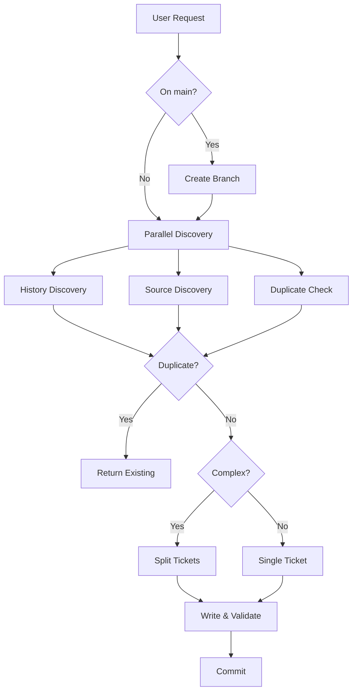
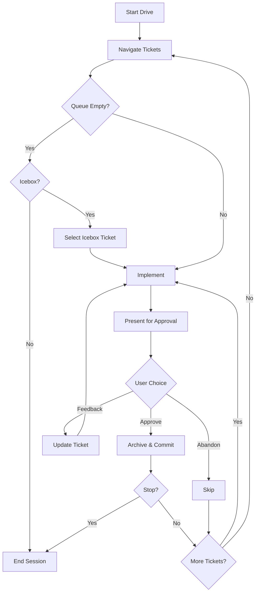
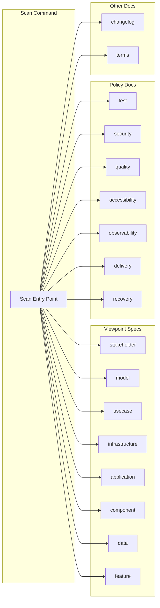
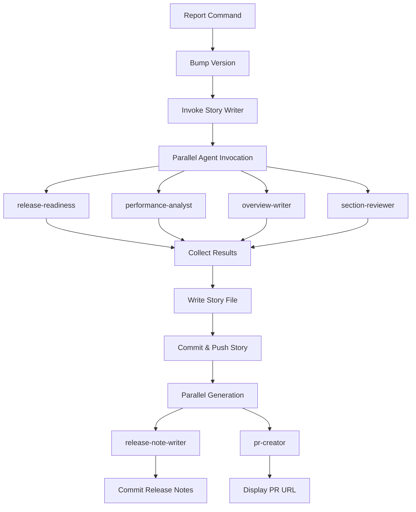
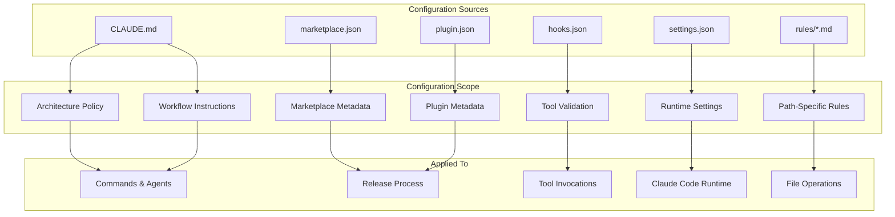
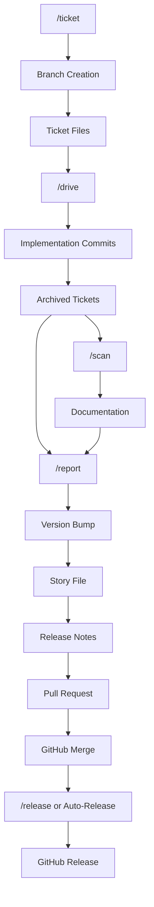

[English](feature.md) | [Japanese](feature_ja.md)

# 1. Feature Viewpoint

Feature Viewpoint は、Workaholic plugin が提供する capability の包括的な一覧を示し、system が何をできるか、feature がどのように設定されるか、user にどのような option が利用可能かを文書化します。この specification は実装の詳細ではなく、機能的な feature、その status、設定メカニズムに焦点を当てます。

## 2. Command Features

### 2-1. Ticket Creation (`/ticket`)

ticket command は自然言語の feature request を構造化された実装 specification に変換します。

| Feature | Description | Implementation |
| --- | --- | --- |
| Natural language input | 自由形式の変更説明を受け付ける | `ticket.md` command |
| Parallel discovery | codebase、ticket、history を並行して探索 | `ticket-organizer` agent |
| Duplicate detection | 同じ変更に対する既存 ticket を識別 | `ticket-discoverer` agent |
| Related history | context のために過去の ticket にリンク | `history-discoverer` agent |
| Source discovery | 関連する file と code flow を識別 | `source-discoverer` agent |
| Automatic ticket splitting | 複雑な request を2-4個の独立した ticket に分解 | `ticket-organizer` agent |
| Frontmatter validation | 書き込みごとに ticket 構造を検証 | `hooks.json` PostToolUse hook |
| Auto-branch creation | main で実行時に branch を作成 | `manage-branch` skill |
| Author verification | git email を使用、Anthropic address を拒否 | `create-ticket` skill |
| Patch generation | source snippet から unified diff patch を生成 | `ticket-organizer` agent |
| Todo/icebox targeting | ticket を todo または icebox directory にルーティング | `ticket-organizer` agent |

#### Ticket Lifecycle Flow



### 2-2. Ticket Implementation (`/drive`)

drive command は intelligent な優先順位付けを行い、approval で制御される loop を通じてキューの ticket を実装します。

| Feature | Description | Implementation |
| --- | --- | --- |
| Intelligent prioritization | type、layer、依存関係で ticket を順序付け | `drive-navigator` agent |
| Sequential implementation | ticket を一つずつ処理 | `drive-workflow` skill |
| Human-in-the-loop approval | ticket ごとに明示的な承認を要求 | `drive-approval` skill |
| Feedback loop | 再実装のための自由形式 feedback を受け付け | `drive-approval` skill |
| Abandon with analysis | 放棄時に失敗分析を生成 | `drive-approval` skill |
| Final report | ticket に実装概要を追記 | `write-final-report` skill |
| Automatic archival | 承認された ticket を commit とともに archive | `archive-ticket` skill |
| Continuous loop | 各 batch 後に新しい ticket を再確認 | `drive.md` Phase 3 |
| Icebox processing | 延期された ticket を option で処理 | `drive-navigator` agent |
| Effort tracking | 実際の実装時間を時間単位で記録 | `update-ticket-frontmatter` skill |
| Session-wide tracking | 複数 batch にわたってカウンタを維持 | `drive.md` Phase 4 |

#### Drive Workflow State Machine



### 2-3. Documentation Update (`/scan`)

scan command は17個の並列 documentation agent を実行して包括的な codebase documentation を生成します。

| Feature | Description | Implementation |
| --- | --- | --- |
| 8 viewpoint specs | 8つの視点からの architecture 分析 | 8 `*-analyst` agents |
| 7 policy documents | 7つの domain にわたる repository practice 分析 | 7 `*-policy-analyst` agents |
| Changelog generation | archive された ticket から category 別のエントリ | `changelog-writer` agent |
| Terms update | 一貫した terminology のメンテナンス | `terms-writer` agent |
| Real-time visibility | 17個すべての agent が Task call として可視化 | `scan.md` Phase 3 |
| Output validation | index 更新前に file の存在を検証 | `validate-writer-output` skill |
| Index synchronization | spec と policy の README file を更新 | `scan.md` Phase 5 |
| i18n mirroring | すべての document の日本語翻訳 | `translate` skill |
| Permission control | Write/Edit access のために明示的に `run_in_background: false` | `scan.md` Phase 3 |
| Full/partial modes | 変更に基づく adaptive な agent 選択 | `select-scan-agents` skill |

#### Documentation Agent Matrix

scan command は4つの category に整理された17個の並列 agent を orchestrate します:

**Viewpoint Analysts (8 agents)**: architectural specification を生成
- `stakeholder-analyst` - system を使用する人、彼らの目標、interaction pattern
- `model-analyst` - domain concept、関係性、core abstraction
- `usecase-analyst` - user workflow、command sequence、入出力 contract
- `infrastructure-analyst` - 外部依存、file system layout、installation
- `application-analyst` - runtime behavior、agent orchestration、data flow
- `component-analyst` - 内部構造、module 境界、分解
- `data-analyst` - data format、frontmatter schema、naming convention
- `feature-analyst` - feature 一覧、capability matrix、設定

**Policy Analysts (7 agents)**: practice documentation を生成
- `test-policy-analyst` - testing 標準と実践
- `security-policy-analyst` - security 要件と制約
- `quality-policy-analyst` - code quality と review process
- `accessibility-policy-analyst` - accessibility guideline
- `observability-policy-analyst` - monitoring と logging 実践
- `delivery-policy-analyst` - deployment と release process
- `recovery-policy-analyst` - backup と disaster recovery

**Documentation Writers (2 agents)**:
- `changelog-writer` - archive された ticket から CHANGELOG.md を生成
- `terms-writer` - 一貫した terminology 定義を維持



### 2-4. Report Generation (`/report`)

report command は branch story を生成し、pull request を作成または更新します。

| Feature | Description | Implementation |
| --- | --- | --- |
| Story generation | 物語形式の開発履歴 | `story-writer` agent |
| Release note generation | 簡潔な user 向け note | `release-note-writer` agent |
| Performance analysis | 意思決定の質の評価 | `performance-analyst` agent |
| Release readiness | release 準備状況の評価 | `release-readiness` agent |
| PR creation/update | GitHub pull request 管理 | `pr-creator` agent |
| Automatic version bump | story 前に patch version を increment | `report.md` instruction |
| Overview generation | 高レベルの要約と highlight | `overview-writer` agent |
| Section review | outcome、concern、idea、historical analysis | `section-reviewer` agent |

#### Story Generation Workflow



### 2-5. Release (`/release`)

release command は semantic versioning を管理し、GitHub release workflow をトリガーします。

| Feature | Description | Implementation |
| --- | --- | --- |
| Version bump | patch/minor/major を increment | `.claude/commands/release.md` |
| Dual file sync | 両方の manifest file を更新 | `marketplace.json` + `plugin.json` |
| Auto-release | main での GitHub Action が release を作成 | `release.yml` workflow |
| Documentation sync | release 前に full scan をトリガー | `release.md` step 9 |
| Multi-plugin support | marketplace 内のすべての plugin version を更新 | `release.md` steps 5-8 |

## 3. Cross-Cutting Features

### 3-1. Internationalization (i18n)

`.workaholic/` 内のすべての document は対応する `_ja.md` の日本語翻訳を持つ必要があります。system は両言語で並列構造を強制します。

**Implementation**: `translate` skill が以下のための policy を提供:
- code block、frontmatter key、file path、URL の保持
- formal/polite tone での prose content の翻訳
- 一貫した技術 terminology の維持
- index README link 構造の mirror

**Coverage**: すべての viewpoint spec、policy document、story、release note、changelog、terms が翻訳を必要とします。README は両言語で並列 link 構造を維持する必要があります。

### 3-2. Shell Script Bundling

すべての複数 step または条件付き shell operation は `skills/<name>/sh/<script>.sh` の bundled script に抽出されます。これにより、一貫性、testability、permission 不要の実行が保証されます。

**commands/agents で禁止**:
- Conditionals (`if`, `case`, `test`, `[ ]`, `[[ ]]`)
- Pipes and chains (`|`, `&&`, `||`)
- Text processing (`sed`, `awk`, `grep`, `cut`)
- Loops (`for`, `while`)
- Variable expansion with logic (`${var:-default}`, `${var:+alt}`)

**bundled script の例**:
- `gather-git-context/sh/gather.sh` - Git repository context 収集
- `select-scan-agents/sh/select.sh` - 変更に基づく agent 選択
- `validate-writer-output/sh/validate.sh` - output file 存在検証
- `gather-ticket-metadata/sh/gather.sh` - ticket frontmatter metadata 生成

### 3-3. Validation

system には data integrity を保証する複数の validation layer が含まれます:

**PostToolUse Hook**: すべての Write/Edit tool 呼び出しで ticket frontmatter 構造を検証します。`plugins/core/hooks/hooks.json` で定義されています。

**CI Workflow**: GitHub Actions が push 時に JSON manifest と plugin 構造を検証します。

**Output Validation**: `validate-writer-output` skill は scan operation 中に index README を更新する前に documentation file の存在を検証します。

**Agent Output Validation**: story-writer は6つの並列 agent のどれが成功または失敗したかを追跡し、この status を最終 JSON output に含めます。

### 3-4. Git Integration

Workaholic は command 中に git operation を自律的に管理します:
- topic branch の作成 (main で `/ticket` を実行時)
- 変更の commit (ticket 実装後、story 生成後)
- remote への push (PR 作成中)
- pull request の作成 (pr-creator agent で `gh` CLI 経由)

root の README にこの自律的な動作に関する明示的な警告が含まれています。

### 3-5. Configuration Mechanisms



## 4. Capability Matrix

system は完全な ticket 駆動開発 workflow を提供します:

| Phase | Capabilities | Status |
| --- | --- | --- |
| **Planning** | ticket 作成、重複検出、history 発見、source 発見、自動分割 | ✓ Active |
| **Implementation** | 順次 drive、approval loop、feedback 反復、自動 archival、effort 追跡 | ✓ Active |
| **Documentation** | 8 viewpoint spec、7 policy doc、changelog、terms、i18n mirroring | ✓ Active |
| **Delivery** | story 生成、release note、PR 管理、version bumping、release 自動化 | ✓ Active |

### Feature Dependencies



## 5. Configuration Options

### 5-1. System Configuration

| Mechanism | Location | Purpose | Scope |
| --- | --- | --- | --- |
| `CLAUDE.md` | repository root | project 全体の instruction と architecture policy | すべての command、agent、skill |
| `marketplace.json` | `.claude-plugin/` | marketplace metadata と version | release process |
| `plugin.json` | `plugins/core/.claude-plugin/` | plugin metadata と version | release process |
| `hooks.json` | `plugins/core/hooks/` | PostToolUse hook 設定 | tool validation |
| `settings.json` | `.claude/` | Claude Code runtime 設定 | IDE integration |
| Rule files | `plugins/core/rules/` | path 固有の behavioral 制約 | file スコープの operation |

### 5-2. Command Configuration

command は限定的な runtime argument を受け付けます:

| Command | Arguments | Options | Default |
| --- | --- | --- | --- |
| `/ticket` | Description | `Target: todo\|icebox` | `todo` |
| `/drive` | Mode | `normal\|icebox` | `normal` |
| `/scan` | None | N/A | Full mode |
| `/report` | None | N/A | N/A |
| `/release` | Bump type | `major\|minor\|patch` | `patch` |

### 5-3. Ticket Metadata Configuration

ticket frontmatter は優先順位付けと追跡のための豊富な metadata を提供します:

```yaml
created_at: <ISO 8601 timestamp>    # date -Iseconds から自動
author: <git user.email>            # git config から自動
type: <enhancement|bugfix|refactoring|housekeeping>  # Manual
layer: [<UX|Domain|Infrastructure|DB|Config>]        # Manual (array)
effort: <numeric hours>             # 実装後に記入
commit_hash: <short hash>           # archival 中に記入
category: <Added|Changed|Removed>   # archival 中に記入
```

**Type priority ranking** (drive-navigator で使用):
1. `bugfix` - High priority
2. `enhancement` - Normal priority
3. `refactoring` - Normal priority
4. `housekeeping` - Low priority

**Layer grouping**: drive-navigator は context 効率を最大化するために layer で ticket をグループ化します。

### 5-4. Skill Configuration

skill は知識と shell script を bundle します。各 skill directory には以下が含まれます:
- `SKILL.md` - guideline、template、instruction
- `sh/*.sh` - 複雑な operation のための実行可能 shell script

skill は frontmatter を通じて command と agent によって preload されます:

```yaml
skills:
  - gather-git-context
  - select-scan-agents
  - validate-writer-output
```

### 5-5. Rule Configuration

rule は file path pattern によってスコープされた behavioral 制約を定義します:

| Rule | Path Pattern | Constraints |
| --- | --- | --- |
| `general.md` | `**/*` | request なしで commit しない、`git -C` を使用しない、markdown file をリンク、heading に番号付け |
| `diagrams.md` | documentation file | Mermaid node label の引用符、diagram 配置 policy |
| `i18n.md` | `.workaholic/` | 並列翻訳要件、suffix 命名 |
| `shell.md` | command/agent | shell script bundling 要件 |
| `typescript.md` | `*.ts` file | TypeScript 固有の convention |
| `workaholic.md` | `.workaholic/` | ticket 構造、viewpoint format、story format |

## 6. Feature Status

すべて文書化された feature は commit `d627919` 時点でアクティブに実装および維持されています。system には deprecated feature や計画された削除はありません。

### Recent Feature Changes

branch `drive-20260208-131649` の archive された ticket に基づく:

**Added**:
- scanner subagent の logic を `/scan` command に移行し、real-time visibility を実現
- scan agent の Task call のための明示的な `run_in_background: false` 制約
- story 生成前の `/report` command での自動 version bump

**Removed**:
- `/story` command (`/scan` + `/report` workflow で置き換え)
- `scanner` subagent (logic が `/scan` command に inline 化)

**Changed**:
- scan command が約17行から約90行に増加 (Phase 1-7 workflow)
- policy analyst file が status indicator に badge system を使用しなくなった

## 7. Assumptions

- [Explicit] 5個の command、29個の agent、29個の skill、6個の rule は gather-context script が提供する structure output から数えられています。
- [Explicit] `/release` command は core plugin ではなく `.claude/commands/release.md` として存在し、marketplace level で処理される可能性を示しています。
- [Explicit] ticket metadata schema (7個の frontmatter field) は `create-ticket` skill で定義され、PostToolUse hook で検証されます。
- [Explicit] scan command は `scan.md` Phase 3 で文書化されているとおり、正確に17個の agent (8 viewpoint + 7 policy + 2 writer) を orchestrate します。
- [Explicit] 最近の ticket は scanner subagent が削除され、その logic が user 可視の進捗のために scan command に移行されたことを確認しています。
- [Inferred] feature set は反復的な開発を通じて進化してきており、現在の architecture は thin な command/agent と包括的な skill を好んでいます。
- [Inferred] 設定 option は runtime で意図的に最小限であり、ほとんどのカスタマイズは markdown skill file と CLAUDE.md project instruction を通じて行われます。
- [Inferred] `/report` での自動 version bump (ticket `20260208133008` で追加) により、すべての PR が GitHub Actions を通じて release をトリガーし、手動の release command 使用を削減します。
