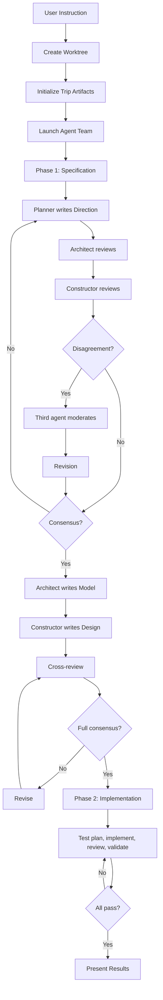

[English](feature.md) | [Japanese](feature_ja.md)

# Feature Viewpoint

Feature Viewpoint は、Workaholic marketplace が提供する機能の包括的なインベントリを提供し、システムが何をできるか、機能がどのように設定されるか、ユーザーに利用可能なオプションは何かを文書化します。Marketplace は現在 2 つの plugin を含んでいます：drivin は ticket 駆動の開発 workflow と戦略的ドキュメントスキャンを提供し、trippin は 3 agent 協働に基づく AI 指向の探索 workflow を提供します。

## Drivin Plugin の機能

### Ticket 作成 (`/ticket`)

自然言語の機能リクエストを構造化された実装仕様に変換します。

| 機能 | 説明 | 実装 |
| --- | --- | --- |
| 自然言語入力 | 自由形式の変更説明を受け入れ | `ticket.md` command |
| 並列 discovery | コードベース、ticket、履歴を同時に探索 | `ticket-organizer` agent |
| 重複検出 | 同じ変更に対する既存 ticket を識別 | `ticket-discoverer` agent |
| 関連履歴 | コンテキストのための履歴 ticket にリンク | `history-discoverer` agent |
| ソース discovery | 関連ファイルとコードフローを識別 | `source-discoverer` agent |
| 自動 ticket 分割 | 複雑なリクエストを 2-4 の個別 ticket に分解 | `ticket-organizer` agent |
| Frontmatter 検証 | すべての書き込みで ticket 構造を検証 | `hooks.json` PostToolUse hook |
| 自動ブランチ作成 | main 上で実行時にブランチを作成 | `branching` skill |

### Ticket 実装 (`/drive`)

承認ゲート付きのループによる知的な優先順位付けでキューの ticket を実装します。

| 機能 | 説明 | 実装 |
| --- | --- | --- |
| 知的な優先順位付け | タイプ、レイヤー、依存関係で ticket を順序付け | `drive-navigator` agent |
| 逐次実装 | ticket を一つずつ処理 | `drive-workflow` skill |
| Human-in-the-loop 承認 | ticket ごとに明示的な承認が必要 | `drive-approval` skill |
| コンテキスト豊富な承認プロンプト | すべての承認ダイアログに ticket タイトルと概要が必要 | `drive-approval` skill（CRITICAL 強制） |
| フィードバックループ | 再実装のための自由形式フィードバックを受け入れ | `drive-approval` skill |
| フィードバック時のコンテキスト保持 | フィードバックループでコンテキストが失われた場合 ticket ファイルを再読み取り | `drive-approval` skill |
| 最終レポート | ticket に実装サマリーを追加 | `write-final-report` skill |
| 自動アーカイブ | 承認された ticket を commit とともにアーカイブ | `archive-ticket` skill |
| 拡張された commit メッセージ | Motivation、UX changes、Architecture changes | `commit` skill |

### ドキュメント更新 (`/scan`)

2 フェーズの agent オーケストレーションでコードベースの包括的なドキュメントを生成します。

| 機能 | 説明 | 実装 |
| --- | --- | --- |
| 2 フェーズ実行 | Manager が先、次に leader/writer | `scan.md` Phase 3a/3b |
| 3 manager agent | プロジェクト、アーキテクチャ、品質コンテキストを確立 | Manager tier agent |
| 11 leader agent | ドメイン固有のポリシー分析 | Leader tier agent |
| 2 writer agent | Changelog と用語の生成 | Writer agent |
| 出力検証 | index 更新前にファイルの存在を検証 | `validate-writer-output` skill |
| i18n ミラーリング | すべてのドキュメントに日本語翻訳 | `translate` skill |
| 4 viewpoint spec | Application、component、feature、usecase | `architecture-manager` agent |
| 7 policy ドキュメント | Test、security、quality、a11y、observability、delivery、recovery | 7 leader agent |

### Report 生成 (`/report`)

ブランチ story を生成し、pull request を作成/更新します。

| 機能 | 説明 | 実装 |
| --- | --- | --- |
| Story 生成 | 開発履歴のナラティブ | `story-writer` agent |
| Release note 生成 | 簡潔なユーザー向けノート | `release-note-writer` agent |
| べき等バージョンバンプ | story の前に patch バージョンをインクリメント、既にバンプされている場合はスキップ | `report.md` + `branching/sh/check-version-bump.sh` |
| PR 作成/更新 | GitHub pull request 管理 | `pr-creator` agent |
| マルチ plugin バージョン同期 | すべての plugin バージョンを一緒に更新 | `report.md` バージョンバンプロジック |

## Trippin Plugin の機能

### 探索セッション (`/trip`)

創造的な探索と開発のための協働 Agent Teams セッションを起動します。

| 機能 | 説明 | 実装 |
| --- | --- | --- |
| Agent Teams 統合 | 3 メンバーの協働チームを作成 | `trip.md` command |
| Worktree 隔離 | 安全性のために専用 git worktree で実行 | `ensure-worktree.sh` script |
| 3 agent 協働 | 異なるスタンスを持つ Planner、Architect、Constructor | 3 agent 定義 |
| 2 フェーズ workflow | Specification（inner loop）次に implementation（outer loop） | `trip-protocol` skill |
| バージョン管理された artifact | Direction、Model、Design（v1、v2 等） | `trip-protocol` skill |
| Commit-per-step | すべての離散的ステップが git commit を生成 | `trip-commit.sh` script |
| 調停プロトコル | 第 3 の agent が不一致を仲裁 | `trip-protocol` skill |
| コンセンサスゲート | フェーズ移行前にすべての agent が承認する必要あり | `trip-protocol` skill |
| Artifact フォーマット | author、status、reviewed-by を含む構造化 markdown | `trip-protocol` skill |

#### Trip Workflow

#### Agent 哲学マトリクス

| Agent | スタンス | Artifact | Phase 1 の役割 | Phase 2 の役割 |
| --- | --- | --- | --- | --- |
| Planner | Progressive | Direction | 創造的ビジョンをリード | テスト計画と検証 |
| Architect | Neutral | Model | 構造的一貫性 | コードレビュー |
| Constructor | Conservative | Design | 実現可能性レビュー | 実装 |

## 横断的機能

### 国際化 (i18n)

`.workaholic/` 内のドキュメントは、root CLAUDE.md で宣言された consumer project の主要言語に基づく翻訳が必要です。`translate` skill が動的翻訳ロジックを提供します。

### Shell Script バンドリング

すべてのマルチステップまたは条件付き shell 操作が `skills/<name>/sh/<script>.sh` のバンドルされた script に抽出されます。両 plugin がこのパターンに従います。

### マルチ Plugin アーキテクチャ

Marketplace は同期されたバージョニングで複数の plugin をサポートします：

| Plugin | Command | 目的 |
| --- | --- | --- |
| drivin | `/ticket`、`/drive`、`/scan`、`/report` | 開発 workflow |
| trippin | `/trip` | 探索 workflow |

同期するバージョンファイル：
- `.claude-plugin/marketplace.json` - root バージョン
- `plugins/drivin/.claude-plugin/plugin.json` - drivin バージョン
- `plugins/trippin/.claude-plugin/plugin.json` - trippin バージョン

## Capability Matrix

| フェーズ | Drivin の機能 | ステータス |
| --- | --- | --- |
| **Planning** | Ticket 作成、重複検出、履歴 discovery、ソース discovery、自動分割 | Active |
| **Strategic** | プロジェクトコンテキスト、アーキテクチャ構造、品質基準、制約設定 | Active |
| **Implementation** | 逐次 drive、承認ループ、フィードバック反復、自動アーカイブ、工数追跡 | Active |
| **Documentation** | 2 フェーズスキャン、4 viewpoint spec、7 policy ドキュメント、changelog、terms、i18n | Active |
| **Delivery** | Story 生成、release note、PR 管理、バージョンバンプ、リリース自動化 | Active |

| フェーズ | Trippin の機能 | ステータス |
| --- | --- | --- |
| **Exploration** | Agent Teams セッション、worktree 隔離、3 agent 協働 | Active |
| **Specification** | Direction、Model、Design artifact、コンセンサスゲート、調停プロトコル | Active |
| **Implementation** | テスト計画、構築、構造レビュー、テスト検証 | Active |
| **Traceability** | Commit-per-step、バージョン管理された artifact、branch 隔離 | Active |

## 設定オプション

### Command 設定

| Command | Plugin | 引数 | オプション | デフォルト |
| --- | --- | --- | --- | --- |
| `/ticket` | drivin | 説明 | `Target: todo\|icebox` | `todo` |
| `/drive` | drivin | モード | `normal\|icebox` | `normal` |
| `/scan` | drivin | なし | N/A | Full mode |
| `/report` | drivin | なし | N/A | N/A |
| `/release` | drivin | バンプタイプ | `major\|minor\|patch` | `patch` |
| `/trip` | trippin | インストラクション | N/A | N/A |

### Trip セッション設定

| メカニズム | 目的 |
| --- | --- |
| `CLAUDE_CODE_EXPERIMENTAL_AGENT_TEAMS=1` | Agent Teams 機能の有効化に必要 |
| Trip 名（自動生成） | タイムスタンプベースの一意識別子 |
| Worktree パス | `.worktrees/<trip-name>/` |
| Trip artifact パス | `.workaholic/.trips/<trip-name>/` |
| Branch 名 | `trip/<trip-name>` |

## 機能ステータス

すべての文書化された機能は commit `f76bde2` 時点でアクティブに実装され維持されています。

### 最近の機能変更

Branch `drive-20260302-213941` のアーカイブ ticket に基づく：

**追加**:
- Trippin plugin：`/trip` command、3 agent、trip-protocol skill、3 shell script
- Agent Teams 統合
- Worktree 隔離
- Commit-per-step トレーサビリティ
- 調停プロトコルとコンセンサスゲート

**変更**:
- Core plugin を drivin に名称変更（ディレクトリ、すべての参照、subagent_type prefix）
- Marketplace を 1 plugin から 2 plugin に拡張
- Drive 承認強制を IMPORTANT から CRITICAL に升格
- バージョン管理を 3 つのバージョンファイル追跡に拡張

## Assumptions

- [Explicit] Drivin plugin は 4 command、28 agent、45 skill、6 rule を持ち、ファイルシステムリストから数えています。
- [Explicit] Trippin plugin は 1 command、3 agent、1 skill、0 rule を持ち、ファイルシステムリストから数えています。
- [Explicit] Marketplace は同期されたバージョン 1.0.38 で両 plugin を登録しています。
- [Explicit] Trip command は Agent Teams の実験的機能フラグを必要とします。
- [Explicit] Core plugin は drivin に名称変更され、ticket 20260302215035 に文書化されています。
- [Explicit] Trippin plugin は ticket 20260302215036 と 20260309214650 に文書化されている通り作成されました。
- [Inferred] Trippin plugin は drivin を補完する新しいカテゴリの workflow（探索 vs 開発）を表しています。
- [Inferred] Trippin の Agent Teams モデルは、創造的探索が drivin で使用される階層的 Task tool モデルよりもピア協働に適しているため選択されました。
