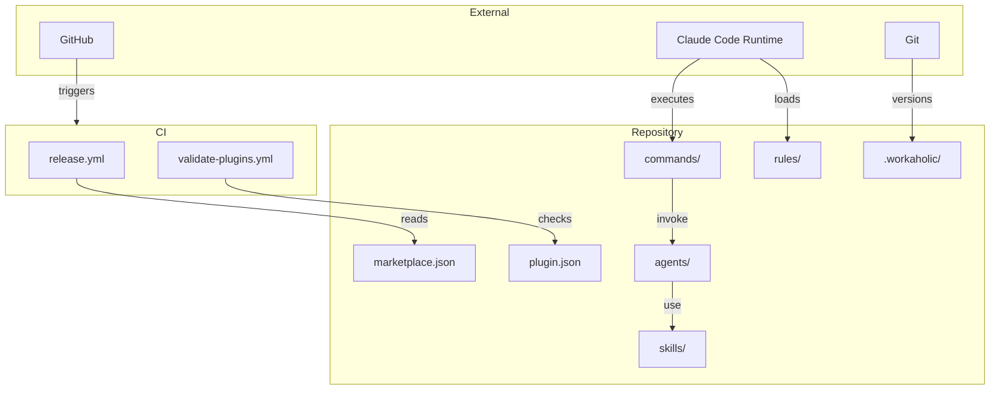

[English](infrastructure.md) | [Japanese](infrastructure_ja.md)

# 1. Infrastructure Viewpoint

The Infrastructure Viewpoint documents the external dependencies, file system layout, runtime environment, and installation mechanisms that support the Workaholic plugin system. Workaholic is a pure configuration and documentation project with no build step, relying entirely on Claude Code's plugin infrastructure and git for execution and versioning.

## 2. External Dependencies

### 2-1. Runtime Environment

Workaholic requires Claude Code as its host environment. All commands, subagents, and skills execute within Claude Code's agent runtime. Shell scripts bundled in skills use POSIX `sh` (not bash-specific features) for compatibility, including Alpine Docker environments. The system depends on `git` for version control, `gh` (GitHub CLI) for PR creation, and standard Unix utilities (`date`, `ls`, `find`, `grep`, `sed`).

### 2-2. GitHub Integration

The repository is hosted at `https://github.com/qmu/workaholic`. Two GitHub Actions workflows are configured: `release.yml` triggers on pushes to `main` or manual dispatch to create GitHub Releases, and `validate-plugins.yml` runs on pushes and pull requests to `main` to validate JSON manifests and plugin structure.

### 2-3. No Build Step

There is no package manager, no compilation step, and no runtime dependencies beyond Claude Code itself. The project consists entirely of markdown files, JSON configuration, and shell scripts. Type checking is not required.

## 3. File System Layout

```
workaholic/
  .claude-plugin/
    marketplace.json          # Marketplace metadata (name, version, plugins list)
  .claude/
    commands/                 # Symlinked from plugins at install time
    settings.json             # Claude Code settings
  .github/
    workflows/
      release.yml             # Auto-release on main push
      validate-plugins.yml    # JSON and structure validation
  .workaholic/
    guides/                   # User documentation (commands, workflow, getting started)
    policies/                 # Policy documents (7 domains)
    release-notes/            # Generated release notes
    specs/                    # Architecture specs (8 viewpoints + legacy)
    stories/                  # Development narratives per branch
    terms/                    # Term definitions (5 category files)
    tickets/
      todo/                   # Pending tickets
      archive/<branch>/       # Completed tickets by branch
      icebox/                 # Deferred tickets
      abandoned/              # Failed/abandoned tickets
  plugins/
    core/
      .claude-plugin/
        plugin.json           # Plugin manifest (name, version, author)
      agents/                 # 30 subagent definitions
      commands/               # 4 command definitions (drive, report, scan, ticket)
      hooks/
        hooks.json            # PostToolUse hook for ticket validation
        validate-ticket.sh    # Ticket frontmatter validator
      rules/                  # 6 rule files
      skills/                 # 28 skill directories with SKILL.md and sh/ scripts
      README.md               # Plugin documentation
  CHANGELOG.md                # Root changelog
  CLAUDE.md                   # Project instructions for Claude Code
  README.md                   # Project readme
```

## 4. Installation

Plugin installation is a single command: `claude /plugin marketplace add qmu/workaholic`. This installs the plugin from the marketplace registry. After installation, Claude Code symlinks the plugin's commands, agents, skills, and rules into `.claude/` for runtime access. The plugin auto-updates on subsequent sessions if auto-update is enabled.

## 5. Version Management

Two version files must stay synchronized:
- `.claude-plugin/marketplace.json` -- root `version` field (currently `1.0.32`)
- `plugins/core/.claude-plugin/plugin.json` -- plugin `version` field (currently `1.0.32`)

The `/release` command bumps both files simultaneously and creates a commit. The GitHub Action then creates a release when the bumped version reaches `main`.

## 6. Diagram



## 7. Assumptions

- [Explicit] No build step is required, as stated in `CLAUDE.md` under "Type Checking".
- [Explicit] Version files must be kept in sync, as documented in `CLAUDE.md` under "Version Management".
- [Explicit] Two GitHub Actions workflows exist in `.github/workflows/`.
- [Explicit] Shell scripts use POSIX sh for compatibility, as enforced by the shell rule.
- [Inferred] The `.claude/` directory is managed by Claude Code at runtime and should not be edited directly, based on the `CLAUDE.md` instruction "Edit `plugins/` not `.claude/`".
- [Inferred] Plugin auto-update is handled by the Claude Code marketplace infrastructure, not by Workaholic itself.
