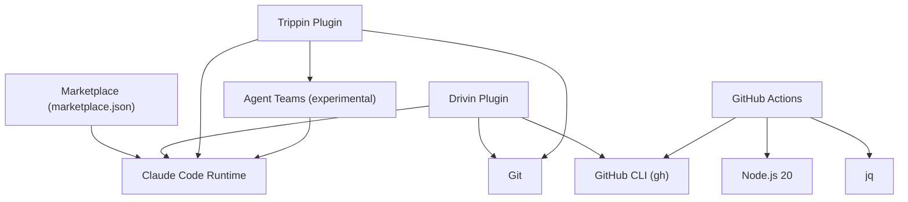
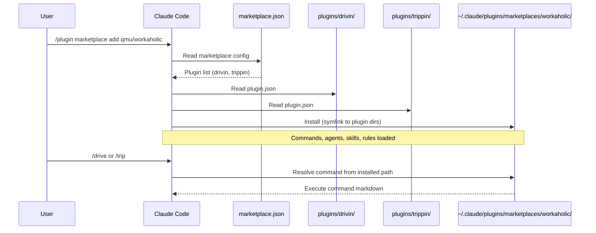

[English](infrastructure.md) | [Japanese](infrastructure_ja.md)

# Infrastructure Viewpoint

This viewpoint describes the external dependencies, file system organization, installation procedures, and runtime environment requirements for the Workaholic plugin system. Workaholic is a Claude Code plugin marketplace that provides ticket-driven development workflows through a layered architecture of commands, subagents, skills, and rules.

## External Dependencies

Workaholic relies on the Claude Code plugin system as its runtime environment and integrates with several external tools and services for version control, continuous integration, and package management.

### Claude Code Runtime

The plugin system requires Claude Code as its host environment. Claude Code provides the plugin loading mechanism, command dispatch, subagent invocation via Task tool, and permission management through hooks. The marketplace configuration at `.claude-plugin/marketplace.json` specifies the marketplace metadata, version, and plugin list that Claude Code uses to load the plugins.

Each plugin directory contains a `.claude-plugin/plugin.json` file that defines plugin metadata including name, version, description, and author information. This configuration follows the Claude Code plugin specification format.

### Version Control Tools

Git is a required dependency used throughout the system for branch management, commit operations, and repository context gathering. Shell scripts in skills directories execute git commands to extract branch names, base branches, commit hashes, and repository URLs. The system assumes a remote named `origin` exists and follows a trunk-based workflow with a default branch (typically `main`).

The GitHub CLI tool (`gh`) is used by the create-pr skill for creating and updating pull requests programmatically. The release workflow in `.github/workflows/release.yml` also uses `gh` to create GitHub releases with version tags.

### Build and Validation Tools

Node.js version 20 is required for the GitHub Actions validation workflow. The validation pipeline uses `jq` for JSON parsing and validation of configuration files including `marketplace.json` and `plugin.json`.

The system has no build step requirement for the plugins themselves, as they consist entirely of markdown configuration files and shell scripts. There are no compilation or transpilation steps.

### External Dependency Graph


```mermaid
graph TD
    CC["Claude Code Runtime"]
    MP["Marketplace (marketplace.json)"]
    DR["Drivin Plugin"]
    TR["Trippin Plugin"]
    GIT["Git"]
    GH["GitHub CLI (gh)"]
    GA["GitHub Actions"]
    NODE["Node.js 20"]
    JQ["jq"]
    AT["Agent Teams (experimental)"]

    MP --> CC
    DR --> CC
    TR --> CC
    TR --> AT
    AT --> CC
    DR --> GIT
    TR --> GIT
    DR --> GH
    GA --> NODE
    GA --> JQ
    GA --> GH
```

This diagram shows the runtime and build-time dependency relationships. The drivin and trippin plugins both depend on Claude Code and Git. The trippin plugin additionally requires the experimental Agent Teams feature. GitHub Actions CI depends on Node.js 20, jq, and gh for validation and release workflows.

### Continuous Integration Platform

GitHub Actions provides the CI/CD infrastructure with two workflows:

1. **validate-plugins.yml** runs on push and pull request events to validate JSON configuration files, check required fields, verify skill file existence, and ensure marketplace plugins match directory structure.

2. **release.yml** runs on push to main branch and workflow dispatch events. It compares the version in `marketplace.json` against the latest GitHub release, extracts release notes from `.workaholic/release-notes/`, and creates a new GitHub release with version tag if needed.

## File System Layout

The repository follows a dual-directory structure that separates plugin source code from working artifacts.

### Root Directory Structure

```
/
├── .claude/                 # Claude Code configuration (symlink target)
│   ├── commands/            # Symlinked from plugins/drivin/commands/
│   ├── rules/               # Repository-scoped enforcement rules
│   │   └── define-lead.md   # Lead agent schema enforcement
│   ├── settings.json        # Claude Code permissions (denies git -C)
│   └── settings.local.json  # Local environment overrides
├── .claude-plugin/          # Marketplace configuration
│   └── marketplace.json     # Version and plugin registry
├── .github/                 # CI/CD workflows
│   └── workflows/
│       ├── release.yml      # Automated release creation
│       └── validate-plugins.yml  # Plugin validation on PR
├── .workaholic/             # Working artifacts (user/developer docs)
│   ├── guides/              # User-facing documentation
│   ├── policies/            # Policy analysis documents
│   ├── release-notes/       # Generated release notes
│   ├── specs/               # Viewpoint-based architecture specs
│   ├── stories/             # Development narratives per branch
│   ├── terms/               # Consistent term definitions
│   └── tickets/             # Work queue and archives
│       ├── todo/            # Pending implementation tickets
│       ├── icebox/          # Deferred tickets
│       ├── archive/         # Completed tickets by branch
│       └── abandoned/       # Cancelled tickets
├── plugins/                 # Plugin source directories
│   ├── drivin/              # Drivin development plugin
│   │   ├── .claude-plugin/  # Plugin metadata
│   │   │   └── plugin.json  # Plugin configuration
│   │   ├── agents/          # Subagent definitions (markdown)
│   │   ├── commands/        # Command definitions (markdown)
│   │   ├── hooks/           # PostToolUse hooks
│   │   │   ├── hooks.json   # Hook configuration
│   │   │   └── validate-ticket.sh  # Ticket validation hook
│   │   ├── rules/           # Global rules (markdown)
│   │   └── skills/          # Reusable knowledge modules
│   │       └── <skill-name>/
│   │           ├── SKILL.md  # Skill documentation
│   │           └── sh/       # Bundled shell scripts
│   │               └── *.sh  # Executable scripts
│   └── trippin/             # Trippin exploration plugin
│       ├── .claude-plugin/  # Plugin metadata
│       │   └── plugin.json  # Plugin configuration
│       ├── agents/          # Agent Teams agent definitions
│       ├── commands/        # Command definitions (trip.md)
│       ├── rules/           # (empty, .gitkeep only)
│       └── skills/          # Knowledge modules
│           └── trip-protocol/
│               ├── SKILL.md  # Protocol documentation
│               └── sh/       # Bundled shell scripts
├── CHANGELOG.md             # Auto-generated changelog
├── CLAUDE.md                # Project instructions for Claude Code
└── README.md                # User-facing documentation
```

This structure reflects the principle that plugin development happens in `plugins/` directories, while Claude Code reads from `.claude/` through symlinks established during plugin installation.

### Directory Purpose Classification

The file system layout separates concerns into three categories:

**Configuration directories** (`.claude/`, `.claude-plugin/`, `.github/`) contain environment configuration, marketplace metadata, and CI/CD workflows. These define how the system integrates with its runtime environment.

**Working artifact directories** (`.workaholic/`) store generated documentation, tickets, and development narratives. These are version-controlled outputs that provide context for future development decisions. The working artifacts have semantic distinctions:

- `constraints/` — Manager-generated prescriptive boundaries that narrow decision space (e.g., release cadence, layer boundary rules, test coverage thresholds)
- `policies/` — Leader-generated observational documentation of current practices (e.g., security measures, testing strategy, deployment procedures)
- `specs/` — Architecture viewpoint documentation generated by managers, model-analyst, and ux-lead
- `terms/` — Consistent term definitions extracted from codebase by terms-writer
- `tickets/` — Work queue and implementation history in todo, archive, icebox, and abandoned directories
- `stories/` — Development narratives per branch for PR descriptions
- `release-notes/` — Concise release notes for GitHub releases
- `guides/` — User-facing documentation

**Source directories** (`plugins/drivin/` and `plugins/trippin/`) contain the plugin implementations including commands, subagents, skills, rules, and hooks. These are the authoritative source for plugin behavior. The drivin plugin provides the ticket-driven development workflow, while the trippin plugin provides an AI-oriented exploration workflow using Agent Teams.

### Schema Enforcement Rules

The `.claude/rules/` directory contains path-scoped schema enforcement rules that validate agent and skill structure. These rules are loaded by Claude Code and apply automatically to matching file paths.

#### Lead Agent Schema

The `define-lead.md` rule enforces the structure of lead agent skills and agent files:

- **Skill path scope**: `plugins/drivin/skills/lead-*/SKILL.md`
- **Agent path scope**: `plugins/drivin/agents/*-lead.md`
- **Required sections**: Role, Responsibility, Default Policies (Implementation, Review, Documentation, Execution)

Examples following this schema include `lead-infra`, `lead-security`, `lead-quality`, `lead-test`, `lead-a11y`, `lead-db`, `lead-delivery`, `lead-recovery`, `lead-observability`, `lead-ux`.

### Skill Directory Structure Pattern

Skills follow a standardized layout that bundles documentation with executable shell scripts:

```
skills/<skill-name>/
├── SKILL.md              # Markdown documentation with frontmatter
└── sh/                   # Shell script directory
    ├── <action>.sh       # Primary script (e.g., gather.sh, validate.sh)
    └── ...               # Additional helper scripts if needed
```

Each skill's `SKILL.md` includes frontmatter specifying the skill name, description, allowed tools, and user-invocability. The bundled shell scripts in `sh/` directories provide permission-free execution of complex multi-step operations that would violate the shell script principle if written inline in command or subagent markdown files.

#### Skill Categories by Purpose

Skills serve four distinct purposes in the architecture:

**Lead domain skills** define role-specific responsibilities and policies. These skills are preloaded by agents and never invoked by users directly. The four leading skills (`leading-validity`, `leading-availability`, `leading-security`, `leading-accessibility`) cover logical comprehensiveness, operational continuity, preservation of trust, and universal reach respectively.

**Cross-cutting policy skills** define behavioral policies that apply across multiple agents. The `leaders-principle` skill provides Prior Term Consistency and Vendor Neutrality rules for all lead agents.

**Workflow operation skills** orchestrate multi-step processes with bundled shell scripts. Examples include `gather-git-context` (outputs JSON with branch, base_branch, repo_url) and `gather-ticket-metadata` (outputs JSON with date, author, filename timestamp).

**Documentation generation skills** provide templates and guidelines for writing structured documents. Examples include `write-spec` (viewpoint-based architecture specs), `analyze-viewpoint` (generic viewpoint analysis framework), and `translate` (i18n policies for markdown files).

### Symlink Architecture

The `.claude/` directory serves as the Claude Code plugin installation target. When the marketplace plugins are installed, Claude Code creates symlinks from `.claude/` to the actual plugin source directories. This allows the repository to maintain plugin source separately from the Claude Code configuration directory while enabling Claude Code to load the plugins correctly.

For each plugin, Claude Code establishes symlinks:

```
# Drivin plugin
~/.claude/plugins/marketplaces/workaholic/plugins/drivin/commands/
~/.claude/plugins/marketplaces/workaholic/plugins/drivin/agents/
~/.claude/plugins/marketplaces/workaholic/plugins/drivin/skills/
~/.claude/plugins/marketplaces/workaholic/plugins/drivin/rules/

# Trippin plugin
~/.claude/plugins/marketplaces/workaholic/plugins/trippin/commands/
~/.claude/plugins/marketplaces/workaholic/plugins/trippin/agents/
~/.claude/plugins/marketplaces/workaholic/plugins/trippin/skills/
```

This architecture enables development to happen in `plugins/` while Claude Code operates on its installed plugin paths, following the critical rule stated in `CLAUDE.md`: "Edit `plugins/` not `.claude/`."

### Plugin Installation and Runtime Flow


```mermaid
sequenceDiagram
    participant U as User
    participant CC as Claude Code
    participant MJ as marketplace.json
    participant PD as plugins/drivin/
    participant PT as plugins/trippin/
    participant IP as ~/.claude/plugins/marketplaces/workaholic/

    U->>CC: /plugin marketplace add qmu/workaholic
    CC->>MJ: Read marketplace config
    MJ-->>CC: Plugin list (drivin, trippin)
    CC->>PD: Read plugin.json
    CC->>PT: Read plugin.json
    CC->>IP: Install (symlink to plugin dirs)
    Note over CC,IP: Commands, agents, skills, rules loaded
    U->>CC: /drive or /trip
    CC->>IP: Resolve command from installed path
    IP-->>CC: Execute command markdown
```

This sequence diagram illustrates how plugins flow from marketplace registration through installation to runtime command resolution. The installed path (`~/.claude/plugins/marketplaces/workaholic/`) serves as the runtime reference while development edits happen in `plugins/`.

## Installation

Installation occurs through the Claude Code plugin marketplace system using the `/plugin` command interface.

### Installation Command

Users install the Workaholic marketplace using:

```bash
claude
/plugin marketplace add qmu/workaholic
```

This command instructs Claude Code to fetch the marketplace configuration from the repository, parse the `marketplace.json` file, and register the marketplace. The marketplace reference `qmu/workaholic` maps to the GitHub repository `tamurayoshiya/workaholic` based on the owner email `a@qmu.jp`.

### Plugin Activation

After marketplace installation, users must enable the plugin through the Claude Code interface. The plugin system supports auto-update mode, which is recommended to receive new versions automatically as they are released.

When enabled, Claude Code:

1. Creates the `.claude/` directory if it doesn't exist
2. Establishes symlinks from `.claude/` to `plugins/drivin/` subdirectories
3. Loads command definitions from `commands/*.md` files
4. Registers subagents from `agents/*.md` files
5. Makes skills available at runtime from `skills/*/SKILL.md` files
6. Applies global rules from `rules/*.md` files
7. Installs PostToolUse hooks from `hooks/hooks.json`

### Hook Installation

The plugin installs a PostToolUse hook that validates ticket file format and location after Write or Edit operations. The hook configuration in `plugins/drivin/hooks/hooks.json` specifies a matcher for Write and Edit tools and executes the `validate-ticket.sh` script with a 10-second timeout.

This hook enforces ticket naming conventions (YYYYMMDDHHmmss-*.md pattern) and location constraints (must be in `todo/`, `icebox/`, or `archive/<branch>/` directories). The validation script checks frontmatter fields including `created_at` (ISO 8601 format), `author` (email format, rejecting anthropic.com domains), `type` (enhancement/bugfix/refactoring/housekeeping), `layer` (UX/Domain/Infrastructure/DB/Config), `effort` (0.1h/0.25h/0.5h/1h/2h/4h), `commit_hash` (7-40 hex characters), and `category` (Added/Changed/Removed).

### Configuration Files

The installation process creates or updates several configuration files:

**`.claude/settings.json`** contains permission settings. The default configuration denies the bash command pattern `git -C:*` to prevent directory-scoped git operations that could bypass the shell script principle.

**`.claude/settings.local.json`** allows developers to override settings locally without affecting the version-controlled configuration. This file is listed in `.gitignore`.

### Version Synchronization

The installation validates that versions are synchronized across:

- `.claude-plugin/marketplace.json` root `version` field
- `plugins/drivin/.claude-plugin/plugin.json` drivin plugin `version` field
- `plugins/trippin/.claude-plugin/plugin.json` trippin plugin `version` field

All three files must specify the same version number (currently `1.0.38`). Version bumps update all files simultaneously to maintain consistency.

## Environment Requirements

The system requires specific runtime environments and file system permissions to operate correctly.

### Runtime Platform

Claude Code must be running on a POSIX-compatible system with a bash or zsh shell. The bundled shell scripts in skills use `/bin/sh -eu` shebang with POSIX-compliant syntax, ensuring compatibility across different Unix-like environments.

The system has been tested on macOS (Darwin 24.6.0) but should work on Linux distributions that provide bash, git, and standard Unix utilities.

### Required Shell Utilities

Scripts depend on standard Unix utilities being available in the PATH:

- `git` for version control operations
- `jq` for JSON parsing in validation workflows and hook scripts
- `sed`, `grep`, `cut`, `tr`, `awk` for text processing
- `date` for timestamp generation
- `mkdir`, `mv`, `ls` for file system operations
- `cat`, `echo` for output generation

The shell scripts assume these utilities follow standard behavior and exit codes. The `gather-git-context` script uses POSIX-compliant sed syntax for URL transformation and JSON escaping. The `validate-ticket.sh` hook uses bash-specific features like `[[ ]]` conditionals and regex matching.

### Git Repository Requirements

The system must operate within a Git repository with:

- A remote named `origin` pointing to a GitHub repository
- A default branch (typically `main`) configured as the HEAD branch
- Write access to create branches, commit changes, and push to remote
- The repository must not be in a detached HEAD state during ticket operations

The archive-ticket skill validates that a named branch exists before archiving tickets, preventing data loss from detached HEAD scenarios. The gather-git-context script extracts the base branch from `git remote show origin` and transforms SSH URLs to HTTPS format for display purposes.

### File System Permissions

The system requires read/write access to:

- `.workaholic/` directory and all subdirectories for storing tickets, specs, guides, policies, terms, stories, and release notes
- `CHANGELOG.md` for automated changelog updates
- `CLAUDE.md`, `README.md`, `plugins/drivin/README.md`, and `plugins/trippin/README.md` for documentation updates
- `.claude-plugin/marketplace.json`, `plugins/drivin/.claude-plugin/plugin.json`, and `plugins/trippin/.claude-plugin/plugin.json` for version management

The PostToolUse hook requires execute permission on `plugins/drivin/hooks/validate-ticket.sh` to validate ticket writes. All bundled shell scripts in `plugins/drivin/skills/*/sh/` directories require execute permissions.

### GitHub Authentication

The release workflow and create-pr skill require GitHub authentication through the `GITHUB_TOKEN` secret. GitHub Actions provides this automatically in CI environments. Local development requires the `gh` CLI tool to be authenticated via `gh auth login`.

### Permission Model

Claude Code enforces permissions through the settings.json configuration. The default permission model:

- **Denies**: `git -C` commands to prevent directory-scoped git operations
- **Allows**: All other Bash commands including direct git commands in the current directory
- **Validates**: Write and Edit operations on `.workaholic/tickets/` files through PostToolUse hooks

This permission model enforces the shell script principle by making complex inline git operations impractical, encouraging developers to extract logic into bundled skill scripts instead.

### Environment Variables

Shell scripts use standard environment variables:

- `CLAUDE_PLUGIN_ROOT` is set by Claude Code to point to the plugin directory, used by hooks to locate the validation script
- Standard git environment variables (GIT_AUTHOR_NAME, GIT_AUTHOR_EMAIL, etc.) are respected for commit operations

No custom environment variables are required for basic drivin operation. The trippin plugin's `/trip` command requires `CLAUDE_CODE_EXPERIMENTAL_AGENT_TEAMS=1` to enable the Agent Teams feature.

### Agent Orchestration

The standards plugin exposes a single parameterized `lead` agent that loads the matching `leading-<domain>` skill based on its prompt parameter. The four leading skills (`leading-validity`, `leading-availability`, `leading-security`, `leading-accessibility`) are also preloaded directly into work-plugin commands and orchestrators (`/drive`, `ticket-organizer`, `planner`, `architect`, `constructor`) via the soft cross-plugin reference pattern, so policy lenses are available wherever scoping or implementation happens. Leads derive their viewpoint directly from the codebase rather than from any upstream context source.

## Assumptions

[Explicit] The `.claude-plugin/marketplace.json` file specifies version 1.0.38 with two plugins (drivin, trippin) and owner email a@qmu.jp.

[Explicit] GitHub Actions workflows in `.github/workflows/` require Node.js 20 and use `jq` for JSON validation, as specified in the workflow YAML files.

[Explicit] Shell scripts use `/bin/sh -eu` shebang and POSIX-compliant syntax, as observed in `gather-git-context/sh/gather.sh`. The ticket validation hook uses `/bin/bash` for bash-specific regex features.

[Explicit] The PostToolUse hook configuration in `plugins/drivin/hooks/hooks.json` validates Write and Edit operations with a 10-second timeout.

[Explicit] The `.claude/settings.json` file explicitly denies the Bash command pattern `git -C:*`.

[Explicit] The parameterized `lead` agent preloads `leaders-principle` together with all four `leading-*` skills.

[Inferred] The symlink architecture from `.claude/` to `plugins/drivin/` is inferred from the project structure rule "Edit `plugins/` not `.claude/`" and the marketplace installation pattern, though no explicit symlink creation code was observed.

[Inferred] The GitHub CLI tool (`gh`) is required for PR creation based on the create-pr skill referencing `gh pr create` commands, though no explicit installation documentation exists.

[Inferred] The release workflow extracts release notes from the most recently modified file in `.workaholic/release-notes/` based on the workflow script logic `ls -t .workaholic/release-notes/*.md | grep -v README.md | head -1`.

[Inferred] The permission model prioritizes shell script extraction over inline conditionals based on the architecture policy in `CLAUDE.md` prohibiting complex inline commands, enforced through the `git -C` denial pattern.

[Inferred] The ticket validation hook prevents accidental ticket writes to arbitrary locations by enforcing path constraints, ensuring tickets remain organized in the designated directories.

[Inferred] An earlier strategic-context tier was retired in favor of preloading leading skills directly into the work plugin's commands and orchestrators, reflecting that intermediate context artifacts had limited practical uptake compared to the simpler direct-preload model.

[Explicit] The trippin plugin requires the experimental Agent Teams feature flag `CLAUDE_CODE_EXPERIMENTAL_AGENT_TEAMS=1`, as documented in trip.md.

[Explicit] The trippin plugin uses git worktrees for session isolation, creating `.worktrees/<trip-name>/` directories with `trip/<trip-name>` branches.

[Explicit] The marketplace now contains two plugins (drivin and trippin) with synchronized versions, as shown in marketplace.json.

[Inferred] The expansion from a single-plugin to a multi-plugin marketplace validates the CI infrastructure's use of glob patterns (`plugins/*/.claude-plugin/plugin.json`) for validation.
