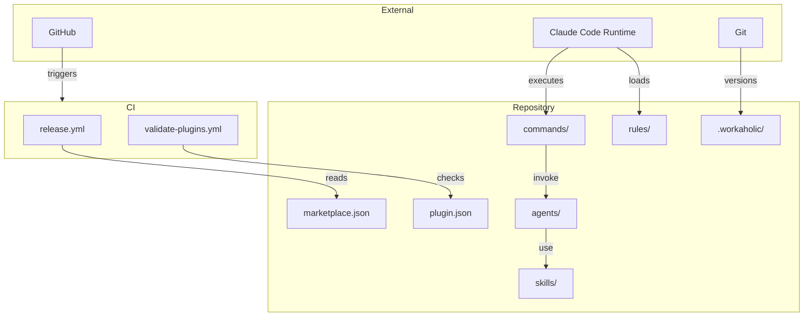

[English](infrastructure.md) | [Japanese](infrastructure_ja.md)

# 1. Infrastructure Viewpoint

Infrastructure Viewpoint は、Workaholic plugin システムを支える外部依存関係、ファイルシステムレイアウト、ランタイム環境、インストールメカニズムを文書化します。Workaholic はビルドステップのない純粋な設定・ドキュメントプロジェクトであり、実行とバージョニングに Claude Code の plugin インフラストラクチャと git に完全に依存しています。

## 2. External Dependencies

### 2-1. Runtime Environment

Workaholic はホスト環境として Claude Code を必要とします。すべての command、subagent、skill は Claude Code のエージェントランタイム内で実行されます。Skill にバンドルされた shell script は Alpine Docker 環境を含む互換性のため POSIX `sh` を使用します。システムは `git`、`gh`（GitHub CLI）、標準 Unix ユーティリティ（`date`、`ls`、`find`、`grep`、`sed`）に依存します。

### 2-2. GitHub Integration

リポジトリは `https://github.com/qmu/workaholic` でホストされています。2つの GitHub Actions workflow が設定されています：`release.yml` は `main` へのプッシュまたは手動ディスパッチで GitHub Release を作成し、`validate-plugins.yml` は `main` へのプッシュと pull request で JSON マニフェストと plugin 構造を検証します。

### 2-3. No Build Step

パッケージマネージャー、コンパイルステップ、Claude Code 自体以外のランタイム依存関係はありません。プロジェクトは完全に markdown ファイル、JSON 設定、shell script で構成されています。

## 3. File System Layout

```
workaholic/
  .claude-plugin/
    marketplace.json          # Marketplace メタデータ
  .claude/
    commands/                 # インストール時に plugins からシンボリックリンク
    settings.json             # Claude Code 設定
  .github/
    workflows/
      release.yml             # main プッシュ時の自動リリース
      validate-plugins.yml    # JSON と構造の検証
  .workaholic/
    guides/                   # ユーザードキュメント
    policies/                 # ポリシードキュメント（7ドメイン）
    release-notes/            # 生成されたリリースノート
    specs/                    # アーキテクチャ spec（8 viewpoint + レガシー）
    stories/                  # ブランチごとの開発ナラティブ
    terms/                    # 用語定義（5カテゴリファイル）
    tickets/
      todo/                   # 保留中の ticket
      archive/<branch>/       # ブランチ別の完了した ticket
      icebox/                 # 延期された ticket
      abandoned/              # 失敗/放棄された ticket
  plugins/
    core/
      .claude-plugin/
        plugin.json           # Plugin マニフェスト
      agents/                 # 30の subagent 定義
      commands/               # 4つの command 定義
      hooks/                  # PostToolUse hook
      rules/                  # 6つの rule ファイル
      skills/                 # 28の skill ディレクトリ
  CHANGELOG.md                # ルート changelog
  CLAUDE.md                   # Claude Code 向けプロジェクト指示
  README.md                   # プロジェクト readme
```

## 4. Installation

Plugin のインストールは単一 command です：`claude /plugin marketplace add qmu/workaholic`。インストール後、Claude Code は plugin の command、agent、skill、rule を `.claude/` にシンボリックリンクしてランタイムアクセスを可能にします。

## 5. Version Management

2つのバージョンファイルを同期させる必要があります：
- `.claude-plugin/marketplace.json` -- ルートの `version` フィールド（現在 `1.0.32`）
- `plugins/core/.claude-plugin/plugin.json` -- plugin の `version` フィールド（現在 `1.0.32`）

## 6. Diagram



## 7. Assumptions

- [Explicit] ビルドステップは不要です。`CLAUDE.md` の "Type Checking" に記載されています。
- [Explicit] バージョンファイルは同期を維持する必要があります。`CLAUDE.md` の "Version Management" に文書化されています。
- [Explicit] `.github/workflows/` に2つの GitHub Actions workflow が存在します。
- [Explicit] shell script は互換性のため POSIX sh を使用します。shell rule で強制されています。
- [Inferred] `.claude/` ディレクトリは Claude Code によってランタイム時に管理され、直接編集すべきではありません。`CLAUDE.md` の "Edit `plugins/` not `.claude/`" 指示に基づきます。
- [Inferred] plugin の自動更新は Workaholic 自体ではなく Claude Code marketplace インフラストラクチャによって処理されます。
