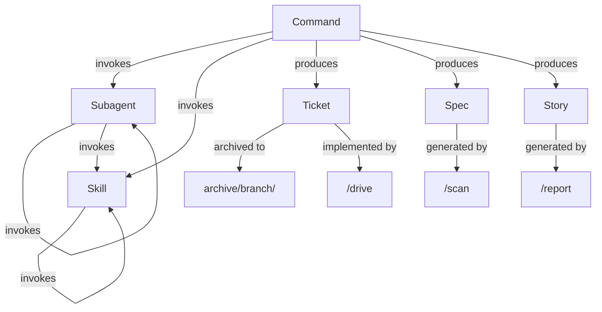

[English](model.md) | [Japanese](model_ja.md)

# 1. Model Viewpoint

The Model Viewpoint describes the core domain concepts in Workaholic, their relationships, and the abstractions that govern how the system organizes work. Workaholic operates on a small but precisely defined domain model where tickets drive implementation, specs document results, and a layered component architecture governs behavior.

## 2. Core Domain Concepts

### 2-1. Ticket

A ticket is a markdown file in `.workaholic/tickets/` that describes a change request. It contains YAML frontmatter with fields including `created_at`, `author`, `type` (feature, fix, refactor, chore), `layer`, `effort`, `category` (Added, Changed, Removed), and `commit_hash`. Tickets flow through a lifecycle: created in `todo/`, implemented during `/drive`, and archived to `archive/<branch-name>/` after approval. Abandoned tickets move to `abandoned/`. Unimplemented tickets may be placed in `icebox/` with explicit developer consent. The ticket is the atomic unit of work in the system.

### 2-2. Spec

A spec is a markdown document in `.workaholic/specs/` that captures the current state of the system. Unlike tickets which describe what should change, specs describe what exists now. Specs use viewpoint-based architecture, with 8 viewpoints (stakeholder, model, usecase, infrastructure, application, component, data, feature) each analyzing the codebase from a different perspective. Specs include YAML frontmatter with `title`, `description`, `category`, `modified_at`, and `commit_hash`.

### 2-3. Policy

A policy is a markdown document in `.workaholic/policies/` that describes repository practices across 7 domains: test, security, quality, accessibility, observability, delivery, and recovery. Policies document what exists and identify gaps, using `[Explicit]` and `[Inferred]` markers for findings. Policy files follow the same frontmatter conventions as specs.

### 2-4. Plugin

A plugin is a distributable unit within the marketplace. The Workaholic marketplace (`marketplace.json`) currently contains one plugin: `core`. A plugin consists of commands, agents (subagents), skills, and rules, organized in a `.claude-plugin/plugin.json` manifest. Plugins are installed via `claude /plugin marketplace add qmu/workaholic`.

### 2-5. Command

A command is a slash-invocable entry point (e.g., `/ticket`, `/drive`, `/scan`, `/report`). Commands are thin orchestration layers (approximately 50-100 lines) that invoke subagents and skills. Commands live in `plugins/core/commands/`. A command can invoke skills and subagents but is the topmost orchestration unit.

### 2-6. Subagent

A subagent is a focused AI agent invoked by commands or other subagents via the Task tool. Subagents are thin orchestration layers (approximately 20-40 lines) defined in `plugins/core/agents/`. They preload skills for domain knowledge and can invoke other subagents or skills. Subagents cannot invoke commands.

### 2-7. Skill

A skill is the knowledge layer of the system, containing templates, guidelines, rules, and bundled shell scripts. Skills are comprehensive (approximately 50-150 lines), live in `plugins/core/skills/`, and may include an `sh/` directory with POSIX shell scripts. Skills can invoke other skills but cannot invoke subagents or commands.

### 2-8. Rule

A rule is a system-wide behavioral constraint applied via path patterns. Rules live in `plugins/core/rules/` and include general guidelines, diagram policies, i18n requirements, shell scripting standards, TypeScript conventions, and workaholic directory conventions.

## 3. Relationships

## 4. Domain Invariants

The domain enforces several invariants that constrain how concepts relate to each other. Tickets must always have valid frontmatter validated by a PostToolUse hook (`hooks.json`). The nesting hierarchy is strict: commands at the top, subagents in the middle, skills at the bottom. Every document in `.workaholic/` must have a corresponding `_ja.md` translation. Files in `.workaholic/` are the only files that may contain Japanese content; all other content must be in English.

## 5. Assumptions

- [Explicit] The nesting hierarchy (command > subagent > skill) is documented in `CLAUDE.md` with a clear table.
- [Explicit] Ticket frontmatter fields are validated by the PostToolUse hook defined in `hooks/hooks.json`.
- [Explicit] The marketplace currently contains exactly one plugin (`core`), as seen in `marketplace.json`.
- [Inferred] The domain model is deliberately simple and flat, favoring markdown files over database structures, to maintain compatibility with git versioning and Claude Code's file-based tooling.
- [Inferred] The "thin orchestration, comprehensive knowledge" pattern reflects a design decision to keep agent behavior deterministic by centralizing domain knowledge in skills rather than distributing it across agents.
