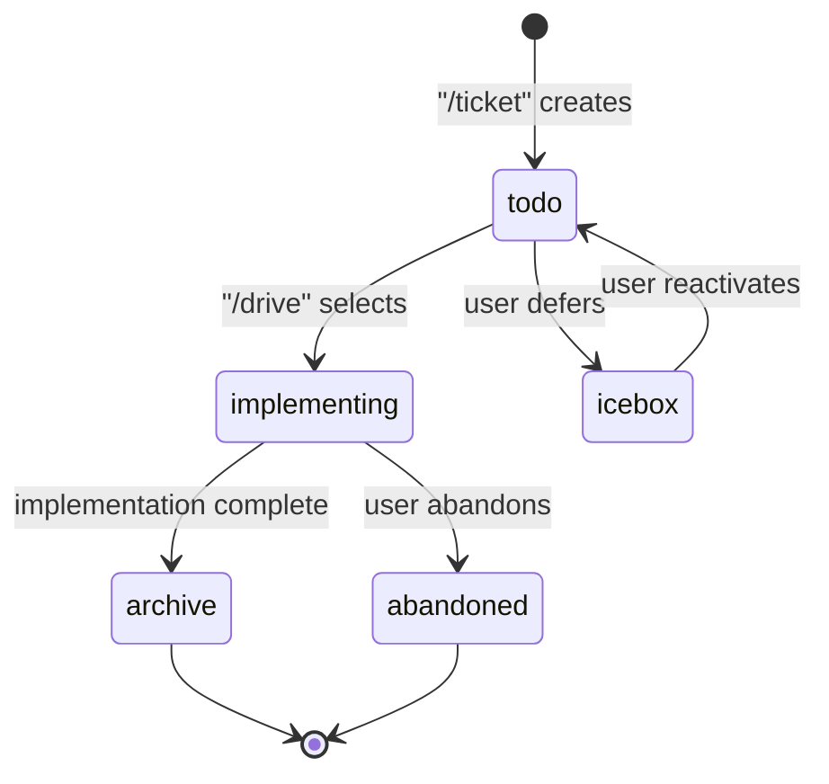
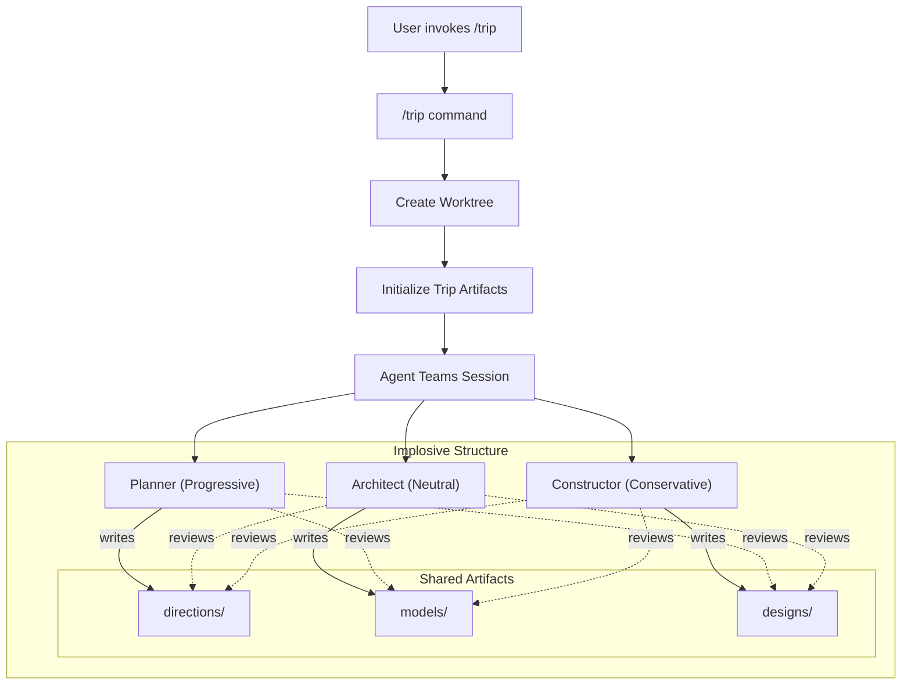
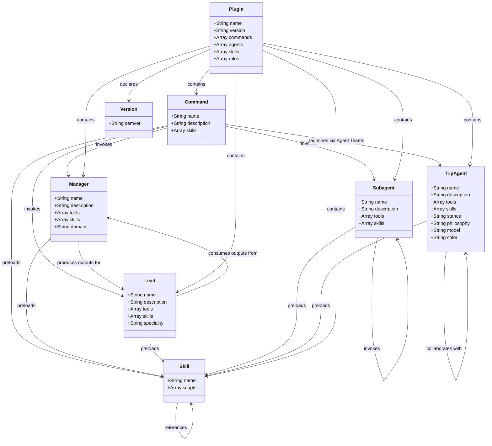
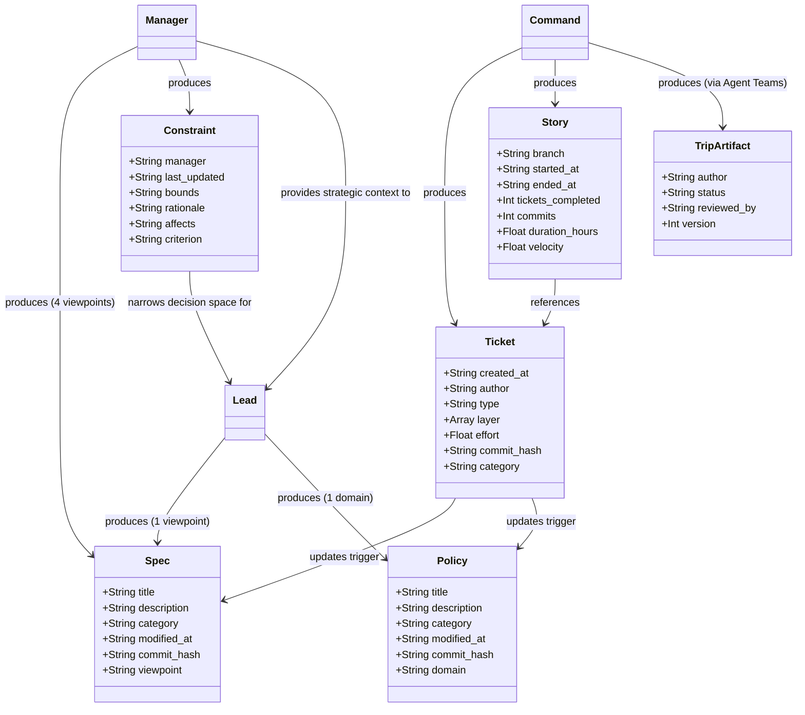

[English](model.md) | [Japanese](model_ja.md)

# Model Viewpoint

The Model Viewpoint describes the core domain concepts in Workaholic, their relationships, and the abstractions that govern how the system organizes work. Workaholic operates on a precisely defined domain model where tickets drive implementation, specs and policies document the system's architecture and practices, stories provide PR narratives, and a hierarchical agent architecture governs behavior. The domain enforces strict boundaries between orchestration (commands and subagents) and knowledge (skills), with version management maintaining synchronization across marketplace and plugin configuration files. A three-tier agent hierarchy distinguishes managers (strategic direction), leads (domain-specific execution), and general-purpose subagents (workflow automation). The marketplace distributes two plugins with fundamentally different orchestration models: drivin uses a single-agent ticket-driven workflow, while trippin uses a three-agent collaborative workflow based on the Implosive Structure protocol with git worktree isolation.

## Domain Entities

### Ticket

A ticket is a markdown file in `.workaholic/tickets/` that describes a change request. It serves as the atomic unit of work in the system, containing YAML frontmatter with required fields including `created_at` (ISO 8601 timestamp), `author` (git email), `type` (enhancement, bugfix, refactoring, housekeeping), `layer` (YAML array from: UX, Domain, Infrastructure, DB, Config), `effort` (numeric hours), `commit_hash` (short hash added after implementation), and `category` (Added, Changed, Removed, Fixed, Deprecated). Tickets flow through a lifecycle: created in `todo/`, implemented during `/drive`, and archived to `archive/<branch-name>/` after commit. Abandoned tickets move to `abandoned/`. Deferred tickets may be placed in `icebox/` with explicit developer consent. The `/ticket` command creates tickets via the ticket-organizer subagent, which validates frontmatter through a PostToolUse hook defined in `hooks/hooks.json`.

### Ticket Lifecycle

Tickets transition through distinct states, each represented by a directory location:

```mermaid
stateDiagram-v2
    [*] --> todo: "/ticket" creates
    todo --> implementing: "/drive" selects
    implementing --> archive: implementation complete
    implementing --> abandoned: user abandons
    todo --> icebox: user defers
    icebox --> todo: user reactivates
    archive --> [*]
    abandoned --> [*]
```

The lifecycle enforces discipline through location constraints. Tickets in `todo/` are implementation-ready and await the `/drive` command. During implementation, tickets are read but remain in `todo/` until the archive-ticket skill moves them to `archive/<branch-name>/` after commit. The `abandoned/` state captures failures with developer-written analysis. The `icebox/` state is reserved for explicitly deferred work that requires user confirmation to avoid accidental neglect.

### Spec

A spec is a markdown document in `.workaholic/specs/` that captures the current state of the system from a specific architectural viewpoint. Unlike tickets which describe what should change, specs describe what exists now. Specs use viewpoint-based architecture with 8 viewpoints: stakeholder (users, goals, interaction patterns), model (domain concepts, relationships, abstractions), ux (user experience, interaction patterns, journeys, onboarding), usecase (workflows, command sequences, contracts), infrastructure (dependencies, file layout, installation), application (runtime behavior, orchestration, data flow), component (internal structure, module boundaries, decomposition), data (formats, frontmatter schemas, naming conventions), and feature (capability inventory, matrix, configuration). Each spec includes YAML frontmatter with `title`, `description`, `category`, `modified_at`, and `commit_hash`. Specs are hand-maintained reference documents updated alongside structural changes through the `/ticket` workflow.

### Policy

A policy is a markdown document in `.workaholic/policies/` that describes repository practices across the four leading domains (validity, availability, security, accessibility) plus any additional concerns the project documents directly. Policies document what exists and identify gaps, using `[Explicit]` and `[Inferred]` markers for findings. Policy files follow the same frontmatter conventions as specs.

### Story

A story is a markdown document in `.workaholic/stories/` that synthesizes a branch's work into a PR-ready narrative. Stories serve as the single source of truth for PR descriptions, eliminating duplication between story generation and GitHub PR body assembly. Each story contains YAML frontmatter with branch name, timestamps (`started_at`, `ended_at`), and metrics (`tickets_completed`, `commits`, `duration_hours`, `velocity`), followed by seven sections: Summary (numbered CHANGELOG entries), Motivation (why the work was needed), Journey (how the work progressed), Changes (detailed explanation), Outcome (what was accomplished), Performance (metrics and pace analysis), and Notes (additional reviewer context). The `/report` command invokes the story-writer subagent to generate the story, which is then copied directly to the GitHub PR body by pr-creator.

### Plugin

A plugin is a distributable unit within the marketplace. The Workaholic marketplace (`marketplace.json`) contains three plugins: `core` (shared utilities and context-aware commands), `standards` (the four leading skills, principle skills, and writer/analyst agents), and `work` (ticket-driven development plus collaborative trip-style exploration). A plugin consists of commands, agents (subagents), skills, and rules, organized in a `.claude-plugin/plugin.json` manifest. Plugins are installed via `claude /plugin marketplace add qmu/workaholic`. The work plugin provides the complete development workflow including ticket-driven development (`/ticket`, `/drive`), AI-oriented exploration (`/trip`), story/PR creation (via `/report` from core), and ship/verify (via `/ship` from core). Each plugin declares a version field synchronized with the marketplace version across all four configuration files.

### Command

A command is a slash-invocable entry point (e.g., `/ticket`, `/drive`, `/trip`, `/report`, `/ship`). Commands are thin orchestration layers (approximately 50-100 lines) that invoke subagents and skills. Commands live in `plugins/<plugin-name>/commands/` and are the topmost orchestration unit in the system. A command can invoke skills and subagents but cannot be invoked by other components. Commands define workflow steps, handle user interaction via AskUserQuestion, and coordinate multi-phase processes. The `/trip` command is unique in that it launches an Agent Teams session rather than invoking individual subagents sequentially.

### Subagent

A subagent is a focused AI agent invoked by commands or other subagents via the Task tool. Subagents are thin orchestration layers (approximately 20-40 lines) defined in `plugins/<plugin-name>/agents/`. They preload skills for domain knowledge and can invoke other subagents or skills. Subagents cannot invoke commands. The work plugin contains orchestrators including ticket-organizer (ticket creation), drive-navigator (ticket queue navigation), planner/architect/constructor (trip-style collaborative session), story-writer (PR narrative synthesis), pr-creator (GitHub PR operations), history-discoverer (related ticket search), source-discoverer (relevant code search), ticket-discoverer (duplicate detection), release-readiness (release validation). The standards plugin contains writer/analyst agents including changelog-writer (CHANGELOG.md updates), terms-writer (terminology maintenance), overview-writer (story overview, highlights, motivation, journey), release-note-writer (release note generation), model-analyst (model viewpoint spec), performance-analyst (decision-making quality across viewpoints), section-reviewer (story sections 4-8), and a parameterized `lead` agent that loads the matching `leading-<domain>` skill. Subagents declare required tools in frontmatter and receive input via prompt, returning structured output conforming to their contract.

### Trip Agent

A trip agent is a specialized agent within the trippin plugin that participates in a three-agent collaborative session using the Implosive Structure protocol. Unlike drivin subagents which are invoked via the Task tool individually, trip agents operate as teammates within an Agent Teams session, communicating through shared markdown artifacts rather than direct invocations. There are exactly three trip agents, each with a distinct philosophical stance: Planner (Progressive, Extrinsic Idealism), Architect (Neutral, Structural Idealism), and Constructor (Conservative, Intrinsic Idealism). Each agent declares `model: opus` and a unique `color` in its frontmatter (green, blue, yellow respectively) and preloads the trip-protocol skill. Trip agents follow a commit-per-step discipline where every discrete action (writing, reviewing, moderating, implementing) produces a git commit via the trip-commit script.

### Lead

A lead is an agent that takes primary responsibility for a specific domain aspect. The standards plugin exposes a single parameterized `lead` agent that loads the matching `leading-<domain>` skill based on its prompt parameter. There are four leading domains: validity (logical comprehensiveness, type-driven design, layer segregation), availability (CI/CD, vendor neutrality, IaC, observability, recovery), security (preservation of trust, secure-by-design, defense in depth), and accessibility (universal reach, modeless design, tool-first interaction). Leads follow the define-lead schema enforced in `.claude/rules/define-lead.md` with sections: Role (containing Goal and Responsibility), Policies, Practices, and Standards. The `lead` agent preloads `leaders-principle` for cross-cutting behavioral principles (Prior Term Consistency, Vendor Neutrality) along with all four `leading-*` skills. The four leading skills are also preloaded directly into work-plugin commands and orchestrators (`/drive`, `ticket-organizer`, `planner`, `architect`, `constructor`) where they act as policy lenses applied during ticket scoping and implementation.

### Trip Collaboration Pattern

The `/trip` command establishes a fundamentally different orchestration model from the drivin plugin's sequential agent invocation. Rather than invoking individual subagents via the Task tool, it launches an Agent Teams session where three agents (Planner, Architect, Constructor) collaborate through shared artifacts in an isolated git worktree. The agents communicate by reading and writing versioned markdown files rather than through direct prompts:

```mermaid
flowchart TB
    User["User invokes /trip"]
    Trip["/trip command"]
    WT["Create Worktree"]
    Init["Initialize Trip Artifacts"]
    Teams["Agent Teams Session"]

    subgraph "Implosive Structure"
        direction TB
        P["Planner (Progressive)"]
        A["Architect (Neutral)"]
        C["Constructor (Conservative)"]

        subgraph "Shared Artifacts"
            D["directions/"]
            Mo["models/"]
            De["designs/"]
        end

        P -->|"writes"| D
        A -->|"writes"| Mo
        C -->|"writes"| De
        P -.->|"reviews"| Mo
        P -.->|"reviews"| De
        A -.->|"reviews"| D
        A -.->|"reviews"| De
        C -.->|"reviews"| D
        C -.->|"reviews"| Mo
    end

    User --> Trip
    Trip --> WT
    WT --> Init
    Init --> Teams
    Teams --> P
    Teams --> A
    Teams --> C
```

The trip session progresses through two phases: Phase 1 (Specification) is an inner loop where agents iteratively produce and review Direction, Model, and Design artifacts until reaching consensus; Phase 2 (Implementation) is an outer loop where the Constructor builds, the Architect reviews structure, and the Planner validates through testing. Every discrete step produces a git commit, making the trip branch's commit history a complete trace of the collaborative process.

### Skill

A skill is the knowledge layer of the system, containing templates, guidelines, rules, and bundled shell scripts. Skills are comprehensive (approximately 50-150 lines), live in `plugins/<plugin-name>/skills/`, and may include a `scripts/` directory with POSIX shell scripts. Skills can invoke other skills but cannot invoke subagents or commands. Shell scripts within skills are referenced via `${CLAUDE_PLUGIN_ROOT}` paths. Skills establish conventions and provide reusable domain knowledge to commands and subagents. The standards plugin contains four leading skills (`leading-validity`, `leading-availability`, `leading-security`, `leading-accessibility`), `leaders-principle`, three analysis skills (`analyze-performance`, `analyze-policy`, `analyze-viewpoint`), five writer skills (`write-changelog`, `write-overview`, `write-release-note`, `write-spec`, `write-terms`), `review-sections`, and `validate-writer-output`. The work plugin contains `create-ticket`, `discover`, `drive`, `report`, `trip-protocol`, `check-deps`. The core plugin contains shared utilities (`branching`, `commit`, `gather-git-context`, `gather-ticket-metadata`, `ship`, `system-safety`).

### Rule

A rule is a system-wide behavioral constraint applied via path patterns. Rules live in `plugins/<plugin-name>/rules/` and include general guidelines (architecture nesting policy, thin orchestration principle), diagram policies (Mermaid requirements, label quoting), shell scripting standards (POSIX compliance, bundled scripts in skills), TypeScript conventions, and define-lead schema enforcement (for `leading-*/SKILL.md` skills, kept as a repository-scoped rule under `.claude/rules/`). Rules are loaded by Claude Code based on path matching and influence behavior globally without explicit invocation.

### Version

A version is a semantic versioning string (MAJOR.MINOR.PATCH) that synchronizes across four configuration files: `.claude-plugin/marketplace.json` (root `version` field) and the three plugin manifests (`plugins/core/.claude-plugin/plugin.json`, `plugins/standards/.claude-plugin/plugin.json`, `plugins/work/.claude-plugin/plugin.json`). Version management follows CLAUDE.md conventions: read current version from marketplace.json, increment PATCH by default (e.g., 1.0.0 to 1.0.1), update all four files, and commit with message `Bump version to v{new_version}`. The `/report` command automatically performs a patch increment before invoking story-writer, ensuring every PR merge triggers a new release via the GitHub Actions release workflow (`.github/workflows/release.yml`) which compares marketplace.json version against the latest release tag. The branching skill provides a `check-version-bump.sh` script that detects existing "Bump version" commits in the current branch to prevent double-bumping when `/report` runs multiple times.

### Trip

A trip is a collaborative exploration session managed by the trippin plugin. Each trip runs in an isolated git worktree under `.worktrees/<trip-name>/` on a branch named `trip/<trip-name>`, where the trip name follows the pattern `trip-YYYYMMDD-HHMMSS`. A trip produces three categories of versioned artifacts stored in `.workaholic/.trips/<trip-name>/`: directions (creative vision from Planner), models (structural design from Architect), and designs (implementation plans from Constructor). Artifacts use version suffixes (`direction-v1.md`, `direction-v2.md`) rather than in-place edits, preserving the full revision history. A trip progresses through two phases: Specification (inner loop reaching consensus on all artifacts) and Implementation (outer loop building and validating the solution). The trip's git commit history serves as a complete audit trail, with each commit following the format `trip(<agent>): <step>`.

### Trip Artifact

A trip artifact is a versioned markdown file produced by a trip agent during a trip session. Artifacts are categorized by their producing agent: directions (Planner), models (Architect), and designs (Constructor). Each artifact follows a structured format with metadata fields: title with version number, Author (agent name), Status (draft, under-review, or approved), and Reviewed-by (comma-separated agent names). The artifact body contains a Content section and a Review Notes section where reviewing agents append feedback. Artifacts evolve through version increments rather than in-place edits, so `direction-v1.md` and `direction-v2.md` coexist in the same directory, enabling agents to reference earlier versions during review.

### Changelog Entry

A changelog entry is a CHANGELOG.md line item derived from an archived ticket's category and description. Entries follow the format: `- **[Category]** Description ([commit](url), [ticket](url))` where category is one of Added, Changed, Removed, Fixed, or Deprecated. The changelog-writer subagent groups entries by category and inserts them under a branch-based heading in reverse chronological order. Entries provide traceability from CHANGELOG.md to git commits and ticket archives, enabling developers to understand the provenance of each change.

### Terms Document

A terms document is a markdown file in `.workaholic/terms/` that maintains consistent definitions for domain-specific terminology. Terms documents prevent naming inconsistencies and establish shared vocabulary across the codebase and documentation. The terms-writer subagent updates these documents based on branch changes, identifying new terms, updated definitions, inconsistencies, and deprecated terms. Terms documents follow the standard frontmatter schema and require `_ja.md` translations. The core-concepts.md file defines fundamental building blocks including plugin, command, skill, rule, agent, ticket-organizer, orchestrator, deny, preload, nesting-policy, viewpoint, run_in_background, hook, PostToolUse, TiDD, context-window, lead, define-lead, and leaders-principle.

## Domain Relationships

The domain model enforces strict relationships between entities, governed by the component nesting hierarchy and lifecycle state machines. The standards plugin's parameterized `lead` agent and four leading skills act as the project's policy lenses; commands and orchestrators in the work plugin preload these skills to apply policy at scoping and implementation time. The trip-style workflow introduces a parallel relationship model where three agents of equal standing collaborate through shared artifacts rather than through a hierarchical invocation chain.

### Component Nesting Hierarchy

```mermaid
classDiagram
    class Command {
        +String name
        +String description
        +Array skills
    }

    class Manager {
        +String name
        +String description
        +Array tools
        +Array skills
        +String domain
    }

    class Lead {
        +String name
        +String description
        +Array tools
        +Array skills
        +String speciality
    }

    class Subagent {
        +String name
        +String description
        +Array tools
        +Array skills
    }

    class TripAgent {
        +String name
        +String description
        +Array tools
        +Array skills
        +String stance
        +String philosophy
        +String model
        +String color
    }

    class Skill {
        +String name
        +Array scripts
    }

    class Plugin {
        +String name
        +String version
        +Array commands
        +Array agents
        +Array skills
        +Array rules
    }

    class Version {
        +String semver
    }

    Command --> Manager : invokes
    Command --> Lead : invokes
    Command --> Subagent : invokes
    Command --> TripAgent : launches via Agent Teams
    Command --> Skill : preloads
    Manager --> Skill : preloads
    Lead --> Skill : preloads
    Subagent --> Subagent : invokes
    Subagent --> Skill : preloads
    TripAgent --> Skill : preloads
    TripAgent --> TripAgent : collaborates with
    Skill --> Skill : references

    Manager --> Lead : produces outputs for
    Lead --> Manager : consumes outputs from

    Plugin --> Command : contains
    Plugin --> Manager : contains
    Plugin --> Lead : contains
    Plugin --> Subagent : contains
    Plugin --> TripAgent : contains
    Plugin --> Skill : contains
    Plugin --> Version : declares
```

The nesting hierarchy is strictly enforced for the drivin plugin: commands at the top, managers and leads in the middle tier, general-purpose subagents below that, skills at the bottom. Commands can invoke skills, subagents, managers, and leads. Managers and leads can preload skills and invoke other subagents. Subagents can preload skills and invoke other subagents. Skills can only reference other skills. The trippin plugin introduces a lateral relationship model where trip agents are peers launched collectively via Agent Teams rather than invoked individually through the Task tool hierarchy.

### Work Artifact Relationships

```mermaid
classDiagram
    class Ticket {
        +String created_at
        +String author
        +String type
        +Array layer
        +Float effort
        +String commit_hash
        +String category
    }

    class Spec {
        +String title
        +String description
        +String category
        +String modified_at
        +String commit_hash
        +String viewpoint
    }

    class Policy {
        +String title
        +String description
        +String category
        +String modified_at
        +String commit_hash
        +String domain
    }

    class Constraint {
        +String manager
        +String last_updated
        +String bounds
        +String rationale
        +String affects
        +String criterion
    }

    class Story {
        +String branch
        +String started_at
        +String ended_at
        +Int tickets_completed
        +Int commits
        +Float duration_hours
        +Float velocity
    }

    class TripArtifact {
        +String author
        +String status
        +String reviewed_by
        +Int version
    }

    Command --> Ticket : produces
    Command --> Story : produces
    Command --> TripArtifact : produces (via Agent Teams)
    Manager --> Spec : produces (4 viewpoints)
    Manager --> Constraint : produces
    Lead --> Spec : produces (1 viewpoint)
    Lead --> Policy : produces (1 domain)

    Story --> Ticket : references
    Ticket --> Spec : updates trigger
    Ticket --> Policy : updates trigger
    Manager --> Lead : provides strategic context to
    Constraint --> Lead : narrows decision space for
```

The relationships reflect two distinct workflow paradigms. In the drivin workflow, commands create tickets and stories, managers produce strategic outputs (specs, constraints), leads produce domain-specific documentation (specs, policies), and tickets trigger updates to both specs and policies. Managers execute before leads to ensure strategic context is available. In the trippin workflow, the `/trip` command produces trip artifacts through a collaborative Agent Teams session, with artifacts evolving through versioned consensus rather than through hierarchical delegation.

## Domain Invariants

The domain enforces several invariants that constrain how concepts relate to each other:

**Frontmatter validation**: Tickets must always have valid YAML frontmatter validated by a PostToolUse hook (`hooks.json`). Missing or malformed frontmatter causes ticket creation to fail immediately. This constraint ensures tickets are machine-readable and suitable for automated processing.

**Nesting hierarchy**: The component nesting rules are strict and enforced through documentation, not code. Commands cannot invoke other commands. Subagents (including managers and leads) cannot invoke commands. Skills cannot invoke subagents or commands. This hierarchy prevents circular dependencies and maintains clear separation between orchestration and knowledge layers.

**Bilingual documentation**: Every document in `.workaholic/` must have a corresponding `_ja.md` translation. This invariant is enforced through the i18n rule and the translate skill. Files without translations are considered incomplete. The parallel link structure in README.md and README_ja.md must be maintained so that each language's index links to documents in the same language.

**Language segregation**: Files in `.workaholic/` are the only files that may contain Japanese content. All other content (code, code comments, commit messages, pull requests, documentation outside `.workaholic/`) must be in English. This invariant partitions the codebase into a bilingual user-facing layer and an English-only implementation layer.

**Version synchronization**: The marketplace version (`.claude-plugin/marketplace.json`) and the three plugin versions (`plugins/core/.claude-plugin/plugin.json`, `plugins/standards/.claude-plugin/plugin.json`, `plugins/work/.claude-plugin/plugin.json`) must remain synchronized. Version bumps update all four files atomically. This invariant ensures that the marketplace catalog and all plugin manifests agree on the distributed version.

**Shell script encapsulation**: Commands and subagents cannot contain complex inline shell commands (conditionals, pipes, loops, text processing). All multi-step or conditional shell operations must be extracted to bundled scripts in skills (`skills/<name>/scripts/<script>.sh`). This invariant ensures consistency, testability, and permission-free execution.

**Write permission constraint**: Agents invoked with `run_in_background: true` have Write and Edit tool permissions automatically denied. This constraint requires explicit `run_in_background: false` (the default) for any agent that needs Write/Edit access. The constraint reflects Claude Code's security model where background agents cannot receive interactive prompts for dangerous operations.

**Ticket lifecycle monotonicity**: Tickets can only move forward in their lifecycle (todo -> implementing -> archive or abandoned). There is no reverse transition from archive back to todo. This invariant preserves historical integrity by treating archived tickets as immutable records of completed work.

**Schema enforcement**: Lead skills must conform to the define-lead schema (`.claude/rules/define-lead.md`) with Role (containing Goal and Responsibility), Policies, Practices, and Standards sections.

**Principle skill preloading**: The parameterized `lead` agent preloads `leaders-principle` together with all four `leading-*` skills. This invariant ensures that cross-cutting behavioral principles (Prior Term Consistency, Vendor Neutrality) are applied alongside whichever leading domain the agent loads for a given invocation.

**Ticket context in approval prompts**: The drive-approval skill enforces that approval prompts must contain the ticket's title (from the H1 heading) and overview (from the Overview section). Presenting an approval prompt with missing, empty, or literal placeholder values is explicitly defined as a failure condition. When ticket context is unavailable in the current conversation state, the agent must re-read the ticket file before presenting the prompt. This invariant ensures users can make informed approval decisions.

**Trip worktree isolation**: Each trip session must run in a dedicated git worktree under `.worktrees/<trip-name>/` on a branch named `trip/<trip-name>`. The ensure-worktree script enforces that no duplicate worktree or branch exists before creation. This invariant guarantees that trip exploration work is isolated from the main working tree and from other concurrent trips.

**Trip commit-per-step discipline**: Every discrete workflow step in a trip session must produce a git commit via the trip-commit script. The commit message follows the format `trip(<agent>): <step>` with phase information in the body. This invariant ensures that the trip branch's commit history is a complete and traceable record of the collaborative process, enabling post-hoc review of every decision and revision.

**Trip consensus gate**: Phase 1 (Specification) of the Implosive Structure cannot transition to Phase 2 (Implementation) until all three trip agents confirm that Direction, Model, and Design artifacts are internally consistent, no unresolved disagreements remain, and artifacts are sufficient to begin implementation. This invariant prevents premature implementation based on incomplete or contested specifications.

**Trip artifact versioning**: Trip artifacts must use version-suffixed filenames (`direction-v1.md`, `direction-v2.md`) rather than in-place edits. Each revision creates a new file, preserving the full revision history within the artifact directory. This invariant supports the review and moderation protocol by allowing agents to reference earlier versions.

**Trip moderation protocol**: When two trip agents disagree, the third agent serves as moderator. The moderator assignment follows a deterministic rule: Planner-vs-Architect disagreements are moderated by Constructor, Architect-vs-Constructor by Planner, and Planner-vs-Constructor by Architect. This invariant ensures every disagreement has a defined resolution path.

**Trip name validation**: Trip names must match the pattern `^[a-z0-9][a-z0-9-]*[a-z0-9]$` (lowercase alphanumeric with hyphens, no leading or trailing hyphens). This is enforced by the init-trip script and ensures that trip names are valid for use as git branch suffixes and directory names.

## Naming Conventions

The domain model encodes knowledge through systematic naming conventions that make entity types, relationships, and roles immediately recognizable:

**Command naming**: Commands use imperative verbs or short nouns that directly describe user intent: `/ticket` (create work item), `/drive` (implement work items), `/trip` (explore collaboratively), `/report` (generate PR), `/ship` (merge and verify). The work plugin commands reflect a ticket-driven development vocabulary plus a journey metaphor for `/trip` consistent with its exploration-oriented identity.

**Plugin naming**: Plugins use short concrete nouns that convey their role: `core` (shared utilities), `standards` (policy lenses and writers), `work` (the development workflow itself).

**Lead naming**: Leading skills use the form `leading-<speciality>` (e.g., `leading-validity`, `leading-availability`, `leading-security`, `leading-accessibility`). The standards plugin exposes a single parameterized `lead` agent that loads the matching `leading-<domain>` skill based on its prompt parameter. The `leading-` prefix makes the function explicit at the namespace level.

**Subagent naming**: Non-manager, non-lead subagents use role-based naming with `-writer`, `-analyst`, `-organizer`, `-discoverer`, or `-navigator` suffixes. The pattern is `<domain>-<role>`: `ticket-organizer` (organizes ticket creation), `story-writer` (writes stories), `changelog-writer` (writes changelog), `model-analyst` (analyzes model viewpoint), `terms-writer` (writes terms), `history-discoverer` (finds related tickets), `source-discoverer` (finds relevant code), `ticket-discoverer` (detects duplicates), `drive-navigator` (navigates ticket queue). The suffix indicates the subagent's function: analysts produce specs/policies, writers produce changelog/terms/stories, organizers coordinate workflows, discoverers perform searches, navigators manage sequences.

**Trip agent naming**: Trip agents use simple role nouns that describe their function within the Implosive Structure: `planner` (creative direction), `architect` (structural design), `constructor` (implementation). Unlike drivin subagents which use compound `<domain>-<role>` names, trip agents use single words because their identity is defined by their philosophical stance rather than by a specific domain-role combination.

**Skill naming**: Skills use verb-noun phrases that describe their purpose: `gather-git-context`, `write-spec`, `validate-writer-output`, `leaders-principle`, `branching`. The naming makes skills self-documenting and suggests their appropriate usage contexts. The cross-cutting `leaders-principle` skill uses the `-principle` suffix to indicate behavioral rules. The work plugin's `trip-protocol` skill uses a `<noun>-<noun>` pattern that describes the protocol it defines rather than an action it performs.

**File naming**: Files follow consistent patterns based on entity type. Tickets use `YYYYMMDDHHMMSS-kebab-case-description.md` with timestamp prefix for chronological ordering. Specs use viewpoint slug: `stakeholder.md`, `model.md`, `ux.md`, `usecase.md`. Policies use domain slug: `test.md`, `security.md`, `quality.md`. Stories use branch name: `drive-20260208-131649.md`. Trip artifacts use type-version: `direction-v1.md`, `model-v2.md`, `design-v1.md`. Translations append `_ja` suffix: `model_ja.md`, `test_ja.md`. The patterns make entity types identifiable from filenames alone.

**Directory naming**: Directories encode lifecycle state and categorization. `.workaholic/tickets/todo/` contains implementation-ready work. `.workaholic/tickets/archive/<branch-name>/` preserves completed work organized by branch. `.workaholic/specs/` contains viewpoint-based architecture documentation. `.workaholic/policies/` contains practice-based repository documentation. `.workaholic/stories/` contains PR narratives. `.workaholic/terms/` contains terminology definitions. `.workaholic/.trips/<trip-name>/` contains trip session artifacts organized by agent role (directions, models, designs). The structure reflects the domain's mental model, with the leading dot in `.trips` indicating that trip artifacts are transient exploration data rather than permanent documentation.

**Frontmatter field naming**: Frontmatter fields use snake_case with `_at` suffix for timestamps (`created_at`, `started_at`, `ended_at`, `modified_at`, `last_updated`) and descriptive nouns for other fields (`commit_hash`, `tickets_completed`, `duration_hours`, `velocity`). The suffix convention makes temporal fields immediately recognizable and distinguishable from other metadata. Trip agent frontmatter introduces additional fields: `model` (LLM model to use), `color` (visual identification in Agent Teams), and `stance` is encoded in the prose rather than frontmatter.

**Branch naming**: Branches use prefix-timestamp format: `drive-YYYYMMDD-HHMMSS` for `/drive` sessions, `feat-YYYYMMDD-HHMMSS` for feature work, `trip/<trip-name>` for trip sessions. The timestamp enables chronological ordering and collision-free naming. The prefix indicates the branch's purpose and the slash separator in trip branches creates a namespace that groups all trip branches together in git's ref hierarchy.

**Commit message naming**: Drivin commits follow conventional formats determined by context (implementation commits, archive commits, bump commits). Trip commits follow a strict format: `trip(<agent>): <step>` with `Phase: <phase>` in the body. This convention makes it possible to reconstruct the full collaboration timeline from the git log alone, identifying which agent performed each action and in which phase.

## Assumptions

- [Explicit] The nesting hierarchy (command > subagent > skill) is documented in `CLAUDE.md` with a clear table showing what each component type can invoke.
- [Explicit] Ticket frontmatter fields are validated by the PostToolUse hook defined in `hooks/hooks.json`, ensuring all tickets conform to the schema.
- [Explicit] The marketplace contains three plugins (`core`, `standards`, `work`), as seen in `.claude-plugin/marketplace.json`.
- [Explicit] Version synchronization across marketplace.json and the three plugin.json files is documented in `CLAUDE.md` Version Management section.
- [Explicit] The `/report` command automatically bumps the version before invoking story-writer, with idempotency protection via the `check-version-bump.sh` script to prevent double-bumping when `/report` runs multiple times in the same branch.
- [Explicit] The `run_in_background: false` default for agents requiring Write and Edit permissions ensures those tools are available for file generation.
- [Explicit] The define-lead schema is enforced via `.claude/rules/define-lead.md`.
- [Explicit] The leaders-principle skill defines cross-cutting principles for all leads: Prior Term Consistency and Vendor Neutrality.
- [Explicit] The four leading skills (`leading-validity`, `leading-availability`, `leading-security`, `leading-accessibility`) are preloaded into work-plugin commands and orchestrators via the soft cross-plugin reference pattern.
- [Explicit] Cross-cutting principle skills use the `-principle` suffix to distinguish behavioral principles from policy output artifacts.
- [Explicit] The drive-approval skill enforces that approval prompts must contain the ticket title and overview, with re-read fallback when context is lost. Presenting a prompt with missing context is defined as a failure condition.
- [Explicit] The trippin plugin uses Agent Teams (`CLAUDE_CODE_EXPERIMENTAL_AGENT_TEAMS=1`) for three-agent collaboration, requiring the experimental feature to be enabled.
- [Explicit] Trip agents declare `model: opus` and individual `color` values (green, blue, yellow) in frontmatter, distinguishing them from drivin subagents which use `model: sonnet`.
- [Explicit] The Implosive Structure protocol defines three philosophical stances: Progressive (Extrinsic Idealism) for Planner, Neutral (Structural Idealism) for Architect, Conservative (Intrinsic Idealism) for Constructor.
- [Explicit] Trip sessions run in isolated git worktrees under `.worktrees/<trip-name>/` on branches named `trip/<trip-name>`, as enforced by the ensure-worktree script.
- [Explicit] Trip artifact versioning uses suffixed filenames (`direction-v1.md`, `direction-v2.md`) to preserve revision history, as defined in the trip-protocol skill.
- [Explicit] The trip moderation protocol assigns the third agent as moderator when two agents disagree, with a deterministic assignment table.
- [Explicit] Trip name validation enforces `^[a-z0-9][a-z0-9-]*[a-z0-9]$` via the init-trip script.
- [Explicit] Trip commit messages follow the format `trip(<agent>): <step>` with phase in the body, as implemented in the trip-commit script.
- [Inferred] The domain model is deliberately simple and flat, favoring markdown files over database structures, to maintain compatibility with git versioning and Claude Code's file-based tooling.
- [Inferred] The "thin orchestration, comprehensive knowledge" pattern reflects a design decision to keep agent behavior deterministic by centralizing domain knowledge in skills rather than distributing it across agents.
- [Inferred] The retirement of the strategic-context tier (in favor of preloading leading skills directly into work-plugin commands) reflects that intermediate context artifacts had limited practical uptake compared to direct policy lensing.
- [Inferred] The three-plugin layout (core, standards, work) signals a design philosophy of modular, independently-evolving plugins with distinct responsibilities -- shared utilities, policy lenses, and workflow orchestration respectively.
- [Inferred] The mandatory bilingual documentation requirement reflects a stakeholder base that includes both English and Japanese speakers, with equal importance assigned to both languages.
- [Inferred] The ticket lifecycle's one-way state transitions (no reverse from archive to todo) suggest that the system values historical integrity and change tracking over workflow flexibility.
- [Inferred] The falsifiability requirement for constraints reflects a preference for concrete, verifiable boundaries over aspirational goals or vague guidelines.
- [Inferred] The trip agents' use of `model: opus` (compared to `sonnet` for documentation writers) suggests that collaborative exploration requires higher-capability reasoning, while documentation generation can be handled by a more efficient model.
- [Inferred] The `.trips` directory uses a leading dot prefix, unlike other `.workaholic/` subdirectories (specs, policies, stories), suggesting that trip artifacts are considered transient exploration data rather than persistent project documentation.
- [Inferred] The dual objectives framework (Goal: positive obligation; Responsibility: negative obligation) in the define-lead schema mirrors the broader Workaholic pattern of balancing creative output with structural constraints, seen also in the trip-protocol's consensus gates.
