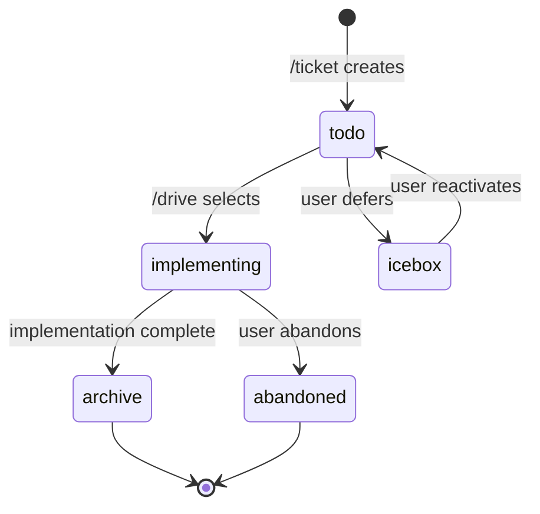
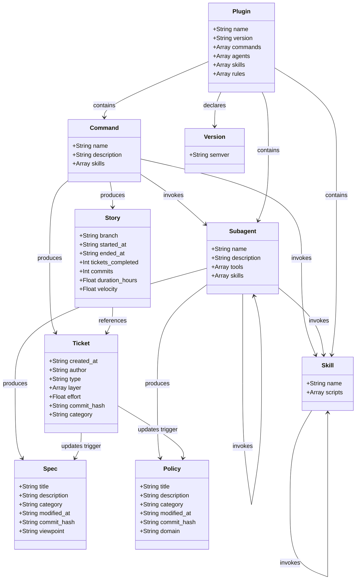

[English](model.md) | [Japanese](model_ja.md)

# Model Viewpoint

The Model Viewpoint describes the core domain concepts in Workaholic, their relationships, and the abstractions that govern how the system organizes work. Workaholic operates on a precisely defined domain model where tickets drive implementation, specs and policies document the system's architecture and practices, stories provide PR narratives, and a layered component architecture governs behavior. The domain enforces strict boundaries between orchestration (commands and subagents) and knowledge (skills), with version management maintaining synchronization across marketplace and plugin configuration files.

## Domain Entities

### Ticket

A ticket is a markdown file in `.workaholic/tickets/` that describes a change request. It serves as the atomic unit of work in the system, containing YAML frontmatter with required fields including `created_at`, `author`, `type` (feature, enhancement, bugfix, refactoring, chore), `layer` (array from: UX, Domain, Config, Infrastructure), `effort` (hours), `commit_hash` (added after implementation), and `category` (Added, Changed, Removed, Fixed, Deprecated). Tickets flow through a lifecycle: created in `todo/`, implemented during `/drive`, and archived to `archive/<branch-name>/` after commit. Abandoned tickets move to `abandoned/`. Unimplemented tickets may be placed in `icebox/` with explicit developer consent. The `/ticket` command creates tickets via the ticket-organizer subagent, which validates frontmatter through a PostToolUse hook defined in `hooks/hooks.json`.

### Ticket Lifecycle

Tickets transition through distinct states, each represented by a directory location:

```mermaid
stateDiagram-v2
    [*] --> todo: /ticket creates
    todo --> implementing: /drive selects
    implementing --> archive: implementation complete
    implementing --> abandoned: user abandons
    todo --> icebox: user defers
    icebox --> todo: user reactivates
    archive --> [*]
    abandoned --> [*]
```

The lifecycle enforces discipline through location constraints. Tickets in `todo/` are implementation-ready and await the `/drive` command. During implementation, tickets are read but remain in `todo/` until the archive-ticket skill moves them to `archive/<branch-name>/` after commit. The `abandoned/` state captures failures with developer-written analysis. The `icebox/` state is reserved for explicitly deferred work that requires user confirmation to avoid accidental neglect.

### Spec

A spec is a markdown document in `.workaholic/specs/` that captures the current state of the system from a specific architectural viewpoint. Unlike tickets which describe what should change, specs describe what exists now. Specs use viewpoint-based architecture with 8 viewpoints: stakeholder (users, goals, interaction patterns), model (domain concepts, relationships, abstractions), usecase (workflows, command sequences, contracts), infrastructure (dependencies, file layout, installation), application (runtime behavior, orchestration, data flow), component (internal structure, module boundaries, decomposition), data (formats, frontmatter schemas, naming conventions), and feature (capability inventory, matrix, configuration). Each spec includes YAML frontmatter with `title`, `description`, `category`, `modified_at`, and `commit_hash`. The `/scan` command invokes 8 viewpoint analyst subagents in parallel to update all specs based on the current codebase state.

### Policy

A policy is a markdown document in `.workaholic/policies/` that describes repository practices across 7 domains: test (verification strategy, testing levels, coverage targets), security (authentication, authorization, data protection, threat mitigation), quality (code standards, review processes, technical debt management), accessibility (inclusive design, WCAG compliance, assistive technology support), observability (logging, monitoring, alerting, metrics), delivery (deployment strategy, release process, rollback procedures), and recovery (backup strategy, disaster recovery, incident response). Policies document what exists and identify gaps, using `[Explicit]` and `[Inferred]` markers for findings. Policy files follow the same frontmatter conventions as specs and are generated by 7 policy analyst subagents invoked in parallel during `/scan`.

### Story

A story is a markdown document in `.workaholic/stories/` that synthesizes a branch's work into a PR-ready narrative. Stories serve as the single source of truth for PR descriptions, eliminating duplication between story generation and GitHub PR body assembly. Each story contains YAML frontmatter with branch name, timestamps (`started_at`, `ended_at`), and metrics (`tickets_completed`, `commits`, `duration_hours`, `velocity`), followed by seven sections: Summary (numbered CHANGELOG entries), Motivation (why the work was needed), Journey (how the work progressed), Changes (detailed explanation), Outcome (what was accomplished), Performance (metrics and pace analysis), and Notes (additional reviewer context). The `/report` command invokes the story-writer subagent to generate the story, which is then copied directly to the GitHub PR body by pr-creator.

### Plugin

A plugin is a distributable unit within the marketplace. The Workaholic marketplace (`marketplace.json`) currently contains one plugin: `core`. A plugin consists of commands, agents (subagents), skills, and rules, organized in a `.claude-plugin/plugin.json` manifest. Plugins are installed via `claude /plugin marketplace add qmu/workaholic`. The core plugin provides the complete development workflow including ticket-driven development (`/ticket`, `/drive`), documentation generation (`/scan`), and PR creation (`/report`). Each plugin declares a version field synchronized with the marketplace version.

### Command

A command is a slash-invocable entry point (e.g., `/ticket`, `/drive`, `/scan`, `/report`, `/release`). Commands are thin orchestration layers (approximately 50-100 lines) that invoke subagents and skills. Commands live in `plugins/core/commands/` and are the topmost orchestration unit in the system. A command can invoke skills and subagents but cannot be invoked by other components. Commands define workflow steps, handle user interaction via AskUserQuestion, and coordinate multi-phase processes. The `/scan` command is an architectural outlier at ~90 lines because it inlines 17-agent parallel orchestration to provide real-time progress visibility to users.

### Subagent

A subagent is a focused AI agent invoked by commands or other subagents via the Task tool. Subagents are thin orchestration layers (approximately 20-40 lines) defined in `plugins/core/agents/`. They preload skills for domain knowledge and can invoke other subagents or skills. Subagents cannot invoke commands. Current subagents include ticket-organizer (ticket creation), story-writer (PR narrative synthesis), pr-creator (GitHub PR operations), changelog-writer (CHANGELOG.md updates), terms-writer (terminology maintenance), 8 viewpoint analysts (stakeholder, model, usecase, infrastructure, application, component, data, feature), 7 policy analysts (test, security, quality, accessibility, observability, delivery, recovery), and performance-analyst (metrics reporting). Subagents declare required tools in frontmatter and receive input via prompt, returning structured output conforming to their contract.

### Agent Orchestration Pattern

The recent scanner subagent removal (commit d627919) established a pattern where commands directly orchestrate multiple parallel agents when user visibility is critical:

```mermaid
flowchart TB
    User["User invokes /scan"]
    Command["/scan command"]

    subgraph "Phase 3: Parallel Agent Invocation"
        direction LR
        A1["stakeholder-analyst"]
        A2["model-analyst"]
        A3["usecase-analyst"]
        A4["infrastructure-analyst"]
        A5["application-analyst"]
        A6["component-analyst"]
        A7["data-analyst"]
        A8["feature-analyst"]
        P1["test-policy-analyst"]
        P2["security-policy-analyst"]
        P3["quality-policy-analyst"]
        P4["accessibility-policy-analyst"]
        P5["observability-policy-analyst"]
        P6["delivery-policy-analyst"]
        P7["recovery-policy-analyst"]
        C["changelog-writer"]
        T["terms-writer"]
    end

    User --> Command
    Command -->|"Task calls (run_in_background: false)"| A1
    Command --> A2
    Command --> A3
    Command --> A4
    Command --> A5
    Command --> A6
    Command --> A7
    Command --> A8
    Command --> P1
    Command --> P2
    Command --> P3
    Command --> P4
    Command --> P5
    Command --> P6
    Command --> P7
    Command --> C
    Command --> T
```

This pattern trades command size for user experience. The `/scan` command grew from ~17 lines to ~90 lines but now displays real-time progress for all 17 agents instead of hiding them behind a single scanner subagent invocation. The `run_in_background: false` constraint is critical: background agents have Write and Edit tool permissions denied, causing silent failures when producing output files.

### Skill

A skill is the knowledge layer of the system, containing templates, guidelines, rules, and bundled shell scripts. Skills are comprehensive (approximately 50-150 lines), live in `plugins/core/skills/`, and may include an `sh/` directory with POSIX shell scripts. Skills can invoke other skills but cannot invoke subagents or commands. Shell scripts within skills are permission-free and use relative paths from `~/.claude/skills/<skill-name>/sh/<script>.sh`. Skills establish conventions and provide reusable domain knowledge to commands and subagents. Examples include gather-git-context (branch, base, URL extraction), gather-ticket-metadata (datetime, author), archive-ticket (lifecycle state transitions), write-changelog (CHANGELOG.md formatting), write-spec (spec document guidelines), write-terms (terminology management), translate (i18n conventions), and validate-writer-output (post-generation verification).

### Rule

A rule is a system-wide behavioral constraint applied via path patterns. Rules live in `plugins/core/rules/` and include general guidelines (architecture nesting policy, thin orchestration principle), diagram policies (Mermaid requirements, label quoting), i18n requirements (mandatory `_ja.md` translations for `.workaholic/`), shell scripting standards (POSIX compliance, bundled scripts in skills), TypeScript conventions, and workaholic directory conventions (file structure, frontmatter requirements). Rules are loaded by Claude Code based on path matching and influence behavior globally without explicit invocation.

### Version

A version is a semantic versioning string (MAJOR.MINOR.PATCH) that synchronizes across two configuration files: `.claude-plugin/marketplace.json` (root `version` field) and `plugins/core/.claude-plugin/plugin.json` (plugin `version` field). Version management follows CLAUDE.md conventions: read current version from marketplace.json, increment PATCH by default (e.g., 1.0.0 → 1.0.1), update both files, and commit with message `Bump version to v{new_version}`. The `/report` command automatically performs a patch increment before invoking story-writer, ensuring every PR merge triggers a new release via the GitHub Actions release workflow (`.github/workflows/release.yml`) which compares marketplace.json version against the latest release tag.

### Changelog Entry

A changelog entry is a CHANGELOG.md line item derived from an archived ticket's category and description. Entries follow the format: `- **[Category]** Description ([commit](url), [ticket](url))` where category is one of Added, Changed, Removed, Fixed, or Deprecated. The changelog-writer subagent groups entries by category and inserts them under a branch-based heading in reverse chronological order. Entries provide traceability from CHANGELOG.md to git commits and ticket archives, enabling developers to understand the provenance of each change.

### Terms Document

A terms document is a markdown file in `.workaholic/terms/` that maintains consistent definitions for domain-specific terminology. Terms documents prevent naming inconsistencies and establish shared vocabulary across the codebase and documentation. The terms-writer subagent updates these documents based on branch changes, identifying new terms, updated definitions, inconsistencies, and deprecated terms. Terms documents follow the standard frontmatter schema and require `_ja.md` translations.

## Domain Relationships

The domain model enforces strict relationships between entities, governed by the component nesting hierarchy and lifecycle state machines:

```mermaid
classDiagram
    class Ticket {
        +String created_at
        +String author
        +String type
        +Array layer
        +Float effort
        +String commit_hash
        +String category
    }

    class Spec {
        +String title
        +String description
        +String category
        +String modified_at
        +String commit_hash
        +String viewpoint
    }

    class Policy {
        +String title
        +String description
        +String category
        +String modified_at
        +String commit_hash
        +String domain
    }

    class Story {
        +String branch
        +String started_at
        +String ended_at
        +Int tickets_completed
        +Int commits
        +Float duration_hours
        +Float velocity
    }

    class Command {
        +String name
        +String description
        +Array skills
    }

    class Subagent {
        +String name
        +String description
        +Array tools
        +Array skills
    }

    class Skill {
        +String name
        +Array scripts
    }

    class Plugin {
        +String name
        +String version
        +Array commands
        +Array agents
        +Array skills
        +Array rules
    }

    class Version {
        +String semver
    }

    Command --> Subagent : invokes
    Command --> Skill : invokes
    Subagent --> Subagent : invokes
    Subagent --> Skill : invokes
    Skill --> Skill : invokes

    Command --> Ticket : produces
    Command --> Story : produces
    Subagent --> Spec : produces
    Subagent --> Policy : produces

    Plugin --> Command : contains
    Plugin --> Subagent : contains
    Plugin --> Skill : contains
    Plugin --> Version : declares

    Story --> Ticket : references
    Ticket --> Spec : updates trigger
    Ticket --> Policy : updates trigger
```

The nesting hierarchy is strictly enforced: commands at the top, subagents in the middle, skills at the bottom. Commands can invoke skills and subagents; subagents can invoke skills and other subagents; skills can only invoke other skills. This hierarchy ensures that orchestration remains thin and knowledge is centralized in reusable skills.

## Domain Invariants

The domain enforces several invariants that constrain how concepts relate to each other:

**Frontmatter validation**: Tickets must always have valid YAML frontmatter validated by a PostToolUse hook (`hooks.json`). Missing or malformed frontmatter causes ticket creation to fail immediately. This constraint ensures tickets are machine-readable and suitable for automated processing.

**Nesting hierarchy**: The component nesting rules are strict and enforced through documentation, not code. Commands cannot invoke other commands. Subagents cannot invoke commands. Skills cannot invoke subagents or commands. This hierarchy prevents circular dependencies and maintains clear separation between orchestration and knowledge layers.

**Bilingual documentation**: Every document in `.workaholic/` must have a corresponding `_ja.md` translation. This invariant is enforced through the i18n rule and the translate skill. Files without translations are considered incomplete. The parallel link structure in README.md and README_ja.md must be maintained so that each language's index links to documents in the same language.

**Language segregation**: Files in `.workaholic/` are the only files that may contain Japanese content. All other content (code, code comments, commit messages, pull requests, documentation outside `.workaholic/`) must be in English. This invariant partitions the codebase into a bilingual user-facing layer and an English-only implementation layer.

**Version synchronization**: The marketplace version (`.claude-plugin/marketplace.json`) and plugin version (`plugins/core/.claude-plugin/plugin.json`) must remain synchronized. Version bumps update both files atomically. This invariant ensures that the marketplace catalog and plugin manifest agree on the distributed version.

**Shell script encapsulation**: Commands and subagents cannot contain complex inline shell commands (conditionals, pipes, loops, text processing). All multi-step or conditional shell operations must be extracted to bundled scripts in skills (`skills/<name>/sh/<script>.sh`). This invariant ensures consistency, testability, and permission-free execution.

**Write permission constraint**: Agents invoked with `run_in_background: true` have Write and Edit tool permissions automatically denied. This constraint necessitates the explicit `run_in_background: false` (the default) in the `/scan` command's Phase 3, where all 17 agents require Write/Edit to produce their output files. The constraint reflects Claude Code's security model where background agents cannot receive interactive prompts for dangerous operations.

**Ticket lifecycle monotonicity**: Tickets can only move forward in their lifecycle (todo → implementing → archive or abandoned). There is no reverse transition from archive back to todo. This invariant preserves historical integrity by treating archived tickets as immutable records of completed work.

## Naming Conventions

The domain model encodes knowledge through systematic naming conventions that make entity types, relationships, and roles immediately recognizable:

**Command naming**: Commands use imperative verbs or short nouns that directly describe user intent: `/ticket` (create work item), `/drive` (implement work items), `/scan` (update documentation), `/report` (generate PR), `/release` (publish version). The names are chosen to match natural language patterns in user requests.

**Subagent naming**: Subagents use role-based naming with `-agent`, `-writer`, or `-analyst` suffixes. The pattern is `<domain>-<role>`: `ticket-organizer` (organizes ticket creation), `story-writer` (writes stories), `changelog-writer` (writes changelog), `stakeholder-analyst` (analyzes stakeholder viewpoint), `test-policy-analyst` (analyzes test policy). The suffix indicates the subagent's function: analyzers produce specs/policies, writers produce changelog/terms/stories, organizers coordinate workflows.

**Skill naming**: Skills use verb-noun phrases that describe their purpose: `gather-git-context`, `archive-ticket`, `write-spec`, `validate-writer-output`, `translate`. The naming makes skills self-documenting and suggests their appropriate usage contexts.

**File naming**: Files follow consistent patterns based on entity type. Tickets use `YYYYMMDDHHMMSS-kebab-case-description.md` with timestamp prefix for chronological ordering. Specs use viewpoint slug: `stakeholder.md`, `model.md`, `usecase.md`. Policies use domain slug: `test.md`, `security.md`, `quality.md`. Stories use branch name: `drive-20260208-131649.md`. Translations append `_ja` suffix: `model_ja.md`, `test_ja.md`. The patterns make entity types identifiable from filenames alone.

**Directory naming**: Directories encode lifecycle state and categorization. `.workaholic/tickets/todo/` contains implementation-ready work. `.workaholic/tickets/archive/<branch-name>/` preserves completed work organized by branch. `.workaholic/specs/` contains viewpoint-based architecture documentation. `.workaholic/policies/` contains practice-based repository documentation. `.workaholic/stories/` contains PR narratives. `.workaholic/terms/` contains terminology definitions. The structure reflects the domain's mental model.

**Frontmatter field naming**: Frontmatter fields use snake_case with `_at` suffix for timestamps (`created_at`, `started_at`, `ended_at`, `modified_at`) and descriptive nouns for other fields (`commit_hash`, `tickets_completed`, `duration_hours`, `velocity`). The suffix convention makes temporal fields immediately recognizable and distinguishable from other metadata.

**Branch naming**: Branches use prefix-timestamp format: `drive-YYYYMMDD-HHMMSS` for `/drive` sessions, `feat-YYYYMMDD-HHMMSS` for feature work. The timestamp enables chronological ordering and collision-free naming. The prefix indicates the branch's purpose.

## Assumptions

- [Explicit] The nesting hierarchy (command > subagent > skill) is documented in `CLAUDE.md` with a clear table showing what each component type can invoke.
- [Explicit] Ticket frontmatter fields are validated by the PostToolUse hook defined in `hooks/hooks.json`, ensuring all tickets conform to the schema.
- [Explicit] The marketplace currently contains exactly one plugin (`core`), as seen in `.claude-plugin/marketplace.json` lines 9-21.
- [Explicit] Version synchronization across marketplace.json and plugin.json is documented in `CLAUDE.md` Version Management section (lines 108-119).
- [Explicit] The scanner subagent was removed in ticket 20260208131751-migrate-scanner-into-scan-command.md (commit a8e0f4d), with orchestration moved directly into the `/scan` command.
- [Explicit] The `/report` command automatically bumps the version before invoking story-writer, as documented in ticket 20260208133008-add-version-bump-to-story-command.md (commit 0fa1e29).
- [Explicit] The `run_in_background: false` constraint for scan agents was added in ticket 20260209121629-add-run-in-background-false-to-scan.md (commit d627919).
- [Inferred] The domain model is deliberately simple and flat, favoring markdown files over database structures, to maintain compatibility with git versioning and Claude Code's file-based tooling.
- [Inferred] The "thin orchestration, comprehensive knowledge" pattern reflects a design decision to keep agent behavior deterministic by centralizing domain knowledge in skills rather than distributing it across agents.
- [Inferred] The elimination of the scanner subagent in favor of command-level orchestration suggests a principle that user-visible progress takes precedence over architectural purity when they conflict.
- [Inferred] The mandatory bilingual documentation requirement reflects a stakeholder base that includes both English and Japanese speakers, with equal importance assigned to both languages.
- [Inferred] The ticket lifecycle's one-way state transitions (no reverse from archive to todo) suggest that the system values historical integrity and change tracking over workflow flexibility.
