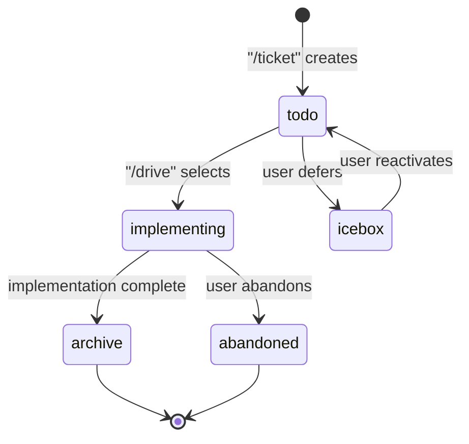
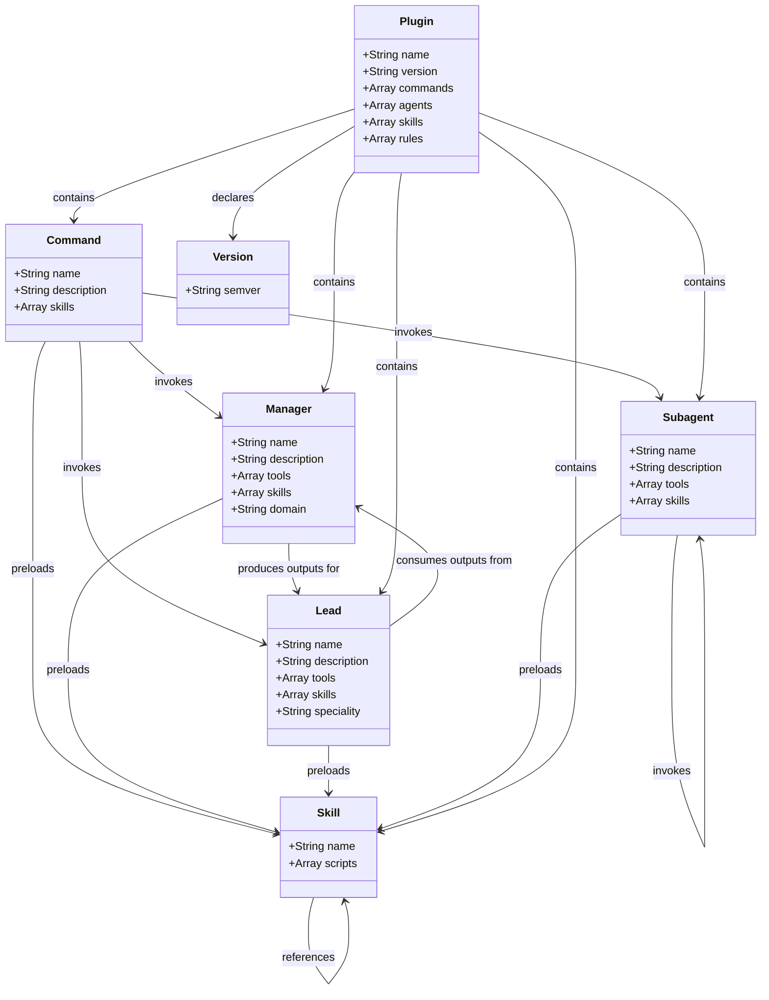
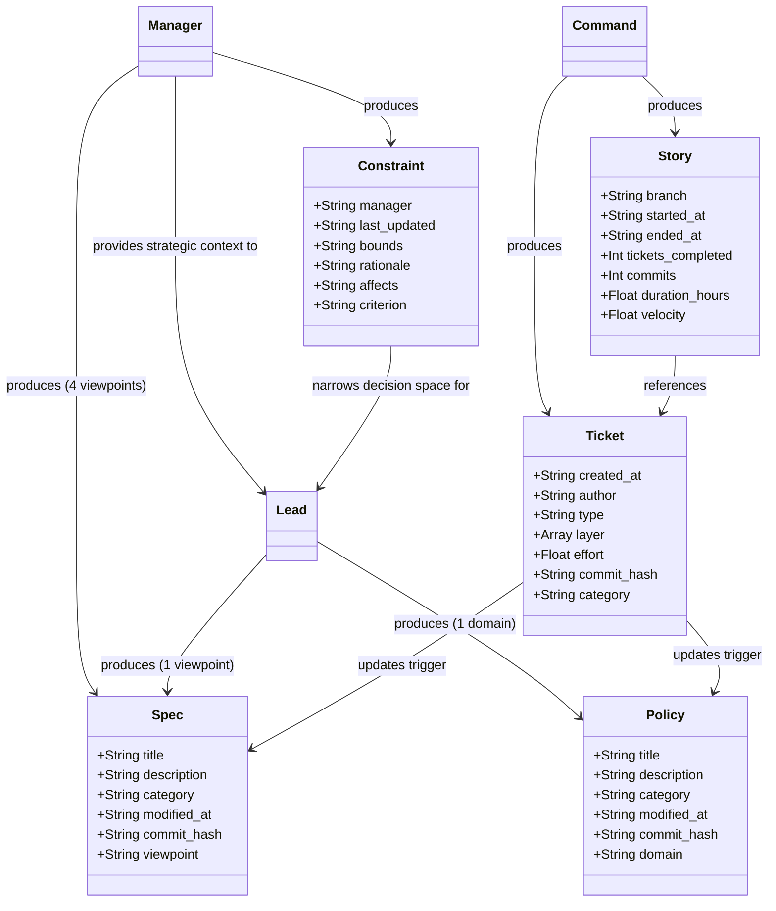

[English](model.md) | [Japanese](model_ja.md)

# Model Viewpoint

The Model Viewpoint describes the core domain concepts in Workaholic, their relationships, and the abstractions that govern how the system organizes work. Workaholic operates on a precisely defined domain model where tickets drive implementation, specs and policies document the system's architecture and practices, stories provide PR narratives, and a hierarchical agent architecture governs behavior. The domain enforces strict boundaries between orchestration (commands and subagents) and knowledge (skills), with version management maintaining synchronization across marketplace and plugin configuration files. A three-tier agent hierarchy distinguishes managers (strategic direction), leads (domain-specific execution), and general-purpose subagents (workflow automation).

## Domain Entities

### Ticket

A ticket is a markdown file in `.workaholic/tickets/` that describes a change request. It serves as the atomic unit of work in the system, containing YAML frontmatter with required fields including `created_at` (ISO 8601 timestamp), `author` (git email), `type` (enhancement, bugfix, refactoring, housekeeping), `layer` (YAML array from: UX, Domain, Infrastructure, DB, Config), `effort` (numeric hours), `commit_hash` (short hash added after implementation), and `category` (Added, Changed, Removed, Fixed, Deprecated). Tickets flow through a lifecycle: created in `todo/`, implemented during `/drive`, and archived to `archive/<branch-name>/` after commit. Abandoned tickets move to `abandoned/`. Deferred tickets may be placed in `icebox/` with explicit developer consent. The `/ticket` command creates tickets via the ticket-organizer subagent, which validates frontmatter through a PostToolUse hook defined in `hooks/hooks.json`.

### Ticket Lifecycle

Tickets transition through distinct states, each represented by a directory location:

```mermaid
stateDiagram-v2
    [*] --> todo: "/ticket" creates
    todo --> implementing: "/drive" selects
    implementing --> archive: implementation complete
    implementing --> abandoned: user abandons
    todo --> icebox: user defers
    icebox --> todo: user reactivates
    archive --> [*]
    abandoned --> [*]
```

The lifecycle enforces discipline through location constraints. Tickets in `todo/` are implementation-ready and await the `/drive` command. During implementation, tickets are read but remain in `todo/` until the archive-ticket skill moves them to `archive/<branch-name>/` after commit. The `abandoned/` state captures failures with developer-written analysis. The `icebox/` state is reserved for explicitly deferred work that requires user confirmation to avoid accidental neglect.

### Spec

A spec is a markdown document in `.workaholic/specs/` that captures the current state of the system from a specific architectural viewpoint. Unlike tickets which describe what should change, specs describe what exists now. Specs use viewpoint-based architecture with 8 viewpoints: stakeholder (users, goals, interaction patterns), model (domain concepts, relationships, abstractions), ux (user experience, interaction patterns, journeys, onboarding), usecase (workflows, command sequences, contracts), infrastructure (dependencies, file layout, installation), application (runtime behavior, orchestration, data flow), component (internal structure, module boundaries, decomposition), data (formats, frontmatter schemas, naming conventions), and feature (capability inventory, matrix, configuration). Each spec includes YAML frontmatter with `title`, `description`, `category`, `modified_at`, and `commit_hash`. The `/scan` command invokes 3 manager agents followed by 12 leader/writer agents to update all specs, changelog, policies, and terms based on the current codebase state.

### Policy

A policy is a markdown document in `.workaholic/policies/` that describes repository practices across 7 domains: test (verification strategy, testing levels, coverage targets), security (authentication, authorization, data protection, threat mitigation), quality (code standards, review processes, technical debt management), accessibility (inclusive design, WCAG compliance, assistive technology support), observability (logging, monitoring, alerting, metrics), delivery (deployment strategy, release process, rollback procedures), and recovery (backup strategy, disaster recovery, incident response). Policies document what exists and identify gaps, using `[Explicit]` and `[Inferred]` markers for findings. Policy files follow the same frontmatter conventions as specs and are generated by 7 lead subagents invoked in parallel during `/scan`.

### Constraint

A constraint is a deliberate boundary that narrows the decision space for leaders and human developers. Constraints are produced by manager agents following the Constraint Setting workflow defined in the managers-principle skill. Each constraint is written to `.workaholic/constraints/<scope>.md` where scope matches the manager's domain (project, architecture, quality). Constraints follow a structured template with fields: Bounds (what this limits), Rationale (why this exists), Affects (which leader agents this narrows), Criterion (how to verify compliance, must be falsifiable), and Review trigger (when to revisit). Constraints are not permanent and include explicit review triggers to prevent staleness. When a user declines to set a constraint, managers document it as "unconstrained by design" rather than leaving it implicit.

### Story

A story is a markdown document in `.workaholic/stories/` that synthesizes a branch's work into a PR-ready narrative. Stories serve as the single source of truth for PR descriptions, eliminating duplication between story generation and GitHub PR body assembly. Each story contains YAML frontmatter with branch name, timestamps (`started_at`, `ended_at`), and metrics (`tickets_completed`, `commits`, `duration_hours`, `velocity`), followed by seven sections: Summary (numbered CHANGELOG entries), Motivation (why the work was needed), Journey (how the work progressed), Changes (detailed explanation), Outcome (what was accomplished), Performance (metrics and pace analysis), and Notes (additional reviewer context). The `/report` command invokes the story-writer subagent to generate the story, which is then copied directly to the GitHub PR body by pr-creator.

### Plugin

A plugin is a distributable unit within the marketplace. The Workaholic marketplace (`marketplace.json`) currently contains one plugin: `core`. A plugin consists of commands, agents (subagents), skills, and rules, organized in a `.claude-plugin/plugin.json` manifest. Plugins are installed via `claude /plugin marketplace add qmu/workaholic`. The core plugin provides the complete development workflow including ticket-driven development (`/ticket`, `/drive`), documentation generation (`/scan`), and PR creation (`/report`). Each plugin declares a version field synchronized with the marketplace version.

### Command

A command is a slash-invocable entry point (e.g., `/ticket`, `/drive`, `/scan`, `/report`). Commands are thin orchestration layers (approximately 50-100 lines) that invoke subagents and skills. Commands live in `plugins/core/commands/` and are the topmost orchestration unit in the system. A command can invoke skills and subagents but cannot be invoked by other components. Commands define workflow steps, handle user interaction via AskUserQuestion, and coordinate multi-phase processes. The `/scan` command is an architectural outlier at approximately 100 lines because it inlines 15-agent parallel orchestration (3 managers + 12 leaders/writers) to provide real-time progress visibility to users.

### Subagent

A subagent is a focused AI agent invoked by commands or other subagents via the Task tool. Subagents are thin orchestration layers (approximately 20-40 lines) defined in `plugins/core/agents/`. They preload skills for domain knowledge and can invoke other subagents or skills. Subagents cannot invoke commands. Current subagents include ticket-organizer (ticket creation), story-writer (PR narrative synthesis), pr-creator (GitHub PR operations), changelog-writer (CHANGELOG.md updates), terms-writer (terminology maintenance), model-analyst (model viewpoint spec), release-readiness (release validation), release-note-writer (release note generation), overview-writer (ticket overview generation), performance-analyst (performance metrics), section-reviewer (documentation section review), drive-navigator (ticket queue navigation), history-discoverer (related ticket search), source-discoverer (relevant code search), ticket-discoverer (duplicate detection), 3 managers (project-manager, architecture-manager, quality-manager), and 10 leads (ux-lead, infra-lead, db-lead, test-lead, security-lead, quality-lead, a11y-lead, observability-lead, delivery-lead, recovery-lead). Subagents declare required tools in frontmatter and receive input via prompt, returning structured output conforming to their contract.

### Manager

A manager is a strategic agent that produces high-level outputs that leaders depend on. Managers sit above leaders in the agent hierarchy. There are currently 3 managers: project-manager (owns business context, stakeholder relationships, timeline, issues, solutions), architecture-manager (owns software experience definition, system structure, component taxonomy from infrastructure to application), and quality-manager (owns quality standards, assurance processes, continuous improvement practices). Managers follow the define-manager schema enforced in `.claude/rules/define-manager.md` with sections: Role, Responsibility, Goal, Outputs, and Default Policies. Managers preload the managers-principle skill for cross-cutting behavioral principles including Constraint Setting and Strategic Focus. The `/scan` command invokes managers first, ensuring their outputs are available before leaders execute.

### Lead

A lead is an agent that takes primary responsibility for a specific domain aspect. Leads consume manager outputs and produce domain-specific documentation. There are currently 10 leads: ux-lead (user experience, interaction patterns, journeys, onboarding), infra-lead (infrastructure dependencies, deployment, hosting), db-lead (database schema, migrations, data persistence), test-lead (test strategy, coverage, test infrastructure), security-lead (authentication, authorization, vulnerability mitigation), quality-lead (code standards, review processes, technical debt), a11y-lead (accessibility standards, WCAG compliance, assistive tech), observability-lead (logging, monitoring, alerting, metrics), delivery-lead (deployment, release process, rollback), recovery-lead (backup, disaster recovery, incident response). Leads follow the define-lead schema enforced in `.claude/rules/define-lead.md` with sections: Role, Responsibility, Goal, and Default Policies. Leads preload the leaders-principle skill for cross-cutting behavioral principles including Prior Term Consistency and Vendor Neutrality.

### Manager-Leader Orchestration Pattern

The `/scan` command establishes a two-phase orchestration pattern where managers execute first, followed by leaders and writers. This ordering ensures that strategic outputs (project context, architectural context, quality context) are available before domain-specific analysis begins:

```mermaid
flowchart TB
    User["User invokes /scan"]
    Command["/scan command"]

    subgraph "Phase 3a: Manager Agents (Parallel)"
        direction LR
        M1["project-manager"]
        M2["architecture-manager"]
        M3["quality-manager"]
    end

    subgraph "Phase 3b: Leader and Writer Agents (Parallel)"
        direction LR
        L1["ux-lead"]
        L2["model-analyst"]
        L3["infra-lead"]
        L4["db-lead"]
        L5["test-lead"]
        L6["security-lead"]
        L7["quality-lead"]
        L8["a11y-lead"]
        L9["observability-lead"]
        L10["delivery-lead"]
        L11["recovery-lead"]
        W1["changelog-writer"]
        W2["terms-writer"]
    end

    User --> Command
    Command -->|"Phase 3a (parallel)"| M1
    Command --> M2
    Command --> M3
    M1 -.->|"outputs available"| L1
    M2 -.->|"outputs available"| L1
    M3 -.->|"outputs available"| L1
    M1 -.->|"outputs available"| L2
    M2 -.->|"outputs available"| L2
    M1 -.->|"outputs available"| L3
    M2 -.->|"outputs available"| L3
    M1 -.->|"outputs available"| L4
    M2 -.->|"outputs available"| L4
    M1 -.->|"outputs available"| L5
    M3 -.->|"outputs available"| L5
    M1 -.->|"outputs available"| L6
    M2 -.->|"outputs available"| L6
    M1 -.->|"outputs available"| L7
    M3 -.->|"outputs available"| L7
    M1 -.->|"outputs available"| L8
    M3 -.->|"outputs available"| L8
    M1 -.->|"outputs available"| L9
    M2 -.->|"outputs available"| L9
    M1 -.->|"outputs available"| L10
    M2 -.->|"outputs available"| L10
    M1 -.->|"outputs available"| L11
    M2 -.->|"outputs available"| L11
    Command -->|"Phase 3b (parallel)"| L1
    Command --> L2
    Command --> L3
    Command --> L4
    Command --> L5
    Command --> L6
    Command --> L7
    Command --> L8
    Command --> L9
    Command --> L10
    Command --> L11
    Command --> W1
    Command --> W2
```

This pattern trades command size for user experience and strategic dependency management. The `/scan` command grew to approximately 100 lines to orchestrate 3 managers then 12 leaders/writers, displaying real-time progress for all agents instead of hiding them behind a single scanner subagent invocation. The `run_in_background: false` constraint is critical: background agents have Write and Edit tool permissions denied, causing silent failures when producing output files.

### Skill

A skill is the knowledge layer of the system, containing templates, guidelines, rules, and bundled shell scripts. Skills are comprehensive (approximately 50-150 lines), live in `plugins/core/skills/`, and may include an `sh/` directory with POSIX shell scripts. Skills can invoke other skills but cannot invoke subagents or commands. Shell scripts within skills are permission-free and use relative paths from `~/.claude/skills/<skill-name>/sh/<script>.sh`. Skills establish conventions and provide reusable domain knowledge to commands and subagents. Examples include gather-git-context (branch, base, URL extraction), gather-ticket-metadata (datetime, author), archive-ticket (lifecycle state transitions), write-changelog (CHANGELOG.md formatting), write-spec (spec document guidelines), write-terms (terminology management), translate (i18n conventions), validate-writer-output (post-generation verification), managers-principle (cross-cutting manager behavioral principles), leaders-principle (cross-cutting leader behavioral principles), manage-project (project manager skill), manage-architecture (architecture manager skill), manage-quality (quality manager skill), lead-ux (UX lead skill), and domain-specific lead skills for each of the 10 leads.

### Rule

A rule is a system-wide behavioral constraint applied via path patterns. Rules live in `plugins/core/rules/` and include general guidelines (architecture nesting policy, thin orchestration principle), diagram policies (Mermaid requirements, label quoting), i18n requirements (mandatory `_ja.md` translations for `.workaholic/`), shell scripting standards (POSIX compliance, bundled scripts in skills), TypeScript conventions, workaholic directory conventions (file structure, frontmatter requirements), define-lead schema enforcement (for `*-lead.md` agents and `lead-*/SKILL.md` skills), and define-manager schema enforcement (for `*-manager.md` agents and `manage-*/SKILL.md` skills). Rules are loaded by Claude Code based on path matching and influence behavior globally without explicit invocation.

### Version

A version is a semantic versioning string (MAJOR.MINOR.PATCH) that synchronizes across two configuration files: `.claude-plugin/marketplace.json` (root `version` field) and `plugins/core/.claude-plugin/plugin.json` (plugin `version` field). Version management follows CLAUDE.md conventions: read current version from marketplace.json, increment PATCH by default (e.g., 1.0.0 → 1.0.1), update both files, and commit with message `Bump version to v{new_version}`. The `/report` command automatically performs a patch increment before invoking story-writer, ensuring every PR merge triggers a new release via the GitHub Actions release workflow (`.github/workflows/release.yml`) which compares marketplace.json version against the latest release tag. The branching skill provides a `check-version-bump.sh` script that detects existing "Bump version" commits in the current branch to prevent double-bumping when `/report` runs multiple times.

### Changelog Entry

A changelog entry is a CHANGELOG.md line item derived from an archived ticket's category and description. Entries follow the format: `- **[Category]** Description ([commit](url), [ticket](url))` where category is one of Added, Changed, Removed, Fixed, or Deprecated. The changelog-writer subagent groups entries by category and inserts them under a branch-based heading in reverse chronological order. Entries provide traceability from CHANGELOG.md to git commits and ticket archives, enabling developers to understand the provenance of each change.

### Terms Document

A terms document is a markdown file in `.workaholic/terms/` that maintains consistent definitions for domain-specific terminology. Terms documents prevent naming inconsistencies and establish shared vocabulary across the codebase and documentation. The terms-writer subagent updates these documents based on branch changes, identifying new terms, updated definitions, inconsistencies, and deprecated terms. Terms documents follow the standard frontmatter schema and require `_ja.md` translations. The core-concepts.md file defines fundamental building blocks including plugin, command, skill, rule, agent, ticket-organizer, orchestrator, deny, preload, nesting-policy, viewpoint, viewpoint-analyst, policy-analyst, run_in_background, hook, PostToolUse, TiDD, context-window, manager, lead, define-manager, define-lead, managers-principle, and leaders-principle.

## Domain Relationships

The domain model enforces strict relationships between entities, governed by the component nesting hierarchy and lifecycle state machines. The introduction of managers adds a strategic tier above leads, creating a three-level hierarchy: managers define strategic context, leads consume that context to produce domain-specific documentation, and both consume skills for domain knowledge.

### Component Nesting Hierarchy

```mermaid
classDiagram
    class Command {
        +String name
        +String description
        +Array skills
    }

    class Manager {
        +String name
        +String description
        +Array tools
        +Array skills
        +String domain
    }

    class Lead {
        +String name
        +String description
        +Array tools
        +Array skills
        +String speciality
    }

    class Subagent {
        +String name
        +String description
        +Array tools
        +Array skills
    }

    class Skill {
        +String name
        +Array scripts
    }

    class Plugin {
        +String name
        +String version
        +Array commands
        +Array agents
        +Array skills
        +Array rules
    }

    class Version {
        +String semver
    }

    Command --> Manager : invokes
    Command --> Lead : invokes
    Command --> Subagent : invokes
    Command --> Skill : preloads
    Manager --> Skill : preloads
    Lead --> Skill : preloads
    Subagent --> Subagent : invokes
    Subagent --> Skill : preloads
    Skill --> Skill : references

    Manager --> Lead : produces outputs for
    Lead --> Manager : consumes outputs from

    Plugin --> Command : contains
    Plugin --> Manager : contains
    Plugin --> Lead : contains
    Plugin --> Subagent : contains
    Plugin --> Skill : contains
    Plugin --> Version : declares
```

The nesting hierarchy is strictly enforced: commands at the top, managers and leads in the middle tier, general-purpose subagents below that, skills at the bottom. Commands can invoke skills, subagents, managers, and leads. Managers and leads can preload skills and invoke other subagents. Subagents can preload skills and invoke other subagents. Skills can only reference other skills. This hierarchy ensures that orchestration remains thin and knowledge is centralized in reusable skills.

### Work Artifact Relationships

```mermaid
classDiagram
    class Ticket {
        +String created_at
        +String author
        +String type
        +Array layer
        +Float effort
        +String commit_hash
        +String category
    }

    class Spec {
        +String title
        +String description
        +String category
        +String modified_at
        +String commit_hash
        +String viewpoint
    }

    class Policy {
        +String title
        +String description
        +String category
        +String modified_at
        +String commit_hash
        +String domain
    }

    class Constraint {
        +String manager
        +String last_updated
        +String bounds
        +String rationale
        +String affects
        +String criterion
    }

    class Story {
        +String branch
        +String started_at
        +String ended_at
        +Int tickets_completed
        +Int commits
        +Float duration_hours
        +Float velocity
    }

    Command --> Ticket : produces
    Command --> Story : produces
    Manager --> Spec : produces (4 viewpoints)
    Manager --> Constraint : produces
    Lead --> Spec : produces (1 viewpoint)
    Lead --> Policy : produces (1 domain)

    Story --> Ticket : references
    Ticket --> Spec : updates trigger
    Ticket --> Policy : updates trigger
    Manager --> Lead : provides strategic context to
    Constraint --> Lead : narrows decision space for
```

The relationships reflect the workflow: commands create tickets and stories, managers produce strategic outputs (specs, constraints), leads produce domain-specific documentation (specs, policies), and tickets trigger updates to both specs and policies. Managers execute before leads to ensure strategic context is available.

## Domain Invariants

The domain enforces several invariants that constrain how concepts relate to each other:

**Frontmatter validation**: Tickets must always have valid YAML frontmatter validated by a PostToolUse hook (`hooks.json`). Missing or malformed frontmatter causes ticket creation to fail immediately. This constraint ensures tickets are machine-readable and suitable for automated processing.

**Nesting hierarchy**: The component nesting rules are strict and enforced through documentation, not code. Commands cannot invoke other commands. Subagents (including managers and leads) cannot invoke commands. Skills cannot invoke subagents or commands. This hierarchy prevents circular dependencies and maintains clear separation between orchestration and knowledge layers.

**Manager-leader sequencing**: During `/scan`, managers must execute before leaders. This invariant ensures that strategic outputs (project context, architectural context, quality context) are available for leaders to consume. The `/scan` command enforces this through two distinct parallel invocation phases: Phase 3a for managers, Phase 3b for leaders/writers.

**Manager output consumption**: Every manager output must be consumable by at least one leader. This invariant is enforced through the managers-principle Strategic Focus rule and the define-manager schema which requires each output to name its consuming leaders. Managers without leader consumers violate the strategic tier's purpose.

**Constraint falsifiability**: Every constraint produced by managers must be falsifiable, meaning a leader or developer can determine whether they are within or outside the constraint. This invariant is enforced through the Constraint Setting workflow in managers-principle, which requires each constraint to include a Criterion field that defines verification logic.

**Bilingual documentation**: Every document in `.workaholic/` must have a corresponding `_ja.md` translation. This invariant is enforced through the i18n rule and the translate skill. Files without translations are considered incomplete. The parallel link structure in README.md and README_ja.md must be maintained so that each language's index links to documents in the same language.

**Language segregation**: Files in `.workaholic/` are the only files that may contain Japanese content. All other content (code, code comments, commit messages, pull requests, documentation outside `.workaholic/`) must be in English. This invariant partitions the codebase into a bilingual user-facing layer and an English-only implementation layer.

**Version synchronization**: The marketplace version (`.claude-plugin/marketplace.json`) and plugin version (`plugins/core/.claude-plugin/plugin.json`) must remain synchronized. Version bumps update both files atomically. This invariant ensures that the marketplace catalog and plugin manifest agree on the distributed version.

**Shell script encapsulation**: Commands and subagents cannot contain complex inline shell commands (conditionals, pipes, loops, text processing). All multi-step or conditional shell operations must be extracted to bundled scripts in skills (`skills/<name>/sh/<script>.sh`). This invariant ensures consistency, testability, and permission-free execution.

**Write permission constraint**: Agents invoked with `run_in_background: true` have Write and Edit tool permissions automatically denied. This constraint necessitates the explicit `run_in_background: false` (the default) in the `/scan` command's Phase 3, where all 15 agents (3 managers + 12 leaders/writers) require Write/Edit to produce their output files. The constraint reflects Claude Code's security model where background agents cannot receive interactive prompts for dangerous operations.

**Ticket lifecycle monotonicity**: Tickets can only move forward in their lifecycle (todo → implementing → archive or abandoned). There is no reverse transition from archive back to todo. This invariant preserves historical integrity by treating archived tickets as immutable records of completed work.

**Schema enforcement by tier**: Manager agents and skills must conform to the define-manager schema (`.claude/rules/define-manager.md`) with Outputs section. Lead agents and skills must conform to the define-lead schema (`.claude/rules/define-lead.md`) without Outputs section. This invariant distinguishes the strategic tier (managers produce outputs) from the execution tier (leads consume outputs and produce documentation).

**Principle skill preloading**: All manager agents must preload managers-principle as their first skill. All lead agents must preload leaders-principle as their first skill. This invariant ensures that cross-cutting behavioral principles (Constraint Setting, Strategic Focus, Prior Term Consistency, Vendor Neutrality) are consistently applied across the hierarchy.

## Naming Conventions

The domain model encodes knowledge through systematic naming conventions that make entity types, relationships, and roles immediately recognizable:

**Command naming**: Commands use imperative verbs or short nouns that directly describe user intent: `/ticket` (create work item), `/drive` (implement work items), `/scan` (update documentation), `/report` (generate PR). The names are chosen to match natural language patterns in user requests.

**Manager naming**: Managers use role-based naming with `<domain>-manager` for agent files and `manage-<domain>` for skill files. The pattern is consistent: `project-manager` agent uses `manage-project` skill, `architecture-manager` agent uses `manage-architecture` skill, `quality-manager` agent uses `manage-quality` skill. The suffix indicates the strategic tier.

**Lead naming**: Leads use role-based naming with `<speciality>-lead` for agent files and `lead-<speciality>` for skill files. The pattern is consistent: `ux-lead` agent uses `lead-ux` skill, `infra-lead` agent uses `lead-infra` skill, `quality-lead` agent uses `lead-quality` skill. The suffix indicates primary responsibility for a domain.

**Subagent naming**: Non-manager, non-lead subagents use role-based naming with `-writer`, `-analyst`, `-organizer`, `-discoverer`, or `-navigator` suffixes. The pattern is `<domain>-<role>`: `ticket-organizer` (organizes ticket creation), `story-writer` (writes stories), `changelog-writer` (writes changelog), `model-analyst` (analyzes model viewpoint), `terms-writer` (writes terms), `history-discoverer` (finds related tickets), `source-discoverer` (finds relevant code), `ticket-discoverer` (detects duplicates), `drive-navigator` (navigates ticket queue). The suffix indicates the subagent's function: analysts produce specs/policies, writers produce changelog/terms/stories, organizers coordinate workflows, discoverers perform searches, navigators manage sequences.

**Skill naming**: Skills use verb-noun phrases that describe their purpose: `gather-git-context`, `archive-ticket`, `write-spec`, `validate-writer-output`, `translate`, `managers-principle`, `leaders-principle`, `branching`. The naming makes skills self-documenting and suggests their appropriate usage contexts. Principle skills use `-principle` suffix to indicate cross-cutting behavioral rules that apply to entire tiers.

**File naming**: Files follow consistent patterns based on entity type. Tickets use `YYYYMMDDHHMMSS-kebab-case-description.md` with timestamp prefix for chronological ordering. Specs use viewpoint slug: `stakeholder.md`, `model.md`, `ux.md`, `usecase.md`. Policies use domain slug: `test.md`, `security.md`, `quality.md`. Constraints use manager scope: `project.md`, `architecture.md`, `quality.md`. Stories use branch name: `drive-20260208-131649.md`. Translations append `_ja` suffix: `model_ja.md`, `test_ja.md`. The patterns make entity types identifiable from filenames alone.

**Directory naming**: Directories encode lifecycle state and categorization. `.workaholic/tickets/todo/` contains implementation-ready work. `.workaholic/tickets/archive/<branch-name>/` preserves completed work organized by branch. `.workaholic/specs/` contains viewpoint-based architecture documentation. `.workaholic/policies/` contains practice-based repository documentation. `.workaholic/constraints/` contains manager-produced decision boundaries. `.workaholic/stories/` contains PR narratives. `.workaholic/terms/` contains terminology definitions. The structure reflects the domain's mental model.

**Frontmatter field naming**: Frontmatter fields use snake_case with `_at` suffix for timestamps (`created_at`, `started_at`, `ended_at`, `modified_at`, `last_updated`) and descriptive nouns for other fields (`commit_hash`, `tickets_completed`, `duration_hours`, `velocity`). The suffix convention makes temporal fields immediately recognizable and distinguishable from other metadata.

**Branch naming**: Branches use prefix-timestamp format: `drive-YYYYMMDD-HHMMSS` for `/drive` sessions, `feat-YYYYMMDD-HHMMSS` for feature work. The timestamp enables chronological ordering and collision-free naming. The prefix indicates the branch's purpose.

## Assumptions

- [Explicit] The nesting hierarchy (command > manager/lead > subagent > skill) is documented in `CLAUDE.md` with a clear table showing what each component type can invoke.
- [Explicit] The manager tier was introduced to provide strategic direction above the execution tier, with 3 managers (project, architecture, quality) producing outputs consumed by 10 leads.
- [Explicit] The `/scan` command invokes managers before leaders in two distinct parallel phases to ensure manager outputs are available for leader consumption.
- [Explicit] The rename from communication-lead to ux-lead reflects a refinement of domain terminology to better capture the lead's responsibility for user experience.
- [Explicit] Ticket frontmatter fields are validated by the PostToolUse hook defined in `hooks/hooks.json`, ensuring all tickets conform to the schema.
- [Explicit] The marketplace currently contains exactly one plugin (`core`), as seen in `.claude-plugin/marketplace.json`.
- [Explicit] Version synchronization across marketplace.json and plugin.json is documented in `CLAUDE.md` Version Management section.
- [Explicit] The `/report` command automatically bumps the version before invoking story-writer, with idempotency protection via the `check-version-bump.sh` script to prevent double-bumping when `/report` runs multiple times in the same branch.
- [Explicit] The `run_in_background: false` constraint for scan agents ensures Write and Edit permissions are available for file generation.
- [Explicit] The define-manager schema is enforced via `.claude/rules/define-manager.md` with path patterns for `plugins/core/skills/manage-*/SKILL.md` and `plugins/core/agents/*-manager.md`.
- [Explicit] The define-lead schema is enforced via `.claude/rules/define-lead.md` with path patterns for `plugins/core/skills/lead-*/SKILL.md` and `plugins/core/agents/*-lead.md`.
- [Explicit] The managers-principle skill defines cross-cutting principles for all managers: Constraint Setting and Strategic Focus.
- [Explicit] The leaders-principle skill defines cross-cutting principles for all leads: Prior Term Consistency and Vendor Neutrality.
- [Explicit] Manager outputs are defined in the manage-* skill files with explicit naming of consuming leaders.
- [Explicit] The architecture-manager produces 4 viewpoint specs (application, component, feature, usecase) as documented in its manage-architecture skill Outputs section.
- [Explicit] The constraint file template is defined in managers-principle skill with required fields: Bounds, Rationale, Affects, Criterion, Review trigger.
- [Explicit] Skills were renamed from managers-policy/leaders-policy to managers-principle/leaders-principle to avoid semantic collision with the `.workaholic/policies/` output artifacts that leads produce.
- [Explicit] The manage-branch skill was renamed to branching to avoid naming collision with the manager tier naming pattern.
- [Inferred] The domain model is deliberately simple and flat, favoring markdown files over database structures, to maintain compatibility with git versioning and Claude Code's file-based tooling.
- [Inferred] The "thin orchestration, comprehensive knowledge" pattern reflects a design decision to keep agent behavior deterministic by centralizing domain knowledge in skills rather than distributing it across agents.
- [Inferred] The introduction of managers above leads suggests a principle that strategic context setting should be separated from domain-specific execution, with managers defining "what and why" and leads handling "how".
- [Inferred] The Constraint Setting workflow in managers-principle suggests that managers are primarily responsible for narrowing the decision space through deliberate boundaries (policies, guidelines, roadmaps, decision records), not for executing work directly.
- [Inferred] The mandatory bilingual documentation requirement reflects a stakeholder base that includes both English and Japanese speakers, with equal importance assigned to both languages.
- [Inferred] The ticket lifecycle's one-way state transitions (no reverse from archive to todo) suggest that the system values historical integrity and change tracking over workflow flexibility.
- [Inferred] The falsifiability requirement for constraints reflects a preference for concrete, verifiable boundaries over aspirational goals or vague guidelines.
