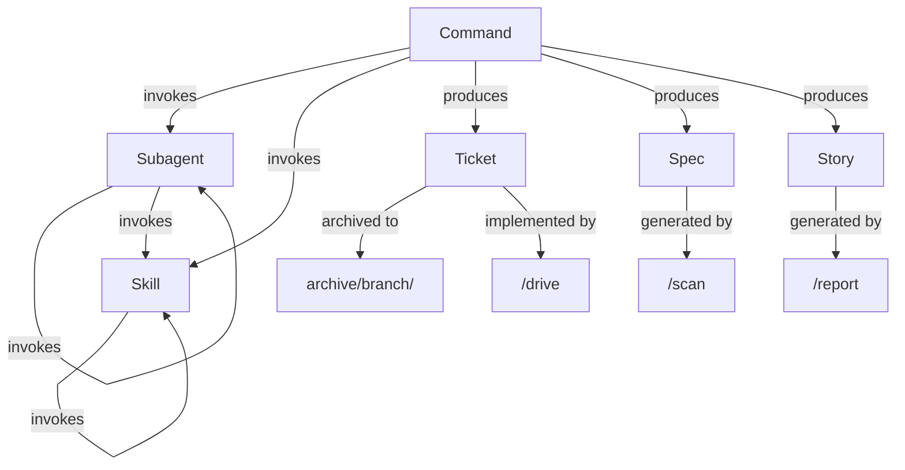

[English](model.md) | [Japanese](model_ja.md)

# 1. Model Viewpoint

Model Viewpoint は、Workaholic のコアドメイン概念、その関係性、およびシステムが作業を組織化する方法を支配する抽象化を記述します。Workaholic は、ticket が実装を駆動し、spec が結果を文書化し、階層化されたコンポーネントアーキテクチャが動作を支配する、小さいながらも正確に定義されたドメインモデル上で動作します。

## 2. Core Domain Concepts

### 2-1. Ticket

Ticket は `.workaholic/tickets/` にある変更要求を記述する markdown ファイルです。`created_at`、`author`、`type`（feature, fix, refactor, chore）、`layer`、`effort`、`category`（Added, Changed, Removed）、`commit_hash` を含む YAML frontmatter を持ちます。Ticket はライフサイクルを経ます：`todo/` で作成され、`/drive` 中に実装され、承認後に `archive/<branch-name>/` にアーカイブされます。放棄された ticket は `abandoned/` に移動します。未実装の ticket は developer の明示的な同意のもと `icebox/` に置かれることがあります。Ticket はシステムにおける作業の原子単位です。

### 2-2. Spec

Spec は `.workaholic/specs/` にあるシステムの現在の状態を記録する markdown ドキュメントです。何を変更すべきかを記述する ticket とは異なり、spec は現在何が存在するかを記述します。Spec は viewpoint ベースのアーキテクチャを使用し、8つの viewpoint（stakeholder、model、usecase、infrastructure、application、component、data、feature）がそれぞれ異なる視点からコードベースを分析します。

### 2-3. Policy

Policy は `.workaholic/policies/` にある、7つのドメイン（test、security、quality、accessibility、observability、delivery、recovery）にわたるリポジトリの実践を記述する markdown ドキュメントです。Policy は存在するものを文書化しギャップを特定し、発見事項に `[Explicit]` と `[Inferred]` マーカーを使用します。

### 2-4. Plugin

Plugin は marketplace 内の配布可能な単位です。Workaholic marketplace（`marketplace.json`）は現在1つの plugin `core` を含みます。Plugin は command、agent（subagent）、skill、rule で構成され、`.claude-plugin/plugin.json` マニフェストで組織化されます。

### 2-5. Command

Command は slash で呼び出し可能なエントリーポイントです（例：`/ticket`、`/drive`、`/scan`、`/report`）。Command は薄いオーケストレーション層（約50-100行）で、subagent と skill を呼び出します。`plugins/core/commands/` にあります。

### 2-6. Subagent

Subagent は command または他の subagent から Task tool を通じて呼び出される専用 AI エージェントです。薄いオーケストレーション層（約20-40行）で `plugins/core/agents/` に定義されます。Skill をプリロードし、他の subagent や skill を呼び出せます。Command は呼び出せません。

### 2-7. Skill

Skill はシステムの知識層で、テンプレート、ガイドライン、ルール、バンドルされた shell script を含みます。包括的（約50-150行）で `plugins/core/skills/` にあり、POSIX shell script を含む `sh/` ディレクトリを持つことがあります。Skill は他の skill のみを呼び出せます。

### 2-8. Rule

Rule はパスパターンを通じて適用されるシステム全体の動作制約です。`plugins/core/rules/` にあり、一般ガイドライン、ダイアグラムポリシー、i18n 要件、shell スクリプティング標準、TypeScript 規約、workaholic ディレクトリ規約を含みます。

## 3. Relationships

## 4. Domain Invariants

ドメインはいくつかの不変条件を強制し、概念間の関係を制約します。Ticket は PostToolUse hook（`hooks.json`）によって検証される有効な frontmatter を常に持つ必要があります。Nesting 階層は厳格です：最上位に command、中間に subagent、最下層に skill。`.workaholic/` 内のすべてのドキュメントは対応する `_ja.md` 翻訳を持つ必要があります。`.workaholic/` 内のファイルのみが日本語コンテンツを含むことができ、他のすべてのコンテンツは英語でなければなりません。

## 5. Assumptions

- [Explicit] nesting 階層（command > subagent > skill）は `CLAUDE.md` に明確なテーブルで文書化されています。
- [Explicit] ticket の frontmatter フィールドは `hooks/hooks.json` で定義された PostToolUse hook によって検証されます。
- [Explicit] marketplace は現在 `marketplace.json` に見られるように正確に1つの plugin（`core`）を含みます。
- [Inferred] ドメインモデルは git バージョニングと Claude Code のファイルベースツールとの互換性を維持するため、データベース構造よりも markdown ファイルを優先する意図的にシンプルでフラットなものです。
- [Inferred]「薄いオーケストレーション、包括的な知識」パターンは、ドメイン知識をエージェント間に分散するのではなく skill に集約することで、エージェントの動作を決定論的に保つ設計決定を反映しています。
