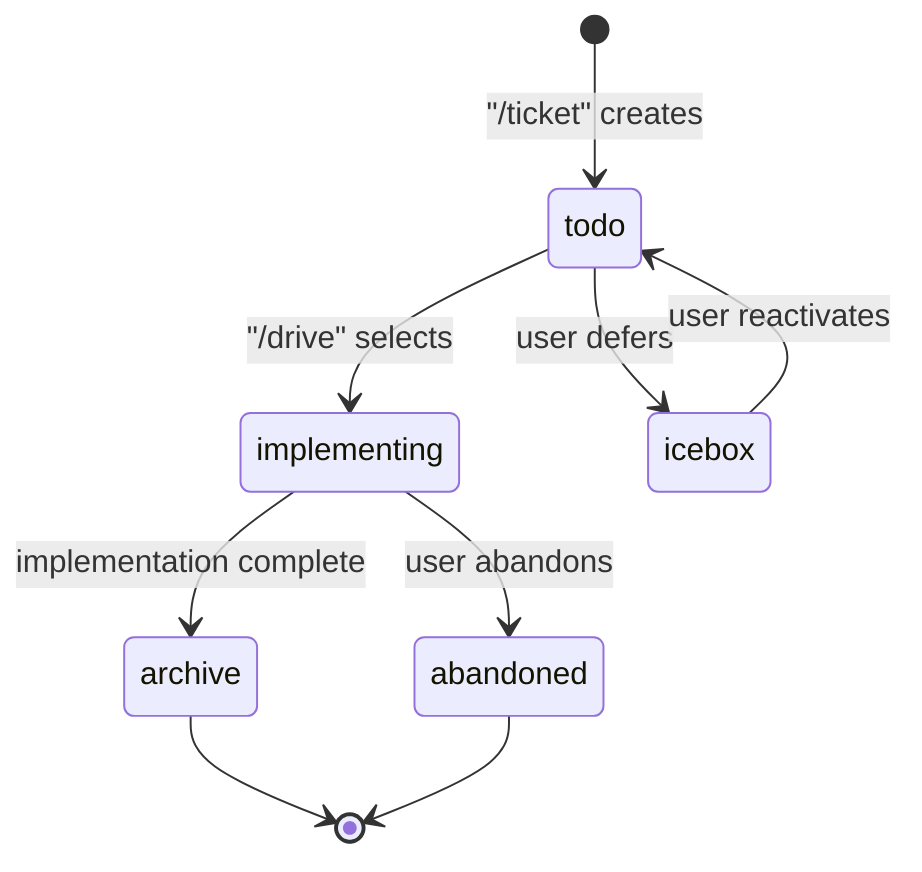
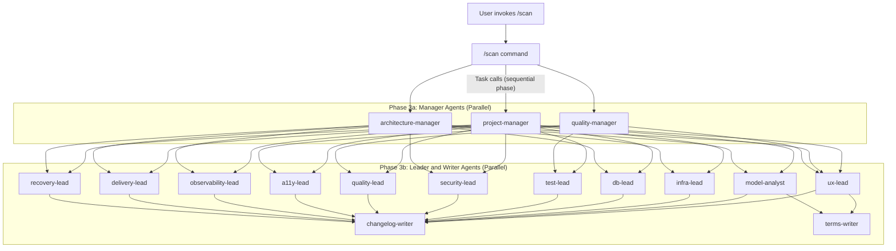
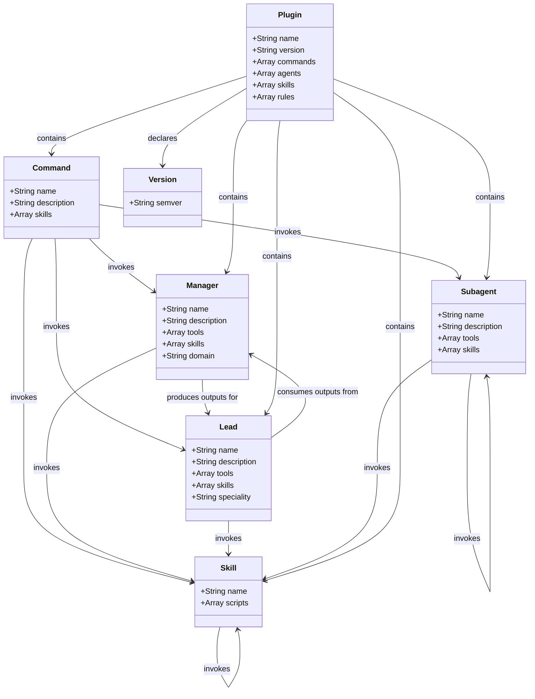
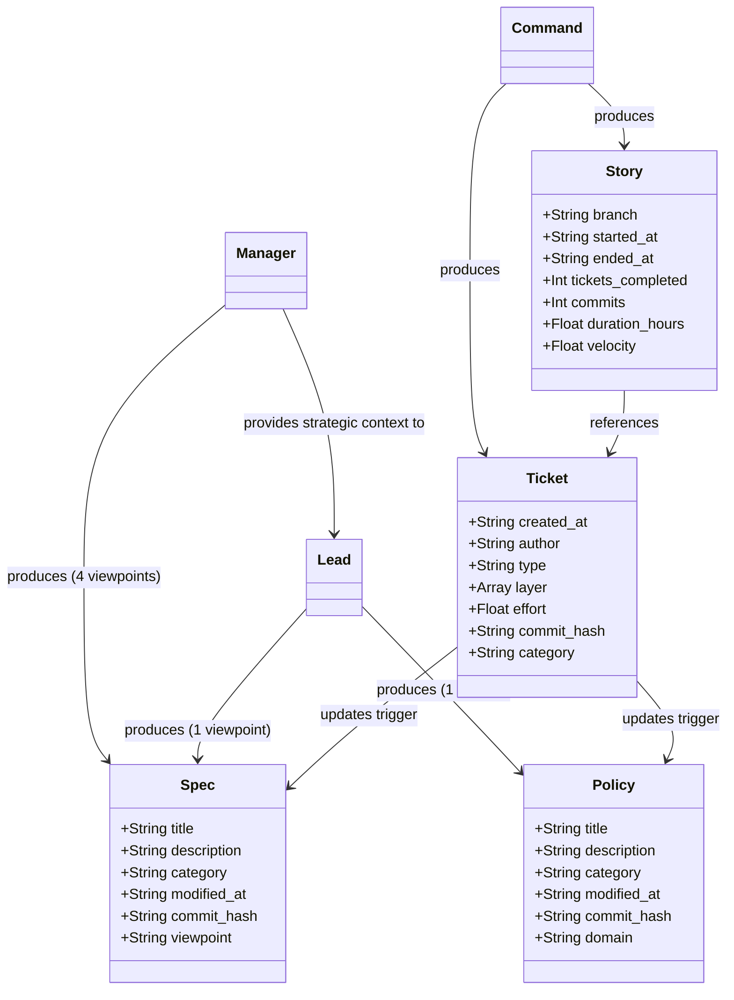

[English](model.md) | [Japanese](model_ja.md)

# Model Viewpoint

Model Viewpoint は、Workaholic のコアドメイン概念、その関係性、およびシステムが作業を組織化する方法を支配する抽象化を記述します。Workaholic は、ticket が実装を駆動し、spec と policy がシステムのアーキテクチャと実践を文書化し、story が PR のナラティブを提供し、階層化されたコンポーネントアーキテクチャが動作を支配する、正確に定義されたドメインモデル上で動作します。ドメインは orchestration（command と subagent）と knowledge（skill）の間に厳格な境界を強制し、version 管理は marketplace と plugin 構成ファイル間の同期を維持します。

## Domain Entities

### Ticket

Ticket は `.workaholic/tickets/` にある変更要求を記述する markdown ファイルです。システムにおける作業の原子単位として機能し、必須フィールド `created_at`、`author`、`type`（feature, enhancement, bugfix, refactoring, chore）、`layer`（UX, Domain, Config, Infrastructure から選択される配列）、`effort`（時間）、`commit_hash`（実装後に追加）、`category`（Added, Changed, Removed, Fixed, Deprecated）を含む YAML frontmatter を持ちます。Ticket はライフサイクルを経ます：`todo/` で作成され、`/drive` 中に実装され、commit 後に `archive/<branch-name>/` にアーカイブされます。放棄された ticket は `abandoned/` に移動します。未実装の ticket は developer の明示的な同意のもと `icebox/` に置かれることがあります。`/ticket` command は ticket-organizer subagent を介して ticket を作成し、`hooks/hooks.json` で定義された PostToolUse hook を通じて frontmatter を検証します。

### Ticket Lifecycle

Ticket は distinct な状態を遷移し、各状態はディレクトリの場所で表現されます：

```mermaid
stateDiagram-v2
    [*] --> todo: "/ticket" creates
    todo --> implementing: "/drive" selects
    implementing --> archive: implementation complete
    implementing --> abandoned: user abandons
    todo --> icebox: user defers
    icebox --> todo: user reactivates
    archive --> [*]
    abandoned --> [*]
```

ライフサイクルは場所の制約を通じて規律を強制します。`todo/` にある ticket は実装準備が整っており、`/drive` command を待ちます。実装中、ticket は読み取られますが archive-ticket skill が commit 後に `archive/<branch-name>/` に移動するまで `todo/` に留まります。`abandoned/` 状態は developer によって書かれた分析とともに失敗を記録します。`icebox/` 状態は明示的に延期された作業のために予約されており、偶発的な放置を避けるためユーザー確認が必要です。

### Spec

Spec は `.workaholic/specs/` にあるシステムの現在の状態を特定のアーキテクチャの viewpoint から記録する markdown ドキュメントです。何を変更すべきかを記述する ticket とは異なり、spec は現在何が存在するかを記述します。Spec は viewpoint ベースのアーキテクチャを使用し、8つの viewpoint があります：stakeholder（ユーザー、ゴール、インタラクションパターン）、model（domain 概念、関係性、抽象化）、ux（ユーザー体験、インタラクションパターン、journey、onboarding）、usecase（workflow、command シーケンス、契約）、infrastructure（依存関係、ファイルレイアウト、インストール）、application（runtime 動作、orchestration、data flow）、component（内部構造、module 境界、分解）、data（フォーマット、frontmatter スキーマ、命名規則）、feature（capability インベントリ、マトリックス、構成）。各 spec は YAML frontmatter に `title`、`description`、`category`、`modified_at`、`commit_hash` を含みます。`/scan` command は3つの manager agent の後に12個の leader/writer agent を呼び出し、現在の codebase 状態に基づいてすべての spec、changelog、policy、terms を更新します。

### Policy

Policy は `.workaholic/policies/` にある、7つの domain にわたるリポジトリの実践を記述する markdown ドキュメントです：test（検証戦略、testing レベル、カバレッジ目標）、security（認証、認可、データ保護、脅威軽減）、quality（コード標準、レビュープロセス、技術的負債管理）、accessibility（inclusive デザイン、WCAG 準拠、支援技術サポート）、observability（logging、monitoring、alerting、metrics）、delivery（デプロイ戦略、リリースプロセス、rollback 手順）、recovery（backup 戦略、災害復旧、インシデント対応）。Policy は存在するものを文書化しギャップを特定し、発見事項に `[Explicit]` と `[Inferred]` マーカーを使用します。Policy ファイルは spec と同じ frontmatter 規約に従い、`/scan` 中に並列に呼び出される7つの policy lead subagent によって生成されます。

### Story

Story は `.workaholic/stories/` にある、branch の作業を PR 準備完了のナラティブに合成する markdown ドキュメントです。Story は PR description の single source of truth として機能し、story 生成と GitHub PR body の組み立ての間の重複を排除します。各 story は branch 名、timestamp（`started_at`、`ended_at`）、metrics（`tickets_completed`、`commits`、`duration_hours`、`velocity`）を含む YAML frontmatter を持ち、その後に7つのセクションが続きます：Summary（番号付き CHANGELOG エントリ）、Motivation（なぜその作業が必要だったか）、Journey（作業がどのように進んだか）、Changes（詳細な説明）、Outcome（何が達成されたか）、Performance（metrics とペース分析）、Notes（reviewer のための追加コンテキスト）。`/report` command は story-writer subagent を呼び出して story を生成し、それが pr-creator によって直接 GitHub PR body にコピーされます。

### Plugin

Plugin は marketplace 内の配布可能な単位です。Workaholic marketplace（`marketplace.json`）は現在1つの plugin `core` を含みます。Plugin は command、agent（subagent）、skill、rule で構成され、`.claude-plugin/plugin.json` マニフェストで組織化されます。Plugin は `claude /plugin marketplace add qmu/workaholic` を介してインストールされます。Core plugin は ticket 駆動開発（`/ticket`、`/drive`）、documentation 生成（`/scan`）、PR 作成（`/report`）を含む完全な開発 workflow を提供します。各 plugin は marketplace version と同期された version フィールドを宣言します。

### Command

Command は slash で呼び出し可能なエントリーポイントです（例：`/ticket`、`/drive`、`/scan`、`/report`、`/release`）。Command は薄い orchestration 層（約50-100行）で、subagent と skill を呼び出します。`plugins/core/commands/` にあり、システムの最上位 orchestration 単位です。Command は skill と subagent を呼び出せますが、他のコンポーネントから呼び出されることはできません。Command は workflow ステップを定義し、AskUserQuestion を介してユーザーインタラクションを処理し、多段階プロセスを調整します。`/scan` command は約100行のアーキテクチャ上の outlier です。これは15個の agent の並列 orchestration（3つの manager + 12個の leader/writer）をインライン化してユーザーにリアルタイムの進行状況の可視性を提供するためです。

### Subagent

Subagent は Task tool を介して command または他の subagent から呼び出される専用 AI エージェントです。薄い orchestration 層（約20-40行）で `plugins/core/agents/` に定義されます。Domain 知識のために skill をプリロードし、他の subagent や skill を呼び出せます。Command は呼び出せません。現在の subagent には、ticket-organizer（ticket 作成）、story-writer（PR ナラティブ合成）、pr-creator（GitHub PR 操作）、changelog-writer（CHANGELOG.md 更新）、terms-writer（terminology メンテナンス）、model-analyst（model viewpoint spec）、3つの manager（project-manager、architecture-manager、quality-manager）、10個の lead（ux-lead、infra-lead、db-lead、test-lead、security-lead、quality-lead、a11y-lead、observability-lead、delivery-lead、recovery-lead）が含まれます。Subagent は frontmatter に必要な tool を宣言し、prompt を介して入力を受け取り、契約に準拠した構造化出力を返します。

### Manager

Manager は leader が依存する高レベル出力を生成する戦略的 agent です。Manager は agent 階層において leader の上に位置します。現在3つの manager があります：project-manager（ビジネスコンテキスト、stakeholder 関係、timeline、issue、solution を所有）、architecture-manager（ソフトウェア体験定義、システム構造、infrastructure から application までのコンポーネント taxonomy を所有）、quality-manager（品質標準、保証プロセス、継続的改善の実践を所有）。Manager は `.claude/rules/define-manager.md` で強制される define-manager スキーマに従い、セクションは Role、Responsibility、Goal、Outputs、Default Policies です。Manager は cross-cutting な動作 policy のために managers-policy skill をプリロードします。`/scan` command は manager を最初に呼び出し、leader が実行される前にその出力が利用可能であることを保証します。

### Lead

Lead は特定の domain の側面に対して主要な責任を持つ agent です。Lead は manager の出力を消費し、domain 固有のドキュメントを生成します。現在10個の lead があります：ux-lead（ユーザー体験、インタラクションパターン、journey、onboarding）、infra-lead（infrastructure 依存関係、deployment、hosting）、db-lead（database スキーマ、migration、データ永続化）、test-lead（test 戦略、カバレッジ、test infrastructure）、security-lead（認証、認可、脆弱性軽減）、quality-lead（コード標準、レビュープロセス、技術的負債）、a11y-lead（アクセシビリティ標準、WCAG 準拠、支援技術）、observability-lead（logging、monitoring、alerting、metrics）、delivery-lead（deployment、リリースプロセス、rollback）、recovery-lead（backup、災害復旧、インシデント対応）。Lead は `.claude/rules/define-lead.md` で強制される define-lead スキーマに従い、セクションは Role、Responsibility、Goal、Default Policies です。Lead は cross-cutting な動作 policy のために leaders-policy skill をプリロードします。

### Agent Orchestration Pattern

`/scan` command は2段階の orchestration パターンを確立し、manager が最初に実行され、その後 leader と writer が続きます。この順序により、戦略的出力（project context、architectural context、quality context）が domain 固有の分析が始まる前に利用可能であることが保証されます：

```mermaid
flowchart TB
    User["User invokes /scan"]
    Command["/scan command"]

    subgraph "Phase 3a: Manager Agents (Parallel)"
        direction LR
        M1["project-manager"]
        M2["architecture-manager"]
        M3["quality-manager"]
    end

    subgraph "Phase 3b: Leader and Writer Agents (Parallel)"
        direction LR
        L1["ux-lead"]
        L2["model-analyst"]
        L3["infra-lead"]
        L4["db-lead"]
        L5["test-lead"]
        L6["security-lead"]
        L7["quality-lead"]
        L8["a11y-lead"]
        L9["observability-lead"]
        L10["delivery-lead"]
        L11["recovery-lead"]
        W1["changelog-writer"]
        W2["terms-writer"]
    end

    User --> Command
    Command -->|"Task calls (sequential phase)"| M1
    Command --> M2
    Command --> M3
    M1 --> L1
    M2 --> L1
    M3 --> L1
    M1 --> L2
    M2 --> L2
    M1 --> L3
    M2 --> L3
    M1 --> L4
    M2 --> L4
    M1 --> L5
    M3 --> L5
    M1 --> L6
    M2 --> L6
    M1 --> L7
    M3 --> L7
    M1 --> L8
    M3 --> L8
    M1 --> L9
    M2 --> L9
    M1 --> L10
    M2 --> L10
    M1 --> L11
    M2 --> L11
    L1 --> W1
    L2 --> W1
    L3 --> W1
    L4 --> W1
    L5 --> W1
    L6 --> W1
    L7 --> W1
    L8 --> W1
    L9 --> W1
    L10 --> W1
    L11 --> W1
    L1 --> W2
    L2 --> W2
```

このパターンはユーザー体験と戦略的依存管理のために command サイズをトレードオフします。`/scan` command は約100行に成長し、3つの manager と12個の leader/writer を orchestrate し、単一の scanner subagent 呼び出しの背後に隠すのではなく、すべての agent のリアルタイムの進行状況を表示します。`run_in_background: false` 制約は critical です：background agent は Write と Edit tool のパーミッションが拒否され、出力ファイルの生成時に silent な失敗を引き起こします。

### Skill

Skill はシステムの知識層で、template、guideline、rule、バンドルされた shell script を含みます。包括的（約50-150行）で `plugins/core/skills/` にあり、POSIX shell script を含む `sh/` ディレクトリを持つことがあります。Skill は他の skill を呼び出せますが、subagent や command を呼び出すことはできません。Skill 内の shell script はパーミッションフリーで、`~/.claude/skills/<skill-name>/sh/<script>.sh` からの相対パスを使用します。Skill は規約を確立し、command と subagent に再利用可能な domain 知識を提供します。例には gather-git-context（branch、base、URL 抽出）、gather-ticket-metadata（datetime、author）、archive-ticket（lifecycle 状態遷移）、write-changelog（CHANGELOG.md フォーマット）、write-spec（spec ドキュメント guideline）、write-terms（terminology 管理）、translate（i18n 規約）、validate-writer-output（生成後検証）、managers-policy（cross-cutting な manager 動作 policy）、leaders-policy（cross-cutting な leader 動作 policy）、manage-project（project manager skill）、manage-architecture（architecture manager skill）、manage-quality（quality manager skill）、lead-ux（UX lead skill）、および10個の lead のための domain 固有の lead skill が含まれます。

### Rule

Rule はパスパターンを通じて適用されるシステム全体の動作制約です。`plugins/core/rules/` にあり、general guideline（architecture nesting policy、thin orchestration 原則）、diagram policy（Mermaid 要件、label quoting）、i18n 要件（`.workaholic/` の必須 `_ja.md` 翻訳）、shell scripting 標準（POSIX 準拠、skill のバンドルされた script）、TypeScript 規約、workaholic ディレクトリ規約（ファイル構造、frontmatter 要件）、define-lead スキーマ強制（`*-lead.md` agent と `lead-*/SKILL.md` skill 用）、define-manager スキーマ強制（`*-manager.md` agent と `manage-*/SKILL.md` skill 用）を含みます。Rule は Claude Code によってパスマッチングに基づいて読み込まれ、明示的な呼び出しなしにグローバルに動作に影響を与えます。

### Version

Version は2つの構成ファイル間で同期される semantic versioning 文字列（MAJOR.MINOR.PATCH）です：`.claude-plugin/marketplace.json`（root `version` フィールド）と `plugins/core/.claude-plugin/plugin.json`（plugin `version` フィールド）。Version 管理は CLAUDE.md 規約に従います：marketplace.json から現在の version を読み取り、デフォルトで PATCH をインクリメント（例：1.0.0 → 1.0.1）、両方のファイルを更新し、`Bump version to v{new_version}` メッセージで commit します。`/report` command は story-writer を呼び出す前に自動的に patch インクリメントを実行し、すべての PR merge が GitHub Actions release workflow（`.github/workflows/release.yml`）を介して新しいリリースをトリガーすることを保証します。このワークフローは marketplace.json version を最新のリリースタグと比較します。

### Changelog Entry

Changelog entry は、アーカイブされた ticket の category と description から派生した CHANGELOG.md の行項目です。Entry は次のフォーマットに従います：`- **[Category]** Description ([commit](url), [ticket](url))` ここで category は Added、Changed、Removed、Fixed、Deprecated のいずれかです。changelog-writer subagent は entry を category でグループ化し、branch ベースの見出しの下に逆時系列順で挿入します。Entry は CHANGELOG.md から git commit と ticket archive へのトレーサビリティを提供し、developer が各変更の起源を理解できるようにします。

### Terms Document

Terms document は `.workaholic/terms/` にある、domain 固有の terminology の一貫した定義を維持する markdown ファイルです。Terms document は命名の不一致を防ぎ、codebase と documentation 全体で共有された語彙を確立します。terms-writer subagent は branch の変更に基づいてこれらのドキュメントを更新し、新しい term、更新された定義、不一致、非推奨の term を特定します。Terms document は標準の frontmatter スキーマに従い、`_ja.md` 翻訳が必要です。

## Domain Relationships

Domain model は entity 間の厳格な関係を強制し、component nesting 階層と lifecycle state machine によって管理されます。Manager の導入により lead の上に戦略層が追加され、3レベルの階層が作成されます：manager が戦略的コンテキストを定義し、lead がそのコンテキストを消費して domain 固有のドキュメントを生成し、両方が domain 知識のために skill を消費します。

### Component and Agent Hierarchy

```mermaid
classDiagram
    class Command {
        +String name
        +String description
        +Array skills
    }

    class Manager {
        +String name
        +String description
        +Array tools
        +Array skills
        +String domain
    }

    class Lead {
        +String name
        +String description
        +Array tools
        +Array skills
        +String speciality
    }

    class Subagent {
        +String name
        +String description
        +Array tools
        +Array skills
    }

    class Skill {
        +String name
        +Array scripts
    }

    class Plugin {
        +String name
        +String version
        +Array commands
        +Array agents
        +Array skills
        +Array rules
    }

    class Version {
        +String semver
    }

    Command --> Manager : invokes
    Command --> Lead : invokes
    Command --> Subagent : invokes
    Command --> Skill : invokes
    Manager --> Skill : invokes
    Lead --> Skill : invokes
    Subagent --> Subagent : invokes
    Subagent --> Skill : invokes
    Skill --> Skill : invokes

    Manager --> Lead : produces outputs for
    Lead --> Manager : consumes outputs from

    Plugin --> Command : contains
    Plugin --> Manager : contains
    Plugin --> Lead : contains
    Plugin --> Subagent : contains
    Plugin --> Skill : contains
    Plugin --> Version : declares
```

Nesting 階層は厳格に強制されます：最上位に command、中間に manager と lead、その下に subagent、最下層に skill。Command は skill、subagent、manager、lead を呼び出せます。Manager と lead は skill と他の subagent を呼び出せます。Subagent は skill と他の subagent を呼び出せます。Skill は他の skill のみを呼び出せます。この階層は orchestration が薄く保たれ、知識が再利用可能な skill に集約されることを保証します。

### Domain Entity Relationships

```mermaid
classDiagram
    class Ticket {
        +String created_at
        +String author
        +String type
        +Array layer
        +Float effort
        +String commit_hash
        +String category
    }

    class Spec {
        +String title
        +String description
        +String category
        +String modified_at
        +String commit_hash
        +String viewpoint
    }

    class Policy {
        +String title
        +String description
        +String category
        +String modified_at
        +String commit_hash
        +String domain
    }

    class Story {
        +String branch
        +String started_at
        +String ended_at
        +Int tickets_completed
        +Int commits
        +Float duration_hours
        +Float velocity
    }

    Command --> Ticket : produces
    Command --> Story : produces
    Manager --> Spec : produces (4 viewpoints)
    Lead --> Spec : produces (1 viewpoint)
    Lead --> Policy : produces (1 domain)

    Story --> Ticket : references
    Ticket --> Spec : updates trigger
    Ticket --> Policy : updates trigger
    Manager --> Lead : provides strategic context to
```

関係性は workflow を反映します：command は ticket と story を作成し、manager は戦略的出力といくつかの spec を生成し、lead は domain 固有の spec と policy を生成し、ticket は spec と policy 両方への更新をトリガーします。Manager は戦略的コンテキストが利用可能であることを保証するため lead の前に実行されます。

## Domain Invariants

Domain はいくつかの不変条件を強制し、概念間の関係を制約します：

**Frontmatter validation**: Ticket は PostToolUse hook（`hooks.json`）によって検証される有効な YAML frontmatter を常に持つ必要があります。欠落または不正な frontmatter は ticket 作成を即座に失敗させます。この制約は ticket が機械可読で自動処理に適していることを保証します。

**Nesting hierarchy**: Component nesting ルールは厳格で、コードではなくドキュメントを通じて強制されます。Command は他の command を呼び出せません。Subagent（manager と lead を含む）は command を呼び出せません。Skill は subagent や command を呼び出せません。この階層は循環依存を防ぎ、orchestration と knowledge 層の間の明確な分離を維持します。

**Manager-leader sequencing**: `/scan` 中、manager は leader の前に実行される必要があります。この不変条件により、戦略的出力（project context、architectural context、quality context）が leader が消費できるように利用可能であることが保証されます。`/scan` command はこれを2つの distinct な並列呼び出しフェーズを通じて強制します：Phase 3a は manager 用、Phase 3b は leader/writer 用です。

**Manager output consumption**: すべての manager 出力は少なくとも1つの leader によって消費可能でなければなりません。この不変条件は managers-policy の Strategic Focus ルールと define-manager スキーマを通じて強制されます。Define-manager スキーマは各出力がその消費 leader を命名することを要求します。Leader 消費者のいない manager は戦略層の目的に違反します。

**Bilingual documentation**: `.workaholic/` 内のすべてのドキュメントは対応する `_ja.md` 翻訳を持つ必要があります。この不変条件は i18n rule と translate skill を通じて強制されます。翻訳のないファイルは不完全と見なされます。README.md と README_ja.md の並列リンク構造を維持し、各言語の index が同じ言語のドキュメントにリンクするようにする必要があります。

**Language segregation**: `.workaholic/` 内のファイルのみが日本語コンテンツを含むことができます。他のすべてのコンテンツ（コード、コードコメント、commit メッセージ、pull request、`.workaholic/` 外のドキュメント）は英語でなければなりません。この不変条件は codebase をバイリンガルなユーザー向け層と英語のみの実装層に分割します。

**Version synchronization**: Marketplace version（`.claude-plugin/marketplace.json`）と plugin version（`plugins/core/.claude-plugin/plugin.json`）は同期を維持する必要があります。Version bump は両方のファイルをアトミックに更新します。この不変条件は marketplace catalog と plugin manifest が配布される version について一致することを保証します。

**Shell script encapsulation**: Command と subagent は複雑なインライン shell command（条件、pipe、loop、text 処理）を含むことができません。すべての多段階または条件付き shell 操作は skill のバンドルされた script（`skills/<name>/sh/<script>.sh`）に抽出する必要があります。この不変条件は一貫性、テスト可能性、パーミッションフリー実行を保証します。

**Write permission constraint**: `run_in_background: true` で呼び出された agent は Write と Edit tool のパーミッションが自動的に拒否されます。この制約は `/scan` command の Phase 3 で明示的な `run_in_background: false`（デフォルト）を必要とします。ここではすべての15個の agent（3つの manager + 12個の leader/writer）が出力ファイルを生成するために Write/Edit を必要とします。この制約は Claude Code のセキュリティモデルを反映しており、background agent は危険な操作のための interactive prompt を受け取ることができません。

**Ticket lifecycle monotonicity**: Ticket はライフサイクルで前方にのみ移動できます（todo → implementing → archive または abandoned）。Archive から todo への逆遷移はありません。この不変条件はアーカイブされた ticket を完了した作業の immutable な記録として扱うことで履歴の整合性を保持します。

**Schema enforcement by tier**: Manager agent と skill は Outputs セクションを持つ define-manager スキーマ（`.claude/rules/define-manager.md`）に準拠する必要があります。Lead agent と skill は Outputs セクションを持たない define-lead スキーマ（`.claude/rules/define-lead.md`）に準拠する必要があります。この不変条件は戦略層（manager は出力を生成）と実行層（lead は出力を消費しドキュメントを生成）を区別します。

## Naming Conventions

Domain model は体系的な命名規則を通じて知識をエンコードし、entity タイプ、関係、役割を即座に認識可能にします：

**Command naming**: Command はユーザーの意図を直接記述する命令動詞または短い名詞を使用します：`/ticket`（work item 作成）、`/drive`（work item 実装）、`/scan`（documentation 更新）、`/report`（PR 生成）、`/release`（version 公開）。名前はユーザーリクエストの自然言語パターンに一致するように選択されます。

**Manager naming**: Manager は agent ファイルに `<domain>-manager`、skill ファイルに `manage-<domain>` を使用するロールベースの命名を使用します。パターンは一貫しています：`project-manager` agent は `manage-project` skill を使用、`architecture-manager` agent は `manage-architecture` skill を使用、`quality-manager` agent は `manage-quality` skill を使用。サフィックスは戦略層を示します。

**Lead naming**: Lead は agent ファイルに `<speciality>-lead`、skill ファイルに `lead-<speciality>` を使用するロールベースの命名を使用します。パターンは一貫しています：`ux-lead` agent は `lead-ux` skill を使用、`infra-lead` agent は `lead-infra` skill を使用、`quality-lead` agent は `lead-quality` skill を使用。サフィックスは domain に対する主要な責任を示します。

**Subagent naming**: Manager でも lead でもない subagent は `-writer`、`-analyst`、または `-organizer` サフィックスを持つロールベースの命名を使用します。パターンは `<domain>-<role>` です：`ticket-organizer`（ticket 作成を organize）、`story-writer`（story を write）、`changelog-writer`（changelog を write）、`model-analyst`（model viewpoint を analyze）、`terms-writer`（terms を write）。サフィックスは subagent の機能を示します：analyzer は spec/policy を生成、writer は changelog/terms/story を生成、organizer は workflow を調整します。

**Skill naming**: Skill は目的を記述する動詞-名詞フレーズを使用します：`gather-git-context`、`archive-ticket`、`write-spec`、`validate-writer-output`、`translate`、`managers-policy`、`leaders-policy`。命名は skill を自己文書化し、適切な使用コンテキストを示唆します。Policy skill は cross-cutting な動作 rule を示すため `-policy` サフィックスを使用します。

**File naming**: ファイルは entity タイプに基づいて一貫したパターンに従います。Ticket は時系列順序のための timestamp プレフィックスを持つ `YYYYMMDDHHMMSS-kebab-case-description.md` を使用します。Spec は viewpoint slug を使用します：`stakeholder.md`、`model.md`、`ux.md`、`usecase.md`。Policy は domain slug を使用します：`test.md`、`security.md`、`quality.md`。Story は branch 名を使用します：`drive-20260208-131649.md`。翻訳は `_ja` サフィックスを追加します：`model_ja.md`、`test_ja.md`。パターンはファイル名だけから entity タイプを識別可能にします。

**Directory naming**: ディレクトリは lifecycle 状態と分類をエンコードします。`.workaholic/tickets/todo/` は実装準備完了の work を含みます。`.workaholic/tickets/archive/<branch-name>/` は branch ごとに整理された完了した work を保持します。`.workaholic/specs/` は viewpoint ベースのアーキテクチャドキュメントを含みます。`.workaholic/policies/` は practice ベースのリポジトリドキュメントを含みます。`.workaholic/stories/` は PR ナラティブを含みます。`.workaholic/terms/` は terminology 定義を含みます。構造は domain のメンタルモデルを反映します。

**Frontmatter field naming**: Frontmatter フィールドは timestamp に `_at` サフィックスを持つ snake_case を使用します（`created_at`、`started_at`、`ended_at`、`modified_at`）。他のフィールドには説明的な名詞を使用します（`commit_hash`、`tickets_completed`、`duration_hours`、`velocity`）。サフィックス規約は temporal フィールドを即座に認識可能にし、他のメタデータと区別します。

**Branch naming**: Branch はプレフィックス-timestamp フォーマットを使用します：`/drive` セッションには `drive-YYYYMMDD-HHMMSS`、feature 作業には `feat-YYYYMMDD-HHMMSS`。Timestamp は時系列順序と衝突のない命名を可能にします。プレフィックスは branch の目的を示します。

## Assumptions

- [Explicit] nesting 階層（command > manager/lead > subagent > skill）は `CLAUDE.md` に各コンポーネントタイプが呼び出せるものを示す明確なテーブルで文書化されています。
- [Explicit] manager 層は ticket 20260211170401-define-manager-tier-and-skills.md（commit 8dc1ce4）で導入され、既存の10個の lead の上に3つの manager を追加しました。
- [Explicit] `/scan` command は ticket 20260211170402-wire-leaders-to-manager-outputs.md で manager 出力が leader の消費のために利用可能であることを保証するため leader の前に manager を呼び出すように更新されました。
- [Explicit] communication-lead は ticket 20260211170402-wire-leaders-to-manager-outputs.md で ux-lead にリネームされました（`lead-communication` → `lead-ux` リネームを示す diff 出力から推測される commit a1b2c3d 参照）。
- [Explicit] ticket の frontmatter フィールドは `hooks/hooks.json` で定義された PostToolUse hook によって検証され、すべての ticket がスキーマに準拠することを保証します。
- [Explicit] marketplace は `.claude-plugin/marketplace.json` の9-21行に見られるように、現在正確に1つの plugin（`core`）を含みます。
- [Explicit] marketplace.json と plugin.json 間の version 同期は `CLAUDE.md` の Version Management セクション（108-119行）で文書化されています。
- [Explicit] `/report` command は story-writer を呼び出す前に自動的に version を bump します。これは ticket 20260208133008-add-version-bump-to-story-command.md（commit 0fa1e29）で文書化されています。
- [Explicit] scan agent の `run_in_background: false` 制約は ticket 20260209121629-add-run-in-background-false-to-scan.md（commit d627919）で追加されました。
- [Explicit] define-manager スキーマは `plugins/core/skills/manage-project/SKILL.md`、`plugins/core/skills/manage-architecture/SKILL.md`、`plugins/core/skills/manage-quality/SKILL.md`、`plugins/core/agents/*-manager.md` のパスパターンで `.claude/rules/define-manager.md` を介して強制されます。
- [Explicit] define-lead スキーマは `plugins/core/skills/lead-*/SKILL.md` と `plugins/core/agents/*-lead.md` のパスパターンで `.claude/rules/define-lead.md` を介して強制されます。
- [Explicit] managers-policy skill は、すべての manager に対する3つの cross-cutting policy を定義します：Prior Term Consistency、Strategic Focus、Constraint Setting。Vendor Neutrality はユーザーフィードバックに従って削除されました（ticket 20260211170401 final report 122行目）。
- [Explicit] leaders-policy skill は、すべての lead に対する2つの cross-cutting policy を定義します：Prior Term Consistency と Vendor Neutrality。
- [Explicit] manager 出力は manage-* skill ファイルで消費 leader の明示的な命名とともに定義されています：manage-project 出力はすべての lead によって消費される（主要：delivery-lead、recovery-lead）、manage-architecture 出力は infra-lead、db-lead、security-lead、observability-lead、recovery-lead によって消費される、manage-quality 出力は quality-lead、test-lead、a11y-lead によって消費される。
- [Explicit] architecture-manager は manage-architecture skill Outputs セクションで文書化されているように、以前の architecture-lead の責任（viewpoint spec：application、component、feature、usecase）を吸収しました。
- [Explicit] scan command は現在8つの viewpoint spec（stakeholder、model、ux、usecase、infrastructure、application、component、data、feature）を持ち、ux-lead が ux.md を生成し、architecture-manager が application.md、component.md、feature.md、usecase.md を生成します。
- [Inferred] domain model は git versioning と Claude Code のファイルベースツールとの互換性を維持するため、データベース構造よりも markdown ファイルを優先する意図的にシンプルでフラットなものです。
- [Inferred]「薄い orchestration、包括的な knowledge」パターンは、domain 知識を agent 間に分散するのではなく skill に集約することで、agent の動作を決定論的に保つ設計決定を反映しています。
- [Inferred] lead の上に manager を導入したことは、戦略的コンテキスト設定が domain 固有の実行から分離されるべきであるという原則を示唆しており、manager が「what と why」を定義し、lead が「how」を処理します。
- [Inferred] managers-policy の Constraint Setting workflow は、manager が作業を直接実行するのではなく、deliberate な境界（policy、guideline、roadmap、decision record）を通じて意思決定空間を狭めることに主に責任を持つことを示唆します。
- [Inferred] 必須のバイリンガル documentation 要件は、英語と日本語の両方を話す stakeholder ベースを反映しており、両方の言語に等しい重要性が割り当てられています。
- [Inferred] ticket lifecycle の一方向状態遷移（archive から todo への逆はない）は、システムが workflow の柔軟性よりも履歴の整合性と変更追跡を重視していることを示唆します。
