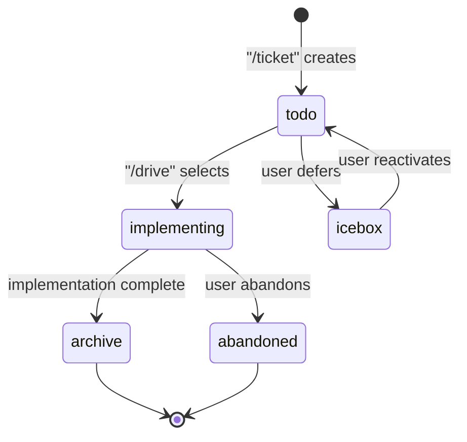
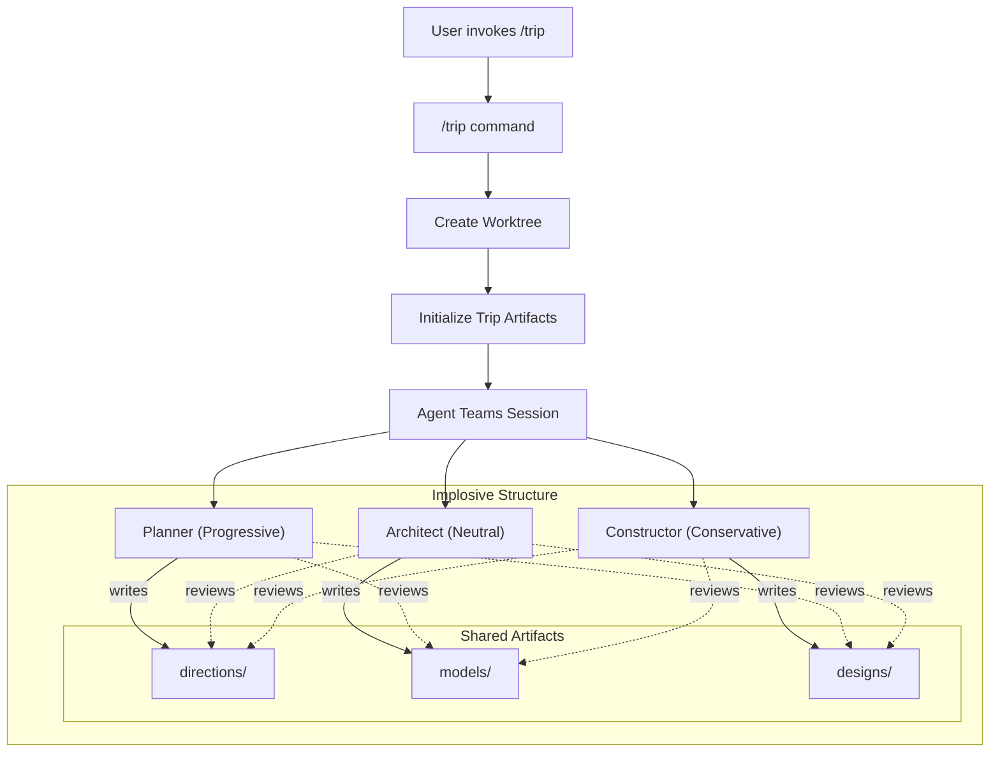
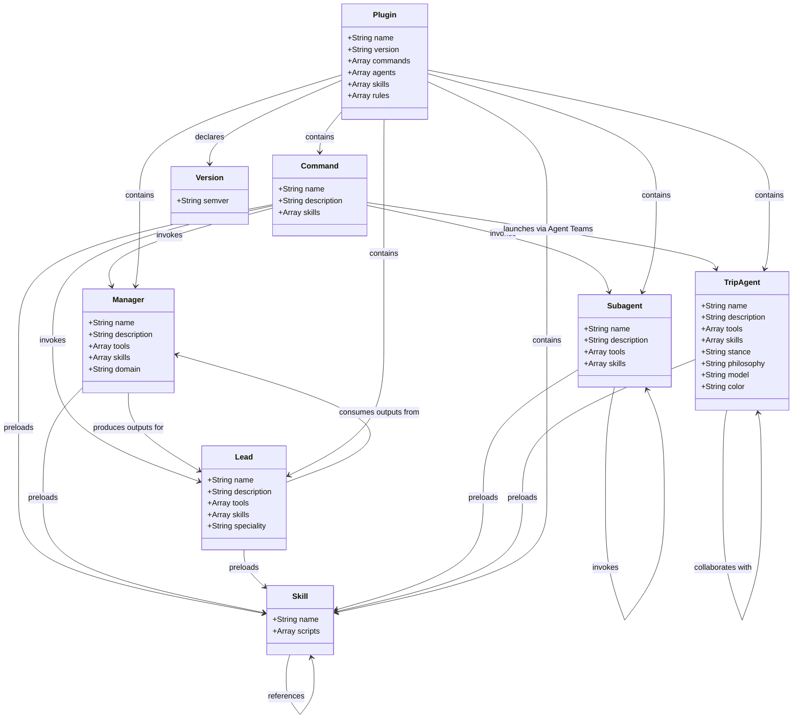
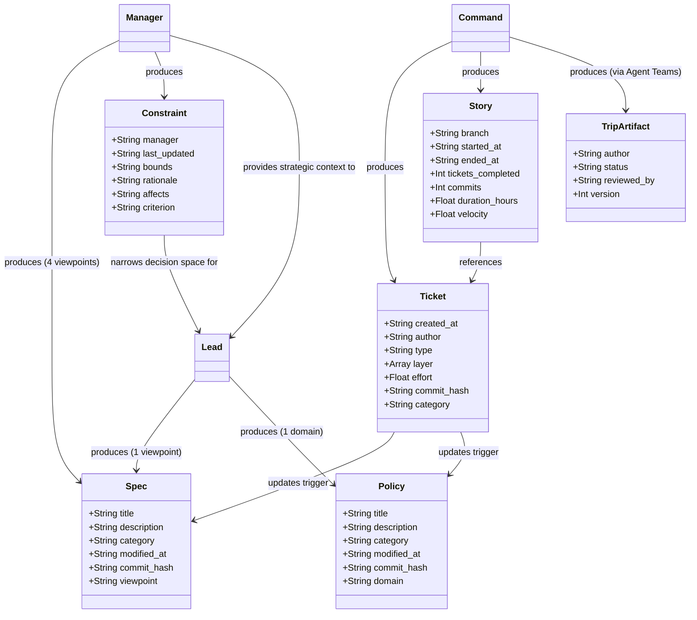

[English](model.md) | [Japanese](model_ja.md)

# Model Viewpoint

Model Viewpoint は、Workaholic のコアドメイン概念、その関係性、およびシステムが作業を組織化する方法を支配する抽象化を記述します。Workaholic は、ticket が実装を駆動し、spec と policy がシステムのアーキテクチャと実践を文書化し、story が PR のナラティブを提供し、階層的な agent アーキテクチャが動作を支配する、正確に定義されたドメインモデル上で動作します。ドメインは orchestration（command と subagent）と knowledge（skill）の間に厳格な境界を強制し、version 管理は marketplace と plugin 構成ファイル間の同期を維持します。3層の agent 階層が manager（戦略的方向性）、lead（domain 固有の実行）、汎用 subagent（workflow 自動化）を区別します。Marketplace は根本的に異なる orchestration モデルを持つ2つの plugin を配布します：drivin は単一 agent の ticket 駆動 workflow を使用し、trippin は git worktree 分離による Implosive Structure protocol に基づく3 agent 協調 workflow を使用します。

## Domain Entities

### Ticket

Ticket は `.workaholic/tickets/` にある変更要求を記述する markdown ファイルです。システムにおける作業の原子単位として機能し、必須フィールド `created_at`（ISO 8601 timestamp）、`author`（git email）、`type`（enhancement, bugfix, refactoring, housekeeping）、`layer`（UX, Domain, Infrastructure, DB, Config から選択される YAML 配列）、`effort`（数値の時間）、`commit_hash`（実装後に追加される短い hash）、`category`（Added, Changed, Removed, Fixed, Deprecated）を含む YAML frontmatter を持ちます。Ticket はライフサイクルを経ます：`todo/` で作成され、`/drive` 中に実装され、commit 後に `archive/<branch-name>/` にアーカイブされます。放棄された ticket は `abandoned/` に移動します。延期された ticket は developer の明示的な同意のもと `icebox/` に置かれることがあります。`/ticket` command は ticket-organizer subagent を介して ticket を作成し、`hooks/hooks.json` で定義された PostToolUse hook を通じて frontmatter を検証します。

### Ticket Lifecycle

Ticket は distinct な状態を遷移し、各状態はディレクトリの場所で表現されます：

```mermaid
stateDiagram-v2
    [*] --> todo: "/ticket" creates
    todo --> implementing: "/drive" selects
    implementing --> archive: implementation complete
    implementing --> abandoned: user abandons
    todo --> icebox: user defers
    icebox --> todo: user reactivates
    archive --> [*]
    abandoned --> [*]
```

ライフサイクルは場所の制約を通じて規律を強制します。`todo/` にある ticket は実装準備が整っており、`/drive` command を待ちます。実装中、ticket は読み取られますが archive-ticket skill が commit 後に `archive/<branch-name>/` に移動するまで `todo/` に留まります。`abandoned/` 状態は developer によって書かれた分析とともに失敗を記録します。`icebox/` 状態は明示的に延期された作業のために予約されており、偶発的な放置を避けるためユーザー確認が必要です。

### Spec

Spec は `.workaholic/specs/` にあるシステムの現在の状態を特定のアーキテクチャの viewpoint から記録する markdown ドキュメントです。何を変更すべきかを記述する ticket とは異なり、spec は現在何が存在するかを記述します。Spec は viewpoint ベースのアーキテクチャを使用し、8つの viewpoint があります：stakeholder（ユーザー、ゴール、インタラクションパターン）、model（domain 概念、関係性、抽象化）、ux（ユーザー体験、インタラクションパターン、journey、onboarding）、usecase（workflow、command シーケンス、契約）、infrastructure（依存関係、ファイルレイアウト、インストール）、application（runtime 動作、orchestration、data flow）、component（内部構造、module 境界、分解）、data（フォーマット、frontmatter スキーマ、命名規則）、feature（capability インベントリ、マトリックス、構成）。各 spec は YAML frontmatter に `title`、`description`、`category`、`modified_at`、`commit_hash` を含みます。`/scan` command は3つの manager agent の後に12個の leader/writer agent を呼び出し、現在の codebase 状態に基づいてすべての spec、changelog、policy、terms を更新します。

### Policy

Policy は `.workaholic/policies/` にある、7つの domain にわたるリポジトリの実践を記述する markdown ドキュメントです：test（検証戦略、testing レベル、カバレッジ目標）、security（認証、認可、データ保護、脅威軽減）、quality（コード標準、レビュープロセス、技術的負債管理）、accessibility（inclusive デザイン、WCAG 準拠、支援技術サポート）、observability（logging、monitoring、alerting、metrics）、delivery（デプロイ戦略、リリースプロセス、rollback 手順）、recovery（backup 戦略、災害復旧、インシデント対応）。Policy は存在するものを文書化しギャップを特定し、発見事項に `[Explicit]` と `[Inferred]` マーカーを使用します。Policy ファイルは spec と同じ frontmatter 規約に従い、`/scan` 中に並列に呼び出される7つの lead subagent によって生成されます。

### Constraint

Constraint は leader と人間の developer の decision space を狭める deliberate な境界です。Constraint は managers-principle skill で定義された Constraint Setting workflow に従って manager agent によって生成されます。各 constraint は `.workaholic/constraints/<scope>.md` に書き込まれ、scope は manager の domain（project, architecture, quality）に一致します。Constraint は構造化されたテンプレートに従います：Bounds（何を制限するか）、Rationale（なぜ存在するか）、Affects（どの leader agent を狭めるか）、Criterion（どのように compliance を検証するか、falsifiable でなければならない）、Review trigger（いつ再検討するか）。Constraint は永続的ではなく、staleness を防ぐために明示的な review trigger を含みます。ユーザーが constraint の設定を拒否した場合、manager は implicit なままにするのではなく "unconstrained by design" として文書化します。

### Story

Story は `.workaholic/stories/` にある、branch の作業を PR 準備完了のナラティブに合成する markdown ドキュメントです。Story は PR description の single source of truth として機能し、story 生成と GitHub PR body の組み立ての間の重複を排除します。各 story は branch 名、timestamp（`started_at`、`ended_at`）、metrics（`tickets_completed`、`commits`、`duration_hours`、`velocity`）を含む YAML frontmatter を持ち、その後に7つのセクションが続きます：Summary（番号付き CHANGELOG エントリ）、Motivation（なぜその作業が必要だったか）、Journey（作業がどのように進んだか）、Changes（詳細な説明）、Outcome（何が達成されたか）、Performance（metrics とペース分析）、Notes（reviewer のための追加コンテキスト）。`/report` command は story-writer subagent を呼び出して story を生成し、それが pr-creator によって直接 GitHub PR body にコピーされます。

### Plugin

Plugin は marketplace 内の distributable な単位です。Workaholic marketplace（`marketplace.json`）は現在2つの plugin を含みます：`drivin`（開発 workflow）と `trippin`（探索 workflow）。Plugin は command、agent（subagent）、skill、rule から構成され、`.claude-plugin/plugin.json` manifest で組織化されます。Plugin は `claude /plugin marketplace add qmu/workaholic` を介してインストールされます。Drivin plugin は ticket 駆動開発（`/ticket`、`/drive`）、documentation 生成（`/scan`）、PR 作成（`/report`）を含む完全な開発 workflow を提供します。Trippin plugin は Agent Teams を介した `/trip` command による3 agent 協調の AI 指向探索を提供します。各 plugin は marketplace version と同期された version フィールドを宣言し、3つの構成ファイル間で version 同期が必要です。

### Command

Command は slash で呼び出せるエントリーポイントです（例：`/ticket`、`/drive`、`/scan`、`/report`、`/trip`）。Command は subagent と skill を呼び出す薄い orchestration layer（約50-100行）です。Command は `plugins/<plugin-name>/commands/` に配置され、システムの最上位 orchestration 単位です。Command は skill と subagent を呼び出せますが、他のコンポーネントから呼び出されることはできません。Command は workflow ステップを定義し、AskUserQuestion を介してユーザーインタラクションを処理し、multi-phase プロセスを調整します。`/scan` command は15個の agent の並列 orchestration（3つの manager + 12個の leader/writer）をインライン化して real-time の進捗可視性をユーザーに提供するため、約100行というアーキテクチャ上の outlier です。`/trip` command は個別の subagent を順次呼び出すのではなく Agent Teams session を launch するという点でユニークです。

### Subagent

Subagent は command または他の subagent によって Task tool を介して呼び出される focused な AI agent です。Subagent は `plugins/<plugin-name>/agents/` で定義される薄い orchestration layer（約20-40行）です。Domain knowledge のために skill を preload し、他の subagent や skill を呼び出せます。Subagent は command を呼び出せません。Drivin plugin には ticket-organizer（ticket 作成）、story-writer（PR ナラティブ合成）、pr-creator（GitHub PR 操作）、changelog-writer（CHANGELOG.md 更新）、terms-writer（terminology 維持）、model-analyst（model viewpoint spec）、release-readiness（release 検証）、release-note-writer（release note 生成）、overview-writer（ticket overview 生成）、performance-analyst（performance metrics）、section-reviewer（documentation section review）、drive-navigator（ticket queue navigation）、history-discoverer（related ticket search）、source-discoverer（relevant code search）、ticket-discoverer（duplicate detection）、3つの manager（project-manager, architecture-manager, quality-manager）、10個の lead（ux-lead, infra-lead, db-lead, test-lead, security-lead, quality-lead, a11y-lead, observability-lead, delivery-lead, recovery-lead）が含まれます。Subagent は frontmatter で必要な tool を宣言し、prompt を介して入力を受け取り、contract に準拠した構造化された出力を返します。

### Trip Agent

Trip agent は trippin plugin 内の特殊な agent で、Implosive Structure protocol を使用した3 agent 協調 session に参加します。Task tool で個別に呼び出される drivin subagent とは異なり、trip agent は Agent Teams session 内の teammate として動作し、直接的な呼び出しではなく共有 markdown artifact を通じてコミュニケーションします。正確に3つの trip agent があり、それぞれ distinct な哲学的 stance を持ちます：Planner（Progressive、Extrinsic Idealism）、Architect（Neutral、Structural Idealism）、Constructor（Conservative、Intrinsic Idealism）。各 agent は frontmatter で `model: opus` と固有の `color`（green、blue、yellow）を宣言し、trip-protocol skill を preload します。Trip agent は commit-per-step の規律に従い、すべての discrete action（writing、reviewing、moderating、implementing）が trip-commit script を介して git commit を生成します。

### Manager

Manager は leader が依存する高レベルの出力を生成する戦略的な agent です。Manager は agent 階層の lead の上に位置します。現在3つの manager があります：project-manager（business context、stakeholder 関係、timeline、問題、解決策を所有）、architecture-manager（software experience 定義、system 構造、infrastructure から application までのコンポーネント分類を所有）、quality-manager（quality 標準、assurance プロセス、継続的改善実践を所有）。Manager は `.claude/rules/define-manager.md` で強制される define-manager schema に従い、次のセクションを持ちます：Role、Responsibility、Goal、Outputs、Default Policies。Manager は Constraint Setting と Strategic Focus を含む横断的な behavioral principle のために managers-principle skill を preload します。`/scan` command は manager を最初に呼び出し、leader が実行する前に manager の出力が利用可能であることを保証します。

### Lead

Lead は特定の domain aspect に primary responsibility を持つ agent です。Lead は manager の出力を消費し、domain 固有の documentation を生成します。現在10個の lead があります：ux-lead（user experience、interaction patterns、journey、onboarding）、infra-lead（infrastructure 依存関係、deployment、hosting）、db-lead（database schema、migration、data persistence）、test-lead（test 戦略、coverage、test infrastructure）、security-lead（authentication、authorization、vulnerability 軽減）、quality-lead（code 標準、review プロセス、technical debt）、a11y-lead（accessibility 標準、WCAG 準拠、assistive tech）、observability-lead（logging、monitoring、alerting、metrics）、delivery-lead（deployment、release プロセス、rollback）、recovery-lead（backup、disaster recovery、incident 対応）。Lead は `.claude/rules/define-lead.md` で強制される define-lead schema に従い、次のセクションを持ちます：Role、Responsibility、Goal、Default Policies。Lead は Prior Term Consistency と Vendor Neutrality を含む横断的な behavioral principle のために leaders-principle skill を preload します。

### Manager-Leader Orchestration Pattern

`/scan` command は manager が最初に実行され、その後 leader と writer が続く2フェーズの orchestration pattern を確立します。この順序は、domain 固有の分析が始まる前に戦略的出力（project context、architectural context、quality context）が利用可能であることを保証します：

```mermaid
flowchart TB
    User["User invokes /scan"]
    Command["/scan command"]

    subgraph "Phase 3a: Manager Agents (Parallel)"
        direction LR
        M1["project-manager"]
        M2["architecture-manager"]
        M3["quality-manager"]
    end

    subgraph "Phase 3b: Leader and Writer Agents (Parallel)"
        direction LR
        L1["ux-lead"]
        L2["model-analyst"]
        L3["infra-lead"]
        L4["db-lead"]
        L5["test-lead"]
        L6["security-lead"]
        L7["quality-lead"]
        L8["a11y-lead"]
        L9["observability-lead"]
        L10["delivery-lead"]
        L11["recovery-lead"]
        W1["changelog-writer"]
        W2["terms-writer"]
    end

    User --> Command
    Command -->|"Phase 3a (parallel)"| M1
    Command --> M2
    Command --> M3
    M1 -.->|"outputs available"| L1
    M2 -.->|"outputs available"| L1
    M3 -.->|"outputs available"| L1
    M1 -.->|"outputs available"| L2
    M2 -.->|"outputs available"| L2
    M1 -.->|"outputs available"| L3
    M2 -.->|"outputs available"| L3
    M1 -.->|"outputs available"| L4
    M2 -.->|"outputs available"| L4
    M1 -.->|"outputs available"| L5
    M3 -.->|"outputs available"| L5
    M1 -.->|"outputs available"| L6
    M2 -.->|"outputs available"| L6
    M1 -.->|"outputs available"| L7
    M3 -.->|"outputs available"| L7
    M1 -.->|"outputs available"| L8
    M3 -.->|"outputs available"| L8
    M1 -.->|"outputs available"| L9
    M2 -.->|"outputs available"| L9
    M1 -.->|"outputs available"| L10
    M2 -.->|"outputs available"| L10
    M1 -.->|"outputs available"| L11
    M2 -.->|"outputs available"| L11
    Command -->|"Phase 3b (parallel)"| L1
    Command --> L2
    Command --> L3
    Command --> L4
    Command --> L5
    Command --> L6
    Command --> L7
    Command --> L8
    Command --> L9
    Command --> L10
    Command --> L11
    Command --> W1
    Command --> W2
```

このパターンは user experience と戦略的依存関係管理のために command サイズをトレードオフします。`/scan` command は3つの manager の後に12個の leader/writer を orchestrate するために約100行に成長し、すべての agent の real-time 進捗を表示する代わりに単一の scanner subagent 呼び出しの裏に隠すことを避けます。`run_in_background: false` constraint は critical です：background agent は Write と Edit tool の permission が denied され、出力ファイル生成時に silent failure を引き起こします。

### Trip Collaboration Pattern

`/trip` command は drivin plugin の sequential な agent 呼び出しとは根本的に異なる orchestration モデルを確立します。個別の subagent を Task tool で呼び出すのではなく、3つの agent（Planner、Architect、Constructor）が分離された git worktree 内の共有 artifact を通じて協調する Agent Teams session を launch します。Agent は直接的な prompt ではなく version 管理された markdown ファイルの読み書きを通じてコミュニケーションします：

```mermaid
flowchart TB
    User["User invokes /trip"]
    Trip["/trip command"]
    WT["Create Worktree"]
    Init["Initialize Trip Artifacts"]
    Teams["Agent Teams Session"]

    subgraph "Implosive Structure"
        direction TB
        P["Planner (Progressive)"]
        A["Architect (Neutral)"]
        C["Constructor (Conservative)"]

        subgraph "Shared Artifacts"
            D["directions/"]
            Mo["models/"]
            De["designs/"]
        end

        P -->|"writes"| D
        A -->|"writes"| Mo
        C -->|"writes"| De
        P -.->|"reviews"| Mo
        P -.->|"reviews"| De
        A -.->|"reviews"| D
        A -.->|"reviews"| De
        C -.->|"reviews"| D
        C -.->|"reviews"| Mo
    end

    User --> Trip
    Trip --> WT
    WT --> Init
    Init --> Teams
    Teams --> P
    Teams --> A
    Teams --> C
```

Trip session は2つのフェーズを経て進行します：Phase 1（Specification）は agent が iterative に Direction、Model、Design artifact を生成しレビューして consensus に到達する inner loop です。Phase 2（Implementation）は Constructor がビルドし、Architect が構造をレビューし、Planner がテストを通じて検証する outer loop です。すべての discrete step が git commit を生成し、trip branch の commit history を協調プロセスの complete なトレースにします。

### Skill

Skill は template、guideline、rule、bundled された shell script を含むシステムの knowledge layer です。Skill は comprehensive（約50-150行）で、`plugins/<plugin-name>/skills/` に配置され、POSIX shell script を含む `sh/` ディレクトリを持つことがあります。Skill は他の skill を呼び出せますが、subagent や command を呼び出せません。Skill 内の shell script は permission-free で、`~/.claude/plugins/marketplaces/workaholic/plugins/<plugin-name>/skills/<skill-name>/sh/<script>.sh` の絶対パスを使用します。Skill は規約を確立し、command と subagent に再利用可能な domain knowledge を提供します。Drivin plugin には gather-git-context（branch、base、URL 抽出）、gather-ticket-metadata（datetime、author）、archive-ticket（lifecycle 状態遷移）、write-changelog（CHANGELOG.md フォーマット）、write-spec（spec document guideline）、write-terms（terminology 管理）、translate（i18n 規約）、validate-writer-output（post-generation 検証）、managers-principle（横断的な manager behavioral principle）、leaders-principle（横断的な leader behavioral principle）、manage-project（project manager skill）、manage-architecture（architecture manager skill）、manage-quality（quality manager skill）、lead-ux（UX lead skill）、10個の lead それぞれの domain 固有の lead skill、drive-approval（ticket context 強制を含むユーザー承認フロー）、drive-workflow（実装 workflow）を含む skill があります。Trippin plugin には trip-protocol（Implosive Structure workflow、artifact 規約、worktree 分離、commit-per-step 規律）が含まれます。

### Rule

Rule は path pattern を介して適用されるシステム全体の behavioral constraint です。Rule は `plugins/drivin/rules/` に配置され、general guideline（architecture nesting policy、thin orchestration principle）、diagram policy（Mermaid 要件、label quoting）、i18n 要件（`.workaholic/` に対する mandatory な `_ja.md` 翻訳）、shell scripting 標準（POSIX compliance、skill 内の bundled script）、TypeScript 規約、workaholic directory 規約（file 構造、frontmatter 要件）、define-lead schema 強制（`*-lead.md` agent と `lead-*/SKILL.md` skill 用）、define-manager schema 強制（`*-manager.md` agent と `manage-*/SKILL.md` skill 用）を含みます。Rule は path matching に基づいて Claude Code によってロードされ、明示的な呼び出しなしに globally 動作に影響を与えます。Trippin plugin には現在 custom rule がなく（`.gitkeep` placeholder のみ）、drivin plugin の rule から継承されます。

### Version

Version は3つの構成ファイル間で同期される semantic versioning 文字列（MAJOR.MINOR.PATCH）です：`.claude-plugin/marketplace.json`（root `version` フィールド）、`plugins/drivin/.claude-plugin/plugin.json`（drivin version）、`plugins/trippin/.claude-plugin/plugin.json`（trippin version）。Version 管理は CLAUDE.md 規約に従います：marketplace.json から現在の version を読み取り、デフォルトで PATCH を increment（例：1.0.0 → 1.0.1）し、3つのファイルすべてを更新し、`Bump version to v{new_version}` というメッセージで commit します。`/report` command は story-writer を呼び出す前に自動的に patch increment を実行し、すべての PR merge が GitHub Actions release workflow（`.github/workflows/release.yml`）を介して新しい release をトリガーすることを保証します。これは marketplace.json version を最新の release tag と比較します。Branching skill は `check-version-bump.sh` script を提供し、現在の branch に既存の "Bump version" commit を検出して `/report` が複数回実行されたときの double-bumping を防ぎます。

### Trip

Trip は trippin plugin によって管理される協調探索 session です。各 trip は `.worktrees/<trip-name>/` 配下の分離された git worktree で `trip/<trip-name>` という名前の branch 上で実行されます。Trip 名は `trip-YYYYMMDD-HHMMSS` パターンに従います。Trip は `.workaholic/.trips/<trip-name>/` に格納される3つのカテゴリの version 管理された artifact を生成します：direction（Planner からの creative vision）、model（Architect からの structural design）、design（Constructor からの implementation plan）。Artifact は in-place 編集ではなく version suffix（`direction-v1.md`、`direction-v2.md`）を使用し、完全な revision history を保持します。Trip は2つのフェーズを経て進行します：Specification（すべての artifact に対する consensus に到達する inner loop）と Implementation（ソリューションのビルドと検証を行う outer loop）。Trip の git commit history は complete な audit trail として機能し、各 commit は `trip(<agent>): <step>` フォーマットに従います。

### Trip Artifact

Trip artifact は trip session 中に trip agent によって生成される version 管理された markdown ファイルです。Artifact は生成 agent によってカテゴライズされます：direction（Planner）、model（Architect）、design（Constructor）。各 artifact は metadata フィールドを持つ構造化されたフォーマットに従います：version 番号付きタイトル、Author（agent 名）、Status（draft、under-review、または approved）、Reviewed-by（カンマ区切りの agent 名）。Artifact body は Content セクションと、reviewing agent がフィードバックを追加する Review Notes セクションを含みます。Artifact は in-place 編集ではなく version increment を通じて進化するため、`direction-v1.md` と `direction-v2.md` は同じディレクトリに共存し、agent がレビュー中に以前の version を参照できるようにします。

### Changelog Entry

Changelog entry は archived ticket の category と description から派生する CHANGELOG.md の line item です。Entry は次の形式に従います：`- **[Category]** Description ([commit](url), [ticket](url))` ここで category は Added、Changed、Removed、Fixed、または Deprecated のいずれかです。Changelog-writer subagent は entry を category ごとにグループ化し、branch ベースの heading の下に逆時系列順で挿入します。Entry は CHANGELOG.md から git commit と ticket archive への traceability を提供し、developer が各変更の provenance を理解できるようにします。

### Terms Document

Terms document は `.workaholic/terms/` にある、domain 固有の terminology の一貫した定義を維持する markdown ファイルです。Terms document は naming inconsistency を防ぎ、codebase と documentation 全体で共有される vocabulary を確立します。Terms-writer subagent は branch の変更に基づいてこれらの document を更新し、新しい term、更新された定義、inconsistency、deprecated term を識別します。Terms document は標準 frontmatter schema に従い、`_ja.md` 翻訳が必要です。Core-concepts.md ファイルは fundamental building block を定義します：plugin、command、skill、rule、agent、ticket-organizer、orchestrator、deny、preload、nesting-policy、viewpoint、viewpoint-analyst、policy-analyst、run_in_background、hook、PostToolUse、TiDD、context-window、manager、lead、define-manager、define-lead、managers-principle、leaders-principle。

## Domain Relationships

Domain model は entity 間の厳格な関係を強制し、component nesting 階層と lifecycle state machine によって支配されます。Manager の導入は lead の上に戦略的層を追加し、3レベルの階層を作成します：manager は戦略的 context を定義し、lead はその context を消費して domain 固有の documentation を生成し、両方が domain knowledge のために skill を消費します。Trippin plugin は3つの対等な standing を持つ agent が階層的な呼び出しチェーンではなく共有 artifact を通じて協調する並列的な関係モデルを導入します。

### Component Nesting Hierarchy

```mermaid
classDiagram
    class Command {
        +String name
        +String description
        +Array skills
    }

    class Manager {
        +String name
        +String description
        +Array tools
        +Array skills
        +String domain
    }

    class Lead {
        +String name
        +String description
        +Array tools
        +Array skills
        +String speciality
    }

    class Subagent {
        +String name
        +String description
        +Array tools
        +Array skills
    }

    class TripAgent {
        +String name
        +String description
        +Array tools
        +Array skills
        +String stance
        +String philosophy
        +String model
        +String color
    }

    class Skill {
        +String name
        +Array scripts
    }

    class Plugin {
        +String name
        +String version
        +Array commands
        +Array agents
        +Array skills
        +Array rules
    }

    class Version {
        +String semver
    }

    Command --> Manager : invokes
    Command --> Lead : invokes
    Command --> Subagent : invokes
    Command --> TripAgent : launches via Agent Teams
    Command --> Skill : preloads
    Manager --> Skill : preloads
    Lead --> Skill : preloads
    Subagent --> Subagent : invokes
    Subagent --> Skill : preloads
    TripAgent --> Skill : preloads
    TripAgent --> TripAgent : collaborates with
    Skill --> Skill : references

    Manager --> Lead : produces outputs for
    Lead --> Manager : consumes outputs from

    Plugin --> Command : contains
    Plugin --> Manager : contains
    Plugin --> Lead : contains
    Plugin --> Subagent : contains
    Plugin --> TripAgent : contains
    Plugin --> Skill : contains
    Plugin --> Version : declares
```

Nesting 階層は drivin plugin に対して厳格に強制されます：command が最上位、manager と lead が中間層、汎用 subagent がその下、skill が最下位。Command は skill、subagent、manager、lead を呼び出せます。Manager と lead は skill を preload し、他の subagent を呼び出せます。Subagent は skill を preload し、他の subagent を呼び出せます。Skill は他の skill のみを参照できます。Trippin plugin は trip agent が Task tool 階層を通じて個別に呼び出されるのではなく、Agent Teams を介して collectively に launch される lateral な関係モデルを導入します。

### Work Artifact Relationships

```mermaid
classDiagram
    class Ticket {
        +String created_at
        +String author
        +String type
        +Array layer
        +Float effort
        +String commit_hash
        +String category
    }

    class Spec {
        +String title
        +String description
        +String category
        +String modified_at
        +String commit_hash
        +String viewpoint
    }

    class Policy {
        +String title
        +String description
        +String category
        +String modified_at
        +String commit_hash
        +String domain
    }

    class Constraint {
        +String manager
        +String last_updated
        +String bounds
        +String rationale
        +String affects
        +String criterion
    }

    class Story {
        +String branch
        +String started_at
        +String ended_at
        +Int tickets_completed
        +Int commits
        +Float duration_hours
        +Float velocity
    }

    class TripArtifact {
        +String author
        +String status
        +String reviewed_by
        +Int version
    }

    Command --> Ticket : produces
    Command --> Story : produces
    Command --> TripArtifact : produces (via Agent Teams)
    Manager --> Spec : produces (4 viewpoints)
    Manager --> Constraint : produces
    Lead --> Spec : produces (1 viewpoint)
    Lead --> Policy : produces (1 domain)

    Story --> Ticket : references
    Ticket --> Spec : updates trigger
    Ticket --> Policy : updates trigger
    Manager --> Lead : provides strategic context to
    Constraint --> Lead : narrows decision space for
```

関係は2つの distinct な workflow パラダイムを反映します。Drivin workflow では、command は ticket と story を作成し、manager は戦略的出力（spec、constraint）を生成し、lead は domain 固有の documentation（spec、policy）を生成し、ticket は spec と policy 両方への更新をトリガーします。Manager は戦略的 context が利用可能であることを保証するために lead の前に実行されます。Trippin workflow では、`/trip` command は協調的な Agent Teams session を通じて trip artifact を生成し、artifact は階層的な delegation ではなく versioned consensus を通じて進化します。

## Domain Invariants

Domain は概念がどのように関連するかを制約するいくつかの invariant を強制します：

**Frontmatter validation**：Ticket は常に PostToolUse hook（`hooks.json`）によって検証される有効な YAML frontmatter を持たなければなりません。Missing または malformed な frontmatter は ticket 作成を即座に失敗させます。この constraint は ticket が machine-readable で automated processing に適していることを保証します。

**Nesting hierarchy**：Component nesting rule は厳格で、code ではなく documentation を通じて強制されます。Command は他の command を呼び出せません。Subagent（manager と lead を含む）は command を呼び出せません。Skill は subagent や command を呼び出せません。この階層は circular dependency を防ぎ、orchestration と knowledge layer の間の clear な separation を維持します。

**Manager-leader sequencing**：`/scan` 中、manager は leader の前に実行されなければなりません。この invariant は戦略的出力（project context、architectural context、quality context）が leader が消費できるように利用可能であることを保証します。`/scan` command は2つの distinct な並列呼び出しフェーズを通じてこれを強制します：Phase 3a は manager 用、Phase 3b は leader/writer 用。

**Manager output consumption**：すべての manager 出力は少なくとも1つの leader によって消費可能でなければなりません。この invariant は managers-principle Strategic Focus rule と define-manager schema を通じて強制され、各出力がその consuming leader を naming することを要求します。Leader consumer を持たない manager は戦略的層の目的に違反します。

**Constraint falsifiability**：Manager によって生成されるすべての constraint は falsifiable でなければならず、つまり leader または developer が constraint の内側か外側かを判断できることを意味します。この invariant は managers-principle の Constraint Setting workflow を通じて強制され、各 constraint が verification logic を定義する Criterion フィールドを含むことを要求します。

**Bilingual documentation**：`.workaholic/` のすべての document は対応する `_ja.md` 翻訳を持たなければなりません。この invariant は i18n rule と translate skill を通じて強制されます。翻訳のないファイルは incomplete と見なされます。README.md と README_ja.md の並列リンク構造は、各言語の index が同じ言語の document にリンクするように維持されなければなりません。

**Language segregation**：`.workaholic/` のファイルは日本語コンテンツを含むことができる唯一のファイルです。他のすべてのコンテンツ（code、code comment、commit message、pull request、`.workaholic/` 外の documentation）は英語でなければなりません。この invariant は codebase を bilingual なユーザー向け layer と English-only の実装 layer に partition します。

**Version synchronization**：Marketplace version（`.claude-plugin/marketplace.json`）と両方の plugin version（`plugins/drivin/.claude-plugin/plugin.json` と `plugins/trippin/.claude-plugin/plugin.json`）は同期を維持しなければなりません。Version bump は3つのファイルすべてを atomically に更新します。この invariant は marketplace catalog と plugin manifest が distributed version について一致することを保証します。

**Shell script encapsulation**：Command と subagent は complex な inline shell command（conditional、pipe、loop、text processing）を含めません。すべての multi-step または conditional shell 操作は skill（`skills/<name>/sh/<script>.sh`）の bundled script に抽出されなければなりません。この invariant は consistency、testability、permission-free execution を保証します。

**Write permission constraint**：`run_in_background: true` で呼び出された agent は Write と Edit tool permission が自動的に denied されます。この constraint は `/scan` command の Phase 3 で明示的な `run_in_background: false`（デフォルト）を必要とし、すべての15個の agent（3つの manager + 12個の leader/writer）が出力ファイルを生成するために Write/Edit を必要とします。Constraint は background agent が危険な操作のための interactive prompt を受け取れない Claude Code の security model を反映します。

**Ticket lifecycle monotonicity**：Ticket はライフサイクルで forward にのみ移動できます（todo → implementing → archive または abandoned）。Archive から todo への reverse transition はありません。この invariant は archived ticket を完了した作業の immutable record として扱うことによって historical integrity を保持します。

**Schema enforcement by tier**：Manager agent と skill は Outputs section を持つ define-manager schema（`.claude/rules/define-manager.md`）に準拠しなければなりません。Lead agent と skill は Outputs section を持たない define-lead schema（`.claude/rules/define-lead.md`）に準拠しなければなりません。この invariant は戦略的層（manager が出力を生成）を実行層（lead が出力を消費し documentation を生成）から区別します。

**Principle skill preloading**：すべての manager agent は最初の skill として managers-principle を preload しなければなりません。すべての lead agent は最初の skill として leaders-principle を preload しなければなりません。この invariant は横断的な behavioral principle（Constraint Setting、Strategic Focus、Prior Term Consistency、Vendor Neutrality）が階層全体で一貫して適用されることを保証します。

**Ticket context in approval prompts**：Drive-approval skill は承認 prompt に ticket の title（H1 heading から）と overview（Overview section から）を含むことを強制します。Missing、empty、または literal placeholder value を含む承認 prompt の提示は明示的に failure condition として定義されます。現在の会話状態で ticket context が利用不可能な場合、agent は prompt を提示する前に ticket ファイルを再読み取りしなければなりません。この invariant はユーザーが informed な承認判断を下せることを保証します。

**Trip worktree isolation**：各 trip session は `.worktrees/<trip-name>/` 配下の専用 git worktree で `trip/<trip-name>` という名前の branch 上で実行されなければなりません。Ensure-worktree script は作成前に duplicate worktree または branch が存在しないことを強制します。この invariant は trip の探索作業が main working tree および他の concurrent trip から分離されることを保証します。

**Trip commit-per-step discipline**：Trip session におけるすべての discrete workflow step は trip-commit script を介して git commit を生成しなければなりません。Commit message は `trip(<agent>): <step>` フォーマットに従い、body に phase 情報を含みます。この invariant は trip branch の commit history が協調プロセスの complete で traceable な record であることを保証し、すべての決定と revision の事後レビューを可能にします。

**Trip consensus gate**：Implosive Structure の Phase 1（Specification）は、3つすべての trip agent が Direction、Model、Design artifact が internally consistent であること、unresolved な disagreement が残っていないこと、artifact が implementation を開始するのに sufficient であることを確認するまで、Phase 2（Implementation）に遷移できません。この invariant は incomplete または contested な specification に基づく premature implementation を防ぎます。

**Trip artifact versioning**：Trip artifact は in-place 編集ではなく version suffix 付きの filename（`direction-v1.md`、`direction-v2.md`）を使用しなければなりません。各 revision は新しいファイルを作成し、artifact directory 内の完全な revision history を保持します。この invariant は agent が以前の version を参照できるようにすることで review と moderation protocol をサポートします。

**Trip moderation protocol**：2つの trip agent が disagree した場合、3番目の agent が moderator として機能します。Moderator の割り当ては deterministic rule に従います：Planner と Architect の disagreement は Constructor が moderate し、Architect と Constructor は Planner が、Planner と Constructor は Architect が moderate します。この invariant はすべての disagreement に定義された resolution path があることを保証します。

**Trip name validation**：Trip 名はパターン `^[a-z0-9][a-z0-9-]*[a-z0-9]$`（小文字英数字とハイフン、先頭と末尾のハイフンなし）に一致しなければなりません。これは init-trip script によって強制され、trip 名が git branch suffix およびディレクトリ名として有効であることを保証します。

## Naming Conventions

Domain model は entity type、関係、role を即座に認識可能にする systematic な naming convention を通じて knowledge を encode します：

**Command naming**：Command は user intent を直接記述する imperative verb または短い noun を使用します：`/ticket`（work item 作成）、`/drive`（work item 実装）、`/scan`（documentation 更新）、`/report`（PR 生成）、`/trip`（協調的な探索）。Drivin plugin の command は ticket 駆動開発の vocabulary を反映し、trippin plugin の `/trip` command は plugin の探索指向のアイデンティティに一致する journey メタファーを使用します。

**Plugin naming**：Plugin は運用的な特徴を伝える口語的な現在分詞形を使用します：`drivin`（ticket を通じて開発を forward に drive する）と `trippin`（アイデアを explore するために trip する）。Informal な naming は agent と skill に使用される formal な domain vocabulary と plugin を区別します。

**Manager naming**：Manager は agent ファイルに `<domain>-manager`、skill ファイルに `manage-<domain>` を使用する role-based naming を使用します。パターンは一貫しています：`project-manager` agent は `manage-project` skill を使用、`architecture-manager` agent は `manage-architecture` skill を使用、`quality-manager` agent は `manage-quality` skill を使用。Suffix は戦略的層を示します。

**Lead naming**：Lead は agent ファイルに `<speciality>-lead`、skill ファイルに `lead-<speciality>` を使用する role-based naming を使用します。パターンは一貫しています：`ux-lead` agent は `lead-ux` skill を使用、`infra-lead` agent は `lead-infra` skill を使用、`quality-lead` agent は `lead-quality` skill を使用。Suffix は domain に対する primary responsibility を示します。

**Subagent naming**：Manager でも lead でもない subagent は `-writer`、`-analyst`、`-organizer`、`-discoverer`、または `-navigator` suffix を使用する role-based naming を使用します。パターンは `<domain>-<role>` です：`ticket-organizer`（ticket 作成を organize）、`story-writer`（story を write）、`changelog-writer`（changelog を write）、`model-analyst`（model viewpoint を analyze）、`terms-writer`（terms を write）、`history-discoverer`（related ticket を find）、`source-discoverer`（relevant code を find）、`ticket-discoverer`（duplicate を detect）、`drive-navigator`（ticket queue を navigate）。Suffix は subagent の function を示します：analyst は spec/policy を生成、writer は changelog/terms/story を生成、organizer は workflow を coordinate、discoverer は search を実行、navigator は sequence を manage。

**Trip agent naming**：Trip agent は Implosive Structure における機能を記述する simple な role noun を使用します：`planner`（creative direction）、`architect`（structural design）、`constructor`（implementation）。Compound な `<domain>-<role>` 名を使用する drivin subagent とは異なり、trip agent は single word を使用します。これは、そのアイデンティティが特定の domain-role combination ではなく philosophical stance によって定義されるためです。

**Skill naming**：Skill は目的を記述する verb-noun phrase を使用します：`gather-git-context`、`archive-ticket`、`write-spec`、`validate-writer-output`、`translate`、`managers-principle`、`leaders-principle`、`branching`。Naming は skill を self-documenting にし、適切な usage context を示唆します。Principle skill は `-principle` suffix を使用して全層に適用される横断的な behavioral rule を示します。Trippin plugin の `trip-protocol` skill は、実行するアクションではなく定義する protocol を記述する `<noun>-<noun>` パターンを使用します。

**File naming**：File は entity type に基づく consistent なパターンに従います。Ticket は chronological ordering のために timestamp prefix を持つ `YYYYMMDDHHMMSS-kebab-case-description.md` を使用します。Spec は viewpoint slug を使用：`stakeholder.md`、`model.md`、`ux.md`、`usecase.md`。Policy は domain slug を使用：`test.md`、`security.md`、`quality.md`。Constraint は manager scope を使用：`project.md`、`architecture.md`、`quality.md`。Story は branch 名を使用：`drive-20260208-131649.md`。Trip artifact は type-version を使用：`direction-v1.md`、`model-v2.md`、`design-v1.md`。翻訳は `_ja` suffix を追加：`model_ja.md`、`test_ja.md`。パターンは filename だけから entity type を識別可能にします。

**Directory naming**：Directory は lifecycle 状態と categorization を encode します。`.workaholic/tickets/todo/` は実装準備完了の作業を含みます。`.workaholic/tickets/archive/<branch-name>/` は branch ごとに組織化された完了した作業を保持します。`.workaholic/specs/` は viewpoint ベースの architecture documentation を含みます。`.workaholic/policies/` は practice ベースの repository documentation を含みます。`.workaholic/constraints/` は manager が生成した decision boundary を含みます。`.workaholic/stories/` は PR narrative を含みます。`.workaholic/terms/` は terminology 定義を含みます。`.workaholic/.trips/<trip-name>/` は agent role（direction、model、design）で組織化された trip session artifact を含みます。構造は domain の mental model を反映し、`.trips` の先頭ドットは trip artifact が persistent な documentation ではなく transient な exploration data であることを示します。

**Frontmatter field naming**：Frontmatter field は timestamp に `_at` suffix を持つ snake_case（`created_at`、`started_at`、`ended_at`、`modified_at`、`last_updated`）と他のフィールドに descriptive noun（`commit_hash`、`tickets_completed`、`duration_hours`、`velocity`）を使用します。Suffix convention は temporal field を即座に認識可能にし、他の metadata と区別します。Trip agent frontmatter は追加フィールドを導入します：`model`（使用する LLM モデル）、`color`（Agent Teams での visual identification）。Stance は frontmatter ではなく prose で encode されます。

**Branch naming**：Branch は prefix-timestamp format を使用します：`/drive` session には `drive-YYYYMMDD-HHMMSS`、feature 作業には `feat-YYYYMMDD-HHMMSS`、trip session には `trip/<trip-name>`。Timestamp は chronological ordering と collision-free naming を可能にします。Prefix は branch の目的を示し、trip branch の slash separator は git の ref hierarchy ですべての trip branch をグループ化する namespace を作成します。

**Commit message naming**：Drivin commit は context によって決定される conventional format に従います（implementation commit、archive commit、bump commit）。Trip commit は厳格なフォーマットに従います：`trip(<agent>): <step>`、body に `Phase: <phase>`。この convention により、git log だけから完全な collaboration timeline を再構築でき、どの agent がどのアクションをどの phase で実行したかを識別できます。

## Assumptions

- [Explicit] Nesting 階層（command > manager/lead > subagent > skill）は `CLAUDE.md` で各コンポーネント type が何を呼び出せるかを示す clear な table とともに文書化されています。
- [Explicit] Manager tier は execution tier の上に戦略的方向性を提供するために導入され、3つの manager（project, architecture, quality）が10個の lead によって消費される出力を生成します。
- [Explicit] `/scan` command は manager 出力が leader 消費のために利用可能であることを保証するために、2つの distinct な並列フェーズで leader の前に manager を呼び出します。
- [Explicit] Communication-lead から ux-lead への rename は、lead の user experience に対する responsibility をより良く capture するための domain terminology の refinement を反映します。
- [Explicit] Ticket frontmatter field は `hooks/hooks.json` で定義された PostToolUse hook によって検証され、すべての ticket が schema に準拠することを保証します。
- [Explicit] Marketplace は現在2つの plugin（`drivin` と `trippin`）を含み、`.claude-plugin/marketplace.json` で見られます。
- [Explicit] Marketplace.json と両方の plugin.json ファイル間の version synchronization は `CLAUDE.md` Version Management section で文書化されています。
- [Explicit] `/report` command は story-writer を呼び出す前に自動的に version を bump し、`/report` が同じ branch で複数回実行されたときの double-bumping を防ぐための `check-version-bump.sh` script による idempotency protection を持ちます。
- [Explicit] Scan agent のための `run_in_background: false` constraint は file 生成のために Write と Edit permission が利用可能であることを保証します。
- [Explicit] Define-manager schema は `plugins/drivin/skills/manage-*/SKILL.md` と `plugins/drivin/agents/*-manager.md` のための path pattern で `.claude/rules/define-manager.md` を介して強制されます。
- [Explicit] Define-lead schema は `plugins/drivin/skills/lead-*/SKILL.md` と `plugins/drivin/agents/*-lead.md` のための path pattern で `.claude/rules/define-lead.md` を介して強制されます。
- [Explicit] Managers-principle skill はすべての manager のための横断的 principle を定義します：Constraint Setting と Strategic Focus。
- [Explicit] Leaders-principle skill はすべての lead のための横断的 principle を定義します：Prior Term Consistency と Vendor Neutrality。
- [Explicit] Manager 出力は consuming leader の明示的な naming とともに manage-* skill ファイルで定義されます。
- [Explicit] Architecture-manager は manage-architecture skill Outputs section で文書化されているように4つの viewpoint spec（application, component, feature, usecase）を生成します。
- [Explicit] Constraint file template は必須フィールドとともに managers-principle skill で定義されます：Bounds、Rationale、Affects、Criterion、Review trigger。
- [Explicit] Skill は lead が生成する `.workaholic/policies/` 出力 artifact との semantic collision を避けるために managers-policy/leaders-policy から managers-principle/leaders-principle に rename されました。
- [Explicit] Manage-branch skill は manager tier naming pattern との naming collision を避けるために branching に rename されました。
- [Explicit] Drive-approval skill は承認 prompt に ticket title と overview を含むことを強制し、context が失われた場合の再読み取り fallback を持ちます。Missing context を含む prompt の提示は failure condition として定義されます。
- [Explicit] Trippin plugin は3 agent 協調のために Agent Teams（`CLAUDE_CODE_EXPERIMENTAL_AGENT_TEAMS=1`）を使用し、experimental feature の有効化が必要です。
- [Explicit] Trip agent は frontmatter で `model: opus` と個別の `color` value（green、blue、yellow）を宣言し、`model: sonnet` を使用する drivin subagent と区別されます。
- [Explicit] Implosive Structure protocol は3つの philosophical stance を定義します：Planner の Progressive（Extrinsic Idealism）、Architect の Neutral（Structural Idealism）、Constructor の Conservative（Intrinsic Idealism）。
- [Explicit] Trip session は ensure-worktree script によって強制される `.worktrees/<trip-name>/` 配下の分離された git worktree で `trip/<trip-name>` という名前の branch 上で実行されます。
- [Explicit] Trip artifact versioning は trip-protocol skill で定義されているように、revision history を保持するために suffix 付き filename（`direction-v1.md`、`direction-v2.md`）を使用します。
- [Explicit] Trip moderation protocol は2つの agent が disagree した場合に3番目の agent を moderator として割り当て、deterministic な assignment table を持ちます。
- [Explicit] Trip name validation は init-trip script を介して `^[a-z0-9][a-z0-9-]*[a-z0-9]$` を強制します。
- [Explicit] Trip commit message は trip-commit script で実装されているように `trip(<agent>): <step>` フォーマットに従い、body に phase を含みます。
- [Inferred] Domain model は意図的にシンプルで flat であり、git versioning と Claude Code の file-based tooling との互換性を維持するために database 構造よりも markdown ファイルを favoring します。
- [Inferred] "Thin orchestration, comprehensive knowledge" pattern は agent の behavior を deterministic に保つために domain knowledge を agent 全体に distribute するのではなく skill に centralize する design decision を反映します。
- [Inferred] Lead の上への manager の導入は戦略的 context setting が domain 固有の実行から分離されるべきという principle を示唆し、manager が "what and why" を定義し、lead が "how" を処理します。
- [Inferred] 単一の plugin（`core`）から2つの plugin（`drivin`、`trippin`）への拡大は、modular で independently evolving な workflow plugin の design philosophy を signal します -- 一方は hierarchical で ticket 駆動、もう一方は lateral で consensus 駆動。
- [Inferred] Managers-principle の Constraint Setting workflow は manager が deliberate boundary（policy、guideline、roadmap、decision record）を通じて decision space を狭めることに primarily responsible であり、直接作業を実行するのではないことを示唆します。
- [Inferred] Mandatory な bilingual documentation 要件は英語と日本語の両方の話者を含む stakeholder base を反映し、両言語に equal importance が割り当てられています。
- [Inferred] Ticket lifecycle の一方向状態遷移（archive から todo への reverse なし）はシステムが workflow flexibility よりも historical integrity と change tracking を value することを示唆します。
- [Inferred] Constraint のための falsifiability 要件は aspirational goal や vague guideline よりも concrete で verifiable な boundary を preference することを反映します。
- [Inferred] Trippin plugin がすべての3つの agent に `model: opus` を使用すること（drivin の scan subagent の `model: sonnet` と比較して）は、collaborative exploration がより高い capability の推論を必要とし、documentation 生成はより efficient なモデルで処理できることを示唆します。
- [Inferred] `.trips` ディレクトリが他の `.workaholic/` subdirectory（specs、policies、stories）とは異なり先頭ドット prefix を使用していることは、trip artifact が persistent な project documentation ではなく transient な exploration data と見なされることを示唆します。
- [Inferred] Trippin plugin に custom rule がないこと（`.gitkeep` のみ）は、drivin plugin の rule から sufficient な behavioral constraint を inherit しているか、trippin domain のための rule 開発が planned だがまだ実装されていないことを示唆します。
- [Inferred] Trip-protocol skill の dual objectives framework（Goal: optimization problem、Responsibility: constraint satisfaction）は、manager-leader 関係にも見られる creative output と structural constraint のバランスという Workaholic の広範なパターンを mirror します。
