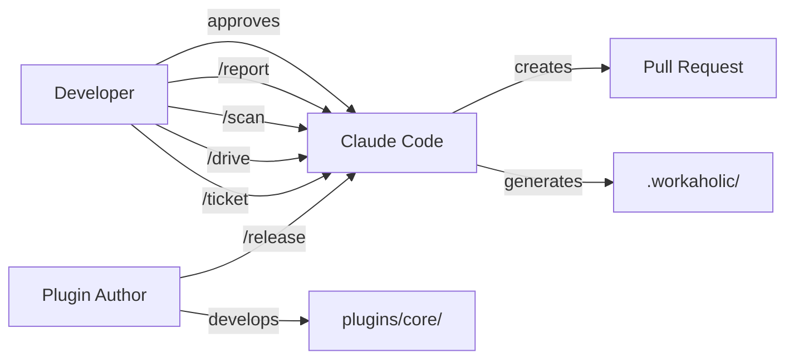

[English](stakeholder.md) | [Japanese](stakeholder_ja.md)

# 1. Stakeholder Viewpoint

The Stakeholder Viewpoint identifies who interacts with the Workaholic plugin system, what goals each stakeholder pursues, and how they engage with the system through its command interface. Workaholic is a Claude Code plugin marketplace that provides ticket-driven development (TiDD) tooling, so its stakeholders are primarily developers who use Claude Code as their development environment.

## 2. Stakeholder Map

Workaholic serves a focused set of stakeholders whose interactions flow through Claude Code's slash command interface. The primary stakeholder is the developer who uses the plugin daily, while secondary stakeholders include the plugin author who maintains and extends the system, and the AI agent (Claude) that executes commands on the developer's behalf.

### 2-1. Developer (End User)

The developer is the primary consumer of Workaholic. They install the plugin from the marketplace using `/plugin marketplace add qmu/workaholic` and interact exclusively through four slash commands: `/ticket`, `/drive`, `/scan`, and `/report`. The developer's fundamental goal is to maintain a fast, serial development workflow where tickets describe changes, implementation proceeds one ticket at a time with explicit approval, and documentation generates itself from the accumulated history.

### 2-2. Plugin Author (Maintainer)

The plugin author (currently `tamurayoshiya <a@qmu.jp>`) develops and releases the plugin. They work within the `plugins/` directory, adding commands, agents, skills, and rules. The author follows the architecture policy defined in `CLAUDE.md`, which enforces thin commands and subagents with comprehensive skills. The `/release` command bumps versions in both `.claude-plugin/marketplace.json` and `plugins/core/.claude-plugin/plugin.json`.

### 2-3. AI Agent (Claude Code)

Claude Code acts as the execution engine. It receives slash commands, invokes subagents, executes shell scripts bundled in skills, and produces artifacts (tickets, specs, stories, changelogs). The agent operates under strict rules: never commit without explicit user request, never use `git -C`, and always use the architectural nesting hierarchy (commands invoke subagents and skills; subagents invoke subagents and skills; skills invoke only skills).

## 3. User Goals

| Stakeholder | Primary Goal | Secondary Goals |
| --- | --- | --- |
| Developer | Fast serial ticket implementation | Documentation generation, PR creation, searchable history |
| Plugin Author | Extend and maintain the plugin | Version management, CI validation, marketplace publishing |
| AI Agent | Faithful command execution | Rule compliance, deterministic behavior, output quality |

## 4. Interaction Patterns

Developers interact with Workaholic through a well-defined workflow cycle. The typical session begins with `/ticket` to plan changes, moves to `/drive` to implement them with confirmation at each step, optionally runs `/scan` to update documentation, and concludes with `/report` to generate a story and create a pull request. Each step preserves context in `.workaholic/` as markdown files, building a searchable project history.

The system enforces human-in-the-loop control at critical points. During `/drive`, the developer must explicitly approve each implementation before it is committed. Ticket moves to icebox always require developer consent. The bottleneck is deliberately placed on human cognition rather than implementation speed.

## 5. Onboarding Paths

New developers install the plugin and begin with `/ticket` to create their first change request. User documentation lives in `.workaholic/guides/`, which covers commands, workflow, and getting started. The root `README.md` provides a quick start guide with a typical session example. Developer documentation for the plugin internals lives in `.workaholic/specs/`.

## 6. Diagram

## 7. Assumptions

- [Explicit] The developer installs from the marketplace using the command shown in `README.md`.
- [Explicit] Four slash commands (`/ticket`, `/drive`, `/scan`, `/report`) constitute the primary user interface, as defined in `CLAUDE.md`.
- [Explicit] The plugin author is `tamurayoshiya <a@qmu.jp>`, as declared in `marketplace.json` and `plugin.json`.
- [Explicit] Human-in-the-loop approval is mandatory during `/drive`, enforced by the `AskUserQuestion` requirement in `drive.md`.
- [Inferred] The primary audience is solo developers or small teams who use Claude Code as their main development environment, based on the serial execution model and single-branch workflow design.
- [Inferred] Onboarding is self-service through documentation rather than guided setup, as no interactive onboarding flow exists beyond the plugin installation command.
