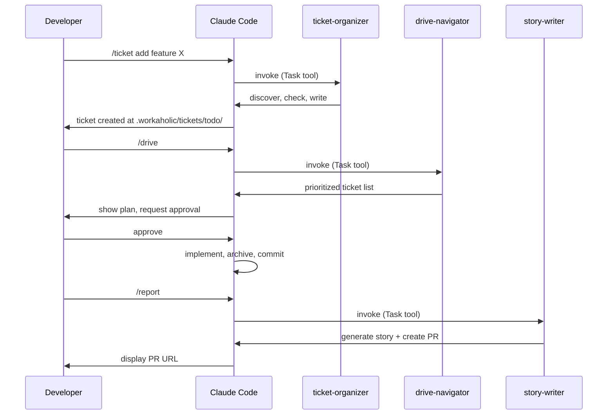
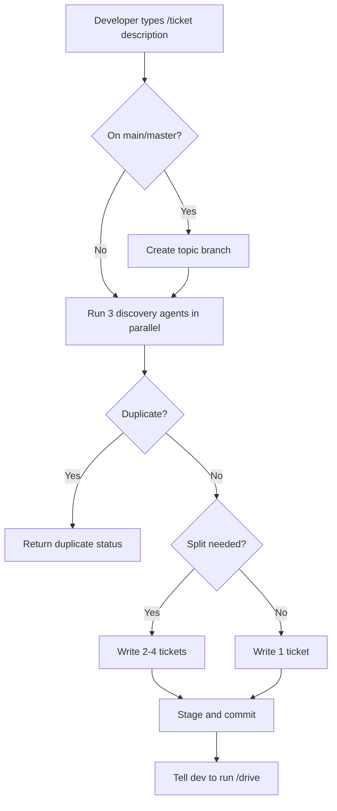
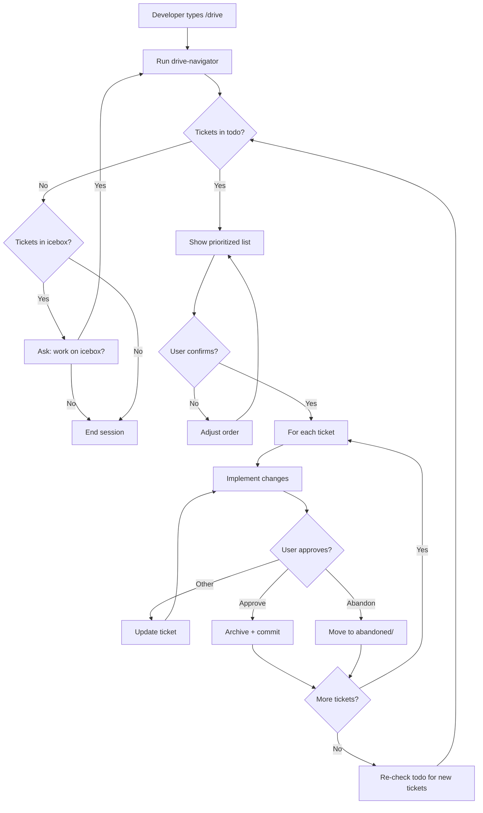
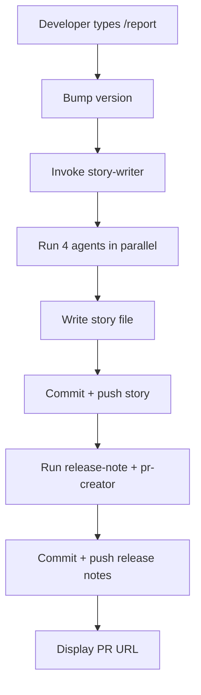

[English](stakeholder.md) | [Japanese](stakeholder_ja.md)

# Stakeholder Viewpoint

The Stakeholder Viewpoint identifies who interacts with the Workaholic plugin system, what goals each stakeholder pursues, and how they engage with the system through its command interface and development workflow. Workaholic is a Claude Code plugin marketplace containing two plugins: drivin (ticket-driven development workflow) and trippin (AI-oriented exploration workflow). The system creates a triangular relationship between developers who request work, Claude Code agents that execute work, and the plugin author who maintains the system.

## Stakeholder Map

Workaholic serves three distinct stakeholder groups whose interactions form a development ecosystem. The primary stakeholder is the developer who uses the plugin as their daily workflow tool. The secondary stakeholder is the plugin author who maintains and extends the system. The tertiary stakeholder is the AI agent (Claude Code) that acts as the execution engine, receiving commands from developers and producing artifacts according to strict architectural rules.

### Primary Stakeholder: Developer (End User)

The developer represents the primary consumer of Workaholic. They install the marketplace using `/plugin marketplace add qmu/workaholic` and interact through slash commands. The work plugin provides five core commands forming a complete development cycle: `/ticket` for planning changes, `/drive` for implementation, `/trip` for collaborative exploration using three-agent teams, `/report` for story/PR creation, and `/ship` for merging and verification.

The developer operates under explicit human-in-the-loop control. During `/drive` execution, the system presents approval dialogs using `AskUserQuestion` with selectable options, requiring explicit confirmation before committing each ticket. The developer never writes tickets manually—the ticket-organizer subagent explores the codebase and writes implementation specifications on their behalf. Similarly, the developer never manually writes changelogs or PR descriptions—these generate automatically from accumulated ticket history.

The developer's fundamental goal is fast serial development without git worktree overhead. Tickets queue in `.workaholic/tickets/todo/`, implementation proceeds one ticket at a time with clear commits, and when ready to deliver, `/report` generates all documentation from the ticket archive. The bottleneck is deliberately placed on human cognition (approval decisions) rather than implementation speed (agent execution).

### Secondary Stakeholder: Plugin Author (Maintainer)

The plugin author (currently `tamurayoshiya <a@qmu.jp>`) develops and releases both plugins. They work exclusively within the `plugins/` directory structure, adding components to `plugins/drivin/` for the development workflow and `plugins/trippin/` for the exploration workflow. The author follows the architecture policy defined in `CLAUDE.md`, which enforces thin commands and subagents (orchestration only) with comprehensive skills (knowledge layer).

The author maintains version synchronization across three files: `.claude-plugin/marketplace.json` (marketplace version), `plugins/drivin/.claude-plugin/plugin.json` (drivin version), and `plugins/trippin/.claude-plugin/plugin.json` (trippin version). Version management follows semantic versioning with PATCH increment by default. The `/release` command automates version bumping across all three files, then stages and commits with the message "Bump version to v{new_version}".

The author's workflow mirrors the developer's workflow but operates at the meta-level. They use the same `/ticket` and `/drive` commands to develop plugin features. Archived tickets in `.workaholic/tickets/archive/` document the evolution of the plugin itself, creating a searchable history of architectural decisions and implementation rationale.

### Tertiary Stakeholder: AI Agent (Claude Code)

Claude Code acts as the execution engine that receives slash commands, invokes subagents via Task tool, executes shell scripts bundled in skills, and produces artifacts (tickets, specs, stories, changelogs, PRs). The agent operates under strict architectural constraints defined in `CLAUDE.md`:

- Commands can invoke skills and subagents, but never other commands
- Subagents can invoke skills and other subagents, but never commands
- Skills can invoke only other skills, never subagents or commands

The agent follows explicit git safety protocols: never commit without user request, never use `run_in_background: true` for agents requiring Write/Edit permissions, never skip hooks, and never force push to main/master. Complex shell operations must be extracted to bundled skill scripts rather than written inline in markdown files.

The agent provides transparency through real-time progress reporting. Multi-agent commands such as `/report` invoke their subagents using separate Task calls within a single message, making each agent's progress visible to the developer.

## User Goals

Each stakeholder group pursues distinct but complementary goals within the Workaholic ecosystem.

### Developer Goals

The developer's primary goal is fast serial ticket implementation. They want to queue multiple change requests, then implement them one by one with explicit approval at each step. Secondary goals include automatic documentation generation from ticket history, PR creation without manual summarization, and searchable project history for future coding agents.

The developer values transparency over automation. They prefer seeing individual agent progress during multi-agent commands rather than waiting for a single orchestrator subagent to complete. They prefer explicit approval dialogs with selectable options over autonomous decisions about ticket moves or implementation deviations.

The developer expects the system to preserve context across sessions. Tickets in `.workaholic/tickets/todo/` persist between sessions. Archived tickets in `.workaholic/tickets/archive/<branch>/` document completed work. Stories in `.workaholic/stories/` provide development narratives. All artifacts are markdown files committed alongside code, making them git-searchable and branch-aware.

### Plugin Author Goals

The plugin author's primary goal is extending and maintaining the plugin while preserving architectural consistency. They must add new commands, agents, and skills without violating the nesting hierarchy. They must ensure complex shell operations live in bundled skill scripts rather than inline in command markdown.

Secondary goals include version management (keeping marketplace and plugin versions synchronized), CI validation (ensuring no structural violations), and marketplace publishing (releasing new versions with proper semantic versioning).

The plugin author balances feature development with documentation maintenance. Every plugin change requires updates to multiple viewpoint specs in `.workaholic/specs/` (stakeholder, model, usecase, infrastructure, application, component, data, feature). These specs are hand-maintained reference documents updated alongside structural changes through the `/ticket` workflow.

### AI Agent Goals

The AI agent's primary goal is faithful command execution according to architectural rules. It must invoke the correct subagents, pass the correct parameters, enforce approval workflows, and produce output in the expected JSON format.

Secondary goals include rule compliance (never violate git safety protocols), deterministic behavior (same command always follows same workflow phases), and output quality (tickets must include all required sections, specs must follow viewpoint templates, PRs must include generated stories).

The agent must balance automation with human oversight. It never moves tickets to icebox without developer approval. It never proceeds to commit without showing implementation results and receiving explicit approval. It never creates branches on main without asking which branch type to create.

## Interaction Patterns

Stakeholder interactions with Workaholic follow well-defined workflow patterns that preserve context, enforce human approval, and generate documentation automatically.

### Development Cycle Pattern

The primary interaction pattern is the development cycle, which consists of three sequential phases.

**Phase 1: Ticket Creation**. The developer invokes `/ticket <description>`, which delegates to the ticket-organizer subagent. The ticket-organizer runs three discovery agents in parallel (history-discoverer for related tickets, source-discoverer for relevant files, ticket-discoverer for duplicate detection), then writes a ticket to `.workaholic/tickets/todo/` with sections: Overview, Key Files, Related History, Implementation Steps, Patches (if applicable), Considerations. If on main/master, the system creates a new topic branch first.

**Phase 2: Implementation**. The developer invokes `/drive`, which delegates to the drive-navigator subagent to list and prioritize tickets. For each ticket, the system reads the ticket file, implements the changes, requests approval via `AskUserQuestion` with selectable options (Approve, Approve and stop, Other, Abandon), and upon approval, archives the ticket to `.workaholic/tickets/archive/<branch>/` with a Final Report section documenting deviations. The four leading skills are preloaded into the drive command so policy lenses (validity, availability, security, accessibility) apply during implementation.

**Phase 3: Delivery**. The developer invokes `/report` to generate a story and create a PR. The report command first bumps the version in the version files, then invokes the story-writer subagent. The story-writer runs 4 agents in parallel (release-readiness for release analysis, performance-analyst for decision quality, overview-writer for narrative sections, section-reviewer for outcome/concerns/ideas), composes a story file in `.workaholic/stories/<branch>.md`, commits and pushes it, then invokes 2 more agents in parallel (release-note-writer for release notes, pr-creator for GitHub PR creation). After the PR is merged, the developer invokes `/ship` to verify production.

### Workflow Sequence Diagram

```mermaid
sequenceDiagram
    participant Dev as Developer
    participant Claude as Claude Code
    participant Ticket as ticket-organizer
    participant Drive as drive-navigator
    participant Story as story-writer

    Dev->>Claude: /ticket add feature X
    Claude->>Ticket: invoke (Task tool)
    Ticket->>Claude: discover, check, write
    Claude->>Dev: ticket created at .workaholic/tickets/todo/

    Dev->>Claude: /drive
    Claude->>Drive: invoke (Task tool)
    Drive->>Claude: prioritized ticket list
    Claude->>Dev: show plan, request approval
    Dev->>Claude: approve
    Claude->>Claude: implement, archive, commit

    Dev->>Claude: /report
    Claude->>Story: invoke (Task tool)
    Story->>Claude: generate story + create PR
    Claude->>Dev: display PR URL
```

### Approval Pattern

The approval pattern enforces human-in-the-loop control during `/drive` execution. After implementing a ticket, the system presents an approval dialog using `AskUserQuestion` with four selectable options:

- **Approve**: Commit the implementation and continue to next ticket
- **Approve and stop**: Commit the implementation and end the drive session
- **Other**: Provide free-form feedback, causing the system to update the ticket and re-implement
- **Abandon**: Move ticket to `.workaholic/tickets/abandoned/` and continue to next ticket

The drive-approval skill (preloaded by the drive command) defines the exact dialog format and handling logic. If the user provides feedback (selects "Other"), the system must update the ticket file before re-implementing to ensure the ticket always reflects the full implementation plan.

### Icebox Pattern

The icebox pattern manages deferred tickets. If the drive-navigator finds no tickets in `.workaholic/tickets/todo/`, it checks `.workaholic/tickets/icebox/` and presents options:

- **Work on icebox**: Invoke drive-navigator with `mode: icebox` to select from deferred tickets
- **Stop**: End the drive session

If mode is icebox, the navigator lists icebox tickets and uses `AskUserQuestion` to let the developer select one, then moves it to `.workaholic/tickets/todo/` before proceeding.

Critically, tickets never move to icebox autonomously. If a ticket cannot be implemented (out of scope, too complex, blocked), the system stops and asks the developer using `AskUserQuestion` with options: "Move to icebox", "Skip for now", or "Abort drive". This design preserves developer authority over ticket prioritization.

### Agent Transparency Pattern

Multi-agent commands invoke their subagents using parallel Task calls within a single message rather than delegating to a single orchestrator subagent. This makes each agent's progress visible in the developer's session in real time.

This pattern reflects a broader design philosophy: transparency over abstraction. Developers should see what the system is doing rather than waiting for opaque operations to complete.

## Onboarding Paths

Workaholic provides multiple onboarding paths depending on stakeholder role and entry point.

### Developer Onboarding

New developers follow a self-service onboarding path. The root `README.md` provides a Quick Start section with installation command and typical session example. After installing via `/plugin marketplace add qmu/workaholic`, developers can immediately start using the five core commands.

The first command is typically `/ticket <description>`. The ticket-organizer subagent explores the codebase automatically, so the developer does not need to understand the project structure beforehand. The resulting ticket includes Key Files and Implementation Steps sections that educate the developer about the codebase while planning the change.

User documentation lives in `.workaholic/guides/` with three documents:

- `getting-started.md`: Installation and verification
- `commands.md`: Complete command reference with usage examples
- `workflow.md`: Ticket-driven development approach

The developer progresses from `/ticket` (familiar task of describing what they want) to `/drive` (observing how Claude implements it) to `/report` and `/ship` (understanding how stories, PRs, and deployment fit together).

### Plugin Author Onboarding

Plugin authors (developers extending the plugin itself) require deeper architectural understanding. Developer documentation lives in `.workaholic/specs/` with 8 viewpoint-based architecture documents:

- `stakeholder.md`: Who uses the system, their goals, interaction patterns
- `model.md`: Domain concepts, relationships, core abstractions
- `usecase.md`: User workflows, command sequences, input/output contracts
- `infrastructure.md`: External dependencies, file system layout, installation
- `application.md`: Runtime behavior, agent orchestration, data flow
- `component.md`: Internal structure, module boundaries, decomposition
- `data.md`: Data formats, frontmatter schemas, naming conventions
- `feature.md`: Feature inventory, capability matrix, configuration

The `CLAUDE.md` file in the repository root serves as the authoritative source for architecture policy, defining component nesting rules, design principles, common operations, shell script principles, commands list, development workflow, and version management.

Plugin authors use the same `/ticket` and `/drive` commands to develop plugin features, but they edit files under `plugins/` rather than application code. The archived tickets in `.workaholic/tickets/archive/` document the evolution of the plugin architecture, providing searchable context for understanding design decisions.

### AI Agent Onboarding

The AI agent (Claude Code) receives instructions through command and agent markdown files in each plugin's `commands/` and `agents/` directories. Each command defines phases using preloaded skills, specifies which subagents to invoke, and includes critical rules for execution.

The agent learns architectural constraints from `CLAUDE.md`, which it receives as project instructions in the Claude Code environment. The nesting hierarchy (commands → subagents/skills, subagents → subagents/skills, skills → skills) prevents circular dependencies and ensures skills remain reusable knowledge components.

The agent receives workflow-specific knowledge through skills in each plugin's `skills/` directory. For example, the gather-git-context skill in the core plugin provides git context gathering via bundled shell script, eliminating inline git commands in agent markdown. The create-ticket skill in the work plugin defines ticket format and content requirements, ensuring consistent ticket structure across all ticket-organizer invocations.

## Command Interaction Flow

The four core commands form distinct interaction flows that developers navigate based on their current task.

### Ticket Command Flow

```mermaid
flowchart TD
    Start[Developer types /ticket description] --> CheckBranch{On main/master?}
    CheckBranch -->|Yes| CreateBranch[Create topic branch]
    CheckBranch -->|No| Discovery
    CreateBranch --> Discovery[Run 3 discovery agents in parallel]
    Discovery --> Moderate{Duplicate?}
    Moderate -->|Yes| ReturnDup[Return duplicate status]
    Moderate -->|No| Evaluate{Split needed?}
    Evaluate -->|Yes| WriteSplit[Write 2-4 tickets]
    Evaluate -->|No| WriteSingle[Write 1 ticket]
    WriteSplit --> Commit[Stage and commit]
    WriteSingle --> Commit
    Commit --> Tell[Tell dev to run /drive]
```

### Drive Command Flow

```mermaid
flowchart TD
    Start[Developer types /drive] --> Navigate[Run drive-navigator]
    Navigate --> CheckTodo{Tickets in todo?}
    CheckTodo -->|No| CheckIcebox{Tickets in icebox?}
    CheckIcebox -->|Yes| AskIcebox[Ask: work on icebox?]
    AskIcebox -->|Yes| Navigate
    AskIcebox -->|No| End[End session]
    CheckIcebox -->|No| End
    CheckTodo -->|Yes| Prioritize[Show prioritized list]
    Prioritize --> Confirm{User confirms?}
    Confirm -->|No| Adjust[Adjust order]
    Adjust --> Prioritize
    Confirm -->|Yes| Loop[For each ticket]
    Loop --> Implement[Implement changes]
    Implement --> Approval{User approves?}
    Approval -->|Other| Update[Update ticket]
    Update --> Implement
    Approval -->|Approve| Archive[Archive + commit]
    Approval -->|Abandon| MoveAbandon[Move to abandoned/]
    Archive --> More{More tickets?}
    MoveAbandon --> More
    More -->|Yes| Loop
    More -->|No| Recheck[Re-check todo for new tickets]
    Recheck --> CheckTodo
```

### Report Command Flow

```mermaid
flowchart TD
    Start[Developer types /report] --> Bump[Bump version]
    Bump --> Story[Invoke story-writer]
    Story --> Agents[Run 4 agents in parallel]
    Agents --> Write[Write story file]
    Write --> CommitStory[Commit + push story]
    CommitStory --> Release[Run release-note + pr-creator]
    Release --> CommitRelease[Commit + push release notes]
    CommitRelease --> URL[Display PR URL]
```

## Assumptions

- [Explicit] The developer installs from the marketplace using `/plugin marketplace add qmu/workaholic` as shown in `README.md` line 12.
- [Explicit] Five slash commands (`/ticket`, `/drive`, `/trip`, `/report`, `/ship`) constitute the primary user interface, as defined in `CLAUDE.md`.
- [Explicit] The plugin author is `tamurayoshiya <a@qmu.jp>`, as declared in `marketplace.json` line 7 and `plugin.json` line 5.
- [Explicit] Human-in-the-loop approval is mandatory during `/drive`, enforced by the `AskUserQuestion` requirement in `drive.md` line 50.
- [Explicit] Version management requires synchronization across `marketplace.json` and the three plugin `plugin.json` files (core, standards, work), as documented in `CLAUDE.md`.
- [Explicit] The four leading skills (`leading-validity`, `leading-availability`, `leading-security`, `leading-accessibility`) are preloaded into work-plugin commands and orchestrators via the soft cross-plugin reference pattern.
- [Inferred] The primary audience is solo developers or small teams who use Claude Code as their main development environment, based on the serial execution model, single-branch workflow design, and explicit approval requirement at each ticket.
- [Inferred] Onboarding is self-service through documentation rather than guided setup, as no interactive onboarding flow exists beyond the plugin installation command.
- [Inferred] The system prioritizes transparency over abstraction, evidenced by multi-agent commands invoking subagents directly through parallel Task calls so individual agent progress remains visible.
- [Inferred] The plugin author uses Workaholic to develop Workaholic itself (dogfooding), based on the presence of archived tickets documenting plugin feature development in `.workaholic/tickets/archive/`.
