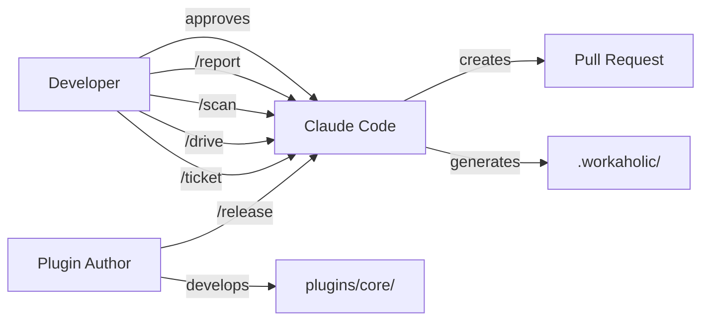

[English](stakeholder.md) | [Japanese](stakeholder_ja.md)

# 1. Stakeholder Viewpoint

Stakeholder Viewpoint は、Workaholic plugin システムと関わる利害関係者、各 stakeholder が追求する目標、および command インターフェースを通じたシステムとの関わり方を特定します。Workaholic は ticket-driven development (TiDD) ツールを提供する Claude Code plugin marketplace であるため、stakeholder は主に Claude Code を開発環境として使用する開発者です。

## 2. Stakeholder Map

Workaholic は、Claude Code の slash command インターフェースを通じてやり取りする限定的な stakeholder を対象としています。主要な stakeholder は plugin を日常的に使用する開発者であり、二次的な stakeholder にはシステムを保守・拡張する plugin 作者と、command を開発者に代わって実行する AI エージェント（Claude）が含まれます。

### 2-1. Developer（エンドユーザー）

Developer は Workaholic の主要な利用者です。marketplace から `/plugin marketplace add qmu/workaholic` でインストールし、4つの slash command（`/ticket`、`/drive`、`/scan`、`/report`）のみを通じてやり取りします。developer の基本的な目標は、ticket が変更を記述し、実装が明示的な承認のもとで1つずつ進み、ドキュメントが蓄積された履歴から自動生成される、高速なシリアル開発ワークフローを維持することです。

### 2-2. Plugin Author（メンテナー）

Plugin author（現在 `tamurayoshiya <a@qmu.jp>`）は plugin を開発・リリースします。`plugins/` ディレクトリ内で command、agent、skill、rule を追加します。author は `CLAUDE.md` で定義されたアーキテクチャポリシーに従い、薄い command と subagent、包括的な skill を実現します。`/release` command は `marketplace.json` と `plugin.json` の両方のバージョンを更新します。

### 2-3. AI Agent（Claude Code）

Claude Code は実行エンジンとして機能します。slash command を受信し、subagent を呼び出し、skill にバンドルされた shell script を実行し、成果物（ticket、spec、story、changelog）を生成します。エージェントは厳格なルールの下で動作します：明示的なユーザー要求なしにコミットしない、`git -C` を使用しない、アーキテクチャの nesting 階層に常に従う（command は subagent と skill を呼び出し、subagent は subagent と skill を呼び出し、skill は skill のみを呼び出す）。

## 3. User Goals

| Stakeholder | 主要目標 | 副次目標 |
| --- | --- | --- |
| Developer | 高速なシリアル ticket 実装 | ドキュメント生成、PR 作成、検索可能な履歴 |
| Plugin Author | plugin の拡張と保守 | バージョン管理、CI 検証、marketplace 公開 |
| AI Agent | 忠実な command 実行 | ルール遵守、決定論的動作、出力品質 |

## 4. Interaction Patterns

Developer は明確に定義されたワークフローサイクルを通じて Workaholic とやり取りします。典型的なセッションは `/ticket` で変更を計画することから始まり、`/drive` で各ステップの確認付きで実装を進め、オプションで `/scan` を実行してドキュメントを更新し、`/report` で story を生成して pull request を作成して終了します。各ステップは `.workaholic/` に markdown ファイルとしてコンテキストを保存し、検索可能なプロジェクト履歴を構築します。

システムは重要なポイントで human-in-the-loop 制御を強制します。`/drive` 中、developer は各実装がコミットされる前に明示的に承認する必要があります。ticket の icebox への移動は常に developer の同意が必要です。ボトルネックは意図的に実装速度ではなく人間の認知に置かれています。

## 5. Onboarding Paths

新しい developer は plugin をインストールし、`/ticket` で最初の変更要求を作成することから始めます。ユーザードキュメントは `.workaholic/guides/` にあり、command、workflow、はじめ方をカバーしています。ルートの `README.md` は典型的なセッション例を含むクイックスタートガイドを提供します。plugin 内部の開発者ドキュメントは `.workaholic/specs/` にあります。

## 6. Diagram

## 7. Assumptions

- [Explicit] developer は `README.md` に示された command を使用して marketplace からインストールします。
- [Explicit] 4つの slash command（`/ticket`、`/drive`、`/scan`、`/report`）が `CLAUDE.md` で定義された主要なユーザーインターフェースを構成します。
- [Explicit] plugin author は `marketplace.json` と `plugin.json` で宣言されている通り `tamurayoshiya <a@qmu.jp>` です。
- [Explicit] `/drive` 中の human-in-the-loop 承認は `drive.md` の `AskUserQuestion` 要件により必須です。
- [Inferred] 主要な対象はシリアル実行モデルとシングルブランチワークフロー設計に基づき、Claude Code を主要開発環境として使用するソロ開発者または小規模チームです。
- [Inferred] オンボーディングは plugin インストール command 以外のインタラクティブなセットアップフローが存在しないため、ドキュメントによるセルフサービスです。
