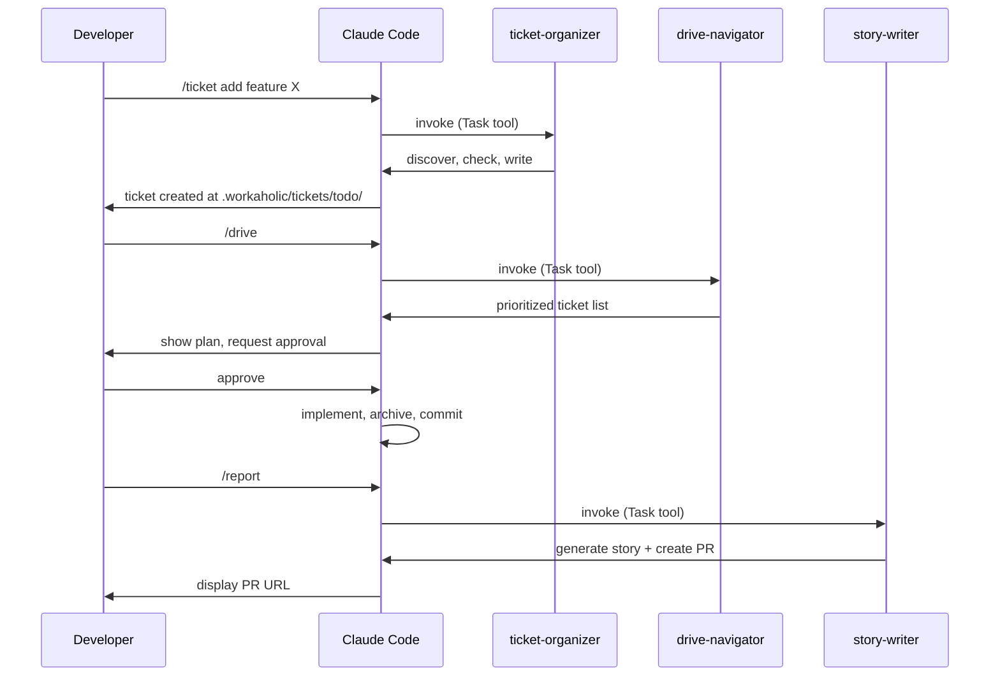
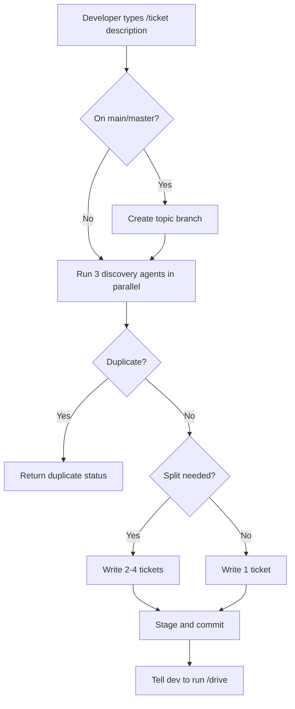
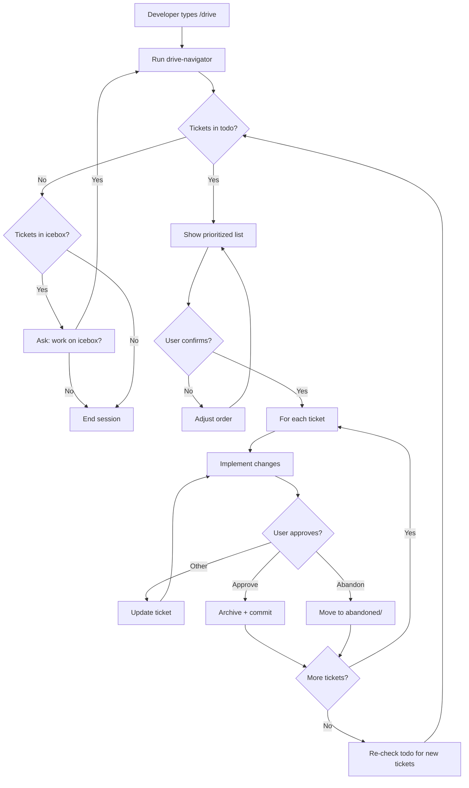
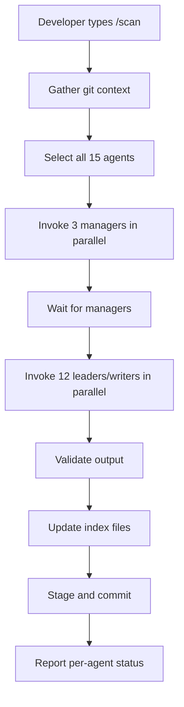
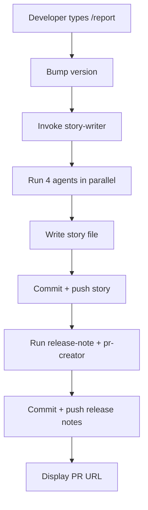

[English](stakeholder.md) | [Japanese](stakeholder_ja.md)

# Stakeholder Viewpoint

Stakeholder Viewpoint は、Workaholic plugin システムとやり取りする人物、各 stakeholder が追求する目標、そして command interface および開発 workflow を通じてどのように system と関わるかを明確にします。Workaholic は ticket-driven development (TiDD) と AI 指向の探索 workflow を提供する Claude Code plugin marketplace であり、2つの plugin（drivin と trippin）を含みます。作業を依頼する developer、作業を実行する Claude Code agent、そして system を維持する plugin author という三角関係を形成しています。

## Stakeholder Map

Workaholic は、開発 ecosystem を形成する 3 つの異なる stakeholder group に対応しています。主要な stakeholder は、plugin を日常的な workflow tool として使用する developer です。二次的な stakeholder は、system を維持・拡張する plugin author です。三次的な stakeholder は、実行 engine として機能する AI agent (Claude Code) であり、developer から command を受け取り、厳格な architectural rule に従って artifact を生成します。

### Primary Stakeholder: Developer (End User)

Developer は Workaholic の主要な消費者です。彼らは `/plugin marketplace add qmu/workaholic` を使用して marketplace から plugin をインストールし、slash command のみを通じて対話します。Developer の workflow は、2つの plugin にまたがる5つの command を中心に展開されます：drivin から変更を計画する `/ticket`、実装する `/drive`、documentation を更新する `/scan`、PR を作成する `/report`、trippin から Agent Teams を使用した探索的開発の `/trip`。

Developer は明示的な human-in-the-loop 制御の下で動作します。`/drive` 実行中、system は `AskUserQuestion` を使用して選択可能な option を含む承認 dialog を表示し、各 ticket を commit する前に明示的な確認を要求します。Developer は ticket を手動で記述しません—ticket-organizer subagent が codebase を探索し、実装仕様を代わりに記述します。同様に、developer は changelog や PR description を手動で記述しません—これらは蓄積された ticket history から自動生成されます。

Developer の基本的な目標は、git worktree overhead なしでの高速な serial 開発です。Ticket は `.workaholic/tickets/todo/` にキューイングされ、実装は明確な commit とともに一度に 1 つの ticket ずつ進行し、配信準備が整ったら `/report` が ticket archive からすべての documentation を生成します。Bottleneck は意図的に、実装速度 (agent 実行) ではなく人間の認知 (承認決定) に配置されています。

### Secondary Stakeholder: Plugin Author (Maintainer)

Plugin author (現在は `tamurayoshiya <a@qmu.jp>`) は plugin を開発およびリリースします。彼らは `plugins/` directory 構造内で2つの plugin にわたって作業します：drivin（`plugins/drivin/`）は ticket 駆動開発、trippin（`plugins/trippin/`）は AI 指向の探索。各 plugin には独自の command、agent、skill、rule directory があります。Author は `CLAUDE.md` で定義された architecture policy に従い、thin な command と subagent (orchestration のみ) および comprehensive な skill (knowledge layer) を強制します。

Author は `.claude-plugin/marketplace.json`（marketplace version）、`plugins/drivin/.claude-plugin/plugin.json`（drivin version）、`plugins/trippin/.claude-plugin/plugin.json`（trippin version）の3つのファイル間で version 同期を維持します。Version 管理は semantic versioning に従い、デフォルトで PATCH increment を行います。`/release` command は3つのファイルすべてで version bump を自動化します。

Author の workflow は developer の workflow を反映していますが、meta-level で動作します。彼らは plugin feature を開発するために同じ `/ticket` および `/drive` command を使用します。`.workaholic/tickets/archive/` の archived ticket は plugin 自体の進化を文書化し、architectural decision と実装 rationale の検索可能な履歴を作成します。

### Tertiary Stakeholder: AI Agent (Claude Code)

Claude Code は、slash command を受け取り、Task tool を介して subagent を呼び出し、skill にバンドルされた shell script を実行し、artifact (ticket、spec、story、changelog、PR) を生成する実行 engine として機能します。Agent は `CLAUDE.md` で定義された厳格な architectural constraint の下で動作します：

- Command は skill と subagent を呼び出すことができますが、他の command は呼び出せません
- Subagent は skill と他の subagent を呼び出すことができますが、command は呼び出せません
- Skill は他の skill のみを呼び出すことができ、subagent や command は呼び出せません

Agent は明示的な git safety protocol に従います：user request なしに commit しない、Write/Edit permission を必要とする agent に対して `run_in_background: true` を使用しない、hook をスキップしない、そして main/master に force push しない。複雑な shell operation は、markdown file に inline で記述するのではなく、bundled skill script に抽出する必要があります。

Agent は real-time progress reporting を通じて透明性を提供します。`/scan` command は、単一 message 内で個別の Task call を使用して、すべての 15 documentation agent を並列に呼び出し、各 agent の進行状況を developer に見えるようにします。最近の refactoring (ticket `20260208131751-migrate-scanner-into-scan-command.md`) より前は、scan command は scanner subagent に委譲し、個々の agent 進行状況を単一の Task call の背後に隠していました。

## User Goals

各 stakeholder group は、Workaholic ecosystem 内で異なるが補完的な目標を追求します。

### Developer Goals

Developer の主要な目標は、高速な serial ticket 実装です。彼らは複数の変更 request をキューに入れ、各ステップで明示的な承認を得ながら一つずつ実装したいと考えています。二次的な目標には、ticket history からの自動 documentation 生成、手動要約なしの PR 作成、将来の coding agent のための検索可能な project history が含まれます。

Developer は automation よりも transparency を重視します。彼らは、単一の scanner subagent の完了を待つのではなく、`/scan` 中に個々の agent 進行状況を見ることを好みます。彼らは、ticket 移動や実装逸脱に関する自律的な決定よりも、選択可能な option を持つ明示的な承認 dialog を好みます。

Developer は、session 間で context が保存されることを期待します。`.workaholic/tickets/todo/` の ticket は session 間で持続します。`.workaholic/tickets/archive/<branch>/` の archived ticket は完了した作業を文書化します。`.workaholic/stories/` の story は開発 narrative を提供します。すべての artifact は code とともに commit される markdown file であり、git 検索可能で branch 対応です。

### Plugin Author Goals

Plugin author の主要な目標は、architectural 一貫性を維持しながら plugin を拡張および維持することです。彼らは nesting hierarchy に違反することなく、新しい command、agent、skill を追加する必要があります。彼らは、複雑な shell operation が command markdown に inline ではなく、bundled skill script 内に存在することを保証する必要があります。

二次的な目標には、version 管理 (marketplace と plugin version の同期維持)、CI 検証 (structural violation がないことの確認)、marketplace publishing (適切な semantic versioning での新 version リリース) が含まれます。

Plugin author は feature 開発と documentation 維持のバランスを取ります。すべての plugin 変更には、`.workaholic/specs/` 内の複数の viewpoint spec (stakeholder、model、usecase、infrastructure、application、component、data、feature) への更新が必要です。`/scan` command は、8 個の viewpoint analyst agent と 7 個の policy analyst agent を並列に呼び出すことで、この documentation 更新を自動化します。

### AI Agent Goals

AI agent の主要な目標は、architectural rule に従った忠実な command 実行です。正しい subagent を呼び出し、正しい parameter を渡し、承認 workflow を強制し、期待される JSON format で output を生成する必要があります。

二次的な目標には、rule compliance (git safety protocol に違反しない)、deterministic behavior (同じ command は常に同じ workflow phase に従う)、output quality (ticket はすべての必須 section を含む、spec は viewpoint template に従う、PR は生成された story を含む) が含まれます。

Agent は automation と human oversight のバランスを取る必要があります。Developer の承認なしに ticket を icebox に移動しません。実装結果を表示して明示的な承認を受けずに commit に進みません。どの branch type を作成するかを尋ねずに main で branch を作成しません。

## Interaction Patterns

Workaholic との stakeholder interaction は、context を保存し、human 承認を強制し、documentation を自動生成する明確に定義された workflow pattern に従います。

### Development Cycle Pattern

主要な interaction pattern は、4 つの連続した phase で構成される開発 cycle です。

**Phase 1: Ticket Creation**。Developer は `/ticket <description>` を呼び出し、ticket-organizer subagent に委譲します。Ticket-organizer は 3 つの discovery agent を並列実行し (関連 ticket のための history-discoverer、関連 file のための source-discoverer、重複検出のための ticket-discoverer)、次に `.workaholic/tickets/todo/` に ticket を記述します。Section は次の通りです：Overview、Key Files、Related History、Implementation Steps、Patches (該当する場合)、Considerations。Main/master にいる場合、system はまず新しい topic branch を作成します。

**Phase 2: Implementation**。Developer は `/drive` を呼び出し、ticket をリストして優先順位付けするために drive-navigator subagent に委譲します。各 ticket について、system は ticket file を読み取り、変更を実装し、`AskUserQuestion` を介して選択可能な option (Approve、Approve and stop、Other、Abandon) で承認を要求し、承認されると、逸脱を文書化する Final Report section とともに ticket を `.workaholic/tickets/archive/<branch>/` にアーカイブします。

**Phase 3: Documentation**。Developer はオプションで `/scan` を呼び出してすべての documentation を更新します。Scan command は 15 個の agent を2つのフェーズで呼び出します：8 個の viewpoint analyst (stakeholder、model、usecase、infrastructure、application、component、data、feature)、7 個の policy analyst (test、security、quality、accessibility、observability、delivery、recovery)、1 個の changelog writer、1 個の terms writer。各 agent は `.workaholic/specs/` の spec、`.workaholic/policies/` の policy、`.workaholic/terms/` の terms、`CHANGELOG.md` の changelog entry を生成します。

**Phase 4: Delivery**。Developer は `/report` を呼び出して story を生成し PR を作成します。Report command はまず両方の version file で version を bump し、次に story-writer subagent を呼び出します。Story-writer は 4 個の agent を並列実行し (release 分析のための release-readiness、decision quality のための performance-analyst、narrative section のための overview-writer、outcome/concerns/ideas のための section-reviewer)、`.workaholic/stories/<branch>.md` に story file を構成し、commit して push し、次に 2 個の agent を並列実行します (release note のための release-note-writer、GitHub PR 作成のための pr-creator)。

### Workflow Sequence Diagram

```mermaid
sequenceDiagram
    participant Dev as Developer
    participant Claude as Claude Code
    participant Ticket as ticket-organizer
    participant Drive as drive-navigator
    participant Story as story-writer

    Dev->>Claude: /ticket add feature X
    Claude->>Ticket: invoke (Task tool)
    Ticket->>Claude: discover, check, write
    Claude->>Dev: ticket created at .workaholic/tickets/todo/

    Dev->>Claude: /drive
    Claude->>Drive: invoke (Task tool)
    Drive->>Claude: prioritized ticket list
    Claude->>Dev: show plan, request approval
    Dev->>Claude: approve
    Claude->>Claude: implement, archive, commit

    Dev->>Claude: /report
    Claude->>Story: invoke (Task tool)
    Story->>Claude: generate story + create PR
    Claude->>Dev: display PR URL
```

### Approval Pattern

Approval pattern は `/drive` 実行中に human-in-the-loop 制御を強制します。Ticket を実装した後、system は `AskUserQuestion` を使用して 4 つの選択可能な option を持つ承認 dialog を表示します：

- **Approve**: 実装を commit し、次の ticket に進む
- **Approve and stop**: 実装を commit し、drive session を終了する
- **Other**: 自由形式の feedback を提供し、system に ticket を更新して再実装させる
- **Abandon**: Ticket を `.workaholic/tickets/abandoned/` に移動し、次の ticket に進む

Drive-approval skill (drive command により preload) は、正確な dialog format と handling logic を定義します。User が feedback を提供した場合 (「Other」を選択)、system は再実装前に ticket file を更新して、ticket が常に完全な実装計画を反映することを保証する必要があります。

### Icebox Pattern

Icebox pattern は deferred ticket を管理します。Drive-navigator が `.workaholic/tickets/todo/` に ticket を見つけられない場合、`.workaholic/tickets/icebox/` をチェックして option を提示します：

- **Work on icebox**: `mode: icebox` で drive-navigator を呼び出し、deferred ticket から選択する
- **Stop**: Drive session を終了する

Mode が icebox の場合、navigator は icebox ticket をリストし、`AskUserQuestion` を使用して developer に 1 つを選択させ、次に進む前に `.workaholic/tickets/todo/` に移動します。

重要なのは、ticket は自律的に icebox に移動しないということです。Ticket が実装できない場合 (scope 外、複雑すぎる、blocked)、system は停止し、option を持つ `AskUserQuestion` を使用して developer に尋ねます：「Move to icebox」、「Skip for now」、または「Abort drive」。この設計は ticket prioritization に関する developer の権限を保持します。

### Agent Transparency Pattern

最近の architectural 変更 (ticket `20260208131751-migrate-scanner-into-scan-command.md`) は、real-time progress visibility を提供するために scanner subagent の orchestration logic を `/scan` command に直接移行しました。以前は、`/scan` は単一の scanner subagent に 1 つの Task call を介して委譲し、すべての 15 個の並列 agent 呼び出しを隠していました。現在、scan command はすべての 17 個の agent を単一 message 内の並列 Task call を使用して直接呼び出し、各 agent の進行状況を developer の session で見えるようにします。

この pattern は、より広範な設計哲学を反映しています：abstraction よりも transparency。Developer は、不透明な operation が完了するのを待つのではなく、system が何をしているかを見るべきです。

## Onboarding Paths

Workaholic は、stakeholder role と entry point に応じて複数の onboarding path を提供します。

### Developer Onboarding

新しい developer は self-service onboarding path に従います。Root `README.md` は、installation command と typical session example を含む Quick Start section を提供します。`/plugin marketplace add qmu/workaholic` を介してインストールした後、developer はすぐに 4 つの core command の使用を開始できます。

最初の command は通常 `/ticket <description>` です。Ticket-organizer subagent は codebase を自動的に探索するため、developer は事前に project 構造を理解する必要がありません。結果の ticket には、変更を計画しながら codebase について developer を教育する Key Files と Implementation Steps section が含まれます。

User documentation は `.workaholic/guides/` に存在し、3 つの document があります：

- `getting-started.md`: インストールと検証
- `commands.md`: 使用例を含む完全な command reference
- `workflow.md`: Ticket-driven development approach

Developer は `/ticket` (望むものを説明する馴染みのあるタスク) から `/drive` (Claude がどのように実装するかを観察) を経て `/scan` と `/report` (documentation が自動的に生成される方法を理解) へと進みます。

### Plugin Author Onboarding

Plugin author (plugin 自体を拡張する developer) は、より深い architectural 理解を必要とします。Developer documentation は `.workaholic/specs/` に存在し、8 つの viewpoint ベースの architecture document があります：

- `stakeholder.md`: System を使用する人物、目標、interaction pattern
- `model.md`: Domain concept、relationship、core abstraction
- `usecase.md`: User workflow、command sequence、input/output contract
- `infrastructure.md`: 外部 dependency、file system layout、installation
- `application.md`: Runtime behavior、agent orchestration、data flow
- `component.md`: 内部構造、module boundary、decomposition
- `data.md`: Data format、frontmatter schema、naming convention
- `feature.md`: Feature inventory、capability matrix、configuration

Repository root の `CLAUDE.md` file は architecture policy の権威あるソースとして機能し、component nesting rule、design principle、common operation、shell script principle、command list、development workflow、version management を定義します。

Plugin author は plugin feature を開発するために同じ `/ticket` および `/drive` command を使用しますが、application code ではなく `plugins/drivin/` 内の file を編集します。`.workaholic/tickets/archive/` の archived ticket は plugin architecture の進化を文書化し、design decision を理解するための検索可能な context を提供します。

### AI Agent Onboarding

AI agent (Claude Code) は、`plugins/drivin/commands/` の command markdown file と `plugins/drivin/agents/` の agent markdown file を通じて instruction を受け取ります。各 command は preload された skill を使用して phase を定義し、呼び出す subagent を指定し、実行のための critical rule を含みます。

Agent は Claude Code 環境で project instruction として受け取る `CLAUDE.md` から architectural constraint を学習します。Nesting hierarchy (command → subagent/skill、subagent → subagent/skill、skill → skill) は循環 dependency を防ぎ、skill が再利用可能な knowledge component であることを保証します。

Agent は `plugins/drivin/skills/` の skill を通じて workflow 固有の knowledge を受け取ります。たとえば、gather-git-context skill は bundled shell script を介して git context gathering を提供し、agent markdown 内の inline git command を排除します。Create-ticket skill は ticket format と content 要件を定義し、すべての ticket-organizer 呼び出しで一貫した ticket 構造を保証します。

## Command Interaction Flow

4 つの core command は、developer が現在のタスクに基づいてナビゲートする異なる interaction flow を形成します。

### Ticket Command Flow

```mermaid
flowchart TD
    Start[Developer types /ticket description] --> CheckBranch{On main/master?}
    CheckBranch -->|Yes| CreateBranch[Create topic branch]
    CheckBranch -->|No| Discovery
    CreateBranch --> Discovery[Run 3 discovery agents in parallel]
    Discovery --> Moderate{Duplicate?}
    Moderate -->|Yes| ReturnDup[Return duplicate status]
    Moderate -->|No| Evaluate{Split needed?}
    Evaluate -->|Yes| WriteSplit[Write 2-4 tickets]
    Evaluate -->|No| WriteSingle[Write 1 ticket]
    WriteSplit --> Commit[Stage and commit]
    WriteSingle --> Commit
    Commit --> Tell[Tell dev to run /drive]
```

### Drive Command Flow

```mermaid
flowchart TD
    Start[Developer types /drive] --> Navigate[Run drive-navigator]
    Navigate --> CheckTodo{Tickets in todo?}
    CheckTodo -->|No| CheckIcebox{Tickets in icebox?}
    CheckIcebox -->|Yes| AskIcebox[Ask: work on icebox?]
    AskIcebox -->|Yes| Navigate
    AskIcebox -->|No| End[End session]
    CheckIcebox -->|No| End
    CheckTodo -->|Yes| Prioritize[Show prioritized list]
    Prioritize --> Confirm{User confirms?}
    Confirm -->|No| Adjust[Adjust order]
    Adjust --> Prioritize
    Confirm -->|Yes| Loop[For each ticket]
    Loop --> Implement[Implement changes]
    Implement --> Approval{User approves?}
    Approval -->|Other| Update[Update ticket]
    Update --> Implement
    Approval -->|Approve| Archive[Archive + commit]
    Approval -->|Abandon| MoveAbandon[Move to abandoned/]
    Archive --> More{More tickets?}
    MoveAbandon --> More
    More -->|Yes| Loop
    More -->|No| Recheck[Re-check todo for new tickets]
    Recheck --> CheckTodo
```

### Scan Command Flow

```mermaid
flowchart TD
    Start[Developer types /scan] --> Context[Gather git context]
    Context --> Select[Select all 15 agents]
    Select --> InvokeM[Invoke 3 managers in parallel]
    InvokeM --> WaitM[Wait for managers]
    WaitM --> InvokeL[Invoke 12 leaders/writers in parallel]
    InvokeL --> Validate[Validate output]
    Validate --> Index[Update index files]
    Index --> Commit[Stage and commit]
    Commit --> Report[Report per-agent status]
```

### Report Command Flow

```mermaid
flowchart TD
    Start[Developer types /report] --> Bump[Bump version]
    Bump --> Story[Invoke story-writer]
    Story --> Agents[Run 4 agents in parallel]
    Agents --> Write[Write story file]
    Write --> CommitStory[Commit + push story]
    CommitStory --> Release[Run release-note + pr-creator]
    Release --> CommitRelease[Commit + push release notes]
    CommitRelease --> URL[Display PR URL]
```

## Assumptions

- [Explicit] Developer は `README.md` 12 行目に示されているように `/plugin marketplace add qmu/workaholic` を使用して marketplace からインストールします。
- [Explicit] 4 つの slash command (`/ticket`、`/drive`、`/scan`、`/report`) が主要な user interface を構成します。`CLAUDE.md` 87-95 行目で定義されています。
- [Explicit] Plugin author は `tamurayoshiya <a@qmu.jp>` です。`marketplace.json` 7 行目と `plugin.json` 5 行目で宣言されています。
- [Explicit] `/drive` 中の human-in-the-loop 承認は必須であり、`drive.md` 50 行目の `AskUserQuestion` 要件によって強制されます。
- [Explicit] Scan command は `scan.md` 36-57 行目で定義されているように、15 個の agent を2つのフェーズで呼び出します：8 個の viewpoint analyst、7 個の policy analyst、1 個の changelog writer、1 個の terms writer。
- [Explicit] Version 管理は `marketplace.json` と両方の plugin `plugin.json` ファイル（drivin と trippin）間の同期を必要とします。`CLAUDE.md` で文書化されています。
- [Explicit] Scanner subagent は ticket `20260208131751-migrate-scanner-into-scan-command.md` で削除され、agent transparency を提供するために orchestration logic を scan command に直接移行しました。
- [Explicit] `/story` command は削除され (同じ ticket)、documentation には `/scan` を、PR 作成には `/report` を使用するように workflow が統合されました。
- [Inferred] 主要な audience は、serial 実行 model、single-branch workflow 設計、各 ticket での明示的承認要件に基づいて、Claude Code を主要な開発環境として使用する solo developer または小規模 team です。
- [Inferred] Onboarding は、plugin installation command を超える interactive onboarding flow が存在しないため、guided setup ではなく documentation を通じた self-service です。
- [Inferred] System は abstraction よりも transparency を優先しており、個々の agent 進行状況を見えるようにするために scanner orchestration を scan command に移行したことで証明されています。
- [Inferred] Plugin author は Workaholic 自体を開発するために Workaholic を使用しており (dogfooding)、`.workaholic/tickets/archive/` 内の plugin feature 開発を文書化する archived ticket の存在に基づいています。
