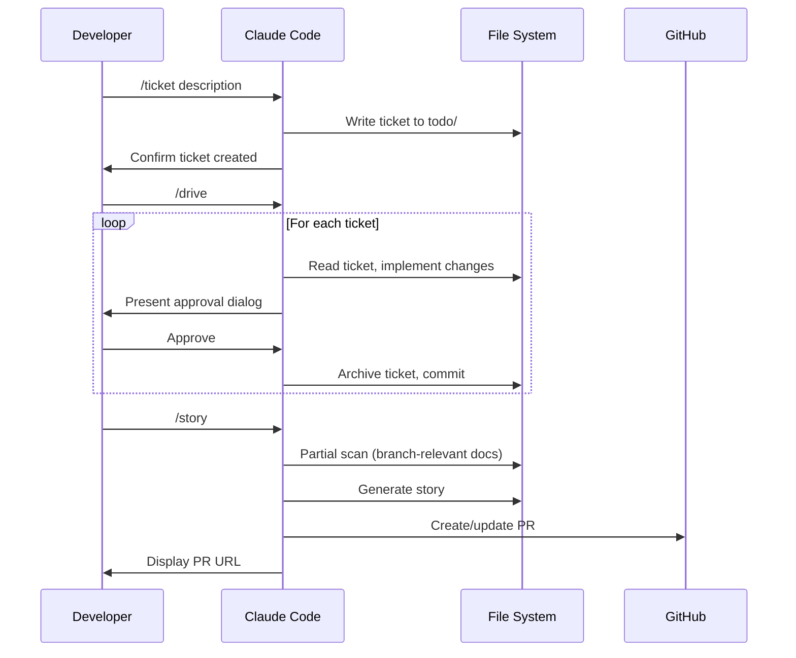

[English](usecase.md) | [Japanese](usecase_ja.md)

# 1. Use Case Viewpoint

The Use Case Viewpoint documents how developers interact with Workaholic through its four primary commands and one release command, describing the workflows, input/output contracts, and decision points in each use case. Every interaction follows a ticket-driven pattern where markdown files serve as both input and output.

## 2. Primary Use Cases

### 2-1. Create a Ticket (/ticket)

The `/ticket` command accepts a natural language description as its argument (e.g., `/ticket add dark mode toggle to settings page`). It delegates to the `ticket-organizer` subagent (model: opus), which orchestrates parallel discovery of codebase structure, existing tickets, and relevant history. The output is a markdown ticket file committed to `.workaholic/tickets/todo/` with validated frontmatter. The command handles duplicate detection, needs-decision scenarios, and needs-clarification situations through interactive prompts.

**Input:** Natural language description of desired change.
**Output:** Committed ticket file in `.workaholic/tickets/todo/<timestamp>-<slug>.md`.
**Decision Points:** Duplicate ticket detected, ambiguous scope requiring clarification, target directory (todo vs icebox).

### 2-2. Implement Tickets (/drive)

The `/drive` command implements tickets sequentially from the todo queue. It begins by invoking the `drive-navigator` subagent (model: opus) to prioritize and order tickets. For each ticket, it follows the `drive-workflow` skill to implement changes, then presents an approval dialog using `AskUserQuestion` with selectable options. The developer chooses "Approve", "Approve and stop", provides free-form feedback, or selects "Abandon". Approved tickets receive a Final Report section, are archived, and committed. The loop re-checks the todo directory for new tickets after processing each batch.

**Input:** Optional "icebox" argument to process icebox tickets.
**Output:** Committed implementations and archived tickets in `.workaholic/tickets/archive/<branch>/`.
**Decision Points:** Approval per ticket, abandon vs feedback, icebox processing, new ticket detection.

### 2-3. Update Documentation (/scan)

The `/scan` command updates `.workaholic/` documentation by invoking the `scanner` subagent (model: opus). The scanner runs 17 agents in parallel: 8 viewpoint analysts (stakeholder, model, usecase, infrastructure, application, component, data, feature), 7 policy analysts (test, security, quality, accessibility, observability, delivery, recovery), a changelog writer, and a terms writer. Output is validated before index files are updated. All changes are staged and committed as a single "Update documentation" commit.

**Input:** None.
**Output:** Updated spec files, policy files, changelog, terms, and index READMEs.
**Decision Points:** None (fully automated).

### 2-4. Partial Scan and Report (/story)

The `/story` command performs a partial documentation scan (only branch-relevant agents), then generates a development story and creates or updates a pull request. It first invokes the `scanner` subagent with partial mode, which uses `select-scan-agents` to determine which agents to run based on `git diff --stat`. After staging documentation changes, it invokes the `story-writer` subagent (model: opus) to produce a narrative and PR.

**Input:** None.
**Output:** Updated `.workaholic/` docs (partial), story file in `.workaholic/stories/`, GitHub pull request.
**Decision Points:** None (fully automated).

### 2-5. Generate Report (/report)

The `/report` command generates a development story and creates or updates a pull request without any scanning. It invokes the `story-writer` subagent (model: opus), which produces a narrative document in `.workaholic/stories/` and creates a GitHub PR. The PR description is derived from the story content. The command outputs the PR URL.

**Input:** None.
**Output:** Story file in `.workaholic/stories/`, GitHub pull request.
**Decision Points:** None (fully automated).

### 2-6. Release (/release)

The `/release` command bumps the version in `marketplace.json` and `plugin.json`, then commits the change. It defaults to patch version increments. The GitHub Action (`release.yml`) then creates a release when the change reaches `main`.

**Input:** Optional version bump type (major, minor, patch).
**Output:** Updated version files, committed version bump.
**Decision Points:** Version bump type.

## 3. Workflow Sequence

## 4. Input/Output Contracts

| Command | Input | Primary Output | Side Effects |
| --- | --- | --- | --- |
| `/ticket <desc>` | Natural language | `.workaholic/tickets/todo/*.md` | Git commit |
| `/drive` | None or "icebox" | Implemented code + archived tickets | Multiple git commits |
| `/scan` | None | Updated `.workaholic/` docs (full) | Git commit |
| `/story` | None | Updated docs (partial) + story + PR | Git commit, push, PR |
| `/report` | None | `.workaholic/stories/*.md` + PR | Git push, PR creation |
| `/release [type]` | Optional bump type | Updated version files | Git commit |

## 5. Assumptions

- [Explicit] The four primary commands and their input/output contracts are documented in `CLAUDE.md` and the individual command files.
- [Explicit] `/drive` requires explicit approval at each ticket via `AskUserQuestion`, as stated in the drive command's critical rules.
- [Explicit] `/scan` invokes 17 parallel agents as defined in `scanner.md`.
- [Inferred] The workflow is designed for linear, single-branch development where one developer works through tickets sequentially, based on the serial execution model and single-branch PR creation pattern.
- [Inferred] The absence of conflict resolution mechanisms suggests the system assumes a single active developer per branch at any given time.
