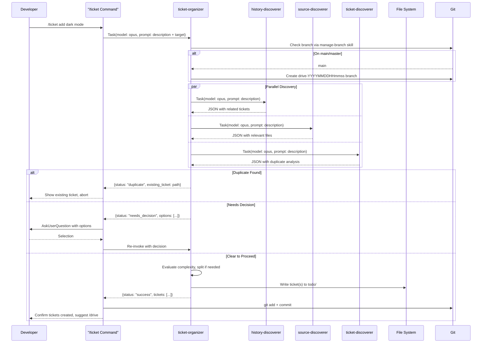
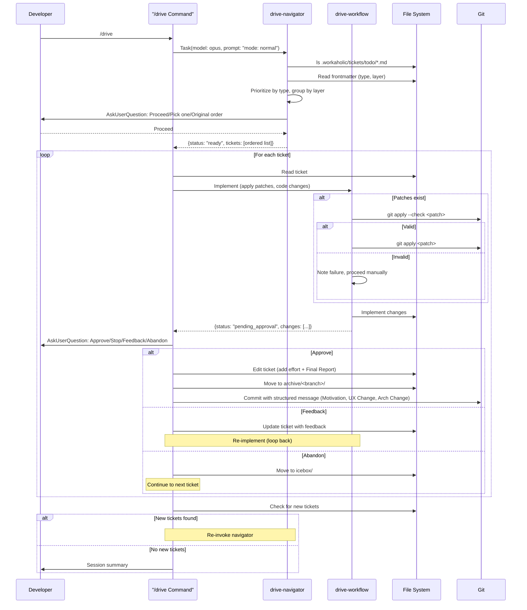
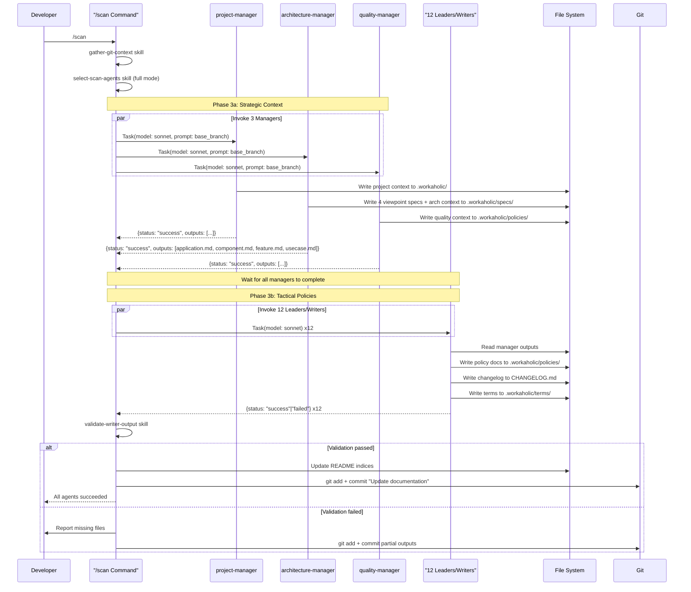
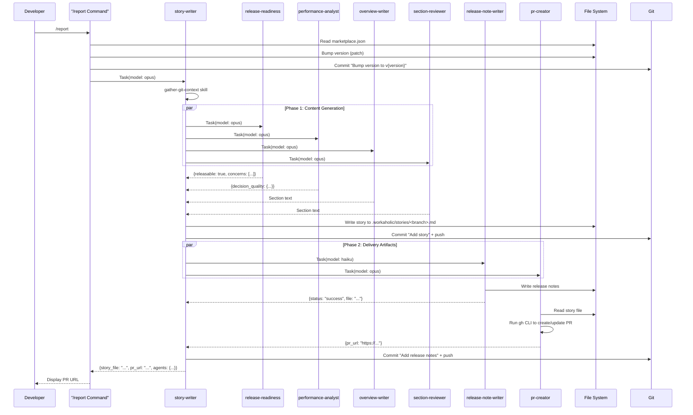
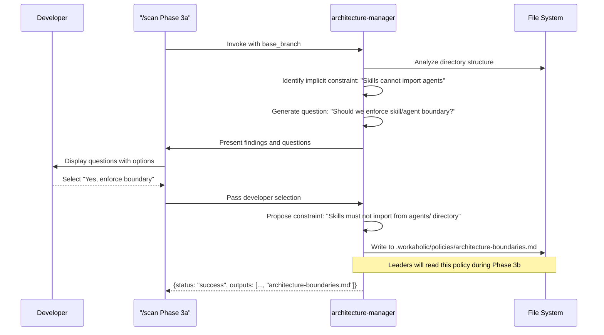

[English](usecase.md) | [Japanese](usecase_ja.md)

# Use Case Viewpoint

The Use Case Viewpoint documents how developers interact with Workaholic through its four primary commands, describing the workflows, input/output contracts, error paths, and decision points in each use case. Every interaction follows a ticket-driven pattern where markdown files serve as both input and output, enabling version control and human review at every stage. The recent addition of a manager tier introduces strategic context establishment as a new use case that runs automatically during documentation scans.

## Primary Workflows

Workaholic implements a ticket-driven development workflow consisting of four sequential phases: specification, implementation, documentation, and release. Each phase is supported by dedicated commands that orchestrate subagents and skills to automate repetitive tasks while maintaining developer control through explicit approval gates. The documentation phase now includes a two-phase execution model where managers establish strategic context before leaders produce domain-specific policies.

### Ticket Creation Workflow

The `/ticket` command accepts a natural language description as its argument and orchestrates comprehensive context discovery through parallel subagent invocation. The workflow begins by checking the current git branch using the `manage-branch` skill, creating a new topic branch with format `drive-YYYYMMDDHHmmss` if the developer is on main or master. After branch validation, the command invokes three discovery subagents concurrently via the Task tool: `history-discoverer` searches archived tickets for related work, `source-discoverer` identifies relevant source files and code patterns, and `ticket-discoverer` analyzes the todo and icebox queues for potential duplicates or overlap.

The `ticket-organizer` subagent synthesizes discovery results into implementation tickets following the format defined in the `create-ticket` skill. Each ticket includes YAML frontmatter with `created_at`, `author`, `type`, and `layer` fields, followed by markdown sections for Overview, Key Files, Related History, Implementation Steps, optional Patches, and Considerations. The subagent evaluates complexity and may split a single request into 2-4 discrete tickets when dealing with independent features or unrelated architectural layers. Tickets are written to `.workaholic/tickets/todo/` or `.workaholic/tickets/icebox/` based on the target parameter.

The command handles several moderation scenarios returned by `ticket-discoverer`: duplicate status triggers immediate termination with a reference to the existing ticket, needs-decision status presents the developer with merge/split options via `AskUserQuestion`, and needs-clarification status returns questions that the developer must answer before proceeding. Upon successful completion, the command stages ticket files with `git add` and commits them with message format "Add ticket for <short-description>", then instructs the developer to run `/drive` for implementation.

### Ticket Implementation Workflow

The `/drive` command implements tickets from `.workaholic/tickets/todo/` in an intelligent priority order determined by the `drive-navigator` subagent. The navigator lists all todo tickets using `ls -1 .workaholic/tickets/todo/*.md`, reads each ticket's frontmatter to extract `type` and `layer` fields, and applies a priority ranking where bugfix tickets take precedence over enhancement and refactoring tickets, which in turn precede housekeeping tickets. The navigator groups tickets by architectural layer to maximize context efficiency, presents the prioritized list to the developer via `AskUserQuestion` with selectable options (Proceed, Pick one, Original order), and returns a JSON object with status "ready" and an ordered ticket array.

For each ticket in the navigator's list, the drive command follows the `drive-workflow` skill: read the ticket to understand requirements, apply patches if a Patches section exists (using `git apply --check` for validation before `git apply`), implement changes according to Implementation Steps, run type checks per CLAUDE.md, and return a summary JSON with status "pending_approval". The command then invokes the `drive-approval` skill to present an approval dialog via `AskUserQuestion` with four selectable options: Approve (archive and continue), Approve and stop (archive and end session), provide free-form feedback (update ticket and re-implement), or Abandon (move to icebox without implementation).

When the developer approves a ticket, the command follows the `write-final-report` skill to add effort estimation and a Final Report section to the ticket file using the Edit tool. After verifying the frontmatter update succeeded, it invokes the `archive-ticket` skill which moves the ticket from todo to `.workaholic/tickets/archive/<branch>/` and commits with a structured message following the expanded `commit` skill guidelines: title line, blank line, Motivation section, UX Change section, Arch Change section, blank line, and co-authorship attribution. The archive operation fails immediately if frontmatter validation fails, preventing incomplete tickets from entering the archive. After processing all tickets from the navigator's list, the drive command re-checks the todo directory for tickets added mid-session and re-invokes the navigator if new tickets are found.

If the todo queue is empty, the navigator checks `.workaholic/tickets/icebox/` and asks the developer via `AskUserQuestion` whether to work on icebox tickets. The developer can select "Work on icebox" (triggering icebox mode) or "Stop" (ending the session). In icebox mode, the navigator lists icebox tickets and presents them as selectable options, moves the selected ticket to todo, and returns it for implementation. The drive command maintains session-wide counters tracking total tickets implemented, total commits created, and the list of all commit hashes across multiple navigator batches.

### Documentation Workflow

The `/scan` command updates `.workaholic/` documentation by invoking agents in a two-phase execution model. Phase 3a establishes strategic context through three manager agents. Phase 3b produces tactical documentation through twelve leader and writer agents that consume manager outputs. The command begins by gathering git context (branch, base_branch, repo_url) using the `gather-git-context` skill and retrieving the current commit hash via `git rev-parse --short HEAD`. It then runs the `select-scan-agents` skill with mode "full" to get the complete list of 15 agents organized by tier.

#### Phase 3a: Strategic Context Establishment

The scan command invokes three manager agents in parallel using the Task tool, each with model "sonnet" and base branch parameter. All invocations must use the default `run_in_background: false` parameter because agents need Write/Edit permissions which require interactive prompt access.

**project-manager**: Analyzes business context by reading README, CLAUDE.md, package metadata, CHANGELOG, git tags, git log, and ticket queues. Produces project context covering business domain, stakeholder map, timeline status, active issues, and proposed solutions. Writes output to `.workaholic/specs/` or `.workaholic/policies/` as appropriate. Follows constraint-setting workflow (Analyze, Ask, Propose, Produce) to establish project constraints like release cadence, stakeholder priorities, and scope boundaries.

**architecture-manager**: Analyzes system structure by examining directory organization, configuration files, and code patterns. Gathers context for four viewpoints (application, component, feature, usecase) using `analyze-viewpoint` skill. Produces architectural context including system boundaries, layer taxonomy, component inventory, cross-cutting concerns, and structural patterns. Writes four viewpoint spec documents (application.md, component.md, feature.md, usecase.md) to `.workaholic/specs/`. Follows constraint-setting workflow to establish architectural constraints like layer boundary rules, component naming conventions, and dependency direction policies.

**quality-manager**: Analyzes quality practices by examining test files, CI configuration, linting rules, and code review patterns. Produces quality context covering quality dimensions and standards, assurance process definitions, improvement metrics, identified gaps, and feedback loop specifications. Writes output to `.workaholic/policies/`. Follows constraint-setting workflow to establish quality constraints like test coverage thresholds, documentation completeness standards, and lint strictness levels.

The scan command waits for all three managers to complete before proceeding to phase 3b. Manager outputs are persisted as markdown files that serve as input for leader agents.

#### Phase 3b: Tactical Policy Production

After manager completion, the scan command invokes twelve leader and writer agents in parallel. Each leader agent reads relevant manager outputs as strategic input before performing domain-specific analysis.

**ux-lead**: Reads `manage-project` output for stakeholder context, then analyzes user experience aspects including interaction patterns, user journeys, and onboarding paths. Produces ux.md in `.workaholic/specs/`.

**infra-lead**: Reads `manage-architecture` output for system boundaries, then analyzes external dependencies, deployment configuration, and runtime environment. Produces infrastructure.md in `.workaholic/policies/`.

**db-lead**: Reads `manage-architecture` output for component inventory, then analyzes data formats, storage mechanisms, and persistence patterns. Produces data.md in `.workaholic/policies/`.

**security-lead**: Reads `manage-architecture` output for system boundaries and cross-cutting concerns, then analyzes security requirements, threat model, and mitigation strategies. Produces security.md in `.workaholic/policies/`.

**test-lead**: Reads `manage-quality` output for quality standards, then analyzes testing strategy, test types, and coverage requirements. Produces test.md in `.workaholic/policies/`.

**quality-lead**: Reads `manage-quality` output for assurance processes, then analyzes code quality standards, review processes, and quality gates. Produces quality.md in `.workaholic/policies/`.

**a11y-lead**: Reads `manage-quality` output for quality standards, then analyzes accessibility standards, WCAG conformance, and inclusive design practices. Produces accessibility.md in `.workaholic/policies/`.

**observability-lead**: Reads `manage-architecture` output for cross-cutting concerns, then analyzes logging, monitoring, and tracing practices. Produces observability.md in `.workaholic/policies/`.

**delivery-lead**: Reads `manage-project` output for timeline and stakeholder context, then analyzes release processes, deployment strategies, and rollback procedures. Produces delivery.md in `.workaholic/policies/`.

**recovery-lead**: Reads `manage-architecture` output for system boundaries and `manage-project` output for active issues, then analyzes backup strategies, disaster recovery procedures, and business continuity plans. Produces recovery.md in `.workaholic/policies/`.

**changelog-writer**: Reads archived tickets from `.workaholic/tickets/archive/<branch>/` and generates CHANGELOG.md entries organized by category (Added, Changed, Removed). Does not consume manager outputs.

**terms-writer**: Analyzes codebase terminology and generates consistent term definitions in `.workaholic/terms/`. Does not consume manager outputs.

After all twelve agents complete, the command validates output using the `validate-writer-output` skill for both `.workaholic/specs/` (5 files: ux, application, component, feature, usecase) and `.workaholic/policies/` (7 files: infra, db, security, test, quality, accessibility, observability, delivery, recovery). If validation passes, the scan command updates index files (README.md and README_ja.md) in both specs and policies directories following the `write-spec` skill's index file rules. It then stages all documentation changes with `git add CHANGELOG.md .workaholic/specs/ .workaholic/terms/ .workaholic/policies/` and commits with message "Update documentation". The command reports per-agent status showing which managers and leaders succeeded, failed, or were skipped, along with validation results.

### Report Generation Workflow

The `/report` command generates a development story and creates or updates a GitHub pull request without any documentation scanning. The command first bumps the version following CLAUDE.md Version Management section: reads the current version from `.claude-plugin/marketplace.json`, increments the PATCH component (e.g., 1.0.0 → 1.0.1), updates both `.claude-plugin/marketplace.json` and `plugins/core/.claude-plugin/plugin.json` with the new version, stages the version files, and commits with message "Bump version to v{new_version}".

After version bumping, the report command invokes the `story-writer` subagent (model: opus) which orchestrates parallel subagent invocation for story content generation. The story-writer gathers git context using `gather-git-context`, then invokes four agents in parallel: `release-readiness` analyzes branch for release readiness, `performance-analyst` evaluates decision quality, `overview-writer` generates overview and highlights, and `section-reviewer` produces outcome analysis and concerns. After waiting for all four agents to complete, the story-writer reads archived tickets using Glob pattern `.workaholic/tickets/archive/<branch>/*.md` and writes the story file following the `write-story` skill's content structure and templates.

The story-writer commits the story file, pushes the branch with `git push -u origin <branch-name>`, then invokes two more agents in parallel: `release-note-writer` (model: haiku) generates concise release notes in `.workaholic/release-notes/<branch>.md`, and `pr-creator` (model: opus) reads the story file, derives the PR title from the first Summary item, and runs the `create-pr` skill to execute `gh` CLI operations that create or update the pull request. The story-writer stages and commits release notes, pushes again, and returns a JSON object containing story_file path, release_note_file path, pr_url, and per-agent status. The report command displays the PR URL as mandatory output.

### Release Workflow

The `/release` command (not yet implemented but documented in CLAUDE.md) bumps the marketplace version and publishes a new release. It accepts an optional argument specifying version bump type (major, minor, or patch), defaulting to patch if not provided. The command reads the current version from `.claude-plugin/marketplace.json`, increments the appropriate version component, updates both `marketplace.json` and `plugins/core/.claude-plugin/plugin.json` to keep versions in sync, stages the changes, and commits with message "Bump version to v{new_version}". The GitHub Action `release.yml` then creates a release when the version bump commit reaches main.

## Command Contracts

### /ticket Command

**Invocation Format:** `/ticket <description>`

**Input Contract:**
- Required: Natural language description of desired change
- Optional: None
- Environment: Must be in a git repository

**Output Contract:**
- Success: One or more ticket files in `.workaholic/tickets/todo/` or `.workaholic/tickets/icebox/`
- Commit: "Add ticket for <short-description>"
- Response: JSON from ticket-organizer with status "success" and tickets array
- Side effects: May create new topic branch if on main/master

**Error Paths:**
- Duplicate detected: Returns status "duplicate" with existing_ticket path
- Ambiguous scope: Returns status "needs_clarification" with questions array
- Merge/split decision: Returns status "needs_decision" with options array
- Git failure: Command aborts without writing tickets

**Decision Points:**
- Branch creation (automatic if on main/master)
- Target directory (todo vs icebox, passed as argument to ticket-organizer)
- Ticket splitting (handled by ticket-organizer complexity evaluation)
- Duplicate handling (developer chooses whether to proceed or cancel)

### Ticket Creation Sequence

```mermaid
sequenceDiagram
    participant Dev as Developer
    participant Cmd as "/ticket Command"
    participant TO as ticket-organizer
    participant HD as history-discoverer
    participant SD as source-discoverer
    participant TD as ticket-discoverer
    participant FS as File System
    participant Git as Git

    Dev->>Cmd: /ticket add dark mode
    Cmd->>TO: Task(model: opus, prompt: description + target)
    TO->>Git: Check branch via manage-branch skill
    alt On main/master
        Git-->>TO: main
        TO->>Git: Create drive-YYYYMMDDHHmmss branch
    end

    par Parallel Discovery
        TO->>HD: Task(model: opus, prompt: description)
        HD-->>TO: JSON with related tickets
    and
        TO->>SD: Task(model: opus, prompt: description)
        SD-->>TO: JSON with relevant files
    and
        TO->>TD: Task(model: opus, prompt: description)
        TD-->>TO: JSON with duplicate analysis
    end

    alt Duplicate Found
        TO-->>Cmd: {status: "duplicate", existing_ticket: path}
        Cmd-->>Dev: Show existing ticket, abort
    else Needs Decision
        TO-->>Cmd: {status: "needs_decision", options: [...]}
        Cmd->>Dev: AskUserQuestion with options
        Dev-->>Cmd: Selection
        Cmd->>TO: Re-invoke with decision
    else Clear to Proceed
        TO->>TO: Evaluate complexity, split if needed
        TO->>FS: Write ticket(s) to todo/
        TO-->>Cmd: {status: "success", tickets: [...]}
        Cmd->>Git: git add + commit
        Cmd-->>Dev: Confirm tickets created, suggest /drive
    end
```

### /drive Command

**Invocation Format:** `/drive` or `/drive icebox`

**Input Contract:**
- Required: None
- Optional: "icebox" argument to enable icebox mode
- Environment: Requires `.workaholic/tickets/todo/` directory

**Output Contract:**
- Success: Multiple commits, each with format "<title>\n\nMotivation: ...\nUX Change: ...\nArch Change: ..."
- Side effects: Moves tickets from todo to `.workaholic/tickets/archive/<branch>/`
- Response: Summary of tickets implemented and commits created across all batches

**Error Paths:**
- Empty queue: Checks icebox, prompts developer, or returns "No tickets"
- Implementation blocked: Stops, asks developer to move to icebox/skip/abort
- Frontmatter update failure: Aborts archiving, reports error, does not proceed
- Patch apply failure: Notes failure, proceeds with manual implementation
- Type check failure: Halts before approval dialog, requires fix

**Decision Points:**
- Ticket priority order (developer confirms via AskUserQuestion)
- Per-ticket approval (Approve, Approve and stop, Feedback, Abandon)
- Icebox processing (developer chooses whether to work on icebox)
- New ticket detection (automatic re-check after each batch)

### Drive Implementation Sequence

```mermaid
sequenceDiagram
    participant Dev as Developer
    participant Cmd as "/drive Command"
    participant Nav as drive-navigator
    participant Wf as drive-workflow
    participant FS as File System
    participant Git as Git

    Dev->>Cmd: /drive
    Cmd->>Nav: Task(model: opus, prompt: "mode: normal")
    Nav->>FS: ls .workaholic/tickets/todo/*.md
    Nav->>FS: Read frontmatter (type, layer)
    Nav->>Nav: Prioritize by type, group by layer
    Nav->>Dev: AskUserQuestion: Proceed/Pick one/Original order
    Dev-->>Nav: Proceed
    Nav-->>Cmd: {status: "ready", tickets: [ordered list]}

    loop For each ticket
        Cmd->>FS: Read ticket
        Cmd->>Wf: Implement (apply patches, code changes)
        alt Patches exist
            Wf->>Git: git apply --check <patch>
            alt Valid
                Wf->>Git: git apply <patch>
            else Invalid
                Wf->>Wf: Note failure, proceed manually
            end
        end
        Wf->>FS: Implement changes
        Wf-->>Cmd: {status: "pending_approval", changes: [...]}
        Cmd->>Dev: AskUserQuestion: Approve/Stop/Feedback/Abandon

        alt Approve
            Cmd->>FS: Edit ticket (add effort + Final Report)
            Cmd->>FS: Move to archive/<branch>/
            Cmd->>Git: Commit with structured message (Motivation, UX Change, Arch Change)
        else Feedback
            Cmd->>FS: Update ticket with feedback
            Note over Cmd,Wf: Re-implement (loop back)
        else Abandon
            Cmd->>FS: Move to icebox/
            Note over Cmd: Continue to next ticket
        end
    end

    Cmd->>FS: Check for new tickets
    alt New tickets found
        Note over Cmd,Nav: Re-invoke navigator
    else No new tickets
        Cmd->>Dev: Session summary
    end
```

### /scan Command

**Invocation Format:** `/scan`

**Input Contract:**
- Required: None
- Optional: None
- Environment: Must be in a git repository with `.workaholic/` directory

**Output Contract:**
- Success: Updated documentation in `.workaholic/specs/`, `.workaholic/policies/`, `CHANGELOG.md`, `.workaholic/terms/`
- Commit: "Update documentation"
- Response: Per-agent status for all 15 agents (3 managers + 12 leaders/writers)
- Side effects: Updates README indices in specs and policies directories

**Error Paths:**
- Validation failure: Reports missing files but still commits partial success
- Agent failure: Reports failed agents but proceeds with successful outputs
- Git operation failure: Aborts without committing

**Decision Points:**
- Agent selection (full vs partial mode based on git diff analysis)

### Scan Two-Phase Execution Sequence

```mermaid
sequenceDiagram
    participant Dev as Developer
    participant Cmd as "/scan Command"
    participant PM as project-manager
    participant AM as architecture-manager
    participant QM as quality-manager
    participant Leaders as "12 Leaders/Writers"
    participant FS as File System
    participant Git as Git

    Dev->>Cmd: /scan
    Cmd->>Cmd: gather-git-context skill
    Cmd->>Cmd: select-scan-agents skill (full mode)

    Note over Cmd,QM: Phase 3a: Strategic Context

    par Invoke 3 Managers
        Cmd->>PM: Task(model: sonnet, prompt: base_branch)
        Cmd->>AM: Task(model: sonnet, prompt: base_branch)
        Cmd->>QM: Task(model: sonnet, prompt: base_branch)
    end

    PM->>FS: Write project context to .workaholic/
    AM->>FS: Write 4 viewpoint specs + arch context to .workaholic/specs/
    QM->>FS: Write quality context to .workaholic/policies/

    PM-->>Cmd: {status: "success", outputs: [...]}
    AM-->>Cmd: {status: "success", outputs: [application.md, component.md, feature.md, usecase.md]}
    QM-->>Cmd: {status: "success", outputs: [...]}

    Note over Cmd,Leaders: Wait for all managers to complete

    Note over Cmd,Leaders: Phase 3b: Tactical Policies

    par Invoke 12 Leaders/Writers
        Cmd->>Leaders: Task(model: sonnet) x12
    end

    Leaders->>FS: Read manager outputs
    Leaders->>FS: Write policy docs to .workaholic/policies/
    Leaders->>FS: Write changelog to CHANGELOG.md
    Leaders->>FS: Write terms to .workaholic/terms/

    Leaders-->>Cmd: {status: "success"|"failed"} x12

    Cmd->>Cmd: validate-writer-output skill
    alt Validation passed
        Cmd->>FS: Update README indices
        Cmd->>Git: git add + commit "Update documentation"
        Cmd-->>Dev: All agents succeeded
    else Validation failed
        Cmd->>Dev: Report missing files
        Cmd->>Git: git add + commit partial outputs
    end
```

### /report Command

**Invocation Format:** `/report`

**Input Contract:**
- Required: None
- Optional: None
- Environment: Must be on a feature branch with archived tickets

**Output Contract:**
- Success: Story file in `.workaholic/stories/<branch>.md`, release notes in `.workaholic/release-notes/<branch>.md`, GitHub PR created/updated
- Commits: "Bump version to v{version}", "Add story", "Add release notes"
- Response: PR URL
- Side effects: Increments patch version, pushes branch to remote

**Error Paths:**
- No archived tickets: Story generation may produce minimal content
- PR creation failure: Reports error but story/notes are still committed
- Git push failure: Aborts before PR creation

**Decision Points:**
- None (fully automated after invocation)

### Report Generation Sequence

```mermaid
sequenceDiagram
    participant Dev as Developer
    participant Cmd as "/report Command"
    participant SW as story-writer
    participant RR as release-readiness
    participant PA as performance-analyst
    participant OW as overview-writer
    participant SR as section-reviewer
    participant RNW as release-note-writer
    participant PC as pr-creator
    participant FS as File System
    participant Git as Git

    Dev->>Cmd: /report
    Cmd->>FS: Read marketplace.json
    Cmd->>FS: Bump version (patch)
    Cmd->>Git: Commit "Bump version to v{version}"

    Cmd->>SW: Task(model: opus)
    SW->>SW: gather-git-context skill

    par Phase 1: Content Generation
        SW->>RR: Task(model: opus)
        SW->>PA: Task(model: opus)
        SW->>OW: Task(model: opus)
        SW->>SR: Task(model: opus)
    end

    RR-->>SW: {releasable: true, concerns: [...]}
    PA-->>SW: {decision_quality: {...}}
    OW-->>SW: Section text
    SR-->>SW: Section text

    SW->>FS: Write story to .workaholic/stories/<branch>.md
    SW->>Git: Commit "Add story" + push

    par Phase 2: Delivery Artifacts
        SW->>RNW: Task(model: haiku)
        SW->>PC: Task(model: opus)
    end

    RNW->>FS: Write release notes
    RNW-->>SW: {status: "success", file: "..."}

    PC->>FS: Read story file
    PC->>PC: Run gh CLI to create/update PR
    PC-->>SW: {pr_url: "https://..."}

    SW->>Git: Commit "Add release notes" + push
    SW-->>Cmd: {story_file: "...", pr_url: "...", agents: {...}}

    Cmd-->>Dev: Display PR URL
```

## Use Case Dependencies

### Workflow Sequence

The typical development session follows this sequence:

1. **Specification**: `/ticket` creates tickets based on natural language descriptions
2. **Implementation**: `/drive` implements and archives tickets one by one with approval
3. **Strategic Documentation**: `/scan` phase 3a establishes project, architecture, and quality context via managers
4. **Tactical Documentation**: `/scan` phase 3b produces policy documents via leaders that consume manager outputs
5. **Delivery**: `/report` generates story, creates PR, and bumps version
6. **Release**: Auto-release or manual `/release` publishes to marketplace

### Cross-Command Data Flow

```mermaid
flowchart LR
    T["/ticket"] --> TD[Ticket Files]
    TD --> D["/drive"]
    D --> AT[Archived Tickets]
    AT --> SP3a["/scan Phase 3a"]
    SP3a --> MO[Manager Outputs]
    MO --> SP3b["/scan Phase 3b"]
    SP3b --> LO[Leader Outputs]
    LO --> R["/report"]
    R --> PR[Pull Request]
    PR --> M[Merge to main]
    M --> REL[Auto-release]
```

## Constraint-Setting Use Case

The manager tier introduces a new interactive use case for establishing project constraints. This use case runs automatically during `/scan` phase 3a when managers detect unbounded or implicit constraints.

### Constraint Setting Workflow

1. **Analyze**: Manager examines codebase to identify areas needing constraints
   - Unbounded areas where no constraint exists
   - Implicit constraints that are practiced but undocumented
   - Existing constraints that may be outdated or conflicting

2. **Ask**: Manager presents targeted questions via command output
   - Each question offers concrete options grounded in analysis
   - Questions are decision-oriented, not open-ended
   - Developer reviews questions and provides selections

3. **Propose**: Manager formulates constraints based on analysis and developer answers
   - Each constraint states what it bounds, why it matters, and which leaders it affects
   - Constraints are falsifiable (leaders can determine compliance)

4. **Produce**: Manager writes directional materials encoding constraints
   - Policies (rules that must be followed)
   - Guidelines (recommended practices with rationale)
   - Roadmaps (sequenced plans with milestones)
   - Decision Records (captured decisions with context and consequences)

### Example: Architecture Manager Constraint Setting

```mermaid
sequenceDiagram
    participant Dev as Developer
    participant Scan as "/scan Phase 3a"
    participant AM as architecture-manager
    participant FS as File System

    Scan->>AM: Invoke with base_branch
    AM->>FS: Analyze directory structure
    AM->>AM: Identify implicit constraint: "Skills cannot import agents"
    AM->>AM: Generate question: "Should we enforce skill/agent boundary?"

    AM->>Scan: Present findings and questions
    Scan->>Dev: Display questions with options
    Dev-->>Scan: Select "Yes, enforce boundary"
    Scan->>AM: Pass developer selection

    AM->>AM: Propose constraint: "Skills must not import from agents/ directory"
    AM->>FS: Write to .workaholic/policies/architecture-boundaries.md

    Note over AM,FS: Leaders will read this policy during Phase 3b

    AM-->>Scan: {status: "success", outputs: [..., "architecture-boundaries.md"]}
```

## Assumptions

- [Explicit] The `/ticket` command delegates entirely to ticket-organizer, which invokes 3 discovery agents in parallel, as documented in ticket command instructions.
- [Explicit] The `/drive` command processes tickets sequentially with human approval between each, as documented in drive command instructions.
- [Explicit] The `/scan` command uses two-phase execution (managers in phase 3a, leaders in phase 3b) as documented in scan.md Phases 3a and 3b.
- [Explicit] The `/report` command delegates to story-writer, which orchestrates 4 agents in phase 1 and 2 agents in phase 2, as documented in report command instructions.
- [Explicit] Manager agents follow a constraint-setting workflow (Analyze, Ask, Propose, Produce) as defined in managers-policy skill.
- [Explicit] Leader agents read manager outputs before performing domain-specific analysis, as defined in their Execution policies.
- [Explicit] The architecture-manager produces four viewpoint specs (application, component, feature, usecase) during phase 3a, as documented in manage-architecture skill.
- [Explicit] Commands use `AskUserQuestion` with selectable options to prevent ambiguous user input, as demonstrated in drive-navigator and drive-approval.
- [Explicit] All scan agents must use `run_in_background: false` to retain Write/Edit permissions, as documented in scan command Phase 3.
- [Explicit] Commit messages follow an expanded format (Motivation, UX Change, Arch Change) as defined in the commit skill.
- [Inferred] The two-phase scan execution was introduced to eliminate strategic context duplication where each of 17 analysts independently inferred project priorities, architecture, and quality expectations.
- [Inferred] The constraint-setting workflow is designed to produce actionable, falsifiable constraints rather than aspirational recommendations that leaders cannot enforce.
- [Inferred] The manager-to-leader information flow is file-based (via `.workaholic/` documents) rather than in-memory to ensure all intermediate context is inspectable and version-controlled.
- [Inferred] The drive command's sequential processing (one ticket at a time) prioritizes human oversight and context preservation over throughput.
- [Inferred] The report command's automatic version bump ensures every branch triggers a releasable state, reducing friction in the release process.
